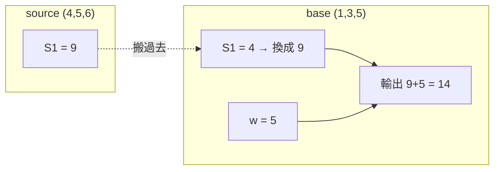

> 🌏 [English version](/posts/ai/2026-09-29-cs224u-causal-abstraction-iit-das-en)

**本文依據 [CS224U](https://web.stanford.edu/class/cs224u/) 2023 春季版。** 這是 [Stanford CS224U 導讀](/posts/ai/2026-08-21-stanford-cs224u-natural-language-understanding)系列第 12 篇，接續[解釋方法 I](/posts/ai/2026-09-29-cs224u-analysis-probing-attribution)，範圍是 Analysis methods 單元的後半：causal abstraction、interchange intervention training（IIT）、distributed alignment search（DAS）與單元結論。

用到的官方材料有四份：投影片 [Analysis methods in NLP](https://web.stanford.edu/class/cs224u/slides/cs224u-analysis-2023-handout.pdf) 第 41–61 頁、播放清單的影片 36–37、repo 裡的 [`iit_equality.ipynb`](https://github.com/cgpotts/cs224u/blob/main/iit_equality.ipynb)，加上它依賴的 [`iit.py`](https://github.com/cgpotts/cs224u/blob/main/iit.py) 與 [`torch_deep_neural_classifier_iit.py`](https://github.com/cgpotts/cs224u/blob/main/torch_deep_neural_classifier_iit.py)。存取等級是 **A3（歷史版）**。

這是整個系列最陡的一篇。以下只講直覺，並用 notebook 的 equality task 當貫穿的例子，形式定義收在折疊區塊裡。

## 課程影片來源

下列影片連結已列於本文對應講次的來源。

```youtube
url: https://www.youtube.com/watch?v=6pwpOOj33aw
title: 影片 36：Causal Abstraction & Interchange Intervention Training (IIT)
```

```youtube
url: https://www.youtube.com/watch?v=fSx1Vj0BZj0
title: 影片 37：Distributed Alignment Search (DAS) & Conclusion
```

原始影片：[影片 36：Causal Abstraction & Interchange Intervention Training (IIT)](https://www.youtube.com/watch?v=6pwpOOj33aw)、[影片 37：Distributed Alignment Search (DAS) & Conclusion](https://www.youtube.com/watch?v=fSx1Vj0BZj0)

課程與錄影入口：

- [XCS224U Spring 2023 YouTube 播放清單](https://www.youtube.com/playlist?list=PLoROMvodv4rOwvldxftJTmoR3kRcWkJBp)
- [官方課程／講次來源](https://web.stanford.edu/class/cs224u/)

## 先記住上一篇卡在哪

上一篇的加法網路裡，probe 說 L2 存了 x + y，但 L2 對輸出的權重是 0。**有資訊，不代表有用到。** probing 回答不了「模型是不是靠這個在做決定」。這篇的工具要回答的正是這一題，而且回答的方式是直接動手改模型的內部狀態。

Potts 在影片 36 開頭說，這類方法是他深度參與開發的。下面的研究發現也大多來自他的團隊。

## Causal abstraction 的三步

投影片第 42 頁：

1. 對目標模型的因果結構提一個假說，可以寫成一段小程式（高階因果模型）。
2. 找一個**對齊（alignment）**：高階模型的每個變數，對應到神經網路裡的哪一組神經元。
3. 做 **interchange intervention** 來檢驗這個對齊。

### Interchange intervention：搬一個值過去，看輸出怎麼變

沿用加法例子。高階模型是 S1 = x + y、w = z、輸出 = S1 + w。假說是：神經網路的 L3 扮演 S1 的角色。

先在高階模型上做。base 輸入 (1, 3, 5) 輸出 9，source 輸入 (4, 5, 6) 輸出 15。把 source 的 S1（4 + 5 = 9）搬進 base 的 S1，輸出變成 9 + 5 = **14**。高階模型我們完全理解，所以結果是已知的。

再到神經網路上做同一件事：跑 source，取出 L3 的值，塞進跑 base 時的 L3，看輸出。**如果也是 14**，就是一筆「L3 與 S1 扮演相同因果角色」的證據。



同樣可以檢驗 L1 ↔ w：把 source 的 w（6）搬進 base，高階模型輸出 4 + 6 = 10，神經網路也該是 10。如果不管怎麼介入 L2，輸出都不變，就證明了 L2 對行為沒有因果作用。

假如每一種可能輸入都通過，就證明了高階模型是神經網路的一個**抽象**。影片 36 的說法是，這時你可以「讓神經網路退場」，完全用高階模型推理。

### 現實版：IIA

現實中做不到兩件事：試遍所有輸入（連三數加法都有無限多種），以及得到完美的對應（自然訓練出來的模型很亂）。所以需要一個分級的分數。投影片第 44 頁定義 **interchange intervention accuracy（IIA）**：在選定的對齊下，介入後輸出與高階模型一致的比例。它有幾個性質：

- 範圍是 0 到 1，跟一般準確率一樣。
- **可能高於任務準確率**：介入有時把模型推到更好的狀態。影片裡說他們真的遇過。
- **對你選了哪些介入非常敏感**。
- 最有說服力的是那些**應該改變輸出標籤**的介入，要特別數清楚有多少。

**怎麼做**：報 IIA 時，同時報「會改變標籤的介入占幾成」，不要只給一個總分。

### 課程引用的發現

投影片第 45 頁列了四項。影片 36 特別強調，「because」是刻意的因果措辭：

- 微調過的 BERT 能答對詞彙蘊含與否定的困難域外例子，**because** 它們可以被簡單的 monotonicity 程式抽象（Geiger et al. 2020）。
- 微調過的 BERT 能解 MQNLI，**because** 它們找到組合式解法（Geiger et al. 2021）。
- 模型能解 MNIST Pointer Value Retrieval，**because** 它們可以被「如果數字是 6，標籤就在左下」這類簡單程式抽象。
- BART 與 T5 使用隨對話推進而演變的實體與情境表徵（Li et al. 2021）。

## 走一遍 iit_equality.ipynb

這份 notebook 的作者是 Atticus Geiger，版本字串是「CS224u, Stanford, Spring 2023」。

### 任務與高階模型

**Hierarchical equality task**：輸入兩對物件，如果兩對「都相同」或「都不同」就是 True，否則 False。`AABB` 與 `ABCD` 是 True，`ABCC` 與 `BBCD` 是 False。

高階模型把相等判斷做三次：V1 = 前兩個是否相同，V2 = 後兩個是否相同，輸出 = V1 是否等於 V2。

在 notebook 裡，每個物件是一個 4 維隨機向量，所以一筆輸入是 16 維。網路是三層隱藏層的前饋分類器。

### 準確率 0.99 的網路，沒有照這個程式算

notebook 存檔的輸出裡，這個網路訓練集準確率 1.00，測試集 0.99。

接著提出一個對齊假說：V1 在第一隱藏層的前 4 個神經元，V2 在接下來 4 個。取 100 筆測試例兩兩配對，共 10,000 組 base／source 做 interchange intervention。V1 的 IIA 是 **0.50**，V2 是 **0.54**，跟亂猜差不多。

在這個對齊下，沒有證據顯示網路在算這兩個相等關係。準確率很高，內部機制卻不是你以為的那樣。這正是行為評估看不到的地方。

### IIT：把因果結構訓練進去

既然知道高階模型在介入後「應該」輸出什麼，這就是一個監督訊號。IIT 做的事情是：照樣做 interchange intervention，但不只拿來評估，還用高階模型的反事實標籤算 loss、反向傳播。

影片 36 點出一個細節。被介入的位置是把 source 的整個計算圖（含梯度資訊）搬過來，所以那個位置會同時從 base 與 source 兩條路收到更新，他稱之為 double update。重複訓練之後，網路會被推向把 S1 的資訊**模組化地**放在你指定的位置。

notebook 的結果（存檔輸出）：

| 設定 | 標準評估 | V1 反事實 | V2 反事實 |
|---|---|---|---|
| 未做 IIT | 測試 0.99 | 0.50 | 0.54 |
| 只對 V1 做 IIT | 1.00 | 1.00 | 0.50 |
| 對 V1、V2 都做 IIT | 1.00 | 1.00 | 1.00 |

只訓練 V1 的位置，V2 仍然是亂猜。你要求什麼結構，模型才長出什麼結構。

投影片第 50 頁列的 IIT 應用有四項：在 MNIST-PVR 與 ReaSCAN 上拿到當時最佳結果；加進蒸餾目標，讓學生模型不只模仿老師的輸出，也在反事實下模仿內部表徵；在 subword 語言模型裡誘導出字元層級的表徵；以及 causal proxy models 這種概念層級的解釋方法。

回到上一篇的計分表，Potts 說 intervention-based 方法到這裡三格全滿：能描述表徵、能做因果推論、能改進模型。

<details>
<summary>形式定義（notebook 的表述與實作介面）</summary>

notebook 的說法：

> "an high-level model is a causal abstraction of a neural network if and only if for all base and source inputs, the algorithm and network provides the same output, for some alignment between these two models."

實作上，對齊以 `{"layer": 1, "start": 0, "end": embedding_dim}` 這種座標表示。`InterventionableTorchDeepNeuralClassifier.retrieve_activations(input, get, sets)` 用 PyTorch hook 讀取或覆寫指定座標的激活值。`iit.get_IIT_equality_dataset(variable, embed_dim, size)` 產生 base、sources、base 標籤、反事實標籤與介入位置 ID。`TorchDeepNeuralClassifierIIT` 用 `id_to_coords` 把介入 ID 對應到座標。

閱讀時注意一處小出入：「The algorithm with an intervention」那段文字寫把 V1 設為 False，但程式碼傳的是 `{"V1": True}`。後面的敘述（從 False 變成 True）與程式碼一致。

</details>

## DAS：如果答案不在標準座標軸上

投影片第 53 頁承認 intervention 方法還有兩個問題：

1. **對齊搜尋很貴**：高階變數與神經元集合的配對方式，在大模型上是天文數字，只能近似，很容易漏掉好的對齊。
2. **可能根本找不到真正存在的結構**，因為我們預設在「標準基底」上找，也就是一個變數對應幾個完整的神經元。

投影片第 54–56 頁用布林 AND 說明第二點。高階模型是 V1 = p、V2 = q、V3 = V1 ∧ V2。神經網路有兩個隱藏單元 H1、H2，權重是轉了 20 度的矩陣，行為上完全正確。直覺的對齊 V1 ↔ H1、V2 ↔ H2 會讓 interchange intervention 失敗：高階模型說該輸出 True，網路輸出負值，也就是 False。影片 37 揭曉原因：這個例子故意讓正確對應是 V1 ↔ H2、V2 ↔ H1。但只要把 [H1, H2] 旋轉 −20 度，對齊關係就成立了。

影片 37 的原話：

> "It's intuitive for us as humans, but there's no reason to presume that our neural models prefer to operate in that basis."

DAS 的做法是**凍結模型參數，只學一個旋轉矩陣 R**。先把目標表徵轉到新基底，在新基底上做 interchange intervention，再轉回來，訓練目標是最大化 IIA。它結合了 IIT 的訓練手法與 causal abstraction 的分析立場。模型不動，是因為目的是解釋它，不是改它。

投影片第 58 頁的 DAS 發現：

- 模型對 hierarchical equality task（就是 notebook 那個）學到的確實是階層式解法，只是標準的 causal abstraction 容易漏掉。
- 模型學到的詞彙蘊含與否定理論很脆弱，保留的是詞項本身的身分，而不是一般化的解法。這為前面 Geiger et al. 2020 的結論補上更細的限定。
- [Wu et al. 2023](https://arxiv.org/abs/2305.08809) 把 DAS 擴展到 7B 參數的 Alpaca，發現它用一個直覺的演算法解數值推理任務。影片 37 的說法是，改成「學」對齊、不再「搜尋」對齊，才讓這種規模變得可行。

注意：repo 裡**沒有 DAS 的 notebook**。`iit_equality.ipynb` 只涵蓋 causal abstraction 與 IIT，DAS 只能讀投影片、影片與[原論文](https://arxiv.org/abs/2303.02536)。

## 放在更大的文獻裡

投影片第 46 頁把 causal abstraction 連到一串相關方法：constructive abstraction、causal mediation analysis、role learning networks、CausaLM、amnesic probing、causal scrubbing，以及 [Circuits](https://distill.pub/2020/circuits/)（講次表上的指定閱讀，另列了 induction heads 與 GPT-2 的 indirect object identification circuit）。想看這些方法怎麼統一在 causal abstraction 底下，投影片推薦 [SAIL 的 causal abstraction 部落格文章](https://ai.stanford.edu/blog/causal-abstraction/)。

## 單元結論

投影片第 60–61 頁回到開頭那張圖：偏見、核准用途、安全這些正面保證，都需要對模型的分析性保證。Potts 列出他眼中近期可解釋性研究的四個方向：

1. 因果解釋
2. 人類看得懂的解釋。只有因果不夠，否則把 transformer 的數學寫出來就算解釋了。
3. 應用到越來越大的指令微調 LLM
4. 越來越多證據顯示，模型正在歸納出一套**語意**，也就是從語言到概念網路的映射

最後一點接回了[組合性那篇](/posts/ai/2026-09-29-cs224u-compositionality-recogs-hw3)的 COGS／ReCOGS 討論。

**怎麼做**：今晚打開 `iit_equality.ipynb`，只跑到「Evaluation」那一節為止。它只 import repo 內的模組（`torch_deep_neural_classifier`、`torch_deep_neural_classifier_iit`、`iit`、`utils`）加上 PyTorch 與 scikit-learn，不需要下載資料或預訓練模型。你會親眼看到準確率 0.99 的網路拿到約 0.5 的 IIA。再往下跑 IIT 那節，看同一個數字變成 1.00。

## 這一篇可以確認與不能確認的

可以確認：講次表的閱讀清單、投影片內容、影片 36–37 的講述、notebook 的程式與存檔輸出。你重跑時，數字會隨隨機種子與環境略有差異。不能確認：Quiz 4 的題目（Canvas 需登入）、教室錄影裡的延伸討論。DAS 論文在投影片上標為「Ms., Stanford University」，是 2023 年上課時的稿件狀態；本文不評論它之後的發表版本。

延伸閱讀：站上 [CS224N 的 interpretability 導讀](/posts/ai/2026-08-22-cs224n-interpretability)走的是 agentic interpretability 與概念發現的路線，可以對照。

系列導覽：上一篇 [解釋方法 I：probing 與 feature attribution](/posts/ai/2026-09-29-cs224u-analysis-probing-attribution)｜下一篇 [方法與指標 I：分類與生成指標](/posts/ai/2026-09-29-cs224u-methods-metrics)

## 更新紀錄

- 2026-10-10：補上課程影片來源與錄影取得方式。

## 參考資料

- [CS224U: Natural Language Understanding（Spring 2023 課程官網與講次表）](https://web.stanford.edu/class/cs224u/)
- [Analysis methods in NLP 投影片（Potts, 2023）](https://web.stanford.edu/class/cs224u/slides/cs224u-analysis-2023-handout.pdf)
- [影片 36：Causal Abstraction & Interchange Intervention Training (IIT)](https://www.youtube.com/watch?v=6pwpOOj33aw)
- [影片 37：Distributed Alignment Search (DAS) & Conclusion](https://www.youtube.com/watch?v=fSx1Vj0BZj0)
- [XCS224U Spring 2023 YouTube 播放清單](https://www.youtube.com/playlist?list=PLoROMvodv4rOwvldxftJTmoR3kRcWkJBp)
- [iit_equality.ipynb（cgpotts/cs224u）](https://github.com/cgpotts/cs224u/blob/main/iit_equality.ipynb)
- [iit.py](https://github.com/cgpotts/cs224u/blob/main/iit.py)
- [torch_deep_neural_classifier_iit.py](https://github.com/cgpotts/cs224u/blob/main/torch_deep_neural_classifier_iit.py)
- [Geiger et al. 2022：Faithful, Interpretable Model Explanations via Causal Abstraction（SAIL blog）](https://ai.stanford.edu/blog/causal-abstraction/)
- [Geiger, Wu, et al. 2022：Inducing Causal Structure for Interpretable Neural Networks（ICML 2022）](https://proceedings.mlr.press/v162/geiger22a.html)
- [Geiger, Wu, et al. 2023：Finding Alignments Between Interpretable Causal Variables and Distributed Neural Representations（DAS）](https://arxiv.org/abs/2303.02536)
- [Wu et al. 2023：Interpretability at Scale: Identifying Causal Mechanisms in Alpaca](https://arxiv.org/abs/2305.08809)
- [Geiger, Carstensen, Frank, and Potts 2020：Relational reasoning and generalization using non-symbolic neural networks](https://arxiv.org/abs/2006.07968)
- [Cammarata et al. 2020：Thread: Circuits（Distill）](https://distill.pub/2020/circuits/)
