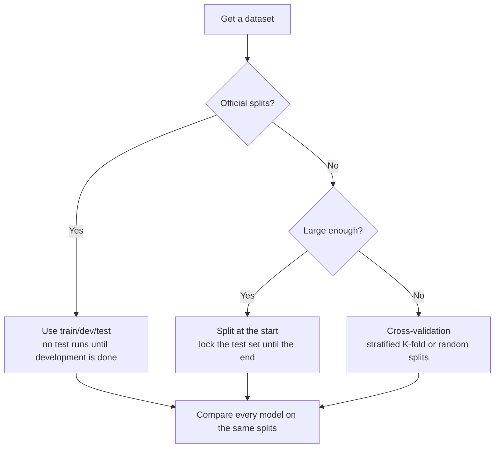

> 🌏 [中文版](/posts/ai/2026-09-29-cs224u-datasets-model-evaluation)

**Video status: Official entry or recording index only.** [Source details](#course-video-sources)

**This post is based on the Spring 2023 edition of CS224U.** It is part 14 of the [Reading Stanford CS224U](/posts/ai/2026-08-21-stanford-cs224u-natural-language-understanding-en) series. The previous part, [Methods and Metrics I](/posts/ai/2026-09-29-cs224u-methods-metrics-en), covered how scores get computed: confusion matrices, averaged F1, BLEU, and perplexity. This part takes the next question. **Even with the right metric, will your experiment convince a reviewer who doesn't trust you?**

The course answers that in the last three sections of the same [methods slide deck](https://web.stanford.edu/class/cs224u/slides/cs224u-methods-2023-handout.pdf): Datasets, Data organization, and Model evaluation. They match videos 42 to 44 in the [YouTube playlist](https://www.youtube.com/playlist?list=PLoROMvodv4rOwvldxftJTmoR3kRcWkJBp) and the repo's [evaluation_methods.ipynb](https://github.com/cgpotts/cs224u/blob/main/evaluation_methods.ipynb). The deck's "Associated materials" slide also assigns [Appendix B](http://www.cs.cmu.edu/~nasmith/LSP/) of Noah Smith's *Linguistic Structure Prediction*. That appendix is titled Experimentation. It covers train/dev/test, cross-validation, comparison without replication, and hypothesis testing.

## Course video sources

Official course and existing recording entries are linked below. A single public video matching this article has not been verified for embedding.

Course and recording entries:

- [XCS224U Spring 2023 YouTube playlist](https://www.youtube.com/playlist?list=PLoROMvodv4rOwvldxftJTmoR3kRcWkJBp)
- [Official course / lecture source](https://web.stanford.edu/class/cs224u/)

## Where this unit sits in the course

In the 2023 [schedule](https://web.stanford.edu/class/cs224u/), the "NLP methods" unit spans May 17, 22, and 24. The same block lists Experiment protocol overview, NLP methods and metrics, and a guest session by [Kawin Ethayarajh](https://kawine.github.io/), "Real-world NLP assessments." The experiment protocol was due May 29.

The unit states its purpose plainly. Slide 3 is titled "Goal: Help you with your projects." The notebook opens the same way. It says the teaching team will pay special attention to how you run your evaluations. Treat this unit as the operating manual for the final project, not a standalone theory lecture.

**Access (A3, historical edition):** the slides, three videos, and two notebooks are public. Kawin's guest session is not. The schedule gives it no slide link, and the playlist has no matching video, so this post does not describe it.

| Material | Status |
|---|---|
| Methods slides: Datasets / Data org. / Model evaluation | Public PDF |
| Videos 42 Datasets, 43 Data Organization, 44 Model Evaluation & Conclusion | Public on YouTube |
| evaluation_methods.ipynb, dynascoring.ipynb | Public on GitHub |
| Kawin Ethayarajh, "Real-world NLP assessments" | No slides, no video |

## Datasets: "both" to all three dilemmas

The Datasets section first lists six jobs we ask datasets to do. They optimize models, evaluate them, compare them, enable new capabilities, measure fieldwide progress, and support scientific inquiry. One slide reads "Benchmarks saturate faster than ever" (citing Kiela et al. 2021). Another puts PTB, ImageNet, SQuAD, and SNLI on a timeline and marks how quickly people found their errors, biases, artifacts, and gaps.

Then comes the spine of the section, three questions:

1. Naturalistic data or crowdsourcing?
2. Adversarial examples or the most common cases?
3. Synthetic or naturalistic benchmarks?

The slide gives the same answer to all three: **Both!**

### Naturalistic vs. crowdsourced

The slides lay out the trade-off in two columns. Naturalistic data ("found and curated") is abundant, uncontrolled, inexpensive, and genuine, but limited and possibly intrusive. Crowdsourced data ("lab-grown") is controlled, privacy preserving, and expressive, but scarce, expensive, and contrived.

The course uses its own DynaSent as the example. Giving crowdworkers prompts makes their writing more natural. One sentence on the slide: "Breakfast is really good, if you're trying to feed it to dogs." It contains "good" and is a negative review.

### Adversarial vs. common

This part separates three terms that people tend to blur:

- **Standard:** build a dataset with one model-independent process, then split it into train/dev/test.
- **Adversarial assessment:** build a separate test set that you suspect or know will be hard for your system.
- **Adversarial datasets:** build the whole dataset, train/dev/test included, by trying to fool a set of models.

The examples of the last kind run from SWAG to HellaSWAG, through Adversarial NLI, Beat the AI, and Dynabench Hate Speech, to DynaSent. The course also gives the counterpoint from Bowman and Dahl (2021). Adversarial filtering can systematically remove phenomena that the task needs but the adversary model already solves, which shrinks dataset diversity. They argue that the problems with standard benchmarks can be fixed directly, inside static IID evaluation.

The course's own summary has four lessons. The third deserves the most attention: current systems gain on adversarial cases **without** getting worse on general cases. The fourth is a warning that adversarial examples often shape public perception.

### Synthetic vs. naturalistic: MoNLI

This part uses MoNLI from [Geiger et al. 2020](https://arxiv.org/abs/2004.14623) to argue for a little synthetic data. It starts with negation. Top NLI models fail the learning target "if A entails B, then not-B entails not-A." The tempting conclusion is that these models can't learn negation. The slide then adds another observation: **negation is severely under-represented in NLI benchmarks.**

MoNLI starts from SNLI hypotheses and swaps one word using WordNet hypernym relations. It has a positive set (PMoNLI, 1,476 examples) and a negated set (NMoNLI, 1,202 examples). In the table on the slide, BERT trained only on SNLI scores 2.2 on NMoNLI. After fine-tuning on NMoNLI, it reaches 90.0 on NMoNLI and keeps 90.5 on SNLI.

The table shows that BERT **can learn negation in principle**. What it lacked was data coverage. The course concludes that when we go back to messy naturalistic data, we go back knowing two things: the model can learn it, and coverage is the main factor.

The section closes with four issues "at least as important": [Datasheets](https://arxiv.org/abs/1803.09010) (Gebru et al. 2018), cross-linguistic coverage for benchmarks, statistical power (Bowman and Dahl 2021), and pernicious social biases. Datasheets come back in [part 16](/posts/ai/2026-09-29-cs224u-presenting-research-en) as part of "Known project limitations."

## Data organization: decide when the test set opens

The Data organization section is short, and its rules are firm.

**Large datasets with fixed splits** run on the honor system: you run on the test set only when development is complete. A fixed test set keeps evaluations consistent, but it also encourages hill climbing. The notebook adds that ideally every task would have dozens of test sets so we could report averages. That costs too much, so it almost never happens.

**Datasets without fixed splits** make comparison harder. The notebook puts it in bold: to compare with prior work, you really have to rerun those models under your assessment regime, on your splits. With a large enough dataset, you can split at the start and lock the test portion away. That simplifies the setup and cuts down hyperparameter search. With a small dataset, a forced split can leave too little data and make performance swing widely.

**Cross-validation** comes in two forms:

| Method | Good | Bad |
|---|---|---|
| Random splits (shuffle k times, t% train each time) | As many splits as you like, without changing the train/test ratio | No guarantee each example is used the same number of times |
| K-folds (k folds, each takes a turn as test) | Each example is in test exactly once and in train k−1 times | k sets the ratio: 3-fold is 67/33, 10-fold is 90/10 |

The course recommends stratifying both, so train and test have similar class distributions. The notebook names two K-fold variants: `LeaveOneOut` for very small datasets, and `LeavePGroupsOut` when the data has structure that the splits must respect.

## Baselines: choose them when you write the hypothesis

The Model evaluation section opens with five topics: baselines, hyperparameter optimization, classifier comparison, assessing models without convergence, and the role of random initialization.

The baseline slide makes its case with two numbers. Your system gets 0.95 F1: is the task too easy? It gets 0.60 F1: what do humans get? **Evaluation numbers can never be understood in isolation.** The slide goes on: defining baselines should not be an afterthought. It belongs at the center of how you define your hypotheses.

Two kinds of baseline:

- **Random baselines** are almost always worth including. scikit-learn has `DummyClassifier` (`stratified`, `uniform`, `most_frequent`) and `DummyRegressor` (`mean`, `median`). The notebook's reason is practical. These baselines are easy to describe and easy to get wrong in your own code, and someone already implemented them for you.
- **Task-specific baselines** reveal something about the problem itself. Two examples. The first is NLI's hypothesis-only baseline. The notebook credits a 2016 CS224U course project with noticing that you can beat chance on SNLI by reading only the hypothesis and ignoring the premise. The second is the Story Cloze task, where systems that look only at the ending options do very well (Schwartz et al. 2017).

## Hyperparameter search: the ideal rule and acceptable compromises

The slides first write out the "ideal" procedure. List many values for each hyperparameter and take every combination. Cross-validate each combination on the training data. Retrain the best setting on all the training data, and only then touch the test set. An arithmetic example shows the cost. Two hyperparameters with 5 and 10 values make 50 settings. Adding a third with 2 values makes 100, and 5-fold cross-validation turns that into 500 runs.

Then the course says outright that **this is untenable as a set of laws for the scientific community.** Enforcing it would disfavor complex models on large datasets, and only the very wealthy could take part. The slide quotes Rajkomar et al. (2018), who tuned their neural networks with more than 201,000 GPU hours.

Six compromises follow, ordered from least to most likely to draw a skeptic's complaint:

1. Random or guided sampling to explore a large space on a fixed budget
2. Search based on a few epochs of training
3. Search on subsets of the data (risky, since some hyperparameters depend on dataset size)
4. Use heuristic search to find the hyperparameters that matter less and set those by hand (justify it in the paper)
5. Find the best values on one split and reuse them on the others (fine if the splits are similar)
6. Adopt others' choices

The notebook adds an argument built around a skeptical referee. You ran A, B, and C with default settings, and C won. The referee can't see your process. Did you try other values and not report them? Would you have tuned more if C had lost? From the referee's side, your experiment only shows that some setting exists where C wins. Hyperparameter search answers that doubt. All of it must use train and dev data only.

## How different is "different"?

The classifier comparison section lists four tools:

| Method | When to use it |
|---|---|
| Practical differences | Always, first: count how many examples the two models actually disagree on. 1% of a 1,000-example test set is 10 examples; 1% of a million is 10,000 |
| Confidence intervals | When you can afford repeated runs. The notebook warns that 10–20 runs give wide intervals; consider bootstrapping |
| Wilcoxon signed-rank test | When you can run at least 10 times (preferably 20) on different splits, following Demšar (2006) |
| McNemar's test | When you can run only once; it compares the two models' prediction vectors directly, with no repeated runs |

The notebook bolds one rule: **when you compare systems, run them all on the same splits.** It is the only way to make them face the same challenges. It also warns against confusing `scipy.stats.wilcoxon` with `scipy.stats.ranksums`.

### Neural networks: convergence and random initialization

Linear models rarely have convergence trouble. Neural networks rarely converge at all. They converge at different rates across runs, and test performance often depends heavily on those differences. The course's answer is **incremental dev-set testing**: evaluate on dev at regular points during training and store the predictions. Every PyTorch model in the course has an `early_stopping` argument. Turning it on holds out part of the training data (`validation_fraction`, default 0.10) for evaluation after each epoch.

Potts goes further in the notebook. He thinks the best response is to **accept learning curves as the thing to report**, with confidence intervals from repeated runs. Deep learning models can in principle learn anything. The real question is how efficiently they learn from the data and resources at hand, and learning curves show that directly.

Last comes random initialization. The slides cite Reimers and Gurevych (2017): different initializations can produce statistically significant differences. Once you account for that variation, several recent systems are indistinguishable on raw performance. The XOR experiment in the notebook makes it concrete. The same feedforward network succeeds 8 times out of 10. The recommendation is to report scores from multiple complete runs with different random initializations, summarized with confidence intervals or tests.

## Dynascore: many metrics, one adjustable score

One more tool from the start of the methods unit belongs here, because it offers another answer to model comparison. [Dynaboard](https://papers.nips.cc/paper/2021/hash/55b1927fdafef39c48e5b73b5d61ea60-Abstract.html) (Ma et al. 2021, NeurIPS) argues that leaderboards should look past accuracy. They should also collect practical metrics such as memory use, throughput, and robustness, then combine them with a Dynascore whose weights users can set.

The slides show two question-answering tables with identical data and different weights:

- With Performance weighted 8 and the other four metrics at 2 each, DeBERTa ranks first (45.92) and ELECTRA-large second (45.79).
- With Performance at 8, Fairness at 5, and the rest at 1, ELECTRA-large moves to first (46.86) and DeBERTa drops to second (46.70).

**The ranking depends on how you define "good."** [dynascoring.ipynb](https://github.com/cgpotts/cs224u/blob/main/dynascoring.ipynb) implements the function. You supply `weights` and the name of the performance column. Optionally, `direction_multipliers` flips metrics where lower is better, and `offsets` adjusts values; the example converts memory to "16GB minus usage." The notebook notes that its scores differ slightly from the paper's, probably because the paper used unrounded values.

The same schedule cell lists [Santhanam et al. 2022](https://arxiv.org/abs/2212.01340), which carries the idea into retrieval. Popular IR benchmarks look only at downstream accuracy and hide the cost of trading efficiency for quality. The authors propose that benchmarks also report query latency and a cost budget on reproducible hardware. On MS MARCO and XOR-TyDi, they show that the "best" system changes with how those trade-offs are weighed.

## The course's verdict: which kinds of innovation are underrated

The methods deck ends its Conclusion with one slide, "An ideal moment for innovation":

1. Architecture innovation: overrated
2. Metric innovation: way underrated
3. Evaluation innovation: way underrated
4. Task innovation: underrated
5. Exhaustive hyperparameter search: needs to be weighed against other factors

The slide right before it lists the seven required sections of the experiment protocol. That is where the next part picks up. The baselines, splits, and statistical comparisons in this post all end up in the protocol's Data, Metrics, and Models sections.

## One thing to do tonight

Take any model comparison you have on hand: an A/B test at work, two prompts in a side project, a paper reproduction. Answer three questions:

1. On how many examples do the two versions actually disagree?
2. Were they compared on the same splits and the same test set?
3. What does the simplest `most_frequent` baseline score?

If you can't answer any one of them, your "A beats B" conclusion isn't ready for a report.

## Further reading

- Previous in the series: [CS224U Methods and Metrics I](/posts/ai/2026-09-29-cs224u-methods-metrics-en)
- Next in the series: [CS224U Final Project Workflow: Lit Review and Experiment Protocol](/posts/ai/2026-09-29-cs224u-lit-review-experiment-protocol-en)
- The evaluation part of the site's CS224N series: [CS224N Lecture 11: Why LLM Benchmarks Expire](/posts/ai/2026-08-22-cs224n-benchmark-evaluation-en)

## Update Log

- 2026-10-10: Added explicit video status and checked recording sources and access notes.

## References

- [CS224U course site (Spring 2023 schedule)](https://web.stanford.edu/class/cs224u/) — dates of the NLP methods unit, the Kawin session without slides, and readings including Smith 2011, Ma 2021, and Santhanam 2022
- [CS224U methods and metrics slides (Spring 2023)](https://web.stanford.edu/class/cs224u/slides/cs224u-methods-2023-handout.pdf) — the Datasets, Data organization, Model evaluation, and Conclusion sections, plus the two Dynascore tables
- [evaluation_methods.ipynb](https://github.com/cgpotts/cs224u/blob/main/evaluation_methods.ipynb) — splits, cross-validation, baselines, hyperparameter compromises, classifier comparison, early stopping, and random initialization
- [dynascoring.ipynb](https://github.com/cgpotts/cs224u/blob/main/dynascoring.ipynb) — Dynascore implementation and parameters
- [XCS224U Spring 2023 YouTube playlist](https://www.youtube.com/playlist?list=PLoROMvodv4rOwvldxftJTmoR3kRcWkJBp) — videos 42 Datasets, 43 Data Organization, 44 Model Evaluation & Conclusion
- [Ma et al. 2021, Dynaboard: An Evaluation-As-A-Service Platform for Holistic Next-Generation Benchmarking](https://papers.nips.cc/paper/2021/hash/55b1927fdafef39c48e5b73b5d61ea60-Abstract.html) — the paper that introduced Dynascores
- [Santhanam et al. 2022, Moving Beyond Downstream Task Accuracy for Information Retrieval Benchmarking](https://arxiv.org/abs/2212.01340) — the case for adding efficiency and cost to IR benchmarks
- [Noah A. Smith, Linguistic Structure Prediction (2011)](http://www.cs.cmu.edu/~nasmith/LSP/) — Appendix B, "Experimentation," is assigned reading for this unit
- [Geiger et al. 2020, Neural Natural Language Inference Models Partially Embed Theories of Lexical Entailment and Negation](https://arxiv.org/abs/2004.14623) — the paper behind MoNLI (BlackboxNLP 2020)
- [Gebru et al. 2018, Datasheets for Datasets](https://arxiv.org/abs/1803.09010) — listed on the slides as one of the dataset issues "at least as important"
- [cgpotts/cs224u GitHub repo](https://github.com/cgpotts/cs224u) — the course repo that holds the notebooks above
