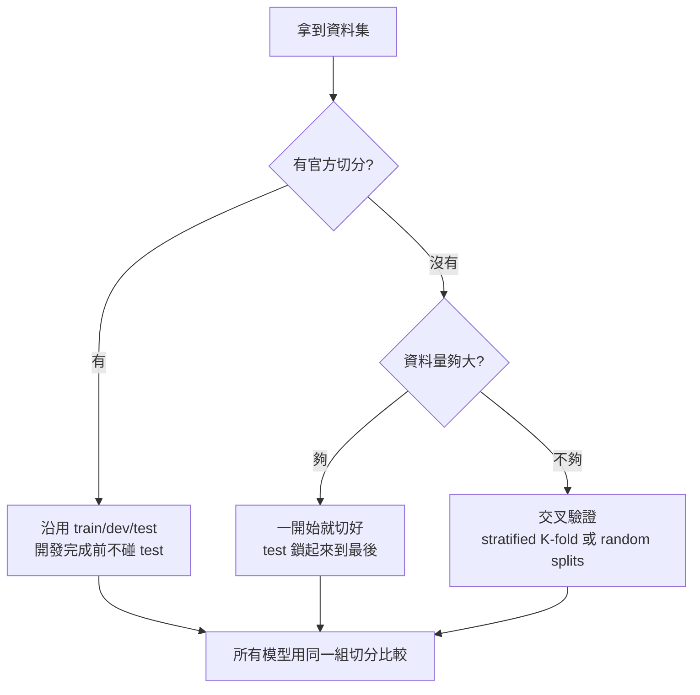

> 🌏 [English version](/posts/ai/2026-09-29-cs224u-datasets-model-evaluation-en)

**影片狀態：已附影片。** [影片來源與說明](#課程影片來源)

**本文依據 CS224U 2023 春季版。** 這是 [Stanford CS224U 導讀](/posts/ai/2026-08-21-stanford-cs224u-natural-language-understanding)系列的第 14 篇。上一篇 [方法與指標 I](/posts/ai/2026-09-29-cs224u-methods-metrics) 處理「分數怎麼算」：confusion matrix、F1 的幾種平均、BLEU 與 perplexity。這一篇接著處理另一個問題：**就算指標選對了，你的實驗能不能說服一個不信任你的審稿人？**

課程把這件事放在同一份 [methods 投影片](https://web.stanford.edu/class/cs224u/slides/cs224u-methods-2023-handout.pdf)的後三節：Datasets、Data organization、Model evaluation。對應 [YouTube 播放清單](https://www.youtube.com/playlist?list=PLoROMvodv4rOwvldxftJTmoR3kRcWkJBp)的第 42 到 44 支影片，以及 repo 裡的 [evaluation_methods.ipynb](https://github.com/cgpotts/cs224u/blob/main/evaluation_methods.ipynb)。投影片開頭的「Associated materials」另外指定了 Noah Smith《Linguistic Structure Prediction》的 [Appendix B](http://www.cs.cmu.edu/~nasmith/LSP/)——那一章標題就叫 Experimentation，內容涵蓋 train/dev/test、交叉驗證、無重複實驗的比較，以及假設檢定。

## 課程影片來源

下列影片是 Stanford Online 發布的 Spring 2023 對應講次錄影，與本文採用的 2023 年春季版課程一致。2026-10-10 已對照官方播放清單（50 支）核對標題與影片 ID。

```youtube
url: https://www.youtube.com/watch?v=zFtA0fjaXPE
title: Stanford XCS224U: NLU I NLP Methods and Metrics, Part 4: Datasets I Spring 2023
```

```youtube
url: https://www.youtube.com/watch?v=7zZRaoHr-8g
title: Stanford XCS224U: NLU I NLP Methods and Metrics, Part 6: Model Evaluation & Conclusion I Spring 2023
```

原始影片：[Stanford XCS224U: NLU I NLP Methods and Metrics, Part 4: Datasets I Spring 2023](https://www.youtube.com/watch?v=zFtA0fjaXPE)、[Stanford XCS224U: NLU I NLP Methods and Metrics, Part 6: Model Evaluation & Conclusion I Spring 2023](https://www.youtube.com/watch?v=7zZRaoHr-8g)
其他相關影片（僅文字連結）：[Stanford XCS224U: NLU I NLP Methods and Metrics, Part 5: Data Organization I Spring 2023](https://www.youtube.com/watch?v=JJ5TE2_-_uM)

課程與錄影入口：

- [XCS224U Spring 2023 YouTube 播放清單](https://www.youtube.com/playlist?list=PLoROMvodv4rOwvldxftJTmoR3kRcWkJBp)
- [官方課程／講次來源](https://web.stanford.edu/class/cs224u/)

## 這一單元在課程裡的位置

2023 年的[講次表](https://web.stanford.edu/class/cs224u/)裡，「NLP methods」單元涵蓋 5 月 17、22、24 日三堂課，同一格列了 Experiment protocol overview、NLP methods and metrics，以及一場 [Kawin Ethayarajh](https://kawine.github.io/) 的客座「Real-world NLP assessments」。實驗計畫（experiment protocol）的截止日是 5 月 29 日。

換句話說，這一單元的用途寫得很直白。投影片第三頁的標題是「Goal: Help you with your projects」，notebook 開頭也說它的主要目標是幫你做期末專案的實驗，而且教學團隊會「特別注意你怎麼做評估」。它不是一段獨立的理論課，是期末專案的操作手冊。

**存取狀態（A3，歷史版）**：投影片、三支影片、兩份 notebook 都公開。拿不到的是 Kawin 的客座——講次表上這一場沒有投影片連結，播放清單裡也沒有對應影片，所以本文完全不描述它的內容。

| 材料 | 公開狀態 |
|---|---|
| methods 投影片 Datasets / Data org. / Model evaluation 三節 | 公開 PDF |
| 影片 42 Datasets、43 Data Organization、44 Model Evaluation & Conclusion | YouTube 公開 |
| evaluation_methods.ipynb、dynascoring.ipynb | GitHub 公開 |
| Kawin Ethayarajh「Real-world NLP assessments」 | 無投影片、無影片 |

## 資料集：課程對三個兩難的答案都是「兩者都要」

Datasets 這一節先列出我們要求資料集做的六件事：最佳化模型、評估模型、比較模型、讓模型獲得新能力、量測整個領域的進展，以及做科學探究。接著一張頁面寫「Benchmarks saturate faster than ever」（引 Kiela et al. 2021），另一張把 PTB、ImageNet、SQuAD、SNLI 排在時間軸上，標出錯誤、偏誤、artifact 與缺口被發現的速度越來越快。

然後是這一節的主脊，三個問題：

1. 自然資料還是眾包資料？
2. 對抗樣本還是最常見的案例？
3. 合成還是自然的 benchmark？

三題的答案在投影片上都是同一個字：**Both!**

### 自然 vs. 眾包

投影片把兩者的取捨排成兩欄。自然資料（found and curated）的特性是量大、不受控、便宜、真實，但有限而且可能侵入隱私；眾包資料（lab-grown）是受控、能保護隱私、表達力強，但稀少、昂貴、做作。

課程拿自家的 DynaSent 當例子：在眾包時給寫作者提示，可以提高自然度。投影片上的例句像是「Breakfast is really good, if you're trying to feed it to dogs.」——字面上有 good，實際是負評。

### 對抗 vs. 常見

這一段先分清三個容易混用的詞：

- **Standard**：用一個與模型無關的流程建資料集，再切成 train/dev/test。
- **Adversarial assessment**：另外建一個你懷疑或確知會難倒系統的測試集。
- **Adversarial datasets**：整個資料集（含 train/dev/test）都是靠「試著騙過一組模型」建出來的。

後者的例子排成一串：SWAG 到 HellaSWAG、Adversarial NLI、Beat the AI、Dynabench Hate Speech、DynaSent。課程也放了反方意見，引 Bowman 與 Dahl（2021）：對抗式篩選可能系統性地刪掉「對任務必要、但已經被對手模型解決」的現象，降低資料多樣性；他們主張標準 benchmark 的問題可以在靜態、IID 評估裡直接處理。

課程自己的小結列了四點，最值得記的是第三點：現在的系統在對抗案例上取得進展，**並沒有**讓一般案例退步。第四點則是提醒：公眾對模型的印象，往往是對抗樣本定義的。

### 合成 vs. 自然：MoNLI 的例子

這一段用 [Geiger et al. 2020](https://arxiv.org/abs/2004.14623) 的 MoNLI 說明為什麼需要一點合成資料。問題的起點是否定：頂尖 NLI 模型學不會「A 蘊含 B，則非 B 蘊含非 A」。誘人的結論是「這些模型學不會否定」。但投影片接著指出另一個觀察：**否定在 NLI benchmark 裡嚴重不足**。

MoNLI 從 SNLI 的假設句出發，用 WordNet 的上下位關係替換一個詞，分成正向（PMoNLI，1,476 例）與否定（NMoNLI，1,202 例）兩組。投影片上的表格顯示，只用 SNLI 訓練的 BERT 在 NMoNLI 上只有 2.2 分；用 NMoNLI 微調之後，它在 NMoNLI 上到 90.0，SNLI 分數也維持在 90.5。

這張表回答的是：BERT **原則上學得會**否定，缺的是資料覆蓋。課程據此下結論——回到自然、混亂的資料時，我們是帶著「模型學得會」與「覆蓋率是主因」這兩個認知回去的。

這一節最後一頁列出「至少同樣重要」的四件事：[Datasheets](https://arxiv.org/abs/1803.09010)（Gebru et al. 2018）、benchmark 的跨語言覆蓋、統計檢定力（Bowman & Dahl 2021），以及有害的社會偏誤。Datasheets 在[第 16 篇](/posts/ai/2026-09-29-cs224u-presenting-research)會以「Known project limitations」的形式再出現一次。

## 資料切分：先決定 test set 什麼時候能打開

Data organization 這一節很短，但把規則講死了。

**有固定切分的大型資料集**，大家「靠榮譽制度」只在開發完成後才跑 test set。固定的 test set 讓評估一致，但也鼓勵爬山（hill climbing）。notebook 補了一句：理想上每個任務要有幾十個 test set 才能報平均，但成本太高，幾乎沒有實現過。

**沒有固定切分的資料集**，比較就變難了。notebook 用粗體寫：要跟前人比，你真的得用自己的評估流程、在自己的切分上把他們的模型重跑一遍。資料夠大時，在專案一開始就切好並鎖住 test，能簡化實驗、也減少超參數搜尋；資料太小時，強行切分會讓表現變異很大。

**交叉驗證**有兩種：

| 方法 | 好處 | 壞處 |
|---|---|---|
| Random splits（打散 k 次，每次切 t% 訓練） | 要切幾次都行，不影響訓練/測試比例 | 不保證每筆資料被用到的次數相同 |
| K-folds（切 k 份，輪流當 test） | 每筆資料恰好進 test 一次、進 train k−1 次 | k 決定比例：3-fold 是 67/33，10-fold 是 90/10 |

兩種都建議做 stratified（訓練與測試的類別分布接近）。notebook 另外點名兩個 K-fold 變體：資料極小時用 `LeaveOneOut`；資料有結構、不能讓訓練看到某些群組時用 `LeavePGroupsOut`。



## Baseline：在寫假設的時候就決定

Model evaluation 這一節開頭列出五個主題：baseline、超參數最佳化、分類器比較、不收斂時怎麼評估、隨機初始化的角色。

Baseline 那一頁的論點用兩個數字講：你的系統拿到 0.95 F1——任務是不是太簡單？拿到 0.60 F1——人類拿幾分？**評估數字永遠不能單獨理解。**投影片接著說，定義 baseline 不該是事後補的，而是你定義整體假設時的核心。

兩種 baseline：

- **隨機 baseline**：幾乎永遠值得放。scikit-learn 的 `DummyClassifier`（`stratified`、`uniform`、`most_frequent`）和 `DummyRegressor`（`mean`、`median`）。notebook 給的理由很務實：這些 baseline 說起來簡單，自己實作卻容易出錯，別人已經幫你寫好了。
- **任務特定 baseline**：能揭露問題本身的 baseline。兩個例子：NLI 的 hypothesis-only baseline（notebook 提到這最早是一位 2016 年 CS224U 學生在期末專案裡發現的：只看假設句、不看前提，在 SNLI 上就能遠高於隨機）；以及 Story Cloze 任務，只看結尾選項就能做得很好（Schwartz et al. 2017）。

## 超參數搜尋：理想規則與可接受的妥協

投影片先寫下「理想」流程：每個超參數列一大串值，取所有組合，每個組合在訓練資料上做交叉驗證，選最好的設定在全部訓練資料上重訓，最後才碰 test set。並用一個算術例子說明它有多貴：兩個超參數各 5、10 個值是 50 種設定，再加一個 2 值的超參數變 100 種，做 5-fold 就是 500 次訓練。

然後課程直接說：**這套規則不可能當成科學社群的法律**。真的這樣要求，大模型會被系統性地排除，只有很有錢的人能參與（投影片引 Rajkomar et al. 2018：其神經網路的超參數自動調整總共用了超過 20 萬 GPU 小時）。

接著給出六個妥協，按「審稿人抱怨的可能性」由低到高排：

1. 隨機抽樣或引導式搜尋，用固定預算探索大空間
2. 只訓練幾個 epoch 就比較
3. 在資料子集上搜尋（有些超參數對資料量很敏感，有風險）
4. 用啟發式判斷哪些超參數不重要，手動設定（要在論文裡說明）
5. 在一個切分上找最佳值，套用到其他切分（切分相似時合理）
6. 沿用別人的設定

notebook 補了一個「想像一位多疑的審稿人」的論證：你用預設值跑了 A、B、C，C 最好。審稿人看不到你的過程——你有沒有試過別的值但沒報告？如果 C 沒贏，你會不會去調？從他的角度，你的實驗只證明了「存在某組設定讓 C 贏」。超參數搜尋就是用來回答這個質疑的。所有調整都只能用 train 與 dev 資料。

## 兩個模型差多少才算「不一樣」

分類器比較這一段列了四種工具：

| 方法 | 什麼時候用 |
|---|---|
| 實際差異（Practical differences） | 永遠先做：數一數兩個模型到底在幾筆資料上答案不同。1,000 筆 test 的 1% 是 10 筆；一百萬筆的 1% 是一萬筆 |
| 信賴區間 | 能重跑多次時。notebook 提醒 10–20 次的區間會很寬，可考慮 bootstrap |
| Wilcoxon signed-rank test | 能在不同切分上跑至少 10 次（最好 20 次）時，依 Demšar（2006）的建議 |
| McNemar's test | 只能跑一次時；直接比較兩個模型的預測向量，不需重複實驗 |

notebook 用粗體強調一條：**多個系統要比較，就必須在同一組切分上跑**，這是讓它們面對同樣挑戰的唯一方法。也提醒別把 `scipy.stats.wilcoxon` 跟 `scipy.stats.ranksums` 搞混。

### 神經網路：不收斂與隨機初始化

線性模型很少有收斂問題；神經網路則很少真的收斂，每次跑的收斂速度不同，而 test 表現往往高度依賴這些差異。課程的回應是**增量式 dev set 測試**：訓練過程中定期在 dev 上評估並存下預測。課程所有 PyTorch 模型都有 `early_stopping` 參數，開啟後會保留一部分訓練資料（`validation_fraction` 預設 0.10）做每個 epoch 的評估。

Potts 在 notebook 裡的立場更進一步：他認為最好的做法是**直接接受學習曲線才是該報告的東西**，並加上多次執行得到的信賴區間。深度學習模型原則上什麼都學得會，真正的問題是在現有資料與資源下學得多有效率——學習曲線把這一點攤開。

最後是隨機初始化。投影片引 Reimers 與 Gurevych（2017）：不同初始化可以造成統計顯著的差異，把這個變異算進去之後，好幾個近期系統在原始表現上其實分不出高下。notebook 裡的 XOR 小實驗是具體示範：同一個前饋網路，10 次只成功 8 次。結論是要報告多次完整執行（不同隨機初始化）的分數，再用信賴區間或檢定摘要。

## Dynascore：把多個指標壓成一個可調整的分數

最後回到 methods 單元開頭的一個工具，因為它是「模型比較」的另一種答案。[Dynaboard](https://papers.nips.cc/paper/2021/hash/55b1927fdafef39c48e5b73b5d61ea60-Abstract.html)（Ma et al. 2021，NeurIPS）主張排行榜不該只看準確率，還要收記憶體用量、throughput、robustness 等實務指標，再用可自訂權重的 Dynascore 聚合。

投影片放了兩張問答任務的表，數據相同、只換權重：

- 權重「Performance 8，其餘四項各 2」時，DeBERTa 排第一（45.92），ELECTRA-large 第二（45.79）。
- 權重改成「Performance 8、Fairness 5、其餘各 1」時，ELECTRA-large 升到第一（46.86），DeBERTa 退到第二（46.70）。

**排名取決於你怎麼定義「好」。**[dynascoring.ipynb](https://github.com/cgpotts/cs224u/blob/main/dynascoring.ipynb) 實作了這個函式：你只要提供 `weights` 與作為效能指標的欄位名，另外可用 `direction_multipliers` 反轉「越低越好」的指標、用 `offsets` 做調整（範例把記憶體換算成「16GB 減去用量」）。notebook 自己也註明，它算出來的分數跟論文略有差異，推測是論文用的是未四捨五入的原值。

講次表同一欄還列了 [Santhanam et al. 2022](https://arxiv.org/abs/2212.01340)。這篇的論點是同一條路線在檢索上的延伸：主流 IR benchmark 只看下游準確率，藏住了用效率換品質的成本；作者主張 benchmark 應同時報查詢延遲與在可重現硬體上的成本預算，並在 MS MARCO 與 XOR-TyDi 上展示「最佳系統」會隨這些權衡而改變。

## 課程最後的判斷：哪種創新被低估

methods 投影片的 Conclusion 以一頁收尾，標題是「An ideal moment for innovation」：

1. 架構創新——被高估
2. 指標創新——嚴重被低估
3. 評估創新——嚴重被低估
4. 任務創新——被低估
5. 窮舉式超參數搜尋——要跟其他因素權衡

緊接在前一頁的就是 experiment protocol 的七個必填段落。這也是下一篇要接的地方：本篇講的 baseline、切分、統計比較，最後都要落在 protocol 的 Data、Metrics、Models 三欄裡。

## 今晚可以做的一件事

打開你手上任何一個模型比較的結果（工作上的 A/B、side project 的兩個 prompt、論文復現都行），回答三個問題：

1. 兩個版本實際上在幾筆資料上答案不同？
2. 它們是在同一組切分、同一個 test set 上比的嗎？
3. 最簡單的 `most_frequent` baseline 拿幾分？

三題有任何一題答不出來，那個「A 比 B 好」的結論就還不能寫進報告。

## 延伸閱讀

- 同系列上一篇：[CS224U 方法與指標 I：分類指標與生成指標](/posts/ai/2026-09-29-cs224u-methods-metrics)
- 同系列下一篇：[CS224U 期末專案流程：文獻回顧與實驗計畫](/posts/ai/2026-09-29-cs224u-lit-review-experiment-protocol)
- 站內 CS224N 系列的評估篇：[CS224N 第 11 講：Benchmark 與 LLM 評估為什麼會過期](/posts/ai/2026-08-22-cs224n-benchmark-evaluation)

## 更新紀錄

- 2026-10-10：標註影片狀態，核對錄影來源與取得方式。
- 2026-10-10：重查影片狀態。官方 Spring 2023 播放清單其實有對應講次的錄影，已嵌入並改為已附影片。

## 參考資料

- [CS224U 課程官網（Spring 2023 講次表）](https://web.stanford.edu/class/cs224u/) — NLP methods 單元日期、Kawin 客座無投影片、Smith 2011 / Ma 2021 / Santhanam 2022 等指定閱讀
- [CS224U methods and metrics 投影片（Spring 2023）](https://web.stanford.edu/class/cs224u/slides/cs224u-methods-2023-handout.pdf) — Datasets、Data organization、Model evaluation、Conclusion 各節與 Dynascore 兩張表
- [evaluation_methods.ipynb](https://github.com/cgpotts/cs224u/blob/main/evaluation_methods.ipynb) — 切分、交叉驗證、baseline、超參數搜尋妥協、分類器比較、early stopping 與隨機初始化的完整說明
- [dynascoring.ipynb](https://github.com/cgpotts/cs224u/blob/main/dynascoring.ipynb) — Dynascore 函式實作與參數
- [XCS224U Spring 2023 YouTube 播放清單](https://www.youtube.com/playlist?list=PLoROMvodv4rOwvldxftJTmoR3kRcWkJBp) — 影片 42 Datasets、43 Data Organization、44 Model Evaluation & Conclusion
- [Ma et al. 2021, Dynaboard: An Evaluation-As-A-Service Platform for Holistic Next-Generation Benchmarking](https://papers.nips.cc/paper/2021/hash/55b1927fdafef39c48e5b73b5d61ea60-Abstract.html) — Dynascore 的原始論文
- [Santhanam et al. 2022, Moving Beyond Downstream Task Accuracy for Information Retrieval Benchmarking](https://arxiv.org/abs/2212.01340) — 把效率與成本納入 IR benchmark 的主張
- [Noah A. Smith, Linguistic Structure Prediction（2011）](http://www.cs.cmu.edu/~nasmith/LSP/) — Appendix B「Experimentation」為本單元指定閱讀
- [Geiger et al. 2020, Neural Natural Language Inference Models Partially Embed Theories of Lexical Entailment and Negation](https://arxiv.org/abs/2004.14623) — MoNLI 資料集的原始論文（BlackboxNLP 2020）
- [Gebru et al. 2018, Datasheets for Datasets](https://arxiv.org/abs/1803.09010) — 投影片列為資料集議題中「至少同樣重要」的一項
- [cgpotts/cs224u GitHub repo](https://github.com/cgpotts/cs224u) — 上述 notebook 所在的課程 repo
