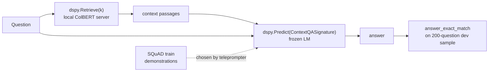

> 🌏 [中文版](/posts/ai/2026-09-29-cs224u-hw2-openqa-dspy)

**Video status: Videos included.** [Source details](#course-video-sources)

> **Version note**: This post is based on the Spring 2023 offering of [CS224U](https://web.stanford.edu/class/cs224u/), the last on-campus version with a fully public site. This assignment has a twist: the 2023 slides and screencast use the DSP library, while the notebook now in the [GitHub repo](https://github.com/cgpotts/cs224u) is a DSPy rewrite (version string Fall 2024). I cover both. Every fact was checked against official materials on 2026-09-29. Access grade **A3**: the questions, unit tests, index, bake-off question file, and overview screencast are all public. What you can't get is the Gradescope autograder and the bake-off leaderboard.

**Series**: previous [In-context learning](/posts/ai/2026-09-29-cs224u-in-context-learning-en) | next [Behavioral evaluation](/posts/ai/2026-09-29-cs224u-behavioral-evaluation-en) | [Series overview](/posts/ai/2026-08-21-stanford-cs224u-natural-language-understanding-en)

The previous two posts covered [information retrieval](/posts/ai/2026-09-29-cs224u-information-retrieval-en) and in-context learning. This one joins them. [hw_openqa.ipynb](https://github.com/cgpotts/cs224u/blob/main/hw_openqa.ipynb) asks you to retrieve first, put the results into a prompt, and get a language model that was **never trained for QA** to answer the question.

In the [Assignment 2 overview screencast](https://www.youtube.com/watch?v=NQUxBVOJM14), Potts says this task probably couldn't even have been posed in 2018. When the course first ran it in 2022, he worried it was too hard.

This post covers the question structure, points, required resources, and where the notebook breaks if you run it as-is today. **It gives no solutions.**

## Course video sources

The videos below are the corresponding Spring 2023 recordings published by Stanford Online, matching the 2023 course version this article uses. Titles and video IDs were checked against the official 50-video playlist on 2026-10-10.

```youtube
url: https://www.youtube.com/watch?v=NQUxBVOJM14
title: Stanford XCS224U: Natural Language Understanding I Homework 2 I Spring 2023
```

Original videos: [Stanford XCS224U: Natural Language Understanding I Homework 2 I Spring 2023](https://www.youtube.com/watch?v=NQUxBVOJM14)

Course and recording entries:

- [XCS224U Spring 2023 YouTube playlist](https://www.youtube.com/playlist?list=PLoROMvodv4rOwvldxftJTmoR3kRcWkJBp)
- [Official course / lecture source](https://web.stanford.edu/class/cs224u/)

## Where it sits in the course

The 2023 schedule puts Assignment 2 in the second unit, "Retrieval augmented in-context learning." The April 17 session opens with the [Overview of Assign/bakeoff 2 slides](https://web.stanford.edu/class/cs224u/slides/cs224u-hw2-overview-2023.pdf), followed by the Information retrieval and In-context learning lectures. The assignment, bake-off, and Quiz 2 were all due April 26 at 3:00 pm Pacific.

The unit's readings most relevant to the assignment are [RAG (Lewis et al. 2020)](https://proceedings.neurips.cc/paper/2020/hash/6b493230205f780e1bc26945df7481e5-Abstract.html), [retrieve-then-read (Lazaridou et al. 2022)](https://arxiv.org/abs/2203.05115), and [DSP (Khattab et al. 2022)](https://arxiv.org/abs/2212.14024).

## The task: the last row of the QA table

Slide 3 and the notebook's opening both show the same table. The assignment is the last row:

| Task | Passage given | Task-specific reader training | Task-specific retriever training |
|---|---|---|---|
| QA | yes | yes | n/a |
| OpenQA | no | yes | maybe |
| Few-shot QA | yes | no | n/a |
| **Few-shot OpenQA** | **no** | **no** | **maybe** |

The slides spell out the student's situation in three lines. During development you have gold question–answer pairs. At test time you have **only questions**, with no passages or other data. And you **cannot train any LLMs**; all you can do is in-context learning with frozen models.

The retriever could in principle be trained for the task, but the assignment leaves that alone. The notebook suggests it as a final-project idea.

That is the opposite of the original RAG setup. The [abstract of Lewis et al.](https://arxiv.org/abs/2005.11401) describes a fine-tuning recipe: connect a pretrained seq2seq model to a dense vector index of Wikipedia, then fine-tune them together. Assignment 2 **forbids all fine-tuning** and keeps only the skeleton: retrieved text feeds generation.

## How the notebook splits the pipeline

The current DSPy version looks like this:



Where each piece comes from:

- **Data**: [SQuAD](https://rajpurkar.github.io/SQuAD-explorer/). The train split is only a source of demonstrations (the course puts "train" in scare quotes, since you can't train anything). The dev split simulates the questions-only test situation. The notebook sets `random.seed(1)` and samples 200 dev questions for development, because "Evaluations are expensive in this new era!"
- **Retrieval**: the course provides a prebuilt ColBERT index. You run `ColBERT/server.py` in a separate terminal and connect with `dspy.ColBERTv2(url="http://127.0.0.1:8888/api/search")`.
- **Generation**: the default is `dspy.OpenAI(model='gpt-3.5-turbo', ...)`. The notebook calls this a development default: build with a cheap model, run final evaluations with an expensive one.
- **Metric**: exact match (EM), the standard for SQuAD.

The notebook walks through a direct LM call, `dspy.Predict("question -> answer")`, a custom `dspy.Signature`, a `dspy.Module`, going from zero-shot to few-shot with `LabeledFewShot(k=3)`, and `Evaluate`. It ends by assembling a full `RAG` module, which is the starting point for the questions.

## Questions and points: two versions

The same assignment has two question sets. The repo's commit history explains why: "Initial HW2" on 2023-04-05 is the DSP version, and a commit on 2024-01-28, "Updating to switch from DSP to DSPy," rewrote the whole thing.

**Spring 2023 (DSP, the version the slides and screencast describe)**, per an [August 2023 snapshot of the notebook](https://github.com/cgpotts/cs224u/blob/72dc2df444398d0d6012fb3d605b86d163abf78a/hw_openqa.ipynb):

| Question | Content | Points |
|---|---|---|
| Question 1 | Few-shot OpenQA with context | 3 |
| Question 2 Task 1 | Filtering demonstrations with `annotate` | 2 |
| Question 2 Task 2 | Full filtering program | 1 |
| Question 3 | Original system | 3 |
| Question 4 | Bake-off entry | 1 |

That version set up the LM with `dsp.GPT3(model='text-davinci-001', ...)`, with a commented-out Cohere option. In the screencast, Potts tells students to put the `@dsp.transformation` decorator on every DSP program so it never modifies the loaded SQuAD examples in place.

**Current repo version (DSPy, `__version__ = "CS224u, Stanford, Fall 2024"`)**:

| Question | Content | Points |
|---|---|---|
| Question 1 | Optimizing RAG: write the `validate_context_and_answer` metric, then compile with `BootstrapFewShot` | 2 |
| Question 2 | Multi-passage summarization: complete `SummarizeSignature` | 2 |
| Question 3 | Summarizing RAG: add a summarization layer inside `RAG` | 2 |
| Question 4 | Original system | 3 |
| Question 5 | Bake-off entry | 1 |

Both versions give the original system 3 points and the bake-off entry 1 point, out of 10.

The reasoning behind the current Question 1 is worth reading. Sampling demonstrations at random with `LabeledFewShot` has a problem: many sampled passages have nothing to do with the answer, so you end up teaching the model with cases where the context didn't help. The question asks you to write a metric that keeps only demonstrations where the model **answered correctly and the passage actually contains the answer**, then hand it to `BootstrapFewShot`. The notebook admits the code is in the DSPy tutorials and says you can use it; the point is to understand DSPy's optimization design pattern.

There's an easy-to-miss warning after Question 3. If you run `BootstrapFewShot` on the summarizing RAG, **don't reuse the Question 1 metric**. After summarization, the context is unlikely to contain the answer verbatim, so that metric would throw out good demonstrations.

## Original system and bake-off rules

The bake-off has two hard rules, stated in Question 4:

> The LM must be an autoregressive language model. No trained QA components can be used. This includes general purpose LMs that have been fine-tuned for QA.

Any model fine-tuned for QA is out, including general-purpose LMs that got QA fine-tuning. The notebook admits this is vague territory and invites questions.

It suggests four directions for the original system: swap `dspy.Predict` for `dspy.ChainOfThought` or `dspy.ReAct`; use another retrieval mechanism; try other optimizers (it names `SignatureOptimizer` and `BootstrapFewShotWithRandomSearch`); and let the retrieval query change as evidence accumulates, the multi-hop approach.

To enter, you run your system on every question in [cs224u-openqa-test-unlabeled.txt](https://web.stanford.edu/class/cs224u/data/cs224u-openqa-test-unlabeled.txt) and write a question-to-answer JSON file, `cs224u-openqa-bakeoff-entry.json`, without renaming it. The question file was still downloadable on 2026-09-29 (16,822 bytes, questions only).

## Where the cost bites

The notebook says it up front:

> You can pay to use the GPT-3 API, or you can pay to use a local model on a heavy-duty cluster computer, or you can pay with time by using a local model on a more modest computer.

Item by item:

1. **LM API**: the current version defaults to OpenAI, so you need your own API key in a local `.env` file. The screencast says that in 2023 Cohere's models were free and new OpenAI accounts came with a small credit. That was 2023; check today's terms yourself.
2. **ColBERTv2 checkpoint**: `colbertv2.0.tar.gz` from Stanford. The notebook comment says "388MB compressed." An HTTP HEAD on 2026-09-29 returned a Content-Length of 405,924,985 bytes; the gap is MiB versus MB.
3. **Prebuilt index**: `cs224u.collection.2bits.tgz`, Content-Length 600,150,346 bytes, about 600 MB.
4. **ColBERT server**: the notebook says to install the CUDA Toolkit if you have a CUDA device; otherwise it runs on CPU. On Colab, opening a terminal requires a Pro account. Without Pro, the notebook includes commented-out code that starts the server in the background with `nohup`.
5. **Evaluation volume**: every 200-question dev evaluation is at least 200 LM calls, and bootstrapping or chain-of-thought multiplies that. The screencast advises using even the 200-question evaluation sparingly.

Compare the other two assignments. Assignment 1 needs only local compute, and Assignment 3 calls an API only in Question 3. Assignment 2 is the only one that **costs money or GPU time from the first step**.

## The DSPy 2.4 versus 3.x gap

The repo's [requirements.txt](https://github.com/cgpotts/cs224u/blob/main/requirements.txt) pins DSPy:

```text
# pin down dspy-ai during the cohort
dspy-ai==2.4.13
```

The same file pins `openai==1.61.1`. PyPI shows `dspy-ai` 2.4.13 was uploaded on 2024-07-29. On 2026-09-29, the latest `dspy` on PyPI was 3.4.0.

I downloaded both wheels and compared the source (I did not run the notebook). The gap comes down to a few calls:

| Notebook usage | dspy-ai 2.4.13 | dspy 3.4.0 |
|---|---|---|
| `dspy.OpenAI(model=..., api_key=...)` | exists, as an alias for `dsp.GPT3` | **gone**; use `dspy.LM("openai/<model>")` with a LiteLLM model string |
| `dspy.ColBERTv2(url=...)` | exists | still exists |
| `dspy.Retrieve(k=...)` | exists, reads `dspy.settings.rm` | still exists, still reads `dspy.settings.rm` |
| `LabeledFewShot`, `BootstrapFewShot` | exist | still exist |
| `answer_exact_match`, `answer_passage_match` | exist | still exist |
| `SignatureOptimizer` | exists | still there, but prints a warning that it has been replaced by `COPRO` and will be removed |

In short: **install from requirements.txt and the notebook matches; install the latest DSPy and the first setup cell breaks.** The signature, module, and teleprompter ideas carry over to 3.x, but the LM configuration layer changed completely.

For current DSPy design, see [DSPy: Compiling AI Programs with Signatures, Metrics, and Optimizers](/posts/ai/2026-08-22-dspy-ai-program-optimization-en), which covers the newer API.

## How to self-study it

1. **Decide which cost you'll pay.** If you have an OpenAI key, build a separate environment straight from requirements.txt and don't touch the versions. If you have no GPU, accept that the ColBERT server will be slow on CPU.
2. **Get retrieval working before touching the LM.** The notebook's `dspy.Retrieve(k=3)` cell needs no API key. Confirm the server returns passages before moving on.
3. Debug with the 15-question `tiny_evaluater`; save the 200-question `dev_evaluater` for comparing versions.
4. For the original system, write down one hypothesis the dev set could refute, such as "summarizing before answering raises EM on questions that need evidence from several passages," then build.

One thing to do tonight: clone the repo, download only the 600 MB index, start the ColBERT server, and run `rm(..., k=1)` on the notebook's Hugo Award question. See whether the passage it returns contains the answer. This costs nothing in API fees, and it shows you the most common failure in few-shot OpenQA: the answer isn't in the passage at all.

## Further reading

- Course status, all three assignments, and environment pitfalls: [Stanford CS224U (series overview)](/posts/ai/2026-08-21-stanford-cs224u-natural-language-understanding-en)
- A recent take on RAG and agents: [CS224N Lecture 10: Six Components of RAG and Language Agents](/posts/ai/2026-08-22-cs224n-rag-language-agents-en)
- The DSPy 3.x API: [DSPy: Compiling AI Programs with Signatures, Metrics, and Optimizers](/posts/ai/2026-08-22-dspy-ai-program-optimization-en)

## Update Log

- 2026-10-10: Added explicit video status and checked recording sources and access notes.
- 2026-10-10: Rechecked video status. Checked video IDs and lecture numbers against the official playlist; they are correct, and video titles now use the original titles.

## References

- [CS224U course site (Spring 2023)](https://web.stanford.edu/class/cs224u/) — schedule, Assignment 2 deadline, unit readings
- [Overview of Assign/bakeoff 2 slides (Spring 2023)](https://web.stanford.edu/class/cs224u/slides/cs224u-hw2-overview-2023.pdf) — QA task table, the student's three constraints, retrieve-then-read and the DSP program example
- [Assignment 2 overview screencast (XCS224U, Spring 2023)](https://www.youtube.com/watch?v=NQUxBVOJM14) — DSP setup, why `dsp.transformation` matters, the evaluation-cost warning
- [hw_openqa.ipynb (current DSPy version)](https://github.com/cgpotts/cs224u/blob/main/hw_openqa.ipynb) — pipeline components, five-question structure and points, bake-off rules, the "pay one way or another" passage
- [hw_openqa.ipynb (August 2023 DSP snapshot)](https://github.com/cgpotts/cs224u/blob/72dc2df444398d0d6012fb3d605b86d163abf78a/hw_openqa.ipynb) — the Spring 2023 four-question structure and `text-davinci-001` setup
- [Commit history of hw_openqa.ipynb](https://github.com/cgpotts/cs224u/commits/main/hw_openqa.ipynb) — the 2024-01-28 switch from DSP to DSPy
- [requirements.txt](https://github.com/cgpotts/cs224u/blob/main/requirements.txt) — pins `dspy-ai==2.4.13` and `openai==1.61.1`
- [ColBERTv2 checkpoint download](https://downloads.cs.stanford.edu/nlp/data/colbert/colbertv2/colbertv2.0.tar.gz) — HTTP 200 on 2026-09-29, 405,924,985 bytes
- [Course prebuilt ColBERT index](https://web.stanford.edu/class/cs224u/data/cs224u.collection.2bits.tgz) — HTTP 200 on 2026-09-29, 600,150,346 bytes
- [Bake-off question file cs224u-openqa-test-unlabeled.txt](https://web.stanford.edu/class/cs224u/data/cs224u-openqa-test-unlabeled.txt) — still downloadable on 2026-09-29
- [ColBERT GitHub repo](https://github.com/stanford-futuredata/ColBERT) — cloned by the notebook to run `server.py`
- [Lewis et al., Retrieval-Augmented Generation for Knowledge-Intensive NLP Tasks (NeurIPS 2020)](https://proceedings.neurips.cc/paper/2020/hash/6b493230205f780e1bc26945df7481e5-Abstract.html) — the course's RAG reading
- [RAG paper arXiv abstract](https://arxiv.org/abs/2005.11401) — source of "general-purpose fine-tuning recipe"
- [Lazaridou et al. 2022 (arXiv:2203.05115)](https://arxiv.org/abs/2203.05115) — the course's retrieve-then-read reading
- [Khattab et al., Demonstrate-Search-Predict (arXiv:2212.14024)](https://arxiv.org/abs/2212.14024) — the DSP paper
- [SQuAD project page](https://rajpurkar.github.io/SQuAD-explorer/) — the assignment's development data
- [DSPy website](https://dspy.ai) — the documentation entry point the notebook links to
- [PyPI: dspy](https://pypi.org/project/dspy/) — latest version 3.4.0 on 2026-09-29
- [PyPI: dspy-ai 2.4.13](https://pypi.org/project/dspy-ai/2.4.13/) — the pinned version, uploaded 2024-07-29
- [XCS224U Spring 2023 YouTube playlist](https://www.youtube.com/playlist?list=PLoROMvodv4rOwvldxftJTmoR3kRcWkJBp) — the public screencasts this series follows
