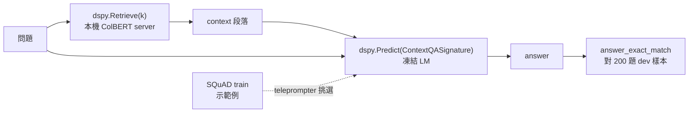

> 🌏 [English version](/posts/ai/2026-09-29-cs224u-hw2-openqa-dspy-en)

**影片狀態：已附影片。** [影片來源與說明](#課程影片來源)

> **版本說明**：本文依據 [CS224U](https://web.stanford.edu/class/cs224u/) 2023 春季版（課程網站最後一次完整公開的校內版）。但這份作業有個特殊狀況：2023 年的投影片與錄影用的是 DSP 函式庫，[GitHub repo](https://github.com/cgpotts/cs224u) 裡現在的 notebook 已改寫成 DSPy 版（版本字串 Fall 2024）。兩版本文都會交代。事實皆於 2026-09-29 打開官方材料核對。存取等級 **A3**：題目、單元測試、索引、bake-off 題目檔與 overview 錄影都公開；拿不到的是 Gradescope 自動評分與 bake-off 排行榜。

**系列位置**：上一篇 [In-context learning](/posts/ai/2026-09-29-cs224u-in-context-learning)｜下一篇 [行為評估](/posts/ai/2026-09-29-cs224u-behavioral-evaluation)｜[系列總覽](/posts/ai/2026-08-21-stanford-cs224u-natural-language-understanding)

前兩篇分別講完[資訊檢索](/posts/ai/2026-09-29-cs224u-information-retrieval)與 in-context learning。這一篇把兩者接起來：[hw_openqa.ipynb](https://github.com/cgpotts/cs224u/blob/main/hw_openqa.ipynb) 要你先檢索、再把檢索結果塞進提示，讓一個**完全沒為問答訓練過**的語言模型回答問題。

Potts 在[作業二 overview 錄影](https://www.youtube.com/watch?v=NQUxBVOJM14)裡說，這個任務在 2018 年大概根本提不出來；2022 年第一次出這份作業時，他還擔心太難。

本文只講題目結構、配分、需要的資源，以及今天照原樣跑會卡在哪。**不提供任何題目的解答。**

## 課程影片來源

下列影片是 Stanford Online 發布的 Spring 2023 對應講次錄影，與本文採用的 2023 年春季版課程一致。2026-10-10 已對照官方播放清單（50 支）比較影片標題與影片 ID。

```youtube
url: https://www.youtube.com/watch?v=NQUxBVOJM14
title: Stanford XCS224U: Natural Language Understanding I Homework 2 I Spring 2023
```

原始影片：[Stanford XCS224U: Natural Language Understanding I Homework 2 I Spring 2023](https://www.youtube.com/watch?v=NQUxBVOJM14)

內容核對：已依字幕核對（2026-10-10）：已依 Homework 2 字幕逐項對照：Potts 對任務難度的說法（2018 年提不出、前一年出題時擔心太難）、QA 任務表四列與 few-shot OpenQA 的限制、SQuAD 只當 train／dev 示範來源、凍結檢索與凍結 LM、評估成本提醒與 200 題樣本、Cohere 免費與 OpenAI 少量額度、text-davinci-001 設定、@dsp.transformation 的用意、Question 1／2（annotate）與原創系統，皆吻合。DSPy 版配分、成本數字與版本落差屬 notebook／PyPI 內容，不在影片內，未以字幕驗證。

課程與錄影入口：

- [XCS224U Spring 2023 YouTube 播放清單](https://www.youtube.com/playlist?list=PLoROMvodv4rOwvldxftJTmoR3kRcWkJBp)
- [官方課程／講次來源](https://web.stanford.edu/class/cs224u/)

## 它在課程裡的位置

2023 年講次表把作業二放在第二個單元「Retrieval augmented in-context learning」。4 月 17 日那堂先上 [Overview of Assign/bakeoff 2 投影片](https://web.stanford.edu/class/cs224u/slides/cs224u-hw2-overview-2023.pdf)，接著才是 Information retrieval 與 In-context learning 兩堂。作業、bake-off 與 Quiz 2 都在 4 月 26 日下午 3 點（Pacific）截止。

同一單元的 readings 裡，跟作業最直接相關的是 [RAG（Lewis et al. 2020）](https://proceedings.neurips.cc/paper/2020/hash/6b493230205f780e1bc26945df7481e5-Abstract.html)、[retrieve-then-read（Lazaridou et al. 2022）](https://arxiv.org/abs/2203.05115) 與 [DSP（Khattab et al. 2022）](https://arxiv.org/abs/2212.14024)。

## 任務：QA 表的最後一列

投影片第 3 頁與 notebook 開頭都放了同一張表，作業要你做的是最後一列：

| 任務 | 給原文段落 | 任務專屬 reader 訓練 | 任務專屬 retriever 訓練 |
|---|---|---|---|
| QA | 有 | 有 | 不適用 |
| OpenQA | 沒有 | 有 | 可能 |
| Few-shot QA | 有 | 沒有 | 不適用 |
| **Few-shot OpenQA** | **沒有** | **沒有** | **可能** |

投影片把學生的處境講成三條：開發時手上有標準答案的問答對；測試時**只有問題**，沒有段落也沒有其他資料；**不能訓練任何 LLM**，只能用凍結模型做 in-context learning。

檢索器理論上可以做任務專屬訓練，但作業不碰這件事，notebook 說那可以留給期末專案。

這跟 RAG 原論文的設定剛好相反。[Lewis et al. 的摘要](https://arxiv.org/abs/2005.11401)講的是一套 fine-tuning 配方：把預訓練 seq2seq 模型與 Wikipedia 的 dense 向量索引接起來，再一起微調。作業二**什麼都不准微調**，只留下「檢索結果進入生成」這個骨架。

## 管線在 notebook 裡怎麼拆

現行 DSPy 版的管線可以畫成這樣：



各元件的來源：

- **資料**：[SQuAD](https://rajpurkar.github.io/SQuAD-explorer/)。train 切分只拿來當示範例（課程特別打了引號：你不能真的訓練），dev 切分用來模擬「只有問題」的測試情境。notebook 固定 `random.seed(1)` 抽 200 題 dev 當開發評估集，因為「在這個新時代，評估很貴」。
- **檢索**：課程提供一份預建的 ColBERT 索引，你在另一個終端機跑 `ColBERT/server.py`，notebook 再用 `dspy.ColBERTv2(url="http://127.0.0.1:8888/api/search")` 連上。
- **生成**：預設 `dspy.OpenAI(model='gpt-3.5-turbo', ...)`，notebook 說這只是開發用預設，可以先用便宜模型開發、最後再換貴的評估。
- **指標**：SQuAD 標準的 exact match（EM）。

notebook 先依序示範 LM 直接呼叫、`dspy.Predict("question -> answer")`、自訂 `dspy.Signature`、`dspy.Module`、用 `LabeledFewShot(k=3)` 從零樣本變少樣本、`Evaluate`，最後組出一個完整的 `RAG` 模組。這個 `RAG` 就是後面題目的起點。

## 題目與配分：兩個版本

同一份作業有兩套題目。原因在 repo 的 commit 歷史：2023-04-05「Initial HW2」是 DSP 版，2024-01-28 一筆「Updating to switch from DSP to DSPy」把整份改寫。

**2023 春季版（DSP，投影片與錄影講的這一版）**，依 [2023 年 8 月的 notebook 快照](https://github.com/cgpotts/cs224u/blob/72dc2df444398d0d6012fb3d605b86d163abf78a/hw_openqa.ipynb)：

| 題目 | 內容 | 配分 |
|---|---|---|
| Question 1 | Few-shot OpenQA with context | 3 |
| Question 2 Task 1 | 用 `annotate` 過濾示範例 | 2 |
| Question 2 Task 2 | 完整的過濾程式 | 1 |
| Question 3 | 原創系統 | 3 |
| Question 4 | bake-off 參賽 | 1 |

那一版的語言模型設定是 `dsp.GPT3(model='text-davinci-001', ...)`，另留一行 Cohere 的註解選項。錄影裡 Potts 提醒每個 DSP 程式都要加 `@dsp.transformation` 裝飾器，免得程式就地改到載入的 SQuAD 資料。

**repo 現行版（DSPy，`__version__ = "CS224u, Stanford, Fall 2024"`）**：

| 題目 | 內容 | 配分 |
|---|---|---|
| Question 1 | Optimizing RAG：寫 `validate_context_and_answer` 指標，再用 `BootstrapFewShot` 編譯 | 2 |
| Question 2 | Multi-passage summarization：完成 `SummarizeSignature` | 2 |
| Question 3 | Summarizing RAG：在 `RAG` 裡加一層摘要 | 2 |
| Question 4 | 原創系統 | 3 |
| Question 5 | bake-off 參賽 | 1 |

兩版的共同點是：原創系統都是 3 分，bake-off 參賽都是 1 分，總分 10。

現行版 Question 1 的出題理由值得看。直接用 `LabeledFewShot` 隨機抽示範例會出問題：抽到的段落常常跟答案無關，等於拿一堆「段落沒幫上忙」的例子教模型。所以題目要你寫一個指標，只留下**答對而且段落裡確實含有答案**的示範例，交給 `BootstrapFewShot` 去篩。notebook 也坦白說這題的程式碼在 DSPy 教學裡找得到，可以直接參考，目的是讓你看懂 DSPy 最佳化的設計模式。

Question 3 後面有一條容易漏看的提醒：如果你對摘要版 RAG 也跑 `BootstrapFewShot`，**不要沿用 Question 1 的指標**。摘要之後，段落不太可能再逐字包含答案，那個指標會把好的示範例全部刷掉。

## 原創系統與 bake-off 規則

bake-off 只有兩條硬規定，寫在 notebook Question 4：

> The LM must be an autoregressive language model. No trained QA components can be used. This includes general purpose LMs that have been fine-tuned for QA.

也就是說，任何為問答微調過的模型都不行，連通用 LM 做過 QA 微調也不行。notebook 自己承認這條線有灰色地帶，歡迎學生來問。

notebook 給的原創系統方向有四個：把 `dspy.Predict` 換成 `dspy.ChainOfThought` 或 `dspy.ReAct`；換別的檢索機制；試別的 optimizer（點名 `SignatureOptimizer` 與 `BootstrapFewShotWithRandomSearch`）；以及讓檢索查詢隨著蒐集到的證據改變，也就是 multi-hop 的做法。

參賽方式是對 [cs224u-openqa-test-unlabeled.txt](https://web.stanford.edu/class/cs224u/data/cs224u-openqa-test-unlabeled.txt) 裡的每個問題跑你的系統，輸出一個問題對答案的 JSON 檔 `cs224u-openqa-bakeoff-entry.json`，檔名不能改。這個檔案在 2026-09-29 仍可下載（16,822 bytes，只有問題）。

## 成本卡在哪

notebook 開頭就把話講白了：

> You can pay to use the GPT-3 API, or you can pay to use a local model on a heavy-duty cluster computer, or you can pay with time by using a local model on a more modest computer.

逐項拆開：

1. **語言模型 API**：現行版預設 OpenAI，需要自己的 API key，放在本機 `.env` 裡。錄影提到 2023 年用 Cohere 可以免費，OpenAI 新帳號有少量免費額度；那是 2023 年的狀況，今天要自己重查。
2. **ColBERTv2 權重**：從 Stanford 下載 `colbertv2.0.tar.gz`。notebook 註解寫「388MB compressed」；2026-09-29 用 HTTP HEAD 查到的 Content-Length 是 405,924,985 bytes，兩者是 MiB 與 MB 的差別。
3. **預建索引**：`cs224u.collection.2bits.tgz`，Content-Length 600,150,346 bytes，約 600 MB。
4. **ColBERT server**：notebook 建議有 CUDA 裝置就裝 CUDA Toolkit 跑 GPU，否則只能跑 CPU。Colab 上開終端機要 Pro 帳號；沒有 Pro 的話，notebook 留了一段用 `nohup` 背景啟動的註解程式碼。
5. **評估次數**：每跑一次 200 題 dev 評估，就是至少 200 次 LM 呼叫；做 bootstrap 或 chain-of-thought 會再乘上去。錄影建議連 200 題的評估都要省著用。

對照另外兩份作業，作業一只要本機算力，作業三只有 Question 3 要呼叫 API。作業二是三份裡唯一一份**從第一步就要花錢或花 GPU** 的作業。

## DSPy 2.4 與 3.x 的落差

repo 的 [requirements.txt](https://github.com/cgpotts/cs224u/blob/main/requirements.txt) 把 DSPy 釘死：

```text
# pin down dspy-ai during the cohort
dspy-ai==2.4.13
```

同一份檔案也釘了 `openai==1.61.1`。PyPI 上 `dspy-ai` 2.4.13 的上傳時間是 2024-07-29；2026-09-29 查 PyPI，`dspy` 最新版是 3.4.0。

我把兩個版本的 wheel 下載下來比對原始碼（沒有實際執行 notebook），落差集中在幾個地方：

| notebook 用法 | dspy-ai 2.4.13 | dspy 3.4.0 |
|---|---|---|
| `dspy.OpenAI(model=..., api_key=...)` | 存在，是 `dsp.GPT3` 的別名 | **不存在**，改用 `dspy.LM("openai/<model>")`，模型字串走 LiteLLM 格式 |
| `dspy.ColBERTv2(url=...)` | 存在 | 仍存在 |
| `dspy.Retrieve(k=...)` | 存在，讀 `dspy.settings.rm` | 仍存在，仍讀 `dspy.settings.rm` |
| `LabeledFewShot`、`BootstrapFewShot` | 存在 | 仍存在 |
| `answer_exact_match`、`answer_passage_match` | 存在 | 仍存在 |
| `SignatureOptimizer` | 存在 | 還在，但一呼叫就印出已被 `COPRO` 取代、未來會移除的警告 |

結論是：**照 requirements.txt 裝，notebook 的寫法對得上；裝最新版 DSPy，第一個設定 cell 就會斷。** Signature、Module、teleprompter 這套思路在 3.x 仍然成立，但語言模型設定這一層整個換了。

想了解 DSPy 現在的設計，可以讀站內的 [DSPy：用 Signature、Metric 與 Optimizer 編譯 AI 程式](/posts/ai/2026-08-22-dspy-ai-program-optimization)，那篇對照的是新版 API。

## 自學怎麼做

1. **先決定付哪一種代價。** 有 OpenAI key 就照 requirements.txt 建一個獨立環境，完全不動版本；沒有 GPU 就接受 ColBERT server 跑在 CPU 上會慢。
2. **先把檢索跑通，再碰 LM。** notebook 的 `dspy.Retrieve(k=3)` 那一格不需要 API key，確認 server 回得出段落，再往下。
3. 用 15 題的 `tiny_evaluater` 除錯，200 題的 `dev_evaluater` 只在比較版本時用。
4. 原創系統先寫下一句可以被 dev 集推翻的假設，例如「先摘要再回答，對需要跨段落整合的問題 EM 較高」，再動手。

今晚可以做的一件事：clone repo 後只下載 600 MB 的索引，啟動 ColBERT server，對 notebook 裡那個 Hugo Award 問題跑一次 `rm(..., k=1)`，看看檢索器找回來的段落到底有沒有答案。這一步不花 API 錢，卻能讓你親眼看到 few-shot OpenQA 最常失敗的地方：段落裡根本沒有答案。

## 延伸閱讀

- 課程狀態、三份作業總覽與環境坑：[Stanford CS224U 導讀（系列總覽）](/posts/ai/2026-08-21-stanford-cs224u-natural-language-understanding)
- RAG 與 agent 的新近整理：[CS224N 第 10 講：RAG 與 Language Agents 的六個元件](/posts/ai/2026-08-22-cs224n-rag-language-agents)
- DSPy 3.x 的 API：[DSPy：用 Signature、Metric 與 Optimizer 編譯 AI 程式](/posts/ai/2026-08-22-dspy-ai-program-optimization)

## 更新紀錄

- 2026-10-10：標註影片狀態，核對錄影來源與取得方式。
- 2026-10-10：重查影片狀態。依官方播放清單逐講核對影片 ID 與講次，確認無誤，影片標題改用原標題。
- 2026-10-10：依字幕核對影片內容。未發現與字幕不符之處，僅加上核對記號。

## 參考資料

- [CS224U 課程官網（Spring 2023）](https://web.stanford.edu/class/cs224u/) — 講次表、作業二截止時間、單元 readings
- [Overview of Assign/bakeoff 2 投影片（Spring 2023）](https://web.stanford.edu/class/cs224u/slides/cs224u-hw2-overview-2023.pdf) — QA 任務表、學生的三條處境、retrieve-then-read 與 DSP 程式範例
- [作業二 overview 錄影（XCS224U, Spring 2023）](https://www.youtube.com/watch?v=NQUxBVOJM14) — DSP 版的設定流程、`dsp.transformation` 的用意、評估成本提醒
- [hw_openqa.ipynb（repo 現行 DSPy 版）](https://github.com/cgpotts/cs224u/blob/main/hw_openqa.ipynb) — 管線元件、五題結構與配分、bake-off 規則與成本那段原文
- [hw_openqa.ipynb（2023 年 8 月 DSP 版快照）](https://github.com/cgpotts/cs224u/blob/72dc2df444398d0d6012fb3d605b86d163abf78a/hw_openqa.ipynb) — Spring 2023 的四題結構與 `text-davinci-001` 設定
- [hw_openqa.ipynb 的 commit 歷史](https://github.com/cgpotts/cs224u/commits/main/hw_openqa.ipynb) — 2024-01-28 從 DSP 改成 DSPy 的紀錄
- [requirements.txt](https://github.com/cgpotts/cs224u/blob/main/requirements.txt) — `dspy-ai==2.4.13` 與 `openai==1.61.1` 的釘版
- [ColBERTv2 checkpoint 下載](https://downloads.cs.stanford.edu/nlp/data/colbert/colbertv2/colbertv2.0.tar.gz) — 2026-09-29 HTTP 200，405,924,985 bytes
- [課程預建 ColBERT 索引](https://web.stanford.edu/class/cs224u/data/cs224u.collection.2bits.tgz) — 2026-09-29 HTTP 200，600,150,346 bytes
- [bake-off 題目檔 cs224u-openqa-test-unlabeled.txt](https://web.stanford.edu/class/cs224u/data/cs224u-openqa-test-unlabeled.txt) — 2026-09-29 仍可下載
- [ColBERT GitHub repo](https://github.com/stanford-futuredata/ColBERT) — notebook 要求 clone 來啟動 `server.py`
- [Lewis et al., Retrieval-Augmented Generation for Knowledge-Intensive NLP Tasks（NeurIPS 2020）](https://proceedings.neurips.cc/paper/2020/hash/6b493230205f780e1bc26945df7481e5-Abstract.html) — 課程列出的 RAG reading
- [RAG 論文 arXiv 摘要頁](https://arxiv.org/abs/2005.11401) — 「general-purpose fine-tuning recipe」的原文
- [Lazaridou et al. 2022（arXiv:2203.05115）](https://arxiv.org/abs/2203.05115) — 課程列出的 retrieve-then-read reading
- [Khattab et al., Demonstrate-Search-Predict（arXiv:2212.14024）](https://arxiv.org/abs/2212.14024) — DSP 論文
- [SQuAD 專案頁](https://rajpurkar.github.io/SQuAD-explorer/) — 作業的開發資料
- [DSPy 官方網站](https://dspy.ai) — notebook 連結的 DSPy 文件入口
- [PyPI：dspy](https://pypi.org/project/dspy/) — 2026-09-29 最新版 3.4.0
- [PyPI：dspy-ai 2.4.13](https://pypi.org/project/dspy-ai/2.4.13/) — 課程釘住的版本，2024-07-29 上傳
- [XCS224U Spring 2023 YouTube 播放清單](https://www.youtube.com/playlist?list=PLoROMvodv4rOwvldxftJTmoR3kRcWkJBp) — 本系列對應的公開錄影
