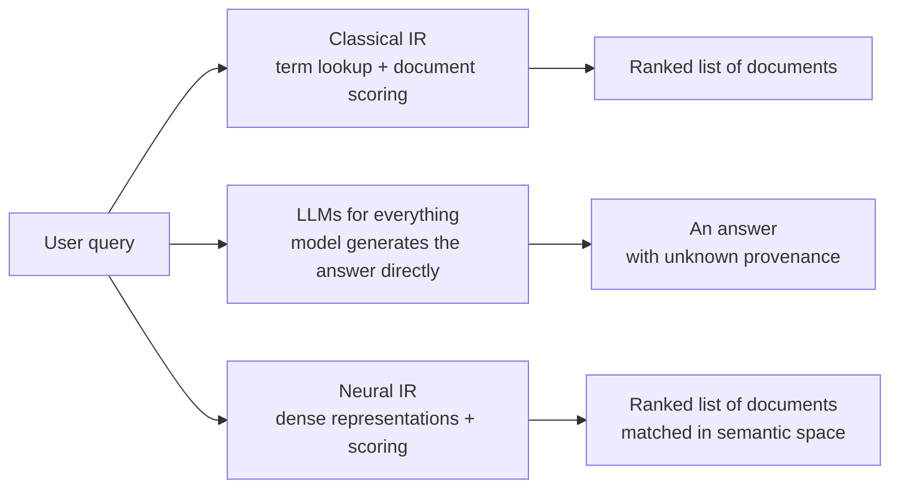

> 🌏 [中文版](/posts/ai/2026-09-29-cs224u-information-retrieval)

> **Version note**: This post is based on the Spring 2023 edition of [CS224U](https://web.stanford.edu/class/cs224u/). The main sources are the [Information retrieval slides](https://web.stanford.edu/class/cs224u/slides/cs224u-neuralir-2023-handout.pdf) (Christopher Potts and Omar Khattab; 78 PDF pages, 62 numbered slides) and videos 15–19 of the [XCS224U playlist](https://www.youtube.com/playlist?list=PLoROMvodv4rOwvldxftJTmoR3kRcWkJBp); every fact was checked on 2026-09-29. Access grade **A3**: the slides, videos, and related assignment notebook are all public. What's missing is the Canvas quizzes and the classroom recordings.

**Series**: Previous: [Homework 1: Multi-Domain Sentiment](/posts/ai/2026-09-29-cs224u-hw1-multidomain-sentiment-en) | Next: [In-Context Learning](/posts/ai/2026-09-29-cs224u-in-context-learning-en) | [Series overview](/posts/ai/2026-08-21-stanford-cs224u-natural-language-understanding-en)

Homework 1 was classification: you get a sentence and label its sentiment. Homework 2 is a different kind of problem: you get only a question, and you have to find the evidence to answer it. The 2023 schedule calls this unit "Retrieval augmented in-context learning" and splits it into two slide decks: information retrieval first (this post), then in-context learning (the next one). Homework 2 puts them together.

This post answers one question: **why does a natural language understanding course spend a whole unit on search-engine technology?**

## Why an NLU course covers retrieval

The first section of the slides, "Guiding ideas," gives two reasons that point in opposite directions.

### Retrieval is itself a hard understanding problem

The example from Potts's [IR Part 1 video](https://www.youtube.com/watch?v=enRb6fp5_hw): the query is "what compounds protect the digestive system against viruses," and the relevant document says "in the stomach, gastric acid and proteases serve as powerful chemical defenses against ingested pathogens."

The two sentences share **no keywords at all**. Connecting them is entirely a matter of meaning. So the stronger NLU gets, the better retrieval gets. That's the "NLP is revolutionizing IR" side.

### Retrieval is also changing NLP

The other side is the one Potts cares about more: retrieval makes NLP tasks more open and closer to real needs. The slides contrast two kinds of question answering:

| | Standard QA (e.g., SQuAD) | OpenQA |
|---|---|---|
| Given at train time | Title, context, question, answer | Only question and answer |
| Given at test time | Title, context, question | Only the question |
| Answer guarantee | A literal substring of the context | No guarantee; the context has to be retrieved |

Standard QA is no longer hard for current models, and it's disconnected from the real world: nobody hands you the right passage in advance. OpenQA is much harder, and it looks a lot more like actually searching the web.

The slides then list "knowledge-intensive tasks": question answering, claim verification, commonsense reasoning, long-form reading comprehension, information-seeking dialogue, plus summarization and natural language inference. The last two are usually treated as closed tasks. Potts's claim is that they too can be reframed as "retrieve, then decide," and in the video he calls it a hypothesis.

### Three search paradigms, and why the course bets on the third

The slides split search into three kinds: classical term lookup, "LLMs for everything" (send the query to a large language model and let it produce the answer), and neural IR. The second gives the most direct experience, but Potts says plainly that it worries him: the model can fabricate evidence, and you don't know where the answer came from.

The examples in the video are concrete. He asked an OpenAI model for evidence on whether professional baseball players may glue small wings to their caps; every link it gave was fabricated and led to a 404. He considers that worse than giving no evidence, because we've learned to treat URLs as trustworthy grounding. In another case, Bing answered the example question from Figure 1 of the DSP paper by citing that very paper as evidence, even though the figure was only an illustration.

The course bets on the third paradigm: keep classical search's contract of "return documents you can check," and just move the matching into a richer semantic space. Khattab, Potts, and Zaharia laid out this position in a 2021 [SAIL blog post](https://ai.stanford.edu/blog/retrieval-based-NLP/) (Khattab et al. 2021 on the schedule) as three advantages: models can be smaller and faster, answers come with sources, and updating knowledge only means editing the corpus.

## Classical IR: TF-IDF and BM25

The second section starts from the term–document matrix.

**TF-IDF** multiplies two things: term frequency (the share of the document this term accounts for) and inverse document frequency (the more documents a term appears in, the lower its weight). The slides' toy example sticks: a term that appears in all four documents gets an IDF of 0, so it contributes nothing to ranking.

**BM25** (Best Match, Attempt #25, from [Robertson & Zaragoza 2009](https://doi.org/10.1561/1500000019)) makes three changes to TF-IDF, each illustrated with its own plot in the slides:

- **Smoothed IDF**, which avoids extreme values.
- **Parameter b controls the document-length penalty**: for the same term frequency, longer documents score lower.
- **Parameter k flattens out higher frequencies**: a term appearing ten times isn't twice as important as one appearing five times.

The slides give defaults of roughly k = 1.2 and b = 0.75.

BM25 formulas (as in the slides)

- IDF_BM25(w, D) = log(1 + (|D| − df(w, D) + 0.5) / (df(w, D) + 0.5))
- Score_BM25(w, doc) = TF(w, doc) · (k + 1) / (TF(w, doc) + k · (1 − b + b · |doc| / avgdoclen))
- BM25(w, doc, D) = Score_BM25(w, doc) · IDF_BM25(w, D)

The query–document relevance score is the sum of the weights of the query's terms.

In practice, these scores are precomputed and stored in an **inverted index**: each term maps to a list of (document, score) pairs. A query comes in, you look up its terms, sum, and sort. That's the search experience everyone knows.

The slides also list classical techniques beyond term matching (query and document expansion, phrase search, term dependence, separate document fields, link analysis like PageRank, learning to rank) and three tools: [Elasticsearch](https://www.elastic.co), [Pyserini](https://github.com/castorini/pyserini), and [PrimeQA](https://github.com/primeqa/primeqa).

## IR metrics: there is no single answer

The third section first reminds you that metrics have many dimensions: besides accuracy-style metrics there's latency, throughput, FLOPs, disk usage, memory usage, and total cost. The first half of the section covers only accuracy-style metrics.

The slides compute each of these on the same three rankings (D1, D2, D3, each with three relevant documents):

| Metric | What it measures |
|---|---|
| Success@K | Whether at least one relevant document is in the top K (0 or 1) |
| RR@K / MRR@K | The reciprocal of the rank of the first relevant document; MRR averages over queries |
| Precision@K | The share of the top K that is relevant |
| Recall@K | The share of all relevant documents that appear in the top K |
| Average precision | Precision computed at each relevant document's position, summed, divided by the number of relevant documents |

The same rankings can come out differently under different metrics. In the example, Success@2 rates D1 and D2 as equally good; under average precision, D3 edges ahead of D2, something the earlier metrics don't reveal at small K.

The slides' guidance on choosing:

- If it's cheap for users to scroll through K passages, Success@K may be enough.
- If a query has multiple relevant documents, Success and RR are too coarse.
- If finding every relevant document matters most, favor recall.
- If reviewing only relevant documents matters most, favor precision.
- Average precision gives the finest distinctions, since it's sensitive to rank, precision, and recall at once.

### Beyond accuracy

The section ends with an MS MARCO leaderboard assembled from published papers (from Santhanam et al. 2022c). In the accuracy column, PLAID ColBERTv2 has an MRR@10 of 39.4 and BM25 only 18.7. But the ColBERT rows all list multiple GPUs in the hardware column (a footnote says one of the PLAID results didn't actually use a GPU), while the BT-SPLADE models use no GPU at all and score close to ColBERT.

In the [IR Part 3 video](https://www.youtube.com/watch?v=9YCb-IxtbFQ), Potts uses a cost-versus-accuracy plot to explain the Pareto frontier: BM25 is very cheap but ineffective, and for almost the same cost a small BT-SPLADE model gives a big jump in MRR. **Which system is "best" depends on which dimensions you count.**

## Neural IR: trading expressiveness for scale

The fourth section is the core of the unit. The setting: take a pretrained BERT and fine-tune it for retrieval. Four approaches sit along a spectrum.

| Model | How it encodes | Strength | Cost |
|---|---|---|---|
| Cross-encoder | Concatenate query and document, run BERT, score the representation above [CLS] | Every token can interact with every other; the richest semantics | Every document must be encoded at query time; a billion documents means a billion forward passes |
| [DPR](https://aclanthology.org/2020.emnlp-main.550/) | Encode query and document separately, one [CLS] vector each, score by dot product | Document vectors can be computed offline, one vector per document | Everything has to fit into a single vector; token-level interaction is gone |
| [ColBERT](https://arxiv.org/abs/2004.12832) | Encode separately but keep every token's vector, score with MaxSim | Scalable, while keeping token-level late interaction | The index stores token-level vectors and gets large |
| [SPLADE](https://dl.acm.org/doi/10.1145/3404835.3463098) | Score against the whole vocabulary to get a sparse, vocabulary-sized vector; score by dot product | Returns to the classical intuition of term matching, inside a neural representation | Needs a regularization term to keep scores sparse and balanced |

The first three share a loss function: the negative log-likelihood of the positive passage, with the positive score plus all negative scores in the denominator. The slides pull this out explicitly to show that the models differ only in how they compare query and document.

### How ColBERT gets fast

ColBERT gets by far the most space in the slides (Potts admits in the video that he's biased toward it). They walk through three ways to use it:

1. **As a reranker**: retrieve the top K with a fast model like BM25, then rescore with ColBERT.
2. **For direct retrieval**: for each query token vector, fetch the most similar document token vectors, then fully score those documents.
3. **Centroid-based**: first find the centroids nearest each query vector and search for token vectors only around them, which shrinks the search space dramatically.

The [IR Part 4 video](https://www.youtube.com/watch?v=EDVqG86AT0Q) covers the latency analysis behind [PLAID](https://arxiv.org/abs/2205.09707). Even with those optimizations, ColBERT's latency was still 287 milliseconds, against a deployable target of roughly 50. The bottleneck wasn't the centroids but looking things up in the large index and decompressing low-bit token vectors. After PLAID removed most of that overhead, latency dropped to 58 milliseconds. Potts's point: **chasing latency instead of accuracy is a valuable research direction too.**

The slides close the section with a list of recent developments, mostly ColBERT-related as well: CITADEL, faster SPLADE variants, DESSERT, distilling ColBERT into single-vector models, multilingual distillation, and more.

## Datasets, and what the unit leaves open

The fifth section lists common datasets:

- **TREC**: annual retrieval competitions that emphasize careful evaluation on few queries (for example, 50 queries with over 100 annotated documents each).
- **MS MARCO**: according to the slides, the largest public IR benchmark, built on more than 500,000 Bing queries. Labels are sparse (roughly one relevance label per query), but it's excellent for training. Passage ranking has 9 million short passages; document ranking has 3 million long documents.
- **[BEIR](https://arxiv.org/abs/2104.08663)**: zero-shot evaluation across domains.
- **LoTTE**: released with the ColBERTv2 paper, drawn mainly from StackExchange, also for zero-shot evaluation.
- **XOR-TyDi**: multilingual information-seeking QA and OpenQA.

The video also flags three topics it doesn't develop: how to sample negatives; weak supervision (for example, the simple heuristic "a passage is relevant if it contains the answer string," which Potts says works surprisingly well); and Dynascores, which combine accuracy, cost, and latency into a single leaderboard (covered later in the course's methods unit).

The slides' conclusion is a single sentence: NLU and IR are back together again.

## How to self-study this unit

1. Start with the [IR Part 1 video](https://www.youtube.com/watch?v=enRb6fp5_hw) (guiding ideas). It motivates the whole unit and bridges to Homework 2.
2. Take the slides' D1/D2/D3 example and compute all five metrics yourself, then check against the slides. It's the fastest way to confirm you understand average precision.
3. Read the neural IR section alongside the architecture figures in the original [ColBERT](https://arxiv.org/abs/2004.12832) and [DPR](https://arxiv.org/abs/2004.04906) papers.
4. Homework 2 ([hw_openqa.ipynb](https://github.com/cgpotts/cs224u/blob/main/hw_openqa.ipynb)) uses ColBERTv2 as its retriever; the checkpoint and index sizes are in the [series overview](/posts/ai/2026-08-21-stanford-cs224u-natural-language-understanding-en).

One thing to do tonight: pick any search feature you use (an internal document search at work is fine) and write down whether it should care most about Success@K, recall, or precision, justified with the slides' five rules.

## Further reading

- The components of RAG and language agents: [CS224N Lecture 10: Six Components of RAG and Language Agents](/posts/ai/2026-08-22-cs224n-rag-language-agents-en)
- Course status and the assignment environment: [Reading Stanford CS224U (series overview)](/posts/ai/2026-08-21-stanford-cs224u-natural-language-understanding-en)

## References

- [CS224U course site (Spring 2023)](https://web.stanford.edu/class/cs224u/) — schedule, unit names, readings
- [Information retrieval slides (Potts & Khattab, Spring 2023)](https://web.stanford.edu/class/cs224u/slides/cs224u-neuralir-2023-handout.pdf) — all formulas, metric examples, model comparisons, and dataset list in this post
- [IR Part 1: Guiding Ideas video](https://www.youtube.com/watch?v=enRb6fp5_hw) — the digestive-system example, fabricated links, Bing citing the DSP paper
- [IR Part 2: Classical IR video](https://www.youtube.com/watch?v=D3yL63aYNMQ)
- [IR Part 3: IR metrics video](https://www.youtube.com/watch?v=9YCb-IxtbFQ) — metric-choice guidance and the Pareto frontier
- [IR Part 4: Neural IR video](https://www.youtube.com/watch?v=EDVqG86AT0Q) — why cross-encoders don't scale; PLAID from 287 ms to 58 ms
- [IR Part 5: Datasets and Conclusion video](https://www.youtube.com/watch?v=Bqps-t-U9jw) — datasets, negative sampling, weak supervision
- [Khattab, Potts & Zaharia, Building Scalable, Explainable, and Adaptive NLP Models with Retrieval (SAIL Blog, 2021-10-05)](https://ai.stanford.edu/blog/retrieval-based-NLP/) — the three advantages of retrieval-based NLP
- [Khattab & Zaharia, ColBERT (SIGIR 2020)](https://arxiv.org/abs/2004.12832)
- [Karpukhin et al., Dense Passage Retrieval for Open-Domain Question Answering (EMNLP 2020)](https://aclanthology.org/2020.emnlp-main.550/)
- [Formal, Piwowarski & Clinchant, SPLADE (SIGIR 2021)](https://dl.acm.org/doi/10.1145/3404835.3463098)
- [Santhanam et al., ColBERTv2 (NAACL 2022)](https://arxiv.org/abs/2112.01488) — source of the LoTTE dataset
- [Santhanam et al., PLAID: An Efficient Engine for Late Interaction Retrieval (CIKM 2022)](https://arxiv.org/abs/2205.09707)
- [Robertson & Zaragoza, The Probabilistic Relevance Framework: BM25 and Beyond (2009)](https://doi.org/10.1561/1500000019)
- [Thakur et al., BEIR (2021)](https://arxiv.org/abs/2104.08663)
- [hw_openqa.ipynb](https://github.com/cgpotts/cs224u/blob/main/hw_openqa.ipynb) — Homework 2, which this unit feeds into
