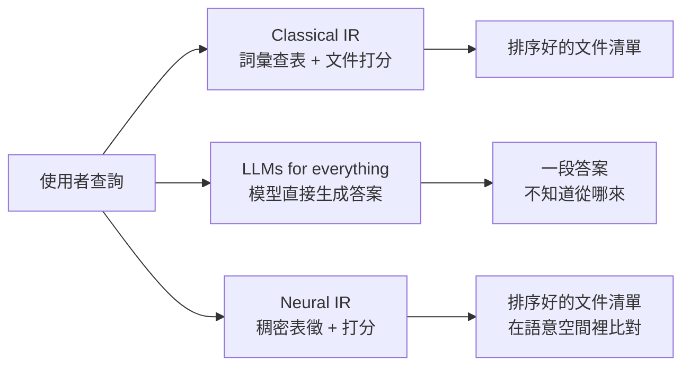

> 🌏 [English version](/posts/ai/2026-09-29-cs224u-information-retrieval-en)

**影片狀態：已附影片。** [影片來源與說明](#課程影片來源)

> **版本說明**：本文依據 [CS224U](https://web.stanford.edu/class/cs224u/) 2023 春季版。主要材料是 [Information retrieval 投影片](https://web.stanford.edu/class/cs224u/slides/cs224u-neuralir-2023-handout.pdf)（Christopher Potts 與 Omar Khattab，PDF 共 78 頁，投影片編號 62 張）與 [XCS224U 播放清單](https://www.youtube.com/playlist?list=PLoROMvodv4rOwvldxftJTmoR3kRcWkJBp) 第 15–19 支錄影，事實皆於 2026-09-29 核對。存取等級 **A3**：投影片、錄影與相關作業 notebook 都公開；拿不到的是 Canvas quiz 與教室錄影。

**系列位置**：上一篇 [作業一：多領域情感分析](/posts/ai/2026-09-29-cs224u-hw1-multidomain-sentiment)｜下一篇 [In-context learning](/posts/ai/2026-09-29-cs224u-in-context-learning)｜[系列總覽](/posts/ai/2026-08-21-stanford-cs224u-natural-language-understanding)

作業一是分類題：句子給你，你判斷它的情感。作業二換成另一種題型：只給你一個問題，回答所需的證據要自己去找。2023 年的講次表把這個單元叫「Retrieval augmented in-context learning」，拆成兩份投影片，先講資訊檢索（本篇），再講 in-context learning（下一篇），最後在作業二合起來。

這篇回答一個問題：**為什麼一門自然語言理解的課，要花一整個單元講搜尋引擎的技術？**

## 課程影片來源

下列影片是 Stanford Online 發布的 Spring 2023 對應講次錄影，與本文採用的 2023 年春季版課程一致。2026-10-10 已對照官方播放清單（50 支）核對標題與影片 ID。

```youtube
url: https://www.youtube.com/watch?v=enRb6fp5_hw
title: Stanford XCS224U: NLU I Information Retrieval, Part 1: Guiding Ideas I Spring 2023
```

```youtube
url: https://www.youtube.com/watch?v=9YCb-IxtbFQ
title: Stanford XCS224U: NLU I Information Retrieval, Part 3: IR metrics I Spring 2023
```

原始影片：[Stanford XCS224U: NLU I Information Retrieval, Part 1: Guiding Ideas I Spring 2023](https://www.youtube.com/watch?v=enRb6fp5_hw)、[Stanford XCS224U: NLU I Information Retrieval, Part 3: IR metrics I Spring 2023](https://www.youtube.com/watch?v=9YCb-IxtbFQ)

課程與錄影入口：

- [XCS224U 播放清單](https://www.youtube.com/playlist?list=PLoROMvodv4rOwvldxftJTmoR3kRcWkJBp)
- [官方課程／講次來源](https://web.stanford.edu/class/cs224u/)

## 為什麼 NLU 課要講檢索

投影片第一節「Guiding ideas」給了兩個方向相反的理由。

### 檢索本身就是一個難的理解問題

Potts 在 [IR 第 1 支錄影](https://www.youtube.com/watch?v=enRb6fp5_hw) 舉的例子：查詢是「什麼化合物能保護消化系統對抗病毒」，相關的文件講的是「胃裡的胃酸與蛋白酶是對抗攝入病原體的強力化學防線」。

兩句話的關鍵詞**沒有任何字串重疊**。要把它們連起來，靠的完全是語意。所以 NLU 技術越強，檢索就做得越好，這是「NLP 正在改變 IR」的那一面。

### 檢索也在改變 NLP

另一面是 Potts 自己比較在意的：檢索讓 NLP 的任務變得更開放、更接近真實需求。投影片用問答對照：

| | 標準 QA（如 SQuAD） | OpenQA |
|---|---|---|
| 訓練時給什麼 | 標題、段落、問題、答案 | 只有問題與答案 |
| 測試時給什麼 | 標題、段落、問題 | 只有問題 |
| 答案保證 | 是段落裡的字面子字串 | 沒有保證；段落要自己檢索 |

標準 QA 對現在的模型已經不難，但它跟真實世界脫節：現實裡很少有人把正確段落先遞給你。OpenQA 難得多，也更像實際在網路上查資料。

投影片接著列了一批「知識密集型任務」：問答、事實查核、常識推理、長篇閱讀理解、資訊尋求型對話，外加摘要與自然語言推論。後兩項通常被當成封閉任務，Potts 的主張是它們也能改寫成「先檢索再判斷」的版本，這是一個假設，他在錄影裡也這麼稱呼它。

### 三種搜尋範式，以及為什麼課程押第三種



投影片把搜尋分成三種：傳統的詞彙查表、「LLMs for everything」（查詢丟給大型語言模型，直接吐出答案），以及 neural IR。第二種的體驗最直接，Potts 卻明講他很擔心：模型會捏造證據，而你不知道答案從哪來。

錄影裡的例子很具體。他請 OpenAI 的模型替「職棒球員可不可以在帽子上黏小翅膀」這個問題附上證據，模型給的連結全是捏造的，點進去都是 404。他認為這比不給證據還糟，因為大家已經習慣把 URL 當成可信的依據。另一個例子是 Bing 回答 DSP 論文圖一裡的示範問題時，引用的證據正是那篇論文本身，而那張圖只是說明用的例子。

課程押的是第三種：保留傳統搜尋「回傳可檢查的文件」這個契約，只把比對搬進更豐富的語意空間。Khattab、Potts 與 Zaharia 在 2021 年的 [SAIL 部落格文章](https://ai.stanford.edu/blog/retrieval-based-NLP/)（講次表上的 Khattab et al. 2021）把這個立場寫成三個好處：模型可以更小更快、答案附得出來源、知識更新只要改語料庫。

## Classical IR：TF-IDF 與 BM25

第二節從詞彙—文件矩陣講起。

**TF-IDF** 由兩部分相乘：詞頻（這個詞在文件裡佔多少比例）與逆文件頻率（出現在越多文件裡的詞，權重越低）。投影片的小例子很好記：一個詞如果出現在全部四份文件裡，IDF 是 0，等於對排序毫無貢獻。

**BM25**（Best Match, Attempt #25，出自 [Robertson & Zaragoza 2009](https://doi.org/10.1561/1500000019)）在 TF-IDF 上做了三件事，投影片各用一張圖說明：

- **平滑過的 IDF**，避免極端值。
- **參數 b 控制文件長度懲罰**：同樣的詞頻，長文件得分較低。
- **參數 k 讓高詞頻的效益遞減**：一個詞出現十次，不會比出現五次重要一倍。

投影片給的預設值是 k = 1.2、b = 0.75 左右。

<details>
<summary>BM25 公式（依投影片）</summary>

- IDF_BM25(w, D) = log(1 + (|D| − df(w, D) + 0.5) / (df(w, D) + 0.5))
- Score_BM25(w, doc) = TF(w, doc) · (k + 1) / (TF(w, doc) + k · (1 − b + b · |doc| / avgdoclen))
- BM25(w, doc, D) = Score_BM25(w, doc) · IDF_BM25(w, D)

查詢與文件的相關分數，是查詢裡每個詞的權重加總。

</details>

實作上，這些分數會預先算好存在**倒排索引**裡：每個詞對應一串（文件, 分數）。查詢進來時查表、加總、排序，這就是我們熟悉的搜尋體驗。

投影片也列了詞彙比對之外的傳統手法（查詢與文件擴展、片語搜尋、詞彙相依、不同欄位、PageRank 這類連結分析、learning to rank），以及三個工具：[Elasticsearch](https://www.elastic.co)、[Pyserini](https://github.com/castorini/pyserini)、[PrimeQA](https://github.com/primeqa/primeqa)。

## IR 指標：沒有唯一答案

第三節先提醒指標有很多維度：準確度類指標之外，還有延遲、吞吐量、FLOPs、磁碟用量、記憶體用量與總成本。這一節的前半只講準確度類。

投影片用同一組三個排序（D1、D2、D3，各有三份相關文件）逐一算下面這些指標：

| 指標 | 在量什麼 |
|---|---|
| Success@K | 前 K 名裡有沒有至少一份相關文件（0 或 1） |
| RR@K／MRR@K | 第一份相關文件排第幾名，取倒數；MRR 是多個查詢的平均 |
| Precision@K | 前 K 名裡相關文件的比例 |
| Recall@K | 所有相關文件裡，有多少出現在前 K 名 |
| Average precision | 在每個相關文件出現的位置算一次 precision，加總後除以相關文件數 |

同一組排序，換一個指標結論就可能換。例子裡 Success@2 認為 D1 與 D2 一樣好；改看 average precision，D3 反而略勝 D2，這是前面幾個指標在 K 取小值時看不出來的。

投影片給的選擇原則：

- 使用者往下翻 K 筆的成本很低 → Success@K 可能就夠。
- 每個查詢有多份相關文件 → Success 與 RR 太粗。
- 找齊所有相關文件最重要 → 看 recall。
- 只想看相關的、不想浪費時間審閱 → 看 precision。
- Average precision 的區分最細，同時對排名、precision、recall 敏感。

### 準確度之外

這一節最後放了一張從各論文整理出的 MS MARCO 排行表（出自 Santhanam et al. 2022c）。準確度那一欄，PLAID ColBERTv2 的 MRR@10 是 39.4，BM25 只有 18.7；但 ColBERT 那幾列的硬體欄都列了多顆 GPU（表註說明其中一筆 PLAID 結果實際沒用到 GPU），而 BT-SPLADE 系列完全不用 GPU，分數也接近 ColBERT。

Potts 在 [IR 第 3 支錄影](https://www.youtube.com/watch?v=9YCb-IxtbFQ) 用成本對準確度的圖講 Pareto frontier：BM25 很便宜但效果差，幾乎同樣成本換成小型 BT-SPLADE，MRR 就大幅上升。**哪個系統「最好」，取決於你把哪些維度算進來。**

## Neural IR：表達力與規模的取捨

第四節是這個單元的核心。背景設定是：拿一個預訓練的 BERT，把它微調成檢索模型。四種做法落在一條光譜上。

| 模型 | 怎麼編碼 | 優點 | 代價 |
|---|---|---|---|
| Cross-encoder | 查詢與文件串在一起進 BERT，取 [CLS] 上的表徵打分 | 所有 token 之間都能互動，語意最豐富 | 每份文件都要在查詢時跑一次；十億份文件就是十億次前向傳播 |
| [DPR](https://aclanthology.org/2020.emnlp-main.550/) | 查詢與文件分開編碼，各取 [CLS] 一個向量，內積打分 | 文件向量可以離線算好，每份只存一個向量 | 所有資訊要擠進單一向量，token 層級的互動全沒了 |
| [ColBERT](https://arxiv.org/abs/2004.12832) | 分開編碼，但保留每個 token 的向量，用 MaxSim 打分 | 可擴展，又保留 token 層級的延後互動 | 索引要存 token 層級向量，體積大 |
| [SPLADE](https://dl.acm.org/doi/10.1145/3404835.3463098) | 對整個詞彙表打分，得到詞彙表長度的稀疏向量，內積打分 | 回到「詞彙比對」的傳統直覺，但在神經表徵裡做 | 需要正則化項讓分數稀疏且平衡 |

前三種共用同一個損失函式：正例文件分數的負對數似然，分母是正例加上所有負例的分數總和。投影片特別把這點拉出來，說明這些模型差別只在「怎麼比較查詢與文件」。

### ColBERT 怎麼變快

投影片給 ColBERT 的篇幅明顯最多（Potts 自己在錄影裡說他偏心 ColBERT）。它依序介紹三種用法：

1. **當 reranker**：先用 BM25 這類快速模型撈前 K 份，再用 ColBERT 重新打分。
2. **直接檢索**：對查詢的每個 token 向量，撈最相似的文件 token 向量，再對那些文件完整打分。
3. **以 centroid 為基礎**：先找離查詢向量最近的幾個 centroid，只在那附近找 token 向量，大幅縮小搜尋範圍。

[IR 第 4 支錄影](https://www.youtube.com/watch?v=EDVqG86AT0Q) 講了 [PLAID](https://arxiv.org/abs/2205.09707) 的延遲分析：做完上述優化，ColBERT 的延遲仍有 287 毫秒，而可部署的目標大約是 50 毫秒。瓶頸不在 centroid，而在查大型索引與解壓縮低位元的 token 向量。PLAID 減掉這部分開銷後，延遲降到 58 毫秒。Potts 用這個例子說明：**不追準確度、改追延遲，同樣是有價值的研究方向。**

投影片最後列了一串近期發展，多數也跟 ColBERT 有關：CITADEL、更快的 SPLADE 變體、DESSERT、把 ColBERT 蒸餾成單向量模型、多語言蒸餾等。

## 資料集與這個單元沒講完的事

第五節列了幾個常用資料集：

- **TREC**：每年的檢索競賽，強調仔細評估少量查詢（例如 50 個查詢、每個超過 100 份標注文件）。
- **MS MARCO**：投影片說它是最大的公開 IR benchmark，超過 50 萬個 Bing 查詢；標籤很稀疏，大約每個查詢只有一個相關標籤，但很適合訓練。passage ranking 有 900 萬短段落，document ranking 有 300 萬長文件。
- **[BEIR](https://arxiv.org/abs/2104.08663)**：跨領域的 zero-shot 評估。
- **LoTTE**：ColBERTv2 論文一起釋出，主要取材自 StackExchange，也是 zero-shot 評估用。
- **XOR-TyDi**：多語言的資訊尋求型 QA 與 OpenQA。

錄影裡另外點了三個沒展開的主題：負例怎麼取樣、弱監督（例如「段落裡含有答案字串就算相關」這種簡單啟發式，Potts 說效果出奇地好），以及用 Dynascores 把準確度、成本、延遲合成單一排行（課程後面的方法論單元會再講）。

投影片的結語只有一句：NLU 與 IR 又重新走在一起了。

## 自學怎麼用這個單元

1. 先看 [IR 第 1 支錄影](https://www.youtube.com/watch?v=enRb6fp5_hw)（guiding ideas），它是整個單元的動機，也是作業二的橋。
2. 拿投影片的 D1／D2／D3 例子，自己把五個指標算一遍，再對答案。這是最快確認你懂 average precision 的方法。
3. Neural IR 那一節搭配 [ColBERT](https://arxiv.org/abs/2004.12832) 與 [DPR](https://arxiv.org/abs/2004.04906) 原論文的架構圖讀。
4. 作業二（[hw_openqa.ipynb](https://github.com/cgpotts/cs224u/blob/main/hw_openqa.ipynb)）會用 ColBERTv2 當檢索器，需要的權重與索引檔大小見 [系列總覽](/posts/ai/2026-08-21-stanford-cs224u-natural-language-understanding)。

今晚可以做的一件事：拿你手邊任何一個搜尋功能（公司內部文件搜尋也行），寫下它最該看的是 Success@K、recall 還是 precision，理由用投影片那五條原則講。

## 延伸閱讀

- RAG 與 language agent 的元件拆解：[CS224N 第 10 講：RAG 與 Language Agents 的六個元件](/posts/ai/2026-08-22-cs224n-rag-language-agents)
- 課程狀態與作業環境：[Stanford CS224U 導讀（系列總覽）](/posts/ai/2026-08-21-stanford-cs224u-natural-language-understanding)

## 更新紀錄

- 2026-10-10：標註影片狀態，核對錄影來源與取得方式。
- 2026-10-10：重查影片狀態。依官方播放清單逐講核對影片 ID 與講次，確認無誤，影片標題改用原標題。

## 參考資料

- [CS224U 課程官網（Spring 2023）](https://web.stanford.edu/class/cs224u/) — 講次表、單元名稱與 readings
- [Information retrieval 投影片（Potts & Khattab, Spring 2023）](https://web.stanford.edu/class/cs224u/slides/cs224u-neuralir-2023-handout.pdf) — 本文所有公式、指標例子、模型比較與資料集清單
- [IR Part 1: Guiding Ideas 錄影](https://www.youtube.com/watch?v=enRb6fp5_hw) — 消化系統的例子、捏造連結與 Bing 引用 DSP 論文的例子
- [IR Part 2: Classical IR 錄影](https://www.youtube.com/watch?v=D3yL63aYNMQ)
- [IR Part 3: IR metrics 錄影](https://www.youtube.com/watch?v=9YCb-IxtbFQ) — 指標選擇原則與 Pareto frontier 的講解
- [IR Part 4: Neural IR 錄影](https://www.youtube.com/watch?v=EDVqG86AT0Q) — cross-encoder 的規模問題、PLAID 從 287 毫秒到 58 毫秒
- [IR Part 5: Datasets and Conclusion 錄影](https://www.youtube.com/watch?v=Bqps-t-U9jw) — 資料集與負例取樣、弱監督
- [Khattab, Potts & Zaharia, Building Scalable, Explainable, and Adaptive NLP Models with Retrieval（SAIL Blog, 2021-10-05）](https://ai.stanford.edu/blog/retrieval-based-NLP/) — 檢索式 NLP 的三個好處
- [Khattab & Zaharia, ColBERT (SIGIR 2020)](https://arxiv.org/abs/2004.12832)
- [Karpukhin et al., Dense Passage Retrieval for Open-Domain Question Answering (EMNLP 2020)](https://aclanthology.org/2020.emnlp-main.550/)
- [Formal, Piwowarski & Clinchant, SPLADE (SIGIR 2021)](https://dl.acm.org/doi/10.1145/3404835.3463098)
- [Santhanam et al., ColBERTv2 (NAACL 2022)](https://arxiv.org/abs/2112.01488) — LoTTE 資料集出處
- [Santhanam et al., PLAID: An Efficient Engine for Late Interaction Retrieval (CIKM 2022)](https://arxiv.org/abs/2205.09707)
- [Robertson & Zaragoza, The Probabilistic Relevance Framework: BM25 and Beyond (2009)](https://doi.org/10.1561/1500000019)
- [Thakur et al., BEIR (2021)](https://arxiv.org/abs/2104.08663)
- [hw_openqa.ipynb](https://github.com/cgpotts/cs224u/blob/main/hw_openqa.ipynb) — 這個單元對應的作業二
