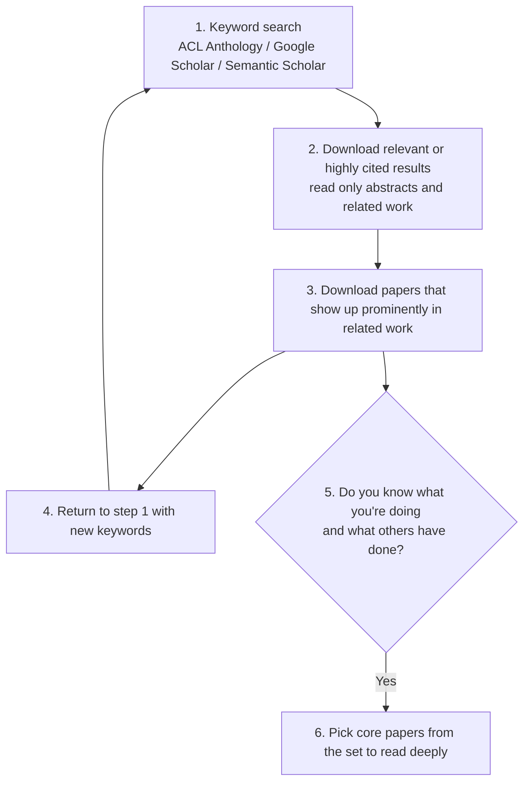

> 🌏 [中文版](/posts/ai/2026-09-29-cs224u-lit-review-experiment-protocol)

**Video status: Official entry or recording index only.** [Source details](#course-video-sources)

**This post is based on the Spring 2023 edition of CS224U.** It is part 15 of the [Reading Stanford CS224U](/posts/ai/2026-08-21-stanford-cs224u-natural-language-understanding-en) series. The previous part, [Methods and Metrics II](/posts/ai/2026-09-29-cs224u-datasets-model-evaluation-en), covered baselines, splits, and statistical comparison. This part puts that methodology into the two documents the final project actually asks you to submit.

The CS224U final project is half the grade, in three deliverables: a literature review, an experiment protocol, and a final paper. The series overview's [final-project section](/posts/ai/2026-08-21-stanford-cs224u-natural-language-understanding-en) already covers the grading axes: results don't count, but metric choice, methodological strength, and honesty about limits do. This post doesn't repeat them. It does one thing: **it breaks the first two deliverables into steps you can follow.** The final paper gets the [next part](/posts/ai/2026-09-29-cs224u-presenting-research-en).

## Course video sources

Official course and existing recording entries are linked below. A single public video matching this article has not been verified for embedding.

Course and recording entries:

- [XCS224U Spring 2023 YouTube playlist](https://www.youtube.com/playlist?list=PLoROMvodv4rOwvldxftJTmoR3kRcWkJBp)
- [Official course / lecture source](https://web.stanford.edu/class/cs224u/)

## Official materials and access

| Material | Content | Status |
|---|---|---|
| [Lit review overview slides](https://web.stanford.edu/class/cs224u/slides/cs224u-litreview-overview-2023.pdf) (9 pages) | Purpose, six-step paper search, plagiarism policy | Public |
| [Experiment protocol overview slides](https://web.stanford.edu/class/cs224u/slides/cs224u-protocol-overview-2023.pdf) (6 pages) | Purpose, five tips | Public |
| [Siyan's final-project slides](https://web.stanford.edu/class/cs224u/slides/siyan-projects-cs224u.pdf) (25 pages) | How one student did the lit review and experiment design | Public |
| [YouTube](https://www.youtube.com/playlist?list=PLoROMvodv4rOwvldxftJTmoR3kRcWkJBp) videos 32 and 38 | Lit Review Overview, Experiment Protocol Overview | Public |
| [projects.html](https://web.stanford.edu/class/cs224u/projects.html) #litreview, #protocol | Page limits, required sections, Overleaf templates | Public |
| [projects.md](https://github.com/cgpotts/cs224u/blob/main/projects.md) | Long-form guidance and FAQ | Public |
| "Gradescope submission format" and "rubric" slides | Titles only; the content is screenshots | Screenshot text can't be extracted from the PDF, so this post doesn't describe it |
| Past exemplary final papers | Examples | Stanford login required (302 to a login page) |

Overall this is **A3 (historical edition)**. The requirement documents are fully public, but the rubric details and example papers are not.

The 2023 timeline: the Lit review overview sat in the Analysis methods unit (from May 8), with the lit review due May 17. The Experiment protocol overview sat in the NLP methods unit (from May 17), with the protocol due May 29. Less than two weeks separated the two deadlines.

## What both deliverables are for

Both decks open slide 2 with nearly the same sentence. The goal of this assignment (and the next one) is to enter into **a productive dialogue with your teammates and with your mentor.**

- For the lit review, the list reads: pose questions, identify obstacles and propose workarounds, find datasets and models, think carefully about your resources.
- For the protocol: identify the core questions, identify core methods, identify obstacles and propose workarounds.

Every project team gets a mentor from the teaching team who gives feedback on all project work. So both documents are communication tools. You write them for your mentor, so the mentor can help. They are not results reports.

## Deliverable 1: the literature review

### Hard requirements

- About 6 pages, 8 maximum, in ACL format. An Overleaf template is encouraged but optional.
- Paper count scales with team size: 5 for one person, 7 for two, 9 for three. projects.md explains the assumption: you split the papers, each person reads their share deeply, and then you share what you learned.
- You may review more, but the document suggests going deep on the required number and treating the rest as peripheral.
- Ideally the topic matches the final project. If the review shows the topic isn't a good fit, you can switch topics or even teams. The lit review is graded on its own terms.
- Sources don't have to be NLP papers. Interdisciplinary projects *must* draw on other fields. Books, very good blog posts, government reports, and even rich talks or interview transcripts all count.

### Step 1: find papers with the six-step loop

Slide 6 of the lit review deck gives the procedure:

Step 2 has a line worth underlining: **do not try to read entire papers at this point.** Deep reading is step 6.

projects.md adds notes on sources. The ACL Anthology holds decades of ACL work and is the fastest way to map the field. Google Scholar and Semantic Scholar citation counts help gauge importance; the document says citations don't guarantee quality but do suggest influence. arXiv leans toward newer NLP work, because posting there only recently became the norm for NLP researchers.

You don't need to know your project yet. The document says an initial hunch is enough at this stage. A few sensible keywords in a search engine will get you going.

### Step 2: write the five sections

projects.html and projects.md list the same five sections and note that the italicized phrases make good headings:

1. **General problem/task definition:** what these papers try to solve, and why.
2. **Concise summaries of the articles:** each paper's main contributions in your own words. Don't copy; "we can read them ourselves."
3. **Compare and contrast:** how are they similar and different? Do they agree? Do results conflict? If they tackle different subtasks, how do those relate? (The parenthetical: if they aren't related, you may have picked poorly.) The document calls this section **probably the most valuable for the final project**, because it can become the paper's related-work section.
4. **Future work:** several ways to extend the work, including how the papers connect to your project idea.
5. **References section:** alphabetical, with at least full author names, year, title, and venue. The format is otherwise flexible.

### Step 3: know the line on AI assistants

The plagiarism slide (slide 7) is explicit:

- No rule forbids using an AI assistant for the lit review, **but all model output must be quoted**, per course policy.
- Assignments made of lots of quoted text won't get good grades.
- Assignments with substantial overlap in prose will be scrutinized for plagiarism.

In practice, AI can help you find directions and organize notes, but the prose you submit has to be yours. Quotation marks protect you from a plagiarism charge. They don't protect you from a low grade.

## Deliverable 2: the experiment protocol

### Hard requirements

- 8 pages maximum, though "the norm is for them to be shorter." Again, an Overleaf template is encouraged but optional.
- Seven required sections: Hypotheses, Data, Metrics, Models, General reasoning, Summary of progress so far, References.
- It is **not a preregistration.** The final paper can use different methods or data. Discuss major changes with your mentor, and consider updating the protocol.
- Changing the topic is a different matter. The FAQ says it isn't strictly forbidden, but after the protocol the team will likely discourage it. You're better off finishing the plan and saving the new idea for another occasion.

### Five tips from the slides

Slide 5 of the protocol deck:

1. There's no particular length in mind; short or long can be good or bad depending on the project.
2. Call out concerns, even distant ones. This is **the last chance to make sure the project will converge in the time allotted.**
3. Yes, you need to be able to state a hypothesis.
4. No, you don't need results yet, but results are very welcome.
5. The course wants you to have **a full working pipeline as soon as possible.**

### Filling in each section

For every section below, "what the mentor checks" comes from projects.md.

**Hypotheses.** The most common situation: "I don't have a hypothesis; I just want to see how a new model does on a task." The document's reply is to turn that into a precise hypothesis. Identify a component of the new model and hypothesize that it is crucial. That settles which models to compare: one with the component and a minimally different one without it. The document also notes that some NLP reviewing forms ask reviewers to state the paper's hypotheses. Stating yours clearly helps the reviewer, too.

**Data.** The mentor asks three things:
1. Is it clear which datasets you'll use? Something generic like "sentiment datasets" loses points and gets a request for a specific name.
2. Is the data available? Restricted or not-yet-existing data raises concern. The course is short, waiting for data hurts quality, and mentors will push you toward public datasets.
3. Does the data fit the hypotheses? If the mentor can't see the connection, you lose points and get asked to meet.

**Metrics.** At least one metric must be quantitative. The course says this doesn't mean all NLU work must be quantitative; it is simply a healthy requirement for the class. A standard choice (F1 for classification) needs little explanation. A non-standard or new metric needs a justification. Put qualitative evaluation ideas here too; they can later feed the paper's Analysis section. For choosing metrics, see [part 13](/posts/ai/2026-09-29-cs224u-methods-metrics-en) of this series.

**Models.** Describe your baselines and give a preliminary description of the models you'll study. The point is to show how models, data, and metrics combine into a clear test of the hypothesis. If the mentor can't put the pieces together, you lose points. The document stresses that baselines are crucial and points back to the Baselines section of the evaluation_methods notebook, covered in the [previous part](/posts/ai/2026-09-29-cs224u-datasets-model-evaluation-en) (`DummyClassifier` and task-specific baselines).

**General reasoning.** Explain how the data and models come together to inform your hypothesis. You may feel you already said this. The document calls that a good sign that the ideas are coming together, and asks you to restate it anyway. This section will likely become your paper's abstract.

**Summary of progress so far.** What's done, what's left, and what obstacles or concerns might keep the project from finishing. The more precise you are, the more the mentor can help. One of the most useful things a mentor can do here is define scope and set priorities. For example, they might name a core set of experiments and suggest setting the rest aside until you've drafted the whole paper.

**References.** Same format as the lit review.

## A worked example: Siyan's final project

The schedule cell for the Lit review overview also lists "Siyan: What I did for 224u final project." Siyan Li, on that term's teaching team, presented the final project from when Siyan took the course: "[Systematicity in GPT-3's Interpretation of Novel English Noun Compounds](https://arxiv.org/abs/2210.09492)" (Li, Carlson, Potts). The project later became a Findings of EMNLP 2022 paper.

It's worth studying because it fills in every section of both documents.

**How the lit review was written.** The starting point was a psycholinguistics paper (Levin et al.). Participants explained novel noun compounds such as "stew skillet" and "duck screen." The compounds were new, yet human intuitions about them stayed systematic. The authors proposed the Events vs. Essences hypothesis. When an artifact is the head, the modifier usually refers to an event of use or creation. When a natural kind is the head, the modifier usually refers to inherent properties. Siyan's slides give two pieces of advice:

- If your project extends an existing paper, explain that paper in more detail than the rest.
- Break the research question into facets and research and write a section for each. Don't go too low-level, though; the nitty-gritty belongs in methods and experiments.

**How the protocol grew.** Three experiments close in on the hypothesis step by step:

1. Prompt GPT-3 (text-davinci-002) with the 38 novel compounds from Levin et al. Three annotators label the outputs (Fleiss' Kappa above 0.7). Compute the correlation with the original labels and the exclusion rates. Siyan adds a note on the slide: if you use human annotators, high inter-rater agreement matters.
2. Switch to even more novel compounds with no lexical overlap. There are no human gold labels this time, so only exclusion rates are computed.
3. Use nonsense strings (such as "gmtomflxri") to remove lexical cues and test whether GPT-3 is just reasoning about the words themselves.

The first two experiments seemed to show that GPT-3 is systematic. Performance in the third was much worse, and the conclusion shifted: GPT-3 is likely reasoning about lexical items. That is exactly the structure the protocol asks for. **Each experiment rules out an alternative explanation of the previous result.**

## One thing to do tonight

Open the [Experiment protocol section](https://github.com/cgpotts/cs224u/blob/main/projects.md#experiment-protocol) of projects.md. Take a topic you want to work on and fill in just two sections:

- **Hypotheses:** write one sentence that starts "The central hypothesis of this project is…" If you can't, use the document's trick: name one component and claim it is crucial.
- **Models:** write down a comparison model that lacks only that component, plus a random baseline at the `most_frequent` level.

Once those two are filled in, Data and Metrics usually follow.

## Further reading

- Previous in the series: [CS224U Methods and Metrics II: Datasets, Data Splits, and Comparing Models](/posts/ai/2026-09-29-cs224u-datasets-model-evaluation-en)
- Next in the series: [CS224U: Writing NLP Papers, Submitting, and Giving Talks](/posts/ai/2026-09-29-cs224u-presenting-research-en)
- Grading axes and grade breakdown: [series overview](/posts/ai/2026-08-21-stanford-cs224u-natural-language-understanding-en)
- The final-project part of the site's CS224N series: [CS224N Lecture 6: Turn a Final Project into a Testable Question](/posts/ai/2026-08-22-cs224n-final-projects-en)

## Update Log

- 2026-10-10: Added explicit video status and checked recording sources and access notes.

## References

- [CS224U course site (Spring 2023 schedule)](https://web.stanford.edu/class/cs224u/) — deadlines for both deliverables and the units holding the Lit review overview and Siyan's talk
- [CS224U Projects page](https://web.stanford.edu/class/cs224u/projects.html) — page limits, paper counts, required sections, and Overleaf templates for the lit review and protocol
- [projects.md (full final-project guide)](https://github.com/cgpotts/cs224u/blob/main/projects.md) — FAQ, notes on paper sources, the five lit-review sections, and what mentors check in each protocol section
- [Lit review overview slides (Spring 2023)](https://web.stanford.edu/class/cs224u/slides/cs224u-litreview-overview-2023.pdf) — purpose, six-step paper search, and the rule that AI-assistant output must be quoted
- [Experiment protocol overview slides (Spring 2023)](https://web.stanford.edu/class/cs224u/slides/cs224u-protocol-overview-2023.pdf) — purpose and five tips
- [Siyan Li: What I Did for 224U Final Project slides](https://web.stanford.edu/class/cs224u/slides/siyan-projects-cs224u.pdf) — lit-review approach and the design of three experiments
- [Li, Carlson & Potts 2022, Systematicity in GPT-3's Interpretation of Novel English Noun Compounds](https://arxiv.org/abs/2210.09492) — the paper version of that project (Findings of EMNLP 2022)
- [XCS224U Spring 2023 YouTube playlist](https://www.youtube.com/playlist?list=PLoROMvodv4rOwvldxftJTmoR3kRcWkJBp) — videos 32 Lit Review Overview and 38 Experiment Protocol Overview
- [evaluation_methods.ipynb](https://github.com/cgpotts/cs224u/blob/main/evaluation_methods.ipynb) — the baseline guidance that projects.md points to from the Models section
