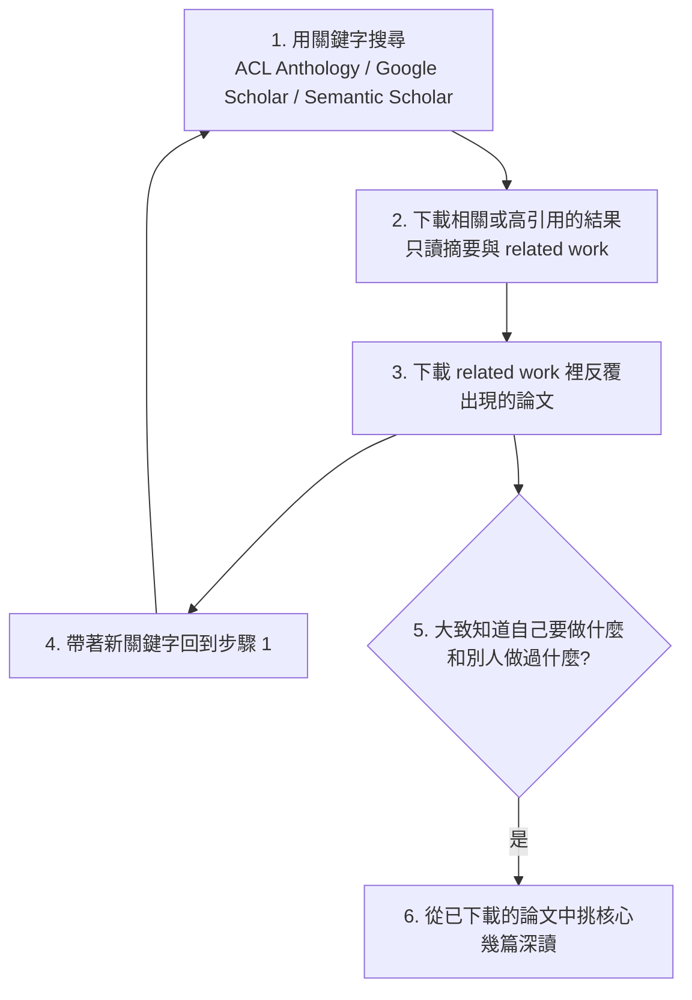

> 🌏 [English version](/posts/ai/2026-09-29-cs224u-lit-review-experiment-protocol-en)

**本文依據 CS224U 2023 春季版。** 這是 [Stanford CS224U 導讀](/posts/ai/2026-08-21-stanford-cs224u-natural-language-understanding)系列的第 15 篇。上一篇 [方法與指標 II](/posts/ai/2026-09-29-cs224u-datasets-model-evaluation) 講了 baseline、切分與統計比較；這一篇把那些方法論放進期末專案真正要交的兩份文件裡。

CS224U 的期末專案占成績一半，拆成三段：文獻回顧、實驗計畫、期末論文。三段的評分軸——「不看結果好壞，看指標是否恰當、方法是否紮實、對自身極限是否誠實」——系列總覽的[期末專案一節](/posts/ai/2026-08-21-stanford-cs224u-natural-language-understanding)已經整理過，這裡不重複。本篇只做一件事：**把前兩段交件拆成可以照著做的步驟。**第三段期末論文放在[下一篇](/posts/ai/2026-09-29-cs224u-presenting-research)。

## 用到的官方材料與存取狀態

| 材料 | 內容 | 狀態 |
|---|---|---|
| [Lit review overview 投影片](https://web.stanford.edu/class/cs224u/slides/cs224u-litreview-overview-2023.pdf)（9 頁） | 目的、找論文六步驟、抄襲政策 | 公開 |
| [Experiment protocol overview 投影片](https://web.stanford.edu/class/cs224u/slides/cs224u-protocol-overview-2023.pdf)（6 頁） | 目的、五條提示 | 公開 |
| [Siyan 的期末專案分享投影片](https://web.stanford.edu/class/cs224u/slides/siyan-projects-cs224u.pdf)（25 頁） | 一位學生怎麼做 lit review 與實驗設計 | 公開 |
| [YouTube](https://www.youtube.com/playlist?list=PLoROMvodv4rOwvldxftJTmoR3kRcWkJBp) 影片 32、38 | Lit Review Overview、Experiment Protocol Overview | 公開 |
| [projects.html](https://web.stanford.edu/class/cs224u/projects.html) 的 #litreview、#protocol | 頁數上限、必填段落、Overleaf 模板 | 公開 |
| [projects.md](https://github.com/cgpotts/cs224u/blob/main/projects.md) | 各段落的長篇說明與 FAQ | 公開 |
| 投影片上的「Gradescope submission format」與「rubric」頁 | 只有標題，內容是截圖 | 截圖文字無法從 PDF 抽出，本文不描述 |
| 往年優秀期末論文 | 範例 | 需 Stanford 登入（302 轉登入頁） |

整體是 **A3（歷史版）**：要求文件完整公開，但評分細則的實際內容與範例論文拿不到。

2023 年的時程：Lit review overview 排在 Analysis methods 單元（5 月 8 日起），截止 5 月 17 日；Experiment protocol overview 排在 NLP methods 單元（5 月 17 日起），截止 5 月 29 日。兩份相隔不到兩週。

## 兩份交件的共同目的

兩份投影片的第二頁用幾乎同樣的句子開場：這份作業（以及下一份）的目的，是跟隊友和你的 mentor **進入有生產力的對話**。

- 文獻回顧的清單是：提出問題、找出障礙並提出繞道方案、找到資料集與模型、仔細想清楚你的資源。
- 實驗計畫的清單是：找出核心問題、找出核心方法、找出障礙並提出繞道方案。

每個專案組都會分到一位教學團隊成員當 mentor，負責回饋所有專案相關作業。這兩份文件本質上是寫給 mentor 看、讓對方能幫上忙的溝通工具，不是成果報告。

## 第一段：文獻回顧

### 硬規定

- 約 6 頁，上限 8 頁，ACL 格式。有 Overleaf 模板，鼓勵但不強制使用。
- 篇數依人數遞增：1 人 5 篇、2 人 7 篇、3 人 9 篇。projects.md 解釋這個比例的假設：你們會分工，每人把自己那幾篇讀深，再彼此分享。
- 可以多讀，但文件建議把必要篇數讀深，其餘放在外圍。
- 題目最好跟期末專案一樣，但如果回顧過程發現題目不適合，可以換題目甚至換組；文獻回顧依自身條件評分。
- 回顧對象不限 NLP 論文。跨領域專案「必須」引其他領域；書、夠好的部落格文章、政府報告，甚至內容夠豐富的演講或訪談逐字稿都可以。

### 步驟一：用六步迴圈找論文

Lit review 投影片第 6 頁給了具體流程：

第 2 步有一句要特別注意：**這個階段不要試圖讀完整篇論文。**深讀是第 6 步的事。

projects.md 補充了搜尋來源的取捨：ACL Anthology 收錄了 ACL 社群幾十年的論文，最快摸清一個領域的地形；Google Scholar 與 Semantic Scholar 的引用數可以當重要性的參考（文件明講引用數不保證品質，但代表影響力）；arXiv 則偏向較新的 NLP 工作，因為 NLP 研究者把論文放 arXiv 是比較近期才成為常態的事。

你開始時不需要知道要做什麼。文件的說法是，文獻回顧階段只需要一個初步的直覺，甚至「幾個合理的關鍵字丟進搜尋引擎」就夠了。

### 步驟二：照五個段落寫

projects.html 與 projects.md 都列了同樣五段，並說斜體字很適合直接當小標：

1. **General problem/task definition**：這些論文想解決什麼、為什麼。
2. **Concise summaries of the articles**：用自己的話講每篇的主要貢獻，不要照抄——「我們自己讀得到」。
3. **Compare and contrast**：異同在哪？彼此同意嗎？結果有沒有衝突？處理不同子任務的話，它們怎麼相關？（文件的括號註：如果它們根本不相關，你可能選錯論文了。）這一段被點名為**對期末專案最有價值的一段**，因為它可以直接變成期末論文的 related work。
4. **Future work**：提出幾個延伸方向，包括這些論文跟你期末專案構想的關係。
5. **References section**：按字母排序，至少要有完整作者名、年份、標題、出處；格式不挑。

### 步驟三：守住 AI 助手的界線

投影片第 7 頁的抄襲政策寫得很明確：

- 沒有規定禁止用 AI 助手幫忙寫文獻回顧，**但模型的所有輸出都必須加引號**，依照課程政策。
- 大量引用文字組成的作業不會拿到好成績。
- 行文有大量重疊的作業會被當作抄襲嫌疑審查。

換句話說，AI 可以幫你找方向、整理筆記，但交出去的文字要是你自己的；引號擋得住抄襲指控，擋不住低分。

## 第二段：實驗計畫

### 硬規定

- 上限 8 頁，但「常態是比這短」。一樣有 Overleaf 模板，鼓勵但不強制。
- 七個必填段落：Hypotheses、Data、Metrics、Models、General reasoning、Summary of progress so far、References。
- 它**不是預先註冊（preregistration）**。期末論文可以用不同的方法或資料，但重大變更建議跟 mentor 討論，甚至更新 protocol。
- 換題目則不同：FAQ 寫明技術上不禁止，但過了 protocol 才換領域，教學團隊多半會勸你別換，把原計畫做完、新點子留到別的場合。

### 投影片上的五條提示

Protocol overview 投影片第 5 頁：

1. 沒有特定長度要求，短或長都可能是好或壞，看專案而定。
2. 把顧慮都寫出來，即使是很遙遠的顧慮。這是**確保專案能在時限內收斂的最後機會**。
3. 對，你必須寫得出假設。
4. 不，這階段不用報告結果，但有結果非常歡迎。
5. 我們希望你**盡快有一條完整能跑的管線**。

### 逐欄怎麼填

以下每一欄的「mentor 會看什麼」都來自 projects.md。

**Hypotheses**。最常見的狀況是「我沒有假設，我只是想看新模型在某任務上表現如何」。文件的回應是把它逼成精確假設：指認新模型的某個元件，主張它是成功關鍵。這樣一來「要比較哪些模型」自動有了答案——有那個元件的，和只差那個元件的。文件也提到，有些 NLP 審稿表會要求審稿人寫出論文在檢驗什麼假設，所以把假設寫清楚也是在幫審稿人。

**Data**。mentor 會問三件事：
1. 用哪個資料集清楚嗎？寫「情感資料集」這種泛稱會被扣分，並被要求給出具體名稱。
2. 資料拿得到嗎？存取受限或還不存在的資料會被提出疑慮，課程很短，等資料會拖垮品質，所以會推你用公開資料集。
3. 資料跟假設對得上嗎？如果 mentor 看不出來，會扣分並約你見面。

**Metrics**。至少要有一個量化指標。課程說這不代表所有 NLU 研究都該量化，只是認為這對這門課是健康的要求。用標準指標（例如分類用 F1）不必多解釋；偏離標準或自創指標就要說明理由。質性評估的構想也寫在這裡，之後可以進期末論文的 Analysis。指標怎麼選，見本系列[第 13 篇](/posts/ai/2026-09-29-cs224u-methods-metrics)。

**Models**。寫出 baseline，以及你要研究的模型的初步描述。重點是讓 mentor 看得出模型、資料、指標怎麼組成對假設的清楚檢驗；拼不起來就扣分。文件特別強調 baseline 是關鍵，並指回 evaluation_methods notebook 的 Baselines 一節——也就是[上一篇](/posts/ai/2026-09-29-cs224u-datasets-model-evaluation)講的 `DummyClassifier` 與任務特定 baseline。

**General reasoning**。解釋資料和模型怎麼一起回答你的假設。你可能覺得前面已經講過了——文件說那是好跡象，代表想法正在成形，但仍請你另外重述一次。這一段之後多半會變成期末論文的摘要。

**Summary of progress so far**。做了什麼、還要做什麼、有哪些障礙或顧慮可能讓專案做不完。寫得越精確，mentor 越幫得上忙；mentor 在這階段最有用的事之一，是幫你界定範圍、排優先順序，例如指定一組核心實驗，其餘先擱著，直到整篇論文的草稿寫完。

**References**。格式同文獻回顧。

## 一個完整示範：Siyan 的期末專案

講次表上 Lit review overview 同一格還有一場「Siyan: What I did for 224u final project」。講者是當學期教學團隊的 Siyan Li，分享自己修課時的期末專案〈[Systematicity in GPT-3's Interpretation of Novel English Noun Compounds](https://arxiv.org/abs/2210.09492)〉（Li、Carlson、Potts）。這個專案後來成為 Findings of EMNLP 2022 論文。

它值得看，是因為它把上面兩份文件的每一格都做出來了。

**文獻回顧怎麼寫。**起點是一篇心理語言學論文（Levin et al.）：受試者為新奇的名詞複合詞（像 stew skillet、duck screen）寫解釋，儘管詞是新的，人類的直覺仍然有系統性——作者提出 Events vs. Essences 假設（人造物當中心語時，修飾語多指使用或製造的事件；自然類當中心語時，修飾語多指內在屬性）。Siyan 在投影片上給的兩條建議：

- 如果你的專案是延伸某篇既有論文，就把那篇講得比其他論文詳細。
- 把研究問題拆成幾個面向，每個面向各查各寫；但不要太深入細節，那是方法與實驗段的事。

**實驗計畫怎麼長出來。**三個實驗一步步逼近假設：

1. 直接用 Levin et al. 的 38 個新奇複合詞提示 GPT-3（text-davinci-002），三位標註者（Fleiss' Kappa 高於 0.7），計算與原研究標籤的相關與排除率。Siyan 在投影片上特別加註：有人工標註就要確保標註者之間一致性夠高。
2. 換成完全沒有詞彙重疊、更新奇的複合詞。這一輪沒有人類黃金標籤，所以只算排除率。
3. 用毫無意義的字串（例如 gmtomflxri）消除詞彙線索，檢驗 GPT-3 是否只是在對詞彙本身推理。

前兩個實驗看起來支持「GPT-3 有系統性」，第三個實驗的表現差很多，結論轉向「它很可能是在對詞彙項目推理」。這正是 protocol 要求的結構：**每個實驗都在排除前一個結果的另一種解釋。**

## 今晚可以做的一件事

打開 projects.md 的 [Experiment protocol 一節](https://github.com/cgpotts/cs224u/blob/main/projects.md#experiment-protocol)，拿你手上一個想做的題目，只填兩欄：

- **Hypotheses**：用「本研究的核心假設是……」開頭寫一句。寫不出來，就照文件的方法，指認一個元件並主張它是關鍵。
- **Models**：寫出一個「只差那個元件」的對照模型，和一個 `most_frequent` 等級的隨機 baseline。

這兩欄填得出來，Data 與 Metrics 通常就跟著定了。

## 延伸閱讀

- 同系列上一篇：[CS224U 方法與指標 II：資料集、資料切分與模型比較](/posts/ai/2026-09-29-cs224u-datasets-model-evaluation)
- 同系列下一篇：[CS224U 寫 NLP 論文、投稿與上台報告](/posts/ai/2026-09-29-cs224u-presenting-research)
- 評分軸與成績配比：[系列總覽](/posts/ai/2026-08-21-stanford-cs224u-natural-language-understanding)
- 站內 CS224N 系列的期末專案篇：[CS224N 第 6 講：把期末專案收斂成可驗證的研究問題](/posts/ai/2026-08-22-cs224n-final-projects)

## 參考資料

- [CS224U 課程官網（Spring 2023 講次表）](https://web.stanford.edu/class/cs224u/) — 兩份交件的截止日、Lit review overview 與 Siyan 分享所在的單元
- [CS224U Projects 頁](https://web.stanford.edu/class/cs224u/projects.html) — 文獻回顧與實驗計畫的頁數、篇數、必填段落與 Overleaf 模板
- [projects.md（期末專案完整指引）](https://github.com/cgpotts/cs224u/blob/main/projects.md) — FAQ、找論文的來源取捨、五段文獻回顧、七段實驗計畫中 mentor 看什麼
- [Lit review overview 投影片（Spring 2023）](https://web.stanford.edu/class/cs224u/slides/cs224u-litreview-overview-2023.pdf) — 目的、找論文六步驟、AI 助手輸出須加引號的抄襲政策
- [Experiment protocol overview 投影片（Spring 2023）](https://web.stanford.edu/class/cs224u/slides/cs224u-protocol-overview-2023.pdf) — 目的與五條提示
- [Siyan Li：What I Did for 224U Final Project 投影片](https://web.stanford.edu/class/cs224u/slides/siyan-projects-cs224u.pdf) — 文獻回顧寫法與三個實驗的設計
- [Li, Carlson & Potts 2022, Systematicity in GPT-3's Interpretation of Novel English Noun Compounds](https://arxiv.org/abs/2210.09492) — 該期末專案的論文版本（Findings of EMNLP 2022）
- [XCS224U Spring 2023 YouTube 播放清單](https://www.youtube.com/playlist?list=PLoROMvodv4rOwvldxftJTmoR3kRcWkJBp) — 影片 32 Lit Review Overview、38 Experiment Protocol Overview
- [evaluation_methods.ipynb](https://github.com/cgpotts/cs224u/blob/main/evaluation_methods.ipynb) — projects.md 在 Models 一欄指回的 baseline 說明
