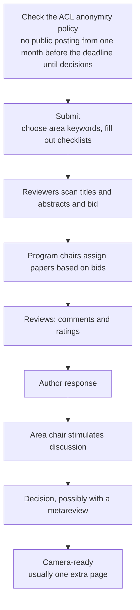

> 🌏 [中文版](/posts/ai/2026-09-29-cs224u-presenting-research)

**This post is based on the Spring 2023 edition of CS224U.** It is part 16 of the [Reading Stanford CS224U](/posts/ai/2026-08-21-stanford-cs224u-natural-language-understanding-en) series. The [previous part](/posts/ai/2026-09-29-cs224u-lit-review-experiment-protocol-en) covered the first two final-project deliverables. This part covers the last one, the final paper, and what comes after it: submission, review, and the talk.

The sources are the course's [Presenting your research slides](https://web.stanford.edu/class/cs224u/slides/cs224u-presenting-2023-handout.pdf) (a 52-page PDF including animation steps; 38 distinct slides), videos 45 to 48 in the [YouTube playlist](https://www.youtube.com/playlist?list=PLoROMvodv4rOwvldxftJTmoR3kRcWkJBp), and the "Final paper" and "Beyond the final paper" sections of [projects.md](https://github.com/cgpotts/cs224u/blob/main/projects.md). The deck's four parts are Your papers, Writing NLP papers, NLP conference submissions, and Giving talks. Each part has one of the four videos.

The 2023 [schedule](https://web.stanford.edu/class/cs224u/) put this lecture in the closing "Your projects" unit. The final paper was due June 10 at 11:30 am Pacific.

**Access (A3, historical edition):** the slides, videos, projects.md, and most of the schedule's readings are public. The past example papers linked on slide 3 (`restricted/past-final-projects/`) redirect to a Stanford login. Also, the schedule's link to David Goss's "hints on mathematical style" returned 404 when checked on 2026-09-29.

## Part 1: course-specific rules for the final paper

The three grading axes (appropriate metrics, strong methods, honesty about limits) are in the [series overview](/posts/ai/2026-08-21-stanford-cs224u-natural-language-understanding-en); slide 4 only restates them. What's new here are three rules.

**Format.** The [Projects page](https://web.stanford.edu/class/cs224u/projects.html) says templates are encouraged for the lit review and protocol but **required** for the final paper: the course's Overleaf or Word template. projects.md adds that the paper is 8 pages in ACL submission format.

**Known project limitations.** Imagine the reader is a well-intentioned NLP practitioner. They want to use your data, models, or findings in a separate research project, a deployed system, or some other real-world intervention. What should that person know? The slide suggests:

- Benefits and risks
- Costs to your participants, society, the planet
- Responsible use of your data, models, findings

It lists three resources: [Datasheets for Datasets](https://arxiv.org/abs/1803.09010) (Gebru et al. 2018), [Model Cards](https://arxiv.org/abs/1810.03993) (Mitchell et al. 2019), and a survey of NeurIPS impact statements (Nanayakkara et al. 2021). The first two are also assigned readings for this lecture. Datasheets proposes that every dataset ship with a document recording its motivation, composition, collection process, and recommended uses, by analogy with electronic component datasheets. Model Cards proposes that released models ship with a short document reporting evaluation across groups and conditions, intended uses, and the evaluation procedure.

**Authorship statement.** This goes after the Acknowledgments and explains how each author contributed. The format is open, and the model is PNAS's author guidance. Single authors must write one too, because the course wants to know whether anyone outside the class collaborated. Only in extreme cases, after discussion with the team, would the course consider grading teammates differently based on it.

The slides also cover the [multiple-submission policy](https://web.stanford.edu/class/cs224u/requirements.html#multiple). It mirrors conference rules on multiple submission and ensures the final project is a substantial new effort. The slide says this means you can't submit an incremental advance on another project. Other courses may have different policies, and that fact alone won't change this one.

## Part 2: how to write an NLP paper

### Structure

The slides give a typical outline: title and abstract, then 1 Intro, 2 Related work, 3 Data/Task, 4 Your model, 5 Methods, 6 Results, 7 Analysis, 8 Conclusion. The length is four or eight two-column pages, not counting references.

projects.md gives a more detailed outline with length guidance, in a slightly different order (Data, Your models, Experiments, Analysis). Taken together:

| Section | Suggested length | What it needs to do |
|---|---|---|
| Abstract | Ideally half a column | Give context, define the proposal, summarize the core findings, close with broader significance. The protocol's General reasoning section is good raw material |
| Introduction | 1–2 columns | Tell the full story: the area, the hypothesis, the concepts it depends on, why this hypothesis, the steps the paper takes, and how the findings inform the hypothesis |
| Related work | 1.5–2 columns | Group the papers, state each group's theme, relate it to your work, and carve out room for your contribution. Draws heavily on the lit review |
| Data | Varies | Real examples plus quantitative summaries; a new dataset needs a lot of space on collection methods |
| Your models | Varies | Keep the model description separate from experimental choices, which belong to the design |
| Experiments / Methods | Varies | Metrics, baselines, training; hyperparameters go in appendices unless central to the argument |
| Results | — | In the slide's words, "a no-nonsense report of what happened" |
| Analysis | Varies | What the results mean and don't mean; error analysis and qualitative trends |
| Conclusion | Half a column | Briefly recap what the paper did and why, then chart future directions |

One technique from the Introduction row deserves its own mention. projects.md says it's a good sign if you have a sentence starting "The central hypothesis of this paper is …". You don't have to be that explicit. But writing it that way keeps you from saying only vague things, and it exposes gaps in your own thinking.

For papers with multiple datasets, the slides suggest repeating Methods / Results / Analysis for each dataset.

### Writing advice: four readings, one principle each

The schedule lists a set of readings on writing and speaking. The slides pull one core idea from several of them.

**Stuart Shieber: rational reconstruction.** [Shieber's piece](https://web.stanford.edu/class/cs224u/readings/shieber-writing.pdf) describes three styles:
- Continental style: state the solution with as little motivation as possible. Readers can't tell whether you're right without enormous effort, "but at least they'll think you're a genius."
- Historical style: write up every false start, wrong attempt, and redefinition. Readers can follow the reasoning, "but the reader will probably think you are a bit addle-headed."
- **Rational reconstruction:** present an **idealized history** that motivates each step perfectly, not the history you actually lived. The goal is not to convince readers you're brilliant. It is to convince them your solution is **trivial**.

**Cormac McCarthy: one thread.** The slide quotes one passage from [McCarthy's Nature piece](https://www.nature.com/articles/d41586-019-02918-5). Decide on your paper's theme and two or three points every reader should remember. If something isn't needed to understand the theme, omit it. The slide adds that this makes the paper both better and easier to write, since the theme settles many small questions about what to include.

**David Goss: "Have mercy on the reader."** The slide quotes only this line. (The original link is now dead; see above.)

**Patrick Blackburn: honesty.** Where do good talks come from? [Blackburn's answer](https://web.stanford.edu/class/cs224u/readings/blackburn2001.pdf) is honesty: "A good talk should never stray far from simple, honest communication." This slide appears in both the writing and the talks parts. In projects.md, Potts says he thinks of it when writing, making teaching materials, and presenting in meetings, not just when preparing talks.

The schedule also lists [Jason Eisner's Advice for Research Students](https://www.cs.jhu.edu/~jason/advice/). It's a page of links on reading papers, finding research problems, "write the paper first," preparing talks, and more. The slides don't excerpt any particular item.

The slides also put the first pages of the GloVe and ELMo papers side by side as examples of good writing. projects.md separately lists four NLU papers Potts considers exceptionally well written.

## Part 3: submitting to NLP conferences

This part is for anyone who wants to submit the project after the course ends.

### Where to submit

projects.md says NLP, like most of AI, is conference-driven: papers at top conferences are like journal papers in other fields. Potts's own view is that the top venues are ACL, NAACL, and EMNLP. TACL is on par with them or soon will be. Whatever prestige gap once separated the three has disappeared, and people pick among them mostly by timing. COLING, CoNLL, and EACL are also excellent and may be seen as a step down. Workshop papers carry less prestige, but workshops are often more rewarding venues because the audience cares about the topic.

### The process

Key points from the slides:

- **Anonymity period.** The ACL conferences share one policy. From one month before the submission deadline until decisions go out, a submitted paper can't be posted to arXiv or made public in any way. Check each conference's site for exact dates. The policy balances fast, free distribution of ideas against double-blind review.
- **Checklists.** The slides note that submissions increasingly require long, complicated checklists, and suggest finding an expert to help.
- **Titles drive bidding.** Reviewers bid after scanning long lists of titles and abstracts, and the title is probably the main factor. So write your title with these harried reviewers as a primary audience.
- **Desk rejects.** In NLP, style-sheet violations are the most likely cause of rejection without review. Read the style sheet and call for papers carefully.

The slides also list the structure of an ACL review form: what the paper is about with its strengths and weaknesses, reasons to accept, reasons to reject, questions for the authors, missing references, typos and presentation, overall recommendation and reviewer confidence, and confidential comments. Once you know what reviewers fill in, you know what the paper needs to give them.

### Titles and abstracts

The slides give four rules for titles: jokey is risky (citing a study of amusing titles and citation counts), calibrate to the scope of your contribution, consider which reviewers you'll attract, and avoid special fonts and formatting.

For abstracts, a three-part structure. The opening is a broad overview that glimpses the central problem. The middle expands those concepts and connects them to specific experiments and results. The close links your proposal to broader theoretical concerns, so the reviewer can answer "Does the abstract offer a substantive and original proposal?" The slides even give a fill-in template: this opening sentence situates you; our approach addresses this central issue…; the techniques we use are…; our experiments are…; overall we find…; (the significance of this is…).

### Author responses and reviewing culture

The author-response slide is practical. Many people are cynical about responses because reviewers rarely change scores. Still, not responding at all sends a bad signal. At conferences where area chairs lead discussion and write metareviews, the response can matter a lot. Always be polite. Be firm and direct, but strategically, to signal what you care about most. The slide gives a contrast. Never: "Your inattentiveness is embarrassing; section 6 does what you say we didn't do." Yes: "Thank you. The information you're requesting is in section 6. We will make this more prominent in our revision."

Potts also gives his personal assessment of NLP reviewing on the slides. The conference focus has been good for NLP; it fits and encourages a rapid pace. Before about 2010, reviewing was admirably rigorous compared with other fields. The field's growth has since lowered quality, and the field is still grappling with that. Reviewers are occasionally very mean, so desensitize yourself, and share reviews with an experienced NLPer. The biggest failing is that authors can't appeal to an editor and interact with one. Journals allow that, and TACL follows the ACL conference model while keeping that kind of interaction.

## Part 4: giving talks

### Structure

The slides say a talk mirrors the paper's structure but must be simpler:

- **Beginning:** What problem are you solving? Why does it matter? What has been tried, and why hasn't it fully solved the problem?
- **Middle:** What data? What approach? How do you evaluate success?
- **End:** Quantitative results and graphs. Which features, techniques, or resources contributed most? What do you still get wrong? Examples. Overall, what happened and why?

projects.md adds the key difference: talks must be much less technical than papers. Start from the premise of no equations. Add them only where they're crucial and you're sure you have time to present them properly.

### Pullum's golden rules

The slides quote [Geoff Pullum's Five Golden Rules (well, actually six)](http://www.lel.ed.ac.uk/~gpullum/goldenrules.html):

1. Don't ever begin with an apology.
2. Don't ever underestimate the audience's intelligence.
3. Respect the time limits.
4. Don't survey the whole damn field.
5. Remember that you're an advocate, not the defendant.
6. Expect questions that will floor you.

### Slide design: two schools

The slides describe two schools of slide design:

| Minimalist | Comparative |
|---|---|
| Slides as spare as possible | As full as possible without sacrificing clarity |
| The audience mostly listens to and watches you | The audience can easily spend time studying the slides |
| Each slide stays up briefly and serves one purpose | Each slide stays up a long time and supports many comparisons and connections |

Potts's own take: minimalism suits storytelling, the best mode when time is short and the audience mainly wants to learn what your paper contains. The comparative style suits teaching; it is the closest slides come to a full, well-organized chalkboard. **Find the style that works for you.** If you think hard about what listening to your talk will be like and adjust, you'll shine.

Four tools for guiding attention: overlays to fill a slide step by step, color used systematically to mark distinctions, size to draw the eye, and boxes and arrows to help people read plots, model diagrams, and long prose.

### Before you go on, and the discussion period

projects.md and the slides share one checklist. Turn off notifications. Take the computer out of power-saver mode so the screen doesn't sleep. Quit applications that might get in the way. Clear files off the desktop that you wouldn't want the world to see. Keep a PDF backup. And **always be ready to give the talk without slides.** Practice is key. Friends outside NLP give especially useful feedback, because they won't fill in your gaps without noticing. Record yourself once; it's painful but worth it.

On the discussion period (Potts prefers that name, since people make statements and criticisms as often as they ask questions):

- Pause for one second before answering each question, even when you know the answer. It sets the right pace and shows you're listening.
- Most questions won't make total sense to you. The questioner doesn't know your work well, so be sympathetic.
- You'll be a hit if you can turn every question into one that makes sense and leaves everyone thinking the questioner raised an important issue.
- When floored, don't stop at "I don't know." Say "I have no idea, but let's think about…" and move the discussion somewhere new.

## One thing to do tonight

Take something you wrote recently (a design doc, a blog post, a report) and run two checks:

1. Find its theme and two or three key points (McCarthy). If you can't, or some paragraphs have nothing to do with that thread, those are the parts to cut.
2. Ask whether it walks through your dead ends in order (historical style) or follows an idealized path where each step is motivated (rational reconstruction). If it's the former, try reordering it so the reader finishes thinking your solution was obvious.

## Further reading

- Previous in the series: [CS224U Final Project Workflow: Lit Review and Experiment Protocol](/posts/ai/2026-09-29-cs224u-lit-review-experiment-protocol-en)
- Next in the series: [Reading Stanford CS224U, Part 17: Two Extension Lectures](/posts/ai/2026-09-29-cs224u-guest-lectures-en)
- Context for dataset trade-offs and Datasheets: [CS224U Methods and Metrics II](/posts/ai/2026-09-29-cs224u-datasets-model-evaluation-en)
- The final-project part of the site's CS224N series: [CS224N Lecture 6: Turn a Final Project into a Testable Question](/posts/ai/2026-08-22-cs224n-final-projects-en)

## References

- [CS224U course site (Spring 2023 schedule)](https://web.stanford.edu/class/cs224u/) — the Your projects unit, the final-paper deadline, and all readings for this lecture
- [Presenting your research slides (Spring 2023)](https://web.stanford.edu/class/cs224u/slides/cs224u-presenting-2023-handout.pdf) — four parts: paper requirements, writing, submission, talks
- [projects.md (full final-project guide)](https://github.com/cgpotts/cs224u/blob/main/projects.md) — section-by-section paper guidance, the Authorship statement, and the submission and talk advice in Beyond the final paper
- [CS224U Projects page](https://web.stanford.edu/class/cs224u/projects.html) — required final-paper templates and the original text for Known project limitations and the Authorship statement
- [CS224U Policies: Multiple submission](https://web.stanford.edu/class/cs224u/requirements.html#multiple) — the multiple-submission policy
- [XCS224U Spring 2023 YouTube playlist](https://www.youtube.com/playlist?list=PLoROMvodv4rOwvldxftJTmoR3kRcWkJBp) — videos 45 Your Papers, 46 Writing NLP Papers, 47 NLP Conference Submission, 48 Giving Talks
- [Stuart Shieber on reporting research results](https://web.stanford.edu/class/cs224u/readings/shieber-writing.pdf) — three writing styles and rational reconstruction
- [Cormac McCarthy's tips on how to write a great science paper (Nature)](https://www.nature.com/articles/d41586-019-02918-5) — one theme and two or three points
- [Patrick Blackburn: How to give a good talk](https://web.stanford.edu/class/cs224u/readings/blackburn2001.pdf) — honesty as the source of good talks
- [Geoff Pullum's Five Golden Rules (well, actually six)](http://www.lel.ed.ac.uk/~gpullum/goldenrules.html) — six rules for academic presentations
- [Jason Eisner: Advice for Research Students](https://www.cs.jhu.edu/~jason/advice/) — the advice collection assigned on the schedule
- [Gebru et al. 2018, Datasheets for Datasets](https://arxiv.org/abs/1803.09010) — one of the resources for Known project limitations
- [Mitchell et al. 2019, Model Cards for Model Reporting](https://arxiv.org/abs/1810.03993) — one of the resources for Known project limitations
