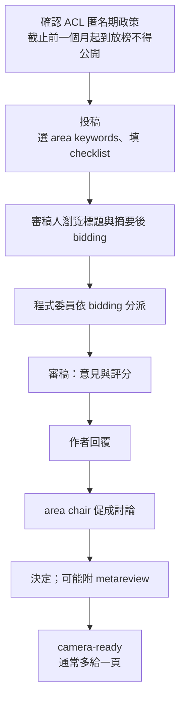

> 🌏 [English version](/posts/ai/2026-09-29-cs224u-presenting-research-en)

**影片狀態：已附影片。** [影片來源與說明](#課程影片來源)

**本文依據 CS224U 2023 春季版。** 這是 [Stanford CS224U 導讀](/posts/ai/2026-08-21-stanford-cs224u-natural-language-understanding)系列的第 16 篇。[上一篇](/posts/ai/2026-09-29-cs224u-lit-review-experiment-protocol)處理期末專案的前兩段交件；這一篇處理最後一段——期末論文，以及論文寫完之後的事：投稿、審稿、上台。

材料是課程的 [Presenting your research 投影片](https://web.stanford.edu/class/cs224u/slides/cs224u-presenting-2023-handout.pdf)（PDF 52 頁、含動畫分頁，實際 38 張）、[YouTube 播放清單](https://www.youtube.com/playlist?list=PLoROMvodv4rOwvldxftJTmoR3kRcWkJBp)第 45 到 48 支影片，以及 [projects.md](https://github.com/cgpotts/cs224u/blob/main/projects.md) 的「Final paper」與「Beyond the final paper」兩節。投影片的四段——Your papers、Writing NLP papers、NLP conference submissions、Giving talks——正好對應四支影片。

2023 年的[講次表](https://web.stanford.edu/class/cs224u/)把這一講放在最後的「Your projects」單元，期末論文截止是 6 月 10 日上午 11:30（太平洋時間）。

**存取狀態（A3，歷史版）**：投影片、影片、projects.md、講次表上的指定閱讀大多公開。拿不到的是投影片第 3 頁連結的往年範例論文（`restricted/past-final-projects/`，302 轉 Stanford 登入頁）。另外，講次表上 David Goss 那篇〈hints on mathematical style〉的連結，2026-09-29 查核時已是 404。

## 課程影片來源

下列影片是 Stanford Online 發布的 Spring 2023 對應講次錄影，與本文採用的 2023 年春季版課程一致。2026-10-10 已對照官方播放清單（50 支）比較影片標題與影片 ID。

```youtube
url: https://www.youtube.com/watch?v=teEA1DACM40
title: Stanford XCS224U: NLU I Presenting Your Research, Part 2: Writing NLP Papers I Spring 2023
```

```youtube
url: https://www.youtube.com/watch?v=K-AqbhLJMgU
title: Stanford XCS224U: NLU I Presenting Your Research, Part 4: Giving Talks I Spring 2023
```

原始影片：[Stanford XCS224U: NLU I Presenting Your Research, Part 2: Writing NLP Papers I Spring 2023](https://www.youtube.com/watch?v=teEA1DACM40)、[Stanford XCS224U: NLU I Presenting Your Research, Part 4: Giving Talks I Spring 2023](https://www.youtube.com/watch?v=K-AqbhLJMgU)
其他相關影片（僅文字連結）：[Stanford XCS224U: NLU I Presenting Your Research, Part 1: Your Papers I Spring 2023](https://www.youtube.com/watch?v=L0ISjkoUoZY)、[Stanford XCS224U: NLU I Presenting Your Research, Part 3: NLP Conference Submission I Spring 2023](https://www.youtube.com/watch?v=9tDtzLlfdxM)

內容核對：已依字幕核對（2026-10-10）：影片 Part 2（Writing NLP Papers）與 Part 4（Giving Talks）的字幕逐項對照：論文大綱與 4／8 頁格式、Intro 與 Related work 的寫法、Shieber 三種風格與理性重建、McCarthy 的主線、Goss 的『have mercy on the reader』、Blackburn 的誠實、ELMo 與 GloVe 作為範例；報告的結構、Pullum 六條規則、極簡派與比較派（Potts 自稱偏比較派）、overlay／顏色／大小／方框箭頭、上台前的瑣事（通知、省電模式、PDF 備份、準備無投影片）、討論時間的建議，皆吻合。文中的 Part 1 與 Part 3（Your Papers、Conference Submission）未嵌入也未讀，匿名期、bidding、審稿表等投稿流程細節來自投影片與 projects.md，未以字幕驗證。

課程與錄影入口：

- [XCS224U Spring 2023 YouTube 播放清單](https://www.youtube.com/playlist?list=PLoROMvodv4rOwvldxftJTmoR3kRcWkJBp)
- [官方課程／講次來源](https://web.stanford.edu/class/cs224u/)

## 第一段：期末論文的課程特有要求

評分三軸（指標恰當、方法紮實、對自身極限誠實）在[系列總覽](/posts/ai/2026-08-21-stanford-cs224u-natural-language-understanding)已經寫過，投影片第 4 頁只是重申。這一段真正新的是三條規定。

**格式。**[Projects 頁](https://web.stanford.edu/class/cs224u/projects.html)寫明：文獻回顧和實驗計畫的模板是鼓勵使用，期末論文則**必須**用指定的 Overleaf 或 Word 模板。projects.md 另外寫長度是 8 頁、ACL 投稿格式。

**Known project limitations。**想像讀者是一位善意的 NLP 實務工作者，要把你的資料、模型或發現用在另一個研究、部署系統或真實世界的介入上——這個人該知道什麼？投影片列了可以寫的方向：

- 好處與風險
- 對參與者、社會、地球的成本
- 如何負責任地使用你的資料、模型、發現

並給了三份參考：[Datasheets for Datasets](https://arxiv.org/abs/1803.09010)（Gebru et al. 2018）、[Model Cards](https://arxiv.org/abs/1810.03993)（Mitchell et al. 2019），以及一份 NeurIPS 影響聲明的調查（Nanayakkara et al. 2021）。前兩者都在講次表上列為本講閱讀：Datasheets 主張每個資料集都附上一份文件，記錄動機、組成、收集過程與建議用途，類比電子元件的規格表；Model Cards 主張釋出的模型附上簡短文件，報告在不同群體與條件下的評估結果、預期用途與評估程序。

**Authorship statement。**放在 Acknowledgments 之後，說明每位作者怎麼貢獻。格式自由，範本是 PNAS 的作者指引。即使只有一位作者也要寫，因為課程想知道專案有沒有校外合作者。只有在極端情況、而且跟團隊討論過之後，才會考慮依這份聲明給組員不同成績。

投影片還提到[重複提交政策](https://web.stanford.edu/class/cs224u/requirements.html#multiple)：比照會議的多重投稿規則，確保期末專案是一份實質的新工作。投影片明講，這代表你不能只交出另一個專案的漸進改良；其他課程政策不同，也不會讓他們改變自己的政策。

## 第二段：一篇 NLP 論文怎麼寫

### 結構

投影片給的典型大綱：標題與摘要，然後 1 Intro、2 Related work、3 Data/Task、4 Your model、5 Methods、6 Results、7 Analysis、8 Conclusion。長度是 4 頁或 8 頁的雙欄，不含參考文獻。

projects.md 則給了一版更細、帶篇幅建議的大綱，順序略有不同（Data、Your models、Experiments、Analysis）。兩份合起來看，重點如下：

| 段落 | 篇幅建議 | 要做到什麼 |
|---|---|---|
| Abstract | 理想是半欄 | 先給脈絡，再定義你的提案、摘要核心發現，最後點出更廣的意義。實驗計畫的 General reasoning 是好素材 |
| Introduction | 1–2 欄 | 講完整的故事：你在哪個領域、追的是什麼假設、假設依賴哪些概念、為什麼是這個假設、論文採取哪些步驟、核心發現如何回應假設 |
| Related work | 1.5–2 欄 | 把論文分組，每組說明主題的一致性，再把它跟你的工作連起來，替自己的貢獻劃出位置。可以大量取材自文獻回顧 |
| Data | 視情況 | 真實例子加量化摘要；新資料集要花大量篇幅說明收集方法 |
| Your models | 視情況 | 把模型描述與實驗選擇分開，後者屬於實驗設計 |
| Experiments / Methods | 視情況 | 指標、baseline、訓練方式；超參數等細節放附錄，除非是論證核心 |
| Results | — | 投影片的說法是「不加修飾地報告發生了什麼」 |
| Analysis | 視情況 | 結果代表什麼、不代表什麼；錯誤分析與質性趨勢 |
| Conclusion | 半欄 | 簡短總結做了什麼、為什麼，並指出未來方向 |

Introduction 那一列有一個具體技巧值得單獨拿出來：projects.md 說，如果你有一句話以「The central hypothesis of this paper is …」開頭，是好跡象。不一定要寫得這麼直白，但這麼寫能逼你別只講模糊的話，也能暴露自己思路不清的地方。

多資料集的論文，投影片建議每個資料集各自重複一輪 Methods / Results / Analysis。

### 寫作建議：四份閱讀各給一個原則

講次表上列了一串寫作與報告的閱讀，投影片從其中挑出幾句核心：

**Stuart Shieber：理性重建。**[Shieber 的文章](https://web.stanford.edu/class/cs224u/readings/shieber-writing.pdf)把寫法分成三種：
- Continental style：盡量不交代動機就直接給解法，讀者得花極大力氣才知道你對不對，「但至少他們會覺得你是天才」。
- Historical style：把錯誤的開始、失敗的嘗試、重新定義問題的歷程全寫出來。讀者跟得上推理，但「可能會覺得你有點糊塗」。
- **Rational reconstruction**：不寫你真實經歷的歷史，而是一段**理想化的歷史**，完美地替每一步提供動機。目標不是讓讀者覺得你聰明，而是讓讀者覺得你的解法**理所當然**。

**Cormac McCarthy：一條主線。**投影片挑出 [McCarthy 在 Nature 那篇](https://www.nature.com/articles/d41586-019-02918-5)的一段：決定論文的主題，以及兩三個你希望每位讀者記住的重點；不需要用來理解主題的東西就刪掉。投影片補充，這樣做不只論文更好，也更好寫——主題會替你決定很多該寫什麼、不寫什麼的細節問題。

**David Goss：「Have mercy on the reader.」**投影片只引了這一句。（原文連結現已失效，見上。）

**Patrick Blackburn：誠實。**好的報告從哪裡來？[Blackburn 的答案](https://web.stanford.edu/class/cs224u/readings/blackburn2001.pdf)是誠實——「好的報告永遠不應偏離簡單、誠實的溝通」。這一頁在寫作段和報告段各出現一次；projects.md 裡 Potts 也說，他不只在準備演講時想到這句話，寫作、做教材、開會時都會。

講次表另外列了 [Jason Eisner 的 Advice for Research Students](https://www.cs.jhu.edu/~jason/advice/)，那是一整頁連結集，從怎麼讀論文、怎麼找研究問題、「先寫論文」到怎麼準備演講都有；投影片沒有特別摘錄其中哪一篇。

投影片也把 GloVe 與 ELMo 兩篇論文的第一頁並排，當作「寫得很好的論文」的例子；projects.md 另外列了四篇 Potts 認為寫得特別好的 NLU 論文。

## 第三段：投稿到 NLP 會議

這一段是給「課程結束後想把專案投出去」的人。

### 投哪裡

projects.md 寫明，NLP 跟大多數 AI 領域一樣是以會議為主的領域，頂級會議論文相當於其他領域的期刊論文。Potts 的個人看法是：頂級會議是 ACL、NAACL、EMNLP，TACL 與它們同級或即將同級，三者之間過去或許有聲望差距，但已經消失，大家選哪個主要看時間點。COLING、CoNLL、EACL 也很好，可能被視為低一階。Workshop 論文聲望較低，但常是更有收穫的發表場合，因為聽眾都對題目有投入。

### 流程



投影片上的幾個重點：

- **匿名期。**ACL 系會議的統一政策：投稿論文從截止日前一個月起，到放榜為止，不能上傳到 arXiv 或以任何方式公開。精確日期要查各會議網站。這是在「新想法快速自由流通」與「雙盲審查」之間取平衡。
- **Checklist。**投影片說，現在投稿越來越常要填很長很複雜的檢查表，建議找有經驗的人幫忙。
- **標題決定 bidding。**審稿人瀏覽一長串標題與摘要來 bid，標題大概是主要因素。所以下標題時要把這些忙碌的審稿人當成主要讀者。
- **Desk reject。**在 NLP，違反格式規定是「未經審查就被拒」的最常見原因，要仔細看 style sheet 與徵稿要求。

投影片也列出 ACL 審稿表的結構（論文在講什麼與優缺點、接受理由、拒絕理由、給作者的問題、漏引文獻、錯字與寫作、整體推薦與審稿人信心、給委員會的保密意見）。知道審稿人要填什麼，就知道論文要替他準備什麼。

### 標題與摘要

關於標題，投影片給了四條：開玩笑有風險（引了一篇研究有趣標題與引用數關係的論文）、配合貢獻的範圍校準、想想你會吸引到哪些審稿人、盡量避免特殊字體與格式。

摘要則給三段式結構：開頭是寬廣的概觀，讓讀者瞥見核心問題；中段展開開頭提到的概念，連到具體實驗與結果；結尾把你的提案連回更廣的理論關懷，讓審稿人能回答「這份摘要是否提出實質而原創的主張」。投影片甚至給了一個填空模板：這句開場讓你定位，我們的方法要處理的核心問題是……，我們用的技術是……，我們的實驗是……，整體而言我們發現……（其意義在於……）。

### 作者回覆與審稿文化

作者回覆這一頁的建議很務實：很多人對它很犬儒，因為審稿人很少改分；但完全不回覆是不好的訊號；有 area chair 負責促成討論並寫 metareview 的會議，回覆可能影響很大。永遠保持禮貌，堅定直接，但要有策略地用在你最在意的點上。投影片給了對照：不要寫「你的不專心令人尷尬，第 6 節做了你說我們沒做的事」；要寫「謝謝。您要的資訊在第 6 節，我們會在修訂版讓它更顯眼。」

Potts 也在投影片上給了他對 NLP 審稿的個人評估：以會議為主對 NLP 是好的，符合也鼓勵快節奏；大約 2010 年以前審稿相對其他領域嚴謹得令人欽佩，領域擴張後品質下滑，至今仍在處理；審稿人偶爾非常刻薄，要讓自己脫敏，找有經驗的人一起看審稿意見會有幫助；最大的缺點是作者沒有機會向編輯申訴、與編輯互動——期刊有這個機制，TACL 則是照 ACL 會議模式運作、同時保留這種互動的期刊。

## 第四段：上台報告

### 結構

投影片說報告的結構模仿論文，但必須更簡單：

- **開頭**：你在解決什麼問題？為什麼重要？別人試過什麼方法，為什麼沒完全解決？
- **中段**：什麼資料？什麼方法？怎麼評估成功？
- **結尾**：量化結果與圖表；哪些特徵、技術、資源貢獻最大？還有哪些東西做錯？舉例。整體發生了什麼、為什麼？

projects.md 補了一句關鍵差異：報告必須比論文**少很多技術細節**。可以先假設完全不放公式，只在關鍵、而且你確定有時間講清楚的地方才加。

### Pullum 的六條黃金規則

投影片引了 [Geoff Pullum 的 Five Golden Rules (well, actually six)](http://www.lel.ed.ac.uk/~gpullum/goldenrules.html)：

1. 永遠不要用道歉開場。
2. 永遠不要低估聽眾的智力。
3. 遵守時間。
4. 不要把整個該死的領域都綜述一遍。
5. 記住你是辯護人，不是被告。
6. 預期會被問倒。

### 投影片設計：兩個學派

投影片把投影片設計分成兩派：

| 極簡派 | 比較派 |
|---|---|
| 投影片越精簡越好 | 在不犧牲清晰的前提下盡量充實 |
| 聽眾大部分時間聽你、看你 | 讓聽眾容易花時間研究投影片 |
| 每張停留不久、只用一種方式 | 每張停留很久，用來做多個比較、建立多種連結 |

Potts 的個人看法：極簡派適合說故事，時間緊、聽眾主要是來了解論文內容時最好用；比較派適合教學，是投影片最接近「一塊整理完善的黑板」的形式。**找到適合你的風格**——只要認真想過聽你的報告會是什麼感覺並據此調整，都會表現得好。

引導注意力的四種工具：用 overlay 逐步填滿一張投影片、系統性地用顏色做區分、用大小吸引注意、用方框和箭頭幫人讀懂圖表、模型圖與長段文字。

### 上台前的瑣事與問答時間

projects.md 與投影片都列了同一份清單：關掉會跳出的通知、關掉省電模式以免螢幕熄滅、關掉礙事的應用程式、清空桌面上不想被看到的檔案、準備 PDF 備份、以及**永遠準備好在沒有投影片的情況下講完**。練習是關鍵，找非 NLP 的朋友聽效果特別好，因為他們不會不自覺地替你補上空缺；錄下自己講一遍，雖然痛苦但值得。

問答時間（Potts 認為叫「討論時間」更貼切，因為很多人不是提問而是發表意見或批評）：

- 回答每個問題前先停一秒，即使你完全知道怎麼答。這能建立對的節奏，也表示你在認真聽。
- 大部分問題不會完全合理，提問者沒那麼了解你的工作，要體諒。
- 如果你能把每個問題轉成一個合理的問題，讓大家覺得提問者提出了重要議題，你就會很受歡迎。
- 被問倒時不要只說「我不知道」就停住，而是說「我不知道，但我們來想想……」，把討論推向新方向。

## 今晚可以做的一件事

拿一份你最近寫的東西（技術文件、部落格、報告），做兩個檢查：

1. 找出它的「主題加兩三個重點」（McCarthy）。找不到，或段落裡有東西跟這條主線無關，就是要刪的部分。
2. 看它是按時間講你踩過的坑（historical style），還是一條理想化、每一步都有動機的路（rational reconstruction）。前者的話，試著重排一次，讓讀者讀完覺得你的解法理所當然。

## 延伸閱讀

- 同系列上一篇：[CS224U 期末專案流程：文獻回顧與實驗計畫](/posts/ai/2026-09-29-cs224u-lit-review-experiment-protocol)
- 同系列下一篇：[Stanford CS224U 導讀 17：兩場延伸講座](/posts/ai/2026-09-29-cs224u-guest-lectures)
- 資料集取捨與 Datasheets 的脈絡：[CS224U 方法與指標 II](/posts/ai/2026-09-29-cs224u-datasets-model-evaluation)
- 站內 CS224N 系列的期末專案篇：[CS224N 第 6 講：把期末專案收斂成可驗證的研究問題](/posts/ai/2026-08-22-cs224n-final-projects)

## 更新紀錄

- 2026-10-10：標註影片狀態，核對錄影來源與取得方式。
- 2026-10-10：重查影片狀態。官方 Spring 2023 播放清單其實有對應講次的錄影，已嵌入並改為已附影片。
- 2026-10-10：依字幕核對影片內容。未發現與字幕不符之處，僅加上核對記號。

## 參考資料

- [CS224U 課程官網（Spring 2023 講次表）](https://web.stanford.edu/class/cs224u/) — Your projects 單元、期末論文截止時間、本講全部指定閱讀
- [Presenting your research 投影片（Spring 2023）](https://web.stanford.edu/class/cs224u/slides/cs224u-presenting-2023-handout.pdf) — 四段內容：論文要求、寫作、投稿、報告
- [projects.md（期末專案完整指引）](https://github.com/cgpotts/cs224u/blob/main/projects.md) — Final paper 的段落建議、Authorship statement、Beyond the final paper 的投稿與報告建議
- [CS224U Projects 頁](https://web.stanford.edu/class/cs224u/projects.html) — 期末論文強制模板、Known project limitations 與 Authorship statement 原文
- [CS224U Policies：Multiple submission](https://web.stanford.edu/class/cs224u/requirements.html#multiple) — 重複提交政策
- [XCS224U Spring 2023 YouTube 播放清單](https://www.youtube.com/playlist?list=PLoROMvodv4rOwvldxftJTmoR3kRcWkJBp) — 影片 45 Your Papers、46 Writing NLP Papers、47 NLP Conference Submission、48 Giving Talks
- [Stuart Shieber on reporting research results](https://web.stanford.edu/class/cs224u/readings/shieber-writing.pdf) — 三種寫作風格與理性重建
- [Cormac McCarthy's tips on how to write a great science paper（Nature）](https://www.nature.com/articles/d41586-019-02918-5) — 主題加兩三個重點
- [Patrick Blackburn: How to give a good talk](https://web.stanford.edu/class/cs224u/readings/blackburn2001.pdf) — 誠實是好報告的來源
- [Geoff Pullum's Five Golden Rules (well, actually six)](http://www.lel.ed.ac.uk/~gpullum/goldenrules.html) — 學術報告的六條規則
- [Jason Eisner: Advice for Research Students](https://www.cs.jhu.edu/~jason/advice/) — 講次表指定的研究生建議集
- [Gebru et al. 2018, Datasheets for Datasets](https://arxiv.org/abs/1803.09010) — Known project limitations 的參考之一
- [Mitchell et al. 2019, Model Cards for Model Reporting](https://arxiv.org/abs/1810.03993) — Known project limitations 的參考之一
