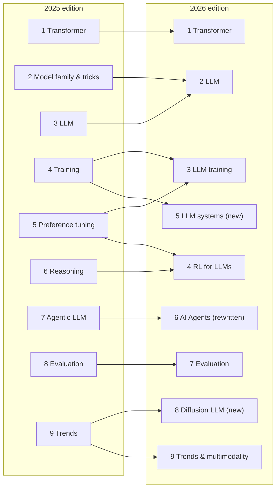

> 🌏 [中文版](/posts/ai/2026-09-29-stanford-cme295-transformers-llms)

[CME295: Transformers & Large Language Models](https://cme295.stanford.edu/) is offered under Stanford's Computational and Mathematical Engineering (CME) course code and taught by Afshine Amidi and Shervine Amidi. Both have worked at Uber, Google, and Netflix. Many people first came across them through the [VIP cheatsheets](https://stanford.edu/~shervine/teaching/cs-230/) they made for Stanford CS 230, and the slides for this course reuse a lot of those diagrams.

Over nine lectures, the course goes from tokenization all the way to AI agents and LLM evaluation, and each recorded lecture runs a little over an hour and forty minutes. It doesn't teach you to write code. What it gives you is a map: how the Transformer became the LLM, how LLMs are trained and aligned, and how they get wrapped into agents that use tools.

This series will work through all nine lectures, one post each. This first post covers what the course looks like, how the 2025 and 2026 editions differ, and how it divides the ground with [CS224N](/posts/ai/2026-08-21-stanford-cs224n-nlp-deep-learning-en) and [CS336](/posts/ai/2026-08-21-stanford-cs336-language-modeling-from-scratch-en), which this site has already covered.

## Format: two units, no homework, just two exams

The [course homepage](https://cme295.stanford.edu/) puts it plainly:

> No homework. However, there are two exams: a midterm and a final.

The [2026 Lecture 1 slides](https://cme295.stanford.edu/slides/fall26-cme295-lecture1.pdf) fill in the details: class meets Fridays from 3:30 to 5:20 pm in Thornton 110, it's 2 units, you can take it for a letter grade or Credit/No credit, every session is recorded, and the midterm and final are each worth 50% of the grade. The listed prerequisites are machine learning basics and linear algebra.

"No homework" defines the character of the course. CS336 has you write a tokenizer and GPU kernels from scratch; CME295 is a conceptual course. It wants you to be able to explain why each component exists and what happens if you swap it out. The 2025 [midterm](https://cme295.stanford.edu/exams/fall25-cme295-midterm.pdf) was a 90-minute closed-book exam of multiple-choice and short-answer questions, and the very first question asks what subword tokenization does better than word-level tokenization.

The textbook is the instructors' own [Super Study Guide: Transformers & Large Language Models](https://superstudy.guide/transformers-large-language-models/). There's also a public [cheatsheet](https://cme295.stanford.edu/cheatsheet); its GitHub repo had 4,751 stars when I checked on 2026-09-29, and the slides say it has been translated into 14 languages.

If you want to take the course officially, you can go through [Stanford Online](https://online.stanford.edu/courses/cme295-transformers-and-large-language-models), but the page specifically notes that the course is only 2 units while non-degree students must take at least 3 units per quarter, so you'd need to pair it with another course.

## The 2025 edition: nine complete lectures

The [2025 syllabus](https://cme295.stanford.edu/syllabus/2025/) is finished, and all nine lecture videos, the slide PDFs, and the midterm and final exams with solutions are public. This edition is the backbone of the series.

| Lecture | Topic | Content |
|---|---|---|
| 1 | Transformer | tokenization, embedding, word2vec, RNN/LSTM, attention |
| 2 | Transformer family and tricks | MHA/MQA/GQA, positional encoding, RoPE, the BERT family |
| 3 | LLM | MoE, sampling, prompting, chain of thought |
| 4 | Training | pretraining, quantization, hardware optimization, SFT, LoRA |
| 5 | Preference tuning | RLHF, reward model, PPO, DPO |
| 6 | Reasoning | reasoning models, GRPO, scaling |
| 7 | Agentic LLM | RAG, function calling, ReAct |
| 8 | Evaluation | LLM-as-a-judge, biases and pitfalls |
| 9 | Trends | review, Vision Transformer, Diffusion LLM |

The exam material splits neatly in half: the midterm's four sections, 25 points each, map to Lectures 1 through 4; the [final](https://cme295.stanford.edu/exams/fall25-cme295-final.pdf)'s four sections map to Lectures 5 through 8. Lecture 9 isn't tested.

## The 2026 edition: the instructors name three changes

The 2026 edition started on September 25, and the [new syllabus](https://cme295.stanford.edu/syllabus/) again has nine lectures. The Lecture 1 slides include a page titled "Difference with last year's edition" listing three new areas: post-training methods, AI agents, and Diffusion LLMs.

Put the two syllabi side by side, though, and the changes go further than those three items:

- **2025's Lectures 2 and 3 merge into one**: the BERT family, prompting, chain of thought, and self-consistency drop off the syllabus.
- **Training splits into two lectures**: material that used to be squeezed into Lectures 4, 5, and 6 is reorganized into "Training" and "Reinforcement learning for LLMs." On-policy distillation is new, and the RL lecture starts from the mathematical notation of policy gradients.
- **LLM systems is new**: distributed training, KV cache, speculative decoding, FlashAttention, and hardware trade-offs, which the 2025 edition only touched on in the training lecture.
- **The agent lecture is almost entirely rewritten**: the 2025 syllabus listed RAG, function calling, and ReAct (the slides already had a section each on MCP and A2A); the 2026 syllabus lists tool calling, MCP, memory and retrieval, context compaction, harness optimization, coding agents, skills, and plugins. The last four are the genuinely new topics.
- **Diffusion LLMs get a full lecture**: in 2025 they were one segment of Lecture 9; in 2026 the lecture covers training and inference for continuous, discrete, and masked diffusion.

The timeline in Lecture 1 changed too. The 2025 version stopped at the "conversational era"; the 2026 version adds an "Agentic era" box featuring Claude Code, Cursor, Codex, and Antigravity, and the last slide reads "CME 295 will cover "conversational" and "agentic" era".

## How it divides the ground with CS224N and CS336

All three are Stanford courses and their topics overlap quite a bit. The differences are in depth and in how much hands-on work they demand:

| | [CS224N](/posts/ai/2026-08-21-stanford-cs224n-nlp-deep-learning-en) | CME295 | [CS336](/posts/ai/2026-08-21-stanford-cs336-language-modeling-from-scratch-en) |
|---|---|---|---|
| Focus | NLP and deep learning | The full landscape of Transformers and LLMs | Building language models from scratch |
| Assignments | Four programming assignments + final project | None, just two exams | Five implementation-heavy assignments |
| Covers agents? | One lecture (RAG and language agents) | A full lecture in the 2026 edition | No |
| Good for | Building NLP foundations | Seeing the whole picture at once | Training models yourself |

So this series won't rewrite what CS224N and CS336 already cover. Where something needs a deep dive, like word2vec, backpropagation, or GPU kernels, I'll link straight to the relevant posts in those two series. CME295's value is that it **compresses the whole arc into nine lectures**, and it updates its syllabus every year to keep up with the industry.

## How to read this series

- **Orders 1 to 9**: one post per lecture, following the 2025 edition's nine lectures. Each post ends with two fixed sections: "What changed in 2026," and a "Self-check" drawn from the 2025 exams (question summaries only, with links to the original PDFs).
- **Orders 10 to 13**: the lectures added in the 2026 edition — LLM systems, RL for LLMs, AI Agents, and Diffusion LLMs — each get a post once their videos are up. Per the new syllabus, the earliest is the RL lecture on October 16.
- **Prerequisites**: linear algebra and machine learning basics. If you're missing the ML basics, start with the earlier courses in the [Stanford CS course map](/posts/learning/2026-08-20-stanford-cs-course-map-en).

One thing you can do tonight: open Lecture 1 in the [2025 playlist](https://www.youtube.com/playlist?list=PLoROMvodv4rOCXd21gf0CF4xr35yINeOy), follow along with the [slides](https://cme295.stanford.edu/slides/fall25-cme295-lecture1.pdf) through the first 30 minutes on tokenization, and then read the first post in this series.

## References

- [CME 295 course homepage](https://cme295.stanford.edu/)
- [CME 295 2026 syllabus](https://cme295.stanford.edu/syllabus/)
- [CME 295 2025 syllabus](https://cme295.stanford.edu/syllabus/2025/)
- [2025 YouTube playlist](https://www.youtube.com/playlist?list=PLoROMvodv4rOCXd21gf0CF4xr35yINeOy)
- [2026 Lecture 1 slides (PDF)](https://cme295.stanford.edu/slides/fall26-cme295-lecture1.pdf)
- [2025 midterm (PDF)](https://cme295.stanford.edu/exams/fall25-cme295-midterm.pdf) / [solutions](https://cme295.stanford.edu/exams/fall25-cme295-midterm-solutions.pdf)
- [2025 final (PDF)](https://cme295.stanford.edu/exams/fall25-cme295-final.pdf) / [solutions](https://cme295.stanford.edu/exams/fall25-cme295-final-solutions.pdf)
- [Stanford Online: Transformers and Large Language Models](https://online.stanford.edu/courses/cme295-transformers-and-large-language-models)
- [Super Study Guide: Transformers & Large Language Models](https://superstudy.guide/transformers-large-language-models/)
- [afshinea/stanford-cme-295-transformers-large-language-models (cheatsheet repo)](https://github.com/afshinea/stanford-cme-295-transformers-large-language-models)
- [Reading Stanford CS224N](/posts/ai/2026-08-21-stanford-cs224n-nlp-deep-learning-en)
- [Reading Stanford CS336](/posts/ai/2026-08-21-stanford-cs336-language-modeling-from-scratch-en)
