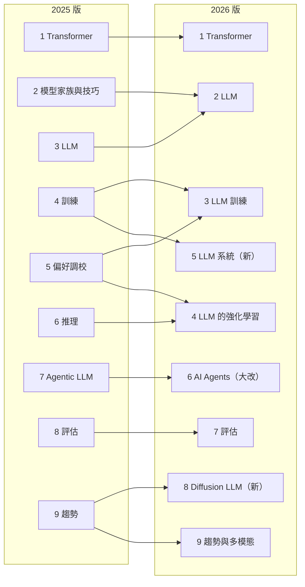

> 🌏 [English version](/posts/ai/2026-09-29-stanford-cme295-transformers-llms-en)

[CME295: Transformers & Large Language Models](https://cme295.stanford.edu/) 是 Stanford 計算與數學工程（CME）課號下的課，授課者是 Afshine Amidi 和 Shervine Amidi。兩人都做過 Uber、Google、Netflix，很多人更早是從他們替 Stanford CS 230 做的 [VIP cheatsheets](https://stanford.edu/~shervine/teaching/cs-230/) 認識他們，這門課的投影片也大量沿用那套圖。

這門課用九堂課，從 tokenization 一路講到 AI agent 和 LLM 評估，每堂課錄影都是一小時四十多分鐘。它不教你寫程式，教的是一張地圖：Transformer 怎麼變成 LLM、LLM 怎麼被訓練和對齊、又怎麼被包成會用工具的 agent。

這個系列會把九堂課逐堂讀完。這篇先交代課程長什麼樣、2025 和 2026 兩版差在哪、跟站上已經寫過的 [CS224N](/posts/ai/2026-08-21-stanford-cs224n-nlp-deep-learning) 和 [CS336](/posts/ai/2026-08-21-stanford-cs336-language-modeling-from-scratch) 怎麼分工。

## 課程形式：兩學分、沒有作業、只有兩次考試

[課程首頁](https://cme295.stanford.edu/)寫得很直接：

> No homework. However, there are two exams: a midterm and a final.

2026 版[第 1 講投影片](https://cme295.stanford.edu/slides/fall26-cme295-lecture1.pdf)列的細節是：每週五下午 3:30 到 5:20 在 Thornton 110 上課，2 學分，可選等第或 Credit/No credit，課堂全程錄影，期中和期末各佔成績 50%。先修寫的是機器學習基礎和線性代數。

「沒有作業」決定了這門課的性格。CS336 要你從零寫出 tokenizer 和 GPU kernel，CME295 則是一門概念課，它要你講得出每個零件為什麼存在、換掉會怎樣。2025 年的[期中考](https://cme295.stanford.edu/exams/fall25-cme295-midterm.pdf)是 90 分鐘閉卷，題型是選擇題加簡答，第一題考的就是「subword tokenization 比 word-level 好在哪」。

教科書是兩人自己寫的 [Super Study Guide: Transformers & Large Language Models](https://superstudy.guide/transformers-large-language-models/)。另外有一份公開的 [cheatsheet](https://cme295.stanford.edu/cheatsheet)，GitHub repo 在 2026-09-29 查詢時有 4,751 顆星，投影片說已經被翻成 14 種語言。

想正式修課的人可以走 [Stanford Online](https://online.stanford.edu/courses/cme295-transformers-and-large-language-models)，但頁面特別註明：這門課只有 2 學分，非學位生每季至少要修 3 學分，所以得再搭一門課。

## 2025 版：九堂完整的課

[2025 版課表](https://cme295.stanford.edu/syllabus/2025/)已經結課，九堂影片、投影片 PDF，以及期中、期末的考卷和解答都公開。這個系列的主幹用的就是這一版。

| 講次 | 主題 | 內容 |
|---|---|---|
| 1 | Transformer | tokenization、embedding、word2vec、RNN/LSTM、attention |
| 2 | Transformer 家族與技巧 | MHA/MQA/GQA、位置編碼、RoPE、BERT 家族 |
| 3 | LLM | MoE、sampling、prompting、chain of thought |
| 4 | 訓練 | 預訓練、量化、硬體最佳化、SFT、LoRA |
| 5 | 偏好調校 | RLHF、reward model、PPO、DPO |
| 6 | 推理 | reasoning model、GRPO、scaling |
| 7 | Agentic LLM | RAG、function calling、ReAct |
| 8 | 評估 | LLM-as-a-judge、偏誤與陷阱 |
| 9 | 趨勢 | 總複習、Vision Transformer、Diffusion LLM |

考試範圍剛好切成兩半：期中四大題各 25 分，對應第 1 到 4 講；[期末](https://cme295.stanford.edu/exams/fall25-cme295-final.pdf)四大題對應第 5 到 8 講。第 9 講不考。

## 2026 版：老師自己說改了三件事

2026 版在 9 月 25 日開課，[新課表](https://cme295.stanford.edu/syllabus/)同樣是九講。第 1 講投影片有一頁叫「Difference with last year's edition」，列出三項新內容：後訓練方法、AI agents、Diffusion LLMs。

對照兩份課表，改動比這三項更大：

- **2025 的第 2、3 講併成一講**：BERT 家族和 prompting、chain of thought、self-consistency 從課表上消失。
- **訓練拆成兩講**：原本擠在第 4、5、6 講的內容重組成「訓練」和「LLM 的強化學習」。新增了 on-policy distillation，強化學習那講從 policy gradient 的數學記號講起。
- **新增 LLM 系統**：分散式訓練、KV cache、speculative decoding、FlashAttention 和硬體取捨，2025 版只在訓練那講帶過。
- **Agent 那講幾乎重寫**：2025 課表列的是 RAG、function calling、ReAct（投影片裡其實已經各有一節講 MCP 和 A2A）；2026 課表改列 tool calling、MCP、記憶與檢索、context compaction、harness 最佳化、coding agent、skills 和 plugins，後四項是真正的新主題。
- **Diffusion LLM 升格成整講**：2025 是第 9 講裡的一段，2026 分成連續、離散、masked diffusion 的訓練與推論。

第 1 講的時間軸也變了。2025 版停在「對話時代」；2026 版多了一格「Agentic era」，放上 Claude Code、Cursor、Codex 和 Antigravity，最後一頁寫著「CME 295 will cover "conversational" and "agentic" era」。

## 跟 CS224N、CS336 怎麼分工

三門課都在 Stanford，主題重疊不少，差別在深度和動手的程度：

| | [CS224N](/posts/ai/2026-08-21-stanford-cs224n-nlp-deep-learning) | CME295 | [CS336](/posts/ai/2026-08-21-stanford-cs336-language-modeling-from-scratch) |
|---|---|---|---|
| 定位 | NLP 與深度學習 | Transformer 與 LLM 的全景 | 從零打造語言模型 |
| 作業 | 四份程式作業＋期末專案 | 沒有，只有兩次考試 | 五份重實作作業 |
| 講到 agent 嗎 | 一講（RAG 與 language agents） | 2026 版有一整講 | 沒有 |
| 適合 | 想打 NLP 基礎 | 想一次看懂全貌 | 想自己訓練模型 |

所以這個系列不會重寫 CS224N 和 CS336 講過的東西。碰到 word2vec、反向傳播、GPU kernel 這類需要深挖的地方，會直接連到那兩個系列的對應篇章。CME295 的價值在於它**把整條線壓在九堂裡**，而且每年跟著業界改課表。

## 這個系列怎麼讀

- **order 1 到 9**：照 2025 版九講逐篇寫。每篇結尾有兩段固定內容：「2026 版改了什麼」，以及從 2025 考卷挑出的「自我檢測」題（只寫題意，附原 PDF 連結）。
- **order 10 到 13**：2026 版新增的 LLM 系統、LLM 的強化學習、AI Agents、Diffusion LLM，等影片上架後再各寫一篇。依新課表，最早的是 10 月 16 日的強化學習那講。
- **先修**：線性代數和機器學習基礎。缺機器學習基礎的話，可以先讀 [Stanford CS 課程地圖](/posts/learning/2026-08-20-stanford-cs-course-map)裡排在前面的課。

今晚能做的一件事：打開 [2025 版播放清單](https://www.youtube.com/playlist?list=PLoROMvodv4rOCXd21gf0CF4xr35yINeOy)的第 1 講，配著[投影片](https://cme295.stanford.edu/slides/fall25-cme295-lecture1.pdf)看前 30 分鐘的 tokenization 段落，再來讀本系列第 1 篇。

## 參考資料

- [CME 295 課程首頁](https://cme295.stanford.edu/)
- [CME 295 2026 版課表](https://cme295.stanford.edu/syllabus/)
- [CME 295 2025 版課表](https://cme295.stanford.edu/syllabus/2025/)
- [2025 版 YouTube 播放清單](https://www.youtube.com/playlist?list=PLoROMvodv4rOCXd21gf0CF4xr35yINeOy)
- [2026 版第 1 講投影片（PDF）](https://cme295.stanford.edu/slides/fall26-cme295-lecture1.pdf)
- [2025 期中考（PDF）](https://cme295.stanford.edu/exams/fall25-cme295-midterm.pdf)／[解答](https://cme295.stanford.edu/exams/fall25-cme295-midterm-solutions.pdf)
- [2025 期末考（PDF）](https://cme295.stanford.edu/exams/fall25-cme295-final.pdf)／[解答](https://cme295.stanford.edu/exams/fall25-cme295-final-solutions.pdf)
- [Stanford Online：Transformers and Large Language Models](https://online.stanford.edu/courses/cme295-transformers-and-large-language-models)
- [Super Study Guide: Transformers & Large Language Models](https://superstudy.guide/transformers-large-language-models/)
- [afshinea/stanford-cme-295-transformers-large-language-models（cheatsheet repo）](https://github.com/afshinea/stanford-cme-295-transformers-large-language-models)
- [Stanford CS224N 導讀](/posts/ai/2026-08-21-stanford-cs224n-nlp-deep-learning)
- [Stanford CS336 導讀](/posts/ai/2026-08-21-stanford-cs336-language-modeling-from-scratch)
