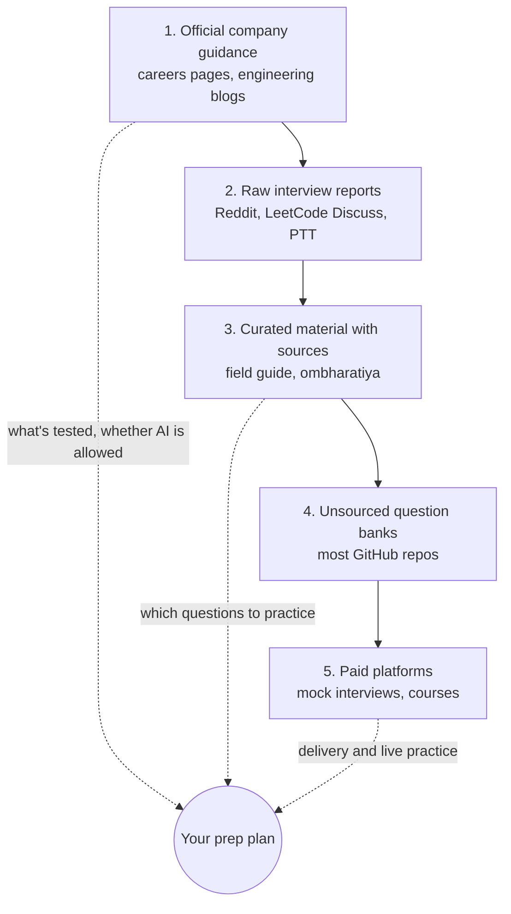

> 🌏 [中文版](/posts/ai/2026-09-30-ai-engineer-interview-resources)

The repo [pallavi-shekhar/ai-engineering-interview-questions-company-wise](https://github.com/pallavi-shekhar/ai-engineering-interview-questions-company-wise) was created on September 19, 2026, and had 1.5k stars nine days later. It lists about 600 "real interview questions" across 35 companies, and not one of them cites a source. It is not an outlier: of the 12 popular AI interview repos reviewed here, only 2 link sources for their questions or interview loops.

This is part 11 of the [AI Engineer Interview Prep](/en/posts/ai/2026-08-20-ai-engineer-interview-overview-en) series. The first 10 parts covered what to prepare. This one covers what to prepare with, and parts 12–17 return to how to answer, organized by topic: [RAG](/en/posts/ai/2026-10-03-ai-interview-rag-variants-en), [agents and MCP](/en/posts/ai/2026-10-03-ai-interview-agent-mcp-caching-en), [prompt, context and harness](/en/posts/ai/2026-10-03-ai-interview-prompt-context-harness-en), [LLM engineering](/en/posts/ai/2026-10-03-ai-interview-llm-engineering-en), [ML and Transformer basics](/en/posts/ai/2026-10-03-ai-interview-ml-transformer-basics-en), and [system design, coding and behavioral interviews](/en/posts/ai/2026-10-03-ai-interview-design-coding-behavioral-en). The short answer: **read the target company's own interview guidance first, then use curated material that cites its sources, and only then grind through unsourced question banks.**

Data dates: GitHub star counts as of 2026-09-28; everything else checked 2026-09-30.

## In 2026, start with what companies say themselves

Interview prep used to start with searching for interview reports. This year several major AI companies wrote down whether AI tools are allowed in interviews, and their rules contradict each other. Preparing under the wrong assumption means practicing for the wrong exam.

| Company | What the official page says | What it means for prep |
|---|---|---|
| [Meta](https://www.metacareers.com/hiring-process/) | "Candidates are expected to use this AI assistant as part of the interview." CoderPad includes Claude, ChatGPT, Gemini, and Meta's own models; outside AI tools are not allowed | Practice reading, debugging, and extending existing code together with AI |
| [Anthropic](https://www.anthropic.com/candidate-ai-guidance) | For live interviews: "This is all you–no AI assistance unless we indicate otherwise." Take-homes also default to no Claude | Default to working on your own; the [performance engineering take-home](https://www.anthropic.com/engineering/AI-resistant-technical-evaluations) explicitly allows AI |
| [OpenAI](https://openai.com/interview-guide/) | "some formats intentionally allow them, while others are designed to assess your independent problem-solving without AI tools"; finals are 4–6 hours with 4–6 interviewers over 1–2 days | Expect both kinds in one loop; ask your recruiter |
| [Google DeepMind](https://deepmind.google/careers/) | 30-minute recruiter call → two or three skills interviews → finals with team leads and leadership | No AI policy on the careers page |
| [Cursor](https://cursor.com/careers) | The careers page doesn't describe the process; [Business Insider](https://www.businessinsider.com/cursor-work-trials-tips-candidate-hiring-head-talent-2026-8) reports a two-day on-site work trial for engineering and design candidates, working from a frozen version of the codebase | Practice getting oriented in a large unfamiliar codebase and shipping something |

Two more primary sources are worth reading. The [Canva engineering blog](https://www.canva.dev/blog/engineering/yes-you-can-use-ai-in-our-interviews/) announced in June 2025 that it now expects backend, ML, and frontend candidates to use tools like Copilot, Cursor, and Claude in interviews. Anthropic's take-home post documents how Claude Opus 4.5 caught up with the strongest candidates within the time limit, which led to three versions of the test and a time limit cut from 4 hours to 2.

The direction is consistent: **grading is moving from "write the correct answer from scratch" to "understand existing code and verify what the AI produced."** Several prep sites report that Meta's AI-assisted interview has three phases: fix a bug, implement, then optimize. Cursor puts you in a real codebase. [Business Insider also reported](https://www.businessinsider.com/google-job-interview-software-engineers-ai-assistant-coding-2026-5) that Google will pilot a "code comprehension" round allowing Gemini for some US teams; that report is based on an internal document, and Google hasn't published it on its own site.

**Something to do tonight**: read the official interview page for each target company and note whether AI is allowed in each round. Anything the page doesn't say goes on your list of questions for the recruiter.

## Five resource types, from most to least trustworthy

| Type | What it's for | Main risk |
|---|---|---|
| Official company guidance | Process, AI policy, grading criteria | High level; won't tell you the questions |
| Raw interview reports | Specific questions, current loop details | Heavy sampling bias; one person's loop isn't the whole company |
| Curated material with sources | A map built from scattered reports | The curator's judgment gets mixed in; go back to the sources |
| Unsourced question banks | Volume; a quick first pass | Can't tell real interview questions from invented ones |
| Paid platforms | Human or AI mock interviews, structured courses | Prices and plans change fast; quality depends on the author |

## 12 GitHub question banks compared

| Repo | ★ | Last commit | Sources | Answers | 2026 formats | Notes |
|---|---|---|---|---|---|---|
| [alexeygrigorev/ai-engineering-field-guide](https://github.com/alexeygrigorev/ai-engineering-field-guide) | 5.7k | 2026-09-23 | ✅ footnoted | ❌ | take-homes, AI-allowed rounds | Interview chapters mostly last updated Feb–Jun 2026 |
| [ombharatiya/AI-Engineer-Interview-Questions](https://github.com/ombharatiya/AI-Engineer-Interview-Questions) | 149 | 2026-08-25 | ✅ company pages | ✅ every question | AI-collaboration rounds, work trials, FDE | Built in large batches over 6 weeks |
| [alirezadir/AIMLInterviews](https://github.com/alirezadir/AIMLInterviews) | 9.8k | 2026-09-23 | author's experience | 🟡 code solutions | agent design, evals | No AI-allowed interview coverage yet |
| [amitshekhariitbhu/ai-engineering-interview-questions](https://github.com/amitshekhariitbhu/ai-engineering-interview-questions) | 3.2k | 2026-09-29 | ❌ | 🟡 external articles | agents, harness | Answers link almost entirely to one education company |
| [pallavi-shekhar/…-company-wise](https://github.com/pallavi-shekhar/ai-engineering-interview-questions-company-wise) | 1.5k | 2026-09-29 | ❌ | 🟡 external articles | scenario questions | Maintained by the same company |
| [llmgenai/LLMInterviewQuestions](https://github.com/llmgenai/LLMInterviewQuestions) | 1.9k | 2025-02-12 | ❌ | ❌ paid course | ❌ | No updates in over a year |
| [KalyanKS-NLP/LLM-Interview-Questions-and-Answers-Hub](https://github.com/KalyanKS-NLP/LLM-Interview-Questions-and-Answers-Hub) | 1.1k | 2026-02-09 | ❌ | ✅ short | ❌ | Promotes the author's book |
| [KalyanKS-NLP/RAG-Interview-Questions-and-Answers-Hub](https://github.com/KalyanKS-NLP/RAG-Interview-Questions-and-Answers-Hub) | 645 | 2025-12-21 | ❌ | ✅ short | ❌ | Uploaded once, never maintained |
| [wdndev/llm_interview_note](https://github.com/wdndev/llm_interview_note) | 15.2k | 2026-06 | ❌ | 🟡 uneven | ❌ | Simplified Chinese; core content from 2023–24 |
| [km1994/LLMs_interview_notes](https://github.com/km1994/LLMs_interview_notes) | 2.6k | 2024-12-26 | ❌ | ❌ external platform | 🟡 o1 chapter | Simplified Chinese; questions only in the repo |
| [khangich/machine-learning-interview](https://github.com/khangich/machine-learning-interview) | 12.8k | 2023-08-31 | author's experience | ❌ | ❌ | No LLM content; abandoned |
| [chiphuyen/ml-interviews-book](https://github.com/chiphuyen/ml-interviews-book) | 4.8k | 2025-03-21 | book | ❌ answer files are empty | ❌ | Classic ML; substantive work ended in 2023 |

"2026 formats" means AI-allowed or AI-collaboration interviews, work trials, [FDE](https://www.tryexponent.com/guides/openai-forward-deployed-engineer-interview) scenario questions, agent/harness design, and eval design. The two most-starred repos (wdndev and khangich) haven't kept up with any of these.

### Three worth bookmarking

**alexeygrigorev/ai-engineering-field-guide** is the only one built from data. The author scraped 6,964 job descriptions and consolidated 100+ interview reports, and most questions carry footnotes to Reddit, HN, or Medium. Its [interview process chapter](https://github.com/alexeygrigorev/ai-engineering-field-guide/blob/main/interview/01-interview-process.md) finds a median of 4 steps per loop. It also collects 80+ repos of real take-home assignments, which you won't find elsewhere. Three limits: no answers; the interview chapters were last updated in the first half of 2026; and some trends are stated more strongly than their sources support, such as presenting one person's HN proposal as a practice that is "gaining traction."

**ombharatiya/AI-Engineer-Interview-Questions** has few stars but the best coverage of 2026 formats. All 33 company pages include Sources and a "Last reviewed" date, and every question has an expandable answer with follow-ups. The KV cache memory estimate we spot-checked is correct. Its "AI Engineer 75" checklist works well for a final sprint. The risk: the whole repo was built through large batch PRs in six weeks, and our research agent inferred heavy AI assistance. A few details, such as a specific MCP spec revision, had no source we could find, so check before citing them.

**alirezadir/AIMLInterviews** has been maintained since 2021 and started as a FAANG MLE interview guide. It has 38 runnable ML/LLM coding problems with pytest, plus chapters on agent system design and evals. The downside: it still advises not relying heavily on an IDE and hasn't caught up with interviews like Meta's that expect you to use AI.

### Use as an index only

**The two Outcome School repos** (amitshekhar by topic, pallavi by company) are well organized for looking things up, and the pallavi version tags each question with the companies that reportedly ask it. Neither cites any source, the answer links point almost entirely to outcomeschool.com, and a paid program sits at the top of the README. The pallavi version's company list and loop descriptions closely resemble the earlier ombharatiya repo; by our comparison about half its questions have highly similar sentences there, but the README doesn't mention it. We can't tell whether both draw on a shared upstream source. Use them to find questions, and go to ombharatiya's Sources when you need to verify.

**The two KalyanKS Hubs** have answers of about 100 words each, good for quickly reviewing definitions. But one question we sampled calls decoder self-attention "cross-attention," and there are duplicate questions. The RAG hub goes reasonably deep on RAG evaluation metrics.

### Outdated, or answers not in the repo

- **wdndev** has 15.2k stars, but recent commits are mostly community typo fixes; the core dates from 2023–24. The inference chapter we sampled never mentions the KV cache and lists gradient clipping as a memory saver.
- **km1994** and **llmgenai** contain only questions; answers link to an external knowledge platform and a paid course respectively.
- **khangich** has no LLM content at all, and its README links to a full-book *Fluent Python* PDF of unknown provenance.
- **Chip Huyen's ML Interviews Book** is still useful for math, statistics, classic ML, and offer negotiation. It barely covers LLMs, and the answer files in the repo are 0-byte empty files.

## Five checks before trusting a question bank

Whenever you open a new interview repo, spend five minutes on these:

1. **Look at the commit history**: `git log --format='%ad %s' --date=short | head`. How many days ago was the first commit, and was everything uploaded at once?
2. **Follow the sources for three random questions**: with no source, treat a question as "a type of question," not "this company asks this."
3. **Spot-check an answer you know well**: KV cache or attention scaling have standard answers; one wrong answer is a warning sign.
4. **See where answers live**: in the repo, on the author's blog, or behind a paywall.
5. **Check for 2026 formats**: AI-allowed interviews, work trials, eval design. Without them, the repo only prepares you for the traditional subjects.

## Books, paid platforms, and interview-report communities

**Books**: For application-layer AI Engineer roles, Chip Huyen's [AI Engineering](https://huyenchip.com/books/) (O'Reilly, 2025) is closest to the actual job. ByteByteGo's [Generative AI System Design Interview](https://blog.bytebytego.com/p/our-new-book-generative-ai-system) (November 2024, by Ali Aminian and Hao Sheng) has 10 fully worked questions, but its chapters lean toward model training and multimodal generation, with no dedicated agent or eval chapter in the table of contents.

**Paid platforms** change quickly, so check the current state first. Exponent [renamed itself Aced](https://www.tryexponent.com/blog/exponent-is-becoming-aced) in August 2026, adding an FDE interview course and updated guides for Anthropic and OpenAI interviews. [Hello Interview](https://www.hellointerview.com/mock-sunset) ended its live mock interviews and mentorship on May 31, 2026; its question bank and premium content continue. [interviewing.io](https://interviewing.io/) offers anonymous mock interviews with human interviewers, including ML algorithms and system design. Prices and discount terms change often, so this post lists none; check the official site before buying.

**Interview-report communities**: Reddit, LeetCode Discuss, and Glassdoor are closest to raw data but heavily biased. In her 2019 [analysis of Glassdoor interview reviews](https://huyenchip.com/2019/08/21/glassdoor-interview-reviews-tech-hiring-cultures.html), Chip Huyen listed several biases: few people leave reviews at all, those with very good or very bad experiences are more likely to write, and candidates who got offers and junior candidates are more likely to post. Readers in Taiwan can check PTT Soft_Job, for example this [2024 AI/ML new-grad job search write-up](https://www.ptt.cc/bbs/Soft_Job/M.1740282491.A.619.html) (in Chinese), which describes a three-round Appier LLM Research Scientist loop whose first round mixed training trade-offs, a LeetCode medium, and chatbot system design. Keep in mind the poster has an unusually strong background (two internships at foreign tech companies, a top-conference paper), so it doesn't represent a typical new grad.

## How to combine them by prep time

| Time available | Start with | Then |
|---|---|---|
| A few days | Read the target company's official interview page and confirm its AI policy | ombharatiya's "AI Engineer 75" plus the target company page |
| 2–4 weeks | Both of the above | The field guide's interview-process and take-home chapters, alirezadir's coding problems, one mock interview per week |
| 1–2 months or more | All of the above | Complete one take-home end to end as a portfolio piece, read *AI Engineering*, and revisit this series' [system design](/en/posts/ai/2026-08-20-ai-engineer-interview-ml-system-design-en), [LLM application](/en/posts/ai/2026-08-20-ai-engineer-interview-llm-application-en), and [coding](/en/posts/ai/2026-08-20-ai-engineer-interview-coding-en) parts for weak spots, and use the common-question tables at the end of parts 12–17 as a practice list |

If your target company lets you use AI (Meta, Canva, Cursor's work trial), practice with AI tools turned on. What you're practicing is breaking down requirements, checking AI output, and explaining why you accept or reject its suggestions. If your target defaults to no AI, like Anthropic, practice with it turned off.

## What this research didn't cover

- Most Reddit, Glassdoor, and Blind threads block automated fetching, so claims from them were read only at the search-snippet level.
- Where company accounts conflict, we didn't pick a side. For example, on whether Anthropic has an AI-collaboration round, the guide from Aced (formerly Exponent) says yes and interviewing.io says AI is strictly prohibited. Accounts also differ on whether Cursor's work trial is paid.
- Only English and Simplified Chinese resources were surveyed; Japanese, Korean, and other languages weren't.

## Update Log

- 2026-10-03: Added links to parts 12–17 (common questions and how to answer them)

## References

- [Meta — Hiring Process FAQ](https://www.metacareers.com/hiring-process/) — official description of AI-assisted interviews
- [Anthropic — Guidance on Candidates' AI Usage](https://www.anthropic.com/candidate-ai-guidance) — when Claude may be used at each stage
- [Anthropic Engineering — Designing AI-resistant technical evaluations](https://www.anthropic.com/engineering/AI-resistant-technical-evaluations) — three revisions of the performance take-home
- [OpenAI — Interview Guide](https://openai.com/interview-guide/) — interview process and AI tool policy
- [Google DeepMind — Careers](https://deepmind.google/careers/) — four-stage interview process
- [Cursor — Careers](https://cursor.com/careers)
- [Business Insider — Cursor's head of talent on work trials](https://www.businessinsider.com/cursor-work-trials-tips-candidate-hiring-head-talent-2026-8) (2026-08-11)
- [Business Insider — Google pilots an AI-assisted interview round](https://www.businessinsider.com/google-job-interview-software-engineers-ai-assistant-coding-2026-5) (2026-05-07)
- [Canva Engineering — Yes, You Can Use AI in Our Interviews](https://www.canva.dev/blog/engineering/yes-you-can-use-ai-in-our-interviews/) (2025-06-11)
- [alexeygrigorev/ai-engineering-field-guide](https://github.com/alexeygrigorev/ai-engineering-field-guide)
- [ombharatiya/AI-Engineer-Interview-Questions](https://github.com/ombharatiya/AI-Engineer-Interview-Questions)
- [alirezadir/AIMLInterviews](https://github.com/alirezadir/AIMLInterviews)
- [amitshekhariitbhu/ai-engineering-interview-questions](https://github.com/amitshekhariitbhu/ai-engineering-interview-questions)
- [pallavi-shekhar/ai-engineering-interview-questions-company-wise](https://github.com/pallavi-shekhar/ai-engineering-interview-questions-company-wise)
- [llmgenai/LLMInterviewQuestions](https://github.com/llmgenai/LLMInterviewQuestions)
- [KalyanKS-NLP/LLM-Interview-Questions-and-Answers-Hub](https://github.com/KalyanKS-NLP/LLM-Interview-Questions-and-Answers-Hub)
- [KalyanKS-NLP/RAG-Interview-Questions-and-Answers-Hub](https://github.com/KalyanKS-NLP/RAG-Interview-Questions-and-Answers-Hub)
- [wdndev/llm_interview_note](https://github.com/wdndev/llm_interview_note) (in Chinese)
- [km1994/LLMs_interview_notes](https://github.com/km1994/LLMs_interview_notes) (in Chinese)
- [khangich/machine-learning-interview](https://github.com/khangich/machine-learning-interview)
- [chiphuyen/ml-interviews-book](https://github.com/chiphuyen/ml-interviews-book)
- [Chip Huyen — Books](https://huyenchip.com/books/)
- [ByteByteGo — Generative AI System Design Interview](https://blog.bytebytego.com/p/our-new-book-generative-ai-system)
- [Aced (formerly Exponent) — rebrand announcement](https://www.tryexponent.com/blog/exponent-is-becoming-aced)
- [Aced — OpenAI Forward Deployed Engineer Interview Guide](https://www.tryexponent.com/guides/openai-forward-deployed-engineer-interview)
- [Hello Interview — Mock Interviews & Mentorship have ended](https://www.hellointerview.com/mock-sunset)
- [interviewing.io](https://interviewing.io/)
- [Chip Huyen — What Glassdoor interview reviews reveal about tech hiring cultures](https://huyenchip.com/2019/08/21/glassdoor-interview-reviews-tech-hiring-cultures.html)
- [PTT Soft_Job — 2024 AI/ML new-grad job search write-up](https://www.ptt.cc/bbs/Soft_Job/M.1740282491.A.619.html) (in Chinese)
