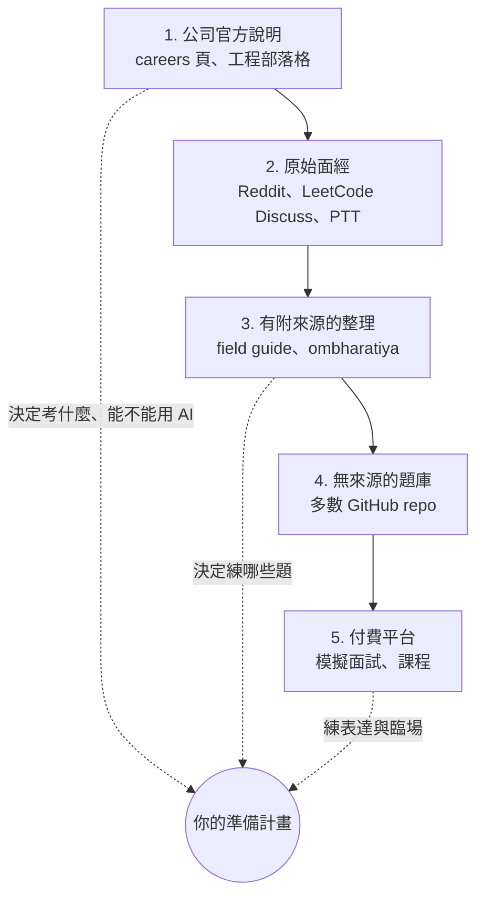

> 🌏 [English version](/en/posts/ai/2026-09-30-ai-engineer-interview-resources-en)

[pallavi-shekhar/ai-engineering-interview-questions-company-wise](https://github.com/pallavi-shekhar/ai-engineering-interview-questions-company-wise) 這個 repo 在 2026 年 9 月 19 日建立，9 天後就有 1.5k 顆星。它整理了 35 間公司、約 600 題「真實面試題」，但全檔沒有任何一題附出處。這不是個案：這次盤點的 12 個熱門 AI 面試 repo，只有 2 個替題目或面試流程附上可點的來源。

這篇是 [AI Engineer 面試準備](/posts/ai/2026-08-20-ai-engineer-interview-overview)系列的第 11 篇。前 10 篇講的是「要準備什麼」，這篇處理「要拿什麼來準備」。結論先講：**先讀目標公司自己寫的面試說明，再用有附來源的整理，最後才拿無來源的題庫刷量。**

以下資料的查詢日期：GitHub star 數為 2026-09-28，其餘為 2026-09-30。

## 2026 年最該先讀的是公司自己的說明

過去準備面試，大家習慣先搜面經。今年有個變化：幾間主要 AI 公司開始把「面試能不能用 AI」寫成正式規定，而且規定互相矛盾。拿錯前提準備，等於練錯考科。

| 公司 | 官方怎麼說 | 對準備的意義 |
|---|---|---|
| [Meta](https://www.metacareers.com/hiring-process/) | 「Candidates are expected to use this AI assistant as part of the interview.」CoderPad 內建 Claude、ChatGPT、Gemini 和 Meta 自家模型，外部 AI 工具一律禁止 | 要練的是和 AI 一起讀、除錯、擴充既有程式碼 |
| [Anthropic](https://www.anthropic.com/candidate-ai-guidance) | 現場面試「This is all you–no AI assistance unless we indicate otherwise」，take-home 也預設不用 Claude | 預設靠自己寫；但[效能工程的 take-home](https://www.anthropic.com/engineering/AI-resistant-technical-evaluations) 明確允許 AI |
| [OpenAI](https://openai.com/interview-guide/) | 「some formats intentionally allow them, while others are designed to assess your independent problem-solving without AI tools」；final 是 4–6 小時、4–6 位面試官、1–2 天 | 同一輪流程裡兩種都會遇到，要問 recruiter |
| [Google DeepMind](https://deepmind.google/careers/) | 30 分鐘 recruiter call → 兩到三場技能面試 → 與 team lead、主管的 final | 官網沒寫 AI 政策 |
| [Cursor](https://cursor.com/careers) | 官網沒寫流程；[Business Insider](https://www.businessinsider.com/cursor-work-trials-tips-candidate-hiring-head-talent-2026-8) 報導工程與設計職缺用兩天的到場 work trial，在凍結版本的 codebase 上工作 | 準備的重點是在陌生的大型 codebase 裡快速定位、做出成果 |

另外兩個一手來源值得一讀。[Canva 工程部落格](https://www.canva.dev/blog/engineering/yes-you-can-use-ai-in-our-interviews/)在 2025 年 6 月宣布，後端、ML、前端的候選人面試時「expect」使用 Copilot、Cursor、Claude 這類工具。Anthropic 那篇 take-home 文章則記錄了 Claude Opus 4.5 在時限內追上最強候選人的過程，所以題目改了三版，時限也從 4 小時縮成 2 小時。

幾家的方向其實一致：**評分重點從「從零寫出正確答案」移到「讀懂既有程式碼、驗證 AI 的產出」。** 據多個備考站報導，Meta 的 AI 面試分成修 bug、實作、優化三段。Cursor 讓你在真實 codebase 上工作。[Business Insider 也報導](https://www.businessinsider.com/google-job-interview-software-engineers-ai-assistant-coding-2026-5) Google 會在部分美國團隊試辦允許 Gemini 的「code comprehension」面試，不過這是媒體根據內部文件寫的，Google 官網還沒有公開。

**今晚就能做的事**：把目標公司的官方面試頁讀完，記下每一輪能不能用 AI。官網沒寫的，列成要問 recruiter 的問題。

## 五種資源，可信度由高到低

| 類型 | 解決什麼 | 主要風險 |
|---|---|---|
| 公司官方說明 | 流程、AI 政策、評分標準 | 寫得很概略，不會告訴你題目 |
| 原始面經 | 具體題目、當下的流程細節 | 樣本偏差大，一個人的經驗不代表整間公司 |
| 有附來源的整理 | 把分散的面經彙整成地圖 | 整理者的判斷會混進去，要回頭看來源 |
| 無來源的題庫 | 大量題目、快速刷過一輪 | 分不出哪些是真的面試題、哪些是編出來的 |
| 付費平台 | 真人或 AI 模擬面試、結構化課程 | 價格和方案變動快，內容品質看作者 |

## 12 個 GitHub 題庫比較

| Repo | ★ | 最後 commit | 附來源 | 答案 | 2026 題型 | 備註 |
|---|---|---|---|---|---|---|
| [alexeygrigorev/ai-engineering-field-guide](https://github.com/alexeygrigorev/ai-engineering-field-guide) | 5.7k | 2026-09-23 | ✅ 題目附註腳 | ❌ | take-home、AI 可用面試 | 面試章節主要停在 2026 年 2–6 月 |
| [ombharatiya/AI-Engineer-Interview-Questions](https://github.com/ombharatiya/AI-Engineer-Interview-Questions) | 149 | 2026-08-25 | ✅ 公司頁 | ✅ 每題 | AI 協作面試、work trial、FDE | 6 週內大批量建立 |
| [alirezadir/AIMLInterviews](https://github.com/alirezadir/AIMLInterviews) | 9.8k | 2026-09-23 | 作者經驗 | 🟡 程式有解 | agent 設計、eval | 還沒涵蓋 AI 可用面試 |
| [amitshekhariitbhu/ai-engineering-interview-questions](https://github.com/amitshekhariitbhu/ai-engineering-interview-questions) | 3.2k | 2026-09-29 | ❌ | 🟡 外連文章 | agent、harness | 答案幾乎都連到同一個教育機構 |
| [pallavi-shekhar/…-company-wise](https://github.com/pallavi-shekhar/ai-engineering-interview-questions-company-wise) | 1.5k | 2026-09-29 | ❌ | 🟡 外連文章 | 情境題 | 同一機構維護 |
| [llmgenai/LLMInterviewQuestions](https://github.com/llmgenai/LLMInterviewQuestions) | 1.9k | 2025-02-12 | ❌ | ❌ 付費課程 | ❌ | 近一年沒更新 |
| [KalyanKS-NLP/LLM-Interview-Questions-and-Answers-Hub](https://github.com/KalyanKS-NLP/LLM-Interview-Questions-and-Answers-Hub) | 1.1k | 2026-02-09 | ❌ | ✅ 短答 | ❌ | 推銷自己的書 |
| [KalyanKS-NLP/RAG-Interview-Questions-and-Answers-Hub](https://github.com/KalyanKS-NLP/RAG-Interview-Questions-and-Answers-Hub) | 645 | 2025-12-21 | ❌ | ✅ 短答 | ❌ | 一次上傳後沒再維護 |
| [wdndev/llm_interview_note](https://github.com/wdndev/llm_interview_note) | 15.2k | 2026-06 | ❌ | 🟡 品質不一 | ❌ | 簡中；主體內容停在 2023–24 年 |
| [km1994/LLMs_interview_notes](https://github.com/km1994/LLMs_interview_notes) | 2.6k | 2024-12-26 | ❌ | ❌ 連到外部平台 | 🟡 有 o1 章節 | 簡中；repo 內只有題目 |
| [khangich/machine-learning-interview](https://github.com/khangich/machine-learning-interview) | 12.8k | 2023-08-31 | 作者經驗 | ❌ | ❌ | 沒有 LLM 內容，已停更 |
| [chiphuyen/ml-interviews-book](https://github.com/chiphuyen/ml-interviews-book) | 4.8k | 2025-03-21 | 書 | ❌ 答案檔是空的 | ❌ | 傳統 ML 經典，實質內容停在 2023 年 |

「2026 題型」指 AI 可用或 AI 協作的面試、work trial、[FDE](https://www.tryexponent.com/guides/openai-forward-deployed-engineer-interview) 情境題、agent／harness 設計、eval 設計。star 數最高的兩個（wdndev、khangich）都已經跟不上這些變化。

### 值得收藏的三個

**alexeygrigorev/ai-engineering-field-guide**：這是唯一用資料做出來的。作者爬了 6,964 份職缺描述，彙整 100 多篇面經，題目多半附 Reddit、HN、Medium 的註腳。它的 [interview process 章節](https://github.com/alexeygrigorev/ai-engineering-field-guide/blob/main/interview/01-interview-process.md)統計出流程中位數是 4 步。另外還收了 80 多個真實 take-home 作業的 repo，這在其他資源裡找不到。限制有三個：沒有答案；面試章節最後更新在 2026 年上半年；有些趨勢說得比來源還強，例如把 HN 上一則個人提案寫成「逐漸流行」的做法。

**ombharatiya/AI-Engineer-Interview-Questions**：星數少，但對 2026 年題型的涵蓋最完整。33 間公司的頁面都附 Sources 和「Last reviewed」日期，每題都有可展開的答案和追問。我們抽查的 KV cache 記憶體估算是對的。它的「AI Engineer 75」清單很適合當最後衝刺用。風險是整個 repo 在 6 週內靠大批 PR 建成，研究代理推測大量使用 AI 輔助。少數細節（例如 MCP 規格的特定版本）我們查不到出處，引用前要自己核對。

**alirezadir/AIMLInterviews**：從 2021 年維護到現在，前身是 FAANG MLE 面試指南。它有 38 題可執行、附 pytest 的 ML／LLM 程式題，也有 agent 系統設計和 eval 章節。缺點是還寫著「不要太依賴 IDE」，沒跟上 Meta 那種要求使用 AI 的面試。

### 當索引用就好的

**Outcome School 的兩個 repo**（amitshekhar 依主題、pallavi 依公司）：題目的編排很好查，pallavi 版每題還標了「哪幾間公司問過」。但兩個都沒有任何來源，答案連結幾乎都指向 outcomeschool.com，頁首還放了付費課程。pallavi 版的公司名單和面試流程描述和更早的 ombharatiya 高度相近，我們比對約有一半題目在 ombharatiya 找得到高度相似的句子，但 README 沒提到它。兩者是不是共用同一個上游來源，我們無法確認。建議用法是拿來找題目，要查證時回 ombharatiya 的 Sources。

**KalyanKS 的兩個 Hub**：答案每題約 100 字，適合快速複習定義。但我們抽到一題把 decoder self-attention 誤稱為 cross-attention，也有重複題。RAG 版在 RAG 評估指標上的深度不錯。

### 已經過時、或答案不在 repo 裡

- **wdndev** 雖然有 15.2k 星，近期 commit 多是社群修錯字，主體停在 2023–24 年。我們抽到的推論章節沒提 KV cache，還把 gradient clipping 列成省記憶體的方法。
- **km1994** 和 **llmgenai** 的 repo 裡只有題目，答案分別連到外部知識平台和付費課程。
- **khangich** 完全沒有 LLM 內容，README 還連到一份來路不明、整本上傳的 *Fluent Python* PDF。
- **Chip Huyen 的 ML Interviews Book** 在數學、統計、傳統 ML 和談 offer 的章節仍然有用。但它對 LLM 幾乎沒著墨，repo 裡的答案檔是 0 位元組的空檔案。

## 判斷一個題庫能不能信：五個檢查

打開任何一個新的面試 repo，花五分鐘做這五件事：

1. **看 commit 歷史**：`git log --format='%ad %s' --date=short | head`。第一個 commit 是幾天前、是不是一次大量上傳。
2. **隨機點三題的出處**：沒有出處就當成「題型參考」，不要當成「這間公司會考」。
3. **抽一題你熟的答案**：KV cache、attention scaling 這類有標準答案的題目，錯一題就要提高警覺。
4. **看答案在哪裡**：在 repo 裡、外連到作者部落格、還是要付費。
5. **對照 2026 題型**：有沒有 AI 可用的面試、work trial、eval 設計。沒有的話，它能幫你準備的只有傳統考科。

## 書、付費平台與面經社群

**書**：做應用層 AI Engineer，Chip Huyen 的 [AI Engineering](https://huyenchip.com/books/)（O'Reilly，2025）最貼近實際工作。ByteByteGo 的 [Generative AI System Design Interview](https://blog.bytebytego.com/p/our-new-book-generative-ai-system)（2024 年 11 月，Ali Aminian 與 Hao Sheng 合著）有 10 道題附完整解答，但章節偏模型訓練與多模態生成，目錄裡沒有 agent 和 eval 的專章。

**付費平台**：變動很快，讀之前先確認現況。Exponent 在 2026 年 8 月[改名為 Aced](https://www.tryexponent.com/blog/exponent-is-becoming-aced)，新增 FDE 面試課程，也更新了 Anthropic、OpenAI 的面試指南。[Hello Interview](https://www.hellointerview.com/mock-sunset) 的真人模擬面試和 mentorship 已在 2026 年 5 月 31 日結束，題庫和付費內容繼續營運。[interviewing.io](https://interviewing.io/) 提供匿名的真人模擬面試，包含 ML 演算法與系統設計。各平台的價格和折扣條件常變，本文不列數字，購買前以官網為準。

**面經社群**：Reddit、LeetCode Discuss、Glassdoor 最接近原始資料，但偏差很大。Chip Huyen 2019 年[分析 Glassdoor 面試評論](https://huyenchip.com/2019/08/21/glassdoor-interview-reviews-tech-hiring-cultures.html)時列出幾種偏差：會留評論的人本來就少、經驗極好或極差的人比較會寫、拿到 offer 的人和資淺候選人比較會寫。台灣讀者可以看 PTT Soft_Job，例如這篇 [2024 AI/ML 新鮮人求職心得](https://www.ptt.cc/bbs/Soft_Job/M.1740282491.A.619.html)，記錄了 Appier LLM Research Scientist 的三輪面試，一面就混合了訓練取捨、LeetCode medium 和 chatbot 系統設計。讀的時候要記得原 PO 背景很強（兩段外商實習、頂會論文），他的經驗不代表一般新鮮人。

## 依準備時間怎麼搭配

| 你有多少時間 | 先做 | 再做 |
|---|---|---|
| 幾天 | 讀目標公司官方面試頁，確認 AI 政策 | ombharatiya 的「AI Engineer 75」＋目標公司頁 |
| 2–4 週 | 上面兩項 | field guide 的面試流程與 take-home 章節、alirezadir 的程式題，每週一次模擬面試 |
| 1–2 個月以上 | 上面全部 | 挑一個 take-home 作業完整做完當作品集，讀 *AI Engineering*，針對弱項回頭看本系列的[系統設計](/posts/ai/2026-08-20-ai-engineer-interview-ml-system-design)、[LLM 應用](/posts/ai/2026-08-20-ai-engineer-interview-llm-application)、[Coding](/posts/ai/2026-08-20-ai-engineer-interview-coding) |

如果目標公司會讓你用 AI（Meta、Canva、Cursor 的 work trial），練習時就要打開 AI 工具。練的是拆需求、檢查 AI 產出、講出你為什麼接受或拒絕它的建議。如果目標是 Anthropic 這類預設禁用的公司，練習時就把 AI 關掉。

## 這次研究沒涵蓋的

- Reddit、Glassdoor、Blind 的原文串多數擋自動抓取，這些來源的說法只讀到搜尋摘要。
- 各公司說法有衝突的地方沒有選邊。例如 Anthropic 是否有 AI 協作輪：Aced（原 Exponent）的指南說有，interviewing.io 說嚴格禁止。Cursor 的 work trial 有沒有付費，說法也不一。
- 只涵蓋英文與簡中資源，日韓等其他語系沒有盤點。

## 參考資料

- [Meta — Hiring Process FAQ](https://www.metacareers.com/hiring-process/) — AI 輔助面試的官方說明
- [Anthropic — Guidance on Candidates' AI Usage](https://www.anthropic.com/candidate-ai-guidance) — 各階段能否使用 Claude
- [Anthropic Engineering — Designing AI-resistant technical evaluations](https://www.anthropic.com/engineering/AI-resistant-technical-evaluations) — 效能工程 take-home 的三次改版
- [OpenAI — Interview Guide](https://openai.com/interview-guide/) — 面試流程與 AI 工具政策
- [Google DeepMind — Careers](https://deepmind.google/careers/) — 面試流程四階段
- [Cursor — Careers](https://cursor.com/careers)
- [Business Insider — Cursor's head of talent on work trials](https://www.businessinsider.com/cursor-work-trials-tips-candidate-hiring-head-talent-2026-8)（2026-08-11）
- [Business Insider — Google 試辦允許 AI 的面試](https://www.businessinsider.com/google-job-interview-software-engineers-ai-assistant-coding-2026-5)（2026-05-07）
- [Canva Engineering — Yes, You Can Use AI in Our Interviews](https://www.canva.dev/blog/engineering/yes-you-can-use-ai-in-our-interviews/)（2025-06-11）
- [alexeygrigorev/ai-engineering-field-guide](https://github.com/alexeygrigorev/ai-engineering-field-guide)
- [ombharatiya/AI-Engineer-Interview-Questions](https://github.com/ombharatiya/AI-Engineer-Interview-Questions)
- [alirezadir/AIMLInterviews](https://github.com/alirezadir/AIMLInterviews)
- [amitshekhariitbhu/ai-engineering-interview-questions](https://github.com/amitshekhariitbhu/ai-engineering-interview-questions)
- [pallavi-shekhar/ai-engineering-interview-questions-company-wise](https://github.com/pallavi-shekhar/ai-engineering-interview-questions-company-wise)
- [llmgenai/LLMInterviewQuestions](https://github.com/llmgenai/LLMInterviewQuestions)
- [KalyanKS-NLP/LLM-Interview-Questions-and-Answers-Hub](https://github.com/KalyanKS-NLP/LLM-Interview-Questions-and-Answers-Hub)
- [KalyanKS-NLP/RAG-Interview-Questions-and-Answers-Hub](https://github.com/KalyanKS-NLP/RAG-Interview-Questions-and-Answers-Hub)
- [wdndev/llm_interview_note](https://github.com/wdndev/llm_interview_note)（簡中）
- [km1994/LLMs_interview_notes](https://github.com/km1994/LLMs_interview_notes)（簡中）
- [khangich/machine-learning-interview](https://github.com/khangich/machine-learning-interview)
- [chiphuyen/ml-interviews-book](https://github.com/chiphuyen/ml-interviews-book)
- [Chip Huyen — Books](https://huyenchip.com/books/)
- [ByteByteGo — Generative AI System Design Interview](https://blog.bytebytego.com/p/our-new-book-generative-ai-system)
- [Aced（原 Exponent）— 改名公告](https://www.tryexponent.com/blog/exponent-is-becoming-aced)
- [Aced — OpenAI Forward Deployed Engineer Interview Guide](https://www.tryexponent.com/guides/openai-forward-deployed-engineer-interview)
- [Hello Interview — Mock Interviews & Mentorship have ended](https://www.hellointerview.com/mock-sunset)
- [interviewing.io](https://interviewing.io/)
- [Chip Huyen — What Glassdoor interview reviews reveal about tech hiring cultures](https://huyenchip.com/2019/08/21/glassdoor-interview-reviews-tech-hiring-cultures.html)
- [PTT Soft_Job — 2024 AI/ML 新鮮人求職心得](https://www.ptt.cc/bbs/Soft_Job/M.1740282491.A.619.html)
