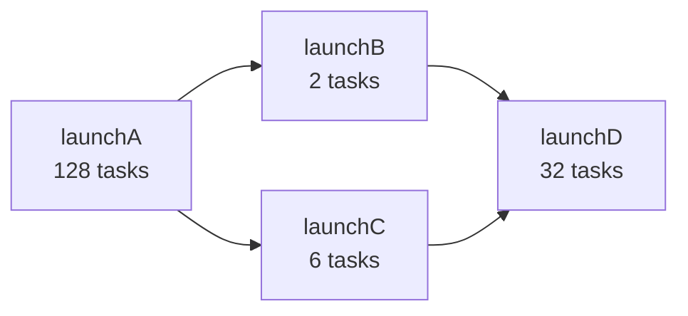

> 🌏 [中文版](/posts/ai/2026-09-30-cs149-pa2-task-graph-scheduling)

**This post is based on the Fall 2025 offering of [CS149](https://gfxcourses.stanford.edu/cs149/fall25).** It is part 8 of the [Reading Stanford CS149](/posts/ai/2026-09-30-cs149-course-overview-en) series and covers what the course homepage lists as "Assignment 2: Scheduling Task Graphs on a Multi-Core CPU," due 2025-10-16. It is the hands-on companion to [Lecture 5, work distribution and scheduling](/posts/ai/2026-09-30-cs149-work-distribution-scheduling-en) and [Lecture 6, locality and communication](/posts/ai/2026-09-30-cs149-locality-communication-en).

The official materials are on GitHub at [stanford-cs149/asst2](https://github.com/stanford-cs149/asst2): the main README, [`tests/README.md`](https://github.com/stanford-cs149/asst2/blob/master/tests/README.md), and [`cloud_readme.md`](https://github.com/stanford-cs149/asst2/blob/master/cloud_readme.md). This post covers only what the assignment trains and what to watch for at each step. **It does not provide solutions.**

Access level: the starter code, tests, and reference-implementation binaries are all public, so this is **A3**. The limits are in the grading environment, covered below.

## The assignment in one sentence

Write a C++ library that executes the tasks an application gives it as efficiently as possible on a multi-core CPU.

The README explains that scheduling data-parallel task graphs is a feature of many parallel runtimes, from Intel's [Thread Building Blocks](https://github.com/intel/tbb) and [Apache Spark](https://spark.apache.org/) to deep learning frameworks like PyTorch and TensorFlow.

The README lists four things the assignment requires:

- Manage task execution with a thread pool
- Orchestrate worker threads with synchronization primitives such as mutexes and condition variables
- Implement a task scheduler that respects the dependencies in a task graph
- Understand workload characteristics to make efficient scheduling decisions

A README section titled "Wait, I Think I've Done This Before?" acknowledges that you may have built thread pools in CS107 or CS111. What's different here is that you write several versions, some without a thread pool and some with different kinds, and compare them across workloads. The point is to see the consequences of design choices.

## The interface: bulk task launch

The core interface is the abstract class `ITaskSystem` in `itasksys.h`:

```cpp
virtual void run(IRunnable* runnable, int num_total_tasks) = 0;
```

`run()` executes `num_total_tasks` instances of the same task. One call launches many tasks, hence **bulk task launch**. Each call to `IRunnable::runTask()` passes the task its own ID (between 0 and `num_total_tasks`) and the total count, which the task uses to pick its share of the work. This is the same idea as the ISPC `launch[N]` you used in [PA1](/posts/ai/2026-09-30-cs149-pa1-w1-quad-core-performance-en).

One key constraint: **`run()` must be synchronous with respect to the calling thread**. When `run()` returns, every task in the launch must be done. The starter code's `TaskSystemSerial` runs every task on the calling thread and meets this trivially.

## Part A: synchronous bulk launch, written three times

The README's advice is "try the simplest improvement first." Each step is more complex and faster, but **each step must be a fully correct system**. This echoes the Lecture 5 and 6 slides: write the simplest version, then measure. All three classes live in `part_a/tasksys.cpp/.h`:

| Step | Class | Cost removed relative to the previous step |
|---|---|---|
| 1 | `TaskSystemParallelSpawn` | serial execution → parallel |
| 2 | `TaskSystemParallelThreadPoolSpinning` | creating threads on every `run()` |
| 3 | `TaskSystemParallelThreadPoolSleeping` | spinning threads burning CPU |

### Step 1: spawn threads on every run()

The constructor receives `num_threads`, the maximum number of worker threads you may use. The README suggests spawning threads at the start of `run()` and joining them from the main thread before it returns. It notes this is correct but pays significant overhead from frequent thread creation.

The README leaves you two questions:

- How will you assign tasks to workers? **Static or dynamic assignment?** (That's Lecture 5.)
- Is there internal task-system state that needs protection from simultaneous access?

### Step 2: a spinning thread pool

When tasks are cheap, Step 1's thread-creation cost is especially visible. So create all workers up front, for example in the constructor or on the first call to `run()`.

The suggested starting point is to have workers loop continuously, checking for work. This is **spinning**. The README asks:

- How does a worker know there is work to do?
- Guaranteeing `run()`'s synchronous semantics is now non-trivial. How does `run()` know every task in the launch has finished?

### Step 3: sleep when there's nothing to do

Step 2's drawback is that spinning threads consume a core's execution resources: workers loop waiting for new tasks, and the main thread loops waiting for workers to finish. Those threads do no useful work but take resources away from the threads that do.

This step puts threads to **sleep** until the condition they're waiting on holds. The README suggests condition variables: a sleeping thread uses no CPU, and other threads signal it to wake up and check the condition. Two typical cases: workers sleep when there's no work, and the main thread sleeps inside `run()` while waiting for the launch to finish, since otherwise a spinning main thread steals CPU from the workers.

The README also warns that this step has tricky race conditions, and you'll need to think through many possible thread interleavings.

**Mind the test scope.** The starter code includes the workloads the grading script uses for performance, but **correctness is checked against a wider set of workloads that aren't provided**. That's why the README encourages you to write more tests of your own.

The synchronization primitives themselves (how locks are implemented, fine-grained locking, lock-free code) are the subject of this series' [Lecture 15](/posts/ai/2026-09-30-cs149-synchronization-memory-consistency-en) and [Lecture 16](/posts/ai/2026-09-30-cs149-fine-grained-locking-lock-free-en) posts. Before starting, the repo's [C++ synchronization tutorial](https://github.com/stanford-cs149/asst2/blob/master/tutorial/README.md) is worth reading.

## Part B: asynchronous task graphs with dependencies

Part B extends Part A's sleeping thread pool with one method:

```cpp
virtual TaskID runAsyncWithDeps(IRunnable* runnable, int num_total_tasks,
                                const std::vector<TaskID>& deps) = 0;
virtual void sync() = 0;
```

It differs from `run()` in two ways.

**Asynchronous**: `runAsyncWithDeps()` must return immediately, even if the tasks haven't finished, and return a unique ID for this bulk launch. The caller knows all earlier launches are done only after calling `sync()`. Before the next `sync()`, your implementation may run those tasks at any time. The README points out this means there's no guarantee launchA's tasks start before launchB's.

**Explicit dependencies**: the third argument lists earlier launches this one depends on. None of this launch's tasks may start until **all** tasks from those launches have completed.

The README's example has four bulk launches: A with 128 tasks, B with 2, C with 6, D with 32. B and C depend on A; D depends on B and C. This forms a **task graph**, a directed acyclic graph where nodes are bulk launches and an edge from X to Y means Y depends on X's output.



B and C don't depend on each other and can run in any order or in parallel. The README notes this matters on a Myth machine with eight execution contexts: neither B nor C alone is enough to use the whole machine.

The README's hints all stay at the design level:

- Think of `runAsyncWithDeps()` as pushing a record for the launch (or records for each of its tasks) onto a work queue; once it's queued, the call can return
- The hard part is the dependency bookkeeping. **What must happen when all tasks in a launch complete?** That's the moment new tasks may become runnable
- Two data structures can help: one for tasks that have been added but are waiting on dependencies, and a **ready queue** of tasks that can run as soon as a worker is free
- You needn't worry about task ID wraparound; tests won't exceed 2^31 bulk launches
- You may assume a program calls only `run()` or only `runAsyncWithDeps()`, never both, so `run()` can be built from `runAsyncWithDeps()` plus `sync()`
- You may assume the only threads calling your implementation are ones it created

Part B only requires changes to `TaskSystemParallelThreadPoolSleeping`. Compare the `enqueue_task(bar, foo_handle)` interface on the [Lecture 5](/posts/ai/2026-09-30-cs149-work-distribution-scheduling-en) slides: this is its implementation.

## What the tests are probing

`tests/README.md` describes the tests the grading harness uses. A few of them, and which cost each one stresses:

| Test | Workload | What it stresses |
|---|---|---|
| `super_super_light` | Two 2^15-element buffers copied back and forth, reversing copy order each iteration; 64 tasks, 400 bulk launches | Tasks do almost nothing, so launch cost dominates |
| `ping_pong_unequal` | Like ping-pong, but some tasks get more work | Load imbalance |
| `recursive_fibonacci` | Very compute-heavy recursive Fibonacci; 30 launches of 256 tasks | Heavy compute |
| `math_operations_in_tight_for_loop_fewer_tasks` | 512 pieces of work split into only 9 tasks, some slightly bigger | Few, uneven tasks |
| `…_fan_in`, `…_reduction_tree` | Many compute tasks followed by one final reduce, or a binary tree of reduces | Part B dependency structure |
| `spin_between_run_calls` | A light task, two medium tasks computing the 40th Fibonacci number, then another light task | Spinning threads stealing CPU |
| `mandelbrot_chunked` | A single launch of 128 tasks | The README says: with only one launch, a thread pool and spawning threads per run() should perform similarly |

The last row deserves a second look. It tells you when a thread pool **doesn't** help. Writeup question 2 asks you to explain exactly this: why simpler implementations (fully serial, or spawning threads on every launch) sometimes match or beat the advanced ones, citing specific tests.

**Try this**: before writing Step 1, sort every test in `tests/README.md` into three groups: many launches of light tasks, heavy tasks, and uneven tasks. After each step, run the grading harness and check which group's PERF values move.

## Running, grading, and points

Run one test:

```bash
./runtasks -n 16 mandelbrot_chunked
```

`-n` is the maximum number of threads the task system may use. The README picks 16 because the AWS grading instance has sixteen execution contexts. `-i` sets the number of runs; the script records the **minimum** runtime.

The grading harness:

```bash
python3 ../tests/run_test_harness.py
```

It compares your implementation against the reference binaries (`runtasks_ref_*`) test by test and prints a PERF column: your runtime divided by the reference's, so values below 1 mean you're faster. In the README's sample output, `[Parallel + Thread Pool + Sleep]` on `super_light` shows PERF 3.33, marked NOT OK.

Points (100 total):

- **Part A (50)**: `TaskSystemParallelSpawn` correctness 5 + performance 5; the spinning and sleeping thread pools each correctness 10 + performance 10
- **Part B (40)**: the sleeping version's `runAsyncWithDeps()`, `run()`, and `sync()`, correctness 30 + performance 10. For Part B you only need to pass `Parallel + Thread Pool + Sleep`
- **Writeup (10)**: describe your implementation (thread management, static or dynamic assignment, how Part B tracks dependencies), explain when simpler implementations win, and describe one test you wrote

Full performance credit requires being within 20% of the reference for Part A and within 50% for Part B. Performance points go only to implementations that produce correct results. You must also write at least one test of your own (correctness or performance); `tests/tests.h` has a `YourTask` and `yourTest()` skeleton to start from.

## Limits for self-learners

- **Grading machine**: official grading runs on AWS `c7g.4xlarge` against `runtasks_ref_linux_arm`. [`cloud_readme.md`](https://github.com/stanford-cs149/asst2/blob/master/cloud_readme.md) lists $0.58 per hour and reminds students this comes out of the course's AWS coupon. Without a coupon, you pay yourself.
- **Running on your own machine**: the repo also ships macOS reference binaries (`runtasks_ref_osx_arm` for M-series chips, `runtasks_ref_osx_x86` for Intel Macs). You can compare PERF on any multi-core machine, but with a different core count and architecture, **your numbers can't be compared directly to the official thresholds**. What's meaningful is the relationship between your own versions, and between you and the reference, on the same machine.
- **Hidden correctness tests**: correctness is checked against workloads you don't have, so outside Stanford you can't know whether you'd pass them all.
- **No solutions**: Gradescope submission and grading are for enrolled students only.

## What this post can and cannot confirm

Confirmed: the contents of the asst2 README, `tests/README.md`, and `cloud_readme.md` (the repo was last updated 2025-10-15, consistent with the 2025-10-16 due date), plus the assignment title and date on the course homepage. Not confirmed: the hidden correctness tests, the reference implementation's internal design, and clarifications posted on Ed.

Further reading: for an operating-systems view of condition variables and locks, see [CS111 Lecture 5: locks and condition variables](/posts/learning/2026-08-22-stanford-cs111-lecture-05-locks-condition-variables-en).

Series navigation: previous, [Lecture 6: locality, communication, and arithmetic intensity](/posts/ai/2026-09-30-cs149-locality-communication-en) | next, [Lecture 7: GPU architecture and CUDA](/posts/ai/2026-09-30-cs149-gpu-architecture-cuda-en) | [series overview](/posts/ai/2026-09-30-cs149-course-overview-en)

## References

- [Stanford CS149 Fall 2025 course homepage and schedule](https://gfxcourses.stanford.edu/cs149/fall25)
- [Assignment 2: Building A Task Execution Library from the Ground Up (stanford-cs149/asst2 README)](https://github.com/stanford-cs149/asst2)
- [asst2 tests/README.md: test workload descriptions](https://github.com/stanford-cs149/asst2/blob/master/tests/README.md)
- [asst2 cloud_readme.md: AWS grading environment setup](https://github.com/stanford-cs149/asst2/blob/master/cloud_readme.md)
- [asst2 C++ synchronization tutorial](https://github.com/stanford-cs149/asst2/blob/master/tutorial/README.md)
- [ISPC documentation: task launch and sync](http://ispc.github.io/ispc.html#task-parallelism-launch-and-sync-statements)
- [Lecture 5 slide PDF (work distribution and scheduling)](https://gfxcourses.stanford.edu/cs149/fall25content/media/perfopt1/05_progperf1.pdf)
