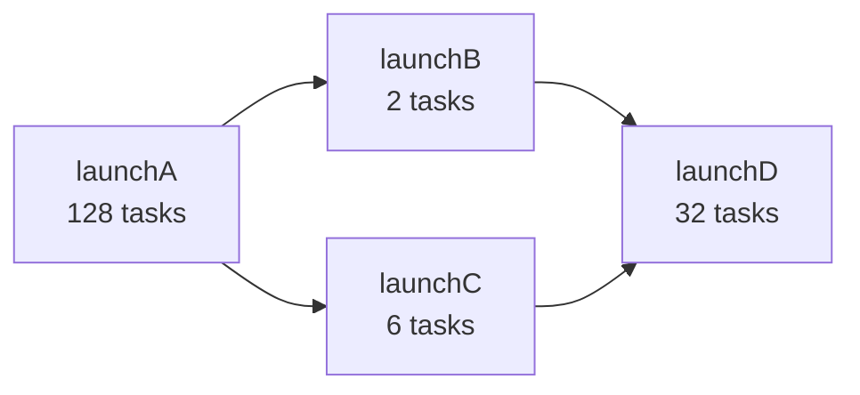

> 🌏 [English version](/posts/ai/2026-09-30-cs149-pa2-task-graph-scheduling-en)

**本文依據 [CS149](https://gfxcourses.stanford.edu/cs149/fall25) Fall 2025 版。** 這是 [Stanford CS149 導讀](/posts/ai/2026-09-30-cs149-course-overview)系列第 8 篇，對應課程首頁的「Assignment 2: Scheduling Task Graphs on a Multi-Core CPU」，截止日是 2025-10-16。它是 [L5 工作分配與排程](/posts/ai/2026-09-30-cs149-work-distribution-scheduling)和 [L6 Locality 與通訊](/posts/ai/2026-09-30-cs149-locality-communication)的實作篇。

官方材料是 GitHub 上的 [stanford-cs149/asst2](https://github.com/stanford-cs149/asst2)：主 README、[`tests/README.md`](https://github.com/stanford-cs149/asst2/blob/master/tests/README.md)、[`cloud_readme.md`](https://github.com/stanford-cs149/asst2/blob/master/cloud_readme.md)。這篇只講題目在練什麼、每一步該觀察什麼現象，**不提供解答**。

存取等級：starter code、測試、參考實作的執行檔都公開，是 **A3**。限制在評分環境，後面會講。

## 課程影片來源

下方提供官方課程與既有錄影入口。尚未核對到可直接嵌入、且對應本文範圍的單支公開影片。

課程與錄影入口：

- [官方課程／講次來源](https://gfxcourses.stanford.edu/cs149/fall25)

## 題目一句話

寫一個 C++ 函式庫，盡可能有效率地在多核 CPU 上執行應用程式交給它的任務。

README 說明，這種對 data-parallel task graph 的排程，是許多平行執行系統的共同功能，從 Intel 的 [Thread Building Blocks](https://github.com/intel/tbb)、[Apache Spark](https://spark.apache.org/)，到 PyTorch、TensorFlow 這類深度學習框架都有。

作業要你練的四件事，README 列得很清楚：

- 用 thread pool 管理任務執行
- 用 mutex、condition variable 等同步原語協調 worker thread
- 實作一個遵守 task graph 依賴的排程器
- 了解 workload 的特性，做出有效率的排程決策

README 有一段叫「Wait, I Think I've Done This Before?」：你可能在 CS107 或 CS111 寫過 thread pool。這份作業的不同處在於，你要寫好幾個版本，有的沒有 thread pool、有的用不同種類的 thread pool，再在不同 workload 上比較它們。重點是看見設計選擇的後果。

## 介面：bulk task launch

核心介面在 `itasksys.h` 的抽象類別 `ITaskSystem`：

```cpp
virtual void run(IRunnable* runnable, int num_total_tasks) = 0;
```

`run()` 執行 `num_total_tasks` 個同一任務的實例。一次呼叫就發出很多任務，所以叫 **bulk task launch**。每次呼叫 `IRunnable::runTask()` 時，系統會給任務它自己的 ID（0 到 `num_total_tasks` 之間）和總數，任務據此決定要做哪一份。這和 [PA1](/posts/ai/2026-09-30-cs149-pa1-w1-quad-core-performance) 用過的 ISPC `launch[N]` 是同一個概念。

一個關鍵限制：**`run()` 對呼叫它的 thread 必須是同步的**。`run()` 一返回，這批任務必須已經全部完成。starter code 附的 `TaskSystemSerial` 在呼叫端 thread 上逐一執行所有任務，天生滿足這個條件。

## Part A：同步的 bulk launch，寫三次

README 的建議是「先試最簡單的改進」。每一步都更複雜、更快，但**每一步都要是完全正確的系統**。這正是 L5 和 L6 投影片都強調的：先寫最簡單的版本，量過再說。三個類別都在 `part_a/tasksys.cpp/.h`：

| 步驟 | 類別 | 相對上一步要消掉的成本 |
|---|---|---|
| 1 | `TaskSystemParallelSpawn` | 循序執行 → 平行 |
| 2 | `TaskSystemParallelThreadPoolSpinning` | 每次 `run()` 都建立 thread 的成本 |
| 3 | `TaskSystemParallelThreadPoolSleeping` | spinning 的 thread 佔用 CPU 的成本 |

### Step 1：每次 run() 都開 thread

建構子會收到 `num_threads`，這是你最多能用的 worker thread 數。README 建議在 `run()` 開頭 spawn thread，返回前由主 thread join。它說這樣是正確的，但頻繁建立 thread 會有明顯 overhead。

README 留給你的兩個問題：

- 任務要怎麼分給 worker？**static 還是 dynamic assignment？**（這就是 L5 的主題）
- 有沒有任務系統的內部狀態需要防止多個 thread 同時存取？

### Step 2：Spinning thread pool

任務很便宜時，Step 1 每次建立 thread 的成本特別明顯。所以改成一開始就建好所有 worker，例如在建構子裡，或第一次呼叫 `run()` 時。

建議的起點是讓 worker 一直迴圈檢查有沒有工作，這叫 **spinning**。README 問：

- worker 要怎麼知道有工作？
- 現在要保證 `run()` 的同步語意變得不簡單了。`run()` 要怎麼知道這批任務全部做完？

### Step 3：沒事就睡

Step 2 的缺點是 spinning 的 thread 會佔用 CPU 執行資源：worker 迴圈等新任務，主 thread 迴圈等 worker 做完。這些 thread 沒做有用的事，卻搶走真正在做事的 thread 的資源。

這一步要讓 thread 在等待的條件成立前**睡覺**。README 建議可以用 condition variable：thread 睡著時不佔用 CPU，別的 thread 用 signal 叫醒它，讓它檢查條件是否成立。兩個典型的例子：沒有工作時讓 worker 睡；主 thread 在 `run()` 裡等這批任務完成時也睡，否則 spinning 的主 thread 會搶 worker 的 CPU。

README 同時警告：這一步會有棘手的 race condition，你得考慮很多種 thread 交錯的可能。

**測試的範圍也要注意。** starter code 包含評分腳本用來測效能的 workload，但**正確性會用一組沒有公開的更廣測試來檢查**。README 因此建議你自己多寫測試。

同步原語本身（lock 怎麼實作、細粒度鎖、lock-free）是本系列後面的 [L15](/posts/ai/2026-09-30-cs149-synchronization-memory-consistency) 和 [L16](/posts/ai/2026-09-30-cs149-fine-grained-locking-lock-free) 的主題。寫這份作業前，官方 repo 附了一份 [C++ synchronization tutorial](https://github.com/stanford-cs149/asst2/blob/master/tutorial/README.md) 可以先讀。

## Part B：非同步、有依賴的 task graph

Part B 在 Part A 的 sleeping thread pool 上擴充一個方法：

```cpp
virtual TaskID runAsyncWithDeps(IRunnable* runnable, int num_total_tasks,
                                const std::vector<TaskID>& deps) = 0;
virtual void sync() = 0;
```

它和 `run()` 有兩個不同。

**非同步**：`runAsyncWithDeps()` 必須立刻返回，即使任務還沒執行完，並回傳這次 bulk launch 的唯一 ID。呼叫端要等到呼叫 `sync()` 才能確定之前所有 launch 都完成了。在下一次 `sync()` 之前，你的實作可以在任何時間執行這些任務。README 特別指出，這代表並不保證 launchA 的任務會比 launchB 先開始。

**明確的依賴**：第三個參數列出這批任務依賴的先前 launch。那些 launch 的**所有**任務完成之前，這批任務一個都不能開始。

README 的例子是四個 bulk launch：A 有 128 個任務，B 有 2 個，C 有 6 個，D 有 32 個。B 和 C 依賴 A，D 依賴 B 和 C。這構成一個 **task graph**，也就是有向無環圖：節點是 bulk launch，X 到 Y 的邊表示 Y 依賴 X 的輸出。



B 和 C 之間沒有依賴，可以任意順序或同時跑。README 指出，在有 8 個執行 context 的 Myth 機器上，這點很有用：B 或 C 單獨都不足以用滿整台機器。

README 給的提示，全都停在設計層次：

- 可以把 `runAsyncWithDeps()` 想成把這次 launch 的紀錄（或它每個任務的紀錄）推進一個 work queue，推進去就可以返回
- 難處在追蹤依賴的簿記。**一批 launch 的所有任務完成時，該做什麼？** 那正是新任務可能變成可執行的時間點
- 可以用兩個資料結構：一個放已加入但還在等依賴的任務，一個是 **ready queue**，放不用等、有 worker 就能執行的任務
- 不必處理 task ID 的整數溢位，測試不會超過 2^31 次 bulk launch
- 可以假設程式只呼叫 `run()` 或只呼叫 `runAsyncWithDeps()`，不會混用，所以 `run()` 可以用 `runAsyncWithDeps()` 加 `sync()` 來實作
- 可以假設只有你的實作自己建立的 thread 會呼叫它

Part B 只需要改 `TaskSystemParallelThreadPoolSleeping`，其他類別不用。對照 [L5](/posts/ai/2026-09-30-cs149-work-distribution-scheduling) 投影片裡的 `enqueue_task(bar, foo_handle)`，這就是那個介面的實作。

## 測試在考什麼

`tests/README.md` 描述了評分腳本用到的測試。挑幾個看它們在壓哪一種成本：

| 測試 | workload | 在壓什麼 |
|---|---|---|
| `super_super_light` | 兩個 2^15 元素的 buffer 互相複製，每輪反轉複製順序，每次 64 個任務，400 次 bulk launch | 任務幾乎沒工作，launch 本身的成本 |
| `ping_pong_unequal` | 同 ping-pong，但有些任務工作量比較多 | 負載不平衡 |
| `recursive_fibonacci` | 很吃計算的遞迴 Fibonacci，30 次 launch，每次 256 個任務 | 重計算 |
| `math_operations_in_tight_for_loop_fewer_tasks` | 512 份工作只切成 9 個任務，有些任務多一點 | 任務數少、不平均 |
| `…_fan_in`、`…_reduction_tree` | 大量計算任務後接一次總 reduce，或二元樹狀的 reduce | Part B 的依賴結構 |
| `spin_between_run_calls` | 輕任務、兩個算第 40 個 Fibonacci 數的中量任務、再一個輕任務 | spinning 的 thread 搶走 CPU |
| `mandelbrot_chunked` | 單次 launch、128 個任務 | README 說：只有一次 launch，thread pool 和每次開 thread 效能應該差不多 |

最後一列值得多看一眼。它告訴你 thread pool 什麼時候**沒有**幫助。writeup 第 2 題也要你解釋這件事：比較簡單的實作（純循序、每次開 thread）有時和進階實作一樣快甚至更快，為什麼？請舉測試為例。

**怎麼做**：開始寫 Step 1 之前，先把 `tests/README.md` 的每個測試分成三類：launch 次數多且任務輕、任務重、任務不平均。寫完每一步都跑一次評分腳本，對照你的分類，看是哪一類的 PERF 在變。

## 執行、評分與配分

跑單一測試：

```bash
./runtasks -n 16 mandelbrot_chunked
```

`-n` 是任務系統最多能用的 thread 數。README 選 16，因為 AWS 評分機有 16 個執行 context。`-i` 是重複次數，腳本取多次執行的**最小值**。

評分腳本：

```bash
python3 ../tests/run_test_harness.py
```

它會把你的實作和參考實作的執行檔（`runtasks_ref_*`）逐一比較，輸出 PERF 欄位，也就是你的時間除以參考實作的時間，小於 1 代表比參考實作快。README 範例裡，`[Parallel + Thread Pool + Sleep]` 在 `super_light` 上 PERF 3.33，標為 NOT OK。

配分（100 分）：

- **Part A（50 分）**：`TaskSystemParallelSpawn` 正確性 5 + 效能 5；spinning 與 sleeping 兩個 thread pool 各正確性 10 + 效能 10
- **Part B（40 分）**：sleeping 版的 `runAsyncWithDeps()`、`run()`、`sync()` 正確性 30 + 效能 10。Part B 只需要通過 `Parallel + Thread Pool + Sleep`
- **Writeup（10 分）**：描述實作（怎麼管 thread、static 還是 dynamic assignment、Part B 怎麼追蹤依賴）、解釋簡單實作何時勝出、描述一個你自己寫的測試

效能滿分的門檻：Part A 在參考實作的 20% 以內，Part B 在 50% 以內。只有答案正確的實作才拿得到效能分。另外至少要自己寫一個測試（正確性或效能皆可），在 `tests/tests.h` 裡有 `YourTask` 和 `yourTest()` 骨架可以用。

## 校外自學的限制

- **評分機器**：官方在 AWS `c7g.4xlarge` 上評分，並用 `runtasks_ref_linux_arm` 當參考。[`cloud_readme.md`](https://github.com/stanford-cs149/asst2/blob/master/cloud_readme.md) 寫的價格是每小時 0.58 美元，並提醒這是從課程發的 AWS coupon 扣。校外沒有 coupon，要自己付費。
- **在自己機器上跑**：repo 也附了 macOS 的參考執行檔（M 系列晶片用 `runtasks_ref_osx_arm`，Intel Mac 用 `runtasks_ref_osx_x86`）。你可以在任何多核機器上比 PERF，但核心數與架構不同，**數字不能直接和官方門檻比**。比較有意義的是同一台機器上你的各版本之間、你和參考實作之間的相對關係。
- **沒公開的正確性測試**：官方會用一組沒給你的 workload 檢查正確性，校外無從得知自己是否全部通過。
- **沒有解答**：Gradescope 繳交與評分只對修課學生開放。

## 這一篇可以確認與不能確認的

可以確認：asst2 主 README、`tests/README.md`、`cloud_readme.md` 的內容（repo 最後更新於 2025-10-15，和截止日 2025-10-16 吻合），以及課程首頁的作業標題與日期。不能確認：隱藏的正確性測試內容、參考實作的內部設計、Ed 討論區上的補充說明。

延伸閱讀：condition variable 與 lock 的作業系統觀點，可以讀 [CS111 Lecture 5：Locks 與 condition variables](/posts/learning/2026-08-22-stanford-cs111-lecture-05-locks-condition-variables)。

系列導覽：上一篇 [L6 Locality、通訊與 arithmetic intensity](/posts/ai/2026-09-30-cs149-locality-communication)｜下一篇 [L7 GPU 架構與 CUDA](/posts/ai/2026-09-30-cs149-gpu-architecture-cuda)｜[系列總覽](/posts/ai/2026-09-30-cs149-course-overview)

## 更新紀錄

- 2026-10-10：補上課程影片來源與錄影取得方式。

## 參考資料

- [Stanford CS149 Fall 2025 課程首頁與講次表](https://gfxcourses.stanford.edu/cs149/fall25)
- [Assignment 2: Building A Task Execution Library from the Ground Up（stanford-cs149/asst2 README）](https://github.com/stanford-cs149/asst2)
- [asst2 tests/README.md：測試 workload 說明](https://github.com/stanford-cs149/asst2/blob/master/tests/README.md)
- [asst2 cloud_readme.md：AWS 評分環境設定](https://github.com/stanford-cs149/asst2/blob/master/cloud_readme.md)
- [asst2 C++ synchronization tutorial](https://github.com/stanford-cs149/asst2/blob/master/tutorial/README.md)
- [ISPC 文件：task launch 與 sync](http://ispc.github.io/ispc.html#task-parallelism-launch-and-sync-statements)
- [Lecture 5 投影片 PDF（work distribution and scheduling）](https://gfxcourses.stanford.edu/cs149/fall25content/media/perfopt1/05_progperf1.pdf)
