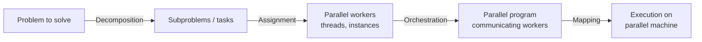

> 🌏 [中文版](/posts/ai/2026-09-30-cs149-parallelizing-thought-process)

**Video status: Related supplementary video included; the original lecture recording has not been verified.** [Source details](#course-video-sources)

**This post is based on the Fall 2025 edition of [CS149](https://gfxcourses.stanford.edu/cs149/fall25).** It is part 5 of the [Reading Stanford CS149](/posts/ai/2026-09-30-cs149-course-overview-en) series and covers Lecture 4 (October 2), [Parallelizing Code: An Example Thought Process](https://gfxcourses.stanford.edu/cs149/fall25/lecture/thoughtprocess/). The official slide [PDF](https://gfxcourses.stanford.edu/cs149/fall25content/media/thoughtprocess/04_progbasics.pdf) has 74 pages.

Fall 2025 recordings are only on Canvas. The matching public recording is [2023 Lecture 4 - Parallel Programming Basics](https://www.youtube.com/watch?v=0-ztm8SKq70). This post follows the 2025 slides.

Slides 3–27 replay the ISPC half of L3 (`sinx()`, interleaved vs. blocked, `foreach`, `reduce_add`, the SPMD summary), which the [previous lecture guide](/posts/ai/2026-09-30-cs149-latency-bandwidth-ispc-en) already covers. This post starts at slide 28, where the lecture's new topic begins: **what should run through your head when you write a parallel program?**

## Course video sources

This article uses Fall 2025 materials. The official Fall 2025 course page states that this year's lecture videos cannot be distributed to the public and points to a 2023 YouTube playlist instead. The Fall 2023 recording below covers a closely related topic but its content may differ from the 2025 lecture, and the original recording has not been verified. Checked: 2026-10-10.

```youtube
url: https://www.youtube.com/watch?v=0-ztm8SKq70
title: Stanford CS149 I Parallel Computing I 2023 I Lecture 4 - Parallel Programming Basics
```

Original videos: [Stanford CS149 I Parallel Computing I 2023 I Lecture 4 - Parallel Programming Basics](https://www.youtube.com/watch?v=0-ztm8SKq70)

Course and recording entries:

- [CS149 2023 public recordings playlist](https://www.youtube.com/playlist?list=PLoROMvodv4rMp7MTFr4hQsDEcX7Bx6Odp)
- [Official course / lecture source](https://gfxcourses.stanford.edu/cs149/fall25/lecture/thoughtprocess/)

Content check: verified against the video transcript (2026-10-10): I read the auto-generated captions of the Fall 2023 recording “Lecture 4 - Parallel Programming Basics” (1:17:14). The captions cover the four steps of decomposition, assignment, orchestration and mapping, Amdahl's law (transcribed as “AMD doll's law” and mentioned in one sentence), grid-solver dependencies with red-black checkerboard updates, and barriers and locks in the shared address space model, matching this post's topic; the captions contain no discussion of static versus dynamic assignment (that is in Lecture 5) and no message passing. I checked how the video's topic relates to this post's topic; the post itself follows the Fall 2025 slides and was not compared segment by segment against the video.

## Three questions, one goal

Slide 29 boils the process down to three steps:

1. Identify work that can be performed in parallel.
2. Partition the work (and the data it uses).
3. Manage data access, communication, and synchronization.

A common goal is maximizing speedup, defined for a fixed computation as time on 1 processor divided by time on P processors. The slide notes other goals too: better efficiency (cost, area, power), or working on problems too big for one machine.

Slide 30 draws the steps as a pipeline, credited to the textbook by Culler, Singh, and Gupta:



The slide stresses that **these responsibilities may fall to the programmer, to the system (compiler, runtime, hardware), or to both.** This extends L3's "abstraction vs. implementation": who owns each step is a design decision of the programming model.

## Step 1: decomposition, and the key is dependencies

Slide 31: break the problem into tasks that can run in parallel — generally at least enough to keep every execution unit busy. **The key challenge of decomposition is identifying dependencies** (or the lack of them).

### Amdahl's Law: the sequential part sets the ceiling

Slide 32's definition: let S be the fraction of sequential execution that is inherently sequential because dependencies prevent parallel execution. The maximum speedup from parallelism is at most 1/S.

Slides 33–35 work through a two-step image computation on an N×N image:

- Step 1: double the brightness of every pixel (independent per pixel)
- Step 2: compute the average of all pixels

Sequentially, each step takes about N² time. The first attempt parallelizes only step 1 and leaves step 2 serial, so speedup is at most 2 — however large P gets. The second attempt splits step 2 into parallel partial sums followed by a serial combine, making step 2 take N²/P + P. The slides note that speedup approaches P when N is much larger than P. The extra P is the parallel algorithm's overhead for combining partial sums.

Slide 37 takes it to an extreme. The Summit supercomputer has 27,648 GPUs, about 148 million ALUs in total. If 0.1% of an application is serial, what is the maximum speedup? Plug into 1/S and the answer is 1,000× — less than a ten-thousandth of the machine's scale.

### Who decomposes?

Slide 38: in most cases, the programmer. Automatically decomposing sequential programs into independent tasks is still a hard research problem. The compiler must analyze the program and find dependencies, and those dependencies may depend on runtime data. The slide says researchers have had modest success with simple loop nests, but the "magic parallelizing compiler" for complex, general-purpose code does not exist yet.

## Step 2: assignment, static or dynamic

Slide 39: assign tasks to workers. A "worker" could be a thread, a program instance, or a vector lane. The goals are **load balance** and **low communication cost**. Assignment can happen statically before the program runs or dynamically as it executes. The slide also notes that while programmers usually handle decomposition, many languages and runtimes take over assignment.

The slides give three examples:

| Example | Who assigns | How |
|---|---|---|
| `sinx()` with C++11 threads (slide 40) | Programmer | Static, blocked: first half of the array to a spawned thread, second half to the main thread |
| ISPC interleaved and `foreach` versions (slide 41) | Programmer for the first, ISPC for the second | Static |
| ISPC tasks (slide 42) | ISPC runtime | Dynamic: `launch[100]` creates 100 tasks; each worker thread in a pool finishes a task, then claims the next uncompleted one from the list |

The third example answers part of the puzzle from [PA1](/posts/ai/2026-09-30-cs149-pa1-w1-quad-core-performance-en) Program 3. With more tasks than cores, dynamic assignment naturally hands new work to whichever core finishes first.

## Step 3: orchestration

Slide 43 lists what orchestration involves:

- structuring communication
- adding synchronization to preserve dependencies where needed
- organizing data structures in memory
- scheduling tasks

The goals are to cut communication and synchronization costs, preserve locality of data access, and reduce overhead. The slide warns that machine details drive many of these choices: if synchronization is expensive, a programmer might use it more sparingly.

## Step 4: mapping to hardware

Slide 44 gives three examples of who places workers on hardware:

- The operating system maps a thread to a hardware execution context on a CPU core.
- The compiler maps ISPC program instances to vector instruction lanes.
- The hardware maps CUDA thread blocks to GPU cores (covered in a later lecture).

It also lists two placement strategies that pull in opposite directions. Put cooperating threads on the same core to maximize locality and cut communication costs. Or put unrelated threads on the same core — one bandwidth-limited, one compute-limited — to use the machine more fully.

## The running example: a 2D grid solver

From slide 45 on, the lecture walks through the whole process on an example from Culler, Singh, and Gupta.

### The problem and the sequential algorithm

Solve a partial differential equation on an (N+2)×(N+2) grid using Gauss-Seidel sweeps. Each cell becomes a weighted average (coefficient 0.2) of itself and its four neighbors, and sweeps repeat until the average change across the grid falls below a tolerance (slides 46–47).

### Finding dependencies: parallelism exists, but it's awkward

Slides 48–49 analyze dependencies within one iteration. Each cell depends on the cell to its left, and each row depends on the previous row. The result: **cells along each diagonal are independent of each other**.

The good news is that parallelism exists. The bad news is that it is hard to exploit. Diagonals are short at the beginning and end of the sweep, so there is little parallelism there, and every diagonal needs a synchronization step.

### Change the algorithm: red-black coloring

Slide 50 makes the key move: **change the algorithm to one that is more amenable to parallelism.** Reorder the cell updates. The new algorithm converges to approximately the same solution by a different path; the floating-point values differ, but still land within the error threshold. The slide admits that realizing this change is allowed takes domain knowledge of the Gauss-Seidel method, and adds that it is a common technique in parallel programming.

Slide 51's new scheme is **red-black coloring**: color the grid like a checkerboard. Update all red cells in parallel; once they're done, update all black cells in parallel (black cells depend on the new red values); repeat until convergence.

Slides 52–54 discuss how to divide cells among processors. The slide asks which assignment is better, and answers: it depends on the system the program runs on. Each round, updated boundary cells must be sent to other processors, and a blocked assignment (each processor gets a band of contiguous rows) requires less data to be communicated.

**Something you can do tonight**: take a loop you've written and sketch which locations each iteration reads and writes. Find the dependencies between iterations. If they block parallelism, ask whether a different order could still give an acceptable result — that is the red-black idea.

## One program, two ways to write it

Slide 55 says the solver can be written with two ways of thinking: data parallel, or SPMD with a shared address space.

### The data-parallel model

Slide 57's pseudocode expresses the red-cell update as `for_all (red cells (i,j))` and accumulates the change with a built-in `reduceAdd`. The slide maps the four steps onto it:

- Decomposition: processing each grid element is independent work
- Assignment: not specified (the slide marks it "???" — left to the system)
- Orchestration: handled by the system — the built-in `reduceAdd` communication primitive, plus an implicit wait for all workers at the end of the `for_all` block

### The shared-address-space model

Slides 59–60 switch to the SPMD execution model. Every thread runs the same `solve()` and uses its `threadId` to compute which rows it owns. Now **the programmer is responsible for synchronization**, and the common primitives are locks (mutual exclusion: one thread in the critical section at a time) and barriers (wait until all threads reach this point).

Slides 61–67 fill in the basics of the shared address space:

- Threads communicate by reading and writing shared variables. The slides' metaphor is a bulletin board anyone can read and write.
- Why mutual exclusion is needed: `x++` is really three instructions — load into a register, add, store back. If two threads interleave them, two increments can collapse into one. Those three instructions need to be **atomic**.
- Ways to preserve atomicity: a lock/unlock pair around a critical section, first-class `atomic { }` blocks in some languages, and hardware-supported atomic read-modify-write operations such as `atomicAdd`.
- The slides point out that every discussion in the course so far has quietly assumed a shared address space; it is a natural extension of sequential programming.

Slides 68–69 return to the solver. Each thread first accumulates its change into a **private** `myDiff`, and adds it to the global `diff` under a lock only once per iteration. This is the same trick as L3's ISPC array sum — accumulate partial sums privately, combine at the end — and it cuts contention on shared variables.

### Barriers: a conservative way to express dependencies

Slide 70 defines a barrier: all computation by all threads before the barrier completes before any computation by any thread after it begins. In other words, **a barrier assumes that everything after it depends on everything before it**. It is a conservative way to express dependencies, and it divides computation into phases.

Slide 71 asks why the solver needs three barriers. Slide 72 shows a version with just one: turn the global `diff` into three copies and rotate through them on successive iterations, removing the dependency. The slide describes this as trading memory footprint for removing dependencies, a common parallel programming technique. Working out what each of the three barriers protects, and why three copies of `diff` are enough, is worth doing yourself.

### Comparing the two models

Slide 73's comparison:

| | Data-parallel model | Shared-address-space model |
|---|---|---|
| Synchronization | Single logical thread of control; the system may parallelize `forall` iterations; implicit barrier at the end of the loop body | Mutual exclusion for shared variables (e.g., locks); barriers express dependencies between phases |
| Communication | Implicit in loads and stores; built-in primitives (e.g., reduce) for complex patterns | Implicit in loads and stores to shared variables |

## Lecture summary

Slide 74 sums up:

- Amdahl's Law: the maximum speedup from parallelism is limited by the amount of serial execution in a program.
- Creating a parallel program involves decomposition into independent work, assignment of work to workers, orchestration to coordinate the workers, and mapping to hardware. The coming lectures return to making good decisions at each stage.
- Today's focus: identifying dependencies.
- Coming soon: identifying locality and reducing synchronization.

The next lecture, L5, picks up at the assignment step: how to balance load without paying too much in scheduling costs.

Further reading: this lecture only motivates locks and atomicity. For the full operating-systems treatment, see this site's guides to [CS111 Lecture 4: concurrency and atomicity](/posts/learning/2026-08-22-stanford-cs111-lecture-04-concurrency-atomicity-en) and [Lecture 5: locks and condition variables](/posts/learning/2026-08-22-stanford-cs111-lecture-05-locks-condition-variables-en). CS149 itself covers lock implementation and lock-free programming at orders 20–21 of this series.

Series navigation: previous [PA1 + Written 1: Performance on a Quad-Core CPU](/posts/ai/2026-09-30-cs149-pa1-w1-quad-core-performance-en) | next [L5: Work Distribution and Scheduling](/posts/ai/2026-09-30-cs149-work-distribution-scheduling-en) | [series overview](/posts/ai/2026-09-30-cs149-course-overview-en)

## Update Log

- 2026-10-10: Added explicit video status and checked recording sources and access notes.
- 2026-10-10: Rechecked video status. Official sources only have Fall 2023 recordings, so the status is now related supplementary video only, and video titles use the original titles.
- 2026-10-10: Checked the video content against its transcript. The video topic matches this post; static versus dynamic assignment and red-black coloring are not in the video.

## References

- [Stanford CS149 Fall 2025 course home page](https://gfxcourses.stanford.edu/cs149/fall25)
- [Lecture 4 page (slide-by-slide)](https://gfxcourses.stanford.edu/cs149/fall25/lecture/thoughtprocess/)
- [Lecture 4 slides PDF: Parallelizing Code: An Example Thought Process](https://gfxcourses.stanford.edu/cs149/fall25content/media/thoughtprocess/04_progbasics.pdf)
- [2023 Lecture 4 recording: Parallel Programming Basics](https://www.youtube.com/watch?v=0-ztm8SKq70)
- [CS149 2023 public recordings playlist](https://www.youtube.com/playlist?list=PLoROMvodv4rMp7MTFr4hQsDEcX7Bx6Odp)
