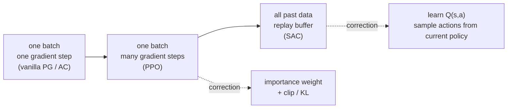

> 🌏 [中文版](/posts/ai/2026-09-30-cs224r-off-policy-actor-critic-ppo-sac)

**Video status: Related supplementary video included; the original lecture recording has not been verified.** [Source details](#course-video-sources)

**This post is based on the Spring 2026 edition of [CS224R](https://cs224r.stanford.edu/).** It is part 6 of the [Reading Stanford CS224R](/posts/ai/2026-09-30-cs224r-course-overview-en) series. It follows [L4 Actor-Critic](/posts/ai/2026-09-30-cs224r-actor-critic-en) and covers Lecture 5, "Off-Policy Actor Critic Methods," given on April 15, 2026.

Two official sources back this post. The first is the 32-page slide deck [05_cs224r_offpolicy_actor_critic_2026.pdf](https://cs224r.stanford.edu/slides/05_cs224r_offpolicy_actor_critic_2026.pdf). The second is the lecture's assigned reading on the schedule, [Mnih et al. 2013 (DQN)](https://arxiv.org/abs/1312.5602). The PPO paper, [Schulman et al. 2017](https://arxiv.org/abs/1707.06347), sits on the reading list of the previous lecture (L4). This lecture is where it gets unpacked. Access level: **A3**. The slides download anonymously. The 2026 recordings live only on Canvas.

The companion video is [Spring 2025 Lecture 5: Off-Policy Actor Critic](https://www.youtube.com/watch?v=cRGKc-nAWho) (about 69 minutes). Treat it as a **supplement**. The title matches, but the slides have been updated for 2026, and details may differ. Everything below follows the 2026 slides.

## Course video sources

This article uses Spring 2026 materials. The public Spring 2025 recordings below are supplementary; lecture numbering and content may differ.

```youtube
url: https://www.youtube.com/watch?v=cRGKc-nAWho
title: Spring 2025 Lecture 5: Off-Policy Actor Critic (YouTube, supplement)
```

Original videos: [Spring 2025 Lecture 5: Off-Policy Actor Critic (YouTube, supplement)](https://www.youtube.com/watch?v=cRGKc-nAWho)

Course and recording entries:

- [CS224R Spring 2025 YouTube playlist](https://www.youtube.com/playlist?list=PLoROMvodv4rPwxE0ONYRa_itZFdaKCylL)
- [Official course / lecture source](https://cs224r.stanford.edu/)

The Spring 2026 lecture recordings sit behind Stanford sign-in on Canvas/Panopto; the public YouTube playlist is Spring 2025. Checked: 2026-10-10.

## The setting: data is expensive, yet each batch gets used once

Recall L3 and L4. You run the policy, collect a batch of trajectories, compute one gradient, update once, and throw the batch away. Slide 15 calls this "fully on-policy."

In simulation that is merely slow. On a real robot, every trajectory costs motor wear and human time. So the lecture asks: **can you reuse one batch several times? Better still, can you reuse all the trial-and-error data you have ever collected?**

The plan on slide 7 has three parts:

1. Multiple gradient steps on one batch: importance weights, limiting the step with a KL penalty or clipping, and the practical PPO algorithm
2. An even more off-policy algorithm: fitting Q-functions with data from other policies, and the practical SAC algorithm
3. Comparing PPO, SAC, and imitation learning

The single learning goal: all of the key concepts behind practical algorithms like PPO and SAC.

## Intuition: two roads to data reuse

The whole lecture fits in one picture. The older the data, the more correction it needs:



**Road one (PPO).** The data is still fresh; you just take more gradient steps on it. From the second step on, the policy is no longer the one that collected the data, so you correct with importance weights. You also have to keep the new policy from drifting too far, because the advantages were estimated under the old policy.

**Road two (SAC).** Keep every old transition. Now even "how good is this state" has to be learned differently, because V(s) would quietly become the average value of all those past policies. The slides' fix is to learn Q(s, a) and take the action as input.

## Mechanism 1: multiple gradient steps and PPO

### What goes wrong with many steps

Slides 8–10 write out "Version 1." You follow the L4 actor-critic loop: collect data, fit V, compute advantages. Then you multiply the step-4 gradient by the importance weight π_θ'(a|s) / π_θ(a|s) and update on the same batch again and again.

Slide 10 names the problem. The surrogate objective pushes the new policy to raise the probability of high-advantage actions. Take enough steps and the policy has every incentive to move far from the old one, and it **can easily overfit**. The advantages were estimated under the old policy, so the farther you move, the less you can trust them.

Slide 11 offers two fixes:

- **Idea 1: a KL constraint.** Penalize the KL divergence between new and old policies over the old policy's state distribution. The slide calls this "very common" and notes it will come back in LLM preference optimization.
- **Idea 2: bound the importance weights.** This does not constrain the policy directly. It removes the incentive to drift. This is the key idea behind PPO.

### PPO's three tricks

Slides 12–13 split PPO into three tricks:

1. **Clip the importance weight** to [1−ε, 1+ε]. Outside that range there is no gradient, so the policy has no incentive to move far.
2. **Take the minimum with the original objective.** This handles the rare case where clipping makes the objective look better. The result is the final PPO surrogate objective.
3. **GAE (Generalized Advantage Estimation).** Fit V with Monte Carlo or bootstrapping, then average n-step advantage estimates over different horizons with weights w_n ∝ λ^(n−1). Cutting off earlier gives lower variance.

<details>
<summary>The PPO surrogate objective and GAE (slides 12–13)</summary>

Let ρ = π_θ'(a_{t,i}|s_{t,i}) / π_θ(a_{t,i}|s_{t,i}), and let  be the advantage estimated under the old policy π_θ:

```
J̃(θ') ≈ Σ_{t,i} min( ρ · Â , clip(ρ, 1−ε, 1+ε) · Â )
```

n-step advantage and GAE:

```
Â_n(s_t, a_t)   = Σ_{t'=t}^{t+n} γ^{t'−t} r(s_{t'}, a_{t'}) − V̂(s_t) + γ^n V̂(s_{t+n})
Â_GAE(s_t, a_t) = Σ_{n=1}^{∞} w_n · Â_n(s_t, a_t),   w_n ∝ λ^{n−1}
```

Next to GAE the slide shows a meme captioned "from one of the GAE authors" that reads "I made it up." The point, roughly: how you pick the weights is an engineering choice.

</details>

Slide 14 writes the full loop in four steps: collect a batch, fit V, compute advantages, take M gradient steps on the surrogate objective. It also lists **example hyperparameters**: about 2,000 timesteps per batch, about 10 epochs per update (about M=300 gradient steps at batch size 64), clipping range ε=0.2, and about 500 iterations for about 1M total timesteps.

**Try this:** when you read a PPO implementation, find four numbers first: steps per batch, epochs per batch, minibatch size, and ε. Together they decide how many times each batch gets used.

## Mechanism 2: replay buffers and Q-fitting

### Fit V on the buffer and the algorithm breaks

Slide 15 asks whether you can go further and reuse data from all previous batches. The two key ideas: keep a **replay buffer** of all past data, and adjust the equations to remove on-policy assumptions.

Slide 17 says it plainly: "The algorithm is currently broken." If you fit V(s) on the whole buffer, whose value function is it? A blend of all the past policies, not the current π_θ.

### Learn Q(s, a) instead

Slides 18–19 switch to Q(s, a). A target for V(s) depends on the actions past policies chose. Q(s, a) takes the action as input, so it is fine if the stored a differs a bit from what the current policy would do.

The recipe: sample (s, a, s') from the buffer, **sample the next action ā' from the current policy**, and use r + γQ(s', ā') as the target. The slide adds that accurate targets need sufficient action coverage in the data.

Slides 21–23 write the full online actor-critic in five steps: act and store in the buffer, sample a batch, update Q with the target above, compute the actor gradient, update θ. Two details:

- **Use Q directly instead of the advantage**, with no baseline. Variance goes up, but you are now using far more data (the whole buffer), so it is acceptable.
- **Sample the actor-gradient action from the current policy too**, not from the buffer, because the current policy's actions are likely better than past ones.

Slide 22 admits one more issue: the states s_i in the buffer did not come from the current policy's state distribution. The slide's answer: "nothing we can do here, just accept it." Intuitively, you want the optimal policy on p_θ(s), and you get the optimal policy on a broader distribution.

Slide 23 adds implementation notes. For a Gaussian policy, the reparameterization trick gives a better gradient estimate. Fancier ways to fit Q-functions come in the next two lectures. The example practical algorithm is [Soft Actor-Critic (Haarnoja et al. 2018)](https://arxiv.org/abs/1801.01290). The slides do not unpack SAC's maximum-entropy objective. They treat SAC as the practical version of this skeleton. For the derivation, read the paper.

## Tying it together: when to use PPO, SAC, or imitation

Slide 24 sums up the tradeoff in one line. Off-policy methods with a replay buffer (such as SAC) can be far more data efficient. They are also generally harder to tune and less stable than PPO.

Slides 25–28 give two examples of each:

| Road | Example on the slides | Source |
|---|---|---|
| Fully off-policy, efficient enough for the real world | Learning to walk from scratch in under 2 hours with SAC | [Haarnoja et al. 2018, SAC Algorithms and Applications](https://arxiv.org/abs/1812.05905) |
| | Precise assembly with a SAC-based method seeded with demos, better and faster than imitation learning | [Luo et al. 2024, HIL-SERL](https://arxiv.org/abs/2410.21845) |
| PPO: stable, less efficient | Learning to walk in simulation with PPO, then transferring to a real quadruped | [Tan et al. 2018](https://arxiv.org/abs/1804.10332) |
| | Solving a Rubik's cube in simulation, then transferring to a real hand; the slide notes sim-to-real is generally much harder for manipulation | OpenAI 2019 |

Slide 29 adds that PPO is also a common choice for RL on language models, a topic the course picks up next week with reward modeling.

Slide 30 is the most practical slide in the deck. Here it is as a table:

| | PPO | SAC (and newer methods like RLPD, EXPO) |
|---|---|---|
| Data | Much more on-policy: several gradient steps on a batch of rollouts, then recollect | Much more off-policy: replay buffer of past experience |
| Key benefit | Stability, more "plug & play" | Data efficiency |
| Key detriment | Data inefficient | Less stable, often needs more tuning |
| Markov property | Can remove reliance if you use a Monte Carlo value function | Heavy reliance |
| With demonstrations | Initialize policy weights | Add demos to the replay buffer |

The slide says both roads **benefit from seeding with imitation or demonstrations**. That is exactly how [HW2](/posts/ai/2026-09-30-cs224r-hw2-online-rl-sawyer-en) is built. Both the PPO agent and the off-policy actor-critic start from BC pretraining, and you compare their learning curves.

**Try this:** before you pick an algorithm, answer two questions. How much does one trajectory cost? Do you have time to tune? If data is cheap and you want stability, start with PPO. If data is expensive and you can tune, start with the SAC family.

## Going further: what this lecture leaves out

- **Full Q-learning.** The last slide previews the next lecture: Q-learning, "the last big online RL method," and its practical implementation. The "fancier ways to fit Q-functions" from slide 23 are there too. See the [next post](/posts/ai/2026-09-30-cs224r-q-learning-en).
- **SAC's maximum-entropy derivation.** The slides give only the paper title, and this post does not fill it in.
- **PPO for LLMs.** On this site, the [CS336 SFT and RLHF guide](/posts/ai/2026-08-22-cs336-sft-rlhf-en) and [CME295 RL with LLMs](/posts/ai/2026-09-29-cme295-rl-with-llms-en) cover the same clipped objective from the language-model side.
- **Another course's take.** See the [Berkeley CS285 policy and value methods guide](/posts/learning/2026-08-22-berkeley-cs285-policy-value-methods-en). Several of CS224R's slides 16–23 are marked "Slide adapted from Sergey Levine," so the two courses present this part in much the same way.

## What this post can and cannot confirm

Confirmed: the text and equations on the 2026 slides, the schedule dates and reading list, and the titles and lengths of the 2025 videos. Not confirmed: anything said aloud in the 2026 lecture (recordings are Canvas-only), and the specifics of the video demos on slides 25–28 (the PDF has only stills and citations). The hyperparameters on slide 14 are the slide's examples, not HW2's settings. For HW2's actual settings, see the homework post.

Series navigation: previous [L4 Actor-Critic](/posts/ai/2026-09-30-cs224r-actor-critic-en) | next [L6 Q-learning and How to Stabilize It](/posts/ai/2026-09-30-cs224r-q-learning-en) | [Series overview](/posts/ai/2026-09-30-cs224r-course-overview-en)

## Update Log

- 2026-10-10: Added explicit video status and checked recording sources and access notes.
- 2026-10-10: Rechecked video status. Embedded videos are from an earlier public term, not the 2026 course, so status changed to related supplementary.

## References

- [CS224R: Deep Reinforcement Learning (Spring 2026 course site and schedule)](https://cs224r.stanford.edu/)
- [Lecture 5 slides: Off-Policy Actor Critic Methods (2026)](https://cs224r.stanford.edu/slides/05_cs224r_offpolicy_actor_critic_2026.pdf)
- [Spring 2025 Lecture 5: Off-Policy Actor Critic (YouTube, supplement)](https://www.youtube.com/watch?v=cRGKc-nAWho)
- [CS224R Spring 2025 YouTube playlist](https://www.youtube.com/playlist?list=PLoROMvodv4rPwxE0ONYRa_itZFdaKCylL)
- [Schulman et al. 2017: Proximal Policy Optimization Algorithms](https://arxiv.org/abs/1707.06347)
- [Schulman et al. 2016: High-Dimensional Continuous Control Using Generalized Advantage Estimation](https://arxiv.org/abs/1506.02438)
- [Haarnoja et al. 2018: Soft Actor-Critic: Off-Policy Maximum Entropy Deep RL with a Stochastic Actor](https://arxiv.org/abs/1801.01290)
- [Haarnoja et al. 2018: Soft Actor-Critic Algorithms and Applications](https://arxiv.org/abs/1812.05905)
- [Mnih et al. 2013: Playing Atari with Deep Reinforcement Learning](https://arxiv.org/abs/1312.5602)
- [Luo et al. 2024: Precise and Dexterous Robotic Manipulation via Human-in-the-Loop RL (HIL-SERL)](https://arxiv.org/abs/2410.21845)
- [Tan et al. 2018: Sim-to-Real: Learning Agile Locomotion For Quadruped Robots](https://arxiv.org/abs/1804.10332)
