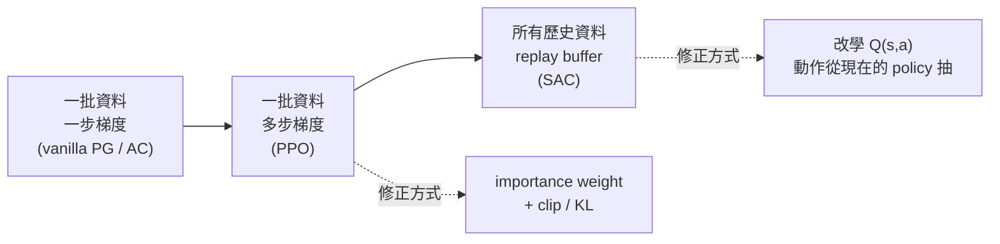

> 🌏 [English version](/posts/ai/2026-09-30-cs224r-off-policy-actor-critic-ppo-sac-en)

**影片狀態：僅附相關補充影片；原講次錄影未確認。** [影片來源與說明](#課程影片來源)

**本文依據 [CS224R](https://cs224r.stanford.edu/) Spring 2026 版。** 這是 [Stanford CS224R 導讀](/posts/ai/2026-09-30-cs224r-course-overview)系列第 6 篇，接續 [L4 Actor-Critic](/posts/ai/2026-09-30-cs224r-actor-critic)，對應 2026 年 4 月 15 日的第 5 講「Off-Policy Actor Critic Methods」。

用到的官方材料有兩份：當期投影片 [05_cs224r_offpolicy_actor_critic_2026.pdf](https://cs224r.stanford.edu/slides/05_cs224r_offpolicy_actor_critic_2026.pdf)（32 頁），以及課表上這一講的指定閱讀 [Mnih et al. 2013（DQN）](https://arxiv.org/abs/1312.5602)。PPO 原論文 [Schulman et al. 2017](https://arxiv.org/abs/1707.06347) 在課表上掛在前一講 L4 的閱讀清單，這講才正式展開。存取等級是 **A3**：投影片匿名可下載，2026 錄影只放在 Canvas。

配套影片是 [Spring 2025 Lecture 5: Off-Policy Actor Critic](https://www.youtube.com/watch?v=cRGKc-nAWho)（約 69 分鐘），屬於**補充教材**：標題相同，但投影片已換成 2026 版，細節可能不一樣。以下內容以 2026 投影片為準。

## 課程影片來源

本文以 Spring 2026 教材為準；下列 Spring 2025 公開錄影是補充教材，講次與內容可能有出入。

```youtube
url: https://www.youtube.com/watch?v=cRGKc-nAWho
title: Spring 2025 Lecture 5: Off-Policy Actor Critic（YouTube，補充）
```

原始影片：[Spring 2025 Lecture 5: Off-Policy Actor Critic（YouTube，補充）](https://www.youtube.com/watch?v=cRGKc-nAWho)

內容核對：已依字幕核對（2026-10-10）：抽樣讀取 Spring 2025 L5 Off-Policy Actor Critic 的字幕（前／中／後段加關鍵字搜尋，非逐字比對），確認影片確實是這一講、講者為 Chelsea Finn、主題與本文相符。字幕談到 replay buffer、importance weight 與 clip（PPO 的核心想法）、SAC，與本文主題相符。本文敘述以 2026 投影片為準，影片只當補充。

課程與錄影入口：

- [CS224R Spring 2025 YouTube 播放清單](https://www.youtube.com/playlist?list=PLoROMvodv4rPwxE0ONYRa_itZFdaKCylL)
- [官方課程／講次來源](https://cs224r.stanford.edu/)

Spring 2026 當季講次錄影放在需 Stanford 登入的 Canvas／Panopto；公開 YouTube 播放清單是 Spring 2025。 查核日期：2026-10-10。

## 場景：資料很貴，但每批只用一次

先回想 L3、L4 的做法。跑 policy 收一批軌跡，算一次梯度，更新一次，然後把這批資料丟掉。投影片第 15 頁把這叫做「fully on-policy」。

在模擬器裡這只是慢。換到真實機器人，每條軌跡都是馬達磨損和人力時間。這一講的問題很直接：**同一批資料能不能多用幾次？更進一步，過去所有的試錯資料能不能都拿來用？**

投影片第 7 頁的今日大綱分三段：

1. 對同一批資料走多步梯度：importance weight、用 KL 懲罰或 clip 限制步伐、實務上的 PPO
2. 更 off-policy 的做法：用別的 policy 收的資料擬合 Q 函數、實務上的 SAC
3. PPO、SAC 與模仿學習的比較

學習目標只有一句：掌握 PPO 和 SAC 這類實用演算法背後的所有關鍵概念。

## 直覺：重用資料有兩條路

整講可以壓成一張圖。資料越「舊」，越需要修正：



**第一條路（PPO）**：資料還是新收的，只是多走幾步梯度。第二步開始，policy 已經不是收資料的那個了，所以要用 importance weight 修正。修正後還得限制新 policy 不要跑太遠，因為 advantage 是用舊 policy 估的。

**第二條路（SAC）**：乾脆保留所有舊資料。這時連「這個狀態值多少」都得換一種學法，因為 V(s) 會默默學成過去那些 policy 的平均值。投影片的解法是改學 Q(s, a)，把動作當輸入。

## 機制一：多步梯度與 PPO

### 多步更新哪裡會出錯

投影片第 8–10 頁先寫出「Version 1」：照 L4 的 actor-critic 流程收資料、擬合 V、算 advantage，但在第 4 步的梯度裡乘上 importance weight π_θ'(a|s) / π_θ(a|s)，然後對同一批資料反覆更新。

第 10 頁點出問題。看 surrogate objective 就知道，新 policy 會拚命提高高 advantage 動作的機率。走的步數一多，policy 就有動機和舊 policy 差得很遠，**很容易 overfit**。advantage 是在舊 policy 下估的，離舊 policy 越遠，這個估計越不可信。

第 11 頁給了兩個解法：

- **Idea 1：加 KL 限制**，懲罰新舊 policy 在舊 policy 狀態分佈上的 KL 散度。投影片註明這「非常常見」，之後講 LLM 偏好最佳化時還會再看到。
- **Idea 2：限制 importance weight 的範圍**。它不直接限制 policy，而是拿掉 policy 跑遠的誘因。這就是 PPO 的關鍵想法。

### PPO 的三個技巧

第 12–13 頁把 PPO 拆成三個技巧：

1. **Clip importance weight**：把比值夾在 [1−ε, 1+ε]，超出範圍就沒有梯度，policy 不再有動機大幅偏離。
2. **和原本的目標取 min**：處理少數 clip 反而讓目標變好的情況。取 min 之後就是最終的 PPO surrogate objective。
3. **GAE（Generalized Advantage Estimation）**：先用 Monte Carlo 或 bootstrap 擬合 V，再把不同 horizon 的 n 步 advantage 估計加權平均，權重 w_n ∝ λ^(n−1)。n 越早截斷，變異越小。

<details>
<summary>PPO surrogate objective 與 GAE 的式子（投影片第 12–13 頁）</summary>

記 ρ = π_θ'(a_{t,i}|s_{t,i}) / π_θ(a_{t,i}|s_{t,i})，Â 是用舊 policy π_θ 估的 advantage：

```
J̃(θ') ≈ Σ_{t,i} min( ρ · Â , clip(ρ, 1−ε, 1+ε) · Â )
```

n 步 advantage 與 GAE：

```
Â_n(s_t, a_t)   = Σ_{t'=t}^{t+n} γ^{t'−t} r(s_{t'}, a_{t'}) − V̂(s_t) + γ^n V̂(s_{t+n})
Â_GAE(s_t, a_t) = Σ_{n=1}^{∞} w_n · Â_n(s_t, a_t),   w_n ∝ λ^{n−1}
```

投影片在 GAE 旁邊放了一張梗圖，標註「from one of the GAE authors」，圖上寫著「I made it up」。意思大概是：權重怎麼選，本來就是工程上的選擇。

</details>

第 14 頁把整套流程寫成四步：收一批資料、擬合 V、算 advantage、對 surrogate objective 走 M 步梯度。旁邊附了一組**範例超參數**：每批約 2000 個 timestep、每次更新約 10 個 epoch（批次大小 64 時約 M=300 步）、clip 範圍 ε=0.2、約 500 次迭代，總共約 100 萬個 timestep。

**怎麼做**：讀 PPO 程式碼時，先找這四個數字：每批收多少步、每批跑幾個 epoch、minibatch 多大、ε 是多少。它們決定了「同一批資料被用了幾次」。

## 機制二：replay buffer 與 Q 擬合

### 把 V 擬合在 buffer 上，演算法就壞了

第 15 頁問：能不能更 off-policy，把過去所有批次的資料都拿來用？兩個關鍵想法是維護一個存下所有資料的 **replay buffer**，以及修改式子、拿掉 on-policy 假設。

第 17 頁直接說「The algorithm is currently broken」。如果在整個 buffer 上擬合 V(s)，它學到的是哪個 policy 的價值？答案是過去各種 policy 混在一起的價值，而不是現在的 π_θ。

### 改學 Q(s, a)

第 18–19 頁的解法是改學 Q(s, a)。V(s) 的目標值取決於過去 policy 選的動作；Q(s, a) 把動作當輸入，就算資料裡的 a 跟現在的 policy 會選的不太一樣也沒關係。

做法是：從 buffer 抽 (s, a, s')，**從現在的 policy 抽下一步動作 ā'**，用 r + γQ(s', ā') 當目標值。投影片特別註明，要讓目標值準確，資料需要涵蓋足夠多樣的動作。

第 21–23 頁把完整的 online actor-critic 寫成五步：取動作存進 buffer、抽 batch、用上面的目標更新 Q、算 actor 梯度、更新 θ。這裡還有兩個細節：

- **直接用 Q 取代 advantage**，不減 baseline。變異比較大，但現在用的是 buffer 裡的大量資料，可以接受。
- **actor 梯度裡的動作也從現在的 policy 抽**，不用 buffer 裡的舊動作，因為現在的 policy 選的動作通常比過去好。

第 22 頁承認還有一個問題：buffer 裡的狀態 s_i 不是從現在 policy 的狀態分佈來的。投影片的回答是「沒辦法，接受它」。直覺上，我們想要的是在 p_θ(s) 上最優的 policy，得到的是在更寬的分佈上最優的 policy。

第 23 頁補上實作細節：Gaussian policy 可以用 reparameterization trick 更準確地估梯度；更講究的 Q 擬合方法留到接下來兩講。範例演算法是 [Soft Actor-Critic（Haarnoja et al. 2018）](https://arxiv.org/abs/1801.01290)。投影片沒有展開 SAC 的最大熵目標，只把它當作這套骨架的實務版本；要看完整推導得讀原論文。

## 連回來：PPO、SAC、模仿學習怎麼選

第 24 頁一句話總結取捨：有 replay buffer 的 off-policy 方法（例如 SAC）資料效率可以高很多，但通常更難調超參數、也比 PPO 不穩。

第 25–28 頁各舉兩個例子：

| 路線 | 投影片的例子 | 出處 |
|---|---|---|
| 完全 off-policy，省到能在真實世界跑 | 用 SAC 從零學走路，不到 2 小時 | [Haarnoja et al. 2018, SAC Algorithms and Applications](https://arxiv.org/abs/1812.05905) |
| | 以 SAC 為基礎、用示範當種子的精密組裝，比模仿學習更好更快 | [Luo et al. 2024, HIL-SERL](https://arxiv.org/abs/2410.21845) |
| PPO，穩但沒那麼省 | 在模擬器用 PPO 學走路，再搬到真實四足機器人 | [Tan et al. 2018](https://arxiv.org/abs/1804.10332) |
| | 在模擬器學轉魔術方塊，再搬到真實機械手；投影片註明機器人操作的 sim-to-real 通常難得多 | OpenAI 2019 |

第 29 頁補一句：語言模型的 RL 也常用 PPO，下週講 reward modeling 時會開始談。

第 30 頁是這講最實用的一頁，我整理成表：

| | PPO | SAC（及 RLPD、EXPO 等新方法） |
|---|---|---|
| 資料 | 偏 on-policy：對一批 rollout 走多步梯度，再重收 | 偏 off-policy：用 replay buffer 存過去經驗 |
| 主要優點 | 穩定，比較「隨插即用」 | 資料效率 |
| 主要缺點 | 資料效率差 | 比較不穩，常要更多調參 |
| Markov 性質 | 若用 Monte Carlo 價值函數，可以不依賴 | 高度依賴 |
| 有示範資料時 | 用示範初始化 policy 權重 | 把示範加進 replay buffer |

投影片說兩條路都**適合先用模仿學習或示範資料當起點**。這正是接下來 [HW2](/posts/ai/2026-09-30-cs224r-hw2-online-rl-sawyer) 的設計：PPO 和 off-policy actor-critic 都先做 BC 預訓練，再比較兩者的學習曲線。

**怎麼做**：下次選演算法前，先回答兩個問題：收一條軌跡要花多少錢？你有沒有時間調參？收資料便宜、想要穩，先試 PPO；收資料貴、能接受調參，先試 SAC 系列。

## 延伸：這講沒講的

- **Q-learning 的完整做法**：投影片最後一頁預告下一講是「最後一個大型 online RL 方法」Q-learning，以及它的實作。第 23 頁說的「更講究的 Q 擬合方法」也在那裡。見[下一篇](/posts/ai/2026-09-30-cs224r-q-learning)。
- **SAC 的最大熵推導**：投影片只給論文名稱，本文也不補寫。
- **PPO 在 LLM 上的用法**：站上 [CS336 的 SFT 與 RLHF 導讀](/posts/ai/2026-08-22-cs336-sft-rlhf)和 [CME295 的 RL with LLMs](/posts/ai/2026-09-29-cme295-rl-with-llms) 從語言模型的角度講同一套 clip 目標。
- **對照另一門課**：[Berkeley CS285 的 policy 與 value 方法導讀](/posts/learning/2026-08-22-berkeley-cs285-policy-value-methods)。CS224R 第 16–23 頁有幾頁註明「Slide adapted from Sergey Levine」，兩門課在這段的講法很接近。

## 這一篇可以確認與不能確認的

可以確認：2026 投影片的文字與公式、課表日期與閱讀清單、2025 影片的標題與長度。不能確認：2026 課堂上的口頭補充（錄影只在 Canvas），以及投影片第 25–28 頁影片示範的具體內容（PDF 只有截圖和出處）。第 14 頁的超參數是投影片上的範例，不是 HW2 的設定；HW2 的實際設定見作業那篇。

系列導覽：上一篇 [L4 Actor-Critic](/posts/ai/2026-09-30-cs224r-actor-critic)｜下一篇 [L6 Q-learning 與它的穩定化](/posts/ai/2026-09-30-cs224r-q-learning)｜[系列入口](/posts/ai/2026-09-30-cs224r-course-overview)

## 更新紀錄

- 2026-10-10：標註影片狀態，核對錄影來源與取得方式。
- 2026-10-10：重查影片狀態。嵌入的影片屬於較早學期的公開錄影，不是 2026 當季課程，狀態改為相關補充影片。
- 2026-10-10：依字幕核對影片內容。影片是 Spring 2025 L5，主題相符（約 69 分鐘亦相符），沒有需修正之處。

## 參考資料

- [CS224R: Deep Reinforcement Learning（Spring 2026 課程官網與課表）](https://cs224r.stanford.edu/)
- [Lecture 5 投影片：Off-Policy Actor Critic Methods（2026）](https://cs224r.stanford.edu/slides/05_cs224r_offpolicy_actor_critic_2026.pdf)
- [Spring 2025 Lecture 5: Off-Policy Actor Critic（YouTube，補充）](https://www.youtube.com/watch?v=cRGKc-nAWho)
- [CS224R Spring 2025 YouTube 播放清單](https://www.youtube.com/playlist?list=PLoROMvodv4rPwxE0ONYRa_itZFdaKCylL)
- [Schulman et al. 2017：Proximal Policy Optimization Algorithms](https://arxiv.org/abs/1707.06347)
- [Schulman et al. 2016：High-Dimensional Continuous Control Using Generalized Advantage Estimation](https://arxiv.org/abs/1506.02438)
- [Haarnoja et al. 2018：Soft Actor-Critic: Off-Policy Maximum Entropy Deep RL with a Stochastic Actor](https://arxiv.org/abs/1801.01290)
- [Haarnoja et al. 2018：Soft Actor-Critic Algorithms and Applications](https://arxiv.org/abs/1812.05905)
- [Mnih et al. 2013：Playing Atari with Deep Reinforcement Learning](https://arxiv.org/abs/1312.5602)
- [Luo et al. 2024：Precise and Dexterous Robotic Manipulation via Human-in-the-Loop RL（HIL-SERL）](https://arxiv.org/abs/2410.21845)
- [Tan et al. 2018：Sim-to-Real: Learning Agile Locomotion For Quadruped Robots](https://arxiv.org/abs/1804.10332)
