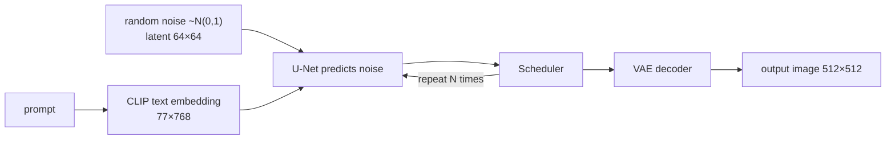

> 🌏 [中文版](/posts/ai/2026-09-30-nccu-genai-10-vae-to-diffusion)

**Video status: Videos included; playback has not been rechecked individually.** [Source details](#course-video-sources)

**This guide covers semester 1132 (spring 2025) of Yen-Lung Tsai's NCCU course *Generative AI: Text and Image Synthesis Principles and Practice*.** It is part 10 of the [Reading NCCU Yen-Lung Tsai Generative AI](/posts/ai/2026-09-30-nccu-genai-course-overview-en) series and follows [L09 on AI agents](/posts/ai/2026-09-30-nccu-genai-09-ai-agents-en). From here on, the course turns from text generation to images.

It draws on four official sources: [video 10](https://www.youtube.com/watch?v=j4-k7Ug4bYk) (2025-04-22, about 2 h 54 min), the 78-page GenAI10 slides in the instructor's [slide folder](https://drive.google.com/drive/folders/1c6A9Pa-c7cNi5kHUp7j-ccgYBRy9JpeA), the [AI-Demo](https://github.com/yenlung/AI-Demo) notebook [`【Demo08】用diffusers套件生成圖像`](https://yenlung.me/AI08), and the week 10 homework on the [Chang Gung satellite course page](https://yangchihyuan.github.io/courses/GenerativeAI2025) (in Mandarin). Access level: **A3**. Demo08 was last committed on 2025-04-28. **What follows quotes the current repo version.**

## Course video sources

These course video sources were already documented in this article. Playback has not been reverified for each video; no timestamp is supplied.

```youtube
url: https://www.youtube.com/watch?v=j4-k7Ug4bYk
title: 【生成式 AI】10.變分自編碼器 (VAE) 開始的冒險旅程（YouTube 錄影）
```

Original videos: [【生成式 AI】10.變分自編碼器 (VAE) 開始的冒險旅程（YouTube 錄影）](https://www.youtube.com/watch?v=j4-k7Ug4bYk)

Course and recording entries:

- [Official course and recording entry](https://yangchihyuan.github.io/courses/GenerativeAI2025)

## Where this week sits in the course

The slides have six parts: embeddings, the autoencoder, the VAE, the sudden arrival of diffusion models, how diffusion works, and latent diffusion models. The video timeline lines up roughly like this:

| Time | Content |
|---|---|
| 5:57–23:31 | Starting from embeddings: pretext tasks, Word2Vec |
| 23:31–42:34 | Autoencoders, VAEs, deepfakes |
| 42:34–52:17 | The diffusion image era, preview of the week 10 homework |
| 1:02:31–1:12:34 | Style prompt examples and homework briefing |
| 1:14:25–1:52:54 | How diffusion works, latent diffusion, the Stable Diffusion diagram |
| from 2:02:23 | TA session |

The arc: first answer "what makes a good feature vector?", then build step by step to today's text-to-image models. The title says "starting with the VAE" because the VAE turns out to be a part Stable Diffusion cannot run without. The next lecture, [L11](/posts/ai/2026-09-30-nccu-genai-11-text-to-image-en), fills in CLIP, schedulers and LoRA.

## Idea 1: the feature vector we want for every input

Slide 3 restates the course's refrain: every AI today is a **naive AI robot** (呆萌型 AI 機器人), a function-learning machine fθ that knows what the input is and what the output should look like.

Slides 4–6 name a task everyone wants but finds awkward: **finding a feature vector for an input**, also called an embedding or latent vector. Images, text, audio, data, people: any input might need one. The catch is that nobody knows what the "right" feature vector is, so there is no training data for it.

The way out has two steps:

1. **Every layer of a network is some kind of "understanding"** (slides 7–9). Each layer turns its input into another tensor, and one layer's output is the next layer's input.
2. **Design a pretext task** (slides 10–11). Pick a small task that can only be solved if the computer "understands the meaning". It isn't the real goal; it exists to train good representations. Once trained, the front part of the model is called the encoder, and its output is the latent vector.

Slides 12–14 use [Word2Vec](https://arxiv.org/abs/1301.3781)'s two small tasks as examples:

- **CBOW:** predict the middle word from the words around it.
- **Skip-Gram:** predict the surrounding words from the middle word.

Some hidden layer's output is the word embedding. Slide 15 adds that [L04](/posts/ai/2026-09-30-nccu-genai-04-llm-next-token-en)'s "predict the next word" is also a pretext task, and an RNN's "memory so far", ht, can be read as an embedding.

**Try this:** pick data you know well, such as product reviews, and write down a small task that only works if you understand the data. That is practice at designing a pretext task.

## Idea 2: where a generator's input comes from

Slide 16 flips the picture: a generator takes a latent vector z and produces an image, photo or text. Slides 17–18 give two sources for z:

- **Method 1: feed in random numbers** and only guarantee the output has the "right format". [L03's GAN](/posts/ai/2026-09-30-nccu-genai-03-gan-en) usually does this.
- **Method 2: build a "good" feature vector first**, computed by an encoder.

Method 2 sounds like magic: how do you train a function that extracts feature vectors? The answer is the autoencoder.

## Idea 3: the autoencoder and its limits

Slides 20–22: an autoencoder is **a function that outputs whatever you put in**. That sounds pointless until you notice the narrower layer in the middle (the slide writes m >> k). To reproduce its input, the network has to cram the important information into those k dimensions. So a small z can stand in for a large x, and there's your feature vector.

Slide 23 points to the other half: the decoder is a generator. Give it a feature vector and it produces an image. Then the question: if you have a rabbit's feature vector and nudge it slightly, do you get a similar rabbit?

Slides 24–25 answer **not really**. Two latent vectors that are close together can decode to unrelated things. In the slide's plain words: "z is basically random noise, and we can't control it."

## Idea 4: the VAE makes the latent controllable

Slides 27–29 bring in the **VAE (variational autoencoder)** to fix this. It adds a twist right after the encoder:

- Ask each element of the latent vector to follow a normal distribution, which makes it easier to control.
- So the encoder now learns a **mean μ and a variance (or standard deviation) σ** for each number, and noise is added at that layer.

The model learns a distribution instead of a single point. Nearby points are trained to decode into sensible images too, which makes the latent space continuous and easy to work with.

Slides 30–31 explain deepfakes along the way: train two autoencoders, A and B, then encode with encoder A and decode with decoder B.

Slide 32 gives an "epilogue up front": people felt autoencoders lacked variety and quality, so GANs dominated generation for a while. Then the world changed again.

## Idea 5: the diffusion era arrives

Slide 34 says that from 2022, suddenly everyone was making art on computers, and lists DALL·E 2, Stable Diffusion and Midjourney. Slide 36 updates this to 2025: Bing Create, SDXL and Midjourney.

The slides sort tools into two groups:

- **Paid:** Midjourney and Leonardo.Ai (slide 38).
- **Free, in the cloud:** [Bing Create](https://www.bing.com/images/create) (slide 39). The example prompt asks for a photo of a few Taiwanese college students discussing something over a laptop in a café.

Slides 40–44 show style prompts, each built as "style phrase + description in Mandarin": whimsical watercolor illustration (a cute little witch casting a spell), claymation (a panda in glasses on a MacBook), 3D animation in Pixar style (a robot painting a watercolor), simple 2D vector art (a girl on her laptop in a café). The last one is a "David Shrigley style that looks nothing like it", a reminder that style words don't always work the way you expect.

Slides 46–47 preview open-source tools. Stable Diffusion runs through the [diffusers](https://huggingface.co/docs/diffusers/index) package or AUTOMATIC1111, and the course will later introduce the simpler Fooocus (see [L12](/posts/ai/2026-09-30-nccu-genai-12-controlnet-fooocus-en)).

## Idea 6: diffusion is basically an autoencoder

This is the lecture's best turn. Slides 49–50 give the history. The idea goes back to 2015 ([Sohl-Dickstein et al.](https://arxiv.org/abs/1503.03585)), but the paper that mattered was OpenAI's 2021 [Diffusion Models Beat GANs on Image Synthesis](https://arxiv.org/abs/2105.05233).

Slides 51–53 return to the autoencoder and borrow a lesson from [L04](/posts/ai/2026-09-30-nccu-genai-04-llm-next-token-en)'s "GPT the bluffer": maybe if a model sees enough, it gets good at "creating". Then the punchline: **a diffusion model is basically an autoencoder, except the encoder is computed.**

Broken down:

1. **The encoder is computed** (slides 54–58). Add Gaussian noise to the image x0 a little at a time, the same way at each step, until you reach xT. By the end, every point looks like a sample from a normal distribution. That kind of latent tensor is easy to generate, and it should correspond to an image.
2. **The decoder is learned by a neural network** (slides 59–62). Train fθ to recover x0 from xT. Why not compute the decoder too? Because this is really a regression problem, just a much harder one: the input is messier, and nobody knows what form the target function takes.
3. **Undo it step by step, and learn only the noise** (slides 63–67). Recovery should also go step by step. The good news is that having a network εθ predict just the added noise is easier. Predict the noise, subtract it, and the image appears. In practice the denoising repeats many times.

<details>
<summary>The noising formulas on slides 55 and 57</summary>

One noising step:

$$x_t = \sqrt{\alpha_t}\,x_{t-1} + \sqrt{1-\alpha_t}\,\varepsilon_{t-1},\quad \alpha_t = 1-\beta_t$$

βt is a small number, usually chosen so that β1 < β2 < ⋯ < βT.

"A small trick": you don't need to step through every x. Let $\overline{\alpha}_t = \prod_{i=1}^{t}\alpha_i$; then

$$x_t = \sqrt{\overline{\alpha}_t}\,x_0 + \sqrt{1-\overline{\alpha}_t}\,\varepsilon$$

That's why the slides say the encoder "doesn't need to be learned": given x0 and t, you can compute xt directly, apart from sampling the noise.

</details>

## Idea 7: latent diffusion, and the VAE returns

Slide 69 names the Stable Diffusion paper: [Rombach et al. 2022, High-Resolution Image Synthesis with Latent Diffusion Models](https://arxiv.org/abs/2112.10752).

Slides 70–72: first train a VAE; the diffusion model then works only on the latent vector in the middle. Standard Stable Diffusion shrinks a 512×512 image by 8× to 64×64. Models that use a VAE this way are called **LDMs (latent diffusion models)**. Slide 72 is blunt: "Stop saying things like 'use a VAE to improve output quality'. Without the VAE, Stable Diffusion doesn't run at all!" Slide 73 adds that you can swap out the default VAE; Stable Diffusion offers three versions: default, EMA and MSE.

How does the text get in? Slides 74–76: a transformer that is good with text turns the prompt into a feature tensor y, which is then "merged" into the random noise. The slides note that "add" here isn't necessarily literal addition. The standard approach uses transformer attention, with **Q coming from the latent and K and V from the text**.

Slide 77 is the summary diagram for the whole lecture:



CLIP, the U-Net and the scheduler are the three boxes [L11](/posts/ai/2026-09-30-nccu-genai-11-text-to-image-en) takes apart one by one.

**Try this:** walk through this diagram out loud, explaining how an image comes out of noise. Wherever you stumble is the first thing to fill in from L11.

## This week's demo notebook: Demo08

Slide 46 mentions diffusers, and the matching notebook is Demo08 (its short link [yenlung.me/AI08](https://yenlung.me/AI08) appears on GenAI11 slide 56). Going by the video timeline, **the line-by-line walkthrough happens in video 11, from 1:25:34**. Every idea it uses comes from this lecture, though, so it reads best here.

The current repo version runs like this:

1. Install `diffusers`, `transformers`, `accelerate`, `safetensors`, `huggingface_hub` and `gradio`.
2. Load `digiplay/majicMIX_realistic_v6` (a photorealistic SD 1.5-family model) in `torch.float16` onto the GPU.
3. Fix the random seed (the notebook uses `N = 31327`) and generate a first image at 512×768, 50 steps, guidance scale 7.5. The prompt is "a Taiwanese college student using her laptops in a cafe."
4. Add a long negative prompt, then append boosters such as "masterpiece, ultra high quality…" to the prompt, reusing the same seed each time to compare.
5. Swap the scheduler for `UniPCMultistepScheduler` and cut the steps to 20.

Resetting the same seed before every run is the habit most worth copying. Change one variable at a time, and you can see what that variable does.

## Homework: week 10 (Chang Gung satellite version)

The task on slide 45: use Microsoft Bing Create, find a style you like, draw several images on different subjects in that style, and explain how you found the style.

The Chang Gung page adds (written during semester 1132; quotas may have changed since): each Bing account gets 15 fast generations a day, each producing 4 images. After that, generation stays free but is much slower. You may submit a Colab link or a PDF. The 1132 deadline was 2025-05-05.

**Submit:** the style you used, plus several style-consistent sets. Each set is one input prompt plus your favorite of the four images.

**Rubric** (out of 10): identical to the instructor's prompt, 2; images only, 4; three sets, 6; four or more sets meeting the requirements, 7–10 depending on creativity. Missing items or an inconsistent style lose points. Anywhere you used generative AI, attach the prompt and output screenshots, or it counts as copying from AI.

**Self-grading for readers:** what this homework really trains is control. A strong submission keeps the style phrase fixed, changes only the subject, and notes which words made the style drift when swapped. That lines up with Demo08's "one variable at a time" habit. Submissions go through each school's LMS, so outside readers can only grade themselves against this rubric.

## Self-check

- Explain what a pretext task is, and what CBOW and Skip-Gram each predict.
- Say why an autoencoder needs a narrower layer in the middle.
- Name the problem with using a plain autoencoder as a generator, and how a VAE fixes it.
- Explain diffusion as "computed encoder, learned decoder".
- Say why learning the noise is easier than learning to recover the image directly.
- Point to the VAE on the Stable Diffusion diagram and say what it does.

## Further reading

This guide stands on its own. To go deeper, the site has these:

- The math of diffusion and flow matching: [MIT 6.S184 guide](/posts/ai/2026-09-30-mit-6s184-flow-matching-diffusion-overview-en)
- A systematic look at visual generative models: [Stanford CS231N guide](/posts/ai/2026-09-30-cs231n-course-overview-en)
- Neural network foundations: [CMU 11-785 guide](/posts/ai/2026-08-22-cmu-11785-course-overview-en)
- The course landscape and access levels: [Global AI/CS course map](/posts/learning/2026-08-21-global-ai-cs-course-map-en)

Previous: [L09 Why 2025 was called the year of AI agents](/posts/ai/2026-09-30-nccu-genai-09-ai-agents-en) | Next: [L11 Text-to-image AI: principles and practice](/posts/ai/2026-09-30-nccu-genai-11-text-to-image-en) | [Series overview](/posts/ai/2026-09-30-nccu-genai-course-overview-en)

## Update Log

- 2026-10-10: Added explicit video status and checked recording sources and access notes.

## References

- [Generative AI 10: The adventure that starts with the VAE (YouTube, in Mandarin)](https://www.youtube.com/watch?v=j4-k7Ug4bYk)
- [Yen-Lung Tsai's 1132 Generative AI slide folder (GenAI10, in Mandarin)](https://drive.google.com/drive/folders/1c6A9Pa-c7cNi5kHUp7j-ccgYBRy9JpeA)
- [1132 lecture playlist (in Mandarin)](https://www.youtube.com/playlist?list=PL-eaXJVCzwbukEFU2k5vu_BlUqgVLsEnv)
- [Chang Gung satellite course page: Generative AI 2025 (in Mandarin)](https://yangchihyuan.github.io/courses/GenerativeAI2025)
- [yenlung/AI-Demo: Demo08, generating images with diffusers](https://github.com/yenlung/AI-Demo/blob/master/%E3%80%90Demo08%E3%80%91%E7%94%A8diffusers%E5%A5%97%E4%BB%B6%E7%94%9F%E6%88%90%E5%9C%96%E5%83%8F.ipynb)
- [Mikolov et al. (2013). Efficient Estimation of Word Representations in Vector Space. arXiv:1301.3781](https://arxiv.org/abs/1301.3781)
- [Sohl-Dickstein et al. (2015). Deep Unsupervised Learning using Nonequilibrium Thermodynamics. arXiv:1503.03585](https://arxiv.org/abs/1503.03585)
- [Dhariwal & Nichol (2021). Diffusion Models Beat GANs on Image Synthesis. arXiv:2105.05233](https://arxiv.org/abs/2105.05233)
- [Rombach et al. (2022). High-Resolution Image Synthesis with Latent Diffusion Models. arXiv:2112.10752](https://arxiv.org/abs/2112.10752)
- [Hugging Face diffusers documentation](https://huggingface.co/docs/diffusers/index)
- [Microsoft Bing Image Creator](https://www.bing.com/images/create)
