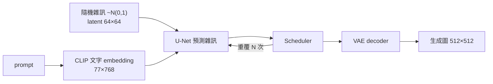

> 🌏 [English version](/posts/ai/2026-09-30-nccu-genai-10-vae-to-diffusion-en)

**影片狀態：已附影片；播放未逐支確認。** [影片來源與說明](#課程影片來源)

**本文依據政大蔡炎龍《生成式 AI：文字與圖像生成的原理與實務》1132 學期（2025 春季）。** 這是[政大蔡炎龍 生成式AI 導讀](/posts/ai/2026-09-30-nccu-genai-course-overview)系列第 10 篇，接在 [L09 AI Agents](/posts/ai/2026-09-30-nccu-genai-09-ai-agents)之後。課程從這一講開始，由文字生成轉向圖像生成。

用到的官方材料有四份：[錄影 10](https://www.youtube.com/watch?v=j4-k7Ug4bYk)（2025-04-22，約 2 小時 54 分）、投影片 GenAI10（78 頁，在主講者的[投影片資料夾](https://drive.google.com/drive/folders/1c6A9Pa-c7cNi5kHUp7j-ccgYBRy9JpeA)）、[AI-Demo](https://github.com/yenlung/AI-Demo) repo 的 [`【Demo08】用diffusers套件生成圖像`](https://yenlung.me/AI08)，以及[長庚衛星班課程頁](https://yangchihyuan.github.io/courses/GenerativeAI2025)的第十週作業。存取等級是 **A3**。Demo08 在 GitHub 上最近一次 commit 是 2025-04-28，**以下引用的是 repo 目前版本**。

## 課程影片來源

以下沿用本文已列出的課程影片來源；尚未逐支重新驗證可播放狀態，不提供時間跳轉。

```youtube
url: https://www.youtube.com/watch?v=j4-k7Ug4bYk
title: 【生成式 AI】10.變分自編碼器 (VAE) 開始的冒險旅程（YouTube 錄影）
```

原始影片：[【生成式 AI】10.變分自編碼器 (VAE) 開始的冒險旅程（YouTube 錄影）](https://www.youtube.com/watch?v=j4-k7Ug4bYk)

課程與錄影入口：

- [官方課程與錄影入口](https://yangchihyuan.github.io/courses/GenerativeAI2025)

## 本週在課程中的位置

投影片分六段：Embeddings、自編碼器 Autoencoder、變分自編碼器 VAE、橫空出世的 Diffusion Models、Diffusion Models 原理、Latent Diffusion Models。錄影的時間軸大致對應：

| 時間 | 內容 |
|---|---|
| 5:57–23:31 | 從 embeddings 說起：代理任務、Word2Vec |
| 23:31–42:34 | Autoencoder、VAE、Deepfake |
| 42:34–52:17 | Diffusion 生圖的時代、第十週作業預告 |
| 1:02:31–1:12:34 | 風格 prompt 範例與作業說明 |
| 1:14:25–1:52:54 | Diffusion 原理、Latent Diffusion、Stable Diffusion 架構圖 |
| 2:02:23 起 | 助教時間 |

這一講的弧線是：先回答「什麼是好的特徵向量」，再一步步推到今天的文字生圖。標題說「從 VAE 開始」，是因為 VAE 正是 Stable Diffusion 裡不可少的一塊。下一講 [L11](/posts/ai/2026-09-30-nccu-genai-11-text-to-image) 再把 CLIP、排程器與 LoRA 補齊。

## 核心概念一：我們想要輸入的「特徵代表向量」

投影片第 3 頁先重申整門課的基調：當前所有的 AI 都只是一個**呆萌型 AI 機器人**，是一個函數學習機 fθ，知道輸入是什麼、輸出長什麼樣子。

第 4–6 頁提出一個大家很想要、卻有點困擾的任務：**找出輸入的特徵代表向量**，也叫 embedding 或 latent vector。圖、文字、聲音、數據、人物，所有可能的輸入都可能需要。困擾在於：我們根本不知道什麼才是「適當的」特徵向量，也就準備不出訓練資料。

解法分兩步：

1. **神經網路的每一層都是某種「理解」**（第 7–9 頁）。每層把輸入轉成另一個 tensor，上一層的輸出是下一層的輸入。
2. **設計代理任務（pretext task）**（第 10–11 頁）。找一個小任務，要「懂得文字的意思」才做得到。這不是最終目標，只是為了訓練出好的表示向量。訓練好之後，前面那段模型就叫 encoder，它的輸出就是 latent vector。

第 12–14 頁用 [Word2Vec](https://arxiv.org/abs/1301.3781) 的兩個小任務舉例：

- **CBOW**：用周圍的字預測中間的字。
- **Skip-Gram**：用中間的字預測周圍的字。

某個隱藏層的輸出就是字的 embedding。第 15 頁再補一句：[L04](/posts/ai/2026-09-30-nccu-genai-04-llm-next-token) 的「前一個字預測下一個字」其實也是代理任務，RNN 裡那個「之前的記憶」ht 可以看成一個 embedding。

**怎麼做**：想一個你熟悉的資料（例如商品評論），寫下一個「要懂這筆資料才做得到」的小任務。這就是設計代理任務的練習。

## 核心概念二：生成模型的輸入從哪來

第 16 頁把生成器畫成反方向：輸入一個 latent vector z，生出圖、照片或文字。第 17–18 頁說 z 有兩種來源：

- **方法一：隨機輸入一堆數字**，只保證生出「正確格式」的東西。[L03 的 GAN](/posts/ai/2026-09-30-nccu-genai-03-gan) 最常用這個方法。
- **方法二：先想辦法做一個「好的」特徵向量**，也就是用 encoder 算出來。

方法二聽起來很神奇：要怎麼訓練一個「截取特徵向量」的函數？答案就是 Autoencoder。

## 核心概念三：Autoencoder 與它的限制

第 20–22 頁：Autoencoder 是**輸入什麼就輸出什麼**的函數。聽起來很怪，關鍵在中間放一層維度較小的神經元（投影片寫成 m >> k）。為了讓輸出還原輸入，網路被迫把重要資訊壓進這 k 維裡。於是較小的 z 可以取代較大的 x，特徵向量就這麼找出來了。

第 23 頁指出另一半的用途：decoder 就是生成器。給它一個特徵向量，它就生出一張圖。問題來了：假設有一隻兔子的特徵向量，改一點點，會不會生出一隻很像的兔子？

第 24–25 頁的答案是**不太行**。隨便取兩個數學上距離很近的 latent vector，生出來的東西不一定有關係。投影片的白話是：「z 差不多就是亂數，我們無以掌控。」

## 核心概念四：VAE 讓 latent 可以掌控

第 27–29 頁介紹改善這個問題的 **VAE（Variational AutoEncoder）**。做法是在 encoder 後面動點手腳：

- 希望 latent vector 的每個元素都符合某個常態分布，這樣比較容易掌控。
- 所以 encoder 改成學每個數的**平均值 μ 和變異數（或標準差）σ**，這一層其實還加了 noise。

換句話說，函數學習機學的不再是一個點，而是一個分布。鄰近的點都被訓練成「也能還原出合理的圖」，latent 空間才變得連續、好操作。

第 30–31 頁順道講 Deepfake 的原理：訓練兩組 autoencoder（A 與 B），再用 encoder A 算出 latent vector，交給 decoder B 還原。

第 32 頁是一句「後話說在前面」：大家覺得 autoencoder 變化有點少、品質也不太好，生成模型一度是 GAN 獨大，不過後來世界又變了。

## 核心概念五：Diffusion 生圖的時代來了

第 34 頁說，2022 年起忽然人人都在用電腦創作，列出 DALL·E 2、Stable Diffusion、Midjourney。第 36 頁更新到 2025 年：Bing Create、SDXL、Midjourney。

投影片把工具分成兩類：

- **收費型**：Midjourney、Leonardo.Ai（第 38 頁）。
- **免費雲端**：[Bing Create](https://www.bing.com/images/create)（第 39 頁），例子是「幾位台灣的大學生，在咖啡店裡，用一台筆電在討論東西的照片」。

第 40–44 頁是一組風格 prompt 範例，每一張都是「風格詞＋中文描述」：whimsical watercolor illustration（施展魔法的可愛小女巫）、claymation（戴眼鏡用 MacBook 的熊貓）、3D animation, Pixar 卡通風格（畫水彩畫的機器人）、simple 2D vector art（咖啡店用筆電的女孩）。最後一張是「一點也不像的 David Shrigley 風格」，提醒你風格詞不一定會照你想的方式生效。

第 46–47 頁預告開源工具：Stable Diffusion 可以用 [diffusers](https://huggingface.co/docs/diffusers/index) 套件或 AUTOMATIC1111，課程之後會介紹更簡潔的 Fooocus（見 [L12](/posts/ai/2026-09-30-nccu-genai-12-controlnet-fooocus)）。

## 核心概念六：Diffusion 基本上就是 Autoencoder

這是本講最精彩的轉折。第 49–50 頁先交代歷史：diffusion 的想法 2015 年就有了（[Sohl-Dickstein et al.](https://arxiv.org/abs/1503.03585)），但真正的關鍵是 OpenAI 2021 年的 [Diffusion Models Beat GANs on Image Synthesis](https://arxiv.org/abs/2105.05233)。

第 51–53 頁回到 autoencoder，並借用 [L04](/posts/ai/2026-09-30-nccu-genai-04-llm-next-token)「GPT 唬爛王」的啟發：也許看得夠多，「創作」的能力就會強。然後丟出一句話：**Diffusion Models 基本上就是 Autoencoder，只差前面的 encoder 是算出來的。**

拆開來看：

1. **Encoder 用算的**（第 54–58 頁）：用相同的方式，一步步對圖片 x0 加上高斯雜訊，直到 xT。每一步加一點點，最後每個點都像是從常態分布抽樣出來的。這樣我們很容易生出一個這樣的 latent tensor，它應該會對應一張圖。
2. **Decoder 用神經網路學**（第 59–62 頁）：訓練 fθ 從 xT 還原 x0。為什麼 decoder 不能也用算的？因為這其實就是迴歸，只是難度更高：輸入更亂，也不知道目標函數長什麼形式。
3. **一步一步還原，而且只學雜訊**（第 63–67 頁）：還原也應該一步步來。好消息是，讓網路 εθ 只預測「加進去的雜訊」比較容易。預測出雜訊再減掉，圖就生出來了。實際上會重複去雜訊好幾次。

<details>
<summary>第 55 與 57 頁的加噪公式</summary>

每一步加雜訊：

$$x_t = \sqrt{\alpha_t}\,x_{t-1} + \sqrt{1-\alpha_t}\,\varepsilon_{t-1},\quad \alpha_t = 1-\beta_t$$

βt 取很小的數字，一般取 β1 < β2 < ⋯ < βT。

「一個小技巧」：不用一步步算下去，可以一次到位。令 $\overline{\alpha}_t = \prod_{i=1}^{t}\alpha_i$，則

$$x_t = \sqrt{\overline{\alpha}_t}\,x_0 + \sqrt{1-\overline{\alpha}_t}\,\varepsilon$$

這就是為什麼投影片說 encoder「不用學」：給定 x0 與 t，xt 直接算得出來（抽樣雜訊的部分除外）。

</details>

## 核心概念七：Latent Diffusion，VAE 再次登場

第 69 頁點名 Stable Diffusion 的論文：[Rombach et al. 2022, High-Resolution Image Synthesis with Latent Diffusion Models](https://arxiv.org/abs/2112.10752)。

第 70–72 頁的做法：先訓練一個 VAE，真正用 diffusion model 處理的是中間的 latent vector。標準 Stable Diffusion 把 512×512 的圖縮小 8 倍成 64×64。這種先用 VAE 的模型就叫 **LDM（Latent Diffusion Models）**。第 72 頁講得很直白：「不要再說外行話，什麼用 VAE 改善我們的輸出品質——沒有 VAE，Stable Diffusion 根本不能動！」第 73 頁補充：可以不用預設的 VAE，Stable Diffusion 提供預設、EMA、MSE 三個版本。

文字怎麼進來？第 74–76 頁：用很會處理文字的 transformer 把 prompt 轉成特徵 tensor y，再「融合」進隨機生成的雜訊。投影片提醒這裡的「加」不一定是真的加，標準做法是用 transformer 的 attention：**Q 來自 latent，K 與 V 來自文字**。

第 77 頁是全講的總結圖：



圖上的 CLIP、U-Net、Scheduler 這三塊，就是 [L11](/posts/ai/2026-09-30-nccu-genai-11-text-to-image) 要逐一拆開的東西。

**怎麼做**：用自己的話對著這張圖講一遍「一張圖怎麼從雜訊生出來」，講不順的那一格，就是 L11 要先補的地方。

## 這週的 Demo notebook：Demo08

投影片第 46 頁提到 diffusers；對應的 notebook 是 Demo08（短網址 [yenlung.me/AI08](https://yenlung.me/AI08) 出現在 GenAI11 第 56 頁）。依錄影時間軸，**逐格帶讀是在錄影 11 的 1:25:34 之後**，但它用到的概念全在本講，放在這裡先讀最順。

repo 目前版本的流程：

1. 安裝 `diffusers`、`transformers`、`accelerate`、`safetensors`、`huggingface_hub`、`gradio`。
2. 讀入模型 `digiplay/majicMIX_realistic_v6`（一個 SD 1.5 系的寫實風格模型），用 `torch.float16` 放上 GPU。
3. 固定亂數種子（notebook 預設 `N = 31327`），用 512×768、50 步、guidance scale 7.5 生第一張圖。prompt 是 "a Taiwanese college student using her laptops in a cafe."
4. 加上一長串 negative prompt，再在 prompt 後面加 "masterpiece, ultra high quality…" 等強化詞，每次都用同一個種子比較差異。
5. 把排程器換成 `UniPCMultistepScheduler`，步數降到 20。

每一步都重設同一個種子，是這份 notebook 最值得學的習慣：一次只改一個變因，才看得出那個變因的作用。

## 作業拆解：第十週（長庚衛星班版本）

投影片第 45 頁的題目：使用 Microsoft Bing Create，找到一個你喜歡的風格，試著用這樣的風格畫幾張不同主題的圖，並說明你怎麼找到這個風格。

長庚頁面的補充說明（寫於 1132 學期，服務額度可能已變）：Bing 一個帳號每天有 15 次快速生成，每次生成 4 張圖；用完後仍可免費生圖，只是慢很多。可以交 Colab 連結或 PDF。1132 的繳交期限是 2025-05-05。

**繳交內容**：生圖使用的風格；多組風格一致的生成圖，每組是「輸入 prompt＋4 張裡最滿意的一張」。

**評分**（滿分 10）：與老師的 prompt 一模一樣 2 分；只交生成圖片 4 分；3 組圖片 6 分；4 組以上且達成要求 7–10 分（依創意程度）。缺繳交內容或風格不一致會斟酌扣分。請生成式 AI 幫忙的地方要附 prompt 與結果截圖，否則視為抄襲 AI。

**讀者自評版**：這份作業真正在練的是「控制」。好的繳交會固定風格詞，只換主題，並記錄哪些字換掉後風格就跑掉了。這正好銜接 Demo08「一次只改一個變因」的習慣。繳交在各校 LMS，校外讀者只能照這張表自評。

## 自學檢查點

- 能解釋什麼是代理任務，並說出 Word2Vec 的 CBOW 與 Skip-Gram 各在預測什麼。
- 能說出 Autoencoder 為什麼要在中間放一層較小的神經元。
- 能說出一般 Autoencoder 當生成器的問題，以及 VAE 怎麼改善。
- 能用「encoder 用算的、decoder 用學的」解釋 diffusion model。
- 能說出為什麼學雜訊比直接學還原圖容易。
- 能在 Stable Diffusion 架構圖上指出 VAE 在哪裡、做什麼。

## 延伸閱讀

本篇自成一體；想深入的部分，站內有這些系列：

- Diffusion 與 flow matching 的數學：[MIT 6.S184 導讀](/posts/ai/2026-09-30-mit-6s184-flow-matching-diffusion-overview)
- 視覺生成模型的系統介紹：[Stanford CS231N 導讀](/posts/ai/2026-09-30-cs231n-course-overview)
- 神經網路基礎：[CMU 11-785 導讀](/posts/ai/2026-08-22-cmu-11785-course-overview)
- 課程全貌與開放程度分級：[全球 AI／CS 課程地圖](/posts/learning/2026-08-21-global-ai-cs-course-map)

上一篇：[L09 為什麼大家說 2025 是 AI Agents 元年](/posts/ai/2026-09-30-nccu-genai-09-ai-agents)｜下一篇：[L11 文字生圖 AI 的原理及實作](/posts/ai/2026-09-30-nccu-genai-11-text-to-image)｜[系列總覽](/posts/ai/2026-09-30-nccu-genai-course-overview)

## 更新紀錄

- 2026-10-10：標註影片狀態，核對錄影來源與取得方式。

## 參考資料

- [【生成式 AI】10.變分自編碼器 (VAE) 開始的冒險旅程（YouTube 錄影）](https://www.youtube.com/watch?v=j4-k7Ug4bYk)
- [蔡炎龍 1132 生成式 AI 投影片資料夾（GenAI10）](https://drive.google.com/drive/folders/1c6A9Pa-c7cNi5kHUp7j-ccgYBRy9JpeA)
- [1132 錄影播放清單](https://www.youtube.com/playlist?list=PL-eaXJVCzwbukEFU2k5vu_BlUqgVLsEnv)
- [長庚衛星班課程頁：生成式 AI（2025）](https://yangchihyuan.github.io/courses/GenerativeAI2025)
- [yenlung/AI-Demo：【Demo08】用diffusers套件生成圖像](https://github.com/yenlung/AI-Demo/blob/master/%E3%80%90Demo08%E3%80%91%E7%94%A8diffusers%E5%A5%97%E4%BB%B6%E7%94%9F%E6%88%90%E5%9C%96%E5%83%8F.ipynb)
- [Mikolov et al. (2013). Efficient Estimation of Word Representations in Vector Space. arXiv:1301.3781](https://arxiv.org/abs/1301.3781)
- [Sohl-Dickstein et al. (2015). Deep Unsupervised Learning using Nonequilibrium Thermodynamics. arXiv:1503.03585](https://arxiv.org/abs/1503.03585)
- [Dhariwal & Nichol (2021). Diffusion Models Beat GANs on Image Synthesis. arXiv:2105.05233](https://arxiv.org/abs/2105.05233)
- [Rombach et al. (2022). High-Resolution Image Synthesis with Latent Diffusion Models. arXiv:2112.10752](https://arxiv.org/abs/2112.10752)
- [Hugging Face diffusers 文件](https://huggingface.co/docs/diffusers/index)
- [Microsoft Bing Image Creator](https://www.bing.com/images/create)
