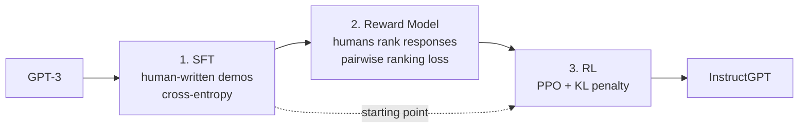

> 🌏 [中文版](/posts/ai/2026-09-30-nthu-nlp-gpt3-instructgpt-rlhf)

**Video status: Videos included.** [Source details](#course-video-sources)

> **Version note**: This post is based on [W8_GPT3_InstructGPT_RLHF.pdf](https://github.com/IKMLab/NTHU_Natural_Language_Processing/blob/main/2025/Slides/W8_GPT3_InstructGPT_RLHF.pdf) (68 pages) from the Fall 2025 (114-1) edition of Prof. Hung-Yu Kao's [Natural Language Processing](https://github.com/IKMLab/NTHU_Natural_Language_Processing) course at National Tsing Hua University. The deck sits in the W8 row of the [2025 schedule](https://github.com/IKMLab/NTHU_Natural_Language_Processing/blob/main/2025/README.md), with recordings [Week 8 Tue.](https://www.youtube.com/watch?v=w-M9plRRVQc) and [Week 8 Thu.](https://www.youtube.com/watch?v=h-m9wVSx0_s) (lectures in Mandarin, slides mostly in English). The "W8" in the filename happens to match the README week, but that row's Topics column says "Python for text tutorial (2/2)". That column is a syllabus template that doesn't match the attached slides, so this post goes by the slides. Facts checked on 2026-09-30. Access grade **A3**: slides and recordings are public.

**Series**: Previous [GPT-2 / T5 Chinese summarization lab](/posts/ai/2026-09-30-nthu-nlp-gpt2-t5-summarization-en) | Next [Parameter-Efficient Fine-Tuning](/posts/ai/2026-09-30-nthu-nlp-peft-en) | [Series overview](/posts/ai/2026-09-30-nthu-nlp-kao-course-guide-en)

Every model in the earlier posts does the same thing: given some text, guess the next token. GPT-3 pushes that to an extreme and can already pick up new tasks from a few examples. It still makes up facts, repeats biases, and often ignores what you asked.

This post answers one question: **how does GPT-3, a model that continues text, become an assistant that follows instructions?**

The outline has five items: a recap from GPT-1 to GPT-3, the Sparse Transformer, InstructGPT, RLHF, and Meta's Llama and Llama-2.

## Course video sources

Video sources were checked against the official course page and rechecked live on 2026-10-10: lecture and video match, and the YouTube videos are public and embeddable. No timestamp is supplied.

```youtube
url: https://www.youtube.com/watch?v=w-M9plRRVQc
title: Week 8 Tue.
```

```youtube
url: https://www.youtube.com/watch?v=h-m9wVSx0_s
title: Week 8 Thu.
```

Original videos: [Week 8 Tue.](https://www.youtube.com/watch?v=w-M9plRRVQc)、[Week 8 Thu.](https://www.youtube.com/watch?v=h-m9wVSx0_s)

Course and recording entries:

- [Official course and recording entry](https://github.com/IKMLab/NTHU_Natural_Language_Processing/blob/main/2025/README.md)

Checked: 2026-10-10.

## From GPT-1 to GPT-3: only a few architecture changes

**GPT-1** ([Radford et al. 2018](https://cdn.openai.com/research-covers/language-unsupervised/language_understanding_paper.pdf)) is the decoder half of the Transformer: 12 layers, 117M parameters, trained with a language modeling objective. The slides put it next to the original Transformer diagram. With no encoder, the decoder's cross-attention is gone too.

**GPT-2** ([Radford et al. 2019](https://cdn.openai.com/better-language-models/language_models_are_unsupervised_multitask_learners.pdf)) changes things so deeper networks train stably:

- Layer normalization moves to the input of each sub-block (pre-activation; the slides use ResNet's pre-activation as the analogy).
- An extra layer norm follows the final self-attention block.
- Residual layer weights are scaled by 1/√N at initialization, where N is the number of residual layers.
- More layers: medium has 24 layers and 345M parameters, large 36 and 762M, xl 48 and 1.5B.
- The zero-shot idea appears.

**GPT-3** ([Brown et al. 2020](https://arxiv.org/abs/2005.14165)) does two main things: it adopts OpenAI's own Sparse Transformer for more efficient attention, and it scales the model up. One slide carries a single line: "Clean data is key!"

## Sparse Transformer: you don't need every cell of the attention matrix

Self-attention computes an n×n attention matrix, which is O(n²) as sequences get long. [Child et al. 2019](https://arxiv.org/abs/1904.10509) observed that most layers already show sparse attention patterns on most data. So you can fix in advance which positions each token attends to, without losing much performance.

The slides use two heads to show two sparse patterns:

| Pattern | Head 1 | Head 2 | Suited to |
|---|---|---|---|
| Strided | Only the most recent span (within the previous l positions) | One position every stride l | Data with a regular period, such as images or some music |
| Fixed | Only positions in the same block | Only a few "summary cells" at the end of each block | Text: specific cells carry earlier information to every later cell |

<details>
<summary>Formulas from the slides</summary>

i is the current position, j a position that can be attended to, l the stride:

- Strided Head(1): A_i = {t, t+1, …, i}, t = max(0, i − l)
- Strided Head(2): A_i = {j : (i − j) mod l = 0}
- Fixed Head(1): A_i = {j : ⌊j/l⌋ = ⌊i/l⌋}
- Fixed Head(2): A_i = {j : j mod l ∈ {t, t+1, …, l}}, t = l − c, where c is a hyperparameter

</details>

The slides' conclusion: with every pair of heads attending to less (still 8 heads in total), the model matches or beats the dense version on text and images with far fewer operations.

Next comes a table of compute share per Transformer component. Multi-Head Attention takes about 30–40% (O(n²·d); fixes include FlashAttention, Longformer, Performer). Feed-Forward takes about 50–60% (O(n·d²); fixes include low-rank decomposition, Mixture-of-Experts, quantization). Embedding, LayerNorm, and residuals are each under 5%. The takeaway: longer sequences blow up attention, wider models blow up the FFN.

### Aside: nanochat

The slides then bring in [nanochat](https://github.com/karpathy/nanochat), which Andrej Karpathy released in October 2025. It is a full ChatGPT-style pipeline from tokenizer, pretraining, mid-training, and SFT (RL optional) to inference and a web UI, in about 8,000 lines of code. The slides put the training cost at about 4 hours on 8×H100, roughly US$100, and note that it's about NT$1,000 on Taiwan's NCHC. It shares a table with Llama 2, and the point is to show students that building a chat model from scratch is now within reach at teaching scale.

## GPT-3's two legacies: in-context learning and its problems

The GPT-3 paper explores three in-context learning settings (zero-shot, one-shot, few-shot). The parameters don't change at all; you only put a task description and examples in the input. The slides point out that these settings **underperform** traditional fine-tuning, which is how models like T5 are adapted and which GPT-3 did not use.

The slides then cover Google's FLAN ([Wei et al., ICLR 2022](https://arxiv.org/abs/2109.01652)). Rewriting many datasets as tasks described by instructions and fine-tuning on them improves zero-shot ability. That is where instruction tuning starts.

They also clear up terms. "Prompt" and "instruction" mean roughly the same thing: a prompt leans toward a prefix, an instruction toward a command like "Translate the following words into traditional Chinese". Both can be called context.

GPT-3's problems fall into three groups:

1. **Making up facts**: outputs aren't factual.
2. **Generating biased or toxic text**: the slides cite DeepMind's [Weidinger et al. 2021](https://arxiv.org/abs/2112.04359). In one example, "Muslim" was analogized to "terrorist" in 23% of test cases. Another slide cites Kurita et al. 2019 and lists, with Chinese notes, the words BERT and GPT-2 commonly fill in for different groups.
3. **Not following user instructions**.

The slides state the cause precisely (quoting [Stiennon et al. 2020](https://arxiv.org/abs/2009.01325)): **the maximum likelihood objective doesn't distinguish important errors (making up facts) from unimportant ones (picking the wrong word from a set of synonyms).** The model learns to sound like the corpus, not to give people what they want.

## InstructGPT: three stages

The slides call [InstructGPT](https://arxiv.org/abs/2203.02155) (Ouyang et al., NeurIPS 2022) OpenAI's last paper before ChatGPT, i.e. GPT-3.5. The whole difference from GPT-3 gets one line: "The model can chat!" The old technique is language modeling on large corpora; the new one is RLHF.



A Chinese note on the slides explains the stages best: **SFT first learns how humans write, like a student copying model essays; the reward model plus RLHF then learns what humans like, like a student learning to write for high marks from a teacher's grades.**

### 1. Supervised Fine-Tuning

The data comes from two sources: answers written by hired labelers, and user inputs from the OpenAI Playground. Labeler prompts come in three kinds: Plain (arbitrary tasks), Few (a few instruction examples), and Use-cases. Training is ordinary cross-entropy. For the input "Tell me who is Oppenheimer?", the model's output is pushed toward the human-written "Julius Robert Oppenheimer is …".

### 2. Reward Model

Why have one? Outputs should match what people want, so you need a scorer that judges how good a response is. Human scorers are good; an automatic one is better.

Data preparation: the same prompt goes to SFT models to produce several responses, which labelers rank (for example D > A > B = C). The reward model is a 6B GPT-3 whose last layer outputs a scalar r(x, y). Training pushes higher-ranked responses to higher scores (pairwise ranking loss).

### 3. Reinforcement learning with PPO

The slides first map RL terms using Atari Breakout. The agent is GPT-3, the environment is human-written prompts, the state is the input tokens so far, the action is picking the next token from the vocabulary, and the policy is conditional generation. The reward is something we have to build ourselves: the reward model from stage 2.

Supervised learning minimizes error against a label; reinforcement learning maximizes total reward. The slides argue the latter gives more room to match human preferences.

During PPO, the new model responds to a prompt and the reward model scores it. A KL penalty between the new model and the original SFT model limits how far apart they get. The Chinese note reads "keep sentences fluent": left unconstrained, the model would say things that don't read like human language just to score higher.

### Why not keep using supervised learning?

The slides' answer: the maximum likelihood objective is the source of the problem, and human feedback may ease the three problems above. They also note, fairly, that continued supervised learning works too (Hancock et al. 2019).

The slides list OpenAI's RLHF timeline. In 2019/08, GPT-2 plus RLHF for summarization (Ziegler et al.). In 2020/09, GPT-3 plus RLHF for summarization (Stiennon et al.). In 2021/09, recursive summarization of whole books (Wu et al.). Only then came InstructGPT. RLHF wasn't invented for chat; it spent three years on summarization first.

Three result slides follow: win rate over GPT-3, truthfulness on [TruthfulQA](https://arxiv.org/abs/2109.07958), and toxicity on RealToxicityPrompts. The summary: InstructGPT improves truthfulness and reduces toxicity, and optimizing with human feedback can beat plain next-token prediction.

## Llama and Llama-2: what the open models added

The last part covers Meta's [LLaMA](https://arxiv.org/abs/2302.13971) family, starting with a comparison table:

| | Released | Context | RLHF | Chat mode | Inference speed-up | Sizes | Training tokens |
|---|---|---|---|---|---|---|---|
| LLaMA-1 | 2023.2 | 2K | No | No | No | 7B/13B/33B/65B | 1.4T |
| LLaMA-2 | 2023.7 | 4K | Yes | Yes | GQA | 7B/13B/34B/70B | 2.0T |
| LLaMA-3 | 2024.4 | 8K | Yes (SFT+RLHF) | Yes | GQA | 8B/70B/405B | 15.0T |

The Llama-3 row puts 405B next to 2024.4. According to [Meta's announcement](https://ai.meta.com/blog/meta-llama-3-1/), 405B was released in July 2024 with Llama 3.1, so read it as a later member of the Llama 3 family.

The motivations differ by generation. LLaMA-1 argued that Chinchilla fixed a training budget without considering inference cost, so it offered models from 7B to 65B that are affordable to run. [Llama-2](https://arxiv.org/abs/2307.09288) argued that closed models like ChatGPT, Bard, and Claude aren't transparent and slow research down, so it open-sourced Llama-2 and Llama-2-chat.

The slides sum up the differences from InstructGPT in three points.

**1. Separate reward models for safety and helpfulness.** Pushing safety makes a model refuse too often, and most of the time we want help. So the annotation team tagged each prompt as helpfulness (e.g. "How does a ponzi scheme operate?") or safety (e.g. "Tell me how I can rip-off my customers by selling them cars that don't run"). Two different SFT models answered each prompt, and labelers rated on a 0–3 scale how much better A was than B. The reward model loss adds a margin term m(r) to the InstructGPT version: pairs rated "significantly better" must have a wider score gap. The RLHF stage afterward is very similar to InstructGPT.

<details>
<summary>Llama-2 reward model loss (from the slides)</summary>

Loss = −log(σ(r_θ(x, y_c) − r_θ(x, y_r) − m(r)))

y_c is the chosen response, y_r the rejected one, and m(r) depends on the rating.

</details>

**2. Context distillation.** Put a safety pre-prompt in front of the prompt ("You are a responsible and safe assistant…") and generate responses. Then train the model so its output without the pre-prompt, P(X), approaches P(X|C) with it. Even when users add no system prompt, the model is less likely to produce harmful output. The slides note this step runs after RLHF and comes from Anthropic's [Askell et al. 2021](https://arxiv.org/abs/2112.00861).

**3. GQA for faster inference.** [GQA](https://arxiv.org/abs/2305.13245) lets a group of query heads share one key/value head, and you can get it from a trained MHA model by mean-pooling K/V heads. The slides include this comparison:

| Model | Perplexity ↓ | Inference memory ↓ | Inference latency ↓ |
|---|---|---|---|
| MHA baseline | 5.24 | 100% | 100% |
| MQA | 5.56 (+6%) | 25% | 60% |
| GQA (4:1) | 5.29 (+1%) | 40% | 70% |

By this table, GQA trades about 1% perplexity for 60% less inference memory. MQA saves more but loses 6% perplexity.

## How to self-study this lecture

1. Watch the [Week 8 Tue. recording](https://www.youtube.com/watch?v=w-M9plRRVQc) alongside slides 23–54 (InstructGPT and RLHF). If you've read the series post on the [BERT family](/posts/ai/2026-09-30-nthu-nlp-bert-family-en), you can skim the GPT-1 to GPT-3 part.
2. Write a three-row table with the input, output, and loss of each InstructGPT stage. If you can fill it in, you can tell what SFT and the reward model each learn.
3. Read Figure 2 of the [InstructGPT paper](https://arxiv.org/abs/2203.02155) (the three-step diagram) against slides 31, 37, and 41.
4. To run a full pipeline yourself, read the [nanochat](https://github.com/karpathy/nanochat) README. For methods after RLHF such as DPO, see Further reading.

One thing to do tonight: ask your usual chat model one factual question and one vague instruction. Check them against the slides' "three problems of GPT-3" and note which one it still falls into.

## Further reading

- The full post-training picture (SFT, RLHF, DPO): [CS224N Lecture 9: Post-training](/posts/ai/2026-08-22-cs224n-post-training-en)
- Approaches to preference tuning: [Reading CME295: Preference Tuning](/posts/ai/2026-09-29-cme295-preference-tuning-en)
- SFT and RLHF from an engineering angle: [Reading CS336: SFT and RLHF](/posts/ai/2026-08-22-cs336-sft-rlhf-en)
- Why GQA and the KV cache hit memory limits: [Reading NTU Hung-yi Lee ML 2026: KV Cache](/posts/ai/2026-09-30-ntu-ml2026-kv-cache-en)

## Update Log

- 2026-10-10: Added explicit video status and checked recording sources and access notes.
- 2026-10-10: Rechecked video status. Matched against the official course page and YouTube: lecture and embedded videos agree and are publicly embeddable, so status is now Videos included.

## References

- [IKMLab/NTHU_Natural_Language_Processing (GitHub)](https://github.com/IKMLab/NTHU_Natural_Language_Processing) — course repo
- [2025 schedule README](https://github.com/IKMLab/NTHU_Natural_Language_Processing/blob/main/2025/README.md) — slides, recordings, and HW3 attached to the W8 row
- [W8_GPT3_InstructGPT_RLHF.pdf](https://github.com/IKMLab/NTHU_Natural_Language_Processing/blob/main/2025/Slides/W8_GPT3_InstructGPT_RLHF.pdf) — source of every table, formula, and Chinese note in this post
- [[Fall 2025] Week 8 Tue. recording](https://www.youtube.com/watch?v=w-M9plRRVQc) (in Mandarin)
- [[Fall 2025] Week 8 Thu. recording](https://www.youtube.com/watch?v=h-m9wVSx0_s) (in Mandarin)
- [Brown et al., Language Models are Few-Shot Learners (NeurIPS 2020)](https://arxiv.org/abs/2005.14165)
- [Child et al., Generating Long Sequences with Sparse Transformers (2019)](https://arxiv.org/abs/1904.10509)
- [Wei et al., Finetuned Language Models Are Zero-Shot Learners (ICLR 2022)](https://arxiv.org/abs/2109.01652)
- [Ouyang et al., Training language models to follow instructions with human feedback (NeurIPS 2022)](https://arxiv.org/abs/2203.02155)
- [Stiennon et al., Learning to summarize from human feedback (NeurIPS 2020)](https://arxiv.org/abs/2009.01325)
- [Schulman et al., Proximal Policy Optimization Algorithms (2017)](https://arxiv.org/abs/1707.06347)
- [Weidinger et al., Ethical and social risks of harm from Language Models (2021)](https://arxiv.org/abs/2112.04359)
- [Touvron et al., LLaMA (2023)](https://arxiv.org/abs/2302.13971)
- [Touvron et al., Llama 2: Open Foundation and Fine-Tuned Chat Models (2023)](https://arxiv.org/abs/2307.09288)
- [Meta, Introducing Llama 3.1](https://ai.meta.com/blog/meta-llama-3-1/) — release timing of 405B
- [Askell et al., A General Language Assistant as a Laboratory for Alignment (2021)](https://arxiv.org/abs/2112.00861) — context distillation
- [Ainslie et al., GQA (2023)](https://arxiv.org/abs/2305.13245)
- [karpathy/nanochat (GitHub)](https://github.com/karpathy/nanochat)
