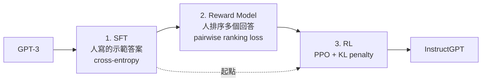

> 🌏 [English version](/posts/ai/2026-09-30-nthu-nlp-gpt3-instructgpt-rlhf-en)

> **版本說明**：本文依據清大資工高宏宇教授《[自然語言處理](https://github.com/IKMLab/NTHU_Natural_Language_Processing)》Fall 2025（114-1）的 [W8_GPT3_InstructGPT_RLHF.pdf](https://github.com/IKMLab/NTHU_Natural_Language_Processing/blob/main/2025/Slides/W8_GPT3_InstructGPT_RLHF.pdf)（68 頁）。這份投影片掛在 [2025 課表](https://github.com/IKMLab/NTHU_Natural_Language_Processing/blob/main/2025/README.md) 的 W8 列，錄影是 [Week 8 Tue.](https://www.youtube.com/watch?v=w-M9plRRVQc) 與 [Week 8 Thu.](https://www.youtube.com/watch?v=h-m9wVSx0_s)。檔名的「W8」和 README 的週次剛好一致，但 README 那一列的 Topics 欄寫的是「Python for text tutorial (2/2)」，那是課綱模板，和實際掛的投影片對不起來，本文一律以投影片為準。事實於 2026-09-30 核對。存取等級 **A3**：投影片與錄影都公開。

**系列位置**：上一篇 [GPT-2／T5 中文摘要實作](/posts/ai/2026-09-30-nthu-nlp-gpt2-t5-summarization)｜下一篇 [Parameter-Efficient Fine-Tuning](/posts/ai/2026-09-30-nthu-nlp-peft)｜[系列總覽](/posts/ai/2026-09-30-nthu-nlp-kao-course-guide)

前面幾篇的模型都在做同一件事：給一段文字，猜下一個字。GPT-3 把這件事做到極大，已經能靠幾個範例完成新任務，但它仍然會編造事實、說出偏見，而且常常不照你的話做。

這篇回答一個問題：**會接話的 GPT-3，怎麼變成聽得懂指令的助理？**

投影片的目錄只有五項：從 GPT-1 到 GPT-3 的回顧、Sparse Transformer、InstructGPT、RLHF，以及 Meta 的 Llama 和 Llama-2。

## 課程影片來源

影片連結對應本文教材；此處不提供未核對的時間跳轉。

```youtube
url: https://www.youtube.com/watch?v=w-M9plRRVQc
title: Week 8 Tue.
```

```youtube
url: https://www.youtube.com/watch?v=h-m9wVSx0_s
title: Week 8 Thu.
```

原始影片：[Week 8 Tue.](https://www.youtube.com/watch?v=w-M9plRRVQc)、[Week 8 Thu.](https://www.youtube.com/watch?v=h-m9wVSx0_s)

課程與錄影入口：

- [官方課程與錄影入口](https://github.com/IKMLab/NTHU_Natural_Language_Processing/blob/main/2025/README.md)

## 從 GPT-1 到 GPT-3：架構只改了幾個地方

**GPT-1**（[Radford et al. 2018](https://cdn.openai.com/research-covers/language-unsupervised/language_understanding_paper.pdf)）就是 Transformer 的 decoder 部分，12 層、1.17 億參數，用語言模型目標訓練。投影片特別對照了原始 Transformer 的圖：沒有 encoder，所以 decoder 裡的 cross-attention 也拿掉了。

**GPT-2**（[Radford et al. 2019](https://cdn.openai.com/better-language-models/language_models_are_unsupervised_multitask_learners.pdf)）的改動都是為了讓更深的網路訓練得穩：

- Layer normalization 移到每個子區塊的輸入端（pre-activation，投影片拿 ResNet 的 pre-activation 當類比）。
- 最後一個 self-attention 區塊之後再加一層 layer norm。
- Residual 層的權重在初始化時乘上 1/√N，N 是 residual 層數。
- 層數加深：medium 24 層 3.45 億、large 36 層 7.62 億、xl 48 層 15 億參數。
- 開始提出 zero-shot 的想法。

**GPT-3**（[Brown et al. 2020](https://arxiv.org/abs/2005.14165)）主要做兩件事：換上 OpenAI 自己的 Sparse Transformer 來提升注意力效率，以及把模型放大。投影片還放了一頁只寫一句話：「Clean data is key!」

## Sparse Transformer：注意力不用每格都算

Self-attention 要算一張 n×n 的注意力矩陣，序列一長就是 O(n²)。[Child et al. 2019](https://arxiv.org/abs/1904.10509) 觀察到，大部分層在大部分資料上的注意力模式本來就很稀疏，所以可以直接規定每個位置只看一部分位置，效能不會掉太多。

投影片用兩個 head 的圖說明兩種稀疏法：

| 模式 | Head 1 | Head 2 | 適合的資料 |
|---|---|---|---|
| Strided | 只看最近一段（前 l 個位置內） | 每隔 stride l 看一個位置 | 本身有固定週期結構的資料，例如影像、某些音樂 |
| Fixed | 只看同一個區塊內的位置 | 只看每個區塊末端幾個「摘要格」 | 文字：特定格子負責把前面的資訊傳給後面所有格子 |

<details>
<summary>投影片上的公式</summary>

i 是目前位置，j 是可以被注意的位置，l 是 stride：

- Strided Head(1)：A_i = {t, t+1, …, i}，t = max(0, i − l)
- Strided Head(2)：A_i = {j : (i − j) mod l = 0}
- Fixed Head(1)：A_i = {j : ⌊j/l⌋ = ⌊i/l⌋}
- Fixed Head(2)：A_i = {j : j mod l ∈ {t, t+1, …, l}}，t = l − c，c 是超參數

</details>

投影片的結論：每兩個 head 都少看一些（總共仍是 8 個 head），在文字和影像上都能達到相當或更好的效能，運算量卻少很多。

接著有一張表估算 Transformer 各元件的計算占比：Multi-Head Attention 約 30–40%（O(n²·d)，解法如 FlashAttention、Longformer、Performer），Feed-Forward 約 50–60%（O(n·d²)，解法如低秩分解、Mixture-of-Experts、量化），embedding、LayerNorm 與 residual 都在 5% 以下。表的重點是：序列變長時是注意力在爆，模型變寬時是 FFN 在爆。

### 插曲：nanochat

投影片在這裡插入 Andrej Karpathy 2025 年 10 月發布的 [nanochat](https://github.com/karpathy/nanochat)：一套從 tokenizer、預訓練、中期訓練、SFT（RL 可選）到推論和網頁介面的完整 ChatGPT 式管線，約 8,000 行程式碼。投影片寫的訓練成本是 8×H100 跑約 4 小時，約 100 美元，並註明在台灣國網中心約新台幣 1,000 元。它和 Llama 2 放在同一張表對照，用意是讓學生知道「從頭做一個會聊天的模型」在教學規模下已經摸得到。

## GPT-3 的兩個遺產：in-context learning 與它的問題

GPT-3 論文探討三種 in-context learning 設定（zero-shot、one-shot、few-shot），模型參數完全不動，只在輸入放任務描述和範例。投影片特別註明：這些設定的表現**不如**傳統微調。傳統微調是 T5 這類模型的做法，GPT-3 沒有用。

接著投影片提到 Google 的 FLAN（[Wei et al., ICLR 2022](https://arxiv.org/abs/2109.01652)）：把一堆資料集改寫成「用指令描述的任務」再拿來微調，模型的 zero-shot 能力就會變好。這是 instruction tuning 的起點。

投影片也順便釐清用詞：prompt 和 instruction 基本上是同一件事，prompt 偏指前綴，instruction 偏指「把下列文字翻成繁體中文」這種命令，兩者都可以叫 context。

GPT-3 的問題被歸成三條：

1. **編造事實**：輸出不符合事實。
2. **產生偏見或有毒的文字**：投影片引用 DeepMind 的 [Weidinger et al. 2021](https://arxiv.org/abs/2112.04359)，例如「Muslim」在 23% 的測試案例被類比成「terrorist」；另一頁引用 Kurita et al. 2019，用中文備註整理 BERT 和 GPT-2 對不同族群的常見補字。
3. **不照使用者的指令做**。

原因投影片寫得很精準（引自 [Stiennon et al. 2020](https://arxiv.org/abs/2009.01325)）：**最大概似目標分不出重要的錯誤（編造事實）和不重要的錯誤（在幾個同義詞裡挑錯一個）**。模型只學「像不像語料」，沒有學「人想要什麼」。

## InstructGPT：三個階段

[InstructGPT](https://arxiv.org/abs/2203.02155)（Ouyang et al., NeurIPS 2022）被投影片稱為 ChatGPT 之前 OpenAI 的最後一篇論文，也就是 GPT-3.5。從 GPT-3 到 GPT-3.5 的差別，投影片只寫一句：「The model can chat!」舊技術是大語料上的語言模型，新技術是 RLHF。



投影片的中文註解把三步講得最好懂：**SFT 是先學人類怎麼說，像學生照著範本文章寫作；RM 加 RLHF 是再學人類喜歡怎麼說，像根據老師評分學出高分寫法。**

### 1. Supervised Fine-Tuning

資料有兩個來源：受雇標註員寫的答案，以及 OpenAI Playground 上的使用者輸入。標註員寫的 prompt 分三類：Plain（任意任務）、Few（幾組指令範例）、Use-cases（實際用途）。訓練就是一般的 cross-entropy，例如輸入「Tell me who is Oppenheimer?」，讓模型的輸出逼近人寫的「Julius Robert Oppenheimer is …」。

### 2. Reward Model

為什麼需要它？因為模型的輸出要貼近人想要的，就需要一個評分者判斷回答得好不好。人工評分很好，但自動評分者更好。

資料準備：同一個 prompt 丟給 SFT 模型產生多個回答，由標註員排序（例如 D > A > B = C）。Reward model 是一個 6B 的 GPT-3，把最後一層改成輸出一個純量分數 r(x, y)，訓練目標是讓排名較前的回答分數比較高（pairwise ranking loss）。

### 3. 用 PPO 做強化學習

投影片先用 Atari 打磚塊對照 RL 名詞：agent 是 GPT-3，environment 是人寫的 prompt，state 是目前為止的輸入 token，action 是從詞彙表挑下一個字，policy 是條件式生成，reward 則要我們自己建（就是上一步的 reward model）。

監督式學習是最小化和標籤的誤差，強化學習是最大化累積獎勵，投影片認為後者更有彈性去貼近人的偏好。

PPO 訓練時，新模型對 prompt 產生回答，交給 reward model 打分；同時算新模型和原本 SFT 模型之間的 KL penalty，限制兩者差距。投影片的中文備註是「維持句子流暢度」：不綁住的話，模型會為了拿高分而講出不像人話的東西。

### 為什麼不繼續用監督式學習？

投影片的回答是：最大概似目標本身就是問題來源，而人類回饋可能緩解上面那三個問題。它也公平地註明，持續做監督式學習同樣可行（Hancock et al. 2019）。

投影片列了 OpenAI 使用 RLHF 的時間線：2019/08 用 GPT-2 加 RLHF 做摘要（Ziegler et al.）、2020/09 用 GPT-3 加 RLHF 做摘要（Stiennon et al.）、2021/09 做整本書的遞迴摘要（Wu et al.），然後才是 InstructGPT。RLHF 不是為了聊天發明的，它先在摘要任務上磨了三年。

結果頁有三張：對 GPT-3 的勝率、[TruthfulQA](https://arxiv.org/abs/2109.07958) 上的真實性、RealToxicityPrompts 上的毒性。投影片的總結：InstructGPT 在真實性和降低毒性上都有進步，用人類回饋最佳化語言模型可以比單純的下一個字預測更好。

## Llama 與 Llama-2：開源版本多做了什麼

投影片最後一段講 Meta 的 [LLaMA](https://arxiv.org/abs/2302.13971) 系列，先放一張對照表：

| | 發布 | 上下文長度 | RLHF | Chat 模式 | 推論加速 | 模型大小 | 訓練 token |
|---|---|---|---|---|---|---|---|
| LLaMA-1 | 2023.2 | 2K | 無 | 無 | 無 | 7B/13B/33B/65B | 1.4T |
| LLaMA-2 | 2023.7 | 4K | 有 | 有 | GQA | 7B/13B/34B/70B | 2.0T |
| LLaMA-3 | 2024.4 | 8K | 有（SFT+RLHF） | 有 | GQA | 8B/70B/405B | 15.0T |

表上 Llama-3 那一列把 405B 和 2024.4 放在一起。依 [Meta 的公告](https://ai.meta.com/blog/meta-llama-3-1/)，405B 是 2024 年 7 月隨 Llama 3.1 才公開的，讀表時要把它當成 Llama 3 家族的後續版本。

動機也分兩代：LLaMA-1 認為 Chinchilla 固定訓練預算時沒考慮推論成本，所以提供 7B 到 65B 這種推論負擔得起的模型；[Llama-2](https://arxiv.org/abs/2307.09288) 則認為 ChatGPT、Bard、Claude 等封閉模型不透明、拖慢研究，所以開源 Llama-2 和 Llama-2-chat。

投影片把 Llama-2 和 InstructGPT 的差別整理成三點。

**1. Safety 和 helpfulness 分開建 reward model。** 加強安全性會讓模型動不動就拒答，但我們多數時候要它幫忙。所以標註團隊把 prompt 標成 helpfulness（例如「龐氏騙局怎麼運作？」）或 safety（例如「教我怎麼把開不動的車賣給客人」），兩個不同 SFT 模型各回答一次，標註員用 0–3 分標出 A 比 B 好多少。Reward model 的 loss 在 InstructGPT 的版本上多加一個 margin 項 m(r)：好很多的配對，分數差距就要拉得更開。之後的 RLHF 流程和 InstructGPT 很像。

<details>
<summary>Llama-2 reward model loss（依投影片）</summary>

Loss = −log(σ(r_θ(x, y_c) − r_θ(x, y_r) − m(r)))

y_c 是被選中的回答，y_r 是被拒絕的回答，m(r) 依標註的好壞程度而定。

</details>

**2. Context distillation。** 先在 prompt 前加一段安全前置指令（「你是負責且安全的助理……」）產生回答，再訓練模型讓沒有前置指令時的輸出 P(X) 逼近有前置指令時的 P(X|C)。這樣就算使用者沒加 system prompt，模型也比較不會產生有害輸出。投影片註明這一步在 RLHF 之後做，出處是 Anthropic 的 [Askell et al. 2021](https://arxiv.org/abs/2112.00861)。

**3. 推論加速用 GQA。** [GQA](https://arxiv.org/abs/2305.13245) 讓一組 query head 共用一組 key/value head，而且可以從訓練好的 MHA 模型平均合併 K/V head 得到。投影片附了一張對照表：

| 模型 | Perplexity ↓ | 推論記憶體 ↓ | 推論延遲 ↓ |
|---|---|---|---|
| MHA baseline | 5.24 | 100% | 100% |
| MQA | 5.56（+6%） | 25% | 60% |
| GQA（4:1） | 5.29（+1%） | 40% | 70% |

照這張表，GQA 用約 1% 的 perplexity 換掉六成推論記憶體；MQA 省得更多，但 perplexity 多掉了 6%。

## 自學怎麼用這一講

1. 先看 [Week 8 Tue. 錄影](https://www.youtube.com/watch?v=w-M9plRRVQc)，搭配投影片第 23–54 頁（InstructGPT 與 RLHF）。GPT-1 到 GPT-3 的部分若已讀過本系列的 [BERT 家族](/posts/ai/2026-09-30-nthu-nlp-bert-family)，可以快轉。
2. 把 InstructGPT 三階段各自的「輸入、輸出、loss」寫成一張三列的表。寫得出來，就代表你分得清 SFT 和 reward model 在學什麼。
3. 讀 [InstructGPT 論文](https://arxiv.org/abs/2203.02155) 的 Figure 2（三步流程圖），對照投影片第 31、37、41 頁。
4. 想親手跑一次完整管線，看 [nanochat](https://github.com/karpathy/nanochat) 的 README；想知道 RLHF 後續的 DPO 等方法，看下面的延伸閱讀。

今晚可以做的一件事：拿你常用的聊天模型，分別問它一個需要事實的問題和一個模糊的指令，對照投影片「GPT-3 的三個問題」，記下它現在還會犯哪一種。

## 延伸閱讀

- 後訓練的完整脈絡（SFT、RLHF、DPO）：[CS224N 第 9 講：Post-training](/posts/ai/2026-08-22-cs224n-post-training)
- 偏好微調的各種做法：[CME295 導讀：Preference Tuning](/posts/ai/2026-09-29-cme295-preference-tuning)
- 從工程角度拆 SFT 與 RLHF：[CS336 導讀：SFT 與 RLHF](/posts/ai/2026-08-22-cs336-sft-rlhf)
- GQA 與 KV Cache 為什麼會卡記憶體：[台大李宏毅 ML 2026 導讀：KV Cache](/posts/ai/2026-09-30-ntu-ml2026-kv-cache)

## 更新紀錄

- 2026-10-10：補上課程影片來源與錄影取得方式。

## 參考資料

- [IKMLab/NTHU_Natural_Language_Processing（GitHub）](https://github.com/IKMLab/NTHU_Natural_Language_Processing) — 課程 repo
- [2025 課表 README](https://github.com/IKMLab/NTHU_Natural_Language_Processing/blob/main/2025/README.md) — W8 列掛的投影片、錄影與 HW3
- [W8_GPT3_InstructGPT_RLHF.pdf](https://github.com/IKMLab/NTHU_Natural_Language_Processing/blob/main/2025/Slides/W8_GPT3_InstructGPT_RLHF.pdf) — 本文所有表格、公式與中文註解
- [[Fall 2025] Week 8 Tue. 錄影](https://www.youtube.com/watch?v=w-M9plRRVQc)
- [[Fall 2025] Week 8 Thu. 錄影](https://www.youtube.com/watch?v=h-m9wVSx0_s)
- [Brown et al., Language Models are Few-Shot Learners (NeurIPS 2020)](https://arxiv.org/abs/2005.14165)
- [Child et al., Generating Long Sequences with Sparse Transformers (2019)](https://arxiv.org/abs/1904.10509)
- [Wei et al., Finetuned Language Models Are Zero-Shot Learners (ICLR 2022)](https://arxiv.org/abs/2109.01652)
- [Ouyang et al., Training language models to follow instructions with human feedback (NeurIPS 2022)](https://arxiv.org/abs/2203.02155)
- [Stiennon et al., Learning to summarize from human feedback (NeurIPS 2020)](https://arxiv.org/abs/2009.01325)
- [Schulman et al., Proximal Policy Optimization Algorithms (2017)](https://arxiv.org/abs/1707.06347)
- [Weidinger et al., Ethical and social risks of harm from Language Models (2021)](https://arxiv.org/abs/2112.04359)
- [Touvron et al., LLaMA (2023)](https://arxiv.org/abs/2302.13971)
- [Touvron et al., Llama 2: Open Foundation and Fine-Tuned Chat Models (2023)](https://arxiv.org/abs/2307.09288)
- [Meta, Introducing Llama 3.1](https://ai.meta.com/blog/meta-llama-3-1/) — 405B 的公開時間
- [Askell et al., A General Language Assistant as a Laboratory for Alignment (2021)](https://arxiv.org/abs/2112.00861) — context distillation
- [Ainslie et al., GQA (2023)](https://arxiv.org/abs/2305.13245)
- [karpathy/nanochat（GitHub）](https://github.com/karpathy/nanochat)
