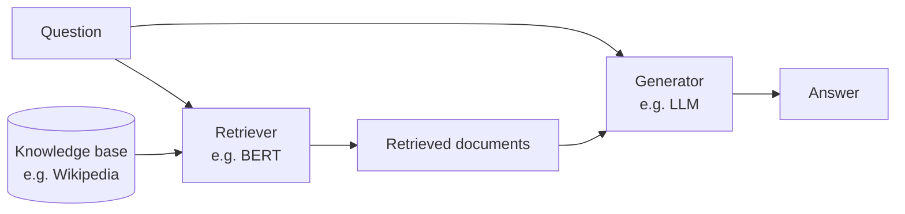

> 🌏 [中文版](/posts/ai/2026-09-30-nthu-nlp-rag-retrievers)

> **Version note**: This post is based on [W11_RAG.pdf](https://github.com/IKMLab/NTHU_Natural_Language_Processing/blob/main/2025/Slides/W11_RAG.pdf) from the Fall 2025 (114-1) edition of Prof. Hung-Yu Kao's [Natural Language Processing](https://github.com/IKMLab/NTHU_Natural_Language_Processing) course at National Tsing Hua University. The deck has 125 pages; this post covers only pages 1–60, up to the "From Retrievers to QA" slide, and the rest is in the [next post](/posts/ai/2026-09-30-nthu-nlp-rag-qa-advanced-en). The filename says W11, but in the [2025 schedule](https://github.com/IKMLab/NTHU_Natural_Language_Processing/blob/main/2025/README.md) it sits in the W10 row, with recordings [Week 10 Tue.](https://www.youtube.com/watch?v=VHkMHSkJ4I4) and [Week 10 Thu.](https://www.youtube.com/watch?v=SMVvvbXLYg4) (in Mandarin). The W10 Topics column says "Decoding Strategies and Evaluations"; it's a syllabus template that doesn't match the slides. **I did not watch the recordings to confirm where each one stops in the deck.** Facts checked on 2026-09-30. Access grade **A3**: slides and recordings are public.

**Series**: Previous [Parameter-Efficient Fine-Tuning](/posts/ai/2026-09-30-nthu-nlp-peft-en) | Next [RAG (Part 2): From ODQA to Self-RAG](/posts/ai/2026-09-30-nthu-nlp-rag-qa-advanced-en) | [Series overview](/posts/ai/2026-09-30-nthu-nlp-kao-course-guide-en)

The last post was about tuning new knowledge into a model with few parameters. This one takes another route: leave the model alone and find the relevant material before it answers.

This post answers one question: **LLMs make up answers, so how do you find the right material first? And what are sparse and dense vectors each good at?**

## Hallucination and two ways to mitigate it

The slides take their definition from [Ji et al. 2023](https://arxiv.org/abs/2202.03629): natural language generation models often produce text that is nonsensical or unfaithful to the input, and this is called hallucination. Two mitigations are listed (plus an "…"):

- **Chain-of-Thought prompting** ([Wei et al., NeurIPS 2022](https://arxiv.org/abs/2201.11903)): put human-written reasoning in the few-shot examples, such as "The answer must be a place with a lot of people. Of the above choices, only populated areas have a lot of people. So the answer is (a)", so the model reasons before it answers.
- **Retrieval-Augmented Generation**: pull relevant information from a store first, then generate from it.

One example shows the difference. Asked "Which year was Oppenheimer born?", the model without RAG says 1967. After retrieving the Wikipedia passage "born April 22, 1904 … died February 18, 1967", it says 1904. 1967 is the year he died; the model mixed up the two numbers.

Why is RAG needed? The slides cite [NVIDIA's explainer](https://blogs.nvidia.com/blog/what-is-retrieval-augmented-generation/): LLMs have broad parameterized knowledge but make mistakes when they lack domain knowledge or their information is outdated, and a standalone LLM can't serve users who want to dig into a current or specific topic. They also cite the [Gao et al. 2023 RAG survey](https://arxiv.org/abs/2312.10997) (182 references, the slide notes) and use its figure to lay out retrieval sources (Wikipedia, knowledge graphs, search engines…), granularity (sentences, chunks, documents…), and timing (once, iterative, recursive, adaptive).

## What a retriever does

A retriever finds documents relevant to a query, usually by comparing query vectors with document vectors. The slides stress that it has a big effect on the LLM's performance, so you need a good one.

There are two kinds of vectors:

| | Sparse vectors | Dense vectors |
|---|---|---|
| Examples | TF-IDF, BM25 | BERT, Sentence-BERT, DPR |
| Shape | Vocabulary-sized, mostly zeros | Smaller, every dimension a real number |
| Strength | Efficient: zeros can be skipped | Capture meaning, e.g. "the body of water" matches "sea" |

Retrievers are trained for two kinds of tasks. **Retrieval for open-domain QA (ODQA)** takes a question and finds the relevant document in a pool. **Sentence embeddings for semantic similarity** take a sentence and find semantically similar ones. The slides say RAG more often uses the first, but both work for retrieval depending on your task.

## Sparse vectors: bag-of-words, TF-IDF, BM25

The slides use a five-word vocabulary: ["cat", "dog", "fish", "bird", "snake"]. A document containing only cat and dog becomes the sparse vector [1, 1, 0, 0, 0].

**Bag-of-words** just counts. The slides use "This is a book" and "These are pens and my pen is here". The second sentence scores 2 in the pen column: the vocabulary has no separate pens column, so pens and pen are counted together.

**TF-IDF** replaces counts with term frequency × inverse document frequency. A term that appears in fewer documents is more specific and gets more weight. In the same two sentences, "is" appears in both, so its weight in the first sentence (0.38) is lower than "book" (0.53), which appears only there.

**BM25** (Best Matching, [Robertson & Zaragoza 2009](https://doi.org/10.1561/1500000019)) improves on TF-IDF with two hyperparameters:

- **k1** controls term frequency saturation, so a term that appears many times doesn't keep raising the score. The slides suggest k1 between 0 and 3; larger k1 gives term frequency more weight.
- **b** controls document length normalization so long and short documents compete fairly.
- With k1 = 0 and b = 0, term frequency is ignored entirely.

## Dense vectors: is [CLS] enough?

Dense vectors represent the semantic features of text with compact real numbers; Word2Vec, covered earlier, is one way to make them. So where does a sentence's dense vector come from? The obvious choice is BERT's [CLS], and the slides say it isn't enough, for three reasons:

- BERT's pretraining task is masked language modeling, not sentence semantics.
- [CLS] wasn't designed to be a sentence embedding.
- [CLS] is heavily affected by context and positional encoding, making it semantically unstable.

Two examples. In English, the similarity between "The man is sitting on the chair." and "A person is seated on a chair." can come out lower than between "A dog is chasing a ball." and "The stock market went up today." In Chinese, the query "I went for a run yesterday" scores about the same against "I went jogging at the gym yesterday" as against "I watched Netflix at home yesterday".

## Dual encoders and Sentence-BERT

A **dual encoder** (also called a bi-encoder or Siamese network) processes two inputs separately with two identical or similar encoders, outputs a vector for each, and compares them by cosine similarity. For information retrieval the inputs are a document and a query; for semantic similarity, two sentences.

Siamese networks aren't new. The slides start with signature verification in [Bromley et al. 1993](https://proceedings.neurips.cc/paper/1993/hash/288cc0ff022877bd3df94bc9360b9c5d-Abstract.html), then face verification (2005), image similarity (2015), and text similarity (2016).

**[Sentence-BERT](https://arxiv.org/abs/1908.10084)** (Reimers & Gurevych, EMNLP-IJCNLP 2019) builds a Siamese structure from two weight-sharing BERTs. BERT outputs a vector per token, so pooling is needed to get one fixed-size sentence vector. The slides list three options:

- **CLS**: use the [CLS] vector, the default in original BERT.
- **MEAN**: average all token vectors.
- **MAX**: take the maximum across tokens in each dimension.

During training, the two sentence vectors u and v are concatenated with their element-wise difference and fed to a classifier. At inference you compute cosine directly. The slides' conclusion: [CLS] can represent the whole sentence, but pooling may do better. Experiments show concatenation with the element-wise difference works best, and the concatenation is used only for training.

## Bi-encoders versus cross-encoders

A **cross-encoder** feeds both sentences into one BERT together ("[CLS] sentence A [SEP] sentence B [SEP]"). The two sentences attend to each other, and [CLS] represents their relationship.

The difference is compute. The slides compare all pairs among 10,000 sentences:

| | Inference passes |
|---|---|
| Cross-encoder | n·(n−1)/2 = 49,995,000 |
| Bi-encoder | 10,000 × 2 (parallelizable), plus cosine |

The slides' verdict: accuracy usually differs little, but bi-encoders are much faster. Past a million documents, the gap in compute time becomes impossible to ignore.

## SimCSE: dropout as data augmentation

**[SimCSE](https://arxiv.org/abs/2104.08821)** (Gao, Yao & Chen, EMNLP 2021) is a dual encoder with contrastive learning, trained one of two ways:

- **Unsupervised**: feed the same sentence twice. Different dropout masks produce two slightly different vectors, which are pulled together as a positive pair while other sentences are pushed away as negatives. Dropout acts as data augmentation.
- **Supervised**: labels in a dataset define positives and negatives.

After some background on dropout and contrastive learning (figures from FaceNet and SimCLR), the slides conclude that SimCSE outperforms Sentence-BERT on semantic similarity tasks.

## Retrieval for open-domain QA: DPR

In **ODQA**, the model gets a question (e.g. "What is the currency of the UK?") and must output the answer ("pound"). "Open" means the model isn't handed a document known to contain the answer. It resembles reading comprehension tasks like SQuAD, minus the relevant article.

**[DPR](https://aclanthology.org/2020.emnlp-main.550/)** (Karpukhin et al., EMNLP 2020) works like this:

- Two encoders based on bert-base-uncased: one for questions (E_Q), one for passages (E_P). Similarity is the dot product of the two vectors.
- Each training instance has a question, one relevant passage, and n irrelevant passages.
- The loss is the negative log-likelihood of the positive passage: pull the question and relevant passage together, push the irrelevant ones away.

The slides' highlight: **it beats BM25 with only 1,000 training examples.**

## Limits of dual encoders, and GTR

Citing [Ni et al. (EMNLP 2022)](https://aclanthology.org/2022.emnlp-main.669/), the slides raise two concerns about dual encoders. They often fail to generalize to other domains. And the final "bottleneck" of a plain dot product or cosine may not be powerful enough to capture semantic relevance.

**GTR** (Generalizable T5-based Retriever) asks: keep the bottleneck fixed and only scale up the encoder, does retrieval improve? It uses the T5 encoder at four sizes from Base to XXL (110M, 335M, 1.24B, 4.8B parameters). The answer is yes. Across all BEIR tasks (excluding MS MARCO), larger models get better out-of-domain Recall@100 and NDCG@100. The slides also show a figure from [ColBERT](https://arxiv.org/abs/2004.12832) comparing the ways queries and documents can interact.

GTR trains in two stages:

1. Pretrain on 2 billion QA pairs from sources such as Reddit and Stack Overflow.
2. Fine-tune on MS MARCO and NaturalQuestions.

**[MS MARCO](https://arxiv.org/abs/1611.09268)** is Microsoft's 2016 machine reading comprehension dataset, adapted for retrieval in 2018. It has 8.8M web passages and 1M real queries, and each query usually has one (or very few) passages marked relevant. GTR's other finding: with pretraining, only 10% of MS MARCO's supervised data is needed to reach the best out-of-domain performance.

A final table sums up the five models:

| | BERT | Sentence-BERT | SimCSE | DPR | GTR |
|---|---|---|---|---|---|
| Encoder type | Cross | Dual | Dual | Dual | Dual |
| Weight sharing | N/A | Yes | Yes | No (separate question and passage encoders) | Yes |

This part ends with [BEIR](https://arxiv.org/abs/2104.08663), a heterogeneous benchmark for zero-shot evaluation of retrieval models. The next slide, "From Retrievers to QA", connects the retriever back to a generator (the slide notes the generator is also called a reader, since QA is a reading comprehension task). That's where the [next post](/posts/ai/2026-09-30-nthu-nlp-rag-qa-advanced-en) starts.

## How to self-study this lecture

1. Watch the [Week 10 Tue. recording](https://www.youtube.com/watch?v=VHkMHSkJ4I4) alongside slides 1–42 (hallucination through SimCSE).
2. Run scikit-learn's `TfidfVectorizer` on the slides' two sentences and see whether you can reproduce the table (the slides cite [tsmatz's notebook](https://github.com/tsmatz/nlp-tutorials/blob/master/01_sparse_vector.ipynb)).
3. Load a bi-encoder and a cross-encoder with [sentence-transformers](https://www.sbert.net/), score the slides' running / jogging / Netflix example, and compare speed.
4. The series post on the [RAG lab and HW4](/posts/ai/2026-09-30-nthu-nlp-rag-lab-hw4-en) builds on the embedding and retrieval ideas here.

One thing to do tonight: take a RAG system you work on and write three queries that share no keywords with the target document but mean the same thing. If the retriever misses them, that's your signal to switch BM25 to dense retrieval, or mix the two.

## Further reading

- How another course covers the same retrievers: [CS224U Information Retrieval: From Classical IR and IR Metrics to Neural IR](/posts/ai/2026-09-29-cs224u-information-retrieval-en)
- The components of RAG and language agents: [CS224N Lecture 10: RAG and Language Agents](/posts/ai/2026-08-22-cs224n-rag-language-agents-en)
- An engineering roundup of RAG techniques: [RAG Patterns Complete Guide](/posts/ai/2026-03-14-rag-patterns-complete-guide-en)
- Common failure modes of Traditional Chinese embeddings in RAG: [zh-TW embedding RAG failures](/posts/ai/2026-06-04-zh-tw-embedding-rag-failures-en)

## References

- [IKMLab/NTHU_Natural_Language_Processing (GitHub)](https://github.com/IKMLab/NTHU_Natural_Language_Processing) — course repo
- [2025 schedule README](https://github.com/IKMLab/NTHU_Natural_Language_Processing/blob/main/2025/README.md) — slides and recordings attached to the W10 row
- [W11_RAG.pdf](https://github.com/IKMLab/NTHU_Natural_Language_Processing/blob/main/2025/Slides/W11_RAG.pdf) — this post covers pages 1–60
- [[Fall 2025] Week 10 Tue. recording](https://www.youtube.com/watch?v=VHkMHSkJ4I4) (in Mandarin)
- [[Fall 2025] Week 10 Thu. recording](https://www.youtube.com/watch?v=SMVvvbXLYg4) (in Mandarin)
- [Ji et al., Survey of Hallucination in Natural Language Generation (ACM Computing Surveys 2023)](https://arxiv.org/abs/2202.03629)
- [Wei et al., Chain-of-Thought Prompting Elicits Reasoning in Large Language Models (NeurIPS 2022)](https://arxiv.org/abs/2201.11903)
- [Gao et al., Retrieval-Augmented Generation for Large Language Models: A Survey (2023)](https://arxiv.org/abs/2312.10997)
- [NVIDIA, What Is Retrieval-Augmented Generation](https://blogs.nvidia.com/blog/what-is-retrieval-augmented-generation/)
- [Robertson & Zaragoza, The Probabilistic Relevance Framework: BM25 and Beyond (2009)](https://doi.org/10.1561/1500000019)
- [Bromley et al., Signature Verification using a "Siamese" Time Delay Neural Network (NeurIPS 1993)](https://proceedings.neurips.cc/paper/1993/hash/288cc0ff022877bd3df94bc9360b9c5d-Abstract.html)
- [Reimers & Gurevych, Sentence-BERT (EMNLP-IJCNLP 2019)](https://arxiv.org/abs/1908.10084)
- [Gao, Yao & Chen, SimCSE (EMNLP 2021)](https://arxiv.org/abs/2104.08821)
- [Karpukhin et al., Dense Passage Retrieval for Open-Domain Question Answering (EMNLP 2020)](https://aclanthology.org/2020.emnlp-main.550/)
- [Ni et al., Large Dual Encoders Are Generalizable Retrievers (EMNLP 2022)](https://aclanthology.org/2022.emnlp-main.669/)
- [Khattab & Zaharia, ColBERT (SIGIR 2020)](https://arxiv.org/abs/2004.12832)
- [Nguyen et al., MS MARCO (2016)](https://arxiv.org/abs/1611.09268)
- [Thakur et al., BEIR (NeurIPS 2021 Datasets and Benchmarks)](https://arxiv.org/abs/2104.08663)
- [tsmatz/nlp-tutorials: 01_sparse_vector.ipynb](https://github.com/tsmatz/nlp-tutorials/blob/master/01_sparse_vector.ipynb) — source of the slides' TF-IDF example
