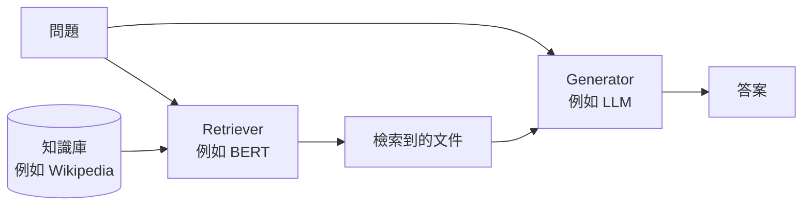

> 🌏 [English version](/posts/ai/2026-09-30-nthu-nlp-rag-retrievers-en)

> **版本說明**：本文依據清大資工高宏宇教授《[自然語言處理](https://github.com/IKMLab/NTHU_Natural_Language_Processing)》Fall 2025（114-1）的 [W11_RAG.pdf](https://github.com/IKMLab/NTHU_Natural_Language_Processing/blob/main/2025/Slides/W11_RAG.pdf)。這份投影片共 125 頁，本篇只涵蓋第 1–60 頁，到「From Retrievers to QA」那一頁為止；後半段在 [下一篇](/posts/ai/2026-09-30-nthu-nlp-rag-qa-advanced)。檔名雖然寫 W11，在 [2025 課表](https://github.com/IKMLab/NTHU_Natural_Language_Processing/blob/main/2025/README.md) 裡掛的是 W10 列，錄影是 [Week 10 Tue.](https://www.youtube.com/watch?v=VHkMHSkJ4I4) 與 [Week 10 Thu.](https://www.youtube.com/watch?v=SMVvvbXLYg4)；W10 列的 Topics 欄寫「Decoding Strategies and Evaluations」，那是課綱模板，和實際投影片對不起來。**兩支錄影各講到投影片第幾頁，本文沒有看片確認。**事實於 2026-09-30 核對。存取等級 **A3**：投影片與錄影都公開。

**系列位置**：上一篇 [Parameter-Efficient Fine-Tuning](/posts/ai/2026-09-30-nthu-nlp-peft)｜下一篇 [RAG（下）：從 ODQA 到 Self-RAG](/posts/ai/2026-09-30-nthu-nlp-rag-qa-advanced)｜[系列總覽](/posts/ai/2026-09-30-nthu-nlp-kao-course-guide)

上一篇講的是怎麼用少量參數把新知識「調進」模型。這篇換一條路：不改模型，改成在回答前先把相關資料找出來塞給它。

這篇回答一個問題：**LLM 會編答案，要怎麼先「找對資料」？稀疏向量和稠密向量各有什麼長處？**

## 課程影片來源

影片連結對應本文教材；此處不提供未核對的時間跳轉。

```youtube
url: https://www.youtube.com/watch?v=VHkMHSkJ4I4
title: Week 10 Tue.
```

```youtube
url: https://www.youtube.com/watch?v=SMVvvbXLYg4
title: Week 10 Thu.
```

原始影片：[Week 10 Tue.](https://www.youtube.com/watch?v=VHkMHSkJ4I4)、[Week 10 Thu.](https://www.youtube.com/watch?v=SMVvvbXLYg4)

課程與錄影入口：

- [官方課程與錄影入口](https://github.com/IKMLab/NTHU_Natural_Language_Processing/blob/main/2025/README.md)

## 幻覺與兩條緩解路線

投影片引用 [Ji et al. 2023](https://arxiv.org/abs/2202.03629) 的定義：自然語言生成模型常常產生無意義、或和輸入不一致的文字，這叫 hallucination。緩解方法列了兩條（外加一個「…」）：

- **Chain-of-Thought prompting**（[Wei et al., NeurIPS 2022](https://arxiv.org/abs/2201.11903)）：在 few-shot 範例裡放人寫的推理過程，例如「答案必須是人多的地方，選項裡只有 populated areas 人多，所以選 (a)」，讓模型先推理再作答。
- **Retrieval-Augmented Generation**：先從資料庫取回相關資訊，再根據它生成。

投影片用一個例子說明 RAG 的差別：問「歐本海默哪一年出生？」，沒有 RAG 的模型答 1967；檢索到維基百科那段「born April 22, 1904 … died February 18, 1967」之後，答案變成 1904。1967 是他過世的年份，模型把兩個數字搞混了。

為什麼需要 RAG？投影片引用 [NVIDIA 的說明](https://blogs.nvidia.com/blog/what-is-retrieval-augmented-generation/)：LLM 的參數化知識很廣，但缺少領域知識或資訊過時的時候就容易出錯，想深入某個最新或特定主題的使用者，單靠 LLM 滿足不了。投影片也引用 [Gao et al. 2023 的 RAG 綜述](https://arxiv.org/abs/2312.10997)（投影片註明收錄 182 篇參考文獻），用它的圖整理檢索來源（Wikipedia、知識圖譜、搜尋引擎……）、檢索粒度（句子、chunk、文件……）與檢索時機（一次、迭代、遞迴、自適應）。



## 檢索器在做什麼

Retriever 根據查詢找出相關文件，通常是比較「查詢向量」和「文件向量」的相似度。投影片強調它對 LLM 的表現影響很大，所以需要好的檢索器。

向量分兩種：

| | 稀疏向量 | 稠密向量 |
|---|---|---|
| 例子 | TF-IDF、BM25 | BERT、Sentence-BERT、DPR |
| 長相 | 維度等於詞彙表大小，大部分是 0 | 維度較小，每一維都是實數 |
| 優點 | 計算有效率，0 可以直接略過 | 抓得到語意，例如「the body of water」能對上「sea」 |

訓練檢索器也分兩種任務：**開放領域問答（ODQA）的檢索**是給一個問題、從一堆文件裡找出相關的那一份；**語意相似度的句向量**是給一個句子、找出語意相近的句子。投影片說 RAG 比較常用前者，但兩種都適合拿來檢索，看你的任務而定。

## 稀疏向量：詞袋、TF-IDF、BM25

投影片用五個字的小詞彙表舉例：詞彙表是 ["cat", "dog", "fish", "bird", "snake"]，一份只含 cat 和 dog 的文件，稀疏向量就是 [1, 1, 0, 0, 0]。

**Bag-of-words** 直接數次數。投影片用「This is a book」和「These are pens and my pen is here」兩句示範，第二句的 pen 欄是 2：表上的詞彙表沒有 pens 這一欄，pens 和 pen 被算在一起。

**TF-IDF** 把次數換成「詞頻 × 逆文件頻率」：一個詞在越少文件裡出現，專一性越高、權重越大。同樣兩句話，「is」兩句都有，所以在第一句的權重（0.38）比只在第一句出現的「book」（0.53）低。

**BM25**（Best Matching，[Robertson & Zaragoza 2009](https://doi.org/10.1561/1500000019)）是 TF-IDF 的改良版，多兩個超參數：

- **k1** 控制詞頻飽和：一個詞出現很多次，分數不會無限上升。投影片建議 k1 取 0 到 3 之間；k1 越大，詞頻的影響越大。
- **b** 控制文件長度正規化，讓長文件和短文件能公平競爭。
- k1 = 0、b = 0 時，詞頻完全被忽略。

## 稠密向量：[CLS] 夠用嗎？

稠密向量用緊湊的實數表示文字的語意特徵，前面學過的 Word2Vec 也是一種。問題是，句子的稠密向量從哪來？直覺是拿 BERT 的 [CLS]，投影片說不夠，理由有三：

- BERT 的預訓練任務是遮罩語言模型，不是為了句子語意設計的。
- [CLS] 不是為了當句向量而設計的。
- [CLS] 受上下文和位置編碼影響很大，語意上不穩定。

投影片舉了兩個例子。英文例：「The man is sitting on the chair.」和「A person is seated on a chair.」的相似度，居然可能低於「A dog is chasing a ball.」和「The stock market went up today.」。中文例：查詢「我昨天去運動跑步」，和「我昨天去健身房慢跑」的相似度，跟「我昨天在家看 Netflix」差不多。

## Dual Encoder 與 Sentence-BERT

**Dual encoder**（也叫 bi-encoder 或 Siamese network）用兩個相同或相似的編碼器分別處理兩段輸入，各自輸出向量，再算 cosine 相似度。資訊檢索時兩段輸入是文件和查詢，語意相似度時是兩個句子。

Siamese 網路不是新東西。投影片從 [Bromley et al. 1993](https://proceedings.neurips.cc/paper/1993/hash/288cc0ff022877bd3df94bc9360b9c5d-Abstract.html) 的簽名驗證講起，接著是人臉驗證（2005）、影像相似度（2015）、文字相似度（2016）。

**[Sentence-BERT](https://arxiv.org/abs/1908.10084)**（Reimers & Gurevych, EMNLP-IJCNLP 2019）把兩個共享權重的 BERT 做成 Siamese 結構。因為 BERT 對每個 token 都輸出一個向量，需要 pooling 才能得到固定長度的句向量，投影片列了三種：

- **CLS**：用 [CLS] 的向量，也是原始 BERT 的預設。
- **MEAN**：所有 token 向量取平均。
- **MAX**：每一維取所有 token 的最大值。

訓練時，兩個句向量 u、v 會和它們的逐元素差串接後送進分類器；推論時直接算 cosine。投影片的結論：[CLS] 確實可以代表整句，但 pooling 可能更好；實驗顯示加入逐元素差的串接方式最好，而且串接只在訓練時用。

## Bi-encoder 與 Cross-encoder

**Cross-encoder** 是把兩句話串在一起丟進同一個 BERT（「[CLS] 句子 A [SEP] 句子 B [SEP]」），兩句的表徵互相注意，最後用 [CLS] 代表兩句的關係。

差別在計算量。投影片的例子是 10,000 個句子兩兩比較：

| | 推論次數 |
|---|---|
| Cross-encoder | n·(n−1)/2 = 49,995,000 次 |
| Bi-encoder | 10,000 × 2 次（可以平行），再算 cosine |

投影片的判斷：兩者效能差距一般不大，但 bi-encoder 快非常多；資料庫超過一百萬份文件時，計算時間的差距會大到無法忽視。

## SimCSE：用 dropout 當資料增強

**[SimCSE](https://arxiv.org/abs/2104.08821)**（Gao, Yao & Chen, EMNLP 2021）是 dual encoder 加上對比學習，有兩種訓練方式：

- **無監督**：同一句話輸入兩次，因為 dropout 遮罩不同，會得到兩個略有差異的向量，把它們當正例拉近；其他句子當負例推開。Dropout 在這裡就是資料增強。
- **有監督**：用資料集裡的標籤定義正例和負例。

投影片先補了 dropout 和對比學習的背景（FaceNet、SimCLR 的圖），結論是 SimCSE 在語意相似度任務上贏過 Sentence-BERT。

## 開放領域問答的檢索：DPR

**ODQA** 是給一個問題（例如「英國的貨幣是什麼？」），模型要輸出答案（「pound」）。「開放」指的是模型不會拿到一份保證含有答案的文件。它像 SQuAD 這類閱讀理解，只是沒有提供相關文章。

**[DPR](https://aclanthology.org/2020.emnlp-main.550/)**（Karpukhin et al., EMNLP 2020）的做法：

- 兩個以 bert-base-uncased 為基礎的編碼器，一個編問題（E_Q），一個編段落（E_P），相似度是兩個向量的內積。
- 每筆訓練資料是一個問題、一個相關段落和 n 個不相關段落。
- Loss 是正例段落的負對數概似：拉近問題和相關段落，推開不相關的。

投影片標出的亮點：**只用 1,000 筆訓練資料就贏過 BM25。**

## Dual Encoder 的極限與 GTR

投影片引用 [Ni et al.（EMNLP 2022）](https://aclanthology.org/2022.emnlp-main.669/) 指出 dual encoder 的兩個疑慮：換到別的領域常常檢索不好；最後只用內積或 cosine 這個「瓶頸層」，可能不足以捕捉語意相關性。

**GTR**（Generalizable T5-based Retriever）問的是：瓶頸層不變，只把編碼器放大，能不能改善檢索？它用 T5 的 encoder，從 Base 到 XXL 共四種大小（110M、335M、1.24B、4.8B 參數）。答案是可以：在 BEIR 所有任務（不含 MS MARCO）上，模型越大，跨領域的 Recall@100 和 NDCG@100 越好。投影片在這裡也放了 [ColBERT](https://arxiv.org/abs/2004.12832) 的圖，對照查詢和文件的各種互動方式。

GTR 分兩階段訓練：

1. 用 Reddit、Stack Overflow 等來源的 20 億組問答對預訓練。
2. 用 MS MARCO 和 NaturalQuestions 微調。

**[MS MARCO](https://arxiv.org/abs/1611.09268)** 是 Microsoft 2016 年的機器閱讀理解資料集，2018 年改成檢索用，包含 880 萬個網頁段落和 100 萬個真實查詢，每個查詢通常只標一份（或很少幾份）相關文件。GTR 的另一個發現：有預訓練的話，只需要 10% 的 MS MARCO 監督資料就能達到最好的跨領域表現。

投影片最後用一張表總結五個模型的設計：

| | BERT | Sentence-BERT | SimCSE | DPR | GTR |
|---|---|---|---|---|---|
| 編碼器類型 | Cross | Dual | Dual | Dual | Dual |
| 共享權重 | 不適用 | 是 | 是 | 否（問題與段落各一個編碼器） | 是 |

這一段以 [BEIR](https://arxiv.org/abs/2104.08663) 作結：一個專門測檢索模型 zero-shot 能力的異質基準。接下來那一頁「From Retrievers to QA」把檢索器接回生成器（投影片註明生成器也叫 reader，因為 QA 是閱讀理解任務），那是 [下一篇](/posts/ai/2026-09-30-nthu-nlp-rag-qa-advanced) 的起點。

## 自學怎麼用這一講

1. 先看 [Week 10 Tue. 錄影](https://www.youtube.com/watch?v=VHkMHSkJ4I4)，對照投影片第 1–42 頁（幻覺到 SimCSE）。
2. 用 scikit-learn 的 `TfidfVectorizer` 對投影片那兩句話跑一次，看能不能重現表上的數字（投影片引用的是 [tsmatz 的 notebook](https://github.com/tsmatz/nlp-tutorials/blob/master/01_sparse_vector.ipynb)）。
3. 用 [sentence-transformers](https://www.sbert.net/) 載入一個 bi-encoder 和一個 cross-encoder，拿投影片的中文例子（跑步／慢跑／看 Netflix）比分數，再比速度。
4. 本系列的 [RAG 實作與 HW4](/posts/ai/2026-09-30-nthu-nlp-rag-lab-hw4) 會用到這裡的 embedding 與檢索概念。

今晚可以做的一件事：拿你手上的 RAG 系統，找三個「關鍵字完全不重疊但語意相同」的查詢，看檢索器找不找得到。找不到，就是該把 BM25 換成（或混合）稠密檢索的訊號。

## 延伸閱讀

- 另一門課怎麼講同一批檢索器：[CS224U 資訊檢索：從 classical IR、IR 指標到 neural IR](/posts/ai/2026-09-29-cs224u-information-retrieval)
- RAG 與 language agent 的元件拆解：[CS224N 第 10 講：RAG 與 Language Agents](/posts/ai/2026-08-22-cs224n-rag-language-agents)
- 工程面的 RAG 技法總整理：[RAG 技法大全](/posts/ai/2026-03-14-rag-patterns-complete-guide)
- 中文 embedding 在 RAG 裡常見的坑：[繁中 embedding 的 RAG 失敗模式](/posts/ai/2026-06-04-zh-tw-embedding-rag-failures)

## 更新紀錄

- 2026-10-10：補上課程影片來源與錄影取得方式。

## 參考資料

- [IKMLab/NTHU_Natural_Language_Processing（GitHub）](https://github.com/IKMLab/NTHU_Natural_Language_Processing) — 課程 repo
- [2025 課表 README](https://github.com/IKMLab/NTHU_Natural_Language_Processing/blob/main/2025/README.md) — W10 列掛的投影片與錄影
- [W11_RAG.pdf](https://github.com/IKMLab/NTHU_Natural_Language_Processing/blob/main/2025/Slides/W11_RAG.pdf) — 本文依據第 1–60 頁
- [[Fall 2025] Week 10 Tue. 錄影](https://www.youtube.com/watch?v=VHkMHSkJ4I4)
- [[Fall 2025] Week 10 Thu. 錄影](https://www.youtube.com/watch?v=SMVvvbXLYg4)
- [Ji et al., Survey of Hallucination in Natural Language Generation (ACM Computing Surveys 2023)](https://arxiv.org/abs/2202.03629)
- [Wei et al., Chain-of-Thought Prompting Elicits Reasoning in Large Language Models (NeurIPS 2022)](https://arxiv.org/abs/2201.11903)
- [Gao et al., Retrieval-Augmented Generation for Large Language Models: A Survey (2023)](https://arxiv.org/abs/2312.10997)
- [NVIDIA, What Is Retrieval-Augmented Generation](https://blogs.nvidia.com/blog/what-is-retrieval-augmented-generation/)
- [Robertson & Zaragoza, The Probabilistic Relevance Framework: BM25 and Beyond (2009)](https://doi.org/10.1561/1500000019)
- [Bromley et al., Signature Verification using a "Siamese" Time Delay Neural Network (NeurIPS 1993)](https://proceedings.neurips.cc/paper/1993/hash/288cc0ff022877bd3df94bc9360b9c5d-Abstract.html)
- [Reimers & Gurevych, Sentence-BERT (EMNLP-IJCNLP 2019)](https://arxiv.org/abs/1908.10084)
- [Gao, Yao & Chen, SimCSE (EMNLP 2021)](https://arxiv.org/abs/2104.08821)
- [Karpukhin et al., Dense Passage Retrieval for Open-Domain Question Answering (EMNLP 2020)](https://aclanthology.org/2020.emnlp-main.550/)
- [Ni et al., Large Dual Encoders Are Generalizable Retrievers (EMNLP 2022)](https://aclanthology.org/2022.emnlp-main.669/)
- [Khattab & Zaharia, ColBERT (SIGIR 2020)](https://arxiv.org/abs/2004.12832)
- [Nguyen et al., MS MARCO (2016)](https://arxiv.org/abs/1611.09268)
- [Thakur et al., BEIR (NeurIPS 2021 Datasets and Benchmarks)](https://arxiv.org/abs/2104.08663)
- [tsmatz/nlp-tutorials: 01_sparse_vector.ipynb](https://github.com/tsmatz/nlp-tutorials/blob/master/01_sparse_vector.ipynb) — 投影片 TF-IDF 例子的出處
