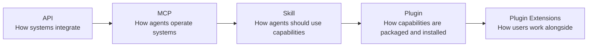

> 🌏 [中文版](/posts/ai/2026-09-30-openai-plugin-extensions)

I've been watching OpenAI's plugins for a while, for a simple reason: if they take off, the way a lot of software gets used will change with them. [OpenAI DevDay 2026](https://openai.com/index/devday-2026-recap/) on September 29, 2026 had a plugin story again, and this time it's called **Plugin Extensions**.

The one-line version: **plugins can now have their own screens inside ChatGPT.** Your app can have a home in the sidebar, a working panel next to the conversation, and a viewer that takes over when a user opens one of your file types.

This post covers three things: what Plugin Extensions actually do, how they sit on top of MCP and Skills, and what they mean for the question of what form software should take.

## What a plugin is now

First, terminology. The [ChatGPT plugins of 2023](https://openai.com/index/chatgpt-plugins/) were an `ai-plugin.json` plus an OpenAPI spec that let the model call an external API; they were shut down in 2024 in favor of GPTs. Today's plugin is a different thing.

OpenAI's developer docs define it as:

> Build and publish plugins with skills, MCP servers, and optional UI.
> — [OpenAI Developers: Plugins](https://developers.openai.com/plugins)

Broken down, a plugin can currently contain:

| Component | What it answers | Format |
|---|---|---|
| Skill | How the agent **should** do the work | `skills/<name>/SKILL.md` ([Agent Skills](https://agentskills.io/) open format) |
| MCP server | What the agent **can** do | `mcp.json` ([MCP](https://modelcontextprotocol.io/)) |
| External services and data | The real systems and permissions | APIs and auth behind the MCP server |
| UI | How the user **works alongside** the agent | MCP App `ui://` resources + Plugin Extensions entrypoints |

Packaging uses [Agent Plugins 1.0](/en/posts/ai/2026-08-21-agent-plugins-open-standard-en), released in August: a root `plugin.json`, with OpenAI-specific settings under `extensions.com.openai`. The [packaging docs](https://developers.openai.com/plugins/build/plugins) are explicit that UI isn't part of the package format:

> UI and authentication remain part of the MCP server integration you built in the preceding steps; the plugin manifest connects that integration to the rest of the package.

In other words, **the UI lives in the MCP server, and the plugin is the shell that ties it to the skills.**

Distribution was consolidated in July. On [July 9, 2026](https://openai.com/index/chatgpt-for-your-most-ambitious-work/) the Codex app merged into the new ChatGPT desktop app, and the App Directory became a unified Plugin Directory. The docs: "Public plugins are published once to the universal plugin directory shared by ChatGPT and Codex." Publish once, install in both.

## What Plugin Extensions add

From the DevDay recap:

> Plugin extensions let you give your plugin a home in the sidebar and build interactive panels where people can work alongside the conversation. You can also create viewers for the file types your product supports.
> — [DevDay 2026 Recap](https://openai.com/index/devday-2026-recap/)

In the [official docs](https://developers.openai.com/plugins/build/extensions) and the [`openai/mcp-extensions` spec](https://github.com/openai/mcp-extensions/blob/main/docs/spec.md), these map to three entrypoints:

| Common name | Docs name | Spec type | What users see |
|---|---|---|---|
| Sidebar Home | Sidebar apps | `global` | Open your app from the sidebar and work in it fullscreen |
| Interactive Panel | Conversation panels | `thread` | Open your app in a side-panel tab next to the chat |
| File Viewer | File viewers and editors | `file` | Your app renders files with the extensions you support |

The spec allows up to three entrypoints per MCP App. Around them sit smaller extensions: plugin settings, display modes, deep links, composer @-mentions, and rich forms for structured input.

### How you declare them

Entrypoints aren't a separate SDK. You add `_meta` when registering an MCP App tool. The sidebar example from the docs:

```ts
import type { OpenAIUiToolMetadata } from "@openai/mcp-extensions/server";

const toolMetadata = {
  ui: { resourceUri: "ui://parts/library" },
  "openai/ui": {
    entrypoints: [{ type: "global" }],
  } satisfies OpenAIUiToolMetadata,
};
```

A file viewer just changes the type and lists extensions:

```ts
"openai/ui": {
  entrypoints: [{ type: "file", extensions: ["stl"] }],
}
```

`ui://parts/library` is an [MCP Apps](https://blog.modelcontextprotocol.io/posts/2026-01-26-mcp-apps/) resource. MCP Apps was [proposed in November 2025](https://blog.modelcontextprotocol.io/posts/2025-11-21-mcp-apps/) by Anthropic, OpenAI, and the MCP-UI community, became MCP's first official extension in January 2026, and is supported by both Claude and ChatGPT. The design of Plugin Extensions is: **the UI itself uses the shared standard; where it appears in ChatGPT is described by proprietary `openai/*` extensions.**

### Platform support

Not every entrypoint works everywhere. From the spec's support table (checked 2026-09-30):

| Feature | Desktop | Web | iOS | Android |
|---|---|---|---|---|
| Sidebar (global) | ✅ | ✅ | ✅ | ✅ |
| Conversation panel (thread) | ✅ | ✅ | ✅ | ✅ |
| File viewer (file) | ✅ | ❌ | ❌ | ❌ |
| Composer @-mentions | ✅ | ❌ | ❌ | ❌ |
| Rich forms | ✅ | ✅ | ❌ | ❌ |

The recap says "Available to all plans," but the docs add that web support for Free and Go users is "coming soon." File viewers are desktop-only for now — the biggest caveat for any team planning one.

## From Agent → Tool to Agent → Plugin

Line up the last few years and each layer answers a question the previous one left open:



**MCP: Agent → Tool.** The agent knows which tools exist and calls them. But a tool only says what it can do, not how to combine tools in a given situation.

**Skill: Agent → Skill → Tool.** Skills write down process knowledge. OpenAI added [Agent Skills support to Codex](https://developers.openai.com/codex/changelog) in December 2025, and later made "instructions become a skill" the migration path for Custom GPTs — the [retirement FAQ](https://help.openai.com/en/articles/20001519-custom-gpt-retirement-and-migration-faq) says Custom GPTs retire on December 11, 2026, with knowledge files copied into the plugin's reference files.

**Plugin: capabilities become an installable unit.** Skills ship with the MCP servers they depend on, published once to ChatGPT and Codex.

**Plugin Extensions: Agent → Plugin → Skill / MCP → UI.** The last piece is user experience. Before, an MCP App's UI appeared inside a single reply and scrolled away with the conversation. Now it can live in the sidebar or sit beside the chat while the user and the agent work on the same thing.

At this point a plugin doesn't look much like an "add-on" anymore. It has its own home screen, workspace, and file handling. It looks more like an app running inside ChatGPT.

## A new question for product design

When designing a product, we used to ask: **what APIs should we expose?**

The past two years added: **what MCP tools should we give agents?**

Now there's probably one more: **which of my product's capabilities should become a plugin that an agent can install?**

| Layer | Question it answers | What the product team ships |
|---|---|---|
| API | How systems integrate | REST / GraphQL endpoints, auth |
| MCP | How agents operate the system | Well-scoped tools with clear schemas and descriptions |
| Skill | How agents should use those capabilities | Common workflows, judgment rules, examples |
| Plugin | How capabilities get found and installed | `plugin.json`, directory listing, permission disclosures |
| Plugin Extensions | How users work alongside | Sidebar home, conversation panel, file viewer |

This changes the question users ask. It used to be "Do you have an app?" or "Do you have an API?" Next, it's likely to be: **"Can I use it in ChatGPT?"**

A concrete way to decide: take the workflow users repeat most often in your product and ask three things —

1. Can it be broken into tools an agent can call? (MCP)
2. Can the right way to do it be written as a SKILL.md? (Skill)
3. Does the user need to see or adjust something before it's done? If so, it's a conversation-panel candidate; if your product has its own file format, it's a file-viewer candidate. (Plugin Extensions)

Something you can do tonight: list your product's three most common operations and mark yes or no against each of those three questions.

## Limits to think through first

**Platform risk.** Plugin Extensions put your interface inside OpenAI's product; review, ranking, and release cadence aren't yours to control. DevDay also announced Plugin Creator, a redesigned submission flow, and better ranking in the directory and in conversations — all good, but it also means OpenAI's ranking decides your exposure.

**Entrypoints are ChatGPT-only.** The UI itself is MCP Apps and can render in other hosts like Claude, but the `global`, `thread`, and `file` entrypoints are `openai/*` extensions; other hosts don't have those slots. If you want to serve several agent platforms, keep your core UI on the shared MCP Apps surface and treat entrypoint declarations as a thin adapter.

**Monetization is still narrow.** The [monetization docs](https://developers.openai.com/plugins/build/monetization) recommend external checkout on your own domain, and "current approval is limited to plugins for physical goods purchases." Embedded checkout with the ChatGPT payment sheet is a beta for select marketplace partners.

**The Custom GPT migration gap.** Custom actions don't transfer in the migration; you have to rebuild them as an MCP server. Anyone still running a GPT needs to schedule that before December 11.

## Overall

MCP lets agents operate systems, Skills tell agents how to use them, Plugins make those capabilities installable and distributable, and Plugin Extensions fill in the last piece: user experience.

Following the line API → MCP → Skill → Plugin → Plugin Extensions, the question has moved from "which interfaces do I expose?" to "in what form should my product be used?" The entry point to next-generation software may not only be your own app, but a slot in the sidebar of someone else's agent.

## References

- [DevDay 2026 Recap — OpenAI](https://openai.com/index/devday-2026-recap/)
- [Plugin Extensions — OpenAI Developers](https://developers.openai.com/plugins/build/extensions)
- [openai/mcp-extensions spec (spec.md)](https://github.com/openai/mcp-extensions/blob/main/docs/spec.md)
- [Plugins — OpenAI Developers](https://developers.openai.com/plugins)
- [Package your plugin — OpenAI Developers](https://developers.openai.com/plugins/build/plugins)
- [Checkout API reference (monetization) — OpenAI Developers](https://developers.openai.com/plugins/build/monetization)
- [ChatGPT is now a partner for your most ambitious work (2026-07-09) — OpenAI](https://openai.com/index/chatgpt-for-your-most-ambitious-work/)
- [Custom GPT retirement and migration FAQ — OpenAI Help Center](https://help.openai.com/en/articles/20001519-custom-gpt-retirement-and-migration-faq)
- [ChatGPT plugins (2023) — OpenAI](https://openai.com/index/chatgpt-plugins/)
- [Codex changelog — OpenAI Developers](https://developers.openai.com/codex/changelog)
- [MCP Apps proposal (2025-11-21) — MCP Blog](https://blog.modelcontextprotocol.io/posts/2025-11-21-mcp-apps/)
- [MCP Apps launch (2026-01-26) — MCP Blog](https://blog.modelcontextprotocol.io/posts/2026-01-26-mcp-apps/)
- [Agent Skills specification](https://agentskills.io/)
- [Model Context Protocol](https://modelcontextprotocol.io/)
- [Agent Plugins 1.0: a packaging standard for AI agent extensions](/en/posts/ai/2026-08-21-agent-plugins-open-standard-en)
- [The protocol layer: what MCP, A2A, ACP, and Skills each solve](/en/posts/ai/2026-08-10-mcp-a2a-skills-protocol-layer-en)
