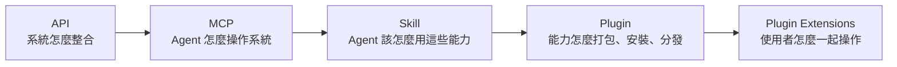

> 🌏 [English version](/en/posts/ai/2026-09-30-openai-plugin-extensions-en)

我一直在關注 OpenAI 的 plugin。理由很單純：它一旦做起來，很多軟體的使用方式都會跟著改。2026 年 9 月 29 日的 [OpenAI DevDay 2026](https://openai.com/index/devday-2026-recap/) 果然又有 plugin 的戲，這次叫 **Plugin Extensions**。

一句話講完：**plugin 可以在 ChatGPT 裡有自己的畫面了**。側邊欄可以放一個你的 App 首頁，對話旁邊可以開一個你的工作面板，使用者點開某種副檔名時可以由你的檢視器接手。

這篇整理三件事：Plugin Extensions 實際做了什麼、它怎麼接在 MCP 與 Skill 上面，以及它對「產品要用什麼形式被使用」這題的意義。

## Plugin 現在是什麼

先對齊名詞。2023 年的 [ChatGPT plugins](https://openai.com/index/chatgpt-plugins/) 是一份 `ai-plugin.json` 加一份 OpenAPI 規格，讓模型能呼叫外部 API；它在 2024 年被 GPTs 取代後收掉。今天說的 plugin 是另一個東西。

OpenAI 開發者文件對 plugin 的定義是：

> Build and publish plugins with skills, MCP servers, and optional UI.
> —— [OpenAI Developers: Plugins](https://developers.openai.com/plugins)

拆開來看，一個 plugin 目前可以包含：

| 組件 | 解決什麼 | 格式 |
|---|---|---|
| Skill | agent **應該怎麼做** | `skills/<name>/SKILL.md`（[Agent Skills](https://agentskills.io/) 開放格式） |
| MCP server | agent **能做什麼** | `mcp.json`（[MCP](https://modelcontextprotocol.io/)） |
| 外部服務與資料 | 真正的系統與權限 | 由 MCP server 背後的 API 與驗證處理 |
| UI | 使用者**怎麼一起操作** | MCP App 的 `ui://` 資源 + Plugin Extensions 入口 |

打包格式採用 8 月發佈的 [Agent Plugins 1.0](/posts/ai/2026-08-21-agent-plugins-open-standard)：根目錄一份 `plugin.json`，OpenAI 專屬設定放在 `extensions.com.openai` 底下。[打包文件](https://developers.openai.com/plugins/build/plugins)寫得很清楚，UI 不是打包格式的一部分：

> UI and authentication remain part of the MCP server integration you built in the preceding steps; the plugin manifest connects that integration to the rest of the package.

換句話說，**UI 住在 MCP server 裡，plugin 是把它和 skill 綁在一起的外殼**。

發佈這一端也在 7 月整併過。[2026 年 7 月 9 日](https://openai.com/index/chatgpt-for-your-most-ambitious-work/) Codex app 併入新的 ChatGPT 桌面版，原本的 App Directory 改成統一的 Plugin Directory。文件寫的是：「Public plugins are published once to the universal plugin directory shared by ChatGPT and Codex.」——發佈一次，ChatGPT 和 Codex 都能裝。

## Plugin Extensions 加了什麼

DevDay recap 的原文：

> Plugin extensions let you give your plugin a home in the sidebar and build interactive panels where people can work alongside the conversation. You can also create viewers for the file types your product supports.
> —— [DevDay 2026 Recap](https://openai.com/index/devday-2026-recap/)

對應到[官方文件](https://developers.openai.com/plugins/build/extensions)與 [`openai/mcp-extensions` 規格](https://github.com/openai/mcp-extensions/blob/main/docs/spec.md)，是三種入口（entrypoint）：

| 常見說法 | 文件名稱 | spec 類型 | 使用者看到什麼 |
|---|---|---|---|
| Sidebar Home | Sidebar apps | `global` | 從側邊欄打開你的 App，全螢幕操作 |
| Interactive Panel | Conversation panels | `thread` | 在對話旁的側欄分頁打開你的 App，邊聊邊做 |
| File Viewer | File viewers and editors | `file` | 使用者打開特定副檔名的檔案時，由你的 App 呈現 |

spec 規定每個 MCP App 最多三個入口。除此之外還有 plugin 設定頁、顯示模式、deep link、composer 裡的 @ 提及、rich forms（結構化表單輸入）等周邊擴充。

### 宣告方式

入口不是另一套 SDK，而是在註冊 MCP App tool 時多帶一段 `_meta`。文件裡的側邊欄範例：

```ts
import type { OpenAIUiToolMetadata } from "@openai/mcp-extensions/server";

const toolMetadata = {
  ui: { resourceUri: "ui://parts/library" },
  "openai/ui": {
    entrypoints: [{ type: "global" }],
  } satisfies OpenAIUiToolMetadata,
};
```

檔案檢視器只是換個 type 並列出副檔名：

```ts
"openai/ui": {
  entrypoints: [{ type: "file", extensions: ["stl"] }],
}
```

`ui://parts/library` 是一個 [MCP Apps](https://blog.modelcontextprotocol.io/posts/2026-01-26-mcp-apps/) 資源。MCP Apps 是 2025 年 11 月由 Anthropic、OpenAI 與 MCP-UI 社群[共同提出](https://blog.modelcontextprotocol.io/posts/2025-11-21-mcp-apps/)、2026 年 1 月成為 MCP 第一個官方擴充的規格，Claude 與 ChatGPT 都支援。Plugin Extensions 的設計是：**UI 本體沿用共用標準，「放在 ChatGPT 哪裡」用 `openai/*` 私有擴充描述**。

### 平台支援

不是每個入口在每個平台都有。依 spec 的支援表（2026-09-30 查詢）：

| 功能 | 桌面版 | Web | iOS | Android |
|---|---|---|---|---|
| Sidebar（global） | ✅ | ✅ | ✅ | ✅ |
| Conversation panel（thread） | ✅ | ✅ | ✅ | ✅ |
| File viewer（file） | ✅ | ❌ | ❌ | ❌ |
| Composer @ 提及 | ✅ | ❌ | ❌ | ❌ |
| Rich forms | ✅ | ✅ | ❌ | ❌ |

recap 寫「Available to all plans」，但文件補了一句：Web 版的 Free 與 Go 使用者「coming soon」。檔案檢視器目前只在桌面版，這對想做 file viewer 的團隊是最大的前提。

## 從 Agent → Tool 到 Agent → Plugin

把這幾年的演進串起來，每一層都在補上一層沒回答的問題：



**MCP 階段：Agent → Tool。** Agent 知道有哪些工具，然後呼叫它。問題是工具只說明「能做什麼」，不說明「什麼情況該怎麼組合」。

**Skill 階段：Agent → Skill → Tool。** Skill 把流程知識寫下來。OpenAI 在 2025 年 12 月讓 [Codex 支援 Agent Skills](https://developers.openai.com/codex/changelog)，之後又把 Custom GPT 的遷移路徑定成「instructions 轉成 skill」——[GPT 退場 FAQ](https://help.openai.com/en/articles/20001519-custom-gpt-retirement-and-migration-faq) 寫明 Custom GPTs 將在 2026 年 12 月 11 日退場，知識檔會變成 plugin 的 reference files。

**Plugin 階段：能力變成可安裝的單位。** Skill 和它依賴的 MCP server 一起打包，一次發佈到 ChatGPT 與 Codex。

**Plugin Extensions 階段：Agent → Plugin → Skill / MCP → UI。** 最後補的是使用者體驗。以前 MCP App 的 UI 只能出現在某一則回覆裡，對話捲上去就不見了；現在它可以常駐在側邊欄，或開在對話旁邊，跟 agent 同時操作同一份東西。

到這一步，plugin 已經不太像傳統認知裡的「外掛」。它有自己的首頁、工作區、檔案格式處理，更像一個跑在 ChatGPT 裡面的 App。

## 對產品設計多出來的一題

過去設計產品時，我們會問：**要提供哪些 API？**

這兩年多了一題：**要提供哪些 MCP Tool 給 Agent？**

現在大概還得再問一題：**我的產品，有哪些能力應該直接變成一個可以被 Agent 安裝的 Plugin？**

| 層 | 回答的問題 | 產品團隊要交出的東西 |
|---|---|---|
| API | 系統怎麼整合 | REST / GraphQL endpoint、驗證 |
| MCP | Agent 怎麼操作系統 | 粒度對的 tool、清楚的 schema 與描述 |
| Skill | Agent 應該怎麼用這些能力 | 常見工作流程、判斷準則、範例 |
| Plugin | 能力怎麼被找到、安裝 | `plugin.json`、目錄上架、權限說明 |
| Plugin Extensions | 使用者怎麼一起操作 | 側邊欄首頁、對話面板、檔案檢視器 |

這會直接改變使用者問的問題。以前是「你們有 App 嗎？」「有 API 嗎？」；接下來很可能是：**「我可以在 ChatGPT 上用它嗎？」**

一個具體的判斷方式：挑產品裡使用者最常重複做的一個流程，問三件事——

1. 這個流程能不能拆成 agent 可呼叫的 tool？（MCP）
2. 做這件事的「正確做法」能不能寫成一份 SKILL.md？（Skill）
3. 使用者做完之前需不需要看到或調整一個畫面？需要就是 conversation panel 的候選；如果你的產品有自己的檔案格式，就是 file viewer 的候選。（Plugin Extensions）

今晚就能做的動作：把你產品最常見的三個操作列出來，對著上面三題各打一個勾或叉。

## 要先想清楚的限制

**平台風險。** Plugin Extensions 讓你的介面跑在 OpenAI 的產品裡，審核、排名、改版節奏都不在你手上。DevDay 同時宣布了新的 Plugin Creator、重新設計的上架流程、目錄與對話中的推薦排名——這些都是好事，但也代表曝光由 OpenAI 的排序決定。

**入口是 ChatGPT 專屬的。** UI 本體是 MCP Apps，可以在 Claude 等其他 host 顯示；但 `global`、`thread`、`file` 這三種入口是 `openai/*` 擴充，換一個 host 就沒有這些位置。如果你想同時經營多個 agent 平台，核心 UI 最好只依賴 MCP Apps 的共用部分，把入口宣告當成一層薄薄的轉接。

**變現還很窄。** [變現文件](https://developers.openai.com/plugins/build/monetization)寫的是建議走外部結帳（在你自己的網域完成付款），而且「current approval is limited to plugins for physical goods purchases」；用 ChatGPT 付款介面的內嵌結帳只對少數 marketplace 夥伴開放 beta。

**Custom GPT 遷移的斷層。** Custom actions 不會隨遷移轉過去，要自己重寫成 MCP server。還在經營 GPT 的人，12 月 11 日前要把這件事排進去。

## 整體來說

MCP 讓 agent 能操作系統，Skill 讓 agent 知道怎麼用，Plugin 讓這些能力能被安裝與分發，Plugin Extensions 把最後一塊使用者體驗補起來。

API → MCP → Skill → Plugin → Plugin Extensions，這條線走下來，問題已經從「我要開放哪些介面」變成「我的產品要以什麼形式被使用」。下一代軟體的入口，可能不只是你自己的 App，而是別人的 agent 裡面那一格側邊欄。

## 參考資料

- [DevDay 2026 Recap — OpenAI](https://openai.com/index/devday-2026-recap/)
- [Plugin Extensions — OpenAI Developers](https://developers.openai.com/plugins/build/extensions)
- [openai/mcp-extensions 規格（spec.md）](https://github.com/openai/mcp-extensions/blob/main/docs/spec.md)
- [Plugins — OpenAI Developers](https://developers.openai.com/plugins)
- [Package your plugin — OpenAI Developers](https://developers.openai.com/plugins/build/plugins)
- [Checkout API reference（變現）— OpenAI Developers](https://developers.openai.com/plugins/build/monetization)
- [ChatGPT is now a partner for your most ambitious work（2026-07-09）— OpenAI](https://openai.com/index/chatgpt-for-your-most-ambitious-work/)
- [Custom GPT retirement and migration FAQ — OpenAI Help Center](https://help.openai.com/en/articles/20001519-custom-gpt-retirement-and-migration-faq)
- [ChatGPT plugins（2023）— OpenAI](https://openai.com/index/chatgpt-plugins/)
- [Codex changelog — OpenAI Developers](https://developers.openai.com/codex/changelog)
- [MCP Apps 提案（2025-11-21）— MCP Blog](https://blog.modelcontextprotocol.io/posts/2025-11-21-mcp-apps/)
- [MCP Apps 正式發佈（2026-01-26）— MCP Blog](https://blog.modelcontextprotocol.io/posts/2026-01-26-mcp-apps/)
- [Agent Skills 規格](https://agentskills.io/)
- [Model Context Protocol](https://modelcontextprotocol.io/)
- [Agent Plugins 1.0：統一 AI Agent 擴充的封裝標準](/posts/ai/2026-08-21-agent-plugins-open-standard)
- [協定層：MCP、A2A、ACP、Skills 各解什麼問題](/posts/ai/2026-08-10-mcp-a2a-skills-protocol-layer)
