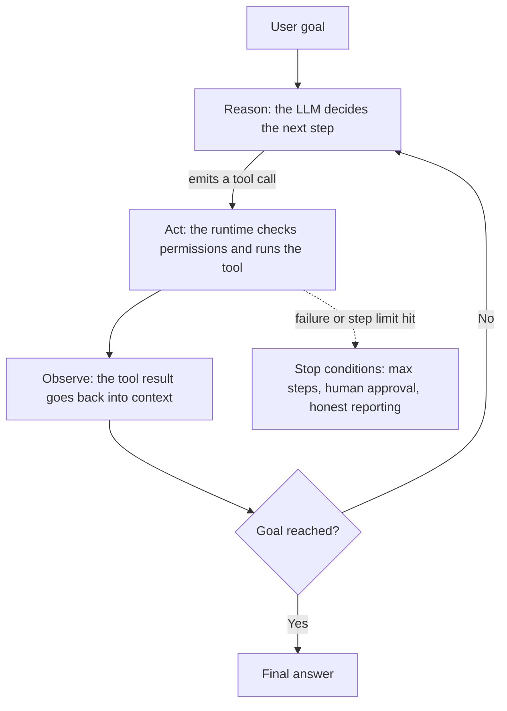
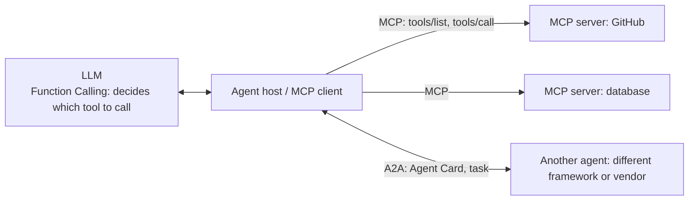
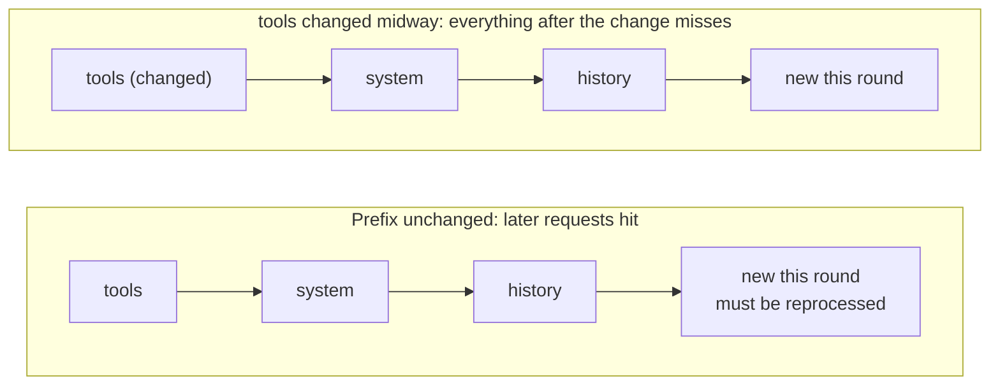

> 🌏 [中文版](/posts/ai/2026-10-03-ai-interview-agent-mcp-caching)

When an interviewer asks about agents, they rarely want framework names. They want to see whether you can walk the whole chain: how a model says "I want to call a tool", how its output is guaranteed to be machine-readable, what to do when there are too many tools for the prompt, where memory lives, and how to keep cost down. This is part 13 of the "AI Engineer Interview Prep" series, and it ties those questions into one thread: the agent loop first, then Structured Output and Function Calling, then tool scale and memory, and finally MCP, A2A and Prompt Caching.

Every section has the same shape: the concept, then the mechanism or comparison, then a short "How to answer" you can say out loud. The fast-moving parts (MCP spec history, provider caching prices) were checked against primary sources, and the query date is stated.

## What an Agent Is: A Loop That Decides Its Own Next Step

In [Building effective agents](https://www.anthropic.com/engineering/building-effective-agents), Anthropic splits agentic systems into two kinds. Workflows are "systems where LLMs and tools are orchestrated through predefined code paths", while agents are "systems where LLMs dynamically direct their own processes and tool usage". The difference is not whether tools exist. It is who picks the next step: hard-coded logic, or the model on the spot.

The "think a step, act a step, read the result, think again" structure comes from [ReAct](https://arxiv.org/abs/2210.03629) (Yao et al., ICLR 2023). Drawn as a flow, it is the diagram that shows up on every interview whiteboard:



The point people most often get wrong: the LLM never executes a tool itself. It produces a structured call instruction, and the runtime outside the model does the actual work. As code, the loop looks like this:

```python
messages = [{"role": "user", "content": goal}]
for step in range(MAX_STEPS):                    # max steps: the first safeguard against infinite loops
    reply = llm.chat(messages, tools=tools)
    if not reply.tool_calls:                     # the model asks for no more tools, so it is done
        return reply.text
    for call in reply.tool_calls:
        result = run_tool(call.name, call.arguments)    # the runtime checks permissions before executing
        messages.append(tool_message(call.id, result))  # result goes back into context for the next round
raise StepLimitExceeded
```

Since 2025 every major vendor has shipped its own agent SDK. For interviews you only need each one's positioning and date:

| Framework | When | Positioning |
|---|---|---|
| [OpenAI Agents SDK](https://openai.com/index/new-tools-for-building-agents) | 2025-03 | Successor to Swarm; core primitives are handoffs, guardrails and tracing |
| [Google ADK](https://developers.googleblog.com/en/agent-development-kit-easy-to-build-multi-agent-applications) | 2025-04 | Open-source multi-agent toolkit, Python first |
| [Claude Agent SDK](https://www.anthropic.com/news/enabling-claude-code-to-work-more-autonomously) | 2025-09 | Renamed from Claude Code SDK; ships subagents and hooks |
| [LangGraph](https://github.com/langchain-ai/langgraph) | Evolving | Graph state machine with nodes, edges and checkpoints; see the [LangGraph guide](/en/posts/ai/2026-03-27-langgraph-agent-orchestration-en) |
| [CrewAI](https://github.com/crewAIInc/crewAI) | Evolving | Role-based team model; see the [CrewAI guide](/en/posts/ai/2026-08-21-crewai-multi-agent-framework-en) |

More frameworks is not better. The same Anthropic article suggests starting with direct LLM API calls, because frameworks "often create extra layers of abstraction that can obscure the underlying prompts and responses", which makes debugging harder. For a fuller taxonomy, see the [AI Agent patterns guide](/en/posts/ai/2026-03-18-ai-agent-patterns-guide-en); for the different shapes the loop takes, see [agent loop shapes in coding agents](/en/posts/ai/2026-08-25-coding-agent-agent-loop-shapes-en).

**How to answer**

> An agent is a system where an LLM decides the next step inside a loop: reason, call a tool, read the result, reason again until the goal is met. The idea traces back to ReAct. The LLM only emits a structured call; an external runtime does the executing, so permissions, step limits and error handling belong in the runtime. If the flow is fixed, a workflow is enough, because an agent trades latency and cost for flexibility.

## Structured Output: Blocking Illegal Output at the Token Level

By default an LLM emits free text, but programs need parseable JSON. There are three layers of fix, each more reliable than the last:

| Approach | How it works | Limits |
|---|---|---|
| Ask for JSON in the prompt, retry on failure | Instructions plus a retry loop | No guarantee; retries add latency and cost |
| Fine-tune the model to "get used to" the format | Training exposes it to the target format | Probabilistic; it can still break |
| Constrained decoding | Decoding excludes tokens that are illegal under the schema | Needs a grammar engine and inference-framework support |

The core of constrained decoding is short: use a finite state machine (FSM) or a context-free grammar (CFG) to track where you are inside the JSON, compute the set of legal next tokens, and mask the rest. The [Outlines paper](https://arxiv.org/abs/2307.09702) describes the FSM-based approach, and Microsoft's [guidance](https://github.com/guidance-ai/guidance) is another implementation.

```python
# The core of constrained decoding: at each step, compute the currently legal tokens and set every other logit to -inf
allowed = grammar_state.allowed_tokens()    # derived from the current FSM or CFG state
logits[~allowed] = float("-inf")
next_token = sample(softmax(logits))
grammar_state.advance(next_token)           # advance the state by one step
```

For example, if the schema requires `{"name": string, "age": integer}`, then once the output reaches `"age":` the only legal next tokens begin a number. Quotes and letters get their logits pushed to negative infinity, so the model cannot write them even if it wants to.

The industry standard has long since moved from the old JSON mode to strict JSON Schema. In its [2024-08 announcement](https://openai.com/index/introducing-structured-outputs-in-the-api/), OpenAI published an internal eval: `gpt-4o-2024-08-06` with Structured Outputs scored 100% on complex JSON schema following, while `gpt-4-0613` scored under 40%. Two caveats apply: it is the vendor's own internal eval, and what is guaranteed is only that the format is valid. Whether the values are correct, or invented, is outside what constrained decoding can see, so you still need semantic validation.

Structured Output and the next section's Function Calling are two sides of one idea: tool arguments are also a structured output that must match a schema.

**How to answer**

> The mechanism is constrained decoding. At every decoding step, the schema and the text so far define the legal tokens through an FSM or CFG, and every other token's logits are set to negative infinity, so the format is guaranteed during generation. That is far more reliable than asking for JSON in the prompt and retrying. One caveat to add: strict mode guarantees valid format, not correct content, so semantic validation is still needed.

## Function Calling: The Model States Intent, the Application Executes

Function Calling (also called tool use) is the ability of a model to express "I want to call this function" during a conversation. According to [Anthropic's tool use docs](https://platform.claude.com/docs/en/agents-and-tools/tool-use/overview), the client-tool round trip works like this: Claude responds with `stop_reason: "tool_use"` and one or more `tool_use` blocks, your code runs the operation, and you send the result back in a `tool_result` block. The same page also distinguishes server tools (such as web search), which run on the provider's infrastructure so you never handle the execution.

The full flow breaks into six steps:

1. The developer defines the function schema: name, description, and a JSON Schema for the parameters.
2. The schema travels with the request and becomes part of the context the model sees.
3. The user asks something, and the model decides whether to answer directly or call a tool.
4. To call a tool, the model outputs the tool name and schema-conforming arguments instead of natural language.
5. The application validates the arguments, checks permissions, executes the call, and returns the result as a tool result.
6. The model reads the result and decides whether to call again or give a final answer.

Why can a model do this at all? Earlier research includes [Toolformer](https://arxiv.org/abs/2302.04761) (a model that teaches itself when to call APIs) and [Gorilla](https://arxiv.org/abs/2305.15334) (a model connected to massive numbers of APIs). Commercial models today are trained on this whole behavior: decide whether a tool is needed, pick one, produce schema-conforming arguments, and fold the result into an answer. How each vendor encodes the call internally (special tokens, for instance) is an implementation detail. Saying "the model is trained to emit a call in a specific format" is enough for an interview.

Can it get the call wrong? Yes. The usual failures are picking the wrong tool, fabricating arguments, or not calling at all. The fixes are engineering ones: write tool descriptions with clear trigger conditions (the site has a breakdown in [why agents have tools but don't use them](/en/posts/ai/2026-09-18-llm-tool-discovery-en)), validate arguments against a strict schema, return clear error messages so the model can self-correct, and add human approval for high-risk tools.

**How to answer**

> Function Calling is the model's ability to state which function to call and with what arguments. The developer supplies a schema, the model emits a structured call, the application validates and executes it, and the result goes back to the model. The model itself executes nothing. It can be wrong, so you rely on clear descriptions, schema validation and error feedback, plus human approval for risky operations.

## Large Tool Sets: Don't Stuff Them All Into the Prompt

Going from a handful of tools to hundreds hits three problems at once: tool definitions eat the context, the chance of picking the wrong tool rises, and latency and cost grow. Research has put numbers on it: in an MCP stress test, [RAG-MCP](https://arxiv.org/abs/2505.03275) raised tool selection accuracy from a 13.62% baseline to 43.13% and cut prompt tokens by more than half. The site's [how to pick the right tool among hundreds](/en/posts/ai/2026-06-04-tool-selection-at-scale-en) collects more evidence on the collapse curve.

The shared principle is to decouple tool discovery from generation: narrow the set first instead of handing over everything.

| Strategy | How | Cost and limits |
|---|---|---|
| Tool retrieval | Embed tool descriptions and take the top-k for each query | Retrieval quality depends on description quality, and the retriever itself degrades at thousands of tools |
| Deferred loading | [Tool Search Tool](https://platform.claude.com/docs/en/agents-and-tools/tool-use/tool-search-tool): mark definitions `defer_loading: true`, then search and expand on demand | Adds a search round; whether it preserves caching depends on the provider's implementation |
| Hierarchy and routing | A router picks a domain, then a sub-agent sees only that domain's tools | The router can be wrong, and it adds a call |
| Shorter descriptions and naming | Compress descriptions, use consistent prefix namespaces | Descriptions that are too short make similar tools harder to tell apart |
| Code Mode | The model writes code that calls tools; definitions enter context only on import | Needs a sandbox; see [Code Mode](/en/posts/ai/2026-05-10-code-mode-mcp-runtime-pattern-en) |
| Multi-agent | Each agent owns a tool group, and an orchestrator dispatches | More coordination and cost; see [orchestration patterns](/en/posts/ai/2026-09-18-multi-agent-orchestration-patterns-en) |

Research offers two more routes. [ToolLLM](https://arxiv.org/abs/2307.16789) faces more than 16,000 real-world APIs and relies on retrieval to choose among them. [ToolkenGPT](https://arxiv.org/abs/2305.11554) (NeurIPS 2023 oral) represents each tool as the embedding of a special token, so tools are generated like vocabulary and their descriptions need not sit in the prompt.

One easily missed interaction: tool definitions are part of the cached prefix. Per [OpenAI's prompt caching docs](https://developers.openai.com/api/docs/guides/prompt-caching), changing tool names, descriptions, schemas or ordering affects the already-cached prefix. So dynamic loading should be designed to append at the end, not rewrite the tool list at the front every round.

**How to answer**

> The core idea is not to hand over every tool at once. Use tool retrieval or deferred loading so only the few relevant tools enter the prompt for a given turn; if the set is messy, route through a hierarchy or split it among specialist sub-agents. Tool descriptions still need to be clear, because both retrieval and selection depend on them. And with Prompt Caching in play, keep the tool list in a stable order so the prefix does not break.

## Agent Memory: Short-Term in Context, Long-Term in External Storage

Memory first needs to be split into two layers. Short-term memory is the messages inside the context window, and the problem is that it fills up: common fixes are sliding windows, summary compression and compaction, compared on the site in [context compaction design](/en/posts/ai/2026-08-25-coding-agent-context-compaction-en). Long-term memory lives outside the context and, by content, splits into three kinds:

| Type | What it stores | Typical implementation | Risk |
|---|---|---|---|
| Semantic | Facts and preferences | Vector database, knowledge graph | Stale or contradictory facts |
| Episodic | Past events and interactions | Conversation history store, retrieved by time and relevance | Retrieving irrelevant old events |
| Procedural | Learned practices and rules | Written back to the system prompt, a rules file or a skill | Bad lessons get locked in |

Three classic architectures are worth naming. [Generative Agents](https://arxiv.org/abs/2304.03442) proposed "memory stream + reflection + planning": the agent stores experiences in a stream, then periodically distills them into higher-level reflections. [Reflexion](https://arxiv.org/abs/2303.11366) has the agent write a verbal reflection after a failed task and feed it into the next attempt's context, with no weight updates. [MemoryBank](https://arxiv.org/abs/2305.10250) focuses on giving LLMs long-term memory.

What interviewers actually want is not the names but four design decisions: when to write (every turn, at task end, or when the model decides), how to read (inject everything, retrieve by relevance, or let the model query with a tool), how to update and forget, and who can see what (isolation across users). The write gate matters most, because a polluted memory takes effect again in every later conversation:

```python
def maybe_remember(candidate: str, source: str) -> None:
    # Pass a gate before writing: trusted source, no embedded instructions, no conflict with existing memory
    if source == "tool_output":          # tool output is untrusted, so it never goes straight into long-term memory
        return
    if conflicts_with_existing(candidate):
        flag_for_review(candidate)       # on conflict, flag for review instead of overwriting
        return
    memory_store.add(candidate, metadata={"source": source, "ts": now()})
```

The site has three follow-ups: [Agent Memory systems](/en/posts/ai/2026-03-19-agent-memory-systems-en) on the evolution from read-only RAG to writable memory, [four memory types and six design axes](/en/posts/ai/2026-09-19-agent-memory-taxonomy-en) on the design space, and [the attack surface of agent memory](/en/posts/ai/2026-09-19-agent-memory-attack-surface-en) on why the write gate cannot be skipped.

**How to answer**

> Short-term memory is the context window, kept in bounds with sliding windows or summary compression. Long-term memory sits in external storage and splits by nature into semantic (facts, in a vector store), episodic (past events) and procedural (learned rules). The design has to settle when to write, how to retrieve, and how to update and forget, and it should filter untrusted sources before writing so memory cannot be poisoned. Reflexion and Generative Agents are the two reference architectures people cite most.

## Key Considerations When Designing an Agent: Reliability, Security, Cost, Observability

This question has no standard answer; a strong response is categorized and comes with countermeasures. Four dimensions work well:

| Dimension | Typical problems | Countermeasures |
|---|---|---|
| Reliability | Hallucination leading to wrong actions, pretending success after a tool failure, infinite loops | Max steps and loop detection; on failure retry, switch approach or report honestly; human approval for critical operations |
| Security | Prompt injection, excessive permissions | Least privilege, sandboxed execution, treat tool output as untrusted data |
| Cost and latency | Every step is one LLM call, and tool results quickly bloat context | Use a workflow when one will do; compress context; Prompt Caching |
| Observability and evaluation | When something breaks, you cannot tell which step failed | Log every step's reasoning, call and result; build an eval set; separate LLM logic from tool execution logic |

Two underlying ideas deserve an extra sentence. First, graduated autonomy: fully automatic for low-risk operations, human confirmation for high-risk ones, and ask when unsure. Second, prompt injection stems from the model flattening instructions and data into one token stream, with no architectural way to tell them apart, so the countermeasure belongs in permissions and trust boundaries and cannot rest on "reminding the model to be careful"; see [the single crack behind agent security](/en/posts/ai/2026-06-04-agent-security-prompt-injection-trust-boundaries-en). For observability, see [agent observability and failure detection](/en/posts/ai/2026-06-04-agent-observability-failure-detection-en).

For background reading, there is Lilian Weng's [LLM Powered Autonomous Agents](https://lilianweng.github.io/posts/2023-06-23-agent/) and the [survey by Xi et al.](https://arxiv.org/abs/2309.07864). On risk assessment, [Ruan et al.](https://arxiv.org/abs/2309.15817) propose a language-model-emulated sandbox for identifying agent risks without running dangerous tools for real.

**How to answer**

> Organize it into four dimensions: reliability (max steps, honest reporting on failure, human approval for critical operations), security (least privilege, sandboxing, tool output treated as untrusted data), cost and latency (prefer workflows, compress context, use Prompt Caching), and observability and evaluation (log every step, build an eval set). The guiding principle is graduated autonomy: the higher the risk, the more a human steps in.

## MCP, Function Calling and A2A: Three Different Layers

These three terms get lumped together, but each covers its own layer. Function Calling is a model-layer capability: how the model expresses "I want to call a tool". [MCP](https://www.anthropic.com/news/model-context-protocol) (Model Context Protocol) is an application-layer protocol: how an agent discovers and calls tools, and one MCP server can serve any MCP-capable client. [A2A](https://a2a-protocol.org/latest/specification/) is also an application-layer protocol, but it governs how agents discover and collaborate with each other.



They are complementary, not substitutes. In practice the MCP client uses the MCP protocol to fetch the tool list from a server (`tools/list`), hands the definitions to the model, the model uses Function Calling to decide which one to call, and the client sends the call back through MCP to the server to execute and return a result. The site's [protocol layer comparison of MCP, A2A, ACP and Skills](/en/posts/ai/2026-08-10-mcp-a2a-skills-protocol-layer-en) goes deeper; its test is whether the data changes between calls.

MCP's timeline is easy to get wrong, so this table follows official sources (checked 2026-10):

| When | Event |
|---|---|
| 2024-11 | Anthropic [releases MCP](https://www.anthropic.com/news/model-context-protocol) |
| 2025-03 | Spec [2025-03-26](https://modelcontextprotocol.io/specification/2025-03-26/changelog): Streamable HTTP replaces the old HTTP+SSE transport, and an OAuth 2.1 authorization framework is added; the same month OpenAI [announces Agents SDK support for MCP](https://x.com/OpenAIDevs/status/1904957755829481737) |
| 2025-11 | Spec [2025-11-25](https://modelcontextprotocol.io/specification/2025-11-25/basic/authorization): clients must implement PKCE (S256) in the authorization flow |
| 2025-12 | Anthropic [donates MCP to the Agentic AI Foundation under the Linux Foundation](https://www.anthropic.com/news/donating-the-model-context-protocol-and-establishing-of-the-agentic-ai-foundation), co-founded by Anthropic, Block and OpenAI |
| 2026-07 | Spec [2026-07-28](https://blog.modelcontextprotocol.io/posts/2026-07-28): statelessness, covered below |

A common mistake is to credit "Streamable HTTP replaces SSE" and "OAuth 2.1" to the latest spec revision. Both have been the baseline since early 2025. What the 2026-07-28 revision actually changes:

- The `initialize` handshake and `Mcp-Session-Id` are removed, and version and capability information ride along with every request, so the protocol layer no longer keeps a session.
- New required HTTP headers (`Mcp-Method`, `Mcp-Name`) make routing easier.
- List-type responses can carry caching hints.
- The old HTTP+SSE transport is formally deprecated.
- Authorization moves to Client ID Metadata Documents in place of dynamic client registration.

If the protocol layer no longer holds a session, what happens to application state? The official alternative is an explicit handle (such as a `basket_id`) that the model passes between tool arguments. The same announcement also says the TypeScript and Python SDKs have each passed one billion cumulative downloads.

A2A's timeline is simpler:

- Google [launched it in 2025-04](https://developers.googleblog.com/en/a2a-a-new-era-of-agent-interoperability/).
- Two months later it was [handed to the Linux Foundation](https://www.linuxfoundation.org/press/linux-foundation-launches-the-agent2agent-protocol-project-to-enable-secure-intelligent-communication-between-ai-agents) for governance.
- [v1.0 shipped in 2026-03](https://a2a-protocol.org/latest/blog/2026/03/12/a2a-protocol-ships-v10-production-ready-standard-for-agent-to-agent-communication).
- The Linux Foundation's one-year [press release](https://www.linuxfoundation.org/press/a2a-protocol-surpasses-150-organizations-lands-in-major-cloud-platforms-and-sees-enterprise-production-use-in-first-year) says more than 150 organizations support the standard.

Technically, the original design built on HTTP, SSE and JSON-RPC, with an Agent Card (a JSON document) describing an agent's capabilities and endpoint. From v1.0 the data model is separated from the protocol binding, which supports JSON-RPC, gRPC and HTTP/REST, and Agent Cards can be signed.

One last point against over-selling MCP: in local development, a CLI or a direct API call often costs less context than MCP, and what MCP uniquely offers is a tool layer shared across agents. That trade-off is discussed in [MCP vs CLI vs API](/en/posts/ai/2026-04-18-mcp-vs-cli-vs-api-agent-tool-interface-en), with an introduction in the [MCP primer](/en/posts/ai/2026-03-22-mcp-model-context-protocol-en).

**How to answer**

> Function Calling is a model-layer capability that lets the model state which function to call. MCP is an application-layer standard for how agents discover and call tools, so one server works with any client. A2A governs how agents discover and collaborate with each other. They complement each other: MCP supplies the tool list, and the model uses Function Calling to pick one. Add that MCP's latest direction is statelessness, and that Streamable HTTP and OAuth 2.1 have been the baseline since 2025.

## Prompt Caching: An Agent Resends the Same Prefix at Every Step

An agent calls the LLM at every step, and every request carries the system prompt, tool definitions, the full history and earlier tool results. Most of that is identical to the previous step, yet it goes through prefill again.

Prompt caching works by storing the KV tensors for the processed prefix. OpenAI's docs put it plainly: the cache stores KV tensors, not the tokens themselves, and a later request with the same prefix that hits the cache reuses them and only processes what is new. On the research side, [Prompt Cache](https://arxiv.org/abs/2311.04934) (MLSys 2024) studies modular attention reuse, and [PagedAttention](https://arxiv.org/abs/2309.06180) (SOSP 2023) underpins KV management on the serving side.

The key rule is that the prefix must match exactly. Anthropic's [docs](https://platform.claude.com/docs/en/build-with-claude/prompt-caching) say the cache covers the whole prompt in the order `tools`, `system`, `messages`, up to the breakpoint you mark. A change anywhere in the prefix invalidates everything after it:



A back-of-the-envelope illustration (simple arithmetic, not a measurement) shows the scale: a 2,000-token prefix, 10 steps, 200 new tokens per step. With no caching, you process 31,000 tokens in total. With every request hitting the cache, newly processed tokens drop to about 4,000, and the rest is billed at the cache-read price, which is not free.

How each provider charges (queried 2026-10; the official pages are authoritative for prices):

| Provider | Mechanism | Write | Read |
|---|---|---|---|
| [Anthropic](https://platform.claude.com/docs/en/build-with-claude/prompt-caching) | `cache_control` marks breakpoints, or a top-level field enables automatic caching; 5-minute default lifetime, refreshed on each hit | 1.25x the base price for a 5-minute TTL; 2x for a 1-hour TTL | 0.1x; Opus 5.5 is 0.05x, Fable 5.1 and Mythos 5.1 are 0.025x |
| [OpenAI](https://developers.openai.com/api/docs/guides/prompt-caching) | Implicit only up to GPT-5.5; from GPT-5.6, `prompt_cache_options.mode` selects implicit or explicit, and content blocks mark breakpoints with `prompt_cache_breakpoint` (at most 4 write points per request, TTL currently 30 minutes only) | 1.25x from GPT-5.6; no extra write fee on earlier models | 0.1x from GPT-5.6; varies by model on earlier ones |

OpenAI went from charging nothing for writes to charging 1.25x, which explains the value of explicit breakpoints (an inference from the price structure): you avoid paying write fees for a tail that will never be reused.

On the empirical side, [Don't Break the Cache](https://arxiv.org/abs/2601.06007) evaluated OpenAI, Anthropic and Google across more than 500 agent sessions and found prompt caching can cut cost by 41–80%, with time to first token also falling. The more useful finding is about technique: putting dynamic content at the end of the system prompt and excluding dynamic tool results is more stable than caching the whole thing.

For agent builders, these rules turn directly into actions:

1. Put stable content first and changing content last: system prompt and tool definitions up front, user data and tool results at the back.
2. Keep strings that change every request, such as timestamps and request IDs, out of the prefix.
3. Fix the tool list's order; when loading tools dynamically, append rather than rewrite what comes first.
4. Watch operations that rewrite earlier history: OpenAI's docs note that compaction replaces earlier conversation content and can invalidate the cache from the first changed token onward.
5. Read the cache read and write token counts in the API's usage fields to confirm the hit rate instead of guessing.

Also keep the layers straight: [Generative Caching](https://arxiv.org/abs/2511.17565) and the site's [semantic caching](/en/posts/ai/2026-03-12-semantic-caching-en) cache similar responses at the application layer, which is a different layer from the provider's prefix caching (which caches KV state). They can stack, but they are not the same thing. For a multi-layer cache design aimed at agents, see [cache design for a ReAct agent](/en/posts/ai/2026-04-03-react-agent-cache-design-en).

**How to answer**

> An agent resends the system prompt, tool definitions and history at every step, so the prefix is highly repetitive. Prompt Caching stores the KV tensors for that prefix, so when the prefix matches, the repeated prefill is skipped, saving both latency and input cost. The practical key is that the prefix must match exactly: stable content first, changing content last, and a fixed tool order. On pricing, writes cost extra and reads are heavily discounted; exact multipliers are on the official pages.

## Putting It Together

The eight topics look scattered but form one chain. The agent loop needs the model to emit structured calls a program can parse (Structured Output and Function Calling). Tools and memory make the context keep growing, so you need tool retrieval, layered memory and compression. MCP and A2A standardize "connecting to tools" and "connecting to agents". Prompt Caching then drives down the repeated cost of every loop step. Organizing an interview answer around this chain shows you understand why the pieces relate, which beats reciting them one by one.

Three places tend to cost points in preparation: describing strict mode as guaranteeing correct content, presenting 2025-era MCP changes as 2026 news, and memorizing caching price multipliers without stating when they were checked. All three are mistakes that one look at a primary source avoids.

## Questions that keep showing up in public question banks

These questions come from seven public question banks (compared in part 11 of this series, [the 12 question banks for AI engineer interviews](/en/posts/ai/2026-09-30-ai-engineer-interview-resources-en)); only questions that recur across banks and map to a section of this post are kept. "Independent sources" counts overlap between banks, not how often a question comes up in real interviews. The amitshekhar and pallavi banks cite no sources and share 26 near-verbatim questions (likely the same maintainer, so they count as one source), the two KalyanKS banks share an author (also one source), and company tags from those banks are not used here. Only question titles and links to where they appear are listed, with no answers reproduced.

Link labels: om = ombharatiya/AI-Engineer-Interview-Questions, aeg = alexeygrigorev/ai-engineering-field-guide, AIML = alirezadir/AIMLInterviews, amit = amitshekhariitbhu/ai-engineering-interview-questions, pal = pallavi-shekhar/ai-engineering-interview-questions-company-wise, ks = KalyanKS-NLP/LLM-Interview-Questions-and-Answers-Hub.

| Question | Independent sources | Bank links | Where it fits in this post |
|---|---|---|---|
| Walk me through the core agent loop. What are the components and stop conditions? | 4 | [om](https://github.com/ombharatiya/AI-Engineer-Interview-Questions/blob/main/06-agents-and-tool-use/questions.md#3-walk-me-through-the-core-agent-loop-what-are-the-components-and-stop-conditions), [aeg](https://github.com/alexeygrigorev/ai-engineering-field-guide/blob/main/interview/questions/questions.md?plain=1#L89), [AIML](https://github.com/alirezadir/AIMLInterviews/blob/main/src/MLC/ml-coding.md#agentic-ai-coding), [amit](https://github.com/amitshekhariitbhu/ai-engineering-interview-questions/blob/main/README.md#L364) | What an Agent Is: A Loop That Decides Its Own Next Step |
| What's the difference between a workflow and an agent? | 3 | [om](https://github.com/ombharatiya/AI-Engineer-Interview-Questions/blob/main/06-agents-and-tool-use/questions.md#1-whats-the-difference-between-a-workflow-and-an-agent), [aeg](https://github.com/alexeygrigorev/ai-engineering-field-guide/blob/main/interview/questions/questions.md?plain=1#L81), [amit](https://github.com/amitshekhariitbhu/ai-engineering-interview-questions/blob/main/README.md#L332) | What an Agent Is: A Loop That Decides Its Own Next Step |
| What makes a good tool definition? Give concrete design rules. | 3 | [om](https://github.com/ombharatiya/AI-Engineer-Interview-Questions/blob/main/06-agents-and-tool-use/questions.md#10-what-makes-a-good-tool-definition-give-concrete-design-rules), [aeg](https://github.com/alexeygrigorev/ai-engineering-field-guide/blob/main/interview/questions/questions.md?plain=1#L98), [amit](https://github.com/amitshekhariitbhu/ai-engineering-interview-questions/blob/main/README.md#L348), [pal](https://github.com/pallavi-shekhar/ai-engineering-interview-questions-company-wise/blob/main/README.md#L487) | Function Calling: The Model States Intent, the Application Executes |
| You've connected six MCP servers. There are now 130 tool definitions and ~45k tokens of schema in context before the user says a word. What do you do? | 3 | [om](https://github.com/ombharatiya/AI-Engineer-Interview-Questions/blob/main/06-agents-and-tool-use/questions.md#31-youve-connected-six-mcp-servers-there-are-now-130-tool-definitions-and-45k-tokens-of-schema-in-context-before-the-user-says-a-word-what-do-you-do), [aeg](https://github.com/alexeygrigorev/ai-engineering-field-guide/blob/main/interview/questions/questions.md?plain=1#L97), [amit](https://github.com/amitshekhariitbhu/ai-engineering-interview-questions/blob/main/README.md#L411), [pal](https://github.com/pallavi-shekhar/ai-engineering-interview-questions-company-wise/blob/main/README.md#L250) | Large Tool Sets: Don't Stuff Them All Into the Prompt |
| Your agent needs to remember things across sessions. Would you use a vector store or rolling summarisation? Defend the choice. | 3 | [om](https://github.com/ombharatiya/AI-Engineer-Interview-Questions/blob/main/06-agents-and-tool-use/questions.md#32-your-agent-needs-to-remember-things-across-sessions-would-you-use-a-vector-store-or-rolling-summarisation-defend-the-choice), [pal](https://github.com/pallavi-shekhar/ai-engineering-interview-questions-company-wise/blob/main/README.md#L256), [AIML](https://github.com/alirezadir/AIMLInterviews/blob/main/src/MLC/ml-coding.md#agentic-ai-coding) | Agent Memory: Short-Term in Context, Long-Term in External Storage |
| How do you handle tool failures, retries, and idempotency? | 3 | [aeg](https://github.com/alexeygrigorev/ai-engineering-field-guide/blob/main/interview/questions/questions.md?plain=1#L100), [pal](https://github.com/pallavi-shekhar/ai-engineering-interview-questions-company-wise/blob/main/README.md#L241), [AIML](https://github.com/alirezadir/AIMLInterviews/blob/main/src/MLC/ml-coding.md#agentic-ai-coding) | Key Considerations When Designing an Agent: Reliability, Security, Cost, Observability |
| Explain ReAct (Reasoning + Acting) architecture / prompting. | 2 | [amit](https://github.com/amitshekhariitbhu/ai-engineering-interview-questions/blob/main/README.md#L340), [pal](https://github.com/pallavi-shekhar/ai-engineering-interview-questions-company-wise/blob/main/README.md#L239), [ks](https://github.com/KalyanKS-NLP/LLM-Interview-Questions-and-Answers-Hub/blob/main/Interview_QA/QA_85-87.md) | What an Agent Is: A Loop That Decides Its Own Next Step |
| What logic belongs in the orchestrator vs the LLM? | 2 | [aeg](https://github.com/alexeygrigorev/ai-engineering-field-guide/blob/main/interview/questions/questions.md?plain=1#L88), [pal](https://github.com/pallavi-shekhar/ai-engineering-interview-questions-company-wise/blob/main/README.md#L1676) | What an Agent Is: A Loop That Decides Its Own Next Step |
| What are the essential components of an agent beyond an LLM? | 2 | [aeg](https://github.com/alexeygrigorev/ai-engineering-field-guide/blob/main/interview/questions/questions.md?plain=1#L85), [AIML](https://github.com/alirezadir/AIMLInterviews/blob/main/src/MLSD/ml-system-design.md#generative-ai--llm-systems-2026) | What an Agent Is: A Loop That Decides Its Own Next Step |
| What is the Plan-and-Execute agent pattern? | 2 | [amit](https://github.com/amitshekhariitbhu/ai-engineering-interview-questions/blob/main/README.md#L342), [AIML](https://github.com/alirezadir/AIMLInterviews/blob/main/src/MLC/ml-coding.md#agentic-ai-coding) | What an Agent Is: A Loop That Decides Its Own Next Step |
| How does function/tool calling actually work mechanically, end to end? | 2 | [om](https://github.com/ombharatiya/AI-Engineer-Interview-Questions/blob/main/06-agents-and-tool-use/questions.md#4-how-does-functiontool-calling-actually-work-mechanically-end-to-end), [amit](https://github.com/amitshekhariitbhu/ai-engineering-interview-questions/blob/main/README.md#L344) | Function Calling: The Model States Intent, the Application Executes |
| What is MCP, and how does it differ from traditional function calling? | 2 | [om](https://github.com/ombharatiya/AI-Engineer-Interview-Questions/blob/main/06-agents-and-tool-use/questions.md#7-what-is-mcp-and-what-problem-does-it-solve), [amit](https://github.com/amitshekhariitbhu/ai-engineering-interview-questions/blob/main/README.md#L355), [pal](https://github.com/pallavi-shekhar/ai-engineering-interview-questions-company-wise/blob/main/README.md#L247) | MCP, Function Calling and A2A: Three Different Layers |
| What are Agent Skills, and when do you package knowledge as a skill rather than a tool, an MCP server, or retrieval? | 2 | [om](https://github.com/ombharatiya/AI-Engineer-Interview-Questions/blob/main/06-agents-and-tool-use/questions.md#39-what-are-agent-skills-and-when-do-you-package-knowledge-as-a-skill-rather-than-a-tool-an-mcp-server-or-retrieval), [amit](https://github.com/amitshekhariitbhu/ai-engineering-interview-questions/blob/main/README.md#L359) | MCP, Function Calling and A2A: Three Different Layers |
| When does multi-agent beat single-agent, and when does it make things worse? | 2 | [om](https://github.com/ombharatiya/AI-Engineer-Interview-Questions/blob/main/06-agents-and-tool-use/questions.md#24-when-does-multi-agent-beat-single-agent-and-when-does-it-make-things-worse), [amit](https://github.com/amitshekhariitbhu/ai-engineering-interview-questions/blob/main/README.md#L351), [pal](https://github.com/pallavi-shekhar/ai-engineering-interview-questions-company-wise/blob/main/README.md#L253) | Large Tool Sets: Don't Stuff Them All Into the Prompt |
| What types of memory do agentic systems need (working, episodic, semantic, procedural)? How do you design long-term memory without polluting it? | 2 | [aeg](https://github.com/alexeygrigorev/ai-engineering-field-guide/blob/main/interview/questions/questions.md?plain=1#L110), [amit](https://github.com/amitshekhariitbhu/ai-engineering-interview-questions/blob/main/README.md#L334) | Agent Memory: Short-Term in Context, Long-Term in External Storage |
| What are the biggest security risks with tool-using agents, and how do you sandbox tool execution safely? | 2 | [aeg](https://github.com/alexeygrigorev/ai-engineering-field-guide/blob/main/interview/questions/questions.md?plain=1#L101), [amit](https://github.com/amitshekhariitbhu/ai-engineering-interview-questions/blob/main/README.md#L382) | Key Considerations When Designing an Agent: Reliability, Security, Cost, Observability |
| How do you implement human-in-the-loop (HIL) patterns and decide when to trigger human review? | 2 | [aeg](https://github.com/alexeygrigorev/ai-engineering-field-guide/blob/main/interview/questions/questions.md?plain=1#L112), [amit](https://github.com/amitshekhariitbhu/ai-engineering-interview-questions/blob/main/README.md#L387), [pal](https://github.com/pallavi-shekhar/ai-engineering-interview-questions-company-wise/blob/main/README.md#L265) | Key Considerations When Designing an Agent: Reliability, Security, Cost, Observability |
| Make agent actions reversible, or at least auditable, in production. | 2 | [om](https://github.com/ombharatiya/AI-Engineer-Interview-Questions/blob/main/15-role-guides/forward-deployed-engineer.md#6-the-customer-wants-your-agent-to-take-write-actions-in-their-erp---create-purchase-orders-update-records-how-do-you-design-and-stage-that-safely), [amit](https://github.com/amitshekhariitbhu/ai-engineering-interview-questions/blob/main/README.md#L410), [pal](https://github.com/pallavi-shekhar/ai-engineering-interview-questions-company-wise/blob/main/README.md#L263) | Key Considerations When Designing an Agent: Reliability, Security, Cost, Observability |
| Agent orchestration across dozens of SaaS systems: where is authorization enforced and why not in the model? | 2 | [pal](https://github.com/pallavi-shekhar/ai-engineering-interview-questions-company-wise/blob/main/README.md#L1771), [AIML](https://github.com/alirezadir/AIMLInterviews/blob/main/src/MLC/ml-coding.md#agentic-ai-coding) | Key Considerations When Designing an Agent: Reliability, Security, Cost, Observability |
| Long-running agent drifts after hours and works on the wrong thing; diagnose and fix. | 2 | [om](https://github.com/ombharatiya/AI-Engineer-Interview-Questions/blob/main/06-agents-and-tool-use/questions.md#47-how-do-you-build-agents-that-survive-long-horizon-tasks---hours-or-days-of-execution), [amit](https://github.com/amitshekhariitbhu/ai-engineering-interview-questions/blob/main/README.md#L413), [pal](https://github.com/pallavi-shekhar/ai-engineering-interview-questions-company-wise/blob/main/README.md#L267) | Key Considerations When Designing an Agent: Reliability, Security, Cost, Observability |
| How does prompt caching work, and how should it change the way you structure prompts? | 2 | [om](https://github.com/ombharatiya/AI-Engineer-Interview-Questions/blob/main/03-prompt-engineering-and-context/questions.md#22-how-does-prompt-caching-work-and-how-should-it-change-the-way-you-structure-prompts), [amit](https://github.com/amitshekhariitbhu/ai-engineering-interview-questions/blob/main/README.md#L589), [pal](https://github.com/pallavi-shekhar/ai-engineering-interview-questions-company-wise/blob/main/README.md#L177) | Prompt Caching: An Agent Resends the Same Prefix at Every Step |
| Structured output vs function calling. | 1 | [amit](https://github.com/amitshekhariitbhu/ai-engineering-interview-questions/blob/main/README.md#L346), [pal](https://github.com/pallavi-shekhar/ai-engineering-interview-questions-company-wise/blob/main/README.md#L244) | Structured Output: Blocking Illegal Output at the Token Level |
| How does authorisation work for a remote MCP server, and what do teams get wrong when they implement it? | 1 | [om](https://github.com/ombharatiya/AI-Engineer-Interview-Questions/blob/main/06-agents-and-tool-use/questions.md#64-how-does-authorisation-work-for-a-remote-mcp-server-and-what-do-teams-get-wrong-when-they-implement-it) | MCP, Function Calling and A2A: Three Different Layers |
| Explain multi-layer caching strategies: retrieval cache, prompt cache, and response cache. | 1 | [aeg](https://github.com/alexeygrigorev/ai-engineering-field-guide/blob/main/interview/questions/questions.md?plain=1#L224) | Prompt Caching: An Agent Resends the Same Prefix at Every Step |

This section lists only question titles and links; go to the original repo for the answers. When banks word the same question differently, the table shows the wording from one of them.

## Other Posts in This Series

- [RAG variants and advanced retrieval](/en/posts/ai/2026-10-03-ai-interview-rag-variants-en)
- [Prompt, context and harness](/en/posts/ai/2026-10-03-ai-interview-prompt-context-harness-en)
- [LLM engineering](/en/posts/ai/2026-10-03-ai-interview-llm-engineering-en)
- [ML and Transformer basics](/en/posts/ai/2026-10-03-ai-interview-ml-transformer-basics-en)
- [System design, coding and behavioral interviews](/en/posts/ai/2026-10-03-ai-interview-design-coding-behavioral-en)

## References

**Papers and official docs**

- [ReAct: Synergizing Reasoning and Acting in Language Models (arXiv:2210.03629)](https://arxiv.org/abs/2210.03629)
- [Anthropic: Building effective agents](https://www.anthropic.com/engineering/building-effective-agents)
- [Efficient Guided Generation for Large Language Models (arXiv:2307.09702)](https://arxiv.org/abs/2307.09702)
- [guidance (GitHub)](https://github.com/guidance-ai/guidance)
- [OpenAI: Introducing Structured Outputs in the API](https://openai.com/index/introducing-structured-outputs-in-the-api/)
- [Claude Docs: Tool use overview](https://platform.claude.com/docs/en/agents-and-tools/tool-use/overview)
- [Toolformer (arXiv:2302.04761)](https://arxiv.org/abs/2302.04761)
- [Gorilla (arXiv:2305.15334)](https://arxiv.org/abs/2305.15334)
- [RAG-MCP (arXiv:2505.03275)](https://arxiv.org/abs/2505.03275)
- [Claude Docs: Tool search tool](https://platform.claude.com/docs/en/agents-and-tools/tool-use/tool-search-tool)
- [ToolLLM (arXiv:2307.16789)](https://arxiv.org/abs/2307.16789)
- [ToolkenGPT (arXiv:2305.11554)](https://arxiv.org/abs/2305.11554)
- [Generative Agents (arXiv:2304.03442)](https://arxiv.org/abs/2304.03442)
- [Reflexion (arXiv:2303.11366)](https://arxiv.org/abs/2303.11366)
- [MemoryBank (arXiv:2305.10250)](https://arxiv.org/abs/2305.10250)
- [Lilian Weng: LLM Powered Autonomous Agents](https://lilianweng.github.io/posts/2023-06-23-agent/)
- [The Rise and Potential of LLM Based Agents: A Survey (arXiv:2309.07864)](https://arxiv.org/abs/2309.07864)
- [Identifying the Risks of LM Agents with an LM-Emulated Sandbox (arXiv:2309.15817)](https://arxiv.org/abs/2309.15817)

**Frameworks, protocols and caching**

- [OpenAI: New tools for building agents (Agents SDK)](https://openai.com/index/new-tools-for-building-agents)
- [Google: Agent Development Kit](https://developers.googleblog.com/en/agent-development-kit-easy-to-build-multi-agent-applications)
- [Anthropic: Enabling Claude Code to work more autonomously (Claude Agent SDK)](https://www.anthropic.com/news/enabling-claude-code-to-work-more-autonomously)
- [LangGraph (GitHub)](https://github.com/langchain-ai/langgraph)
- [CrewAI (GitHub)](https://github.com/crewAIInc/crewAI)
- [Anthropic: Introducing the Model Context Protocol](https://www.anthropic.com/news/model-context-protocol)
- [MCP spec 2025-03-26 changelog](https://modelcontextprotocol.io/specification/2025-03-26/changelog)
- [MCP spec 2025-11-25 authorization](https://modelcontextprotocol.io/specification/2025-11-25/basic/authorization)
- [OpenAI Developers: Agents SDK adds MCP support (2025-03-26)](https://x.com/OpenAIDevs/status/1904957755829481737)
- [Anthropic: Donating MCP and establishing the Agentic AI Foundation](https://www.anthropic.com/news/donating-the-model-context-protocol-and-establishing-of-the-agentic-ai-foundation)
- [MCP blog: 2026-07-28 spec release](https://blog.modelcontextprotocol.io/posts/2026-07-28)
- [Google: A2A announcement (2025-04)](https://developers.googleblog.com/en/a2a-a-new-era-of-agent-interoperability/)
- [Linux Foundation: A2A project launch](https://www.linuxfoundation.org/press/linux-foundation-launches-the-agent2agent-protocol-project-to-enable-secure-intelligent-communication-between-ai-agents)
- [A2A v1.0 release](https://a2a-protocol.org/latest/blog/2026/03/12/a2a-protocol-ships-v10-production-ready-standard-for-agent-to-agent-communication)
- [Linux Foundation: A2A one-year anniversary](https://www.linuxfoundation.org/press/a2a-protocol-surpasses-150-organizations-lands-in-major-cloud-platforms-and-sees-enterprise-production-use-in-first-year)
- [A2A specification](https://a2a-protocol.org/latest/specification/)
- [Claude Docs: Prompt caching](https://platform.claude.com/docs/en/build-with-claude/prompt-caching)
- [OpenAI: Prompt caching](https://developers.openai.com/api/docs/guides/prompt-caching)
- [Don't Break the Cache (arXiv:2601.06007)](https://arxiv.org/abs/2601.06007)
- [Generative Caching (arXiv:2511.17565)](https://arxiv.org/abs/2511.17565)
- [Prompt Cache (arXiv:2311.04934)](https://arxiv.org/abs/2311.04934)
- [PagedAttention (arXiv:2309.06180)](https://arxiv.org/abs/2309.06180)

**On this site**

- [AI Agent patterns guide](/en/posts/ai/2026-03-18-ai-agent-patterns-guide-en)
- [Agent loop shapes in coding agents](/en/posts/ai/2026-08-25-coding-agent-agent-loop-shapes-en)
- [LangGraph guide](/en/posts/ai/2026-03-27-langgraph-agent-orchestration-en)
- [CrewAI guide](/en/posts/ai/2026-08-21-crewai-multi-agent-framework-en)
- [Why agents have tools but don't use them](/en/posts/ai/2026-09-18-llm-tool-discovery-en)
- [Picking the right tool among hundreds](/en/posts/ai/2026-06-04-tool-selection-at-scale-en)
- [Code Mode](/en/posts/ai/2026-05-10-code-mode-mcp-runtime-pattern-en)
- [Multi-agent orchestration patterns](/en/posts/ai/2026-09-18-multi-agent-orchestration-patterns-en)
- [Context compaction](/en/posts/ai/2026-08-25-coding-agent-context-compaction-en)
- [Agent Memory systems](/en/posts/ai/2026-03-19-agent-memory-systems-en)
- [Four memory types and six design axes](/en/posts/ai/2026-09-19-agent-memory-taxonomy-en)
- [The attack surface of agent memory](/en/posts/ai/2026-09-19-agent-memory-attack-surface-en)
- [The single crack behind agent security](/en/posts/ai/2026-06-04-agent-security-prompt-injection-trust-boundaries-en)
- [Agent observability and failure detection](/en/posts/ai/2026-06-04-agent-observability-failure-detection-en)
- [The protocol layer: MCP, A2A, ACP, Skills](/en/posts/ai/2026-08-10-mcp-a2a-skills-protocol-layer-en)
- [MCP vs CLI vs API](/en/posts/ai/2026-04-18-mcp-vs-cli-vs-api-agent-tool-interface-en)
- [MCP primer](/en/posts/ai/2026-03-22-mcp-model-context-protocol-en)
- [Semantic caching](/en/posts/ai/2026-03-12-semantic-caching-en)
- [Cache design for a ReAct agent](/en/posts/ai/2026-04-03-react-agent-cache-design-en)

**Question banks (source of questions)**

- [ombharatiya/AI-Engineer-Interview-Questions](https://github.com/ombharatiya/AI-Engineer-Interview-Questions) — question source (titles only)
- [alexeygrigorev/ai-engineering-field-guide](https://github.com/alexeygrigorev/ai-engineering-field-guide) — question source (titles only)
- [alirezadir/AIMLInterviews](https://github.com/alirezadir/AIMLInterviews) — question source (titles only)
- [amitshekhariitbhu/ai-engineering-interview-questions](https://github.com/amitshekhariitbhu/ai-engineering-interview-questions) — question source (titles only)
- [pallavi-shekhar/ai-engineering-interview-questions-company-wise](https://github.com/pallavi-shekhar/ai-engineering-interview-questions-company-wise) — question source (titles only)
- [KalyanKS-NLP/LLM-Interview-Questions-and-Answers-Hub](https://github.com/KalyanKS-NLP/LLM-Interview-Questions-and-Answers-Hub) — question source (titles only)
- [KalyanKS-NLP/RAG-Interview-Questions-and-Answers-Hub](https://github.com/KalyanKS-NLP/RAG-Interview-Questions-and-Answers-Hub) — question source (titles only)
