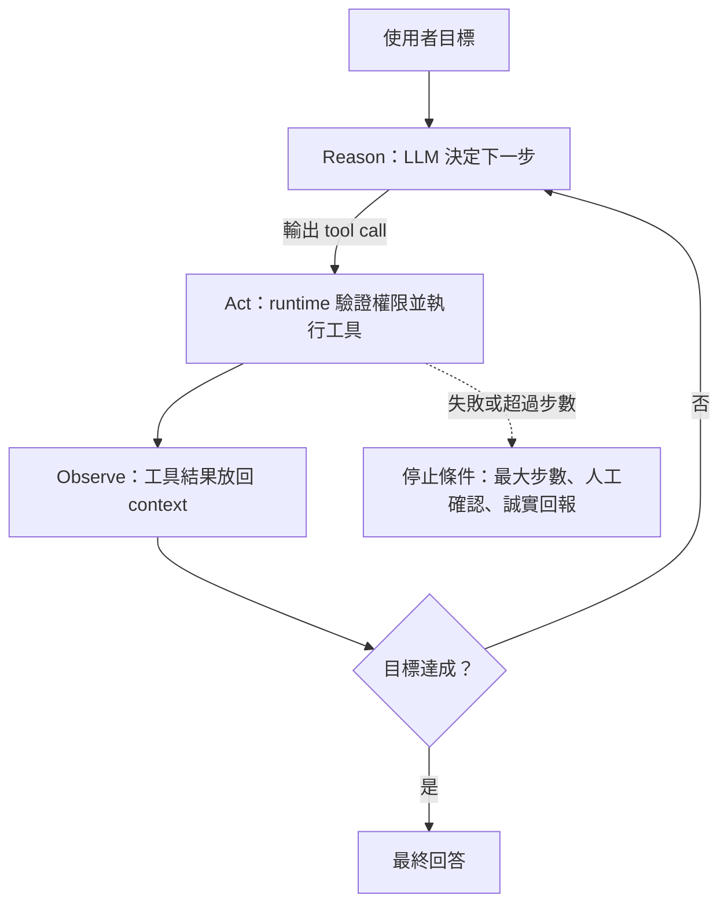
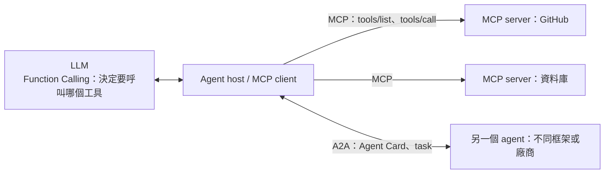
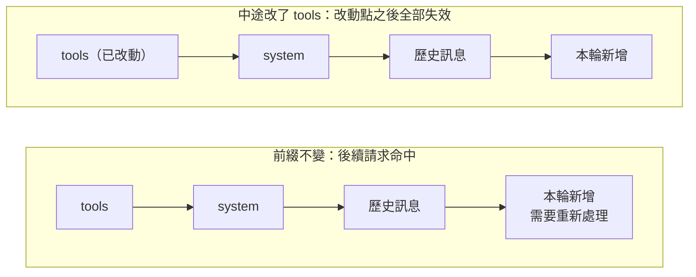

> 🌏 [English version](/en/posts/ai/2026-10-03-ai-interview-agent-mcp-caching-en)

面試問到 Agent，多半不是要你背框架名字，而是看你能不能把一條鏈講通：模型怎麼表達「我要呼叫工具」、輸出怎麼保證程式讀得懂、工具多到塞不進 prompt 怎麼辦、記憶放哪、成本怎麼壓。這篇是「AI Engineer 面試準備」系列的第 13 篇，把這些常見題目串成同一條脈絡：先講 Agent 迴圈，再拆 Structured Output 與 Function Calling，接著處理工具規模與記憶，最後收在 MCP、A2A 與 Prompt Caching。

每一節都是同一個結構：先講概念，再講機制或比較，最後給一段可以直接講出口的「面試怎麼答」。變動快的部分（MCP 規格、各家快取計費）都對照一手來源核對，並標明查詢時間。

## Agent 是什麼：一個會自己決定下一步的迴圈

Anthropic 在 [Building effective agents](https://www.anthropic.com/engineering/building-effective-agents) 裡把 agentic system 分成兩類。Workflow 是「LLMs and tools are orchestrated through predefined code paths」，agent 則是「LLMs dynamically direct their own processes and tool usage」。差別不在有沒有工具，而在下一步由誰決定：程式寫死，還是模型現場判斷。

這個「想一步、做一步、看結果、再想」的結構，源自 [ReAct](https://arxiv.org/abs/2210.03629)（Yao et al.，ICLR 2023）。把它畫成流程，就是面試白板上最常出現的那張圖：



最容易講錯的一點是：LLM 自己不執行任何工具，它只產生一份結構化的呼叫指令，真正執行的是外面的 runtime。把迴圈寫成程式，大概是這樣：

```python
messages = [{"role": "user", "content": goal}]
for step in range(MAX_STEPS):                    # 最大步數：防無限迴圈的第一道保險
    reply = llm.chat(messages, tools=tools)
    if not reply.tool_calls:                     # 模型不再要工具，視為完成
        return reply.text
    for call in reply.tool_calls:
        result = run_tool(call.name, call.arguments)    # 由 runtime 檢查權限後才執行
        messages.append(tool_message(call.id, result))  # 結果放回 context，進入下一輪
raise StepLimitExceeded
```

2025 年起各家都釋出了自己的 Agent SDK，面試只需要知道各自的定位與時間點：

| 框架 | 時間 | 定位 |
|---|---|---|
| [OpenAI Agents SDK](https://openai.com/index/new-tools-for-building-agents) | 2025-03 | Swarm 的後繼，核心原語是 handoff、guardrail 與 tracing |
| [Google ADK](https://developers.googleblog.com/en/agent-development-kit-easy-to-build-multi-agent-applications) | 2025-04 | 開源的 multi-agent 開發套件，初期以 Python 為主 |
| [Claude Agent SDK](https://www.anthropic.com/news/enabling-claude-code-to-work-more-autonomously) | 2025-09 | 由 Claude Code SDK 更名，附 subagent 與 hooks |
| [LangGraph](https://github.com/langchain-ai/langgraph) | 持續演進 | 圖狀態機，節點、邊與 checkpoint，站內見[LangGraph 導讀](/posts/ai/2026-03-27-langgraph-agent-orchestration) |
| [CrewAI](https://github.com/crewAIInc/crewAI) | 持續演進 | 角色分工的團隊模型，站內見[CrewAI 導讀](/posts/ai/2026-08-21-crewai-multi-agent-framework) |

框架不是越多越好。Anthropic 同一篇文章建議先直接呼叫 LLM API，因為框架「often create extra layers of abstraction that can obscure the underlying prompts and responses」，除錯會變難。更完整的架構分類見站內的 [AI Agent 架構模式指南](/posts/ai/2026-03-18-ai-agent-patterns-guide)，迴圈的幾種形狀見[coding agent 的 agent loop](/posts/ai/2026-08-25-coding-agent-agent-loop-shapes)。

**面試怎麼答**

> Agent 是讓 LLM 在迴圈裡決定下一步的系統：推理、呼叫工具、讀結果、再推理，直到目標完成，概念上源自 ReAct。LLM 只產生結構化的呼叫指令，真正執行工具的是外部 runtime，所以權限、步數上限與錯誤處理都該放在 runtime。如果流程固定，用 workflow 就夠了，因為 agent 用延遲與成本換彈性。

## Structured Output：在 token 層級擋掉不合法的輸出

LLM 預設吐的是自由文字，程式要的是能解析的 JSON。解法有三層，可靠度依序提高：

| 做法 | 怎麼運作 | 限制 |
|---|---|---|
| Prompt 要求 JSON，失敗就重試 | 純靠指令與重試迴圈 | 沒有保證，重試會拉高延遲與成本 |
| 微調模型，讓它「習慣」輸出格式 | 訓練時大量看過目標格式 | 機率性，仍可能壞掉 |
| 約束解碼（constrained decoding） | 解碼時依 schema 排除不合法 token | 需要文法引擎與推論框架的支援 |

約束解碼的核心很短：用有限狀態機（FSM）或上下文無關文法（CFG）追蹤「目前走到 JSON 的哪個位置」，算出下一個合法的 token 集合，其餘全部遮掉。[Outlines 的論文](https://arxiv.org/abs/2307.09702)描述的就是以 FSM 為基礎的做法，微軟的 [guidance](https://github.com/guidance-ai/guidance) 則是另一個實作。

```python
# 約束解碼的核心：每一步先算出「目前合法的 token」，其餘的 logits 設為負無窮
allowed = grammar_state.allowed_tokens()    # 由 FSM 或 CFG 目前的狀態算出
logits[~allowed] = float("-inf")
next_token = sample(softmax(logits))
grammar_state.advance(next_token)           # 狀態往前推進一格
```

例如 schema 要求 `{"name": string, "age": integer}`，當輸出走到 `"age":` 之後，合法的下一個 token 只剩數字開頭，引號與英文字母的 logits 都被壓成負無窮，模型想寫也寫不出來。

業界標準早已從舊的 JSON mode 轉到 strict JSON Schema。OpenAI 在 [2024-08 的公告](https://openai.com/index/introducing-structured-outputs-in-the-api/)公布內部評測：`gpt-4o-2024-08-06` 搭配 Structured Outputs，在複雜 JSON schema 上拿到 100%，`gpt-4-0613` 則低於 40%。但這個數字有兩個但書：它是廠商自己的內部評測，而且保證的只是「格式合法」。欄位填的值對不對、有沒有編造，約束解碼管不到，所以仍要做語意驗證。

Structured Output 與下一節的 Function Calling 其實是同一件事的兩面：工具參數本質上也是一份要符合 schema 的結構化輸出。

**面試怎麼答**

> 原理是約束解碼：解碼的每一步根據 schema 與已生成的內容，用 FSM 或 CFG 算出合法 token，把其餘 token 的 logits 設成負無窮，所以格式在生成階段就被保證。它比「prompt 要求 JSON 加重試」可靠得多。要補一句：strict 只保證格式合法，不保證內容正確，語意仍要驗證。

## Function Calling：模型表達意圖，應用程式負責執行

Function Calling（也叫 tool use）是讓模型在對話中表達「我想呼叫某個函式」的能力。依 [Anthropic 的 tool use 文件](https://platform.claude.com/docs/en/agents-and-tools/tool-use/overview)，client tool 的往返是這樣：Claude 回應 `stop_reason: "tool_use"` 與一或多個 `tool_use` 區塊，你的程式碼執行操作，再用 `tool_result` 把結果送回去。同一份文件也區分 server tool（如 web search），那類工具由供應商的基礎設施執行，你不必處理執行。

完整流程可以拆成六步：

1. 開發者定義函式 schema：名稱、描述、參數的 JSON Schema。
2. schema 隨請求送進模型，成為模型看得到的 context 的一部分。
3. 使用者提問，模型判斷要直接回答，還是呼叫工具。
4. 要呼叫時，模型輸出工具名稱與符合 schema 的參數，不輸出自然語言。
5. 應用程式驗證參數、檢查權限、實際執行，並把結果以 tool result 送回。
6. 模型讀完結果，決定再呼叫或給出最終回答。

為什麼模型做得到？學術上較早的工作有 [Toolformer](https://arxiv.org/abs/2302.04761)（讓模型自己學會何時呼叫 API）與 [Gorilla](https://arxiv.org/abs/2305.15334)（讓模型連接大量 API）。現在的商用模型則是在訓練階段就學過「判斷是否需要工具、挑選工具、產生符合 schema 的參數、整合工具結果」這套行為。各家內部怎麼編碼這些呼叫（例如特殊 token），屬於實作細節，面試講到「模型被訓練成輸出特定格式的呼叫」就夠了。

會不會呼叫錯？會。常見失敗是選錯工具、參數編造、或根本不呼叫。對策都在工程面：工具描述要寫清楚觸發條件（站內有[為什麼 Agent 有工具卻不用](/posts/ai/2026-09-18-llm-tool-discovery)的拆解）、參數用 strict schema 驗證、錯誤訊息要清楚回給模型讓它自我修正，高風險工具加上人工確認。

**面試怎麼答**

> Function Calling 是模型表達「我要呼叫哪個函式、參數是什麼」的能力：開發者提供 schema，模型輸出結構化的呼叫，應用程式負責驗證與執行，再把結果送回模型。模型本身不執行任何東西。它會出錯，所以要靠清楚的描述、schema 驗證與錯誤回饋，高風險操作另外要有人工確認。

## 大量工具：別把它們全部塞進 prompt

工具從幾個變成幾百個，會同時撞上三個問題：context 被工具定義吃掉、模型選錯的機率上升、延遲與成本增加。學術界已有量化：[RAG-MCP](https://arxiv.org/abs/2505.03275) 在 MCP 壓力測試中，把工具選擇準確率從基準的 13.62% 提高到 43.13%，prompt token 也減少超過一半。站內[幾百個工具怎麼選得準](/posts/ai/2026-06-04-tool-selection-at-scale)整理了更多崩塌曲線的實證。

解法的共同原則是「把工具發現與生成解耦」：不要一次給全部，先縮小範圍。

| 策略 | 做法 | 代價與限制 |
|---|---|---|
| 工具檢索 | 對工具描述做 embedding，依 query 取 top-k 再放進 prompt | 檢索品質綁在描述品質上，工具到數千個時 retriever 也會失準 |
| 延遲載入 | [Tool Search Tool](https://platform.claude.com/docs/en/agents-and-tools/tool-use/tool-search-tool)：定義標 `defer_loading: true`，需要時才搜尋並展開 | 要多一輪搜尋；是否保住快取要看供應商實作 |
| 階層與路由 | 先由 router 分領域，再讓子 agent 只看該領域的工具 | 路由本身會錯，多一層呼叫 |
| 精簡描述與命名 | 壓縮描述、用一致的前綴命名空間 | 描述太短會讓相近工具更難區分 |
| Code Mode | 讓模型寫程式呼叫工具，定義只在 import 時進 context | 需要沙箱，見[Code Mode 一文](/posts/ai/2026-05-10-code-mode-mcp-runtime-pattern) |
| Multi-agent | 不同 agent 各持一組工具，由 orchestrator 分派 | 協調與成本變高，見[編排模式](/posts/ai/2026-09-18-multi-agent-orchestration-patterns) |

學術上另有兩條路線。[ToolLLM](https://arxiv.org/abs/2307.16789) 面對 16000 多個真實 API，靠檢索來挑工具。[ToolkenGPT](https://arxiv.org/abs/2305.11554)（NeurIPS 2023 oral）則把每個工具表示成一個特殊 token 的 embedding，讓工具像詞彙一樣被生成，不必把描述放進 prompt。

有一個容易被忽略的連動：工具定義是快取前綴的一部分。依 [OpenAI 的 prompt caching 文件](https://developers.openai.com/api/docs/guides/prompt-caching)，改動工具的名稱、描述、schema 或順序，都會影響已快取的前綴。所以「動態載入」要設計成往後附加，而不是每輪改寫前面的工具清單。

**面試怎麼答**

> 核心是不要一次給全部工具。先用工具檢索或延遲載入，只把當輪相關的少數工具放進 prompt；工具太雜就用階層路由或拆給專職的子 agent。同時要把工具描述寫清楚，因為檢索和選擇都靠它。如果有 Prompt Caching，還要注意工具清單的順序必須穩定，避免前綴失效。

## Agent 記憶：短期靠 context，長期靠外部儲存

「記憶」要先拆成兩層。短期記憶就是 context window 裡的訊息，問題是會滿：常見做法有滑動視窗、摘要壓縮與 compaction，站內有[context 壓縮的設計比較](/posts/ai/2026-08-25-coding-agent-context-compaction)。長期記憶放在 context 之外，依內容可再分三種：

| 類型 | 存什麼 | 常見實作 | 風險 |
|---|---|---|---|
| 語意記憶 | 事實與偏好 | 向量資料庫、知識圖譜 | 過期事實、互相矛盾 |
| 情節記憶 | 過去發生的事件與互動 | 對話歷史資料庫，依時間與相關度檢索 | 檢索到不相關的舊事 |
| 程序記憶 | 學到的做法與規則 | 寫回 system prompt、規則檔或 skill | 錯誤經驗被固化 |

經典架構有三個值得講名字的參考。[Generative Agents](https://arxiv.org/abs/2304.03442) 提出「記憶流 + 反思 + 計畫」，agent 會把經歷存成記憶流，再定期把它們濃縮成較高階的反思。[Reflexion](https://arxiv.org/abs/2303.11366) 讓 agent 在任務失敗後用語言寫下反思，放進下一次嘗試的 context，不需要更新模型權重。[MemoryBank](https://arxiv.org/abs/2305.10250) 則專注在讓 LLM 具備長期記憶。

面試真正想聽的不是名詞，而是四個設計決定：什麼時候寫（每輪、任務結束、還是由模型自己決定）、怎麼讀（全量注入、依相關度檢索、還是讓模型用工具查）、怎麼更新與遺忘、誰能看到（跨使用者的隔離）。寫入閘門尤其重要，因為被污染的記憶會在之後每一次對話裡重複生效：

```python
def maybe_remember(candidate: str, source: str) -> None:
    # 寫入前先過閘門：來源可信、不含指令、與既有記憶不衝突
    if source == "tool_output":          # 工具輸出不可信，不直接寫進長期記憶
        return
    if conflicts_with_existing(candidate):
        flag_for_review(candidate)       # 衝突時標記待審，不覆寫
        return
    memory_store.add(candidate, metadata={"source": source, "ts": now()})
```

站內有三篇可延伸：[Agent Memory 系統](/posts/ai/2026-03-19-agent-memory-systems)講從唯讀 RAG 到可寫記憶的演化，[四種記憶與六個設計軸](/posts/ai/2026-09-19-agent-memory-taxonomy)講設計空間，[記憶的攻擊面](/posts/ai/2026-09-19-agent-memory-attack-surface)講為什麼寫入閘門不能省。

**面試怎麼答**

> 短期記憶就是 context window，用滑動視窗或摘要壓縮控制大小；長期記憶放外部儲存，依性質分成語意（事實，向量庫）、情節（過往事件）與程序（學到的規則）。設計時要決定何時寫入、怎麼檢索、如何更新與遺忘，並且在寫入前過濾不可信的來源，避免記憶被污染。Reflexion 與 Generative Agents 是這個領域常被引用的兩個參考架構。

## 設計 Agent 的關鍵考量：可靠、安全、成本、可觀測

這題沒有標準答案，高分的回答是有分類、有對策。可以用四個面向整理：

| 面向 | 典型問題 | 對策 |
|---|---|---|
| 可靠性 | 幻覺導致錯誤行動、工具失敗後假裝成功、無限迴圈 | 最大步數與迴圈偵測；失敗要重試、換方案或誠實回報；關鍵操作人工確認 |
| 安全 | prompt injection、權限過大 | 最小權限、沙箱執行、把工具輸出視為不可信資料 |
| 成本與延遲 | 每一步都是一次 LLM 呼叫，工具結果快速撐大 context | 能用 workflow 就不用 agent；壓縮 context；Prompt Caching |
| 可觀測與評估 | 出錯時不知道哪一步壞掉 | 記錄每一步的推理、呼叫與結果；建評測集，分離 LLM 邏輯與工具執行邏輯 |

兩個底層觀念值得多講一句。第一，漸進式自主：低風險操作全自動，高風險操作需要人確認，不確定時主動詢問。第二，prompt injection 的根源是模型把指令和資料攤平在同一條 token 串流裡，無法在架構上區分，所以對策要放在權限與信任邊界，不能只靠「提醒模型小心」，詳見[Agent 安全的同一條裂縫](/posts/ai/2026-06-04-agent-security-prompt-injection-trust-boundaries)。可觀測性則見[Agent 可觀測與失敗偵測](/posts/ai/2026-06-04-agent-observability-failure-detection)。

背景閱讀可看 Lilian Weng 的 [LLM Powered Autonomous Agents](https://lilianweng.github.io/posts/2023-06-23-agent/) 與 [Xi 等人的 agent 綜述](https://arxiv.org/abs/2309.07864)。風險評估方面，[Ruan 等人](https://arxiv.org/abs/2309.15817)提出用語言模型模擬的沙箱來辨識 agent 的風險，不必真的執行危險工具。

**面試怎麼答**

> 可以從四個面向講：可靠性（最大步數、失敗時誠實回報、關鍵操作人工確認）、安全（最小權限、沙箱、把工具輸出當不可信資料）、成本延遲（優先用 workflow、壓縮 context、用 Prompt Caching）、可觀測與評估（每一步都記錄，建評測集）。核心原則是漸進式自主：風險越高，人介入越多。

## MCP、Function Calling 與 A2A：三個不同層的東西

這三個詞常被混在一起，其實各管一層。Function Calling 是模型層的能力：模型怎麼表達「我要呼叫工具」。[MCP](https://www.anthropic.com/news/model-context-protocol)（Model Context Protocol）是應用層的協定：agent 怎麼發現並呼叫工具，一個 MCP server 可以被任何支援 MCP 的 client 使用。[A2A](https://a2a-protocol.org/latest/specification/) 也是應用層協定，但管的是 agent 與 agent 之間怎麼互相發現與協作。



它們是互補，不是替代。實際流程是：MCP client 用 MCP 協定向 server 取得工具清單（`tools/list`），把工具定義交給模型，模型用 Function Calling 的能力決定呼叫哪一個，client 再透過 MCP 把呼叫送到 server 執行並取回結果。站內[MCP、A2A、ACP、Skills 的協定層比較](/posts/ai/2026-08-10-mcp-a2a-skills-protocol-layer)有更完整的拆解，判準是「資料在呼叫之間會不會變」。

MCP 的時間線很容易講錯，這裡以官方來源為準（2026-10 查證）：

| 時間 | 事件 |
|---|---|
| 2024-11 | Anthropic [發布 MCP](https://www.anthropic.com/news/model-context-protocol) |
| 2025-03 | 規格 [2025-03-26](https://modelcontextprotocol.io/specification/2025-03-26/changelog)：Streamable HTTP 取代舊的 HTTP+SSE 傳輸，並加入 OAuth 2.1 授權框架；同月 OpenAI [宣布 Agents SDK 支援 MCP](https://x.com/OpenAIDevs/status/1904957755829481737) |
| 2025-11 | 規格 [2025-11-25](https://modelcontextprotocol.io/specification/2025-11-25/basic/authorization)：授權流程中 client 必須實作 PKCE（S256） |
| 2025-12 | Anthropic [將 MCP 捐給 Linux Foundation 旗下的 Agentic AI Foundation](https://www.anthropic.com/news/donating-the-model-context-protocol-and-establishing-of-the-agentic-ai-foundation)，共同創辦者為 Anthropic、Block 與 OpenAI |
| 2026-07 | 規格 [2026-07-28](https://blog.modelcontextprotocol.io/posts/2026-07-28)：無狀態化，見下文 |

常見的錯誤，是把「Streamable HTTP 取代 SSE」和「OAuth 2.1」說成最新一版規格的改動，它們其實從 2025 年初就是基線。2026-07-28 版真正的重點是：

- 移除 `initialize` 握手與 `Mcp-Session-Id`，版本與能力資訊改隨每個請求帶上，協定層不再保存 session。
- 新增必填的 HTTP header（`Mcp-Method`、`Mcp-Name`），方便路由。
- list 類回應可以帶快取提示。
- 舊的 HTTP+SSE 傳輸正式 deprecated。
- 授權端改以 Client ID Metadata Documents 取代動態 client 註冊。

既然協定層不再保存 session，應用層的狀態怎麼辦？官方給的替代做法是用明確的 handle（例如 `basket_id`），由模型在工具參數之間傳遞。官方也在同一篇公告裡說，TypeScript 與 Python SDK 各自的累計下載量都突破 10 億次。

A2A 的時間線較單純：

- Google 在 [2025-04 推出](https://developers.googleblog.com/en/a2a-a-new-era-of-agent-interoperability/)。
- 隔兩個月[交給 Linux Foundation](https://www.linuxfoundation.org/press/linux-foundation-launches-the-agent2agent-protocol-project-to-enable-secure-intelligent-communication-between-ai-agents) 治理。
- [v1.0 在 2026-03 發布](https://a2a-protocol.org/latest/blog/2026/03/12/a2a-protocol-ships-v10-production-ready-standard-for-agent-to-agent-communication)。
- Linux Foundation 一週年的[新聞稿](https://www.linuxfoundation.org/press/a2a-protocol-surpasses-150-organizations-lands-in-major-cloud-platforms-and-sees-enterprise-production-use-in-first-year)說有 150 個以上的組織支持。

技術上，首發設計建立在 HTTP、SSE 與 JSON-RPC 上，用 Agent Card（一份 JSON）描述 agent 的能力與端點；v1.0 起把資料模型和協定綁定拆開，支援 JSON-RPC、gRPC 與 HTTP/REST，Agent Card 也可以簽章。

最後補一個不要神化 MCP 的觀點：本機開發場景裡，CLI 或直接打 API 常常比 MCP 更省 context，MCP 真正不可取代的是跨 agent 共用工具層，這個取捨在[MCP vs CLI vs API](/posts/ai/2026-04-18-mcp-vs-cli-vs-api-agent-tool-interface)有詳細討論，入門介紹見[MCP 導讀](/posts/ai/2026-03-22-mcp-model-context-protocol)。

**面試怎麼答**

> Function Calling 是模型層的能力，讓模型表達要呼叫哪個函式；MCP 是應用層的標準協定，規範 agent 怎麼發現與呼叫工具，一個 server 各家 client 都能用；A2A 則規範 agent 與 agent 之間的發現與協作。三者互補：MCP 提供工具清單，模型用 Function Calling 決定呼叫哪個。要補一句 MCP 最新的方向是無狀態化，Streamable HTTP 與 OAuth 2.1 是 2025 年就有的基線。

## Prompt Caching：Agent 每一步都在重送同一段前綴

Agent 每一步都要呼叫一次 LLM，而每次請求都得帶上 system prompt、工具定義、完整歷史與先前的工具結果。這些內容絕大部分和上一步一模一樣，卻要重新做一次 prefill。

Prompt Caching 的機制是把已處理過的前綴所對應的 KV 張量存起來。OpenAI 的文件寫得很直接：快取存的是 KV 張量，不是 token 本身；後續請求只要前綴相同並命中快取，就直接重用，只處理新增的部分。學術上，[Prompt Cache](https://arxiv.org/abs/2311.04934)（MLSys 2024）研究的是模組化的注意力重用，[PagedAttention](https://arxiv.org/abs/2309.06180)（SOSP 2023）則是這類 KV 管理在服務端的基礎。

關鍵規則是「前綴必須完全一致」。Anthropic 的[文件](https://platform.claude.com/docs/en/build-with-claude/prompt-caching)寫明快取涵蓋整個 prompt，順序是 `tools`、`system`、`messages`，截至你標記的斷點為止。前綴中間任何一處改動，後面全部失效：



用一個簡單的算術示意（不是實測）感受規模：前綴 2,000 tokens，跑 10 步，每步新增 200 tokens。完全不快取，累計要處理 31,000 tokens。快取全部命中時，新處理量只剩約 4,000 tokens，其餘以快取讀取價計費，不是免費。

各家的計費機制（2026-10 查詢，價格以官方頁為準）：

| 供應商 | 機制 | 寫入 | 讀取 |
|---|---|---|---|
| [Anthropic](https://platform.claude.com/docs/en/build-with-claude/prompt-caching) | `cache_control` 標斷點，或用頂層欄位自動快取；預設 5 分鐘，每次命中刷新 | 5 分鐘 TTL 為基礎價的 1.25 倍；1 小時 TTL 為 2 倍 | 0.1 倍；Opus 5.5 為 0.05 倍，Fable 5.1 與 Mythos 5.1 為 0.025 倍 |
| [OpenAI](https://developers.openai.com/api/docs/guides/prompt-caching) | GPT-5.5 以前只有隱式；GPT-5.6 起可用 `prompt_cache_options.mode` 選隱式或顯式，內容區塊以 `prompt_cache_breakpoint` 標斷點（每請求最多 4 個寫入點，TTL 目前僅 30 分鐘） | GPT-5.6 起為 1.25 倍，更早型號無額外寫入費 | GPT-5.6 起 0.1 倍，更早型號依模型而定 |

OpenAI 從不收寫入費變成收 1.25 倍，這也解釋了顯式斷點的價值（這是依價格結構的推論）：可以避免替不會被重用的尾段付寫入費。

實證方面，[Don't Break the Cache](https://arxiv.org/abs/2601.06007) 在 OpenAI、Anthropic、Google 三家、500 多個 agent session 上評估，發現 prompt caching 可降低 41–80% 的成本，首 token 延遲也會下降。更有用的發現是做法：把動態內容放在 system prompt 的尾端、排除動態的工具結果，比「整段全部快取」更穩。

對 Agent 設計者，這些規則可以直接變成動作：

1. 穩定內容放前面，變動內容放後面：system prompt、工具定義在前，使用者資料與工具結果在後。
2. 不要把時間戳記、請求 ID 這類每次都變的字串放進前綴。
3. 工具清單固定順序；要動態載入工具時，往後附加而不是改寫前面。
4. 注意會改寫前面歷史的操作：OpenAI 文件指出，compaction 會替換較早的對話內容，可能讓快取從第一個被改動的 token 起失效。
5. 看 API 回報的用量欄位裡，快取讀寫的 token 數，確認命中率，不要憑感覺。

另外要分清楚層級：[Generative Caching](https://arxiv.org/abs/2511.17565) 與站內的[語意快取](/posts/ai/2026-03-12-semantic-caching)是在應用層快取「相似的回應」，和供應商的前綴快取（快取 KV 狀態）不同層，可以疊加，但不要混為一談。Agent 專用的多層快取設計見[ReAct Agent 的 Cache 設計](/posts/ai/2026-04-03-react-agent-cache-design)。

**面試怎麼答**

> Agent 每一步都重送 system prompt、工具定義與歷史，前綴大量重複。Prompt Caching 把前綴對應的 KV 張量存起來，前綴相同就跳過重複的 prefill，省延遲也省輸入成本。實務關鍵是前綴必須完全一致，所以穩定內容放前面、變動內容放後面，工具清單順序固定。計費上寫入要加價、讀取大幅折扣，精確倍率以官方頁為準。

## 整體來說

八個題目看起來分散，其實是同一條鏈：Agent 迴圈需要模型輸出能被程式解析的結構化呼叫（Structured Output 與 Function Calling）；工具與記憶讓 context 越來越大，所以要做工具檢索、記憶分層與壓縮；MCP 與 A2A 把「連工具」與「連 agent」標準化；Prompt Caching 則把迴圈每一步的重複成本壓下來。面試時用這條鏈來組織答案，比逐題背誦更能展現你理解它們為什麼彼此相關。

準備時有三個容易失分的地方：把 strict 說成保證內容正確、把 2025 年就有的 MCP 變更講成 2026 年的事、以及背快取價格倍率而不標時間。這三個都是「查一下一手來源就能避開」的錯誤。

## 題庫裡常見的題目

以下題目整理自 7 個公開題庫（各題庫的比較見系列第 11 篇：[AI Engineer 面試準備的 12 個題庫](/posts/ai/2026-09-30-ai-engineer-interview-resources)），只收跨題庫重複出現、而且能對應到本文某一節的題目。「獨立來源數」只代表題庫之間的重疊，不代表真實面試的頻率；其中 amitshekhar 與 pallavi 兩個題庫沒有題目來源，兩者有 26 題近乎逐字相同、疑似同一機構維護，合算成 1 個來源（KalyanKS 的兩個題庫同作者，也合算成 1 個），它們的公司標籤本文不採用。這裡只列題目與出處連結，沒有轉載答案。

連結代號：om＝ombharatiya/AI-Engineer-Interview-Questions、aeg＝alexeygrigorev/ai-engineering-field-guide、AIML＝alirezadir/AIMLInterviews、amit＝amitshekhariitbhu/ai-engineering-interview-questions、pal＝pallavi-shekhar/ai-engineering-interview-questions-company-wise、ks＝KalyanKS-NLP/LLM-Interview-Questions-and-Answers-Hub。

| 題目 | 獨立來源數 | 題庫連結 | 本文對應段落 |
|---|---|---|---|
| 請說明核心 agent 迴圈：有哪些元件、停止條件是什麼？ | 4 | [om](https://github.com/ombharatiya/AI-Engineer-Interview-Questions/blob/main/06-agents-and-tool-use/questions.md#3-walk-me-through-the-core-agent-loop-what-are-the-components-and-stop-conditions)、[aeg](https://github.com/alexeygrigorev/ai-engineering-field-guide/blob/main/interview/questions/questions.md?plain=1#L89)、[AIML](https://github.com/alirezadir/AIMLInterviews/blob/main/src/MLC/ml-coding.md#agentic-ai-coding)、[amit](https://github.com/amitshekhariitbhu/ai-engineering-interview-questions/blob/main/README.md#L364) | Agent 是什麼：一個會自己決定下一步的迴圈 |
| 工作流程（workflow）與 agent 的差別是什麼？ | 3 | [om](https://github.com/ombharatiya/AI-Engineer-Interview-Questions/blob/main/06-agents-and-tool-use/questions.md#1-whats-the-difference-between-a-workflow-and-an-agent)、[aeg](https://github.com/alexeygrigorev/ai-engineering-field-guide/blob/main/interview/questions/questions.md?plain=1#L81)、[amit](https://github.com/amitshekhariitbhu/ai-engineering-interview-questions/blob/main/README.md#L332) | Agent 是什麼：一個會自己決定下一步的迴圈 |
| 好的工具定義長什麼樣子？請給出具體的設計規則。 | 3 | [om](https://github.com/ombharatiya/AI-Engineer-Interview-Questions/blob/main/06-agents-and-tool-use/questions.md#10-what-makes-a-good-tool-definition-give-concrete-design-rules)、[aeg](https://github.com/alexeygrigorev/ai-engineering-field-guide/blob/main/interview/questions/questions.md?plain=1#L98)、[amit](https://github.com/amitshekhariitbhu/ai-engineering-interview-questions/blob/main/README.md#L348)、[pal](https://github.com/pallavi-shekhar/ai-engineering-interview-questions-company-wise/blob/main/README.md#L487) | Function Calling：模型表達意圖，應用程式負責執行 |
| 如何處理工具失敗、重試與冪等性？ | 3 | [aeg](https://github.com/alexeygrigorev/ai-engineering-field-guide/blob/main/interview/questions/questions.md?plain=1#L100)、[pal](https://github.com/pallavi-shekhar/ai-engineering-interview-questions-company-wise/blob/main/README.md#L241)、[AIML](https://github.com/alirezadir/AIMLInterviews/blob/main/src/MLC/ml-coding.md#agentic-ai-coding) | 設計 Agent 的關鍵考量：可靠、安全、成本、可觀測 |
| 你接了六個 MCP server，使用者還沒開口，上下文就已有 130 個工具定義、約 4.5 萬 token 的 schema。你怎麼處理？ | 2 | [om](https://github.com/ombharatiya/AI-Engineer-Interview-Questions/blob/main/06-agents-and-tool-use/questions.md#31-youve-connected-six-mcp-servers-there-are-now-130-tool-definitions-and-45k-tokens-of-schema-in-context-before-the-user-says-a-word-what-do-you-do)、[amit](https://github.com/amitshekhariitbhu/ai-engineering-interview-questions/blob/main/README.md#L411)、[pal](https://github.com/pallavi-shekhar/ai-engineering-interview-questions-company-wise/blob/main/README.md#L250) | 大量工具：別把它們全部塞進 prompt |
| 你的 agent 需要跨對話記住事情。你會用向量庫還是滾動式摘要？請為你的選擇辯護。 | 2 | [om](https://github.com/ombharatiya/AI-Engineer-Interview-Questions/blob/main/06-agents-and-tool-use/questions.md#32-your-agent-needs-to-remember-things-across-sessions-would-you-use-a-vector-store-or-rolling-summarisation-defend-the-choice)、[pal](https://github.com/pallavi-shekhar/ai-engineering-interview-questions-company-wise/blob/main/README.md#L256) | Agent 記憶：短期靠 context，長期靠外部儲存 |
| 解釋 ReAct（推理＋行動）架構／提示技巧。 | 2 | [amit](https://github.com/amitshekhariitbhu/ai-engineering-interview-questions/blob/main/README.md#L340)、[pal](https://github.com/pallavi-shekhar/ai-engineering-interview-questions-company-wise/blob/main/README.md#L239)、[ks](https://github.com/KalyanKS-NLP/LLM-Interview-Questions-and-Answers-Hub/blob/main/Interview_QA/QA_85-87.md) | Agent 是什麼：一個會自己決定下一步的迴圈 |
| 哪些邏輯該放在編排器、哪些交給 LLM？ | 2 | [aeg](https://github.com/alexeygrigorev/ai-engineering-field-guide/blob/main/interview/questions/questions.md?plain=1#L88)、[pal](https://github.com/pallavi-shekhar/ai-engineering-interview-questions-company-wise/blob/main/README.md#L1676) | Agent 是什麼：一個會自己決定下一步的迴圈 |
| 什麼是 Plan-and-Execute（先規劃再執行）的 Agent 模式？ | 2 | [amit](https://github.com/amitshekhariitbhu/ai-engineering-interview-questions/blob/main/README.md#L342)、[AIML](https://github.com/alirezadir/AIMLInterviews/blob/main/src/MLC/ml-coding.md#agentic-ai-coding) | Agent 是什麼：一個會自己決定下一步的迴圈 |
| 函式／工具呼叫實際上從頭到尾是怎麼運作的？ | 2 | [om](https://github.com/ombharatiya/AI-Engineer-Interview-Questions/blob/main/06-agents-and-tool-use/questions.md#4-how-does-functiontool-calling-actually-work-mechanically-end-to-end)、[amit](https://github.com/amitshekhariitbhu/ai-engineering-interview-questions/blob/main/README.md#L344) | Function Calling：模型表達意圖，應用程式負責執行 |
| 什麼是 MCP（Model Context Protocol）？與傳統函式呼叫有何不同？ | 2 | [om](https://github.com/ombharatiya/AI-Engineer-Interview-Questions/blob/main/06-agents-and-tool-use/questions.md#7-what-is-mcp-and-what-problem-does-it-solve)、[amit](https://github.com/amitshekhariitbhu/ai-engineering-interview-questions/blob/main/README.md#L355)、[pal](https://github.com/pallavi-shekhar/ai-engineering-interview-questions-company-wise/blob/main/README.md#L247) | MCP、Function Calling 與 A2A：三個不同層的東西 |
| 什麼是 Agent Skills？什麼情況下該把知識包成 skill，而不是工具、MCP server 或檢索？ | 2 | [om](https://github.com/ombharatiya/AI-Engineer-Interview-Questions/blob/main/06-agents-and-tool-use/questions.md#39-what-are-agent-skills-and-when-do-you-package-knowledge-as-a-skill-rather-than-a-tool-an-mcp-server-or-retrieval)、[amit](https://github.com/amitshekhariitbhu/ai-engineering-interview-questions/blob/main/README.md#L376) | MCP、Function Calling 與 A2A：三個不同層的東西 |
| 什麼時候多 agent 勝過單 agent？什麼時候反而更糟？ | 2 | [om](https://github.com/ombharatiya/AI-Engineer-Interview-Questions/blob/main/06-agents-and-tool-use/questions.md#24-when-does-multi-agent-beat-single-agent-and-when-does-it-make-things-worse)、[amit](https://github.com/amitshekhariitbhu/ai-engineering-interview-questions/blob/main/README.md#L351)、[pal](https://github.com/pallavi-shekhar/ai-engineering-interview-questions-company-wise/blob/main/README.md#L253) | 大量工具：別把它們全部塞進 prompt |
| agentic 系統需要哪些記憶類型（工作、情節、語意、程序性）？如何設計長期記憶而不被污染？ | 2 | [aeg](https://github.com/alexeygrigorev/ai-engineering-field-guide/blob/main/interview/questions/questions.md?plain=1#L110)、[amit](https://github.com/amitshekhariitbhu/ai-engineering-interview-questions/blob/main/README.md#L334) | Agent 記憶：短期靠 context，長期靠外部儲存 |
| 使用工具的 agent 最大的安全風險是什麼？如何安全地沙箱化工具執行？ | 2 | [aeg](https://github.com/alexeygrigorev/ai-engineering-field-guide/blob/main/interview/questions/questions.md?plain=1#L101)、[amit](https://github.com/amitshekhariitbhu/ai-engineering-interview-questions/blob/main/README.md#L382) | 設計 Agent 的關鍵考量：可靠、安全、成本、可觀測 |
| 如何實作 human-in-the-loop（HIL）模式，並決定何時觸發人工審核？ | 2 | [aeg](https://github.com/alexeygrigorev/ai-engineering-field-guide/blob/main/interview/questions/questions.md?plain=1#L112)、[amit](https://github.com/amitshekhariitbhu/ai-engineering-interview-questions/blob/main/README.md#L387)、[pal](https://github.com/pallavi-shekhar/ai-engineering-interview-questions-company-wise/blob/main/README.md#L265) | 設計 Agent 的關鍵考量：可靠、安全、成本、可觀測 |
| 如何讓 Agent 的動作可還原，或至少可稽核？ | 2 | [om](https://github.com/ombharatiya/AI-Engineer-Interview-Questions/blob/main/15-role-guides/forward-deployed-engineer.md#6-the-customer-wants-your-agent-to-take-write-actions-in-their-erp---create-purchase-orders-update-records-how-do-you-design-and-stage-that-safely)、[amit](https://github.com/amitshekhariitbhu/ai-engineering-interview-questions/blob/main/README.md#L410)、[pal](https://github.com/pallavi-shekhar/ai-engineering-interview-questions-company-wise/blob/main/README.md#L263) | 設計 Agent 的關鍵考量：可靠、安全、成本、可觀測 |
| 跨數十個 SaaS 系統的 Agent 編排：授權檢查放在哪？為何不能放在模型裡？ | 2 | [pal](https://github.com/pallavi-shekhar/ai-engineering-interview-questions-company-wise/blob/main/README.md#L1771)、[AIML](https://github.com/alirezadir/AIMLInterviews/blob/main/src/MLC/ml-coding.md#agentic-ai-coding) | 設計 Agent 的關鍵考量：可靠、安全、成本、可觀測 |
| Prompt caching 如何運作？它應該如何改變你組織 prompt 的方式？ | 2 | [om](https://github.com/ombharatiya/AI-Engineer-Interview-Questions/blob/main/03-prompt-engineering-and-context/questions.md#22-how-does-prompt-caching-work-and-how-should-it-change-the-way-you-structure-prompts)、[amit](https://github.com/amitshekhariitbhu/ai-engineering-interview-questions/blob/main/README.md#L589)、[pal](https://github.com/pallavi-shekhar/ai-engineering-interview-questions-company-wise/blob/main/README.md#L177) | Prompt Caching：Agent 每一步都在重送同一段前綴 |
| 除了 LLM 之外，agent 還必須有哪些核心元件？ | 1 | [aeg](https://github.com/alexeygrigorev/ai-engineering-field-guide/blob/main/interview/questions/questions.md?plain=1#L85) | Agent 是什麼：一個會自己決定下一步的迴圈 |
| 長時間執行的 Agent 逐漸偏題、自信地做錯事，如何診斷與修正？ | 1 | [amit](https://github.com/amitshekhariitbhu/ai-engineering-interview-questions/blob/main/README.md#L413)、[pal](https://github.com/pallavi-shekhar/ai-engineering-interview-questions-company-wise/blob/main/README.md#L267) | 設計 Agent 的關鍵考量：可靠、安全、成本、可觀測 |
| 結構化輸出與函式呼叫有何差別？ | 1 | [amit](https://github.com/amitshekhariitbhu/ai-engineering-interview-questions/blob/main/README.md#L346)、[pal](https://github.com/pallavi-shekhar/ai-engineering-interview-questions-company-wise/blob/main/README.md#L244) | Structured Output：在 token 層級擋掉不合法的輸出 |
| 遠端 MCP server 的授權如何運作？團隊實作時常犯什麼錯？ | 1 | [om](https://github.com/ombharatiya/AI-Engineer-Interview-Questions/blob/main/06-agents-and-tool-use/questions.md#64-how-does-authorisation-work-for-a-remote-mcp-server-and-what-do-teams-get-wrong-when-they-implement-it) | MCP、Function Calling 與 A2A：三個不同層的東西 |
| 說明多層快取策略：檢索快取、prompt 快取與回應快取。 | 1 | [aeg](https://github.com/alexeygrigorev/ai-engineering-field-guide/blob/main/interview/questions/questions.md?plain=1#L224) | Prompt Caching：Agent 每一步都在重送同一段前綴 |

本節只列題目標題與連結，答案請回原 repo 查看；題目譯文為本站自行翻譯，同一題在不同題庫措辭不同時，表中只取其中一個題庫的寫法。

amit、pal、aeg 的行號連結指向 2026-10-03 當天 main 分支的內容，repo 更新後行號可能位移；連到別題時，請用題目文字到原檔搜尋。

## 系列其他篇

- [RAG 變體與進階檢索](/posts/ai/2026-10-03-ai-interview-rag-variants)
- [Prompt、Context 與 Harness](/posts/ai/2026-10-03-ai-interview-prompt-context-harness)
- [LLM 工程](/posts/ai/2026-10-03-ai-interview-llm-engineering)
- [ML 與 Transformer 基礎](/posts/ai/2026-10-03-ai-interview-ml-transformer-basics)
- [系統設計、程式題與行為面試](/posts/ai/2026-10-03-ai-interview-design-coding-behavioral)

## 參考資料

**論文與官方文件**

- [ReAct: Synergizing Reasoning and Acting in Language Models（arXiv:2210.03629）](https://arxiv.org/abs/2210.03629)
- [Anthropic：Building effective agents](https://www.anthropic.com/engineering/building-effective-agents)
- [Efficient Guided Generation for Large Language Models（arXiv:2307.09702）](https://arxiv.org/abs/2307.09702)
- [guidance（GitHub）](https://github.com/guidance-ai/guidance)
- [OpenAI：Introducing Structured Outputs in the API](https://openai.com/index/introducing-structured-outputs-in-the-api/)
- [Claude Docs：Tool use overview](https://platform.claude.com/docs/en/agents-and-tools/tool-use/overview)
- [Toolformer（arXiv:2302.04761）](https://arxiv.org/abs/2302.04761)
- [Gorilla（arXiv:2305.15334）](https://arxiv.org/abs/2305.15334)
- [RAG-MCP（arXiv:2505.03275）](https://arxiv.org/abs/2505.03275)
- [Claude Docs：Tool search tool](https://platform.claude.com/docs/en/agents-and-tools/tool-use/tool-search-tool)
- [ToolLLM（arXiv:2307.16789）](https://arxiv.org/abs/2307.16789)
- [ToolkenGPT（arXiv:2305.11554）](https://arxiv.org/abs/2305.11554)
- [Generative Agents（arXiv:2304.03442）](https://arxiv.org/abs/2304.03442)
- [Reflexion（arXiv:2303.11366）](https://arxiv.org/abs/2303.11366)
- [MemoryBank（arXiv:2305.10250）](https://arxiv.org/abs/2305.10250)
- [Lilian Weng：LLM Powered Autonomous Agents](https://lilianweng.github.io/posts/2023-06-23-agent/)
- [The Rise and Potential of LLM Based Agents: A Survey（arXiv:2309.07864）](https://arxiv.org/abs/2309.07864)
- [Identifying the Risks of LM Agents with an LM-Emulated Sandbox（arXiv:2309.15817）](https://arxiv.org/abs/2309.15817)

**框架、協定與快取**

- [OpenAI：New tools for building agents（Agents SDK）](https://openai.com/index/new-tools-for-building-agents)
- [Google：Agent Development Kit](https://developers.googleblog.com/en/agent-development-kit-easy-to-build-multi-agent-applications)
- [Anthropic：Enabling Claude Code to work more autonomously（Claude Agent SDK）](https://www.anthropic.com/news/enabling-claude-code-to-work-more-autonomously)
- [LangGraph（GitHub）](https://github.com/langchain-ai/langgraph)
- [CrewAI（GitHub）](https://github.com/crewAIInc/crewAI)
- [Anthropic：Introducing the Model Context Protocol](https://www.anthropic.com/news/model-context-protocol)
- [MCP 規格 2025-03-26 changelog](https://modelcontextprotocol.io/specification/2025-03-26/changelog)
- [MCP 規格 2025-11-25 授權](https://modelcontextprotocol.io/specification/2025-11-25/basic/authorization)
- [OpenAI Developers：Agents SDK 支援 MCP（2025-03-26）](https://x.com/OpenAIDevs/status/1904957755829481737)
- [Anthropic：捐贈 MCP 並成立 Agentic AI Foundation](https://www.anthropic.com/news/donating-the-model-context-protocol-and-establishing-of-the-agentic-ai-foundation)
- [MCP 部落格：2026-07-28 規格發布](https://blog.modelcontextprotocol.io/posts/2026-07-28)
- [A2A：Google 發表公告（2025-04）](https://developers.googleblog.com/en/a2a-a-new-era-of-agent-interoperability/)
- [Linux Foundation：A2A 專案成立](https://www.linuxfoundation.org/press/linux-foundation-launches-the-agent2agent-protocol-project-to-enable-secure-intelligent-communication-between-ai-agents)
- [A2A v1.0 發布](https://a2a-protocol.org/latest/blog/2026/03/12/a2a-protocol-ships-v10-production-ready-standard-for-agent-to-agent-communication)
- [Linux Foundation：A2A 一週年](https://www.linuxfoundation.org/press/a2a-protocol-surpasses-150-organizations-lands-in-major-cloud-platforms-and-sees-enterprise-production-use-in-first-year)
- [A2A 規格](https://a2a-protocol.org/latest/specification/)
- [Claude Docs：Prompt caching](https://platform.claude.com/docs/en/build-with-claude/prompt-caching)
- [OpenAI：Prompt caching](https://developers.openai.com/api/docs/guides/prompt-caching)
- [Don't Break the Cache（arXiv:2601.06007）](https://arxiv.org/abs/2601.06007)
- [Generative Caching（arXiv:2511.17565）](https://arxiv.org/abs/2511.17565)
- [Prompt Cache（arXiv:2311.04934）](https://arxiv.org/abs/2311.04934)
- [PagedAttention（arXiv:2309.06180）](https://arxiv.org/abs/2309.06180)

**站內文章**

- [AI Agent 架構模式指南](/posts/ai/2026-03-18-ai-agent-patterns-guide)
- [coding agent 的 agent loop](/posts/ai/2026-08-25-coding-agent-agent-loop-shapes)
- [LangGraph 導讀](/posts/ai/2026-03-27-langgraph-agent-orchestration)
- [CrewAI 導讀](/posts/ai/2026-08-21-crewai-multi-agent-framework)
- [為什麼 Agent 有工具卻不用](/posts/ai/2026-09-18-llm-tool-discovery)
- [幾百個工具怎麼選得準](/posts/ai/2026-06-04-tool-selection-at-scale)
- [Code Mode](/posts/ai/2026-05-10-code-mode-mcp-runtime-pattern)
- [Multi-agent 編排模式](/posts/ai/2026-09-18-multi-agent-orchestration-patterns)
- [Context 壓縮與 compaction](/posts/ai/2026-08-25-coding-agent-context-compaction)
- [Agent Memory 系統](/posts/ai/2026-03-19-agent-memory-systems)
- [四種記憶與六個設計軸](/posts/ai/2026-09-19-agent-memory-taxonomy)
- [Agent 記憶的攻擊面](/posts/ai/2026-09-19-agent-memory-attack-surface)
- [Agent 安全的同一條裂縫](/posts/ai/2026-06-04-agent-security-prompt-injection-trust-boundaries)
- [Agent 可觀測與失敗偵測](/posts/ai/2026-06-04-agent-observability-failure-detection)
- [協定層：MCP、A2A、ACP、Skills](/posts/ai/2026-08-10-mcp-a2a-skills-protocol-layer)
- [MCP vs CLI vs API](/posts/ai/2026-04-18-mcp-vs-cli-vs-api-agent-tool-interface)
- [MCP 導讀](/posts/ai/2026-03-22-mcp-model-context-protocol)
- [語意快取](/posts/ai/2026-03-12-semantic-caching)
- [ReAct Agent 的 Cache 設計](/posts/ai/2026-04-03-react-agent-cache-design)

**題庫（題目來源）**

- [ombharatiya/AI-Engineer-Interview-Questions](https://github.com/ombharatiya/AI-Engineer-Interview-Questions) — 題目來源（只引用題目標題）
- [alexeygrigorev/ai-engineering-field-guide](https://github.com/alexeygrigorev/ai-engineering-field-guide) — 題目來源（只引用題目標題）
- [alirezadir/AIMLInterviews](https://github.com/alirezadir/AIMLInterviews) — 題目來源（只引用題目標題）
- [amitshekhariitbhu/ai-engineering-interview-questions](https://github.com/amitshekhariitbhu/ai-engineering-interview-questions) — 題目來源（只引用題目標題）
- [pallavi-shekhar/ai-engineering-interview-questions-company-wise](https://github.com/pallavi-shekhar/ai-engineering-interview-questions-company-wise) — 題目來源（只引用題目標題）
- [KalyanKS-NLP/LLM-Interview-Questions-and-Answers-Hub](https://github.com/KalyanKS-NLP/LLM-Interview-Questions-and-Answers-Hub) — 題目來源（只引用題目標題）
- [KalyanKS-NLP/RAG-Interview-Questions-and-Answers-Hub](https://github.com/KalyanKS-NLP/RAG-Interview-Questions-and-Answers-Hub) — 題目來源（只引用題目標題）
