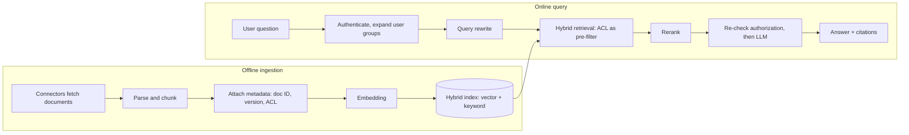
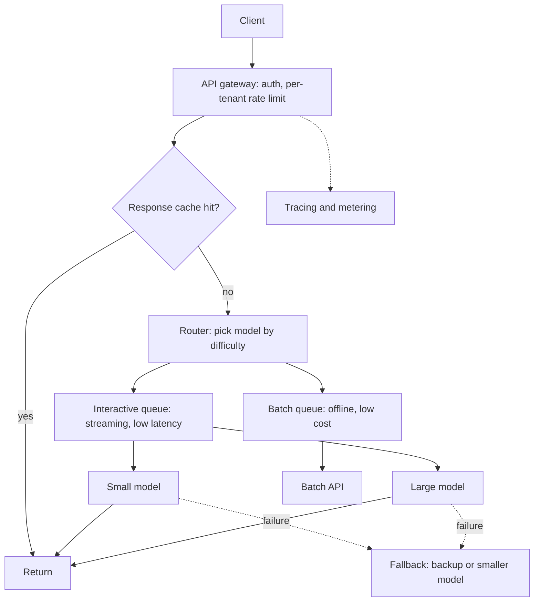
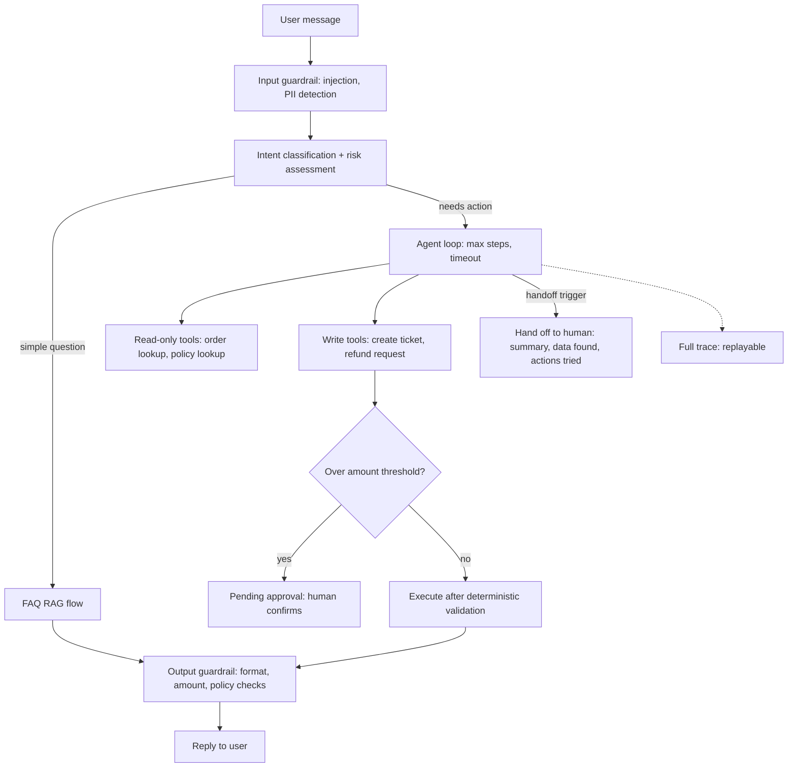
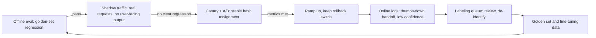
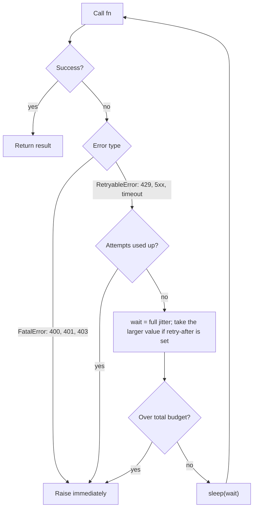

> 🌏 [中文版](/posts/ai/2026-10-03-ai-interview-design-coding-behavioral)

By the final round of an AI Engineer interview, nobody is testing whether you recognize a buzzword. They want three things: can you talk a system through on a whiteboard, can you write code that actually runs, and can you back it up with a real story. This post closes the "AI Engineer Interview Prep" series and gives each of those three a skeleton you can use as is.

There are four parts: four system design questions that come up often (an enterprise knowledge base with RAG, an LLM serving stack, a customer-support agent, online evaluation and the data flywheel), three Python problems (dynamic batching, sampling, retries plus rate limiting), and a STAR skeleton for behavioral rounds. Each design question comes with a speakable sample answer and a self-check list; each coding problem comes with real run output and complexity.

Two notes on how to read it. First, I only state facts I could trace to a primary source, and the source is linked right in the sentence. Prices, per-tier limits, and model names change fast, so I leave them out: in an interview, explain the mechanism, and if someone wants a number, say "per the official docs today". Second, the behavioral section is a skeleton only; every `[fill in your project]` must be replaced with your own real experience.

## A framework first: one rhythm for all four design questions

The most common way to fail a design question is to start drawing immediately and discover ten minutes later that you never asked about scale. The rhythm below works for all four; the time shares are a suggested split, not a standard.

| Step | Time share | What to do |
|---|---|---|
| 1. Clarify | ~15% | Who the users are, scale, which of latency/quality/cost wins, what must never go wrong, success metrics |
| 2. Architecture | ~20% | Draw the data flow first: entry, processing, storage, output; components only, no details |
| 3. Core trade-offs | ~35% | Pick 2 or 3 key decisions; for each say "I chose A over B because..., and the cost is..." |
| 4. Monitoring and failure handling | ~20% | Metrics, alerts, degradation, rollback, human-in-the-loop points |
| 5. Wrap-up | ~10% | A 30-second close: restate decisions, admit limits, name the next step |

A good opener: "I'll confirm a few requirements, sketch the overall architecture, go deep on two or three trade-offs, and finish with monitoring and failure handling." That sentence already shows structure.

## Question 1: Design an internal enterprise knowledge-base Q&A system

### Clarify

Ask four things first:

- How many documents, of what types (PDF, wiki, tickets, spreadsheets), and how often do they change?
- How many users and how much QPS; does latency mean time to first token or the full answer?
- What is the permission model: by department, by role, or a per-document [ACL](https://en.wikipedia.org/wiki/Access-control_list)? How fast must a departure or transfer take effect?
- What does a wrong answer cost? Must every answer cite sources, and is "I don't know" allowed?

The rest assumes 100,000 documents, a few hundred concurrent users, and compliance risk on wrong answers, so the priorities are correct permissions first, grounded answers second, latency last.

### Architecture

Two lines: an offline ingestion pipeline and an online query path.



For the details of chunking and retrieval, see the site posts on [chunking strategies](/en/posts/ai/2026-03-12-chunking-strategies-en), [hybrid search](/en/posts/ai/2026-03-12-hybrid-search-bm25-vector-rrf-en), and [cross-encoder reranking](/en/posts/ai/2026-03-12-cross-encoder-reranking-en).

### Core trade-offs

**Permissions: pre-filter or post-filter.** I apply the ACL as a filter during retrieval instead of dropping unauthorized hits afterwards. Post-filtering lets unauthorized content fill the top-k, so the user gets fewer results and, in the worst case, learns that a document exists. The cost is that the index must stay in sync with ACL changes, so ACL updates travel on their own event stream, processed ahead of content updates, with one more authorization check before generation as insurance. How each vector database implements metadata filtering varies a lot, and I did not verify it product by product; in an interview say "I would measure recall and latency under the filter" rather than inventing numbers. For selection, see the site's [vector database comparison](/en/posts/ai/2026-03-12-vector-database-comparison-en).

**Updates: incremental, not full rebuilds.** Use content hashes to find which chunks changed and redo only those. Deletions use a tombstone (a deletion marker), plus periodic reconciliation so stale versions never get served.

**Evaluation: retrieval and generation separately.** For retrieval look at recall@k and MRR; for generation look at faithfulness and answer relevance. Start with a human-labeled golden set, then scale up with LLM-as-judge. [RAGAS](https://arxiv.org/abs/2309.15217) proposes scoring retrieval and generation along several dimensions without reference answers. The [MT-Bench paper](https://arxiv.org/abs/2306.05685) reports that strong LLM judges agree with human preferences over 80% of the time, and also documents position, verbosity, and self-preference biases, so you still calibrate with periodic human sampling. The site has matching posts on [RAG evaluation frameworks](/en/posts/ai/2026-03-12-rag-evaluation-frameworks-en) and [LLM-as-Judge](/en/posts/ai/2026-03-12-self-reflection-llm-as-judge-en).

### Monitoring and failure handling

Track four metrics: empty-retrieval rate, citation coverage, thumbs-down rate, and latency percentiles. Pair them with the per-node traces from [RAG observability](/en/posts/ai/2026-03-12-rag-observability-tracing-en), so you can tell whether retrieval or generation broke.

On failure, degrade to "return only the relevant document links", and make "no answer found" a legitimate output. One more risk you must raise is indirect injection: documents themselves can carry malicious instructions. [OWASP's LLM01 entry](https://genai.owasp.org/llmrisk/llm01-prompt-injection/) states that neither RAG nor fine-tuning fully eliminates prompt injection, and recommends segregating untrusted content, validating output formats, least privilege, and human approval for high-risk actions. For defenses on the input and output sides, see [RAG guardrails](/en/posts/ai/2026-03-12-rag-guardrails-en).

### Wrap-up

Permissions live in the retrieval layer, updates are incremental, and evaluation is split into retrieval and generation; next I would build the golden set and offline evaluation before talking about scale.

### Sample answer

Let me confirm requirements first. I'll assume a hundred thousand documents, a few hundred concurrent users, and compliance risk on wrong answers, so my priorities are correct permissions, grounded answers, then latency.

The architecture has two lines. Offline ingestion: parse and chunk, attach document ID, version, and ACL to every chunk, embed, and write into a hybrid vector-plus-keyword index. Online: authenticate and expand the user's groups, rewrite the query, run hybrid retrieval, rerank, and hand the top chunks to the LLM with instructions to answer only from them and cite.

The first trade-off is permissions. I filter by ACL during retrieval, because post-filtering lets unauthorized content crowd out the top-k and can leak a document's existence. The cost is keeping the index in sync, so ACL changes get their own high-priority event stream, and I re-check authorization before generation.

The second is updates. Content hashes drive incremental re-indexing, deletions use tombstones, and a periodic reconciliation job catches drift.

For evaluation I look at retrieval and generation separately, start with a golden set, scale with LLM-as-judge, and calibrate with human sampling. On failure I degrade to links only, and "no answer found" is a valid answer.

### Self-check list

- [ ] Did I ask about scale, latency, and error cost before drawing anything?
- [ ] Do I filter permissions at retrieval time, and can I say why not afterwards?
- [ ] Did I explain the timing difference between ACL changes and content updates?
- [ ] Did I cover deletions and stale versions (tombstones, reconciliation)?
- [ ] Is evaluation split into retrieval and generation, with a golden set and human calibration?
- [ ] Is there a "no answer found" and a degradation path, plus citations and traceability?
- [ ] Did I avoid quoting numbers I cannot back up?

## Question 2: Design the inference architecture for an LLM service

### Clarify

- Self-hosted (an engine like [vLLM](https://docs.vllm.ai/)), an external API, or a mix?
- Is traffic interactive (low latency, streaming) or batch (can wait)? How far apart are peak and average?
- What is the quality floor: which requests must use the strongest model?
- Cost ceiling and SLOs, such as TTFT (time to first token) and p95 of the full response.

### Architecture

Split traffic into interactive and batch first, since their goals differ: the former cares about first-token latency and streaming, the latter about cost per token, so they use different queues.



### Core trade-offs

**Throughput versus latency.** When self-hosting, throughput is mostly bounded by KV cache memory. [PagedAttention](https://arxiv.org/abs/2309.06180), the core of vLLM, manages the KV cache in pages to cut waste, and the paper reports 2 to 4 times higher throughput at similar latency. A second issue is that interleaving prefill and decode causes latency jitter; the chunked prefill proposed in [Sarathi-Serve](https://arxiv.org/abs/2403.02310) tunes exactly that trade-off. For vLLM details, see the site's [vLLM inference engine](/en/posts/ai/2026-03-14-vllm-inference-engine-en) post.

**Two layers of caching.** The first is the provider's prompt cache: put the stable system prompt, tool definitions, and long documents first and the variable content last, because the cache matches on prefixes. Both [Anthropic's prompt caching docs](https://platform.claude.com/docs/en/build-with-claude/prompt-caching) and [OpenAI's prompt caching guide](https://developers.openai.com/api/docs/guides/prompt-caching) work this way. Taking Anthropic as the example, its [rate limit docs](https://platform.claude.com/docs/en/api/rate-limits) say that for most models, tokens read from the cache do not count toward the input TPM limit, so caching saves money and raises effective throughput at once. The second layer is your own response cache, enabled only for repeatable queries with no personal data; hits depend on a semantic similarity threshold, and the risk of false hits has to be measured with evaluation. See the site's [semantic caching](/en/posts/ai/2026-03-12-semantic-caching-en) post.

**Routing.** Send easy requests to a small model and hard ones to a large model; this is one of the routing patterns Anthropic lists in [Building effective agents](https://www.anthropic.com/engineering/building-effective-agents). The router itself must be cheap, and online sampling should check for misrouting.

**Move offline traffic to a batch API.** Per the [Message Batches docs](https://platform.claude.com/docs/en/build-with-claude/batch-processing), batches are billed at 50% of standard prices, most finish within an hour, and a batch that does not finish within 24 hours expires. That suits offline evaluation and bulk labeling, not interactive requests.

### Monitoring and failure handling

On a 429, read `retry-after` and use exponential backoff with jitter. But [Anthropic's rate limit docs](https://platform.claude.com/docs/en/api/rate-limits) call out one exception: a 429 caused by the monthly spend cap carries no `retry-after`, and retrying keeps failing, so degrade or alert instead. The official [SDK retries twice by default](https://platform.claude.com/docs/en/api/errors) and honors `retry-after`; if you write your own retries, follow the same rules, which is what C3 below does. On failure, fall back in order to a backup or smaller model, and rate-limit with a token bucket per tenant so one customer cannot eat the whole quota. The site's [RAG quota system](/en/posts/ai/2026-03-12-rag-token-quota-system-en) shows a dual-limit example.

Mention cache isolation across tenants too. vLLM's [Automatic Prefix Caching](https://docs.vllm.ai/en/latest/design/prefix_caching/) uses block hashes and offers `cache_salt` to isolate trust groups, so latency differences cannot be used to infer someone else's prompt; [OpenAI's docs](https://developers.openai.com/api/docs/guides/prompt-caching) likewise mention using different keys to prevent cache-hit probing.

Metrics to watch: TTFT, per-token latency, queue depth, cache hit rate, error rate, cost per request. I did not verify the cost crossover between self-hosting and APIs, or tokens per second on any specific GPU; in an interview say "I'd load-test with our own workload" and do not quote numbers.

### Wrap-up

Split traffic first, cut cost with caching and routing, and protect the SLO with rate limits and fallbacks.

### Sample answer

First I split traffic into interactive and batch. Interactive cares about first-token latency and streaming, batch about cost per token, so they get separate queues.

The architecture: an API gateway for auth and rate limiting, then a router and the model backends (self-hosted or an external API), with two cache layers on the side and tracing and metering throughout.

Trade-off one is throughput versus latency. Self-hosted throughput is stuck on KV cache memory; PagedAttention manages it in pages and the paper reports 2 to 4 times the throughput at similar latency; interleaving prefill and decode causes jitter, and chunked prefill tunes that.

Trade-off two is caching: the provider's prefix cache with stable content first, and my own response cache only for repeatable queries without personal data. Trade-off three is routing: easy requests to a small model, hard ones to a large model, with a cheap router and sampling to catch misroutes.

For resilience, a 429 means backoff with jitter and respect for retry-after, but a spend-cap 429 has no retry-after, so degrade right away; fail over in order and rate-limit per tenant. I watch TTFT, queue depth, cache hit rate, and cost per request.

### Self-check list

- [ ] Did I split interactive and batch traffic?
- [ ] Can I explain the throughput/latency trade-off instead of just listing terms?
- [ ] Are there two cache layers, and do I know stable content goes first?
- [ ] Does routing cover the misrouting risk and how to detect it?
- [ ] 429 handling: backoff, jitter, respect retry-after, and know spend-cap errors should not be retried?
- [ ] Is there a fallback order and per-tenant rate limiting?
- [ ] Did I mention cache isolation across tenants?
- [ ] Did I avoid quoting any benchmark or price I could not verify?

## Question 3: Design a customer-support agent

### Clarify

- Which intents (order lookup, refunds, address changes, complaints)? Which write actions are irreversible?
- What is the auto-resolution target? What error cost is tolerable? Any regulation (personal data, finance)?
- Which channel (web, LINE, phone)? Does it need multi-turn memory?

### Architecture

The principle is to start with the simplest thing that works. In [Building effective agents](https://www.anthropic.com/engineering/building-effective-agents), Anthropic separates workflows, orchestrated through predefined code paths, from agents, where the LLM decides the process and tools, and advises using the simpler option when it suffices, because agents trade latency and cost for flexibility and can compound errors. Customer support is a natural fit for an agent: there is conversation, there are tools, and success can be measured.



### Core trade-offs

**Degree of autonomy.** Lookups run fully automatically; write actions like refunds get an amount threshold, and anything above it becomes "pending approval" that a human confirms, matching the human approval for high-risk actions that [OWASP](https://genai.owasp.org/llmrisk/llm01-prompt-injection/) recommends. The loop itself needs a maximum step count and a timeout.

**Guardrails.** On input, detect prompt injection and personal data; on output, validate format, amounts, and policy conditions with deterministic code, because you cannot rely on a prompt alone to make the model follow rules. [Anthropic also notes](https://www.anthropic.com/engineering/building-effective-agents) that giving guardrails and the main response to separate model instances tends to work better. Compare the site's [RAG guardrails](/en/posts/ai/2026-03-12-rag-guardrails-en) post.

**Human handoff.** Triggers include a user request, strong frustration, two failed attempts in a row, low confidence, and sensitive intents. At handoff, pass the conversation summary, the data already retrieved, and the actions already tried so the agent does not ask the customer to repeat everything.

**Tool design and permissions.** Write tool descriptions like a docstring for a new hire, with examples and boundaries; [Anthropic notes](https://www.anthropic.com/engineering/building-effective-agents) that on their [SWE-bench](https://arxiv.org/abs/2310.06770) agent they spent more time optimizing tools than the prompt. Use least privilege: the agent calls tools with the current user's credentials, never a master key. For more agent patterns, see the site's [complete guide to AI agent architecture patterns](/en/posts/ai/2026-03-18-ai-agent-patterns-guide-en).

### Monitoring and failure handling

Offline, build a regression set from real conversations and measure tool-selection accuracy, task completion, and violation rate; online, watch resolution rate, handoff rate, repeat contacts, and CSAT. LLM-as-judge is usable but again needs human calibration, for the reasons in the [MT-Bench paper](https://arxiv.org/abs/2306.05685) cited above.

If a tool times out, retry once, then apologize and hand off; log every tool call and decision so you can replay them. As for industry-wide resolution rates and cost reductions, I found no reliable source, so do not cite any in an interview.

### Wrap-up

Tiered autonomy, least-privilege permissions, deterministic checks on critical actions, and complete handoff information, then let online metrics drive iteration.

### Sample answer

First I ask which actions change state and how costly a mistake is. Assume lookups and refunds. My principle is to start with the simplest thing that works: support suits an agent because there is conversation, there are tools, and success is measurable, but I would not start with multi-agent.

Architecture: the entry point does intent classification and risk assessment; simple questions go to an FAQ RAG flow, and anything needing action goes to an agent loop. Tools run with least privilege under the current user's credentials.

Trade-off one is autonomy: lookups are automatic, refunds get an amount threshold above which a human approves, and the loop has a step limit and timeout. Trade-off two is guardrails: injection and PII detection on input, deterministic validation of format, amounts, and policy on output. Trade-off three is handoff: a user request, frustration, two failures in a row, low confidence, or a sensitive intent triggers a human, with a summary and the actions already tried.

Evaluation has two sides: offline regression sets from real conversations for tool accuracy and violations, and online resolution rate, handoff rate, and CSAT. If a tool times out I retry once, then apologize and hand off, and everything is traced.

### Self-check list

- [ ] Did I separate read-only from write tools and tier autonomy by risk?
- [ ] Are there stop conditions such as a step limit and timeout?
- [ ] Do guardrails include deterministic validation, not just a prompt?
- [ ] Are tools least-privilege and called as the user? Did I give both handoff triggers and handoff content?
- [ ] Is evaluation split into an offline regression set and online metrics, including violation rate?
- [ ] Is there a full trace with replay?
- [ ] Did I explain why not to start with the most complex multi-agent design?

## Question 4: Design online evaluation, A/B testing, and a data flywheel

This question is mostly general statistics and experiment design, so I cite no vendor numbers; the only external research cited is on LLM-as-judge.

### Clarify

- What is being evaluated: a new model, a new prompt, or a new retrieval strategy? What is the north-star metric (conversion, resolution rate, retention)?
- Can you get live user feedback? How costly and how slow is labeling?
- Risk: how much damage if the new version is worse? Can you use shadow traffic first?

### Architecture



### Core trade-offs

**Three tiers of metrics.** Guardrail metrics (latency, error rate, safety violations) must not get worse; the primary metric (for example task success rate) decides whether to ship; diagnostic metrics (for example retrieval recall, citation rate) explain why.

**Four stages.** Offline evaluation runs a fixed golden set as regression, and nothing ships without passing; shadow traffic lets the new version handle real requests without showing output, so you compare outputs and cost; canary plus A/B assigns users by a stable hash of the user ID so nobody bounces between groups, with sample size and observation window fixed up front and covering a full usage cycle to avoid peeking early; finally ramp up and keep a rollback switch. The site's [RAG A/B testing](/en/posts/ai/2026-03-12-rag-ab-testing-en) post has pipeline-level details.

**Reading the results.** First check the sample ratio (SRM); if it is off, assignment has a bug and nothing downstream can be trusted. LLM outputs are noisy, so you need more samples or a paired design; novelty effects make early data look better than it is; comparing several metrics at once needs false-positive control. I give no sample-size numbers; in an interview say "computed from the baseline rate, minimum detectable effect, significance level, and power", and be ready to work a two-proportion test by hand.

**Evaluating without reference answers.** Use implicit signals (re-asking, copying, thumbs-down, handoff) plus LLM-as-judge. For the position, verbosity, and self-preference biases noted in the [MT-Bench paper](https://arxiv.org/abs/2306.05685), randomize answer order, control length, use a judge different from the model under test, and calibrate with human labels periodically.

### Monitoring and failure handling

If a guardrail metric crosses its line, roll back automatically. A data flywheel can go wrong in three places: feedback is selectively biased (only unhappy users press thumbs-down), user data raises privacy and consent issues, and treating the model's own output as ground truth creates an echo effect. So the labeling queue needs human review and de-identification. For the wider picture of flywheels, see the site's [Stanford CS329Z Week 6 reading on the data flywheel](/en/posts/ai/2026-09-14-stanford-cs329z-week6-data-flywheel-en).

### Wrap-up

Offline blocks regressions, shadow traffic shows risk, A/B validates value, and the flywheel keeps accumulating data, all of it rollback-able.

### Sample answer

I define three tiers of metrics: guardrails (latency, error rate, safety violations, which cannot get worse), a primary metric such as task success rate, and diagnostics such as retrieval recall and citation rate.

There are four stages. One, offline evaluation: a fixed golden set as regression, no ship without a pass. Two, shadow traffic: the new model handles real requests without showing output, and I compare outputs and cost. Three, a small canary plus A/B: stable hash assignment by user ID, with sample size and observation window fixed in advance so nobody peeks. Four, ramp up with a rollback switch.

Watch-outs: check SRM first, since a mismatch means an assignment bug; LLM output is noisy, so use more samples or a paired design; novelty effects flatter early data; multiple metrics need false-positive control. Without reference answers, use implicit signals plus LLM-as-judge, randomize order, and calibrate with humans.

For the flywheel, online failures go to a labeling queue, get reviewed, and feed the golden set and fine-tuning data before I evaluate the next version, watching for selection bias, privacy, and echo effects.

### Self-check list

- [ ] Did I separate guardrail, primary, and diagnostic metrics?
- [ ] Did I cover offline, shadow, canary/A-B, and ramp-up stages?
- [ ] Did I mention stable assignment, SRM, and fixing sample size and window in advance?
- [ ] Did I mention novelty effects and multiple comparisons, and what to do without reference answers?
- [ ] Does the flywheel include labeling, review, privacy, and selection bias?
- [ ] Is there a rollback mechanism?

## Coding: three ML-flavored problems

All three were run on [Python](https://www.python.org/) 3.11.15 with [NumPy](https://numpy.org/) 2.4.6, and the output shown is what this exact code printed. In problems like these, the scoring is usually about edge cases and tests more than about getting something written: did you state the rules unprompted, and did you write your own tests?

### C1: Dynamic batching

**Problem.** An inference service receives scattered requests. Implement a batcher that dispatches when it has `max_batch_size` requests or the oldest request has waited `max_wait`.

**What to stress.** State the rules and edges (a request arriving exactly at the deadline belongs to which batch?); block when idle instead of spinning; when a batch fails, every waiter must receive the exception; no single request may be stuck forever.

Two versions follow: a pure function over simulated time (deterministic to test), and an [asyncio](https://docs.python.org/3/library/asyncio.html) version closer to a real service.

```python
"""C1: dynamic batching

Rule: a batch is dispatched when it reaches max_batch_size or the oldest request has waited max_wait, whichever comes first.
Two versions:
  1. form_batches: a pure function over simulated time (deterministic to test)
  2. DynamicBatcher: asyncio version (closer to a real service)
"""
from __future__ import annotations

import asyncio
from dataclasses import dataclass


# ---------- Version 1: pure function, simulated time ----------
@dataclass(frozen=True)
class Req:
    id: str
    arrival: float  # seconds


def form_batches(requests: list[Req], max_batch_size: int, max_wait: float):
    """Returns [(dispatch_time, [req_id, ...]), ...]. requests must be sorted by arrival.

    Time: O(n); Space: O(max_batch_size) scratch + O(n) output.
    """
    if max_batch_size < 1 or max_wait < 0:
        raise ValueError("max_batch_size >= 1 and max_wait >= 0 required")
    out: list[tuple[float, list[str]]] = []
    cur: list[Req] = []
    for r in requests:
        # Did the current batch hit its deadline before this request arrived?
        if cur and r.arrival >= cur[0].arrival + max_wait:
            out.append((cur[0].arrival + max_wait, [x.id for x in cur]))
            cur = []
        cur.append(r)
        if len(cur) == max_batch_size:
            out.append((r.arrival, [x.id for x in cur]))  # full: dispatch immediately
            cur = []
    if cur:  # no more requests: wait until the deadline
        out.append((cur[0].arrival + max_wait, [x.id for x in cur]))
    return out


# ---------- Version 2: asyncio ----------
class DynamicBatcher:
    """submit(item) -> awaitable result. A background task forms batches and calls batch_fn."""

    def __init__(self, batch_fn, max_batch_size: int, max_wait: float):
        self.batch_fn = batch_fn  # async def (list[item]) -> list[result]
        self.max_batch_size = max_batch_size
        self.max_wait = max_wait
        self._q: asyncio.Queue = asyncio.Queue()
        self._task: asyncio.Task | None = None
        self.batch_sizes: list[int] = []

    async def start(self):
        self._task = asyncio.create_task(self._loop())

    async def stop(self):
        if self._task:
            self._task.cancel()
            try:
                await self._task
            except asyncio.CancelledError:
                pass

    async def submit(self, item):
        fut = asyncio.get_running_loop().create_future()
        await self._q.put((item, fut))
        return await fut

    async def _loop(self):
        loop = asyncio.get_running_loop()
        while True:
            first = await self._q.get()  # block when idle; no busy loop
            batch = [first]
            deadline = loop.time() + self.max_wait
            while len(batch) < self.max_batch_size:
                timeout = deadline - loop.time()
                if timeout <= 0:
                    break
                try:
                    batch.append(await asyncio.wait_for(self._q.get(), timeout))
                except asyncio.TimeoutError:
                    break
            self.batch_sizes.append(len(batch))
            items = [b[0] for b in batch]
            try:
                results = await self.batch_fn(items)
                for (_, fut), res in zip(batch, results):
                    if not fut.done():
                        fut.set_result(res)
            except Exception as e:  # if a batch fails, no future may hang forever
                for _, fut in batch:
                    if not fut.done():
                        fut.set_exception(e)


# ---------- Tests ----------
def test_pure():
    R = Req
    # 1) dispatch as soon as the batch is full
    got = form_batches([R("a", 0.0), R("b", 0.01), R("c", 0.02)], 3, 0.05)
    assert got == [(0.02, ["a", "b", "c"])], got
    # 2) dispatch on timeout; later requests start a new batch
    got = form_batches([R("a", 0.0), R("b", 0.01), R("c", 0.20)], 8, 0.05)
    assert got == [(0.05, ["a", "b"]), (0.25, ["c"])], got
    # 3) arriving exactly at the deadline -> belongs to the next batch
    got = form_batches([R("a", 0.0), R("b", 0.05)], 8, 0.05)
    assert got == [(0.05, ["a"]), (0.10, ["b"])], got
    # 4) empty input
    assert form_batches([], 4, 0.1) == []
    # 5) max_wait=0 means no batching
    got = form_batches([R("a", 0.0), R("b", 0.0), R("c", 1.0)], 4, 0.0)
    assert [ids for _, ids in got] == [["a"], ["b"], ["c"]], got
    # 6) every request appears exactly once; no batch exceeds the cap
    reqs = [R(str(i), i * 0.003) for i in range(100)]
    got = form_batches(reqs, 7, 0.02)
    flat = [i for _, ids in got for i in ids]
    assert flat == [r.id for r in reqs] and all(len(ids) <= 7 for _, ids in got)
    print("pure OK, 100 reqs ->", len(got), "batches")


async def test_async():
    calls: list[list[int]] = []

    async def fake_model(items):
        calls.append(list(items))
        await asyncio.sleep(0.005)
        return [x * 2 for x in items]

    b = DynamicBatcher(fake_model, max_batch_size=4, max_wait=0.05)
    await b.start()
    # 10 simultaneous requests: expect 4 + 4 + 2
    res = await asyncio.gather(*[b.submit(i) for i in range(10)])
    assert res == [i * 2 for i in range(10)], res
    assert b.batch_sizes == [4, 4, 2], b.batch_sizes
    # a single request is not stuck; it goes out after about max_wait
    t0 = asyncio.get_running_loop().time()
    assert await b.submit(21) == 42
    dt = asyncio.get_running_loop().time() - t0
    assert 0.04 <= dt < 0.2, dt
    # when batch_fn fails, every waiter gets the exception
    async def boom(items):
        raise RuntimeError("model down")
    b2 = DynamicBatcher(boom, 4, 0.01)
    await b2.start()
    rs = await asyncio.gather(*[b2.submit(i) for i in range(3)], return_exceptions=True)
    assert all(isinstance(r, RuntimeError) for r in rs), rs
    await b.stop(); await b2.stop()
    print(f"async OK, batch_sizes={b.batch_sizes}, single-request latency={dt*1000:.0f}ms")


if __name__ == "__main__":
    test_pure()
    asyncio.run(test_async())
    print("C1 ALL PASSED")
```

Actual output:

```text
pure OK, 100 reqs -> 15 batches
async OK, batch_sizes=[4, 4, 2, 1], single-request latency=55ms
C1 ALL PASSED
```

**Complexity.** `form_batches` is O(n) time and O(n) space for the output plus O(B) scratch, where B is `max_batch_size`. `DynamicBatcher` does O(1) work per request to enqueue and dequeue; a batch's wait is bounded by `max_wait` plus model execution time; space is O(queue length).

**Trade-off.** A larger `max_wait` fills batches and raises throughput, but lengthens tail latency for a single request. As a follow-up you can add that real LLM services have outputs of different lengths per request, so scheduling gets as fine as each decode step instead of moving a whole batch in lockstep; that is what inference engines deal with, and for details read the original papers. The [PagedAttention paper](https://arxiv.org/abs/2309.06180) attacks the same bottleneck from the KV cache memory side.

### C2: Temperature, top-k, and top-p sampling

**Problem.** Given logits, implement temperature, top-k, and [top-p](https://arxiv.org/abs/1904.09751) (nucleus) sampling.

**What to stress.** A numerically stable softmax (subtract the max first); the top-p boundary, where the token at which cumulative probability first reaches p is kept, so at least one token always survives; renormalize after filtering; when top-k and top-p are both set, the stricter wins; temperature must be greater than 0, with 0 handled as greedy.

```python
"""C2: temperature + top-k + top-p (nucleus) sampling, pure numpy."""
from __future__ import annotations

import numpy as np


def softmax(x: np.ndarray) -> np.ndarray:
    x = x - np.max(x)  # numerically stable
    e = np.exp(x)
    return e / e.sum()


def filter_probs(logits, temperature=1.0, top_k=0, top_p=1.0) -> np.ndarray:
    """Return the filtered and renormalized probability distribution.

    Order: temperature -> top-k -> top-p (matches common implementations).
    Time: O(V log V) (argsort; top-k alone can use argpartition for O(V)); Space: O(V).
    """
    logits = np.asarray(logits, dtype=np.float64)
    if logits.ndim != 1 or logits.size == 0:
        raise ValueError("logits must be 1-D and non-empty")
    if temperature <= 0:
        raise ValueError("temperature must be > 0 (use greedy for 0)")
    if not (0 < top_p <= 1):
        raise ValueError("top_p must be in (0, 1]")
    V = logits.size
    probs = softmax(logits / temperature)

    order = np.argsort(-probs, kind="stable")  # descending; stable keeps ties reproducible
    keep = np.zeros(V, dtype=bool)
    k = V if top_k <= 0 else min(top_k, V)
    sorted_p = probs[order][:k]
    if top_p < 1.0:
        csum = np.cumsum(sorted_p)
        # keep the token where cumulative probability first reaches >= top_p (inclusive), so at least 1 stays
        cut = int(np.searchsorted(csum, top_p, side="left")) + 1
        k = min(k, cut)
    keep[order[:k]] = True

    out = np.where(keep, probs, 0.0)
    return out / out.sum()


def sample(logits, temperature=1.0, top_k=0, top_p=1.0, rng=None) -> int:
    rng = rng or np.random.default_rng()
    p = filter_probs(logits, temperature, top_k, top_p)
    return int(rng.choice(p.size, p=p))


# ---------- Tests ----------
def test_all():
    logits = np.log(np.array([0.5, 0.3, 0.15, 0.05]))  # softmax of this gives exactly that distribution

    # top_k=1 is greedy
    p = filter_probs(logits, top_k=1)
    assert p.argmax() == 0 and p[0] == 1.0

    # top_k=2: only the top two remain, renormalized -> 0.5/0.8, 0.3/0.8
    p = filter_probs(logits, top_k=2)
    assert np.allclose(p, [0.625, 0.375, 0, 0]), p

    # top_p=0.7: cumulative 0.5, 0.8 -> keep the first two
    p = filter_probs(logits, top_p=0.7)
    assert np.allclose(p, [0.625, 0.375, 0, 0]), p

    # top_p=0.5: the first token already reaches it -> keep only 1 (boundary: >= not >)
    p = filter_probs(logits, top_p=0.5)
    assert np.allclose(p, [1, 0, 0, 0]), p

    # even a tiny top_p keeps at least 1 token
    p = filter_probs(logits, top_p=1e-9)
    assert p.sum() == 1.0 and (p > 0).sum() == 1

    # top_k and top_p together: the stricter one wins
    p = filter_probs(logits, top_k=3, top_p=0.95)  # cumulative .5,.8,.95 -> 3 tokens
    assert (p > 0).sum() == 3
    p = filter_probs(logits, top_k=2, top_p=0.95)
    assert (p > 0).sum() == 2

    # temperature: low is sharper, high is flatter
    lo = filter_probs(logits, temperature=0.5)
    hi = filter_probs(logits, temperature=2.0)
    assert lo[0] > 0.5 > hi[0]

    # numerical stability: huge logits do not produce NaN / overflow
    p = filter_probs([1000.0, 999.0, -1000.0], top_p=0.9)
    assert np.isfinite(p).all() and abs(p.sum() - 1) < 1e-12

    # sample frequencies approach the filtered distribution; truncated tokens never appear
    rng = np.random.default_rng(0)
    draws = np.array([sample(logits, top_k=2, rng=rng) for _ in range(20000)])
    freq = np.bincount(draws, minlength=4) / draws.size
    assert freq[2] == 0 and freq[3] == 0
    assert abs(freq[0] - 0.625) < 0.01, freq

    # reproducible
    a = [sample(logits, rng=np.random.default_rng(42)) for _ in range(5)]
    b = [sample(logits, rng=np.random.default_rng(42)) for _ in range(5)]
    assert a == b

    # invalid input
    for bad in (dict(temperature=0), dict(top_p=0), dict(top_p=1.5)):
        try:
            filter_probs(logits, **bad)
        except ValueError:
            pass
        else:
            raise AssertionError(bad)
    print("empirical freq (top_k=2):", np.round(freq, 3).tolist(), "expected [0.625, 0.375, 0, 0]")
    print("C2 ALL PASSED")


if __name__ == "__main__":
    test_all()
```

Actual output:

```text
empirical freq (top_k=2): [0.621, 0.379, 0.0, 0.0] expected [0.625, 0.375, 0, 0]
C2 ALL PASSED
```

**Complexity.** O(V log V) time (`argsort`, V is the vocabulary size), reducible to O(V) with `argpartition` when only top-k is used; O(V) space. Likely follow-ups: top-k before top-p or the reverse; repetition penalty; why reproducibility needs a fixed RNG.

### C3: Exponential backoff retries and a token bucket

**Problem.** (a) Implement retries for a call that may return 429 or 5xx: exponential backoff, jitter, honoring `Retry-After`, a total time budget, and no retries for non-retryable errors. (b) Implement a token bucket rate limiter.

**What to stress.**

- Retry only retryable errors. Retrying before `retry-after` is bound to fail, so the wait is the larger of the backoff and the retry-after. [Anthropic's errors doc](https://platform.claude.com/docs/en/api/errors) says its official SDK retries twice by default with exponential backoff and honors that header.
- An important edge: a 429 from hitting the monthly spend cap has no `retry-after`, and retrying just keeps failing; see the [rate limit docs](https://platform.claude.com/docs/en/api/rate-limits). In practice, tell it apart by error code and degrade or alert.
- Jitter keeps many clients from retrying in lockstep and causing a thundering herd.
- A token bucket uses lazy refill, so it needs no background thread; it allows bursts up to capacity, with a long-run rate equal to the refill rate. Anthropic's rate limiting is a token bucket, which is why quota refills continuously instead of resetting on a fixed window.
- Make time and sleep injectable so tests never really wait.



```python
"""C3: retry with exponential backoff (full jitter, honors Retry-After) + token bucket rate limiter.
Time and sleep are injectable, so tests never really wait."""
from __future__ import annotations

import random
from dataclasses import dataclass
from typing import Callable


# ---------- retry ----------
class RetryableError(Exception):
    """Retryable (429 / 5xx / timeout). retry_after: seconds the server suggests waiting."""

    def __init__(self, msg="", retry_after: float | None = None):
        super().__init__(msg)
        self.retry_after = retry_after


class FatalError(Exception):
    """Not retryable (400 / 401 / 403...)."""


def retry_with_backoff(
    fn: Callable[[], object],
    *,
    max_attempts: int = 5,
    base: float = 0.5,
    cap: float = 30.0,
    deadline: float | None = None,  # total budget (seconds) so retries do not keep the user waiting forever
    sleep: Callable[[float], None],
    now: Callable[[], float],
    rng: random.Random | None = None,
):
    """Full jitter: sleep = uniform(0, min(cap, base * 2**attempt)).
    If the server gives retry_after, never wait less than that (retrying earlier is bound to fail).
    Time: at most max_attempts calls; Space: O(1)."""
    rng = rng or random.Random()
    start = now()
    for attempt in range(max_attempts):
        try:
            return fn()
        except FatalError:
            raise  # do not retry
        except RetryableError as e:
            if attempt == max_attempts - 1:
                raise
            wait = rng.uniform(0, min(cap, base * 2**attempt))
            if e.retry_after is not None:
                wait = max(wait, e.retry_after)
            if deadline is not None and (now() - start) + wait > deadline:
                raise  # waiting any longer would exceed the total budget
            sleep(wait)


# ---------- token bucket ----------
class TokenBucket:
    """Capacity `capacity`, refilled at `rate` tokens per second. Bursts up to capacity; long-run rate = rate.
    allow(cost) is O(1) time and O(1) space (lazy refill, no background thread)."""

    def __init__(self, rate: float, capacity: float, now: Callable[[], float]):
        if rate <= 0 or capacity <= 0:
            raise ValueError("rate and capacity must be > 0")
        self.rate, self.capacity, self._now = rate, capacity, now
        self.tokens = capacity
        self.last = now()

    def _refill(self):
        t = self._now()
        self.tokens = min(self.capacity, self.tokens + (t - self.last) * self.rate)
        self.last = t

    def allow(self, cost: float = 1.0) -> bool:
        if cost > self.capacity:
            return False  # can never succeed, reject immediately
        self._refill()
        if self.tokens >= cost:
            self.tokens -= cost
            return True
        return False

    def wait_time(self, cost: float = 1.0) -> float:
        """Seconds to wait until `cost` tokens are available (can be returned to the caller as Retry-After)."""
        self._refill()
        return max(0.0, (cost - self.tokens) / self.rate)


# ---------- Tests ----------
class FakeClock:
    def __init__(self):
        self.t = 0.0
        self.sleeps: list[float] = []

    def now(self):
        return self.t

    def sleep(self, s):
        self.sleeps.append(s)
        self.t += s


def test_retry():
    # fail twice, succeed on the third call
    clk, n = FakeClock(), {"c": 0}

    def flaky():
        n["c"] += 1
        if n["c"] < 3:
            raise RetryableError("429")
        return "ok"

    assert retry_with_backoff(flaky, sleep=clk.sleep, now=clk.now, rng=random.Random(1)) == "ok"
    assert n["c"] == 3 and len(clk.sleeps) == 2
    # full jitter: the k-th wait falls in [0, base*2^k]
    assert 0 <= clk.sleeps[0] <= 0.5 and 0 <= clk.sleeps[1] <= 1.0, clk.sleeps

    # non-retryable error: called only once
    clk, n = FakeClock(), {"c": 0}

    def fatal():
        n["c"] += 1
        raise FatalError("401")

    try:
        retry_with_backoff(fatal, sleep=clk.sleep, now=clk.now)
    except FatalError:
        pass
    assert n["c"] == 1 and clk.sleeps == []

    # attempts exhausted: raise the last error; max_attempts calls, max_attempts-1 sleeps
    clk, n = FakeClock(), {"c": 0}

    def always():
        n["c"] += 1
        raise RetryableError("503")

    try:
        retry_with_backoff(always, max_attempts=4, sleep=clk.sleep, now=clk.now, rng=random.Random(0))
    except RetryableError:
        pass
    assert n["c"] == 4 and len(clk.sleeps) == 3

    # Retry-After must be honored
    clk, n = FakeClock(), {"c": 0}

    def ra():
        n["c"] += 1
        if n["c"] == 1:
            raise RetryableError("429", retry_after=7.0)
        return "ok"

    retry_with_backoff(ra, sleep=clk.sleep, now=clk.now, rng=random.Random(0))
    assert clk.sleeps[0] >= 7.0, clk.sleeps

    # total budget: retry_after=7 but deadline=5 -> give up without sleeping
    clk = FakeClock()

    def over():
        raise RetryableError("429", retry_after=7.0)

    try:
        retry_with_backoff(over, deadline=5.0, sleep=clk.sleep, now=clk.now)
    except RetryableError:
        pass
    assert clk.sleeps == []

    # cap works: base=1, cap=2, so even after many attempts a wait is <= 2
    clk = FakeClock()
    try:
        retry_with_backoff(always, max_attempts=12, base=1, cap=2, sleep=clk.sleep, now=clk.now, rng=random.Random(3))
    except RetryableError:
        pass
    assert max(clk.sleeps) <= 2.0
    print("retry OK (success-after-2-failures, fatal, exhausted, retry-after, deadline, cap)")


def test_bucket():
    clk = FakeClock()
    b = TokenBucket(rate=2, capacity=5, now=clk.now)  # 2 per second, bursts up to 5
    assert [b.allow() for _ in range(6)] == [True] * 5 + [False]  # burst of 5
    assert abs(b.wait_time() - 0.5) < 1e-9  # short by 1 token, rate=2 -> 0.5 s
    clk.t += 0.5
    assert b.allow() and not b.allow()
    clk.t += 100  # refills fully but never above capacity
    b._refill()
    assert b.tokens == 5
    assert b.allow(cost=5) and not b.allow(cost=0.1)
    assert not b.allow(cost=6)  # above capacity is always rejected
    # long-run rate: simulate 60 s, one attempt every 0.1 s; allowed should be ~ capacity + rate*60
    clk2 = FakeClock(); b2 = TokenBucket(rate=2, capacity=5, now=clk2.now); ok = 0
    for _ in range(600):
        ok += b2.allow(); clk2.t += 0.1
    assert 120 <= ok <= 126, ok
    print(f"bucket OK; 60s long-run allowed={ok} (expected ≈ 5 + 2*60 = 125)")


if __name__ == "__main__":
    test_retry()
    test_bucket()
    print("C3 ALL PASSED")
```

Actual output:

```text
retry OK (success-after-2-failures, fatal, exhausted, retry-after, deadline, cap)
bucket OK; 60s long-run allowed=124 (expected ≈ 5 + 2*60 = 125)
C3 ALL PASSED
```

**Complexity.** `retry_with_backoff` makes at most `max_attempts` calls with O(1) extra space; each wait is at most `min(cap, base·2^k)`. `TokenBucket.allow` and `wait_time` are O(1) in time and space; with multiple tenants, one bucket each, so O(number of tenants) space. Follow-ups: distributed rate limiting (shared storage with atomic operations, sliding windows), charging by token count instead of request count (the `cost` parameter exists for this), and how to split rate limiting between client and server.

## Behavioral interviews: the STAR skeleton

Behavioral questions have no standard answers, but they do have a standard structure. Open each with a one-sentence framing, then go S (Situation), T (Task), A (Action), R (Result). Every `[fill in ...]` below must become your real experience and facts you can back up; with no numbers, describe the observable change instead and never estimate.

**B1. What is the most challenging project you have done?**
- S/T: the background of [fill in your project], its users, why it mattered. How was success defined? What constraints (time, data, budget, people)?
- A: the 2 or 3 hardest decisions. Which option did you drop, and based on what data? What did you do, and what did the team do?
- R: [fill in a verifiable result]. Looking back, which decision would you change?
- What interviewers look for: whether the difficulty is real, the boundary of your personal contribution, trade-off ability.

**B2. A model misbehaves after launch. What do you do?**
- S/T: [fill in the incident]: what went wrong and how was it found? Your role and your containment goal?
- A: in order: contain (roll back, flip a feature flag, degrade), communicate, locate (data drift, prompt change, upstream service), fix, prevent. How did you confirm it was truly fixed?
- R: [fill in the result], and the mechanism you left behind (postmortem, regression test).
- What interviewers look for: contain first and find the cause second, rollback-friendly design, communication, whether you blame others.
- With no real incident: you can describe a drill, a near miss, or a case you saw in another system, but say plainly which it is and never dress it up as your own.

**B3. What do you do when you disagree with a PM or designer?**
- S/T: [fill in the situation]: what did each side want? Was the disagreement about goals, priorities, or feasibility?
- A: confirm their goals and constraints first; turn the argument into something testable (prototype, small experiment, data); offer options with costs instead of just saying no; escalate to a decision-maker if needed.
- R: [fill in the result]. How did the working relationship go afterwards?
- What interviewers look for: empathy, persuading with data, translating technical limits into business terms, committing fully once decided.

**B4. How do you explain AI's limits to a non-technical audience?**
- S/T: [fill in the audience and setting] (a manager, a client, legal); the goal is to set realistic expectations and enable a good decision.
- A: start from the outcome they care about; say what it is good at, what it is bad at, and what a failure looks like; give a concrete failure example; offer mitigations (citations, human review, confidence thresholds); use examples instead of jargon.
- R: [fill in what they decided differently after understanding].
- What interviewers look for: clarity, honesty without exaggeration, turning limits into design decisions.

**B5. Tell me about a failure.**
- S/T: [fill in your failed project or decision]; what were you responsible for and what did you expect?
- A: what did you do that caused the failure, or fail to prevent it? Which warning signs were ignored? Which of your assumptions was wrong?
- R: the real consequences, told honestly, and the specific change in how you work afterwards: [fill in one observable change].
- What interviewers look for: ownership, self-awareness, and a learning that changed behavior instead of a slogan.
- Avoid: fake weaknesses like "I care too much", blaming everything external, no follow-up change.

**B6. How do you decide under high uncertainty?**
- S/T: [fill in a situation with a clear goal but too little information], such as whether to adopt a new technology or which option to pick, and the deadline you faced.
- A: use these five steps with a real example: (1) work out which uncertainties would change the decision and ignore the rest; (2) separate reversible from irreversible decisions, trying reversible ones fast and spending more time on irreversible ones; (3) turn the biggest unknown into a small experiment or prototype with a stop condition; (4) write down assumptions and success criteria beforehand; (5) say which signal would change your mind.
- R: [fill in the result], including how you adjusted if the decision was wrong.
- What interviewers look for: risk awareness, not freezing for lack of information, experiments instead of arguments.

**General behavioral checklist**

- [ ] Does every story say what *I* did, and can I state my personal contribution?
- [ ] Is the result backed by observable evidence; with no numbers, did I state facts instead of estimating?
- [ ] Do I have 4 or 5 reusable stories, each 2 to 3 minutes long?
- [ ] Does every answer include what I learned and what I do differently now?
- [ ] Did I avoid presenting anyone else's experience as mine?

## Takeaways

The four design questions train one habit: ask first, pick one main line, and be able to name the cost of every decision. The three coding problems train another: state the rules, put the edge cases in tests, and report complexity unprompted. Behavioral questions are about putting what you really did into an order other people can follow.

The night before, do three things: pick one design question, set a 30-minute timer, and talk it through with the five steps above; write each of the three programs from memory once and run the tests; and write down your 4 or 5 story sources, filling in every `[fill in ...]` first.

## Questions that keep showing up in public question banks

This section collects questions that recur across [seven public GitHub question banks](/en/posts/ai/2026-09-30-ai-engineer-interview-resources-en) and points each one to the part of this post that covers it. "Appears in N banks" only measures overlap between the banks, not how often a question is asked in real interviews; the amitshekhar and pallavi banks cite no sources, so this post does not use their company tags. Only question titles and links are listed here, with no answers reproduced.

For "independent sources", amit and pal are counted as one source because they appear to be maintained by the same organization and share 26 near-verbatim questions; ks-llm and ks-rag share an author and also count as one, so the maximum is 5. Question wording is a condensed merge of questions that mean the same thing, not a verbatim quote; "Not covered in this post" means no section here addresses it.

### System design

| Question | Independent sources | Question-bank links | Where this post covers it |
|---|---:|---|---|
| Design an enterprise RAG assistant / document Q&A over internal knowledge (with access control and citations) | 4 | [om](https://github.com/ombharatiya/AI-Engineer-Interview-Questions/blob/main/11-ai-system-design/case-studies/01-enterprise-rag-assistant.md) [aeg](https://github.com/alexeygrigorev/ai-engineering-field-guide/blob/main/interview/questions/questions.md?plain=1#L256) [AIML](https://github.com/alirezadir/AIMLInterviews/blob/main/src/MLSD/ml-system-design.md#generative-ai--llm-systems-2026) [amit](https://github.com/amitshekhariitbhu/ai-engineering-interview-questions/blob/main/README.md#L530) [pal](https://github.com/pallavi-shekhar/ai-engineering-interview-questions-company-wise/blob/main/README.md#L384) | Question 1: Design an internal enterprise knowledge-base Q&A system |
| Design the serving architecture for a ChatGPT-scale chat assistant (an LLM inference system) | 4 | [om](https://github.com/ombharatiya/AI-Engineer-Interview-Questions/blob/main/14-company-interview-questions/openai.md) [aeg](https://github.com/alexeygrigorev/ai-engineering-field-guide/blob/main/interview/questions/questions.md?plain=1#L250) [amit](https://github.com/amitshekhariitbhu/ai-engineering-interview-questions/blob/main/README.md#L528) [pal](https://github.com/pallavi-shekhar/ai-engineering-interview-questions-company-wise/blob/main/README.md#L405) [ks](https://github.com/KalyanKS-NLP/LLM-Interview-Questions-and-Answers-Hub/blob/main/Interview_QA/QA_61-63.md) | Question 2: Design the inference architecture for an LLM service |
| Design AI-powered search at scale (for example, semantic search over a large product catalogue) | 4 | [om](https://github.com/ombharatiya/AI-Engineer-Interview-Questions/blob/main/11-ai-system-design/case-studies/04-semantic-search.md) [aeg](https://github.com/alexeygrigorev/ai-engineering-field-guide/blob/main/interview/questions/questions.md?plain=1#L261) [AIML](https://github.com/alirezadir/AIMLInterviews/blob/main/src/MLSD/ml-system-design.md#search-systems-retrieval-ranking) [amit](https://github.com/amitshekhariitbhu/ai-engineering-interview-questions/blob/main/README.md#L569) [pal](https://github.com/pallavi-shekhar/ai-engineering-interview-questions-company-wise/blob/main/README.md#L391) | Not covered in this post |
| Design a content moderation / harmful-content detection system | 4 | [om](https://github.com/ombharatiya/AI-Engineer-Interview-Questions/blob/main/11-ai-system-design/case-studies/05-content-moderation-pipeline.md) [aeg](https://github.com/alexeygrigorev/ai-engineering-field-guide/blob/main/interview/questions/questions.md?plain=1#L236) [AIML](https://github.com/alirezadir/AIMLInterviews/blob/main/src/MLSD/ml-system-design.md#other) [pal](https://github.com/pallavi-shekhar/ai-engineering-interview-questions-company-wise/blob/main/README.md#L394) | Not covered in this post |
| Design a customer-support agent that takes real actions, with guardrails and escalation to a human | 3 | [om](https://github.com/ombharatiya/AI-Engineer-Interview-Questions/blob/main/11-ai-system-design/case-studies/03-customer-support-agent.md) [AIML](https://github.com/alirezadir/AIMLInterviews/blob/main/src/MLSD/ml-system-design.md#generative-ai--llm-systems-2026) [amit](https://github.com/amitshekhariitbhu/ai-engineering-interview-questions/blob/main/README.md#L534) [pal](https://github.com/pallavi-shekhar/ai-engineering-interview-questions-company-wise/blob/main/README.md#L389) | Question 3: Design a customer-support agent |
| Design an AI coding assistant (completion, chat, agentic edits) | 3 | [om](https://github.com/ombharatiya/AI-Engineer-Interview-Questions/blob/main/11-ai-system-design/case-studies/02-ai-code-assistant.md) [aeg](https://github.com/alexeygrigorev/ai-engineering-field-guide/blob/main/interview/questions/questions.md?plain=1#L274) [amit](https://github.com/amitshekhariitbhu/ai-engineering-interview-questions/blob/main/README.md#L546) [pal](https://github.com/pallavi-shekhar/ai-engineering-interview-questions-company-wise/blob/main/README.md#L386) | Not covered in this post |
| Design an answer engine: a cited, streamed answer within a 3-second budget | 2 | [om](https://github.com/ombharatiya/AI-Engineer-Interview-Questions/blob/main/14-company-interview-questions/perplexity.md) [pal](https://github.com/pallavi-shekhar/ai-engineering-interview-questions-company-wise/blob/main/README.md#L1544) | Question 1: Design an internal enterprise knowledge-base Q&A system |
| Design an LLM gateway: routing, failover, caching, budgets, rate limits | 2 | [om](https://github.com/ombharatiya/AI-Engineer-Interview-Questions/blob/main/11-ai-system-design/case-studies/10-llm-gateway-and-serving-platform.md) [amit](https://github.com/amitshekhariitbhu/ai-engineering-interview-questions/blob/main/README.md#L570) [pal](https://github.com/pallavi-shekhar/ai-engineering-interview-questions-company-wise/blob/main/README.md#L402) | Question 2: Design the inference architecture for an LLM service |
| Design an LLM evaluation platform | 1 | [amit](https://github.com/amitshekhariitbhu/ai-engineering-interview-questions/blob/main/README.md#L541) | Question 4: Design online evaluation, A/B testing, and a data flywheel |

### Coding

| Question | Independent sources | Question-bank links | Where this post covers it |
|---|---:|---|---|
| Implement temperature, top-k and top-p sampling over a logits vector | 4 | [om](https://github.com/ombharatiya/AI-Engineer-Interview-Questions/blob/main/12-coding-challenges/03_sampling.py) [aeg](https://github.com/alexeygrigorev/ai-engineering-field-guide/blob/main/interview/questions/questions.md?plain=1#L387) [AIML](https://github.com/alirezadir/AIMLInterviews/blob/main/src/MLC/ml-coding.md#language-models-lm) [amit](https://github.com/amitshekhariitbhu/ai-engineering-interview-questions/blob/main/README.md#L928) [pal](https://github.com/pallavi-shekhar/ai-engineering-interview-questions-company-wise/blob/main/README.md#L422) | C2: Temperature, top-k, and top-p sampling |
| Implement scaled dot-product / multi-head attention with a causal mask | 4 | [om](https://github.com/ombharatiya/AI-Engineer-Interview-Questions/blob/main/12-coding-challenges/01_attention.py) [aeg](https://github.com/alexeygrigorev/ai-engineering-field-guide/blob/main/interview/questions/questions.md?plain=1#L377) [AIML](https://github.com/alirezadir/AIMLInterviews/blob/main/src/MLC/ml-coding.md#language-models-lm) [amit](https://github.com/amitshekhariitbhu/ai-engineering-interview-questions/blob/main/README.md#L920) [pal](https://github.com/pallavi-shekhar/ai-engineering-interview-questions-company-wise/blob/main/README.md#L411) | Not covered in this post |
| Implement a KV cache and single-step (autoregressive) decode | 3 | [om](https://github.com/ombharatiya/AI-Engineer-Interview-Questions/blob/main/12-coding-challenges/06_kv_cache.py) [AIML](https://github.com/alirezadir/AIMLInterviews/blob/main/src/MLC/ml-coding.md#language-models-lm) [amit](https://github.com/amitshekhariitbhu/ai-engineering-interview-questions/blob/main/README.md#L924) [pal](https://github.com/pallavi-shekhar/ai-engineering-interview-questions-company-wise/blob/main/README.md#L417) | Question 2: Design the inference architecture for an LLM service |
| Implement a basic RAG pipeline (embed, index, retrieve, assemble context) | 2 | [om](https://github.com/ombharatiya/AI-Engineer-Interview-Questions/blob/main/12-coding-challenges/08_semantic_search_rag.py) [amit](https://github.com/amitshekhariitbhu/ai-engineering-interview-questions/blob/main/README.md#L883) | Question 1: Design an internal enterprise knowledge-base Q&A system |
| Write a streaming SSE parser that handles arbitrary chunk boundaries | 2 | [om](https://github.com/ombharatiya/AI-Engineer-Interview-Questions/blob/main/12-coding-challenges/13_streaming_parser.py) [amit](https://github.com/amitshekhariitbhu/ai-engineering-interview-questions/blob/main/README.md#L932) [pal](https://github.com/pallavi-shekhar/ai-engineering-interview-questions-company-wise/blob/main/README.md#L431) | Question 2: Design the inference architecture for an LLM service |
| Implement a minimal agent loop with tool dispatch, error handling and a step budget | 2 | [om](https://github.com/ombharatiya/AI-Engineer-Interview-Questions/blob/main/12-coding-challenges/10_agent_loop.py) [amit](https://github.com/amitshekhariitbhu/ai-engineering-interview-questions/blob/main/README.md#L934) [pal](https://github.com/pallavi-shekhar/ai-engineering-interview-questions-company-wise/blob/main/README.md#L439) | Question 3: Design a customer-support agent |
| Implement beam search from scratch | 2 | [om](https://github.com/ombharatiya/AI-Engineer-Interview-Questions/blob/main/12-coding-challenges/15_beam_search.py) [aeg](https://github.com/alexeygrigorev/ai-engineering-field-guide/blob/main/interview/questions/questions.md?plain=1#L386) | C2: Temperature, top-k, and top-p sampling |
| Implement a token-bucket rate limiter (then make it distributed), with exponential backoff and jitter | 2 | [om](https://github.com/ombharatiya/AI-Engineer-Interview-Questions/blob/main/12-coding-challenges/11_rate_limiter_and_retry.py) [amit](https://github.com/amitshekhariitbhu/ai-engineering-interview-questions/blob/main/README.md#L930) [pal](https://github.com/pallavi-shekhar/ai-engineering-interview-questions-company-wise/blob/main/README.md#L427) | C3: Exponential backoff retries and a token bucket |
| Write an async batch processor with a concurrency limit, jittered retries and error isolation | 1 | [amit](https://github.com/amitshekhariitbhu/ai-engineering-interview-questions/blob/main/README.md#L931) [pal](https://github.com/pallavi-shekhar/ai-engineering-interview-questions-company-wise/blob/main/README.md#L429) | C3: Exponential backoff retries and a token bucket |

### Behavioral and company-specific

| Question | Independent sources | Question-bank links | Where this post covers it |
|---|---:|---|---|
| Walk me through a project you built end to end, or your most challenging or proudest project | 4 | [om](https://github.com/ombharatiya/AI-Engineer-Interview-Questions/blob/main/13-interview-process-and-behavioral/questions.md#1-walk-me-through-an-llm-feature-you-shipped-end-to-end) [aeg](https://github.com/alexeygrigorev/ai-engineering-field-guide/blob/main/interview/questions/questions.md?plain=1#L401) [AIML](https://github.com/alirezadir/AIMLInterviews/blob/main/src/behavioral/behavior.md#common-questions) [amit](https://github.com/amitshekhariitbhu/ai-engineering-interview-questions/blob/main/README.md#L948) [pal](https://github.com/pallavi-shekhar/ai-engineering-interview-questions-company-wise/blob/main/README.md#L522) | Behavioral interviews: the STAR skeleton (B1) |
| Tell me about a time you made a mistake, or a project or AI solution failed | 4 | [om](https://github.com/ombharatiya/AI-Engineer-Interview-Questions/blob/main/13-interview-process-and-behavioral/questions.md#13-tell-me-about-a-time-an-ai-feature-failed-in-production-what-happened-and-what-did-you-change) [aeg](https://github.com/alexeygrigorev/ai-engineering-field-guide/blob/main/interview/questions/questions.md?plain=1#L468) [AIML](https://github.com/alirezadir/AIMLInterviews/blob/main/src/behavioral/behavior.md#common-questions) [pal](https://github.com/pallavi-shekhar/ai-engineering-interview-questions-company-wise/blob/main/README.md#L524) | Behavioral interviews: the STAR skeleton (B5) |
| How do you explain technical challenges and AI limitations to non-technical stakeholders? | 3 | [aeg](https://github.com/alexeygrigorev/ai-engineering-field-guide/blob/main/interview/questions/questions.md?plain=1#L476) [AIML](https://github.com/alirezadir/AIMLInterviews/blob/main/src/behavioral/behavior.md#common-questions) [amit](https://github.com/amitshekhariitbhu/ai-engineering-interview-questions/blob/main/README.md#L953) [pal](https://github.com/pallavi-shekhar/ai-engineering-interview-questions-company-wise/blob/main/README.md#L518) | Behavioral interviews: the STAR skeleton (B4) |
| Take-home: build a RAG service over a corpus in about six hours. What do you do before writing any code? | 2 | [om](https://github.com/ombharatiya/AI-Engineer-Interview-Questions/blob/main/13-interview-process-and-behavioral/questions.md#8-we-send-you-a-take-home-build-a-rag-service-over-this-corpus-we-say-roughly-six-hours-what-do-you-do-before-writing-any-code) [aeg](https://github.com/alexeygrigorev/ai-engineering-field-guide/blob/main/interview/questions/questions.md?plain=1#L544) | A framework first: one rhythm for all four design questions |
| Tell me about a time you had a conflict or disagreement with a teammate or stakeholder | 2 | [AIML](https://github.com/alirezadir/AIMLInterviews/blob/main/src/behavioral/behavior.md#common-questions) [pal](https://github.com/pallavi-shekhar/ai-engineering-interview-questions-company-wise/blob/main/README.md#L595) | Behavioral interviews: the STAR skeleton (B3) |
| A VP saw a flawless demo and expects 100% accuracy in production (or a PM wants to ship with a 15% hallucination rate on edge cases): how do you manage expectations and communicate the risk? | 2 | [om](https://github.com/ombharatiya/AI-Engineer-Interview-Questions/blob/main/15-role-guides/forward-deployed-engineer.md#8-the-vp-saw-a-flawless-demo-and-now-expects-100-accuracy-in-production-how-do-you-manage-that-expectation-without-killing-the-deal) [amit](https://github.com/amitshekhariitbhu/ai-engineering-interview-questions/blob/main/README.md#L958) | Behavioral interviews: the STAR skeleton (B4) |
| Work trial / time-boxed build: you have two days (or a few hours) in our codebase and no assigned task. What do you do? | 2 | [om](https://github.com/ombharatiya/AI-Engineer-Interview-Questions/blob/main/14-company-interview-questions/cursor-anysphere.md) [pal](https://github.com/pallavi-shekhar/ai-engineering-interview-questions-company-wise/blob/main/README.md#L755) | Not covered in this post |
| Forward-deployed scenario: a customer signed because the CEO said "we need AI" but has no use case. What do you do in your first two weeks? | 1 | [om](https://github.com/ombharatiya/AI-Engineer-Interview-Questions/blob/main/15-role-guides/forward-deployed-engineer.md#1-a-customer-signed-a-contract-because-their-ceo-said-we-need-ai-they-cant-articulate-a-use-case-walk-me-through-your-first-two-weeks) | Behavioral interviews: the STAR skeleton (B6) |
| In this round you can use an AI coding agent, and we will watch how you use it. How do you approach it? | 1 | [om](https://github.com/ombharatiya/AI-Engineer-Interview-Questions/blob/main/13-interview-process-and-behavioral/questions.md#21-in-this-round-you-can-use-a-coding-agent-and-well-be-watching-how-you-use-it-how-do-you-approach-that) | Not covered in this post |
| You join a team that ships prompt changes on vibes with no evals. What do you do in your first 90 days? | 1 | [om](https://github.com/ombharatiya/AI-Engineer-Interview-Questions/blob/main/13-interview-process-and-behavioral/questions.md#38-you-join-as-a-staff-engineer-the-team-ships-prompt-changes-on-vibes-has-no-evals-and-as-far-as-they-can-tell-is-shipping-fine-what-do-you-do-in-your-first-90-days) | Question 4: Design online evaluation, A/B testing, and a data flywheel |
| How would you handle AI system quality degrading over time? | 1 | [amit](https://github.com/amitshekhariitbhu/ai-engineering-interview-questions/blob/main/README.md#L952) | Behavioral interviews: the STAR skeleton (B2) |

This section lists question titles and links only; see the original repos for answers.

The line-number links for amit, pal and aeg point to the main branch as of 2026-10-03 and can shift after those repos change; if a link lands on a different question, search the original file for the question text.

## Other posts in the series

- Part 12: [RAG Interview Prep: From the Three-Stage Pipeline to Agentic RAG, and How to Tell Nine Variants Apart](/en/posts/ai/2026-10-03-ai-interview-rag-variants-en)
- Part 13: [AI Agent Interview Prep: From Tool Calling and Memory to MCP and Prompt Caching](/en/posts/ai/2026-10-03-ai-interview-agent-mcp-caching-en)
- Part 14: [Prompt, Context, Harness: The Three Layers, Their Boundaries, and Evaluation Gates](/en/posts/ai/2026-10-03-ai-interview-prompt-context-harness-en)
- Part 15: [LLM Engineering Interview Prep: Fine-Tuning, Alignment, Inference Optimization, Evaluation, and Safety](/en/posts/ai/2026-10-03-ai-interview-llm-engineering-en)
- Part 16: [ML Basics and Transformer Internals: From Bias-Variance and AdamW to Attention, RoPE, and MoE](/en/posts/ai/2026-10-03-ai-interview-ml-transformer-basics-en)

## References

- [Efficient Memory Management for Large Language Model Serving with PagedAttention](https://arxiv.org/abs/2309.06180): vLLM's KV cache memory management; reports 2 to 4 times the throughput at similar latency
- [Taming Throughput-Latency Tradeoff in LLM Inference with Sarathi-Serve](https://arxiv.org/abs/2403.02310): prefill and decode characteristics, chunked prefill, the throughput/latency trade-off
- [vLLM: Automatic Prefix Caching](https://docs.vllm.ai/en/latest/design/prefix_caching/): block hashing and `cache_salt` for multi-tenant isolation
- [Anthropic: Prompt caching](https://platform.claude.com/docs/en/build-with-claude/prompt-caching): prefix caching, TTL, invalidation
- [Anthropic: Rate limits](https://platform.claude.com/docs/en/api/rate-limits): token bucket, cache-aware ITPM, 429 and retry-after, spend-cap 429 without retry-after
- [Anthropic: Errors](https://platform.claude.com/docs/en/api/errors): error codes, SDK default of two retries with exponential backoff
- [Anthropic: Message Batches](https://platform.claude.com/docs/en/build-with-claude/batch-processing): 50% of standard price, most batches done within an hour, 24-hour expiry
- [OpenAI: Prompt caching](https://developers.openai.com/api/docs/guides/prompt-caching): prefix caching, not shared across organizations, cache-hit probing
- [Anthropic: Building effective agents](https://www.anthropic.com/engineering/building-effective-agents): workflows versus agents, routing, tool design, customer support as a fit
- [OWASP LLM01:2025 Prompt Injection](https://genai.owasp.org/llmrisk/llm01-prompt-injection/): direct and indirect injection, least privilege, human approval for high-risk actions
- [Judging LLM-as-a-Judge with MT-Bench and Chatbot Arena](https://arxiv.org/abs/2306.05685): judge biases and agreement with human preferences
- [RAGAS: Automated Evaluation of Retrieval Augmented Generation](https://arxiv.org/abs/2309.15217): multi-dimensional RAG evaluation without reference answers
- [The Curious Case of Neural Text Degeneration](https://arxiv.org/abs/1904.09751): the original nucleus (top-p) sampling paper
- [SWE-bench: Can Language Models Resolve Real-World GitHub Issues?](https://arxiv.org/abs/2310.06770): the coding-agent benchmark behind Anthropic's tool-design example
- [Python](https://www.python.org/), [NumPy](https://numpy.org/), [asyncio docs](https://docs.python.org/3/library/asyncio.html): the environment for C1 through C3
- [ombharatiya/AI-Engineer-Interview-Questions](https://github.com/ombharatiya/AI-Engineer-Interview-Questions) — question titles only
- [alexeygrigorev/ai-engineering-field-guide](https://github.com/alexeygrigorev/ai-engineering-field-guide) — question titles only
- [alirezadir/AIMLInterviews](https://github.com/alirezadir/AIMLInterviews) — question titles only
- [amitshekhariitbhu/ai-engineering-interview-questions](https://github.com/amitshekhariitbhu/ai-engineering-interview-questions) — question titles only
- [pallavi-shekhar/ai-engineering-interview-questions-company-wise](https://github.com/pallavi-shekhar/ai-engineering-interview-questions-company-wise) — question titles only
- [KalyanKS-NLP/LLM-Interview-Questions-and-Answers-Hub](https://github.com/KalyanKS-NLP/LLM-Interview-Questions-and-Answers-Hub) — question titles only
- [KalyanKS-NLP/RAG-Interview-Questions-and-Answers-Hub](https://github.com/KalyanKS-NLP/RAG-Interview-Questions-and-Answers-Hub) — question titles only
