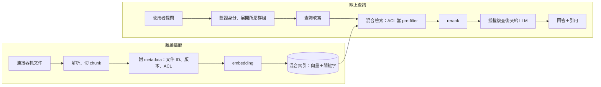
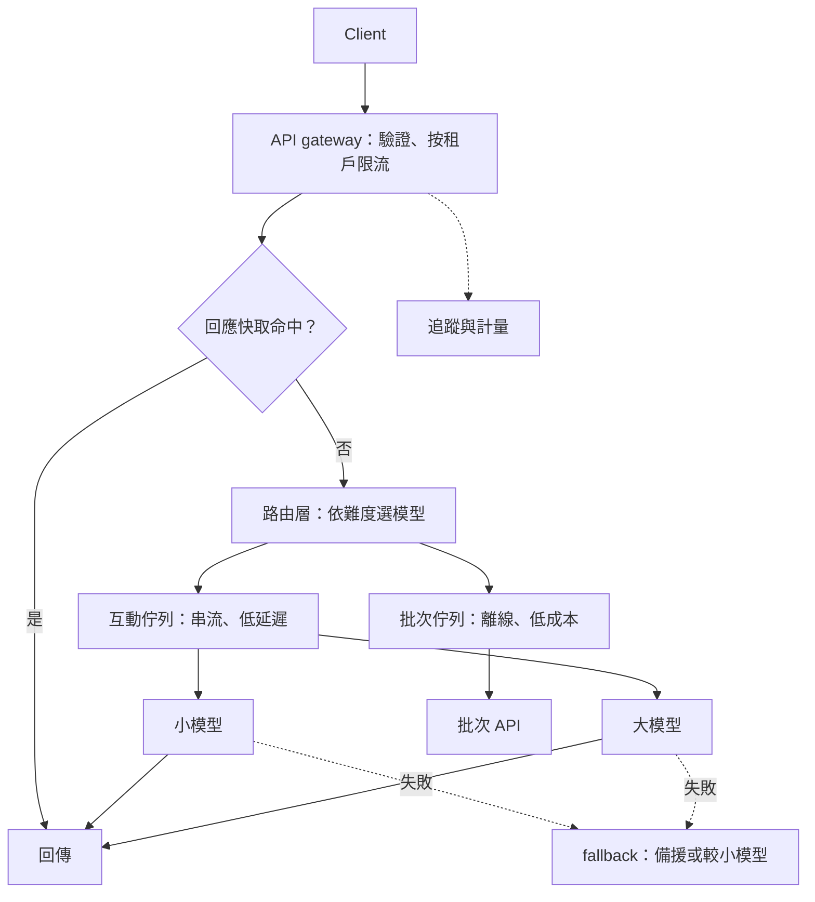
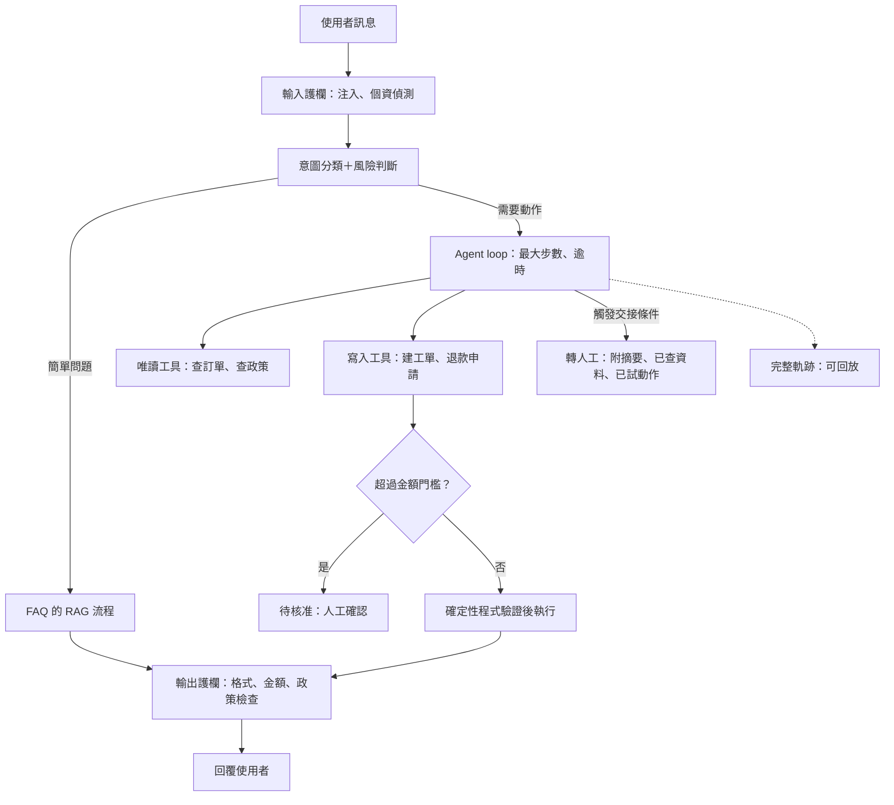
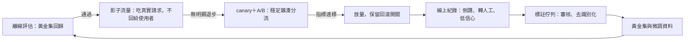
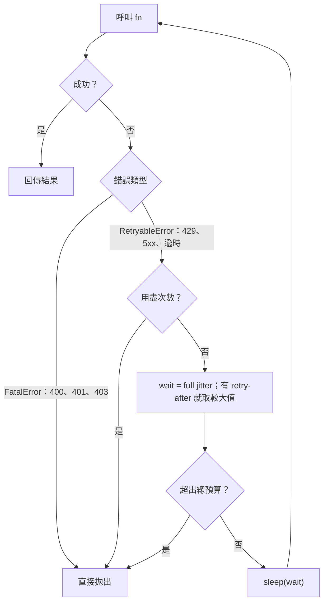

> 🌏 [English version](/en/posts/ai/2026-10-03-ai-interview-design-coding-behavioral-en)

AI Engineer 面試走到最後，考的通常不是你認不認得某個名詞，而是三件事：能不能在白板前把一個系統講完整，能不能在編輯器裡寫出一段會動的程式，能不能用一個真實的故事證明你做過事。這篇是「AI Engineer 面試準備」系列的收尾，把這三件事各給一套可以直接套用的骨架。

內容有四塊：四題面試常被問到的系統設計（企業知識庫 RAG、LLM 推論服務、客服 Agent、線上評估與資料飛輪）、三題 [Python](https://www.python.org/)（動態批次、取樣、重試加限流）、行為面試的 STAR 骨架。系統設計每題附可照著講的範例回答與自我核對清單，程式題附實際執行輸出與複雜度。

先講兩個讀法。第一，本文只寫查得到一手來源的事實，來源直接連在句子裡；價格、各 tier 的限額與模型名稱變動很快，一律不寫，面試時講機制，要報數字就說「以官方文件當下為準」。第二，行為面試一節只給骨架，`[填入你的專案]` 要換成你自己的真實經歷。

## 先有框架：四題系統設計共用的答題節奏

系統設計題最常見的失敗，是一開口就畫圖，十分鐘後才發現沒問過規模。下面的節奏四題通用，時間占比只是建議配比。

| 步驟 | 時間占比 | 要做的事 |
|---|---|---|
| 1. 釐清需求 | 約 15% | 使用者是誰、規模、延遲／品質／成本哪個優先、有哪些不能出錯的事、成功指標 |
| 2. 高階架構 | 約 20% | 先畫資料流：入口、處理、儲存、輸出；只講元件，不講細節 |
| 3. 核心 trade-off | 約 35% | 挑 2 到 3 個關鍵決策，每個都講「選 A 不選 B，因為……，代價是……」 |
| 4. 監控與失敗處理 | 約 20% | 指標、告警、降級、回滾、人工介入點 |
| 5. 總結 | 約 10% | 30 秒收束：重講決策、承認限制、說下一步 |

開場可以直接說：「我先確認幾個需求，再畫整體架構，接著挑兩三個關鍵取捨深入，最後談監控與失敗處理。」這句話本身就在展現結構化。

## 題目一：設計企業內部知識庫問答系統

### 釐清需求

先問四件事：

- 文件有多少、什麼型態（PDF、Wiki、工單、試算表），更新頻率是每日還是即時？
- 使用者規模與 QPS 多大，延遲看首 token 還是完整回答？
- 權限模型是依部門、角色，還是文件個別 [ACL](https://en.wikipedia.org/wiki/Access-control_list)？離職或調職要多快生效？
- 答錯的成本多高？是否一定要附引用、允許回答「我不知道」？

下面假設十萬份文件、數百人同時使用、答錯有合規風險，所以優先順序是權限正確，其次答案有據，最後才是延遲。

### 高階架構

分兩條線：離線的攝取管線，與線上的查詢路徑。



切塊與檢索組合的細節見站內的 [Chunking 策略](/posts/ai/2026-03-12-chunking-strategies)、[Hybrid Search](/posts/ai/2026-03-12-hybrid-search-bm25-vector-rrf) 與 [Cross-Encoder Reranking](/posts/ai/2026-03-12-cross-encoder-reranking)。

### 核心 trade-off

**權限：pre-filter 還是 post-filter。** 我會在檢索階段就用 ACL 當過濾條件，而不是檢索完再丟掉沒權限的結果。後過濾會讓 top-k 被沒權限的內容占滿，使用者拿到的結果變少，嚴重時還會洩漏「這份文件存在」。代價是索引要同步 ACL 的變動，所以讓 ACL 變更走獨立的事件流、優先於內容更新處理，生成前再做一次授權複查當保險。各向量資料庫對 metadata filter 的實作差異很大，這點我沒有逐一查證，面試時說「要實測過濾後的召回與延遲」就夠了，不要編數字；選型可參考站內的 [Vector Database 選型](/posts/ai/2026-03-12-vector-database-comparison)。

**更新：增量而不是全量重建。** 用內容雜湊判斷哪些 chunk 變了，只重做變動的部分。刪除要用 tombstone（刪除標記），並定期對帳，避免舊版本被答出來。

**評估：檢索與生成分開看。** 檢索看 recall@k、MRR，生成看有據性（faithfulness）與答案相關性。先用人工標註的黃金集，再用 LLM-as-judge 擴大。[RAGAS](https://arxiv.org/abs/2309.15217) 提出了不需要標準答案、從檢索與生成多個面向評分的做法；[MT-Bench 論文](https://arxiv.org/abs/2306.05685)則報告強模型當裁判時，與人類偏好的一致率可超過 80%，同時指出裁判有位置、冗長與自我偏好三種偏誤，所以仍要定期用人工抽樣校準。站內有 [RAG 評估框架選型](/posts/ai/2026-03-12-rag-evaluation-frameworks)和 [LLM-as-Judge](/posts/ai/2026-03-12-self-reflection-llm-as-judge)可對照。

### 監控與失敗處理

監控四個指標：檢索空結果率、引用覆蓋率、使用者倒讚率、延遲分位數。搭配 [RAG Observability](/posts/ai/2026-03-12-rag-observability-tracing) 的逐節點追蹤，出問題才知道壞在檢索還是生成。

失敗時降級成「只回傳相關文件連結」，並讓「查無資料」成為合法答案。另一個一定要提的風險是間接注入：文件內容可能夾帶惡意指令。[OWASP 的 LLM01 條目](https://genai.owasp.org/llmrisk/llm01-prompt-injection/)明確指出 RAG 與 fine-tuning 都不能完全消除 prompt injection，建議區隔不可信內容、驗證輸出格式、最小權限，高風險動作要人工核可。輸入輸出兩側的防線可看 [RAG Guardrails](/posts/ai/2026-03-12-rag-guardrails)。

### 總結

權限放在檢索層、更新做成增量、評估拆成檢索與生成兩段；下一步先做黃金集與離線評估，再談規模化。

### 範例回答

我先確認需求：假設十萬份文件、數百人同時使用、答錯有合規風險，所以優先順序是權限正確、答案有據、延遲。

架構分兩條線。離線攝取：解析、切 chunk，每個 chunk 帶來源文件 ID、版本與 ACL，做 embedding 後寫入向量加關鍵字的混合索引。線上查詢：先驗證身分並展開群組，查詢改寫、混合檢索、rerank，再交給 LLM，要求只根據內容回答並附引用。

第一個關鍵取捨是權限。我會在檢索階段就用 ACL 當過濾條件，因為後過濾會讓 top-k 被沒權限的內容占滿，結果變少甚至洩漏存在性。代價是索引要同步 ACL 變動，所以 ACL 變更走獨立事件流，優先處理，生成前再授權複查一次。

第二個取捨是更新。我用內容雜湊做增量更新，只重做變動的 chunk；刪除用 tombstone，並定期對帳。

評估把檢索與生成分開看，先用黃金集，再用 LLM-as-judge 擴大，並定期人工校準。失敗時降級成只回傳相關文件連結，「查無資料」是合法答案。

### 自我核對清單

- [ ] 先問了規模、延遲與錯誤成本，而不是直接畫圖？
- [ ] 權限在檢索階段過濾，而且說得出為什麼不是後過濾？
- [ ] 說明了 ACL 變更與內容更新的時效差異？
- [ ] 講了刪除與舊版本的處理（tombstone、對帳）？
- [ ] 評估拆成檢索與生成，並提到黃金集與人工校準？
- [ ] 有「查無資料」與降級路徑，也提到引用與可追溯？
- [ ] 沒有報出自己無法佐證的數字？

## 題目二：設計 LLM 服務的推論架構

### 釐清需求

- 自架模型（例如 [vLLM](https://docs.vllm.ai/) 這類推論引擎），還是呼叫外部 API，還是混合？
- 流量型態是互動式（要低延遲、要串流），還是批次（可以等）？尖峰與平均差多少？
- 品質底線：哪些請求一定要用最強的模型？
- 成本上限與 SLO，例如 TTFT（首 token 時間）與完整回應的 p95。

### 高階架構

先把流量分成互動式與批次，兩者的目標不同：前者看首 token 延遲與串流體驗，後者看每 token 的成本，所以走不同佇列。



### 核心 trade-off

**吞吐與延遲。** 自架時吞吐主要被 KV cache 的記憶體限制。[PagedAttention](https://arxiv.org/abs/2309.06180)（vLLM 的核心）用分頁管理 KV cache、降低浪費，論文報告在相近延遲下吞吐提升 2 到 4 倍。另一個問題是 prefill 與 decode 交錯執行會造成延遲抖動，[Sarathi-Serve](https://arxiv.org/abs/2403.02310) 提出的 chunked prefill 就是在調整這個取捨。vLLM 的細節可看站內的 [vLLM 推論引擎](/posts/ai/2026-03-14-vllm-inference-engine)。

**快取分兩層。** 第一層是 provider 的 prompt 快取：把固定的 system prompt、工具定義、長文件放前面，變動內容放後面，因為快取比對的是前綴。[Anthropic 的 prompt caching 文件](https://platform.claude.com/docs/en/build-with-claude/prompt-caching)與 [OpenAI 的 prompt caching 指南](https://developers.openai.com/api/docs/guides/prompt-caching)都是這個邏輯。以 Anthropic 為例，依其[限流文件](https://platform.claude.com/docs/en/api/rate-limits)，對大多數模型，被快取讀取的 token 不計入輸入 TPM 限額，等於同時省錢、又提高有效吞吐。第二層是自己的回應快取，只對可重複、不含個資的查詢開，命中看語意相似度門檻，錯誤命中的風險要靠評估量測，見站內的 [Semantic Caching](/posts/ai/2026-03-12-semantic-caching)。

**路由。** 簡單請求走小模型，困難的走大模型，這是 Anthropic 在 [Building effective agents](https://www.anthropic.com/engineering/building-effective-agents) 裡列的 routing 模式之一。路由器本身要便宜，並用線上抽樣檢查誤派。

**離線流量改走批次 API。** 依 [Message Batches 文件](https://platform.claude.com/docs/en/build-with-claude/batch-processing)，批次以標準價的 50% 計費，多數批次一小時內完成，超過 24 小時未完成會過期。適合離線評估與大量標註，不適合互動請求。

### 監控與失敗處理

遇到 429，要讀 `retry-after` 做指數退避加抖動。但 [Anthropic 的限流文件](https://platform.claude.com/docs/en/api/rate-limits)特別說明：月度額度上限（spend cap）造成的 429 不會帶 `retry-after`，重試只會一直失敗，這種情形要直接降級或告警。官方 [SDK 預設會重試兩次](https://platform.claude.com/docs/en/api/errors)並遵守 `retry-after`，自己寫重試時可以照同樣的規則，這正是後面 C3 的內容。失敗時依序 fallback 到備援模型或較小模型，限流用 token bucket 按租戶分桶，避免單一客戶吃光額度。站內的 [RAG 配額系統](/posts/ai/2026-03-12-rag-token-quota-system)有一個雙重限制的實例。

多租戶的快取隔離也要提。vLLM 的 [Automatic Prefix Caching](https://docs.vllm.ai/en/latest/design/prefix_caching/) 以區塊雜湊實作，可用 `cache_salt` 隔離不同信任群組，避免用延遲差推測他人的 prompt；[OpenAI 文件](https://developers.openai.com/api/docs/guides/prompt-caching)同樣提到用不同 key 防止 cache-hit probing。

要盯的指標：TTFT、每 token 延遲、佇列深度、快取命中率、錯誤率、每請求成本。自架與 API 的成本交叉點、特定 GPU 的 tokens/sec 我沒有查證，面試時說「要用自己的 workload 壓測」，不要報數字。

### 總結

先分流量，再用快取與路由壓成本，最後用限流與 fallback 守住 SLO。

### 範例回答

先分流量：互動式與批次。互動式看首 token 延遲與串流體驗，批次看每 token 成本，兩者走不同佇列。

架構：API gateway 做驗證與限流，接著是路由層與模型後端（自架或外部 API），旁邊有兩層快取，全程追蹤計量。

取捨一是吞吐與延遲。自架時吞吐被 KV cache 記憶體卡住，PagedAttention 用分頁管理，論文報告相近延遲下吞吐提升 2 到 4 倍；prefill 與 decode 交錯會造成抖動，chunked prefill 是在調這個取捨。

取捨二是快取。第一層是 provider 的前綴快取，固定內容放前面；第二層是自己的回應快取，只對可重複、無個資的查詢開。取捨三是路由：簡單走小模型、困難走大模型，路由器要便宜，並抽樣檢查誤派。

韌性方面，429 要讀 retry-after 做退避加抖動，但額度用盡型的 429 不會帶 retry-after，要直接降級；失敗依序 fallback，限流按租戶分桶。監控看 TTFT、佇列深度、快取命中率與每請求成本。

### 自我核對清單

- [ ] 先分了互動式與批次流量？
- [ ] 講得出吞吐與延遲的取捨，而不只是列名詞？
- [ ] 快取分兩層，而且知道固定內容放前面？
- [ ] 路由有說明誤派的風險與偵測方式？
- [ ] 429 的處理：退避、抖動、尊重 retry-after，並知道額度用盡型不該重試？
- [ ] 有 fallback 順序與按租戶限流？
- [ ] 提到多租戶的快取隔離？
- [ ] 沒有報任何查不到的 benchmark 或價格？

## 題目三：設計一個客服 Agent

### 釐清需求

- 要處理哪些意圖（查訂單、退款、改地址、投訴）？哪些「寫入類」動作不可逆？
- 自動解決率的目標？可容忍的錯誤成本？有沒有法規限制（個資、金融）？
- 渠道是網頁、LINE 還是電話？需要多輪記憶嗎？

### 高階架構

原則是從最簡單能用的開始。Anthropic 在 [Building effective agents](https://www.anthropic.com/engineering/building-effective-agents) 區分了兩種系統：由預先定義的程式碼路徑編排的 workflow，與由 LLM 自行決定流程與工具的 agent；並建議能用簡單方案就不要上 agent，因為 agent 是拿延遲與成本換彈性，還可能讓錯誤累積。客服剛好是適合 agent 的場景，因為有對話、有工具、成功可以被量測。



### 核心 trade-off

**自主程度。** 查詢類全自動；退款這類寫入動作加上金額門檻，超過就產生「待核准」，由人確認，這對應 [OWASP](https://genai.owasp.org/llmrisk/llm01-prompt-injection/) 建議的高風險動作人工核可。迴圈本身要設最大步數與逾時。

**護欄。** 輸入端偵測 prompt injection 與個資；輸出端用確定性的程式驗證格式、金額與政策條件，不能只靠 prompt 叫模型守規則。[Anthropic 也提到](https://www.anthropic.com/engineering/building-effective-agents)，把護欄與主要回應交給不同模型實例，通常效果更好。這一層可以對照站內的 [RAG Guardrails](/posts/ai/2026-03-12-rag-guardrails)。

**人機交接。** 觸發條件包含：使用者要求、情緒偏激、連續兩次沒解決、信心低、命中敏感意圖。交接時要帶上對話摘要、已查到的資料、已嘗試的動作，客服才不必重問一次。

**工具設計與權限。** 工具描述要像寫給新人的 docstring，附範例與邊界；[Anthropic 提到](https://www.anthropic.com/engineering/building-effective-agents)，他們在 [SWE-bench](https://arxiv.org/abs/2310.06770) 的 agent 上，花在優化工具的時間比優化 prompt 還多。權限採最小權限，agent 使用「當前使用者」的憑證，不給萬用金鑰。更多 agent 架構模式見站內的 [AI Agent 架構模式完整指南](/posts/ai/2026-03-18-ai-agent-patterns-guide)。

### 監控與失敗處理

離線用真實對話建回歸測試集，量測工具選擇正確率、任務完成率與違規率；線上看解決率、轉人工率、重複來電與 CSAT。LLM-as-judge 可用，但同樣要人工抽樣校準，原因見前面引用的 [MT-Bench 論文](https://arxiv.org/abs/2306.05685)。

工具逾時重試一次後，道歉並轉人工；所有工具呼叫與決策都留下軌跡，方便回放。至於業界的實際解決率、成本下降比例，我沒有查到可靠來源，面試時不要引用。

### 總結

自主度分級、權限最小化、關鍵動作用確定性程式把關、交接資訊完整，再用線上指標驅動迭代。

### 範例回答

我先問：哪些動作會改變狀態、錯了的成本多高。假設有查詢類與退款類。原則是從最簡單能用的開始：客服適合 agent，因為有對話、有工具、成功可量測，但不必一開始就上多 agent。

架構：入口先做意圖分類與風險判斷，簡單問題走 FAQ 的 RAG；需要動作的走 agent loop，工具採最小權限，用當前使用者的憑證。

關鍵取捨一是自主程度。查詢類全自動；退款加金額門檻，超過就產生待核准，由人確認；迴圈設最大步數與逾時。取捨二是護欄：輸入端偵測注入與個資，輸出端用確定性程式驗證格式、金額與政策條件。取捨三是人機交接：使用者要求、情緒偏激、連續兩次沒解決、信心低或命中敏感意圖就轉人工，並帶上摘要與已嘗試的動作。

評估分兩邊：離線用真實對話建回歸集，看工具選擇正確率與違規率；線上看解決率、轉人工率與 CSAT。工具逾時重試一次就道歉並轉人工，全程留軌跡。

### 自我核對清單

- [ ] 先區分唯讀與寫入工具，並依風險分級自主度？
- [ ] 有最大步數、逾時等停止條件？
- [ ] 護欄包含確定性驗證，而不只是 prompt？
- [ ] 工具是最小權限、以使用者身分呼叫？交接的觸發條件與內容都有講？
- [ ] 評估分離線回歸集與線上指標，並含違規率？
- [ ] 有完整軌跡與回放能力？
- [ ] 說明了為何不一開始就用最複雜的多 agent？

## 題目四：設計線上評估、A/B 測試與資料飛輪

這題大多是統計與實驗設計的通用知識，我不引用廠商數字；唯一引用的外部研究是 LLM-as-judge。

### 釐清需求

- 要評估的是新模型、新 prompt，還是新檢索策略？北極星指標是什麼（轉換、解決率、留存）？
- 能拿到即時的使用者回饋嗎？標註成本與延遲多大？
- 風險：新版本若變差，傷害多大？能不能先用影子流量？

### 高階架構



### 核心 trade-off

**指標分三層。** 護欄指標（延遲、錯誤率、安全違規）不能變差；主要指標（例如任務成功率）決定要不要上線；診斷指標（例如檢索 recall、引用率）用來解釋為什麼。

**四個階段。** 離線評估固定黃金集跑回歸，沒通過不上線；影子流量讓新版本吃真實請求但不回給使用者，比對輸出與成本；canary 加 A/B 依使用者 ID 做穩定雜湊分流，避免同一個人在兩組間跳來跳去，樣本量與觀察期事先決定、涵蓋完整的使用週期，避免提早偷看結果；最後放量並保留回滾開關。站內的 [RAG A/B 測試](/posts/ai/2026-03-12-rag-ab-testing)有 pipeline 層級的實作細節。

**解讀結果的注意點。** 先檢查樣本比例（SRM），不正常代表分流有 bug，後面的分析都不可信；LLM 輸出變異大，需要較多樣本，或用配對設計降低變異；新奇效應會讓初期數據偏樂觀；同時比較多個指標要控制偽陽性。樣本量怎麼算，我不給數字，面試時說「依基準率、最小可偵測效果、顯著水準與檢定力計算」，並且能手算兩比例檢定。

**沒有標準答案時怎麼評。** 用隱性訊號（重問、複製、倒讚、轉人工）加 LLM-as-judge。[MT-Bench 論文](https://arxiv.org/abs/2306.05685)指出的位置、冗長、自我偏好偏誤，對應的做法是隨機交換回答順序、控制長度、用不同於被評模型的裁判，再定期用人工標註校準。

### 監控與失敗處理

護欄指標越線就自動回滾。資料飛輪有三個地方會出事：回饋有選擇偏誤（只有不滿意的人才按倒讚）、使用者資料涉及隱私與同意、把模型自己的輸出當標準答案會造成回音效應。所以標註佇列要有人工審核與去識別化。飛輪的完整脈絡可看站內的 [Stanford CS329Z 導讀 Week 6：資料飛輪](/posts/ai/2026-09-14-stanford-cs329z-week6-data-flywheel)。

### 總結

離線擋退步、影子看風險、A/B 驗證價值、飛輪持續累積資料，全程可回滾。

### 範例回答

我先定義三層指標：護欄指標（延遲、錯誤率、安全違規，不能變差）、主要指標（例如任務成功率）、診斷指標（例如檢索 recall、引用率）。

流程分四階段。第一，離線評估：固定黃金集跑回歸，沒通過不准上線。第二，影子流量：新模型吃真實請求但不回給使用者，比對輸出與成本。第三，小流量 canary 加 A/B：依使用者 ID 做穩定雜湊分流，預先決定樣本量與觀察期，避免提早偷看。第四，放量並保留回滾開關。

注意點：先檢查 SRM，不正常代表分流有 bug；LLM 輸出變異大，需要較多樣本或配對設計；新奇效應會讓初期偏樂觀；多指標要控制偽陽性。沒有標準答案時，用隱性訊號加 LLM-as-judge，隨機交換順序、定期人工校準。

飛輪方面：線上失敗案例送進標註佇列，審核後進黃金集與微調資料，再評估下一版；要留意選擇偏誤、隱私與回音效應。

### 自我核對清單

- [ ] 有分護欄、主要、診斷三類指標？
- [ ] 有離線、影子、canary／A/B、放量四個階段？
- [ ] 提到穩定分流、SRM、預先決定樣本量與觀察期？
- [ ] 提到新奇效應與多重比較？沒有標準答案時有做法？
- [ ] 飛輪含標註、審核、隱私與選擇偏誤？
- [ ] 有回滾機制？

## Coding：ML 風格的三道題

三題都在 Python 3.11.15 與 [NumPy](https://numpy.org/) 2.4.6 上實際執行過，下面的輸出就是這份程式跑出來的。這類題目的評分重點通常不在寫出來，而在邊界與測試：有沒有主動講清規則、有沒有自己寫測試。

### C1：動態批次（dynamic batching）

**題目。** 推論服務收到零散的請求。請實作「湊滿 `max_batch_size`，或最舊請求等待達 `max_wait` 就送出」的批次器。

**面試重點。** 講清楚規則與邊界（剛好在 deadline 到達的請求算哪個 batch？）；沒請求時要阻塞，不能空轉；batch 失敗時所有等待者都要收到例外；單一請求不能被無限期卡住。

下面提供兩個版本：用模擬時間的純函式（可以確定性地測），以及接近真實服務寫法的 [asyncio](https://docs.python.org/3/library/asyncio.html) 版。

```python
"""C1: 動態批次（dynamic batching）

規則：一個 batch 在「湊滿 max_batch_size」或「最舊請求等待達 max_wait」時就送出，先到先得。
提供兩個版本：
  1. form_batches：用模擬時間的純函式（可確定性測試）
  2. DynamicBatcher：asyncio 版（接近真實服務的寫法）
"""
from __future__ import annotations

import asyncio
from dataclasses import dataclass


# ---------- 版本 1：純函式，模擬時間 ----------
@dataclass(frozen=True)
class Req:
    id: str
    arrival: float  # 秒


def form_batches(requests: list[Req], max_batch_size: int, max_wait: float):
    """回傳 [(dispatch_time, [req_id, ...]), ...]。requests 需依 arrival 排序。

    Time: O(n)；Space: O(max_batch_size) 的暫存 + O(n) 輸出。
    """
    if max_batch_size < 1 or max_wait < 0:
        raise ValueError("max_batch_size >= 1 and max_wait >= 0 required")
    out: list[tuple[float, list[str]]] = []
    cur: list[Req] = []
    for r in requests:
        # 新請求到達前，目前 batch 的 deadline 是否已先到？
        if cur and r.arrival >= cur[0].arrival + max_wait:
            out.append((cur[0].arrival + max_wait, [x.id for x in cur]))
            cur = []
        cur.append(r)
        if len(cur) == max_batch_size:
            out.append((r.arrival, [x.id for x in cur]))  # 滿了立刻送
            cur = []
    if cur:  # 尾端沒有新請求，等到 deadline
        out.append((cur[0].arrival + max_wait, [x.id for x in cur]))
    return out


# ---------- 版本 2：asyncio ----------
class DynamicBatcher:
    """submit(item) -> awaitable 結果。背景 task 負責湊 batch 並呼叫 batch_fn。"""

    def __init__(self, batch_fn, max_batch_size: int, max_wait: float):
        self.batch_fn = batch_fn  # async def (list[item]) -> list[result]
        self.max_batch_size = max_batch_size
        self.max_wait = max_wait
        self._q: asyncio.Queue = asyncio.Queue()
        self._task: asyncio.Task | None = None
        self.batch_sizes: list[int] = []

    async def start(self):
        self._task = asyncio.create_task(self._loop())

    async def stop(self):
        if self._task:
            self._task.cancel()
            try:
                await self._task
            except asyncio.CancelledError:
                pass

    async def submit(self, item):
        fut = asyncio.get_running_loop().create_future()
        await self._q.put((item, fut))
        return await fut

    async def _loop(self):
        loop = asyncio.get_running_loop()
        while True:
            first = await self._q.get()  # 沒請求就阻塞，不空轉
            batch = [first]
            deadline = loop.time() + self.max_wait
            while len(batch) < self.max_batch_size:
                timeout = deadline - loop.time()
                if timeout <= 0:
                    break
                try:
                    batch.append(await asyncio.wait_for(self._q.get(), timeout))
                except asyncio.TimeoutError:
                    break
            self.batch_sizes.append(len(batch))
            items = [b[0] for b in batch]
            try:
                results = await self.batch_fn(items)
                for (_, fut), res in zip(batch, results):
                    if not fut.done():
                        fut.set_result(res)
            except Exception as e:  # 一個 batch 失敗，不能讓所有 future 永遠掛著
                for _, fut in batch:
                    if not fut.done():
                        fut.set_exception(e)


# ---------- 測試 ----------
def test_pure():
    R = Req
    # 1) 湊滿就送
    got = form_batches([R("a", 0.0), R("b", 0.01), R("c", 0.02)], 3, 0.05)
    assert got == [(0.02, ["a", "b", "c"])], got
    # 2) 逾時送出，之後的請求開新 batch
    got = form_batches([R("a", 0.0), R("b", 0.01), R("c", 0.20)], 8, 0.05)
    assert got == [(0.05, ["a", "b"]), (0.25, ["c"])], got
    # 3) 剛好在 deadline 到達 -> 屬於下一個 batch
    got = form_batches([R("a", 0.0), R("b", 0.05)], 8, 0.05)
    assert got == [(0.05, ["a"]), (0.10, ["b"])], got
    # 4) 空輸入
    assert form_batches([], 4, 0.1) == []
    # 5) max_wait=0 等於不批次
    got = form_batches([R("a", 0.0), R("b", 0.0), R("c", 1.0)], 4, 0.0)
    assert [ids for _, ids in got] == [["a"], ["b"], ["c"]], got
    # 6) 每個請求恰好出現一次、batch 不超過上限
    reqs = [R(str(i), i * 0.003) for i in range(100)]
    got = form_batches(reqs, 7, 0.02)
    flat = [i for _, ids in got for i in ids]
    assert flat == [r.id for r in reqs] and all(len(ids) <= 7 for _, ids in got)
    print("pure OK, 100 reqs ->", len(got), "batches")


async def test_async():
    calls: list[list[int]] = []

    async def fake_model(items):
        calls.append(list(items))
        await asyncio.sleep(0.005)
        return [x * 2 for x in items]

    b = DynamicBatcher(fake_model, max_batch_size=4, max_wait=0.05)
    await b.start()
    # 10 個請求同時到：應為 4 + 4 + 2
    res = await asyncio.gather(*[b.submit(i) for i in range(10)])
    assert res == [i * 2 for i in range(10)], res
    assert b.batch_sizes == [4, 4, 2], b.batch_sizes
    # 單一請求：不會被卡死，約 max_wait 後送出
    t0 = asyncio.get_running_loop().time()
    assert await b.submit(21) == 42
    dt = asyncio.get_running_loop().time() - t0
    assert 0.04 <= dt < 0.2, dt
    # batch_fn 失敗時，所有等待者都收到例外
    async def boom(items):
        raise RuntimeError("model down")
    b2 = DynamicBatcher(boom, 4, 0.01)
    await b2.start()
    rs = await asyncio.gather(*[b2.submit(i) for i in range(3)], return_exceptions=True)
    assert all(isinstance(r, RuntimeError) for r in rs), rs
    await b.stop(); await b2.stop()
    print(f"async OK, batch_sizes={b.batch_sizes}, single-request latency={dt*1000:.0f}ms")


if __name__ == "__main__":
    test_pure()
    asyncio.run(test_async())
    print("C1 ALL PASSED")
```

實際執行輸出：

```text
pure OK, 100 reqs -> 15 batches
async OK, batch_sizes=[4, 4, 2, 1], single-request latency=56ms
C1 ALL PASSED
```

**複雜度。** `form_batches` 時間 O(n)、空間 O(n)（輸出）加上 O(B) 暫存，B 是 `max_batch_size`。`DynamicBatcher` 每個請求入佇列與出佇列各 O(1)，單一 batch 的等待延遲上界是 `max_wait` 加模型執行時間，空間 O(佇列長度)。

**取捨。** `max_wait` 愈大，批次愈滿、吞吐愈高，但單一請求的尾延遲愈長。追問時可以補充：真實的 LLM 服務因為每個請求的輸出長度不同，排程粒度會細到每一個 decode 步驟，而不是整批同進同出；這是推論引擎在處理的問題，細節請讀原始論文，[PagedAttention 論文](https://arxiv.org/abs/2309.06180)則是從 KV cache 記憶體切入同一個瓶頸。

### C2：temperature、top-k 與 top-p 取樣

**題目。** 給一組 logits，實作 temperature、top-k、[top-p](https://arxiv.org/abs/1904.09751)（nucleus）取樣。

**面試重點。** softmax 要數值穩定（先減最大值）；top-p 的邊界是「累積機率第一次 ≥ p」的那個 token 要保留，所以至少留 1 個；過濾後要重新正規化；top-k 與 top-p 同時存在時取較嚴者；temperature 必須大於 0，等於 0 時改走 greedy。

```python
"""C2: temperature + top-k + top-p (nucleus) sampling，純 numpy。"""
from __future__ import annotations

import numpy as np


def softmax(x: np.ndarray) -> np.ndarray:
    x = x - np.max(x)  # 數值穩定
    e = np.exp(x)
    return e / e.sum()


def filter_probs(logits, temperature=1.0, top_k=0, top_p=1.0) -> np.ndarray:
    """回傳過濾並重新正規化後的機率分布。

    順序：temperature -> top-k -> top-p（與常見實作一致）。
    Time: O(V log V)（argsort；只做 top-k 可用 argpartition 降到 O(V)）；Space: O(V)。
    """
    logits = np.asarray(logits, dtype=np.float64)
    if logits.ndim != 1 or logits.size == 0:
        raise ValueError("logits must be 1-D and non-empty")
    if temperature <= 0:
        raise ValueError("temperature must be > 0 (use greedy for 0)")
    if not (0 < top_p <= 1):
        raise ValueError("top_p must be in (0, 1]")
    V = logits.size
    probs = softmax(logits / temperature)

    order = np.argsort(-probs, kind="stable")  # 由大到小；stable 讓 tie 可重現
    keep = np.zeros(V, dtype=bool)
    k = V if top_k <= 0 else min(top_k, V)
    sorted_p = probs[order][:k]
    if top_p < 1.0:
        csum = np.cumsum(sorted_p)
        # 保留「累積機率第一次 >= top_p」的那個 token（含），所以至少留 1 個
        cut = int(np.searchsorted(csum, top_p, side="left")) + 1
        k = min(k, cut)
    keep[order[:k]] = True

    out = np.where(keep, probs, 0.0)
    return out / out.sum()


def sample(logits, temperature=1.0, top_k=0, top_p=1.0, rng=None) -> int:
    rng = rng or np.random.default_rng()
    p = filter_probs(logits, temperature, top_k, top_p)
    return int(rng.choice(p.size, p=p))


# ---------- 測試 ----------
def test_all():
    logits = np.log(np.array([0.5, 0.3, 0.15, 0.05]))  # softmax 後即為此分布

    # top_k=1 等於 greedy
    p = filter_probs(logits, top_k=1)
    assert p.argmax() == 0 and p[0] == 1.0

    # top_k=2：只剩前兩個，重新正規化 -> 0.5/0.8, 0.3/0.8
    p = filter_probs(logits, top_k=2)
    assert np.allclose(p, [0.625, 0.375, 0, 0]), p

    # top_p=0.7：累積 0.5, 0.8 -> 保留前兩個
    p = filter_probs(logits, top_p=0.7)
    assert np.allclose(p, [0.625, 0.375, 0, 0]), p

    # top_p=0.5：第一個就達標 -> 只留 1 個（邊界：>= 而非 >）
    p = filter_probs(logits, top_p=0.5)
    assert np.allclose(p, [1, 0, 0, 0]), p

    # top_p 極小仍至少留 1 個
    p = filter_probs(logits, top_p=1e-9)
    assert p.sum() == 1.0 and (p > 0).sum() == 1

    # top_k 與 top_p 同時：取較嚴者
    p = filter_probs(logits, top_k=3, top_p=0.95)  # 累積 .5,.8,.95 -> 3 個
    assert (p > 0).sum() == 3
    p = filter_probs(logits, top_k=2, top_p=0.95)
    assert (p > 0).sum() == 2

    # temperature：低溫更尖、高溫更平
    lo = filter_probs(logits, temperature=0.5)
    hi = filter_probs(logits, temperature=2.0)
    assert lo[0] > 0.5 > hi[0]

    # 數值穩定：超大 logits 不會 NaN / overflow
    p = filter_probs([1000.0, 999.0, -1000.0], top_p=0.9)
    assert np.isfinite(p).all() and abs(p.sum() - 1) < 1e-12

    # 抽樣頻率逼近過濾後分布，且不會抽到被截掉的 token
    rng = np.random.default_rng(0)
    draws = np.array([sample(logits, top_k=2, rng=rng) for _ in range(20000)])
    freq = np.bincount(draws, minlength=4) / draws.size
    assert freq[2] == 0 and freq[3] == 0
    assert abs(freq[0] - 0.625) < 0.01, freq

    # 可重現
    a = [sample(logits, rng=np.random.default_rng(42)) for _ in range(5)]
    b = [sample(logits, rng=np.random.default_rng(42)) for _ in range(5)]
    assert a == b

    # 非法輸入
    for bad in (dict(temperature=0), dict(top_p=0), dict(top_p=1.5)):
        try:
            filter_probs(logits, **bad)
        except ValueError:
            pass
        else:
            raise AssertionError(bad)
    print("empirical freq (top_k=2):", np.round(freq, 3).tolist(), "expected [0.625, 0.375, 0, 0]")
    print("C2 ALL PASSED")


if __name__ == "__main__":
    test_all()
```

實際執行輸出：

```text
empirical freq (top_k=2): [0.621, 0.379, 0.0, 0.0] expected [0.625, 0.375, 0, 0]
C2 ALL PASSED
```

**複雜度。** 時間 O(V log V)（`argsort`，V 是詞表大小），只做 top-k 時可用 `argpartition` 降到 O(V)；空間 O(V)。可追問的方向：先 top-k 再 top-p，還是反過來；重複懲罰；為什麼可重現性需要固定 RNG。

### C3：指數退避重試與 token bucket 限流

**題目。** (a) 對可能回 429 或 5xx 的呼叫實作重試：指數退避、加抖動（jitter）、尊重 `Retry-After`、有總時間預算、不可重試的錯誤不重試。(b) 實作 token bucket 限流器。

**面試重點。**

- 只重試可重試的錯誤。早於 `retry-after` 重試必定失敗，所以等待時間取「退避」與「retry-after」兩者較大值。[Anthropic 的錯誤文件](https://platform.claude.com/docs/en/api/errors)說明，官方 SDK 預設以指數退避重試兩次並遵守該標頭。
- 一個重要的邊界：月度額度上限造成的 429 沒有 `retry-after`，重試只會一直失敗，見[限流文件](https://platform.claude.com/docs/en/api/rate-limits)。實務上要靠錯誤碼區分，這種情形直接降級或告警。
- 加抖動是為了避免大量客戶端同時重試造成驚群（thundering herd）。
- token bucket 用「惰性補充」（lazy refill），不需要背景執行緒；允許突發到 capacity，長期速率等於 rate。Anthropic 的限流就是用 token bucket，所以額度是持續補充、而不是固定視窗重置。
- 時間與 sleep 都可注入，測試才不用真的等。



```python
"""C3: retry with exponential backoff（full jitter、尊重 Retry-After）+ token bucket rate limiter。
時間與睡眠都可注入，測試不用真的等。"""
from __future__ import annotations

import random
from dataclasses import dataclass
from typing import Callable


# ---------- retry ----------
class RetryableError(Exception):
    """可重試（429 / 5xx / 逾時）。retry_after：伺服器建議等待秒數。"""

    def __init__(self, msg="", retry_after: float | None = None):
        super().__init__(msg)
        self.retry_after = retry_after


class FatalError(Exception):
    """不可重試（400 / 401 / 403...）。"""


def retry_with_backoff(
    fn: Callable[[], object],
    *,
    max_attempts: int = 5,
    base: float = 0.5,
    cap: float = 30.0,
    deadline: float | None = None,  # 總預算（秒），避免重試把使用者等到天荒地老
    sleep: Callable[[float], None],
    now: Callable[[], float],
    rng: random.Random | None = None,
):
    """Full jitter：sleep = uniform(0, min(cap, base * 2**attempt))。
    若伺服器給 retry_after，等待時間不得短於它（早於 retry-after 重試必定失敗）。
    Time：最多 max_attempts 次呼叫；Space：O(1)。"""
    rng = rng or random.Random()
    start = now()
    for attempt in range(max_attempts):
        try:
            return fn()
        except FatalError:
            raise  # 不重試
        except RetryableError as e:
            if attempt == max_attempts - 1:
                raise
            wait = rng.uniform(0, min(cap, base * 2**attempt))
            if e.retry_after is not None:
                wait = max(wait, e.retry_after)
            if deadline is not None and (now() - start) + wait > deadline:
                raise  # 再等就超出總預算
            sleep(wait)


# ---------- token bucket ----------
class TokenBucket:
    """容量 capacity、每秒補 rate 個 token。允許突發至 capacity，長期速率 = rate。
    allow(cost) O(1) 時間、O(1) 空間（lazy refill，不需背景執行緒）。"""

    def __init__(self, rate: float, capacity: float, now: Callable[[], float]):
        if rate <= 0 or capacity <= 0:
            raise ValueError("rate and capacity must be > 0")
        self.rate, self.capacity, self._now = rate, capacity, now
        self.tokens = capacity
        self.last = now()

    def _refill(self):
        t = self._now()
        self.tokens = min(self.capacity, self.tokens + (t - self.last) * self.rate)
        self.last = t

    def allow(self, cost: float = 1.0) -> bool:
        if cost > self.capacity:
            return False  # 永遠不可能通過，直接拒絕
        self._refill()
        if self.tokens >= cost:
            self.tokens -= cost
            return True
        return False

    def wait_time(self, cost: float = 1.0) -> float:
        """還要等幾秒才夠 cost 個 token（可回傳給呼叫端當 Retry-After）。"""
        self._refill()
        return max(0.0, (cost - self.tokens) / self.rate)


# ---------- 測試 ----------
class FakeClock:
    def __init__(self):
        self.t = 0.0
        self.sleeps: list[float] = []

    def now(self):
        return self.t

    def sleep(self, s):
        self.sleeps.append(s)
        self.t += s


def test_retry():
    # 前兩次失敗、第三次成功
    clk, n = FakeClock(), {"c": 0}

    def flaky():
        n["c"] += 1
        if n["c"] < 3:
            raise RetryableError("429")
        return "ok"

    assert retry_with_backoff(flaky, sleep=clk.sleep, now=clk.now, rng=random.Random(1)) == "ok"
    assert n["c"] == 3 and len(clk.sleeps) == 2
    # full jitter：第 k 次等待落在 [0, base*2^k]
    assert 0 <= clk.sleeps[0] <= 0.5 and 0 <= clk.sleeps[1] <= 1.0, clk.sleeps

    # 不可重試錯誤：只呼叫 1 次
    clk, n = FakeClock(), {"c": 0}

    def fatal():
        n["c"] += 1
        raise FatalError("401")

    try:
        retry_with_backoff(fatal, sleep=clk.sleep, now=clk.now)
    except FatalError:
        pass
    assert n["c"] == 1 and clk.sleeps == []

    # 用盡次數：拋出最後一個錯誤，總共 max_attempts 次呼叫、max_attempts-1 次睡眠
    clk, n = FakeClock(), {"c": 0}

    def always():
        n["c"] += 1
        raise RetryableError("503")

    try:
        retry_with_backoff(always, max_attempts=4, sleep=clk.sleep, now=clk.now, rng=random.Random(0))
    except RetryableError:
        pass
    assert n["c"] == 4 and len(clk.sleeps) == 3

    # Retry-After 必須被尊重
    clk, n = FakeClock(), {"c": 0}

    def ra():
        n["c"] += 1
        if n["c"] == 1:
            raise RetryableError("429", retry_after=7.0)
        return "ok"

    retry_with_backoff(ra, sleep=clk.sleep, now=clk.now, rng=random.Random(0))
    assert clk.sleeps[0] >= 7.0, clk.sleeps

    # 總預算：retry_after=7 但 deadline=5 -> 直接放棄，不睡
    clk = FakeClock()

    def over():
        raise RetryableError("429", retry_after=7.0)

    try:
        retry_with_backoff(over, deadline=5.0, sleep=clk.sleep, now=clk.now)
    except RetryableError:
        pass
    assert clk.sleeps == []

    # cap 生效：base=1, cap=2，大量 attempt 後等待上限仍 <= 2
    clk = FakeClock()
    try:
        retry_with_backoff(always, max_attempts=12, base=1, cap=2, sleep=clk.sleep, now=clk.now, rng=random.Random(3))
    except RetryableError:
        pass
    assert max(clk.sleeps) <= 2.0
    print("retry OK (success-after-2-failures, fatal, exhausted, retry-after, deadline, cap)")


def test_bucket():
    clk = FakeClock()
    b = TokenBucket(rate=2, capacity=5, now=clk.now)  # 每秒 2 個，最多突發 5
    assert [b.allow() for _ in range(6)] == [True] * 5 + [False]  # 突發 5 個
    assert abs(b.wait_time() - 0.5) < 1e-9  # 缺 1 個，rate=2 -> 0.5 秒
    clk.t += 0.5
    assert b.allow() and not b.allow()
    clk.t += 100  # 補滿但不超過 capacity
    b._refill()
    assert b.tokens == 5
    assert b.allow(cost=5) and not b.allow(cost=0.1)
    assert not b.allow(cost=6)  # 超過容量永遠拒絕
    # 長期速率：模擬 60 秒、每 0.1 秒嘗試一次，通過數應 ≈ capacity + rate*60
    clk2 = FakeClock(); b2 = TokenBucket(rate=2, capacity=5, now=clk2.now); ok = 0
    for _ in range(600):
        ok += b2.allow(); clk2.t += 0.1
    assert 120 <= ok <= 126, ok
    print(f"bucket OK; 60s long-run allowed={ok} (expected ≈ 5 + 2*60 = 125)")


if __name__ == "__main__":
    test_retry()
    test_bucket()
    print("C3 ALL PASSED")
```

實際執行輸出：

```text
retry OK (success-after-2-failures, fatal, exhausted, retry-after, deadline, cap)
bucket OK; 60s long-run allowed=124 (expected ≈ 5 + 2*60 = 125)
C3 ALL PASSED
```

**複雜度。** `retry_with_backoff` 最多呼叫 `max_attempts` 次，額外空間 O(1)；單次等待不超過 `min(cap, base·2^k)`。`TokenBucket.allow` 與 `wait_time` 時間、空間都是 O(1)；多租戶時每個租戶一個 bucket，空間 O(租戶數)。可追問：分散式限流（共用儲存加原子操作、滑動視窗）、以 token 數而不是請求數計費（`cost` 參數就是為此）、客戶端與伺服器端限流的分工。

## 行為面試：STAR 骨架

行為題沒有標準答案，但有標準結構。每題先用一句話定調，再依 S（情境）、T（任務）、A（行動）、R（結果）展開。下面每個 `[填入……]` 都要換成你的真實經歷與你自己能佐證的事實；沒有數字，就描述可觀察的變化，不要估算編造。

**B1. 你做過最有挑戰性的專案是什麼？**
- S／T：[填入你的專案] 的背景、使用者、為什麼重要。成功的定義是什麼？有哪些限制（時間、資料、預算、人力）？
- A：最難的 2 到 3 個決策。你放棄了哪個方案、依據什麼資料？哪些是你做的、哪些是團隊做的？
- R：[填入可驗證的結果]。事後回頭看，哪個決策你會改？
- 面試官在看：難度是否真實、個人貢獻的邊界、取捨能力。

**B2. 模型上線後出問題，你怎麼處理？**
- S／T：[填入事件]：發生了什麼異常、怎麼被發現的？你當時的角色與止血目標？
- A：照順序講：止血（回滾、關 feature flag、降級）、溝通、定位（資料漂移、prompt 改動、上游服務）、修復、預防。你怎麼確認「真的修好了」？
- R：[填入結果]，以及留下什麼機制（事後檢討、回歸測試）。
- 面試官在看：先止血再追因的優先順序、可回滾的設計、溝通、是否責怪他人。
- 沒有真實事故時：可以講演練、險些出事的經驗，或在其他系統看到的案例，但要明講是什麼，不要包裝成自己的。

**B3. 跟 PM 或設計師意見衝突時怎麼辦？**
- S／T：[填入情境]：雙方各自想要什麼？分歧在目標、優先序，還是對可行性的認知？
- A：先確認對方的目標與限制；把爭論轉成可驗證的問題（原型、小實驗、看資料）；提出選項與成本，而不是只說「不行」；必要時升級給有決策權的人。
- R：[填入結果]，之後的合作關係如何？
- 面試官在看：同理心、用資料說服、把技術限制翻成商業語言、決定後全力執行。

**B4. 怎麼向非技術者解釋 AI 的限制？**
- S／T：[填入對象與場合]（主管、客戶、法務），目標是讓對方形成正確期待並做出好決策。
- A：從對方關心的結果講起；講它擅長什麼、不擅長什麼、錯的時候長什麼樣；給具體的失敗例子；提供緩解方案（引用來源、人工複核、信心門檻）；用範例而不是術語。
- R：[填入對方理解後做了什麼不同的決定]。
- 面試官在看：溝通清晰、誠實不誇大、能把限制轉成設計決策。

**B5. 說一次失敗的經驗。**
- S／T：[填入你的失敗專案或決策]，當時你負責什麼、預期什麼？
- A：你做了什麼導致、或沒能避免失敗？有哪些警訊被忽略？你的哪個假設錯了？
- R：實際後果（誠實講），以及你之後具體改變的工作方式：[填入一個可觀察的改變]。
- 面試官在看：當責、自我覺察、學到的是行為改變而不是口號。
- 避免：「我太認真、太完美主義」這類偽缺點；把原因全推給外部；沒有後續改變。

**B6. 在不確定性很高時如何做決策？**
- S／T：[填入一個目標明確但資訊不足的情境]，例如要不要引入某項新技術、選哪個方案，以及必須在什麼期限內決定。
- A：建議套這五步並配上真實案例：(1) 釐清哪些不確定性會改變決策，其餘先忽略；(2) 區分可逆與不可逆的決策，可逆的快速試、不可逆的多花時間；(3) 把最大的未知變成小實驗或原型，設定停損條件；(4) 事先寫下假設與判斷標準；(5) 決定後說清楚「出現什麼訊號會改變主意」。
- R：[填入結果]，包含決策錯了時你如何調整。
- 面試官在看：風險意識、不因資訊不足而癱瘓、以實驗取代爭論。

**行為題通用核對清單**

- [ ] 每個故事都有「我」做了什麼，說得出個人貢獻？
- [ ] 結果有可觀察的證據；沒有數字就講事實，不估算？
- [ ] 準備 4 到 5 個素材，可跨題重複使用，每個 2 到 3 分鐘講完？
- [ ] 每題都有「學到什麼、之後怎麼做」？
- [ ] 沒有把任何不是你的經歷說成你的？

## 整體來說

四題系統設計在練同一件事：先問清楚，再選一條主線，對每個決定說得出代價。三題程式是：規則講清楚、邊界寫進測試、複雜度主動報。行為題則是把你真正做過的事，整理成別人聽得懂的順序。

面試前一晚可以做三件事：挑一題系統設計，計時 30 分鐘，用上面的五步從頭講到尾；把三題程式各自默寫一次，再跑一遍測試；寫下 4 到 5 個你自己的故事素材，先填完每個 `[填入……]`。

## 題庫裡常見的題目

這一節從[7 個公開 GitHub 題庫](/posts/ai/2026-09-30-ai-engineer-interview-resources)整理出跨題庫重複出現的題目，並標出每題對應本文的哪一段。「出現在幾個題庫」只代表題庫之間的重疊，不代表真實面試的頻率；amitshekhar 與 pallavi 兩個題庫沒有來源，它們的公司標籤本文不採用。這裡只列題目與出處連結，沒有轉載答案。

計算「獨立來源數」時，amit 與 pal 疑似同一機構維護、有 26 題近乎逐字相同，合算為 1 個來源；ks-llm 與 ks-rag 同作者，合算為 1 個來源，所以最大值是 5。題目文字是合併意思相同的題目後的概括，不是原文逐字；「本文未涵蓋」表示本文沒有對應段落。

### 系統設計

| 題目 | 獨立來源數 | 題庫連結 | 本文對應段落 |
|---|---:|---|---|
| 設計企業 RAG 助理／內部文件問答（含存取控制與引用） | 4 | [om](https://github.com/ombharatiya/AI-Engineer-Interview-Questions/blob/main/11-ai-system-design/case-studies/01-enterprise-rag-assistant.md) [aeg](https://github.com/alexeygrigorev/ai-engineering-field-guide/blob/main/interview/questions/questions.md?plain=1#L256) [AIML](https://github.com/alirezadir/AIMLInterviews/blob/main/src/MLSD/ml-system-design.md#generative-ai--llm-systems-2026) [amit](https://github.com/amitshekhariitbhu/ai-engineering-interview-questions/blob/main/README.md#L530) [pal](https://github.com/pallavi-shekhar/ai-engineering-interview-questions-company-wise/blob/main/README.md#L384) | 題目一：設計企業內部知識庫問答系統 |
| 設計 ChatGPT 規模聊天助理的推論服務架構（LLM 推論系統） | 4 | [om](https://github.com/ombharatiya/AI-Engineer-Interview-Questions/blob/main/14-company-interview-questions/openai.md) [aeg](https://github.com/alexeygrigorev/ai-engineering-field-guide/blob/main/interview/questions/questions.md?plain=1#L250) [amit](https://github.com/amitshekhariitbhu/ai-engineering-interview-questions/blob/main/README.md#L528) [pal](https://github.com/pallavi-shekhar/ai-engineering-interview-questions-company-wise/blob/main/README.md#L405) [ks](https://github.com/KalyanKS-NLP/LLM-Interview-Questions-and-Answers-Hub/blob/main/Interview_QA/QA_61-63.md) | 題目二：設計 LLM 服務的推論架構 |
| 設計大規模 AI 搜尋（例如大型商品目錄的語意搜尋） | 4 | [om](https://github.com/ombharatiya/AI-Engineer-Interview-Questions/blob/main/11-ai-system-design/case-studies/04-semantic-search.md) [aeg](https://github.com/alexeygrigorev/ai-engineering-field-guide/blob/main/interview/questions/questions.md?plain=1#L261) [AIML](https://github.com/alirezadir/AIMLInterviews/blob/main/src/MLSD/ml-system-design.md#search-systems-retrieval-ranking) [amit](https://github.com/amitshekhariitbhu/ai-engineering-interview-questions/blob/main/README.md#L569) [pal](https://github.com/pallavi-shekhar/ai-engineering-interview-questions-company-wise/blob/main/README.md#L391) | 本文未涵蓋 |
| 設計內容審核／有害內容偵測系統 | 4 | [om](https://github.com/ombharatiya/AI-Engineer-Interview-Questions/blob/main/11-ai-system-design/case-studies/05-content-moderation-pipeline.md) [aeg](https://github.com/alexeygrigorev/ai-engineering-field-guide/blob/main/interview/questions/questions.md?plain=1#L236) [AIML](https://github.com/alirezadir/AIMLInterviews/blob/main/src/MLSD/ml-system-design.md#other) [pal](https://github.com/pallavi-shekhar/ai-engineering-interview-questions-company-wise/blob/main/README.md#L394) | 本文未涵蓋 |
| 設計能執行實際動作、含 guardrails 並可轉人工的客服 Agent | 3 | [om](https://github.com/ombharatiya/AI-Engineer-Interview-Questions/blob/main/11-ai-system-design/case-studies/03-customer-support-agent.md) [AIML](https://github.com/alirezadir/AIMLInterviews/blob/main/src/MLSD/ml-system-design.md#generative-ai--llm-systems-2026) [amit](https://github.com/amitshekhariitbhu/ai-engineering-interview-questions/blob/main/README.md#L534) [pal](https://github.com/pallavi-shekhar/ai-engineering-interview-questions-company-wise/blob/main/README.md#L389) | 題目三：設計一個客服 Agent |
| 設計 AI 程式助理（補全、對話、agentic 編輯） | 3 | [om](https://github.com/ombharatiya/AI-Engineer-Interview-Questions/blob/main/11-ai-system-design/case-studies/02-ai-code-assistant.md) [aeg](https://github.com/alexeygrigorev/ai-engineering-field-guide/blob/main/interview/questions/questions.md?plain=1#L274) [amit](https://github.com/amitshekhariitbhu/ai-engineering-interview-questions/blob/main/README.md#L546) [pal](https://github.com/pallavi-shekhar/ai-engineering-interview-questions-company-wise/blob/main/README.md#L386) | 本文未涵蓋 |
| 設計問答引擎：3 秒內串流出附引用的答案 | 2 | [om](https://github.com/ombharatiya/AI-Engineer-Interview-Questions/blob/main/14-company-interview-questions/perplexity.md) [pal](https://github.com/pallavi-shekhar/ai-engineering-interview-questions-company-wise/blob/main/README.md#L1544) | 題目一：設計企業內部知識庫問答系統 |
| 設計 LLM gateway：路由、故障轉移、快取、預算、限流 | 2 | [om](https://github.com/ombharatiya/AI-Engineer-Interview-Questions/blob/main/11-ai-system-design/case-studies/10-llm-gateway-and-serving-platform.md) [amit](https://github.com/amitshekhariitbhu/ai-engineering-interview-questions/blob/main/README.md#L570) [pal](https://github.com/pallavi-shekhar/ai-engineering-interview-questions-company-wise/blob/main/README.md#L402) | 題目二：設計 LLM 服務的推論架構 |
| 設計 LLM 評估平台 | 1 | [amit](https://github.com/amitshekhariitbhu/ai-engineering-interview-questions/blob/main/README.md#L541) | 題目四：設計線上評估、A/B 測試與資料飛輪 |

### Coding

| 題目 | 獨立來源數 | 題庫連結 | 本文對應段落 |
|---|---:|---|---|
| 對 logits 向量實作 temperature、top-k、top-p 取樣 | 4 | [om](https://github.com/ombharatiya/AI-Engineer-Interview-Questions/blob/main/12-coding-challenges/03_sampling.py) [aeg](https://github.com/alexeygrigorev/ai-engineering-field-guide/blob/main/interview/questions/questions.md?plain=1#L387) [AIML](https://github.com/alirezadir/AIMLInterviews/blob/main/src/MLC/ml-coding.md#language-models-lm) [amit](https://github.com/amitshekhariitbhu/ai-engineering-interview-questions/blob/main/README.md#L928) [pal](https://github.com/pallavi-shekhar/ai-engineering-interview-questions-company-wise/blob/main/README.md#L422) | C2：temperature、top-k 與 top-p 取樣 |
| 實作帶因果遮罩的 scaled dot-product／多頭注意力 | 4 | [om](https://github.com/ombharatiya/AI-Engineer-Interview-Questions/blob/main/12-coding-challenges/01_attention.py) [aeg](https://github.com/alexeygrigorev/ai-engineering-field-guide/blob/main/interview/questions/questions.md?plain=1#L377) [AIML](https://github.com/alirezadir/AIMLInterviews/blob/main/src/MLC/ml-coding.md#language-models-lm) [amit](https://github.com/amitshekhariitbhu/ai-engineering-interview-questions/blob/main/README.md#L920) [pal](https://github.com/pallavi-shekhar/ai-engineering-interview-questions-company-wise/blob/main/README.md#L411) | 本文未涵蓋 |
| 實作 KV cache 與單步（自迴歸）解碼 | 3 | [om](https://github.com/ombharatiya/AI-Engineer-Interview-Questions/blob/main/12-coding-challenges/06_kv_cache.py) [AIML](https://github.com/alirezadir/AIMLInterviews/blob/main/src/MLC/ml-coding.md#language-models-lm) [amit](https://github.com/amitshekhariitbhu/ai-engineering-interview-questions/blob/main/README.md#L924) [pal](https://github.com/pallavi-shekhar/ai-engineering-interview-questions-company-wise/blob/main/README.md#L417) | 題目二：設計 LLM 服務的推論架構 |
| 實作基本 RAG 管線（embed、建索引、檢索、組裝上下文） | 2 | [om](https://github.com/ombharatiya/AI-Engineer-Interview-Questions/blob/main/12-coding-challenges/08_semantic_search_rag.py) [amit](https://github.com/amitshekhariitbhu/ai-engineering-interview-questions/blob/main/README.md#L883) | 題目一：設計企業內部知識庫問答系統 |
| 寫串流 SSE 解析器，處理任意切分的 chunk 邊界 | 2 | [om](https://github.com/ombharatiya/AI-Engineer-Interview-Questions/blob/main/12-coding-challenges/13_streaming_parser.py) [amit](https://github.com/amitshekhariitbhu/ai-engineering-interview-questions/blob/main/README.md#L932) [pal](https://github.com/pallavi-shekhar/ai-engineering-interview-questions-company-wise/blob/main/README.md#L431) | 題目二：設計 LLM 服務的推論架構 |
| 實作最小 Agent 迴圈：工具分派、錯誤處理、步數上限 | 2 | [om](https://github.com/ombharatiya/AI-Engineer-Interview-Questions/blob/main/12-coding-challenges/10_agent_loop.py) [amit](https://github.com/amitshekhariitbhu/ai-engineering-interview-questions/blob/main/README.md#L934) [pal](https://github.com/pallavi-shekhar/ai-engineering-interview-questions-company-wise/blob/main/README.md#L439) | 題目三：設計一個客服 Agent |
| 從零實作 beam search | 2 | [om](https://github.com/ombharatiya/AI-Engineer-Interview-Questions/blob/main/12-coding-challenges/15_beam_search.py) [aeg](https://github.com/alexeygrigorev/ai-engineering-field-guide/blob/main/interview/questions/questions.md?plain=1#L386) | C2：temperature、top-k 與 top-p 取樣 |
| 實作 token bucket 限流器（再擴充為分散式），搭配帶抖動的指數退避 | 2 | [om](https://github.com/ombharatiya/AI-Engineer-Interview-Questions/blob/main/12-coding-challenges/11_rate_limiter_and_retry.py) [amit](https://github.com/amitshekhariitbhu/ai-engineering-interview-questions/blob/main/README.md#L930) [pal](https://github.com/pallavi-shekhar/ai-engineering-interview-questions-company-wise/blob/main/README.md#L427) | C3：指數退避重試與 token bucket 限流 |
| 寫非同步批次處理器：並行上限、帶抖動重試、錯誤隔離 | 1 | [amit](https://github.com/amitshekhariitbhu/ai-engineering-interview-questions/blob/main/README.md#L931) [pal](https://github.com/pallavi-shekhar/ai-engineering-interview-questions-company-wise/blob/main/README.md#L429) | C3：指數退避重試與 token bucket 限流 |

### 行為與公司情境

| 題目 | 獨立來源數 | 題庫連結 | 本文對應段落 |
|---|---:|---|---|
| 請說明你端到端做過的專案，或最有挑戰性、最引以為傲的專案 | 4 | [om](https://github.com/ombharatiya/AI-Engineer-Interview-Questions/blob/main/13-interview-process-and-behavioral/questions.md#1-walk-me-through-an-llm-feature-you-shipped-end-to-end) [aeg](https://github.com/alexeygrigorev/ai-engineering-field-guide/blob/main/interview/questions/questions.md?plain=1#L401) [AIML](https://github.com/alirezadir/AIMLInterviews/blob/main/src/behavioral/behavior.md#common-questions) [amit](https://github.com/amitshekhariitbhu/ai-engineering-interview-questions/blob/main/README.md#L948) [pal](https://github.com/pallavi-shekhar/ai-engineering-interview-questions-company-wise/blob/main/README.md#L522) | 行為面試：STAR 骨架（B1） |
| 請談一次你犯錯、專案或 AI 方案失敗的經驗 | 4 | [om](https://github.com/ombharatiya/AI-Engineer-Interview-Questions/blob/main/13-interview-process-and-behavioral/questions.md#13-tell-me-about-a-time-an-ai-feature-failed-in-production-what-happened-and-what-did-you-change) [aeg](https://github.com/alexeygrigorev/ai-engineering-field-guide/blob/main/interview/questions/questions.md?plain=1#L468) [AIML](https://github.com/alirezadir/AIMLInterviews/blob/main/src/behavioral/behavior.md#common-questions) [pal](https://github.com/pallavi-shekhar/ai-engineering-interview-questions-company-wise/blob/main/README.md#L524) | 行為面試：STAR 骨架（B5） |
| 你如何向非技術利害關係人溝通技術挑戰與 AI 的限制？ | 3 | [aeg](https://github.com/alexeygrigorev/ai-engineering-field-guide/blob/main/interview/questions/questions.md?plain=1#L476) [AIML](https://github.com/alirezadir/AIMLInterviews/blob/main/src/behavioral/behavior.md#common-questions) [amit](https://github.com/amitshekhariitbhu/ai-engineering-interview-questions/blob/main/README.md#L953) [pal](https://github.com/pallavi-shekhar/ai-engineering-interview-questions-company-wise/blob/main/README.md#L518) | 行為面試：STAR 骨架（B4） |
| Take-home：用一份語料做 RAG 服務（約六小時），動手寫程式前你會先做什麼？ | 2 | [om](https://github.com/ombharatiya/AI-Engineer-Interview-Questions/blob/main/13-interview-process-and-behavioral/questions.md#8-we-send-you-a-take-home-build-a-rag-service-over-this-corpus-we-say-roughly-six-hours-what-do-you-do-before-writing-any-code) [aeg](https://github.com/alexeygrigorev/ai-engineering-field-guide/blob/main/interview/questions/questions.md?plain=1#L544) | 先有框架：四題系統設計共用的答題節奏 |
| 與同事或利害關係人起衝突、意見不同時，你如何處理？ | 2 | [AIML](https://github.com/alirezadir/AIMLInterviews/blob/main/src/behavioral/behavior.md#common-questions) [pal](https://github.com/pallavi-shekhar/ai-engineering-interview-questions-company-wise/blob/main/README.md#L595) | 行為面試：STAR 骨架（B3） |
| 副總看過完美展示後期待 100% 準確（或 PM 想在幻覺率 15% 時上線）：你如何管理期望、溝通風險？ | 2 | [om](https://github.com/ombharatiya/AI-Engineer-Interview-Questions/blob/main/15-role-guides/forward-deployed-engineer.md#8-the-vp-saw-a-flawless-demo-and-now-expects-100-accuracy-in-production-how-do-you-manage-that-expectation-without-killing-the-deal) [amit](https://github.com/amitshekhariitbhu/ai-engineering-interview-questions/blob/main/README.md#L958) | 行為面試：STAR 骨架（B4） |
| work trial／限時建置：在我們的程式庫裡有兩天（或幾小時）、沒有指派任務，你會做什麼？ | 2 | [om](https://github.com/ombharatiya/AI-Engineer-Interview-Questions/blob/main/14-company-interview-questions/cursor-anysphere.md) [pal](https://github.com/pallavi-shekhar/ai-engineering-interview-questions-company-wise/blob/main/README.md#L755) | 本文未涵蓋 |
| FDE 情境：客戶因執行長一句「我們需要 AI」就簽約，卻沒有使用情境，你的前兩週怎麼做？ | 1 | [om](https://github.com/ombharatiya/AI-Engineer-Interview-Questions/blob/main/15-role-guides/forward-deployed-engineer.md#1-a-customer-signed-a-contract-because-their-ceo-said-we-need-ai-they-cant-articulate-a-use-case-walk-me-through-your-first-two-weeks) | 行為面試：STAR 骨架（B6） |
| 這一關可以使用 coding agent，我們會觀察你怎麼用。你會怎麼做？ | 1 | [om](https://github.com/ombharatiya/AI-Engineer-Interview-Questions/blob/main/13-interview-process-and-behavioral/questions.md#21-in-this-round-you-can-use-a-coding-agent-and-well-be-watching-how-you-use-it-how-do-you-approach-that) | 本文未涵蓋 |
| 團隊憑感覺改 prompt、沒有 evals，你以 staff engineer 加入，前 90 天會做什麼？ | 1 | [om](https://github.com/ombharatiya/AI-Engineer-Interview-Questions/blob/main/13-interview-process-and-behavioral/questions.md#38-you-join-as-a-staff-engineer-the-team-ships-prompt-changes-on-vibes-has-no-evals-and-as-far-as-they-can-tell-is-shipping-fine-what-do-you-do-in-your-first-90-days) | 題目四：設計線上評估、A/B 測試與資料飛輪 |
| AI 系統品質隨時間下降時，你會怎麼處理？ | 1 | [amit](https://github.com/amitshekhariitbhu/ai-engineering-interview-questions/blob/main/README.md#L952) | 行為面試：STAR 骨架（B2） |

本節只列題目標題與連結，答案請回原 repo 查看。

amit、pal、aeg 的行號連結指向 2026-10-03 當天 main 分支的內容，repo 更新後行號可能位移；連到別題時，請用題目文字到原檔搜尋。

## 系列其他篇

- 第 12 篇：[RAG 面試整理：從三階段流程到 Agentic RAG，九種變體怎麼分、怎麼答](/posts/ai/2026-10-03-ai-interview-rag-variants)
- 第 13 篇：[AI Agent 面試準備：從工具呼叫、記憶到 MCP 與 Prompt Caching](/posts/ai/2026-10-03-ai-interview-agent-mcp-caching)
- 第 14 篇：[Prompt、Context、Harness 三層工程：定義、分界與評估閘門](/posts/ai/2026-10-03-ai-interview-prompt-context-harness)
- 第 15 篇：[LLM 工程面試準備：微調、對齊、推論優化、評估與安全](/posts/ai/2026-10-03-ai-interview-llm-engineering)
- 第 16 篇：[ML 基礎與 Transformer 底層概念：從偏差變異、AdamW 到 attention、RoPE 與 MoE](/posts/ai/2026-10-03-ai-interview-ml-transformer-basics)

## 參考資料

- [Efficient Memory Management for Large Language Model Serving with PagedAttention](https://arxiv.org/abs/2309.06180)：vLLM 的 KV cache 記憶體管理，報告相近延遲下吞吐提升 2 到 4 倍
- [Taming Throughput-Latency Tradeoff in LLM Inference with Sarathi-Serve](https://arxiv.org/abs/2403.02310)：prefill 與 decode 的特性、chunked prefill 與吞吐延遲取捨
- [vLLM：Automatic Prefix Caching](https://docs.vllm.ai/en/latest/design/prefix_caching/)：區塊雜湊與 `cache_salt` 多租戶隔離
- [Anthropic：Prompt caching](https://platform.claude.com/docs/en/build-with-claude/prompt-caching)：前綴快取、TTL 與失效條件
- [Anthropic：Rate limits](https://platform.claude.com/docs/en/api/rate-limits)：token bucket、cache-aware ITPM、429 與 retry-after、spend cap 的 429 沒有 retry-after
- [Anthropic：Errors](https://platform.claude.com/docs/en/api/errors)：錯誤碼、SDK 預設重試兩次與指數退避
- [Anthropic：Message Batches](https://platform.claude.com/docs/en/build-with-claude/batch-processing)：標準價 50%、多數一小時內完成、24 小時過期
- [OpenAI：Prompt caching](https://developers.openai.com/api/docs/guides/prompt-caching)：前綴快取、跨組織不共享、cache-hit probing
- [Anthropic：Building effective agents](https://www.anthropic.com/engineering/building-effective-agents)：workflow 與 agent 的區分、routing、工具設計、客服場景
- [OWASP LLM01:2025 Prompt Injection](https://genai.owasp.org/llmrisk/llm01-prompt-injection/)：直接與間接注入、最小權限、高風險動作人工核可
- [Judging LLM-as-a-Judge with MT-Bench and Chatbot Arena](https://arxiv.org/abs/2306.05685)：LLM 裁判的偏誤與和人類偏好的一致率
- [RAGAS: Automated Evaluation of Retrieval Augmented Generation](https://arxiv.org/abs/2309.15217)：無需標準答案的 RAG 多面向評估
- [The Curious Case of Neural Text Degeneration](https://arxiv.org/abs/1904.09751)：nucleus（top-p）取樣的原始論文
- [Python](https://www.python.org/)、[NumPy](https://numpy.org/)、[asyncio 文件](https://docs.python.org/3/library/asyncio.html)：C1 到 C3 的執行環境
- [SWE-bench: Can Language Models Resolve Real-World GitHub Issues?](https://arxiv.org/abs/2310.06770)：Anthropic 工具設計案例所指的 coding agent 評測
- [ombharatiya/AI-Engineer-Interview-Questions](https://github.com/ombharatiya/AI-Engineer-Interview-Questions) — 題目來源（只引用題目標題）
- [alexeygrigorev/ai-engineering-field-guide](https://github.com/alexeygrigorev/ai-engineering-field-guide) — 題目來源（只引用題目標題）
- [alirezadir/AIMLInterviews](https://github.com/alirezadir/AIMLInterviews) — 題目來源（只引用題目標題）
- [amitshekhariitbhu/ai-engineering-interview-questions](https://github.com/amitshekhariitbhu/ai-engineering-interview-questions) — 題目來源（只引用題目標題）
- [pallavi-shekhar/ai-engineering-interview-questions-company-wise](https://github.com/pallavi-shekhar/ai-engineering-interview-questions-company-wise) — 題目來源（只引用題目標題）
- [KalyanKS-NLP/LLM-Interview-Questions-and-Answers-Hub](https://github.com/KalyanKS-NLP/LLM-Interview-Questions-and-Answers-Hub) — 題目來源（只引用題目標題）
- [KalyanKS-NLP/RAG-Interview-Questions-and-Answers-Hub](https://github.com/KalyanKS-NLP/RAG-Interview-Questions-and-Answers-Hub) — 題目來源（只引用題目標題）
