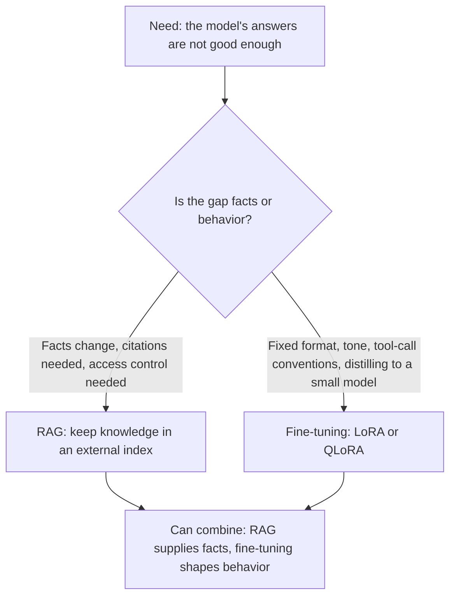
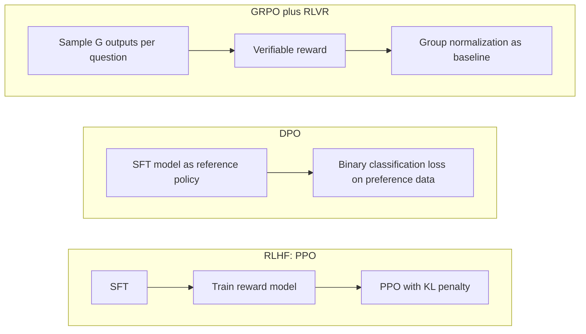
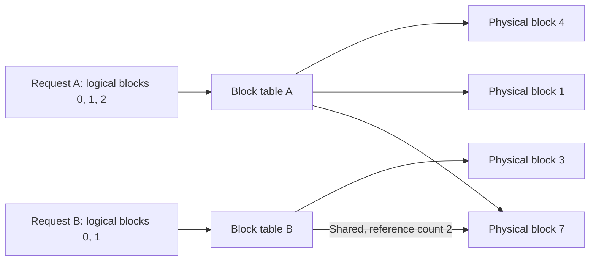
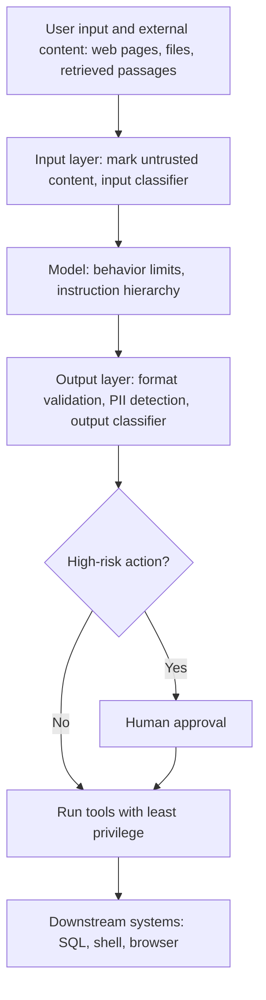

> 🌏 [中文版](/posts/ai/2026-10-03-ai-interview-llm-engineering)

This is part 15 of the "AI Engineer Interview Prep" series. It covers the LLM engineering questions that come up often in interviews: when to fine-tune instead of using RAG, how RLHF, DPO, and GRPO differ, how to speed up inference, how to pick sampling parameters, where evaluation goes wrong, guardrails and the [OWASP](https://owasp.org/www-project-top-10-for-large-language-model-applications) LLM Top 10, and where hallucinations come from.

Each section starts with the concept, then breaks down the mechanism or makes a comparison, and ends with "How to answer," a few sentences you can say out loud. Numbers and research claims link to their sources. Where no primary source could be found, the article covers the concept only.

## 1. Fine-Tuning: LoRA, QLoRA, and When Not to Fine-Tune

Full fine-tuning updates every weight. Each task needs its own checkpoint as large as the original model, and training keeps gradients and optimizer state for every parameter, so it is expensive. [LoRA](https://arxiv.org/abs/2106.09685) freezes the pretrained weights W0 and adds a pair of low-rank matrices B and A next to them, so the forward pass becomes h = W0x + BAx. A starts with a random Gaussian initialization and B starts at zero, so ΔW = BA = 0 at the beginning of training and the model behaves exactly like the original.

### Mechanism: rank and the memory saved

ΔW = BA is (d×r) times (r×k), so its rank is at most r. The paper assumes that weight updates during fine-tuning have a very low intrinsic rank. In its Table 6, with both Wq and Wv adapted, WikiSQL accuracy differs by only 0.1 percentage points between rank 1 and rank 64, though the authors also say they do not expect a tiny r to be enough for every task. The trainable parameter count is easy to work out yourself (d and k are the dimensions of the weight matrix):

```text
Full:  d × k = 4096 × 4096 = 16,777,216
LoRA:  r × (d + k) = 8 × 8192 = 65,536 (about 0.39% of the full count)
```

For GPT-3 175B, the LoRA paper reports training VRAM falling to roughly a third. At deployment, BA can be merged back into W0, so unlike adapter-style methods there is no extra inference latency. One base model can also carry many adapters, and switching tasks only swaps the LoRA weights.

[QLoRA](https://arxiv.org/abs/2305.14314) goes one step further: it quantizes the frozen base model to 4 bits and backpropagates gradients through the quantized weights into the LoRA adapters, which lets a single 48GB GPU fine-tune a 65B model. It has three design pieces:

- **NF4 (4-bit NormalFloat)**: the paper calls it information-theoretically optimal for normally distributed weights.
- **Double Quantization**: quantizes the quantization constants again, saving about 0.37 bits per parameter on average.
- **Paged Optimizers**: use NVIDIA unified memory to absorb memory spikes from long sequences.

At compute time the 4-bit weights are dequantized to BFloat16 before the matrix multiplication. How much slower QLoRA is than LoRA has no primary-source number, so do not quote a multiplier from memory.

### Comparison: is LoRA really as good as full fine-tuning?

Two papers are often asked about together, and they seem to disagree. [LoRA Learns Less and Forgets Less](https://arxiv.org/abs/2405.09673) found, in code and math, that LoRA clearly underperforms full fine-tuning under standard low-rank settings, but retains more capability outside the target domain. The perturbations learned by full fine-tuning had a rank 10 to 100 times higher than typical LoRA configurations. [LoRA Without Regret](https://thinkingmachines.ai/blog/lora/) reports that on small to medium SFT datasets LoRA matches full fine-tuning and only falls behind once the data exceeds LoRA's capacity; LoRA should be applied to all weight matrices (especially MLP layers), and attention-only LoRA does worse even when rank is raised.

The difference comes down to data size relative to LoRA capacity, which layers are adapted, and hyperparameters. Naming those three variables is more convincing than picking a side.

### Judgment: fine-tune or RAG

The core question is whether knowledge or behavior is missing. Three studies point the way (the conclusion is a synthesis, not a quote from any of them):

- [Ovadia et al.](https://arxiv.org/abs/2312.05934) compared unsupervised fine-tuning with RAG, and RAG won consistently on both existing and brand-new knowledge.
- [Gekhman et al.](https://arxiv.org/abs/2405.05904) found that fine-tuning examples carrying new knowledge are learned noticeably slower, and once learned they linearly increase the tendency to hallucinate; their conclusion is that factual knowledge comes mainly from pretraining.
- The [original RAG paper](https://arxiv.org/abs/2005.11401) lists providing provenance for decisions and updating world knowledge as open problems for purely parametric models.



One security point is easy to miss: [OWASP LLM02:2026](https://raw.githubusercontent.com/GenAI-Security-Project/GenAI-LLM-Top10/main/2026/final/LLM02_SensitiveInformationDisclosure.md) notes that fine-tuned models and their LoRA adapters are easier to extract training data from than a base model of the same size, because adapters memorize rare samples with high fidelity. For a fuller decision discussion, see the on-site [RAG vs Fine-tuning](/en/posts/ai/2026-03-12-rag-vs-fine-tuning-en) and [Fine-tuning vs RAG guide](/en/posts/ai/2026-08-26-understanding-ai-models-finetuning-vs-rag-en).

**How to answer**

Split the problem into knowledge and behavior. If facts change or need citations or access control, use RAG; if you need a fixed output format, tone, tool-call conventions, or a distilled small model, use LoRA. Then add the evidence: new knowledge pushed in through fine-tuning is learned slowly and increases hallucination. If asked about rank, say to start small, watch the validation set, and widen the set of adapted matrices first, and do not quote a default value that has no source.

## 2. Alignment: RLHF, DPO, GRPO, and RLVR

Alignment makes a pretrained model, which only continues text, follow what people actually intend. The three routes differ in where the preference signal comes from and whether training samples from the model.

### Mechanism: three routes

[InstructGPT](https://arxiv.org/abs/2203.02155) defined the standard three steps of RLHF: SFT on human demonstrations; train a reward model on human rankings of outputs; then maximize reward with [PPO](https://arxiv.org/abs/1707.06347). The PPO stage adds a per-token KL penalty against the SFT model to reduce over-optimization against the reward model. The result: outputs from the 1.3B InstructGPT were preferred by labelers over those of the 175B GPT-3.

[DPO](https://arxiv.org/abs/2305.18290) observes that the RLHF objective max E[r(x,y)] − β·KL(πθ‖πref) has a closed-form optimum, so it rewrites the reward as the log-probability ratio between the policy and the reference policy. Training then becomes binary cross-entropy on preference data:

```text
L = −E[ log σ( β·log(πθ(yw|x)/πref(yw|x)) − β·log(πθ(yl|x)/πref(yl|x)) ) ]
```

Here yw is the preferred answer, yl is the rejected one, and β controls how far the policy may drift from the reference. The reward is implicit, so there is no separate reward model and no sampling during training. The paper matches or beats PPO on sentiment control, summarization, and single-turn dialogue, and is more robust to sampling temperature; the authors admit that the comparison with PPO on out-of-distribution generalization needs a more complete study.

[GRPO](https://arxiv.org/abs/2402.03300) comes from DeepSeekMath. PPO needs a value function as large as the policy to serve as a baseline, and an LLM usually receives reward only at the last token, which makes it hard to train a value function that is accurate at every token. GRPO samples G outputs per question from the old policy and uses the group-normalized score as the advantage:

```text
Â_i = (r_i − mean(r)) / std(r)   # applied to every token of the i-th output
```

The objective keeps PPO's clipping and puts the KL term directly in the loss. After GRPO, DeepSeekMath-Instruct went from 46.8% to 51.7% on MATH.



### Comparison: GRPO and RLVR live at different layers

The RLVR introduced in [Tülu 3](https://arxiv.org/abs/2411.15124) gives a fixed reward only when the output is verified as correct, which suits skills that can be checked against a reference, such as math and verifiable instruction following. GRPO is an optimization algorithm and RLVR is a source of reward; they can be combined or used separately. DeepSeekMath's GRPO still scores with a reward model, while the R1-Zero model in [DeepSeek-R1](https://arxiv.org/abs/2501.12948) switched to rule-based rewards, with the paper explaining that a neural reward model can be reward-hacked in large-scale RL.

R1-Zero's pass@1 on AIME 2024 rose from 15.6% to 71.0%. These are arXiv v1 numbers; the paper has since been revised, so cite the version.

| Route | Reward source | Strength | Cost |
|---|---|---|---|
| RLHF / PPO | A reward model trained on human preferences | Handles subjective preferences that cannot be verified | Four roles (policy, reference, reward, value); complex and unstable to train |
| DPO | A fixed preference dataset | Simple, stable, offline | Once the policy changes the data is no longer on-policy, so Tülu 3 generated extra on-policy preference data |
| GRPO + RLVR | Answers verified by a program | No critic and no reward model; objective reward | Only works in domains with verifiable answers |

For background, read the on-site [CS336 SFT and RLHF notes](/en/posts/ai/2026-08-22-cs336-sft-rlhf-en) and [Deep RL and RLHF](/en/posts/ai/2026-08-16-cs230-deep-rl-and-rlhf-en).

**How to answer**

DPO needs no reward model because it writes the reward as the log-probability ratio between the policy and the reference, and trains a binary classifier directly on that difference. GRPO's baseline comes from normalizing across several outputs for the same question, which saves a critic as large as the policy. Reasoning models favor rule-based rewards because a verifiable answer keeps the reward objective and avoids reward hacking of a neural reward model. Claims from follow-up work such as "DPO makes outputs longer" have no primary source here, so do not state them as fact.

## 3. Inference Optimization: From KV Cache to Speculative Decoding

An LLM generates one token at a time. The [vLLM paper](https://arxiv.org/abs/2309.06180) points out that this makes the workload memory-bound, leaving GPU compute underused, and the [speculative decoding paper](https://arxiv.org/abs/2211.17192) likewise notes that large-model inference is often limited by memory bandwidth and communication rather than arithmetic. Every technique below addresses the same thing: read less memory, or get more output per read.

### The KV cache and its cost

The KV cache stores the keys and values of past tokens so each step does not recompute the whole sequence, at the price of a lot of memory. The vLLM paper uses OPT-13B as its example: one token's KV cache is 800KB, computed as 2 (K and V) × 5120 (hidden size) × 40 (layers) × 2 bytes (FP16). The general formula can be derived yourself:

```text
KV cache bytes = 2 × layers × KV heads × head dimension × bytes per element × tokens
```

In the vLLM paper's 13B example, about 65% of memory holds the weights and nearly 30% holds dynamic state such as the KV cache. In existing systems, reservation and fragmentation mean only 20.4% to 38.2% of KV cache memory actually stores token state.

Architecture can shrink the KV cache too: [GQA](https://arxiv.org/abs/2305.13245) lets groups of query heads share fewer KV heads, with quality close to multi-head attention and speed close to MQA, which uses a single KV head.

### PagedAttention and vLLM

The size of the KV cache grows with output length and cannot be known in advance, so older systems preallocated the maximum length and suffered internal and external fragmentation. PagedAttention splits the KV cache into fixed-size blocks and uses a block table to map logical blocks to physical ones, which need not be contiguous, so waste drops to nearly zero. It also allows sharing: parallel sampling and beam search use copy-on-write, with reference counts deciding when to copy.



[vLLM](/en/posts/ai/2026-03-14-vllm-inference-engine-en) delivers 2 to 4 times the throughput of the existing systems the paper compares against at similar latency, and the gain grows with longer sequences and larger models. A larger block size lets the kernel process more positions in parallel but wastes more to fragmentation. On whether to self-host, see [the vLLM self-hosting decision](/en/posts/ai/2026-08-21-vllm-self-host-decision-en).

### Scheduling: let finished requests leave the batch immediately

Interviewers often ask about "continuous batching" by name; this article covers only the concept. In a traditional batch, the whole batch must finish before the next one starts, so short answers wait for long ones. The iteration-level scheduling described in the vLLM paper instead lets finished requests leave after each iteration and lets new requests join, so a new request waits only one iteration.

### Quantization: PTQ, QAT, and FP8

Quantization lowers the bit width of weights (sometimes activations too) in exchange for less memory and higher throughput. The table below cites only what each paper reports:

| Method | Type | Key point |
|---|---|---|
| [GPTQ](https://arxiv.org/abs/2210.17323) | PTQ, weights | One-shot, uses approximate second-order information; quantizes a 175B model to 3 or 4 bits in about 4 GPU hours |
| [AWQ](https://arxiv.org/abs/2306.00978) | PTQ, weights | Protects only about 1% of salient weight channels; saliency is judged from the activation distribution, not the weights |
| [SmoothQuant](https://arxiv.org/abs/2211.10438) | PTQ, W8A8 | Shifts the difficulty of activation outliers onto the weights so both can use INT8 |
| [LLM.int8()](https://arxiv.org/abs/2208.07339) | PTQ, 8-bit | Isolates outlier feature dimensions into a 16-bit matrix multiplication; the rest still multiply in 8-bit |
| [LLM-QAT](https://arxiv.org/abs/2305.17888) | QAT | Finds that PTQ breaks down below 8 bits; distills with data the model generates itself and quantizes the KV cache too |
| [FP8 formats](https://arxiv.org/abs/2209.05433) | Data type for training and inference | Defines the E4M3 and E5M2 encodings; matches 16-bit quality when training language models up to 175B parameters |

The trade-off is simple: PTQ is cheap and training-free, and 8 bits is usually enough; QAT costs extra training but buys quality at low bit widths. There is no primary-source number for actual INT4 versus FP8 speedups across hardware, so in an interview say "it depends on the hardware and kernel implementation." Further reading: [quantization and inference optimization](/en/posts/ai/2026-08-26-understanding-ai-models-quantization-en), [TurboQuant+ KV cache compression](/en/posts/ai/2026-04-01-turboquant-plus-kv-cache-compression-en), and the [CS336 inference notes](/en/posts/ai/2026-08-22-cs336-inference-en).

### Speculative decoding

In [Leviathan et al.](https://arxiv.org/abs/2211.17192), a smaller draft model Mq first proposes γ candidate tokens, the target model Mp scores them in parallel, the tokens that preserve the same distribution are accepted, and one more token is drawn from an adjusted distribution. Each call to the target model therefore yields at most γ+1 tokens, never needs more target calls than standard autoregressive decoding in the worst case, and leaves the output distribution identical. The paper reports a 2 to 3 times speedup on T5-XXL, and DeepMind's [speculative sampling](https://arxiv.org/abs/2302.01318) reports 2 to 2.5 times on the 70B Chinchilla.

The cost is extra arithmetic, and the benefit depends on the draft model's acceptance rate α and the cost ratio c. The paper also notes that argmax, top-k, nucleus, and temperature settings can all be converted to standard sampling at the logits level, so they are compatible. Whether the benefit shrinks at very large batch sizes has no primary data here, so do not state it as fact.

### FlashAttention

[FlashAttention](https://arxiv.org/abs/2205.14135) is IO-aware exact attention: it uses tiling to cut reads and writes between GPU high-bandwidth memory (HBM) and on-chip SRAM, memory grows linearly rather than quadratically with sequence length, and it is not an approximation. In the original paper, GPT-2 training at sequence length 1K ran 3 times faster; [FlashAttention-2](https://arxiv.org/abs/2307.08691) improved the work partitioning, and [FlashAttention-3](https://arxiv.org/abs/2407.08608) targets the H100.

A common mix-up: FlashAttention speeds up the attention computation kernel, while PagedAttention manages KV cache memory. They sit at different layers and can coexist.

**How to answer**

For "why is decode memory-bound," say each generated token has to read the full weights and the whole KV cache, so arithmetic intensity is low. Then route by bottleneck: KV cache memory calls for PagedAttention and GQA, oversized weights call for quantization, too little output per step calls for speculative decoding, and a slow attention kernel calls for FlashAttention. If asked whether speculative decoding changes the output, say no: a special rejection-sampling scheme keeps the distribution identical to the target model, which is what separates it from approximate speedups.

## 4. Sampling and Decoding

At each step the model outputs a probability distribution over the whole vocabulary, and the decoding strategy decides how to choose from it. This section relies mainly on the nucleus sampling paper by [Holtzman et al.](https://arxiv.org/abs/1904.09751) (ICLR 2020).

### Four knobs

**Temperature** divides the logits by t before the softmax: p(x) = exp(u/t) / Σ exp(u'/t). With t below 1 the distribution is pushed toward high-probability events, raising quality while lowering diversity. **Top-k** keeps a fixed k candidates; the problem with a fixed k is that it makes text dull when the distribution is flat and admits unsuitable candidates when it is sharp. **Top-p (nucleus)** takes the smallest set of words whose cumulative probability reaches p, so the candidate count moves with the model's confidence; the paper notes that common values of p fall between 0.9 and 1.

**Beam search** looks for the highest-probability whole sequence and degenerates into repetition loops in open-ended generation. The paper measured repetition rates with GPT-2 Large over 5,000 passages (up to 200 tokens):

| Decoding method | Repetition rate |
|---|---|
| Human text | 0.28% |
| Greedy decoding | 73.66% |
| beam=16 | 28.94% |
| nucleus, p=0.95 | 0.36% |

Human-written text is not the highest-probability text. The paper found that the probability of repeating rises with every repetition, a positive feedback loop that probability-maximizing search falls straight into. Conversely, pure sampling with no truncation draws unrelated words from the unreliable tail, which is why the tail has to be cut.

### Which setting for which task

- **Tasks tightly constrained by the input, such as translation and summarization**: the paper says beam search is usually used, though overly large beams still have problems.
- **Open-ended generation such as creative writing and dialogue**: top-p (roughly 0.9 to 0.95) with moderate temperature; too low a temperature falls back into repetition, and the paper notes that sampling temperatures below 0.9 greatly increase repetition.

If asked whether temperature 0 guarantees fully deterministic output, there is no primary source here, so say "usually" and do not present it as a guarantee. For another angle on how sampling fails, see the [CMU 07-280 n-gram sampling notes](/en/posts/ai/2026-08-22-cmu-07280-lecture-18-ngram-sampling-en).

**How to answer**

Start with top-p: its candidate set size follows the shape of the distribution, and in the paper's human-machine evaluation (HUSE) nucleus scored 0.97 against 0.94 for top-k=640. Then say beam search suits tasks with a clear input constraint and repeats in open-ended generation. Asked whether temperature and top-p can be combined, answer yes, usually temperature first to reshape the distribution and then truncation; "tune only one of them" is a rule of thumb, and should be labeled as one.

## 5. LLM Evaluation: Contamination, Judge Bias, and Metrics

Evaluation has three common traps: test questions leaking into training data, systematic bias in LLM judges, and mixing metrics whose scope differs.

### Benchmark contamination

Benchmark Data Contamination (BDC) means a model unintentionally ingests benchmark information from its training data, so the score reflects memorization instead of ability; this [survey](https://arxiv.org/abs/2406.04244) gives a full overview. The most convincing experiment is [GSM1k](https://arxiv.org/abs/2405.00332): researchers hand-wrote a fresh set of problems matched to GSM8k in style and difficulty, and leading models lost up to 8% accuracy on the new problems, with several model families showing systematic overfitting.

Detection techniques such as n-gram overlap and memorization probes were read only at the survey-abstract level here. The approach that can be stated with confidence is to write a fresh problem set from the same distribution and compare the accuracy gap, which is exactly what GSM1k did. More context in the [CS224N benchmark notes](/en/posts/ai/2026-08-22-cs224n-benchmark-evaluation-en) and [How to read a model scorecard](/en/posts/ai/2026-08-26-understanding-ai-models-evaluation-en).

### LLM-as-judge: credible, but biased

The [MT-Bench and LLM-as-a-Judge paper](https://arxiv.org/abs/2306.05685) found that GPT-4 agrees with human preferences more than 80% of the time, matching the agreement between humans; in the setting without ties, GPT-4 agreed with humans 85% of the time, above the 81% agreement between humans. The same paper lists position bias, verbosity bias, self-enhancement bias, and limited reasoning ability.

Later work quantified the bias. [Large Language Models are not Fair Evaluators](https://arxiv.org/abs/2305.17926) found that merely swapping the order in which answers appear can flip the ranking: with ChatGPT as the judge, Vicuna-13B beat ChatGPT on 66 of 80 questions. [LLM Evaluators Recognize and Favor Their Own Generations](https://arxiv.org/abs/2404.13076) shows that GPT-4 and Llama 2 can tell their own outputs from others', and the stronger the self-recognition, the stronger the self-preference.

There are established ways to calibrate. [FairEval](https://arxiv.org/abs/2305.17926) proposes three: write several pieces of evaluation evidence before scoring, aggregate across multiple orderings, and hand hard cases with judge disagreement to humans. MT-Bench first measures judge-human agreement with human annotation before deciding whether the judge can be used at scale; in practice that means sampling human labels to check how often the judge agrees with people. Further reading: [Self-Reflection + LLM-as-Judge](/en/posts/ai/2026-03-12-self-reflection-llm-as-judge-en), [RAG evaluation frameworks](/en/posts/ai/2026-03-12-rag-evaluation-frameworks-en), and the [CS329Z judge and guardrails notes](/en/posts/ai/2026-09-16-stanford-cs329z-week8-judge-safety-en).

### Two metrics you must be able to compute

[Perplexity](https://huggingface.co/docs/transformers/perplexity) (Hugging Face documentation) is the exponential of the average negative log-likelihood of a sequence, equivalent to the exponential of the cross-entropy between the data and the model's predictions:

```text
PPL(X) = exp{ −(1/t) Σ log pθ(x_i | x_<i) }
```

Three points: it applies only to autoregressive (causal) language models, not masked LMs such as BERT; the tokenizer affects the value, so models with different tokenizers cannot be compared directly; and fixed-length models need a sliding window, because cutting into disjoint chunks overestimates it. A lower perplexity also does not mean better generation: Holtzman et al. measured only 1.48 for beam=16, far below human text, yet the output is full of repetition.

pass@k comes from the [Codex paper](https://arxiv.org/abs/2107.03374), which evaluates code generation with [HumanEval](https://arxiv.org/abs/2107.03374): generate n ≥ k samples per problem, count the c samples that pass the unit tests, and use the unbiased estimator:

```text
pass@k = E[ 1 − C(n−c, k) / C(n, k) ]
```

Estimating directly from k samples has high variance, and the paper notes that another plausible-looking calculation clearly underestimates. pass@k measures functional correctness and applies only to tasks with unit tests.

**How to answer**

Asked how to tell whether a benchmark is contaminated, say to write a fresh problem set from the same distribution and compare the gap, which is the GSM1k design. Asked how to reduce a judge's position bias, say to score both orderings and aggregate, write the evidence before the score, and send high-disagreement items to humans. Close by noting that evaluation should be paired with fresh problems and human spot checks.

## 6. Guardrails and Safety: Prompt Injection and the OWASP LLM Top 10

An LLM has no architectural separation between instructions and data. The system prompt, user input, retrieved documents, and tool output are all one stream of tokens, so there is no root-cause fix like parameterized queries in SQL. [OWASP's 2026 LLM01](https://raw.githubusercontent.com/GenAI-Security-Project/GenAI-LLM-Top10/main/2026/final/LLM01_PromptInjection.md) cites the UK NCSC in saying there is currently no clean equivalent of a parameterized query. The design principle is therefore to cut permissions to the minimum outside the model, so that a fooled model cannot do serious damage.

### Attack surface: direct, indirect, and jailbreaks

[OWASP LLM01:2026](https://raw.githubusercontent.com/GenAI-Security-Project/GenAI-LLM-Top10/main/2026/final/LLM01_PromptInjection.md) defines direct injection as user input directly changing model behavior (intentionally or not), and indirect injection as the model pulling in content from external sources such as web pages, files, email, tool responses, RAG passages, or images, where that content carries data that changes behavior. The academic source is [Greshake et al.](https://arxiv.org/abs/2302.12173), who pointed out that LLM-integrated applications blur the line between data and instructions and demonstrated data theft on real systems such as Bing Chat.

OWASP treats jailbreaks as a subset of prompt injection. [Jailbroken](https://arxiv.org/abs/2307.02483) proposes two failure modes of safety training, competing objectives (capability and safety goals conflict) and mismatched generalization (safety training does not cover areas where the model is capable), and notes that scale alone does not fix them. [GCG](https://arxiv.org/abs/2307.15043) automatically generates adversarial suffixes with greedy and gradient-based search, and they transfer to closed models.

### OWASP LLM Top 10: the 2026 edition

According to the [OWASP project page](https://owasp.org/www-project-top-10-for-large-language-model-applications), the current version is "OWASP GenAI LLM Top 10 2026," released on 4 August 2026. Many tutorials still describe the 2025 edition and an interviewer may use either, so learn the differences. The ten entry names come from the [official repo's 2026/final directory](https://github.com/GenAI-Security-Project/GenAI-LLM-Top10/tree/main/2026/final):

| Rank | Entry |
|---|---|
| LLM01 | Prompt Injection |
| LLM02 | Sensitive Information Disclosure |
| LLM03 | Excessive Agency |
| LLM04 | Supply Chain |
| LLM05 | Data and Model Poisoning |
| LLM06 | Unbounded Consumption |
| LLM07 | Misinformation |
| LLM08 | Hidden Context Exposure |
| LLM09 | Vector and Embedding Weaknesses |
| LLM10 | Improper Output Handling |

According to the official [Preface](https://raw.githubusercontent.com/GenAI-Security-Project/GenAI-LLM-Top10/main/2026/final/LLM00_Preface.md), the biggest change in 2026 is that Excessive Agency rose to third, because agent deployments are where harm actually happens. Unbounded Consumption rose four places, Improper Output Handling fell from fifth to tenth, System Prompt Leakage was renamed Hidden Context Exposure with a wider scope, and Prompt Injection and Sensitive Information Disclosure stayed first and second, with Prompt Injection now including cross-modal attacks hidden in images or audio.

The methodology changed too: for the first time community voting (75% of the weight) was combined with incident data. Prompt Injection dropped out of the top ten in the raw incident records, which the authors explain as a defensive effect (teams defend hard, so few clean public exploits exist), but the attack surface is everywhere, so it stays first.

### Defense: layered, and outside the model



The [2025 LLM01 entry](https://genai.owasp.org/llmrisk/llm01-prompt-injection/) lists seven mitigations that map onto the diagram: constrain model behavior, validate output format with deterministic code, filter inputs and outputs, grant least privilege, require human approval for high-risk actions, segregate and label untrusted content, and run adversarial testing. The same entry is candid that RAG and fine-tuning do not fully mitigate prompt injection.

Tools and research that fit each layer:

- **Classifier**: [Llama Guard](https://arxiv.org/abs/2312.06674) is a safety classifier instruction-tuned from Llama2-7b that can classify both prompts and responses.
- **PII detection**: [Microsoft Presidio](https://presidio.dataprivacystack.org/) provides recognition and anonymization modules, and its documentation states that it does not guarantee finding all sensitive information. OWASP LLM02:2026 adds that leakage channels go beyond the final answer to include tool-call parameters, retrieved snippets, and logs.
- **Training layer**: [Instruction Hierarchy](https://arxiv.org/abs/2404.13208) (OpenAI) trains the model to rank system prompts above untrusted text, making it more robust against unseen attack types with little loss of general capability.
- **Architecture layer**: [CaMeL](https://arxiv.org/abs/2503.18813) (Google) builds a protective layer outside the LLM that extracts control flow and data flow from the trusted user query so untrusted data cannot affect program flow; on the agent benchmark used in the paper it solves 77% of tasks with provable security, slightly below the undefended system.
- **Least privilege**: [OWASP LLM03:2026](https://raw.githubusercontent.com/GenAI-Security-Project/GenAI-LLM-Top10/main/2026/final/LLM03_ExcessiveAgency.md) names the root causes of Excessive Agency as too much functionality, too many permissions, and too much autonomy. The remedy is to avoid open-ended tools such as running a shell or fetching arbitrary URLs, use fine-grained tools with strict input schemas, and run them with the user's own permissions.

For RAG and agent settings, see [RAG Guardrails](/en/posts/ai/2026-03-12-rag-guardrails-en), [agent security and trust boundaries](/en/posts/ai/2026-06-04-agent-security-prompt-injection-trust-boundaries-en), and [security at the harness layer](/en/posts/ai/2026-08-10-agent-security-harness-layer-en).

**How to answer**

Asked why prompt injection cannot be fixed like SQL injection, say an LLM has no architectural separation between instructions and data, so the focus is on shrinking the blast radius. Asked how to defend against indirect injection, say to isolate and label external content, keep tool permissions minimal, and require human approval for actions like sending email or deleting, and mention CaMeL as the advanced option. Asked about the most important change in the 2026 edition, say Excessive Agency rose to third, and the official stance is roughly to build the system around the model so that nothing important breaks when it is fooled.

## 7. Hallucination: Causes and Mitigations

A hallucination is output that looks plausible but is wrong. There is more than one cause, and mitigation has to be layered.

### Causes

**Statistics and evaluation incentives.** The paper by [Kalai et al.](https://arxiv.org/abs/2509.04664) argues that when uncertain, models guess and produce plausible but wrong statements instead of admitting uncertainty. In pretraining, if the model cannot tell wrong statements from facts, statistical pressure naturally produces hallucination; it persists because most evaluations reward correct answers and give no credit for "I don't know," effectively training the model to be a good test-taker who guesses. The paper argues for changing how the dominant leaderboards score, so that admitting uncertainty is no longer penalized.

**New knowledge introduced by fine-tuning.** The Gekhman et al. result from section 1 applies here: new knowledge is learned slowly, and once learned it linearly raises the tendency to hallucinate.

**Context and system factors.** [OWASP LLM07:2026](https://raw.githubusercontent.com/GenAI-Security-Project/GenAI-LLM-Top10/main/2026/final/LLM07_Misinformation.md) lists sources including incomplete or stale context, weak grounding, biased or poisoned data, and unverified tool output, and notes that hallucination can also be induced deliberately by attackers; over-trusting fluent, confident output is a key amplifier.

The [survey by Huang et al.](https://arxiv.org/abs/2311.05232) organizes hallucination taxonomies, causes, detection methods, and benchmarks, and discusses the limits of retrieval-augmented LLMs against hallucination, which is why RAG is not a cure-all.

### Mitigations

1. **RAG**: [Lewis et al.](https://arxiv.org/abs/2005.11401) attach an updatable, provenance-carrying non-parametric memory to the generator. For how RAG itself fails, see [common RAG failure modes](/en/posts/ai/2026-03-12-rag-failure-modes-en).
2. **Chain-of-Verification**: [CoVe](https://arxiv.org/abs/2309.11495) has the model draft an answer, plan verification questions and answer them independently, and then produce a verified answer; experiments show it reduces hallucination.
3. **Sampling consistency**: [SelfCheckGPT](https://arxiv.org/abs/2303.08896) is a zero-resource, black-box check: facts the model truly knows stay consistent across samples, while hallucinated ones contradict each other.
4. **System layer**: OWASP LLM07:2026 calls for answers grounded in authoritative, current sources, a Claim-Check-Act pattern that separates generation from execution and verifies claims before acting, groundedness and consistency checks rather than confidence alone, and human approval for high-impact actions.

The accuracy and cost of these methods across models and domains were not checked table by table here, so confirm against the original papers before citing.

**How to answer**

Asked whether RAG solves hallucination, answer no: the survey devotes a discussion to the limits of retrieval augmentation, and retrieval quality and citation verification still need to be checked. Asked why new knowledge should not simply be fine-tuned in, answer that controlled experiments show it is learned slowly and increases hallucination. Asked how to detect hallucination without an external knowledge base, answer sampling consistency (SelfCheckGPT) plus independent verification questions (CoVe).

## Putting It Together

The seven topics share one framework: locate which layer the bottleneck or risk sits in, then pick the cheapest, most verifiable fix. Use fine-tuning for missing behavior and RAG for missing facts; use RLVR when answers are verifiable; find the bottleneck first when inference is slow; and for evaluation and safety, assume the model will be wrong and put verification outside it.

## Questions that keep showing up in public question banks

These are LLM-engineering questions that repeat across the seven public question banks compared in [post 11 of this series](/en/posts/ai/2026-09-30-ai-engineer-interview-resources-en), with questions of the same meaning merged into one row. "Independent sources" only counts overlap between banks; it says nothing about how often a question comes up in real interviews, and the amitshekhariitbhu and pallavi banks cite no sources, so this post does not use their company tags. Only question titles and links to their original location are listed; no answers are reproduced.

| Question | Independent sources | Question-bank links | Where it is covered |
|---|---|---|---|
| Explain how LoRA works: the math, and what r and alpha mean (and how QLoRA differs) | 5 | [om](https://github.com/ombharatiya/AI-Engineer-Interview-Questions/blob/main/05-fine-tuning-and-alignment/questions.md#6-explain-how-lora-works---the-math-and-what-r-and-alpha-mean), [aeg](https://github.com/alexeygrigorev/ai-engineering-field-guide/blob/main/interview/questions/questions.md?plain=1#L122), [AIML](https://github.com/alirezadir/AIMLInterviews/blob/main/src/ml-fundamental.md#llm--genai--multimodal-sample-questions-2026), [amit](https://github.com/amitshekhariitbhu/ai-engineering-interview-questions/blob/main/README.md#L430), [pal](https://github.com/pallavi-shekhar/ai-engineering-interview-questions-company-wise/blob/main/README.md#L280), [ks](https://github.com/KalyanKS-NLP/LLM-Interview-Questions-and-Answers-Hub/blob/main/Interview_QA/QA_100-102.md) | Fine-Tuning: LoRA, QLoRA, and When Not to Fine-Tune › Mechanism: rank and the memory saved |
| What is the KV cache, why is it needed, and how big does it get? | 5 | [om](https://github.com/ombharatiya/AI-Engineer-Interview-Questions/blob/main/08-inference-and-production/questions.md#2-what-is-the-kv-cache-why-is-it-needed-and-how-big-does-it-get-ballpark-it-for-a-70b-class-model-at-128k-context), [aeg](https://github.com/alexeygrigorev/ai-engineering-field-guide/blob/main/interview/questions/questions.md?plain=1#L17), [AIML](https://github.com/alirezadir/AIMLInterviews/blob/main/src/ml-fundamental.md#llm--genai--multimodal-sample-questions-2026), [amit](https://github.com/amitshekhariitbhu/ai-engineering-interview-questions/blob/main/README.md#L135), [pal](https://github.com/pallavi-shekhar/ai-engineering-interview-questions-company-wise/blob/main/README.md#L120), [ks](https://github.com/KalyanKS-NLP/LLM-Interview-Questions-and-Answers-Hub/blob/main/Interview_QA/QA_1-3.md) | Inference Optimization: From KV Cache to Speculative Decoding › The KV cache and its cost |
| Compare GPTQ, AWQ, GGUF, INT8, and FP8. How do you choose a quantization approach for a deployment? | 5 | [om](https://github.com/ombharatiya/AI-Engineer-Interview-Questions/blob/main/08-inference-and-production/questions.md#20-compare-gptq-awq-gguf-int8-and-fp8-how-do-you-actually-choose-a-quantization-approach-for-a-deployment), [aeg](https://github.com/alexeygrigorev/ai-engineering-field-guide/blob/main/interview/questions/questions.md?plain=1#L132), [AIML](https://github.com/alirezadir/AIMLInterviews/blob/main/src/ml-fundamental.md#llm--genai--multimodal-sample-questions-2026), [amit](https://github.com/amitshekhariitbhu/ai-engineering-interview-questions/blob/main/README.md#L603), [pal](https://github.com/pallavi-shekhar/ai-engineering-interview-questions-company-wise/blob/main/README.md#L180), [ks](https://github.com/KalyanKS-NLP/LLM-Interview-Questions-and-Answers-Hub/blob/main/Interview_QA/QA_4-6.md) | Inference Optimization: From KV Cache to Speculative Decoding › Quantization: PTQ, QAT, and FP8 |
| Explain speculative decoding. Why is the output faithful to the target model, and when does it help? | 5 | [om](https://github.com/ombharatiya/AI-Engineer-Interview-Questions/blob/main/08-inference-and-production/questions.md#19-explain-speculative-decoding-why-is-the-output-provably-faithful-to-the-target-model-and-when-does-it-actually-help), [aeg](https://github.com/alexeygrigorev/ai-engineering-field-guide/blob/main/interview/questions/questions.md?plain=1#L130), [AIML](https://github.com/alirezadir/AIMLInterviews/blob/main/src/ml-fundamental.md#llm--genai--multimodal-sample-questions-2026), [amit](https://github.com/amitshekhariitbhu/ai-engineering-interview-questions/blob/main/README.md#L846), [pal](https://github.com/pallavi-shekhar/ai-engineering-interview-questions-company-wise/blob/main/README.md#L174), [ks](https://github.com/KalyanKS-NLP/LLM-Interview-Questions-and-Answers-Hub/blob/main/Interview_QA/QA_61-63.md) | Inference Optimization: From KV Cache to Speculative Decoding › Speculative decoding |
| Walk through the RLHF pipeline end to end, and explain how DPO skips the reward model and the RL loop | 4 | [om](https://github.com/ombharatiya/AI-Engineer-Interview-Questions/blob/main/05-fine-tuning-and-alignment/questions.md#10-walk-me-through-the-classic-rlhf-pipeline-end-to-end), [aeg](https://github.com/alexeygrigorev/ai-engineering-field-guide/blob/main/interview/questions/questions.md?plain=1#L124), [AIML](https://github.com/alirezadir/AIMLInterviews/blob/main/src/ml-fundamental.md#llm--genai--multimodal-sample-questions-2026), [amit](https://github.com/amitshekhariitbhu/ai-engineering-interview-questions/blob/main/README.md#L442), [pal](https://github.com/pallavi-shekhar/ai-engineering-interview-questions-company-wise/blob/main/README.md#L272) | Alignment: RLHF, DPO, GRPO, and RLVR › Mechanism: three routes |
| Compare greedy decoding, top-k, and top-p (nucleus) sampling; what do temperature and beam search do and when do they fail? | 4 | [om](https://github.com/ombharatiya/AI-Engineer-Interview-Questions/blob/main/02-llm-fundamentals/questions.md#12-compare-greedy-decoding-top-k-sampling-and-top-p-nucleus-sampling), [aeg](https://github.com/alexeygrigorev/ai-engineering-field-guide/blob/main/interview/questions/questions.md?plain=1#L15), [amit](https://github.com/amitshekhariitbhu/ai-engineering-interview-questions/blob/main/README.md#L120), [pal](https://github.com/pallavi-shekhar/ai-engineering-interview-questions-company-wise/blob/main/README.md#L148), [ks](https://github.com/KalyanKS-NLP/LLM-Interview-Questions-and-Answers-Hub/blob/main/Interview_QA/QA_40-42.md) | Sampling and Decoding › Four knobs |
| When would you fine-tune a model instead of using prompting or RAG? | 3 | [om](https://github.com/ombharatiya/AI-Engineer-Interview-Questions/blob/main/05-fine-tuning-and-alignment/questions.md#1-when-would-you-fine-tune-a-model-instead-of-using-prompting-or-rag), [aeg](https://github.com/alexeygrigorev/ai-engineering-field-guide/blob/main/interview/questions/questions.md?plain=1#L121), [pal](https://github.com/pallavi-shekhar/ai-engineering-interview-questions-company-wise/blob/main/README.md#L291) | Fine-Tuning: LoRA, QLoRA, and When Not to Fine-Tune › Judgment: fine-tune or RAG |
| Explain GRPO and why it displaced PPO for reasoning RL; when does RLVR beat a learned reward model? | 3 | [om](https://github.com/ombharatiya/AI-Engineer-Interview-Questions/blob/main/05-fine-tuning-and-alignment/questions.md#37-explain-grpo-why-has-it-displaced-ppo-for-reasoning-rl), [AIML](https://github.com/alirezadir/AIMLInterviews/blob/main/src/ml-fundamental.md#llm--genai--multimodal-sample-questions-2026), [amit](https://github.com/amitshekhariitbhu/ai-engineering-interview-questions/blob/main/README.md#L469), [pal](https://github.com/pallavi-shekhar/ai-engineering-interview-questions-company-wise/blob/main/README.md#L277) | Alignment: RLHF, DPO, GRPO, and RLVR › Comparison: GRPO and RLVR live at different layers |
| What is the difference between static and continuous batching, and why did continuous batching become universal? | 3 | [om](https://github.com/ombharatiya/AI-Engineer-Interview-Questions/blob/main/08-inference-and-production/questions.md#8-whats-the-difference-between-static-and-continuous-batching-and-why-did-continuous-batching-become-universal), [amit](https://github.com/amitshekhariitbhu/ai-engineering-interview-questions/blob/main/README.md#L844), [pal](https://github.com/pallavi-shekhar/ai-engineering-interview-questions-company-wise/blob/main/README.md#L168), [ks](https://github.com/KalyanKS-NLP/LLM-Interview-Questions-and-Answers-Hub/blob/main/Interview_QA/QA_64-66.md) | Inference Optimization: From KV Cache to Speculative Decoding › Scheduling: let finished requests leave the batch immediately |
| What are FlashAttention and PagedAttention, and what does each one solve? | 3 | [aeg](https://github.com/alexeygrigorev/ai-engineering-field-guide/blob/main/interview/questions/questions.md?plain=1#L41), [amit](https://github.com/amitshekhariitbhu/ai-engineering-interview-questions/blob/main/README.md#L856), [ks](https://github.com/KalyanKS-NLP/LLM-Interview-Questions-and-Answers-Hub/blob/main/Interview_QA/QA_64-66.md) | Inference Optimization: From KV Cache to Speculative Decoding › PagedAttention and vLLM |
| How do you defend against direct and indirect prompt injection, and what about jailbreaks? | 3 | [om](https://github.com/ombharatiya/AI-Engineer-Interview-Questions/blob/main/03-prompt-engineering-and-context/questions.md#45-your-agent-reads-web-pages-and-can-send-email-how-do-you-defend-against-indirect-prompt-injection), [aeg](https://github.com/alexeygrigorev/ai-engineering-field-guide/blob/main/interview/questions/questions.md?plain=1#L237), [amit](https://github.com/amitshekhariitbhu/ai-engineering-interview-questions/blob/main/README.md#L232), [pal](https://github.com/pallavi-shekhar/ai-engineering-interview-questions-company-wise/blob/main/README.md#L333) | Guardrails and Safety: Prompt Injection and the OWASP LLM Top 10 › Defense: layered, and outside the model |
| Design the guardrail layer for an LLM product: input vs output filters, and how do you manage latency and false-positive costs? | 3 | [om](https://github.com/ombharatiya/AI-Engineer-Interview-Questions/blob/main/09-safety-security-and-responsible-ai/questions.md#17-design-the-guardrail-layer-for-an-llm-product-how-do-you-manage-the-latency-and-false-positive-costs), [aeg](https://github.com/alexeygrigorev/ai-engineering-field-guide/blob/main/interview/questions/questions.md?plain=1#L234), [amit](https://github.com/amitshekhariitbhu/ai-engineering-interview-questions/blob/main/README.md#L611), [pal](https://github.com/pallavi-shekhar/ai-engineering-interview-questions-company-wise/blob/main/README.md#L339) | Guardrails and Safety: Prompt Injection and the OWASP LLM Top 10 › Defense: layered, and outside the model |
| What are the root causes of hallucination, and how do you detect and mitigate it? | 3 | [om](https://github.com/ombharatiya/AI-Engineer-Interview-Questions/blob/main/02-llm-fundamentals/questions.md#50-what-are-the-root-causes-of-hallucination-and-what-actually-mitigates-it), [aeg](https://github.com/alexeygrigorev/ai-engineering-field-guide/blob/main/interview/questions/questions.md?plain=1#L138), [amit](https://github.com/amitshekhariitbhu/ai-engineering-interview-questions/blob/main/README.md#L727) | Hallucination: Causes and Mitigations |
| Do the GPU memory math: why can't you full-fine-tune a 7B model on a single 24 GB GPU with Adam? | 2 | [om](https://github.com/ombharatiya/AI-Engineer-Interview-Questions/blob/main/05-fine-tuning-and-alignment/questions.md#27-do-the-gpu-memory-math-why-cant-you-full-fine-tune-a-7b-model-on-a-single-24-gb-gpu-with-adam), [amit](https://github.com/amitshekhariitbhu/ai-engineering-interview-questions/blob/main/README.md#L460), [pal](https://github.com/pallavi-shekhar/ai-engineering-interview-questions-company-wise/blob/main/README.md#L294) | Fine-Tuning: LoRA, QLoRA, and When Not to Fine-Tune › Mechanism: rank and the memory saved |
| What is catastrophic forgetting in fine-tuning, and how do you prevent it? | 2 | [amit](https://github.com/amitshekhariitbhu/ai-engineering-interview-questions/blob/main/README.md#L451), [ks](https://github.com/KalyanKS-NLP/LLM-Interview-Questions-and-Answers-Hub/blob/main/Interview_QA/QA_91-93.md) | Fine-Tuning: LoRA, QLoRA, and When Not to Fine-Tune › Comparison: is LoRA really as good as full fine-tuning? |
| What is the difference between pre-training, fine-tuning, and instruction tuning? | 2 | [aeg](https://github.com/alexeygrigorev/ai-engineering-field-guide/blob/main/interview/questions/questions.md?plain=1#L12), [ks](https://github.com/KalyanKS-NLP/LLM-Interview-Questions-and-Answers-Hub/blob/main/Interview_QA/QA_88-90.md) | Alignment: RLHF, DPO, GRPO, and RLVR |
| Why is LLM inference memory-bound, and how do prefill and decode differ? | 2 | [aeg](https://github.com/alexeygrigorev/ai-engineering-field-guide/blob/main/interview/questions/questions.md?plain=1#L42), [amit](https://github.com/amitshekhariitbhu/ai-engineering-interview-questions/blob/main/README.md#L591), [pal](https://github.com/pallavi-shekhar/ai-engineering-interview-questions-company-wise/blob/main/README.md#L165) | Inference Optimization: From KV Cache to Speculative Decoding |
| How do vLLM, SGLang, and TensorRT-LLM work, and when do you choose which? | 2 | [amit](https://github.com/amitshekhariitbhu/ai-engineering-interview-questions/blob/main/README.md#L633), [ks](https://github.com/KalyanKS-NLP/LLM-Interview-Questions-and-Answers-Hub/blob/main/Interview_QA/QA_70-72.md) | Inference Optimization: From KV Cache to Speculative Decoding › PagedAttention and vLLM |
| What is reward hacking? Give concrete examples and mitigations. | 1 | [om](https://github.com/ombharatiya/AI-Engineer-Interview-Questions/blob/main/05-fine-tuning-and-alignment/questions.md#19-what-is-reward-hacking-give-concrete-examples-and-mitigations) | Alignment: RLHF, DPO, GRPO, and RLVR › Comparison: GRPO and RLVR live at different layers |
| What does temperature do, and how does it affect the output? | 1 | [ks](https://github.com/KalyanKS-NLP/LLM-Interview-Questions-and-Answers-Hub/blob/main/Interview_QA/QA_55-57.md) | Sampling and Decoding › Four knobs |

Notes on the table: the labels are om (ombharatiya), aeg (alexeygrigorev), AIML (alirezadir), amit (amitshekhariitbhu), pal (pallavi-shekhar), and ks (KalyanKS-NLP; only the LLM repo appears in this section). amit and pal look like they are maintained by the same organization (Outcome School) and share 26 near-verbatim questions, so together they count as one source; the two KalyanKS repos share an author and also count as one, which makes 5 the maximum. A ks link points to the answer file that holds the question, and its Q-number range may cover neighboring questions.

Licenses of the repos: om and AIML are MIT, amit, pal, and ks are Apache-2.0, and aeg does not state a license. This section lists question titles and links only; for the answers, go back to the original repo.

The line-number links for amit, pal and aeg point to the main branch as of 2026-10-03 and can shift after those repos change; if a link lands on a different question, search the original file for the question text.

## Other Posts in the Series

- [RAG variants](/en/posts/ai/2026-10-03-ai-interview-rag-variants-en)
- [Agents, MCP, and caching](/en/posts/ai/2026-10-03-ai-interview-agent-mcp-caching-en)
- [Prompt, context, and harness](/en/posts/ai/2026-10-03-ai-interview-prompt-context-harness-en)
- [ML and Transformer basics](/en/posts/ai/2026-10-03-ai-interview-ml-transformer-basics-en)
- [System design, coding, and behavioral interviews](/en/posts/ai/2026-10-03-ai-interview-design-coding-behavioral-en)

## References

Fine-tuning and alignment:

- [LoRA: Low-Rank Adaptation of Large Language Models](https://arxiv.org/abs/2106.09685)
- [QLoRA: Efficient Finetuning of Quantized LLMs](https://arxiv.org/abs/2305.14314)
- [LoRA Learns Less and Forgets Less](https://arxiv.org/abs/2405.09673)
- [LoRA Without Regret (Thinking Machines)](https://thinkingmachines.ai/blog/lora/)
- [Fine-Tuning or Retrieval? Comparing Knowledge Injection in LLMs](https://arxiv.org/abs/2312.05934)
- [Does Fine-Tuning LLMs on New Knowledge Encourage Hallucinations?](https://arxiv.org/abs/2405.05904)
- [Retrieval-Augmented Generation for Knowledge-Intensive NLP Tasks](https://arxiv.org/abs/2005.11401)
- [InstructGPT: Training language models to follow instructions with human feedback](https://arxiv.org/abs/2203.02155)
- [Proximal Policy Optimization Algorithms](https://arxiv.org/abs/1707.06347)
- [Direct Preference Optimization](https://arxiv.org/abs/2305.18290)
- [DeepSeekMath (GRPO)](https://arxiv.org/abs/2402.03300)
- [Tülu 3](https://arxiv.org/abs/2411.15124)
- [DeepSeek-R1](https://arxiv.org/abs/2501.12948)

Inference optimization:

- [Efficient Memory Management for LLM Serving with PagedAttention (vLLM)](https://arxiv.org/abs/2309.06180)
- [GQA: Training Generalized Multi-Query Transformer Models](https://arxiv.org/abs/2305.13245)
- [FlashAttention](https://arxiv.org/abs/2205.14135), [FlashAttention-2](https://arxiv.org/abs/2307.08691), [FlashAttention-3](https://arxiv.org/abs/2407.08608)
- [Fast Inference from Transformers via Speculative Decoding](https://arxiv.org/abs/2211.17192)
- [Accelerating LLM Decoding with Speculative Sampling](https://arxiv.org/abs/2302.01318)
- [GPTQ](https://arxiv.org/abs/2210.17323), [AWQ](https://arxiv.org/abs/2306.00978), [SmoothQuant](https://arxiv.org/abs/2211.10438), [LLM.int8()](https://arxiv.org/abs/2208.07339), [LLM-QAT](https://arxiv.org/abs/2305.17888), [FP8 Formats for Deep Learning](https://arxiv.org/abs/2209.05433)

Sampling and evaluation:

- [The Curious Case of Neural Text Degeneration](https://arxiv.org/abs/1904.09751)
- [Evaluating Large Language Models Trained on Code (Codex, pass@k)](https://arxiv.org/abs/2107.03374)
- [Benchmark Data Contamination of LLMs: A Survey](https://arxiv.org/abs/2406.04244)
- [GSM1k](https://arxiv.org/abs/2405.00332)
- [Judging LLM-as-a-Judge with MT-Bench and Chatbot Arena](https://arxiv.org/abs/2306.05685)
- [Large Language Models are not Fair Evaluators](https://arxiv.org/abs/2305.17926)
- [LLM Evaluators Recognize and Favor Their Own Generations](https://arxiv.org/abs/2404.13076)
- [Perplexity of fixed-length models (Hugging Face docs)](https://huggingface.co/docs/transformers/perplexity)

Safety and hallucination:

- [OWASP Top 10 for LLM Applications project page](https://owasp.org/www-project-top-10-for-large-language-model-applications)
- [OWASP GenAI LLM Top 10 2026 official repo (2026/final)](https://github.com/GenAI-Security-Project/GenAI-LLM-Top10/tree/main/2026/final)
- [OWASP 2026 Preface](https://raw.githubusercontent.com/GenAI-Security-Project/GenAI-LLM-Top10/main/2026/final/LLM00_Preface.md)
- [OWASP LLM01:2026 Prompt Injection](https://raw.githubusercontent.com/GenAI-Security-Project/GenAI-LLM-Top10/main/2026/final/LLM01_PromptInjection.md)
- [OWASP LLM02:2026 Sensitive Information Disclosure](https://raw.githubusercontent.com/GenAI-Security-Project/GenAI-LLM-Top10/main/2026/final/LLM02_SensitiveInformationDisclosure.md)
- [OWASP LLM03:2026 Excessive Agency](https://raw.githubusercontent.com/GenAI-Security-Project/GenAI-LLM-Top10/main/2026/final/LLM03_ExcessiveAgency.md)
- [OWASP LLM07:2026 Misinformation](https://raw.githubusercontent.com/GenAI-Security-Project/GenAI-LLM-Top10/main/2026/final/LLM07_Misinformation.md)
- [OWASP LLM01:2025 Prompt Injection](https://genai.owasp.org/llmrisk/llm01-prompt-injection/)
- [Not what you've signed up for (Indirect Prompt Injection)](https://arxiv.org/abs/2302.12173)
- [Jailbroken: How Does LLM Safety Training Fail?](https://arxiv.org/abs/2307.02483)
- [Universal and Transferable Adversarial Attacks on Aligned Language Models](https://arxiv.org/abs/2307.15043)
- [The Instruction Hierarchy](https://arxiv.org/abs/2404.13208)
- [Defeating Prompt Injections by Design (CaMeL)](https://arxiv.org/abs/2503.18813)
- [Llama Guard](https://arxiv.org/abs/2312.06674)
- [Microsoft Presidio](https://presidio.dataprivacystack.org/)
- [Why Language Models Hallucinate](https://arxiv.org/abs/2509.04664)
- [A Survey on Hallucination in Large Language Models](https://arxiv.org/abs/2311.05232)
- [Chain-of-Verification Reduces Hallucination](https://arxiv.org/abs/2309.11495)
- [SelfCheckGPT](https://arxiv.org/abs/2303.08896)

Question-bank sources:

- [ombharatiya/AI-Engineer-Interview-Questions](https://github.com/ombharatiya/AI-Engineer-Interview-Questions) — source of question titles (titles only are cited)
- [alexeygrigorev/ai-engineering-field-guide](https://github.com/alexeygrigorev/ai-engineering-field-guide) — source of question titles (titles only are cited)
- [alirezadir/AIMLInterviews](https://github.com/alirezadir/AIMLInterviews) — source of question titles (titles only are cited)
- [amitshekhariitbhu/ai-engineering-interview-questions](https://github.com/amitshekhariitbhu/ai-engineering-interview-questions) — source of question titles (titles only are cited)
- [pallavi-shekhar/ai-engineering-interview-questions-company-wise](https://github.com/pallavi-shekhar/ai-engineering-interview-questions-company-wise) — source of question titles (titles only are cited)
- [KalyanKS-NLP/LLM-Interview-Questions-and-Answers-Hub](https://github.com/KalyanKS-NLP/LLM-Interview-Questions-and-Answers-Hub) — source of question titles (titles only are cited)
- [KalyanKS-NLP/RAG-Interview-Questions-and-Answers-Hub](https://github.com/KalyanKS-NLP/RAG-Interview-Questions-and-Answers-Hub) — source of question titles (titles only are cited)

On-site further reading:

- [RAG vs Fine-tuning](/en/posts/ai/2026-03-12-rag-vs-fine-tuning-en)
- [vLLM: from PagedAttention to a production inference engine](/en/posts/ai/2026-03-14-vllm-inference-engine-en)
- [Quantization and inference optimization](/en/posts/ai/2026-08-26-understanding-ai-models-quantization-en)
- [RAG Guardrails](/en/posts/ai/2026-03-12-rag-guardrails-en)
- [RAG evaluation frameworks](/en/posts/ai/2026-03-12-rag-evaluation-frameworks-en)
- [Common RAG failure modes](/en/posts/ai/2026-03-12-rag-failure-modes-en)
