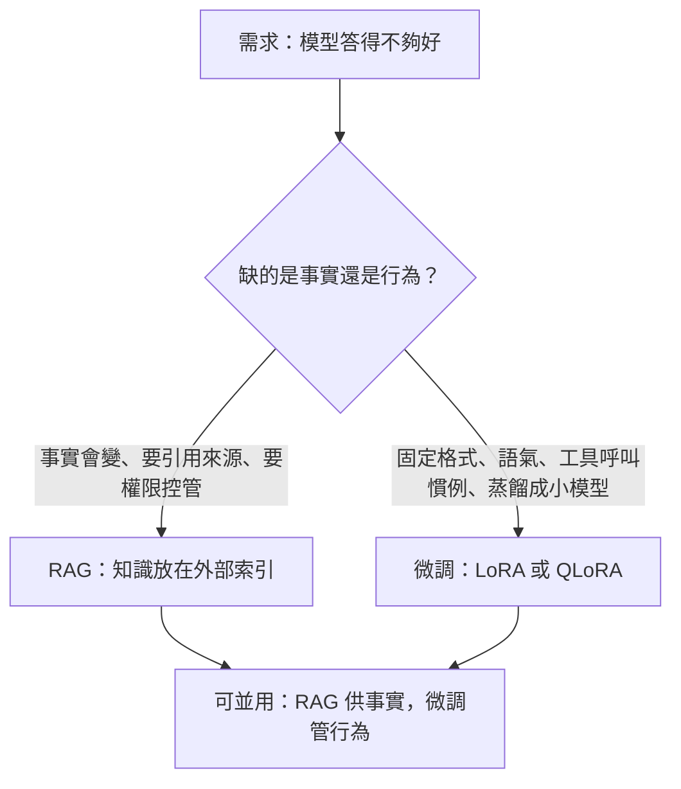
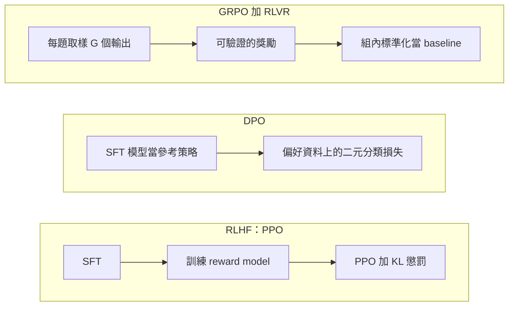
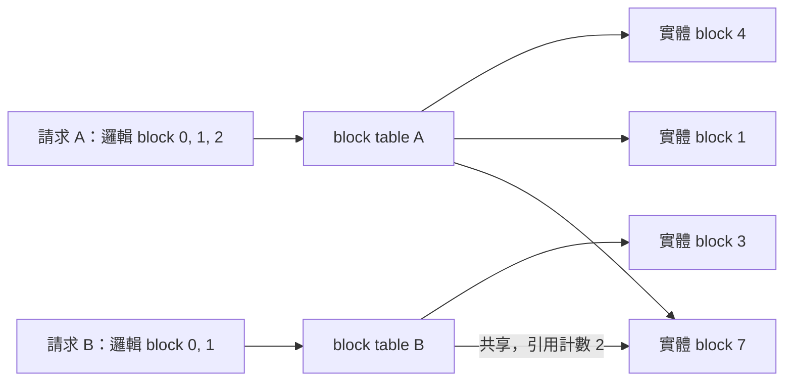
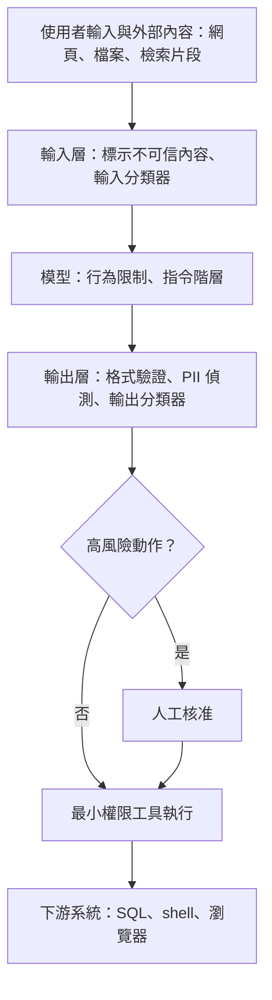

> 🌏 [English version](/en/posts/ai/2026-10-03-ai-interview-llm-engineering-en)

這是「AI Engineer 面試準備」系列的第 15 篇，整理面試常被問到的 LLM 工程問題：何時微調而不是做 RAG、RLHF／DPO／GRPO 的差別、推論加速、取樣參數、評估陷阱、guardrails 與 [OWASP](https://owasp.org/www-project-top-10-for-large-language-model-applications) 的 LLM Top 10，以及幻覺的成因。

每一節都先講概念，再拆機制或做比較，最後用「面試怎麼答」收成幾句能直接說出口的回答。數字與研究結論都附來源連結；查不到一手來源的地方，只講概念。

## 1. 微調：LoRA、QLoRA 與何時不該微調

全參數微調會更新所有權重，每個任務都要存一份與原模型一樣大的檢查點，訓練時還要為每個參數保留梯度與優化器狀態，所以成本高。[LoRA](https://arxiv.org/abs/2106.09685) 的做法是把預訓練權重 W0 凍結，在旁邊加一組低秩矩陣 B 與 A，前向計算變成 h = W0x + BAx。A 用隨機高斯初始化、B 初始化為零，所以訓練剛開始時 ΔW = BA = 0，行為與原模型一致。

### 機制：rank 與省下的記憶體

ΔW = BA 是 d×r 乘上 r×k，所以秩至多是 r。論文假設微調時的權重更新本來就有很低的 intrinsic rank：Table 6 在同時調整 Wq 與 Wv 時，rank 從 1 拉到 64，WikiSQL 準確率只差 0.1 個百分點，但作者也說不預期極小的 r 對每個任務都夠用。可訓練參數量可以自己推算（d、k 為權重矩陣的維度）：

```text
全參數：d × k = 4096 × 4096 = 16,777,216
LoRA：  r × (d + k) = 8 × 8192 = 65,536（約為前者的 0.39%）
```

以 GPT-3 175B 為例，LoRA 論文報告訓練所需的 VRAM 約降為三分之一。部署時還能把 BA 併回 W0，所以和 adapter 類方法不同，推論時沒有額外延遲。同一個基底模型能掛多組 adapter，切換任務只換 LoRA 權重。

[QLoRA](https://arxiv.org/abs/2305.14314) 再往前一步：把凍結的基底模型量化成 4 bit，梯度穿過量化後的權重回傳給 LoRA adapter，讓單張 48GB GPU 就能微調 65B 模型。它有三個設計：

- **NF4（4-bit NormalFloat）**：論文稱對常態分佈的權重在資訊理論上最佳。
- **Double Quantization**：把量化常數再量化一次，每個參數平均省約 0.37 bit。
- **Paged Optimizers**：用 NVIDIA unified memory 吸收長序列的記憶體尖峰。

實際運算時，4-bit 權重會先還原成 BFloat16 再做矩陣乘法；QLoRA 比 LoRA 慢多少沒有一手數字，不要憑印象報倍率。

### 比較：LoRA 真的跟全參數微調一樣好嗎

兩篇文獻常被放在一起問，結論看似相反。[LoRA Learns Less and Forgets Less](https://arxiv.org/abs/2405.09673) 在程式與數學領域發現，標準低秩設定下 LoRA 明顯輸給全參數微調，但對目標領域以外能力的保留比較好。全參數微調學到的擾動，秩比常見 LoRA 設定高 10 到 100 倍。[LoRA Without Regret](https://thinkingmachines.ai/blog/lora/) 則指出，中小型 SFT 資料集上 LoRA 與全參數微調表現相同，資料量超過 LoRA 的容量才會落後；LoRA 要套在所有權重矩陣（特別是 MLP 層），只套 attention 即使把 rank 拉高也比較差。

兩篇的差別在資料量相對於 LoRA 容量、套用範圍與超參數；講出這三個變數，比選邊站更有說服力。

### 判斷：微調還是 RAG

核心是分辨缺的是知識還是行為，三份研究給了方向（結論為整理，非原文）：

- [Ovadia 等人](https://arxiv.org/abs/2312.05934)比較非監督微調與 RAG，RAG 在既有與全新知識上都一致勝出。
- [Gekhman 等人](https://arxiv.org/abs/2405.05904)發現帶新知識的微調樣本學得明顯較慢，而且學會之後會線性提高幻覺傾向，結論是事實知識主要來自預訓練。
- [RAG 原論文](https://arxiv.org/abs/2005.11401)把提供決策出處與更新世界知識，列為純參數化模型的未解問題。



安全面還有個容易漏掉的點：[OWASP LLM02:2026](https://raw.githubusercontent.com/GenAI-Security-Project/GenAI-LLM-Top10/main/2026/final/LLM02_SensitiveInformationDisclosure.md) 指出，微調模型與它的 LoRA adapter 比同規模的 base 模型更容易被抽取訓練資料，adapter 會以高保真度記住稀有樣本。更完整的決策討論見站內的 [RAG vs Fine-tuning](/posts/ai/2026-03-12-rag-vs-fine-tuning) 與 [Fine-tuning vs RAG 選擇指南](/posts/ai/2026-08-26-understanding-ai-models-finetuning-vs-rag)。

**面試怎麼答**

先把問題拆成知識與行為：事實會變、需要引用來源或權限控管，走 RAG；固定輸出格式、語氣、工具呼叫慣例，或要蒸餾成小模型，才用 LoRA。再補一句研究依據：新知識靠微調灌進去學得慢，還會增加幻覺。被追問 rank，答從小的 r 起步看驗證集、優先擴大套用的矩陣範圍，不要報沒有來源的預設值。

## 2. 對齊：RLHF、DPO、GRPO 與 RLVR

對齊要讓只會接續文字的預訓練模型照人的意圖回答。三條路線的差別，在偏好訊號從哪來，以及要不要在訓練中取樣。

### 機制：三條路線

[InstructGPT](https://arxiv.org/abs/2203.02155) 定義了 RLHF 的標準三步：用人類示範做 SFT；用人類對輸出的排序訓練 reward model；再用 [PPO](https://arxiv.org/abs/1707.06347) 最大化 reward。PPO 階段會加入對 SFT 模型的逐 token KL 懲罰，減輕對 reward model 的過度最佳化。結果是 1.3B 的 InstructGPT 輸出，比 175B 的 GPT-3 更受標註者偏好。

[DPO](https://arxiv.org/abs/2305.18290) 觀察到 RLHF 的目標 max E[r(x,y)] − β·KL(πθ‖πref) 有閉式最佳解，因此把 reward 改寫成策略與參考策略的對數機率比。這讓訓練變成偏好資料上的二元交叉熵：

```text
L = −E[ log σ( β·log(πθ(yw|x)/πref(yw|x)) − β·log(πθ(yl|x)/πref(yl|x)) ) ]
```

其中 yw 是被偏好的回答、yl 是被拒絕的回答，β 控制偏離參考策略的程度。reward 是隱含的，所以不需要另外訓練 reward model，也不需要在訓練中取樣。論文在情緒控制、摘要與單輪對話上持平或勝過 PPO，對取樣溫度也更穩健；分佈外泛化的比較，作者自承還需要更完整的研究。

[GRPO](https://arxiv.org/abs/2402.03300) 出自 DeepSeekMath。PPO 需要一個與策略同等規模的 value function 當 baseline，而 LLM 通常只在最後一個 token 給 reward，要訓練出每個 token 都準確的 value function 並不容易。GRPO 的解法是對每題從舊策略取樣 G 個輸出，用組內標準化分數當優勢：

```text
Â_i = (r_i − mean(r)) / std(r)   # 套用到第 i 個輸出的所有 token
```

目標函數沿用 PPO 的 clip，KL 項直接放進損失。DeepSeekMath-Instruct 經 GRPO 後，MATH 從 46.8% 升到 51.7%。



### 比較：GRPO 與 RLVR 不在同一層

[Tülu 3](https://arxiv.org/abs/2411.15124) 提出的 RLVR 只在輸出經驗證為正確時給固定獎勵，適用於數學、可驗證的指令遵循這類能對照標準答案的技能。GRPO 是最佳化演算法，RLVR 是獎勵來源，兩者能組合，也能分開用：DeepSeekMath 的 GRPO 仍用 reward model 打分；[DeepSeek-R1](https://arxiv.org/abs/2501.12948) 的 R1-Zero 改用規則式獎勵，論文說明原因是大規模 RL 中神經 reward model 可能被 reward hacking。

R1-Zero 在 AIME 2024 的 pass@1 從 15.6% 升到 71.0%，這是 arXiv v1 的數字，論文後來更新過，引用時要註明版本。

| 路線 | 獎勵來源 | 優點 | 代價 |
|---|---|---|---|
| RLHF／PPO | 人類偏好訓練出的 reward model | 能處理無法驗證的主觀偏好 | policy、reference、reward、value 四個角色，訓練複雜且不穩 |
| DPO | 固定的偏好資料 | 簡單、穩定、離線 | 策略改變後資料不再是 on-policy，Tülu 3 因此另外生成 on-policy 偏好資料 |
| GRPO＋RLVR | 程式驗證的答案 | 沒有 critic 與 reward model，獎勵客觀 | 只適用有可驗證答案的領域 |

背景可讀 [CS336 SFT 與 RLHF 導讀](/posts/ai/2026-08-22-cs336-sft-rlhf) 與 [Deep RL 與 RLHF](/posts/ai/2026-08-16-cs230-deep-rl-and-rlhf)。

**面試怎麼答**

DPO 不需要 reward model，因為它把 reward 寫成策略與參考策略的對數機率比，直接用機率差做二元分類。GRPO 的 baseline 來自同題多個輸出的組內標準化，省下一個與策略同等規模的 critic。推理模型偏好規則式獎勵，是因為可驗證的答案讓獎勵客觀，也避開神經 reward model 的 reward hacking。「DPO 容易讓輸出變長」這類後續研究結論，沒有一手來源就不要當事實說。

## 3. 推論優化：從 KV cache 到 speculative decoding

LLM 逐 token 生成。[vLLM 論文](https://arxiv.org/abs/2309.06180)指出，這讓工作負載受限於記憶體，GPU 算力用不滿；[Speculative Decoding 論文](https://arxiv.org/abs/2211.17192)也指出大模型推論常卡在記憶體頻寬與通訊，而不是算術運算。後面的技術都在處理同一件事：少讀記憶體，或讓每次讀取多產出一些東西。

### KV cache 與它的成本

KV cache 保存過去 token 的 key 與 value，避免每一步重算整段序列，代價是很吃記憶體。vLLM 論文以 OPT-13B 為例：單一 token 的 KV cache 是 800KB，算法是 2（K 與 V）× 5120（hidden size）× 40（層數）× 2 bytes（FP16）。通用公式可以自己推導：

```text
KV cache 位元組數 = 2 × 層數 × KV head 數 × head 維度 × 每元素位元組數 × token 數
```

以 vLLM 論文的 13B 模型為例，約 65% 的記憶體放權重，近 30% 放 KV cache 等動態狀態。既有系統因為預留與碎片，真正存了 token 狀態的 KV cache 記憶體只佔 20.4% 到 38.2%。

架構面也能縮小 KV cache：[GQA](https://arxiv.org/abs/2305.13245) 讓多個 query head 共用較少的 KV head，品質接近多頭、速度接近只用單一 KV head 的 MQA。

### PagedAttention 與 vLLM

KV cache 的大小隨輸出長度動態成長，事先無法得知，舊系統只好按最大長度預先配置，產生內外部碎片。PagedAttention 把 KV cache 切成固定大小的 block，用 block table 把邏輯 block 映射到實體 block，實體上不必連續，浪費因此接近零。它還允許共享 KV：parallel sampling 與 beam search 用 copy-on-write，依引用計數決定何時複製。



[vLLM](/posts/ai/2026-03-14-vllm-inference-engine) 的吞吐量比論文比較的既有系統高 2 到 4 倍且延遲相當，序列越長、模型越大，改善越明顯。block size 越大，核心平行處理的位置越多，但碎片也越多。要不要自己架，見 [vLLM 自架決策](/posts/ai/2026-08-21-vllm-self-host-decision)。

### 排程：讓完成的請求立刻離開批次

面試常以 continuous batching 這個名稱發問，這裡只講概念：傳統批次要等整批結束才能換下一批，短回答得陪長回答等；vLLM 論文所稱的 iteration-level scheduling，則在每次迭代後讓完成的請求離開、新請求補進來，新請求只需等一個迭代。

### 量化：PTQ、QAT 與 FP8

量化降低權重（有時連 activation）的位元數，換取更小的記憶體與更高的吞吐量。下表只引用各論文自己報告的內容：

| 方法 | 類型 | 重點 |
|---|---|---|
| [GPTQ](https://arxiv.org/abs/2210.17323) | PTQ，權重 | 一次性、利用近似二階資訊，約 4 個 GPU 小時可把 175B 模型量化到 3 或 4 bit |
| [AWQ](https://arxiv.org/abs/2306.00978) | PTQ，權重 | 只保護約 1% 的顯著權重通道，顯著與否看 activation 的分佈而不是權重 |
| [SmoothQuant](https://arxiv.org/abs/2211.10438) | PTQ，W8A8 | 把 activation 離群值的難度轉移給權重，讓兩者都能用 INT8 |
| [LLM.int8()](https://arxiv.org/abs/2208.07339) | PTQ，8-bit | 把離群特徵維度隔離到 16-bit 矩陣乘法，其餘值仍以 8-bit 相乘 |
| [LLM-QAT](https://arxiv.org/abs/2305.17888) | QAT | 指出 PTQ 在 8 bit 以下會失效，改用模型自己生成的資料做蒸餾，並連 KV cache 一起量化 |
| [FP8 格式](https://arxiv.org/abs/2209.05433) | 訓練與推論用的資料型態 | 定義 E4M3 與 E5M2 兩種編碼，在含 175B 參數的語言模型訓練中，品質與 16-bit 相當 |

取捨很直接：PTQ 便宜、免訓練，8 bit 通常夠用；QAT 要額外訓練成本，換取低位元下的品質。INT4 與 FP8 在不同硬體上的實際加速比沒有一手數字可引，面試時答「要看硬體與核心實作」即可。延伸閱讀：[量化與推論最佳化](/posts/ai/2026-08-26-understanding-ai-models-quantization)、[TurboQuant+ 的 KV cache 壓縮](/posts/ai/2026-04-01-turboquant-plus-kv-cache-compression) 與 [CS336 推論導讀](/posts/ai/2026-08-22-cs336-inference)。

### Speculative decoding

[Leviathan 等人](https://arxiv.org/abs/2211.17192)的做法是：先用較小的草稿模型 Mq 產生 γ 個候選 token，再讓目標模型 Mp 平行評分，接受那些能保持相同分佈的 token，並從調整後的分佈再取一個 token。所以每次目標模型呼叫最多產出 γ+1 個 token，最壞情況也不比標準自迴歸多呼叫目標模型，輸出分佈完全一致。論文在 T5-XXL 上加速 2 到 3 倍；DeepMind 的 [speculative sampling](https://arxiv.org/abs/2302.01318) 在 70B 的 Chinchilla 上加速 2 到 2.5 倍。

代價是額外的算術運算，效益取決於草稿模型的接受率 α 與成本比 c。論文也指出 argmax、top-k、nucleus 與溫度設定都能在 logits 層級轉成標準取樣，所以能與它相容。批次很大時效益是否下降，沒有一手數據，不要當事實講。

### FlashAttention

[FlashAttention](https://arxiv.org/abs/2205.14135) 是 IO-aware 的精確注意力，用 tiling 減少 GPU 高頻寬記憶體（HBM）與片上 SRAM 之間的讀寫；記憶體隨序列長度線性而非平方成長，而且不是近似。原論文中，GPT-2（序列長度 1K）的訓練快 3 倍；後續的 [FlashAttention-2](https://arxiv.org/abs/2307.08691) 改善工作切分，[FlashAttention-3](https://arxiv.org/abs/2407.08608) 則針對 H100。

常見的混淆：FlashAttention 加速注意力計算的核心（kernel），PagedAttention 管理 KV cache 的記憶體，層次不同，可以並存。

**面試怎麼答**

被問「decode 為什麼是 memory-bound」，答每生成一個 token 都要讀完整份權重與整段 KV cache，算術強度低。接著依瓶頸分流：KV cache 吃記憶體用 PagedAttention 與 GQA，權重太大用量化，單次產出太少用 speculative decoding，注意力核心慢用 FlashAttention。被問 speculative decoding 會不會改輸出，答不會，特殊的拒絕取樣讓分佈與目標模型一致，這是它與近似類加速法的差別。

## 4. 取樣與解碼

模型每一步輸出整個詞表的機率分佈，解碼策略決定怎麼選。本節主要依據是 [Holtzman 等人](https://arxiv.org/abs/1904.09751)的 nucleus sampling 論文（ICLR 2020）。

### 四個旋鈕

**Temperature** 在 softmax 前把 logits 除以 t：p(x) = exp(u/t) / Σ exp(u'/t)。t 小於 1 時分佈被推向高機率事件，品質提升但多樣性下降。**Top-k** 固定保留 k 個候選；k 固定的問題是分佈平坦時文字呆板，分佈尖銳時又會放進不合適的候選。**Top-p（nucleus）** 取累積機率達到 p 的最小詞集，候選數隨模型的信心浮動，論文指出常用的 p 落在 0.9 到 1 之間。

**Beam search** 找整句機率最高的序列，在開放式生成裡會退化成重複迴圈。論文用 GPT-2 Large、5,000 段文字（最長 200 token）量測重複率：

| 解碼方式 | 重複率 |
|---|---|
| 人類文字 | 0.28% |
| 貪婪解碼 | 73.66% |
| beam=16 | 28.94% |
| nucleus，p=0.95 | 0.36% |

人類寫的文字並不是機率最高的文字。論文發現重複的機率會越重複越高，形成正回饋迴圈，最大化機率的搜尋剛好陷進去。反過來，完全不截斷的純取樣會從不可靠的尾端取到不相關的詞，所以才需要截斷尾端。

### 什麼任務用什麼設定

- **翻譯、摘要這類輸出被輸入緊密限定的任務**：論文指出通常用 beam search，但過大的 beam 仍有問題。
- **創意寫作、對話等開放式生成**：top-p（約 0.9 到 0.95）加適度的溫度；溫度壓太低會回到重複，論文提到低於 0.9 的取樣溫度會大幅增加重複。

被追問溫度設為 0 能不能保證輸出完全確定，本文沒有一手來源，回答時以「通常」帶過，不要講成保證。取樣如何失敗的另一個角度，見 [CMU 07-280 的 N-gram 取樣導讀](/posts/ai/2026-08-22-cmu-07280-lecture-18-ngram-sampling)。

**面試怎麼答**

先講 top-p 的候選集大小跟著分佈形狀變，論文的人機混合評估（HUSE）中 nucleus 得 0.97，高於 top-k=640 的 0.94。再講 beam search 適合輸入約束明確的任務，開放式生成會重複。被問溫度與 top-p 能不能一起用，答可以，通常先用溫度改變分佈形狀再截斷；「只調其中一個」屬經驗法則，要說明。

## 5. LLM 評估：污染、裁判偏誤與指標

評估有三個常見陷阱：測試題外洩、LLM 裁判的系統性偏差，以及混用適用範圍不同的指標。

### Benchmark 污染

Benchmark Data Contamination（BDC）指模型在訓練資料中無意納入評測基準的資訊，導致分數反映的是記憶而不是能力，[綜述論文](https://arxiv.org/abs/2406.04244)有完整的整理。最有說服力的實驗是 [GSM1k](https://arxiv.org/abs/2405.00332)：重新人工編寫一套與 GSM8k 風格、難度相近的題目，領先模型在新題目上的準確率最多掉了 8%，數個模型家族顯示系統性過擬合。

n-gram 重疊、記憶探針這類偵測技術，本文只讀到綜述的摘要層級；能放心講的做法，是編一套同分佈的全新題目比較準確率落差，這正是 GSM1k 的設計。更多脈絡見 [CS224N 的 Benchmark 導讀](/posts/ai/2026-08-22-cs224n-benchmark-evaluation) 與 [模型成績單怎麼看](/posts/ai/2026-08-26-understanding-ai-models-evaluation)。

### LLM-as-judge：可信，但有偏誤

[MT-Bench 與 LLM-as-a-Judge 論文](https://arxiv.org/abs/2306.05685)發現，GPT-4 與人類偏好的一致率超過 80%，等同人與人之間的一致率；在不含平手的設定下，GPT-4 與人類一致率為 85%，高於人類彼此之間的 81%。同一篇論文也列出位置偏誤、冗長偏誤、自我增強偏誤，以及推理能力有限。

後續研究把偏誤量化得更具體：[Large Language Models are not Fair Evaluators](https://arxiv.org/abs/2305.17926) 發現僅僅調換回答出現的順序，就能翻轉排名，例如以 ChatGPT 當評審時，Vicuna-13B 能在 80 題中的 66 題勝過 ChatGPT。[LLM Evaluators Recognize and Favor Their Own Generations](https://arxiv.org/abs/2404.13076) 則顯示 GPT-4 與 Llama 2 能分辨自己與他者的輸出，自我辨識越強，自我偏好也越強。

校準有現成的做法。[FairEval](https://arxiv.org/abs/2305.17926) 提出三招：先寫多段評估證據再打分、跨多種順序聚合結果、把裁判分歧大的難題交給人。MT-Bench 的做法是先用人類標註量測裁判與人類的一致率，再決定能不能大規模使用；實務上就是抽樣做人工標註，檢查裁判與人的一致率。延伸閱讀：[Self-Reflection + LLM-as-Judge](/posts/ai/2026-03-12-self-reflection-llm-as-judge)、[RAG 評估框架](/posts/ai/2026-03-12-rag-evaluation-frameworks) 與 [CS329Z 的裁判與護欄導讀](/posts/ai/2026-09-16-stanford-cs329z-week8-judge-safety)。

### 兩個必須會算的指標

[Perplexity](https://huggingface.co/docs/transformers/perplexity)（Hugging Face 官方文件）是序列平均負對數似然的指數，等價於資料與模型預測之間交叉熵的指數：

```text
PPL(X) = exp{ −(1/t) Σ log pθ(x_i | x_<i) }
```

三個重點：只適用自迴歸（causal）語言模型，不適用 BERT 這類 masked LM；分詞器會影響數值，不同分詞器的模型不能直接比較；固定長度的模型要用滑動視窗，切成互不相交的片段會高估。perplexity 越低也不代表生成越好：Holtzman 等人量到 beam=16 只有 1.48，遠低於人類文字，輸出卻充滿重複。

pass@k 出自 [Codex 論文](https://arxiv.org/abs/2107.03374)，用 [HumanEval](https://arxiv.org/abs/2107.03374) 評估程式碼生成：每題生成 n ≥ k 個樣本，數出通過單元測試的正確樣本數 c，用無偏估計：

```text
pass@k = E[ 1 − C(n−c, k) / C(n, k) ]
```

直接取 k 個樣本估計的變異大，論文也指出另一種看似合理的算法會明顯低估。pass@k 衡量功能正確性，只適用有單元測試的任務。

**面試怎麼答**

被問怎麼知道 benchmark 被污染，答編一套同分佈的新題目比較落差，GSM1k 就是這個設計。被問怎麼降低裁判的位置偏誤，答兩種順序各評一次再聚合、先寫證據再打分、分歧大的題目交給人工。最後補一句：評估要搭配新題目與人工抽檢。

## 6. Guardrails 與安全：prompt injection、OWASP LLM Top 10

LLM 對指令與資料沒有架構上的區分，系統提示、使用者輸入、檢索文件、工具輸出都是同一條 token 串流，所以沒有像 SQL 參數化查詢那樣的根治方法。[OWASP 2026 版的 LLM01](https://raw.githubusercontent.com/GenAI-Security-Project/GenAI-LLM-Top10/main/2026/final/LLM01_PromptInjection.md) 引用英國 NCSC 的看法，指出目前沒有等同參數化查詢的乾淨解法。設計原則因此是在模型外面把權限收到最小，讓模型被騙時也不會出大事。

### 攻擊面：直接、間接與越獄

[OWASP LLM01:2026](https://raw.githubusercontent.com/GenAI-Security-Project/GenAI-LLM-Top10/main/2026/final/LLM01_PromptInjection.md) 把直接注入定義成使用者輸入直接改變模型行為（可有意或無意）；間接注入則是模型從網頁、檔案、郵件、工具回應、RAG 段落或圖片等外部來源取得內容，而其中含有改變行為的資料。學術上的出處是 [Greshake 等人](https://arxiv.org/abs/2302.12173)，他們指出 LLM 整合應用模糊了資料與指令的界線，並在 Bing Chat 等實際系統上示範了資料竊取。

OWASP 把越獄視為 prompt injection 的子集。[Jailbroken](https://arxiv.org/abs/2307.02483) 提出安全訓練失敗的兩種模式：競爭目標（能力與安全目標衝突）與不匹配泛化（安全訓練沒涵蓋模型具備能力的領域），並指出單靠擴大規模無法解決。[GCG](https://arxiv.org/abs/2307.15043) 則用貪婪加梯度搜尋自動產生對抗後綴，且能轉移到閉源模型。

### OWASP LLM Top 10：2026 版

依 [OWASP 專案頁](https://owasp.org/www-project-top-10-for-large-language-model-applications)，目前版本是「OWASP GenAI LLM Top 10 2026」，發布於 2026 年 8 月 4 日；網路教學仍多寫 2025 版，面試官可能用任一版，兩版差異要先記起來。十個條目的名稱取自[官方 repo 的 2026/final 目錄](https://github.com/GenAI-Security-Project/GenAI-LLM-Top10/tree/main/2026/final)：

| 排名 | 條目 |
|---|---|
| LLM01 | Prompt Injection |
| LLM02 | Sensitive Information Disclosure |
| LLM03 | Excessive Agency |
| LLM04 | Supply Chain |
| LLM05 | Data and Model Poisoning |
| LLM06 | Unbounded Consumption |
| LLM07 | Misinformation |
| LLM08 | Hidden Context Exposure |
| LLM09 | Vector and Embedding Weaknesses |
| LLM10 | Improper Output Handling |

依官方 [Preface](https://raw.githubusercontent.com/GenAI-Security-Project/GenAI-LLM-Top10/main/2026/final/LLM00_Preface.md) 的描述，2026 版最大的變動是 Excessive Agency 升到第三，理由是 agent 部署正是傷害發生的地方；Unbounded Consumption 上升四名，Improper Output Handling 從第五掉到第十，System Prompt Leakage 更名為 Hidden Context Exposure 並擴大範圍，Prompt Injection 與 Sensitive Information Disclosure 維持一、二名，Prompt Injection 並納入藏在圖片或音訊裡的跨模態攻擊。

方法論也變了：首次把社群投票（占 75%）與事件資料合併。Prompt Injection 在原始事件紀錄中掉出前十，官方解釋是防禦效應（團隊防得嚴，公開的乾淨漏洞少），但攻擊面無處不在，所以仍居第一。

### 防禦：分層，而且放在模型外面



OWASP LLM01 的緩解清單（[2025 版條目](https://genai.owasp.org/llmrisk/llm01-prompt-injection/)列了七項）可以對照上圖：限制模型行為、用決定性程式碼驗證輸出格式、輸入與輸出過濾、最小權限、高風險動作人工核准、隔離並標示不可信內容、做對抗性測試。同一個條目也坦白，RAG 與微調並不能完全緩解 prompt injection。

各層可以搭配的工具與研究：

- **分類器**：[Llama Guard](https://arxiv.org/abs/2312.06674) 是以 Llama2-7b 指令微調的安全分類器，可分類 prompt 與 response。
- **PII 偵測**：[Microsoft Presidio](https://presidio.dataprivacystack.org/) 提供辨識與匿名化模組，官方文件明說它不保證找出所有敏感資訊。OWASP LLM02:2026 也提醒，洩漏的通道不只最終答案，還包括工具呼叫參數、檢索片段與日誌。
- **訓練層**：[Instruction Hierarchy](https://arxiv.org/abs/2404.13208)（OpenAI）訓練模型區分系統提示與不可信文字的優先順序，對未見攻擊類型更穩健，一般能力幾乎不受影響。
- **架構層**：[CaMeL](https://arxiv.org/abs/2503.18813)（Google）在 LLM 外建立保護層，從可信的使用者查詢抽取控制流與資料流，讓不可信資料無法影響程式流程；在論文採用的 agent 基準上以可證明的安全性解決 77% 的任務，略低於無防護系統。
- **最小權限**：[OWASP LLM03:2026](https://raw.githubusercontent.com/GenAI-Security-Project/GenAI-LLM-Top10/main/2026/final/LLM03_ExcessiveAgency.md) 指出 Excessive Agency 的根因是過多功能、過多權限、過多自主性；做法是避開執行 shell、抓取任意 URL 這類開放式工具，改用有嚴格輸入 schema 的細粒度工具，並以使用者自己的權限執行。

RAG 與 agent 場景的做法見 [RAG Guardrails](/posts/ai/2026-03-12-rag-guardrails)、[Agent 安全與信任邊界](/posts/ai/2026-06-04-agent-security-prompt-injection-trust-boundaries) 與 [harness 層的安全](/posts/ai/2026-08-10-agent-security-harness-layer)。

**面試怎麼答**

被問為什麼 prompt injection 不能像 SQL injection 一樣根治，答 LLM 沒有指令與資料的架構區分，所以重點放在縮小爆炸半徑。被問間接注入怎麼防，答隔離並標示外部內容、工具權限壓到最小、寄信與刪除這類動作要人工核准，進階的可提 CaMeL。被問 2026 版最重要的變化，答 Excessive Agency 升到第三，官方立場大意是要在模型周圍建系統，讓它被騙時沒有重要的東西壞掉。

## 7. 幻覺：成因與緩解

幻覺是模型產生看似合理卻不正確的內容。成因不只一個，緩解也得分層處理。

### 成因

**統計與評測誘因。** [Kalai 等人](https://arxiv.org/abs/2509.04664)的論文指出，模型在不確定時會猜測，產生合理但錯誤的陳述，而不是承認不確定。預訓練階段若分不出錯誤陳述與事實，統計壓力自然導致幻覺；幻覺持續存在，是因為多數評測只給答對加分、不給「我不知道」加分，等於把模型訓練成會猜的應試者。論文主張修改主導排行榜的評分方式，讓承認不確定不再吃虧。

**微調灌入新知識。** 第 1 節提到的 Gekhman 等人發現：新知識學得慢，學會之後還會線性提高幻覺傾向。

**脈絡與系統因素。** [OWASP LLM07:2026](https://raw.githubusercontent.com/GenAI-Security-Project/GenAI-LLM-Top10/main/2026/final/LLM07_Misinformation.md) 列出的來源包括不完整或過期的脈絡、薄弱的 grounding、有偏或被污染的資料與未驗證的工具輸出，也可能被攻擊者刻意誘發；過度信任流暢而自信的輸出，是關鍵的放大因素。

[Huang 等人的綜述](https://arxiv.org/abs/2311.05232)整理了幻覺的分類法、成因、偵測方法與基準，也討論了檢索增強 LLM 在對抗幻覺時的限制，所以 RAG 不是萬靈丹。

### 緩解

1. **RAG**：[Lewis 等人](https://arxiv.org/abs/2005.11401)把可更新、可提供出處的非參數記憶接上生成模型。RAG 本身會怎麼出錯，見 [RAG 常見失敗模式](/posts/ai/2026-03-12-rag-failure-modes)。
2. **Chain-of-Verification**：[CoVe](https://arxiv.org/abs/2309.11495) 讓模型先起草回答，再規劃驗證問題並獨立回答，最後產生驗證後的答案，實驗顯示能降低幻覺。
3. **取樣一致性**：[SelfCheckGPT](https://arxiv.org/abs/2303.08896) 是零資源、黑箱的檢查：模型真的知道的事，多次取樣會彼此一致；幻覺則會互相矛盾。
4. **系統層**：OWASP LLM07:2026 要求回答基於權威且最新的來源，採 Claim-Check-Act 把生成與執行分開、行動前先驗證主張，用 groundedness 與一致性檢查而不只看信心，高影響動作加人工核准。

這些方法在不同模型與領域的實際精確度與成本，本文未逐表核對，引用前請回原文確認。

**面試怎麼答**

被問 RAG 能不能解決幻覺，答不能：綜述專門討論檢索增強的限制，檢索品質與引用驗證仍要把關。被問為什麼不直接把新知識微調進去，答受控實驗顯示學得慢且會增加幻覺。被問沒有外部知識庫時怎麼偵測，答取樣一致性（SelfCheckGPT）加獨立驗證問題（CoVe）。

## 整體來說

七個主題共用同一個框架：先定位瓶頸或風險落在哪一層，再選最便宜、最可驗證的手段。缺行為用微調，缺事實用 RAG；答案可驗證就用 RLVR；推論慢先找瓶頸；評估與安全則假設模型會出錯，把驗證放在模型之外。

## 題庫裡常見的題目

以下是從 7 個公開題庫（比較見[系列第 11 篇](/posts/ai/2026-09-30-ai-engineer-interview-resources)）整理出、跨題庫重複出現的 LLM 工程題目，意思相同的題目已合併。「獨立來源數」只代表題庫之間的重疊，不代表真實面試的頻率；amitshekhariitbhu 與 pallavi 兩個題庫沒有題目來源，所以它們的公司標籤本文不採用。這裡只列題目與出處連結，沒有轉載答案。

| 題目 | 獨立來源數 | 題庫連結 | 本文對應段落 |
|---|---|---|---|
| LoRA 的運作原理：數學推導、`r` 與 `alpha` 的意義，以及 QLoRA 有何不同 | 5 | [om](https://github.com/ombharatiya/AI-Engineer-Interview-Questions/blob/main/05-fine-tuning-and-alignment/questions.md#6-explain-how-lora-works---the-math-and-what-r-and-alpha-mean)、[aeg](https://github.com/alexeygrigorev/ai-engineering-field-guide/blob/main/interview/questions/questions.md?plain=1#L122)、[AIML](https://github.com/alirezadir/AIMLInterviews/blob/main/src/ml-fundamental.md#llm--genai--multimodal-sample-questions-2026)、[amit](https://github.com/amitshekhariitbhu/ai-engineering-interview-questions/blob/main/README.md#L428)、[pal](https://github.com/pallavi-shekhar/ai-engineering-interview-questions-company-wise/blob/main/README.md#L280)、[ks](https://github.com/KalyanKS-NLP/LLM-Interview-Questions-and-Answers-Hub/blob/main/Interview_QA/QA_100-102.md) | 微調：LoRA、QLoRA 與何時不該微調 › 機制：rank 與省下的記憶體 |
| KV cache 是什麼、為什麼需要、記憶體會多大？ | 5 | [om](https://github.com/ombharatiya/AI-Engineer-Interview-Questions/blob/main/08-inference-and-production/questions.md#2-what-is-the-kv-cache-why-is-it-needed-and-how-big-does-it-get-ballpark-it-for-a-70b-class-model-at-128k-context)、[aeg](https://github.com/alexeygrigorev/ai-engineering-field-guide/blob/main/interview/questions/questions.md?plain=1#L17)、[AIML](https://github.com/alirezadir/AIMLInterviews/blob/main/src/ml-fundamental.md#llm--genai--multimodal-sample-questions-2026)、[amit](https://github.com/amitshekhariitbhu/ai-engineering-interview-questions/blob/main/README.md#L135)、[pal](https://github.com/pallavi-shekhar/ai-engineering-interview-questions-company-wise/blob/main/README.md#L120)、[ks](https://github.com/KalyanKS-NLP/LLM-Interview-Questions-and-Answers-Hub/blob/main/Interview_QA/QA_1-3.md) | 推論優化：從 KV cache 到 speculative decoding › KV cache 與它的成本 |
| 比較 GPTQ、AWQ、INT8、FP8 等量化方案，部署時如何選擇？ | 5 | [om](https://github.com/ombharatiya/AI-Engineer-Interview-Questions/blob/main/08-inference-and-production/questions.md#20-compare-gptq-awq-gguf-int8-and-fp8-how-do-you-actually-choose-a-quantization-approach-for-a-deployment)、[aeg](https://github.com/alexeygrigorev/ai-engineering-field-guide/blob/main/interview/questions/questions.md?plain=1#L132)、[AIML](https://github.com/alirezadir/AIMLInterviews/blob/main/src/ml-fundamental.md#llm--genai--multimodal-sample-questions-2026)、[amit](https://github.com/amitshekhariitbhu/ai-engineering-interview-questions/blob/main/README.md#L603)、[pal](https://github.com/pallavi-shekhar/ai-engineering-interview-questions-company-wise/blob/main/README.md#L180)、[ks](https://github.com/KalyanKS-NLP/LLM-Interview-Questions-and-Answers-Hub/blob/main/Interview_QA/QA_4-6.md) | 推論優化：從 KV cache 到 speculative decoding › 量化：PTQ、QAT 與 FP8 |
| 說明推測解碼（speculative decoding）：為何輸出與目標模型分布一致，何時才有幫助？ | 5 | [om](https://github.com/ombharatiya/AI-Engineer-Interview-Questions/blob/main/08-inference-and-production/questions.md#19-explain-speculative-decoding-why-is-the-output-provably-faithful-to-the-target-model-and-when-does-it-actually-help)、[aeg](https://github.com/alexeygrigorev/ai-engineering-field-guide/blob/main/interview/questions/questions.md?plain=1#L130)、[AIML](https://github.com/alirezadir/AIMLInterviews/blob/main/src/ml-fundamental.md#llm--genai--multimodal-sample-questions-2026)、[amit](https://github.com/amitshekhariitbhu/ai-engineering-interview-questions/blob/main/README.md#L846)、[pal](https://github.com/pallavi-shekhar/ai-engineering-interview-questions-company-wise/blob/main/README.md#L174)、[ks](https://github.com/KalyanKS-NLP/LLM-Interview-Questions-and-Answers-Hub/blob/main/Interview_QA/QA_61-63.md) | 推論優化：從 KV cache 到 speculative decoding › Speculative decoding |
| 完整說明 RLHF 管線，以及 DPO 如何省掉 reward model 與 RL 迴圈 | 4 | [om](https://github.com/ombharatiya/AI-Engineer-Interview-Questions/blob/main/05-fine-tuning-and-alignment/questions.md#10-walk-me-through-the-classic-rlhf-pipeline-end-to-end)、[aeg](https://github.com/alexeygrigorev/ai-engineering-field-guide/blob/main/interview/questions/questions.md?plain=1#L124)、[AIML](https://github.com/alirezadir/AIMLInterviews/blob/main/src/ml-fundamental.md#llm--genai--multimodal-sample-questions-2026)、[amit](https://github.com/amitshekhariitbhu/ai-engineering-interview-questions/blob/main/README.md#L442)、[pal](https://github.com/pallavi-shekhar/ai-engineering-interview-questions-company-wise/blob/main/README.md#L272) | 對齊：RLHF、DPO、GRPO 與 RLVR › 機制：三條路線 |
| 比較貪婪解碼、top-k、top-p（nucleus）取樣，並說明 temperature 與 beam search 各自何時適用 | 4 | [om](https://github.com/ombharatiya/AI-Engineer-Interview-Questions/blob/main/02-llm-fundamentals/questions.md#12-compare-greedy-decoding-top-k-sampling-and-top-p-nucleus-sampling)、[aeg](https://github.com/alexeygrigorev/ai-engineering-field-guide/blob/main/interview/questions/questions.md?plain=1#L15)、[amit](https://github.com/amitshekhariitbhu/ai-engineering-interview-questions/blob/main/README.md#L120)、[pal](https://github.com/pallavi-shekhar/ai-engineering-interview-questions-company-wise/blob/main/README.md#L148)、[ks](https://github.com/KalyanKS-NLP/LLM-Interview-Questions-and-Answers-Hub/blob/main/Interview_QA/QA_40-42.md) | 取樣與解碼 › 四個旋鈕 |
| 什麼情況下你會微調模型，而不是用提示或 RAG？ | 3 | [om](https://github.com/ombharatiya/AI-Engineer-Interview-Questions/blob/main/05-fine-tuning-and-alignment/questions.md#1-when-would-you-fine-tune-a-model-instead-of-using-prompting-or-rag)、[aeg](https://github.com/alexeygrigorev/ai-engineering-field-guide/blob/main/interview/questions/questions.md?plain=1#L121)、[pal](https://github.com/pallavi-shekhar/ai-engineering-interview-questions-company-wise/blob/main/README.md#L291) | 微調：LoRA、QLoRA 與何時不該微調 › 判斷：微調還是 RAG |
| 說明 GRPO 為什麼不需要 critic，以及 RLVR 何時優於學習式獎勵模型 | 3 | [om](https://github.com/ombharatiya/AI-Engineer-Interview-Questions/blob/main/05-fine-tuning-and-alignment/questions.md#37-explain-grpo-why-has-it-displaced-ppo-for-reasoning-rl)、[AIML](https://github.com/alirezadir/AIMLInterviews/blob/main/src/ml-fundamental.md#llm--genai--multimodal-sample-questions-2026)、[amit](https://github.com/amitshekhariitbhu/ai-engineering-interview-questions/blob/main/README.md#L469)、[pal](https://github.com/pallavi-shekhar/ai-engineering-interview-questions-company-wise/blob/main/README.md#L277) | 對齊：RLHF、DPO、GRPO 與 RLVR › 比較：GRPO 與 RLVR 不在同一層 |
| 靜態批次與連續批次（continuous batching）有何差別？為什麼後者成為標準？ | 3 | [om](https://github.com/ombharatiya/AI-Engineer-Interview-Questions/blob/main/08-inference-and-production/questions.md#8-whats-the-difference-between-static-and-continuous-batching-and-why-did-continuous-batching-become-universal)、[amit](https://github.com/amitshekhariitbhu/ai-engineering-interview-questions/blob/main/README.md#L844)、[pal](https://github.com/pallavi-shekhar/ai-engineering-interview-questions-company-wise/blob/main/README.md#L168)、[ks](https://github.com/KalyanKS-NLP/LLM-Interview-Questions-and-Answers-Hub/blob/main/Interview_QA/QA_64-66.md) | 推論優化：從 KV cache 到 speculative decoding › 排程：讓完成的請求立刻離開批次 |
| FlashAttention 與 PagedAttention 各自解決什麼問題？ | 3 | [aeg](https://github.com/alexeygrigorev/ai-engineering-field-guide/blob/main/interview/questions/questions.md?plain=1#L41)、[amit](https://github.com/amitshekhariitbhu/ai-engineering-interview-questions/blob/main/README.md#L856)、[ks](https://github.com/KalyanKS-NLP/LLM-Interview-Questions-and-Answers-Hub/blob/main/Interview_QA/QA_64-66.md) | 推論優化：從 KV cache 到 speculative decoding › PagedAttention 與 vLLM |
| 如何防禦直接與間接提示注入（prompt injection）？越獄又該怎麼看？ | 3 | [om](https://github.com/ombharatiya/AI-Engineer-Interview-Questions/blob/main/03-prompt-engineering-and-context/questions.md#45-your-agent-reads-web-pages-and-can-send-email-how-do-you-defend-against-indirect-prompt-injection)、[aeg](https://github.com/alexeygrigorev/ai-engineering-field-guide/blob/main/interview/questions/questions.md?plain=1#L237)、[amit](https://github.com/amitshekhariitbhu/ai-engineering-interview-questions/blob/main/README.md#L232)、[pal](https://github.com/pallavi-shekhar/ai-engineering-interview-questions-company-wise/blob/main/README.md#L333) | Guardrails 與安全：prompt injection、OWASP LLM Top 10 › 防禦：分層，而且放在模型外面 |
| 為 LLM 產品設計 guardrail 層：輸入與輸出過濾如何分工，延遲與誤判成本怎麼管理？ | 3 | [om](https://github.com/ombharatiya/AI-Engineer-Interview-Questions/blob/main/09-safety-security-and-responsible-ai/questions.md#17-design-the-guardrail-layer-for-an-llm-product-how-do-you-manage-the-latency-and-false-positive-costs)、[aeg](https://github.com/alexeygrigorev/ai-engineering-field-guide/blob/main/interview/questions/questions.md?plain=1#L234)、[amit](https://github.com/amitshekhariitbhu/ai-engineering-interview-questions/blob/main/README.md#L611)、[pal](https://github.com/pallavi-shekhar/ai-engineering-interview-questions-company-wise/blob/main/README.md#L339) | Guardrails 與安全：prompt injection、OWASP LLM Top 10 › 防禦：分層，而且放在模型外面 |
| 幻覺的根本原因是什麼？如何偵測與緩解？ | 3 | [om](https://github.com/ombharatiya/AI-Engineer-Interview-Questions/blob/main/02-llm-fundamentals/questions.md#50-what-are-the-root-causes-of-hallucination-and-what-actually-mitigates-it)、[aeg](https://github.com/alexeygrigorev/ai-engineering-field-guide/blob/main/interview/questions/questions.md?plain=1#L138)、[amit](https://github.com/amitshekhariitbhu/ai-engineering-interview-questions/blob/main/README.md#L727) | 幻覺：成因與緩解 |
| 算一下 GPU 記憶體：為什麼不能用 Adam 在單張 24 GB GPU 上全參數微調 7B 模型？ | 2 | [om](https://github.com/ombharatiya/AI-Engineer-Interview-Questions/blob/main/05-fine-tuning-and-alignment/questions.md#27-do-the-gpu-memory-math-why-cant-you-full-fine-tune-a-7b-model-on-a-single-24-gb-gpu-with-adam)、[amit](https://github.com/amitshekhariitbhu/ai-engineering-interview-questions/blob/main/README.md#L460)、[pal](https://github.com/pallavi-shekhar/ai-engineering-interview-questions-company-wise/blob/main/README.md#L294) | 微調：LoRA、QLoRA 與何時不該微調 › 機制：rank 與省下的記憶體 |
| 微調中的災難性遺忘是什麼？如何避免？ | 2 | [amit](https://github.com/amitshekhariitbhu/ai-engineering-interview-questions/blob/main/README.md#L451)、[ks](https://github.com/KalyanKS-NLP/LLM-Interview-Questions-and-Answers-Hub/blob/main/Interview_QA/QA_91-93.md) | 微調：LoRA、QLoRA 與何時不該微調 › 比較：LoRA 真的跟全參數微調一樣好嗎 |
| 預訓練、微調與指令微調（instruction tuning）有何差別？ | 2 | [aeg](https://github.com/alexeygrigorev/ai-engineering-field-guide/blob/main/interview/questions/questions.md?plain=1#L12)、[ks](https://github.com/KalyanKS-NLP/LLM-Interview-Questions-and-Answers-Hub/blob/main/Interview_QA/QA_88-90.md) | 對齊：RLHF、DPO、GRPO 與 RLVR |
| 為什麼 LLM 推論（decode）受記憶體限制？prefill 與 decode 差在哪？ | 2 | [aeg](https://github.com/alexeygrigorev/ai-engineering-field-guide/blob/main/interview/questions/questions.md?plain=1#L42)、[amit](https://github.com/amitshekhariitbhu/ai-engineering-interview-questions/blob/main/README.md#L591)、[pal](https://github.com/pallavi-shekhar/ai-engineering-interview-questions-company-wise/blob/main/README.md#L165) | 推論優化：從 KV cache 到 speculative decoding |
| vLLM、SGLang、TensorRT-LLM 各如何運作？何時選哪一個？ | 2 | [amit](https://github.com/amitshekhariitbhu/ai-engineering-interview-questions/blob/main/README.md#L633)、[ks](https://github.com/KalyanKS-NLP/LLM-Interview-Questions-and-Answers-Hub/blob/main/Interview_QA/QA_70-72.md) | 推論優化：從 KV cache 到 speculative decoding › PagedAttention 與 vLLM |
| 什麼是 reward hacking？請舉具體例子與緩解方式 | 1 | [om](https://github.com/ombharatiya/AI-Engineer-Interview-Questions/blob/main/05-fine-tuning-and-alignment/questions.md#19-what-is-reward-hacking-give-concrete-examples-and-mitigations) | 對齊：RLHF、DPO、GRPO 與 RLVR › 比較：GRPO 與 RLVR 不在同一層 |
| temperature 設為 0 時等同哪種解碼？ | 1 | [ks](https://github.com/KalyanKS-NLP/LLM-Interview-Questions-and-Answers-Hub/blob/main/Interview_QA/QA_55-57.md) | 取樣與解碼 › 四個旋鈕 |

表格說明：題庫標籤 om 是 ombharatiya、aeg 是 alexeygrigorev、AIML 是 alirezadir、amit 是 amitshekhariitbhu、pal 是 pallavi-shekhar、ks 是 KalyanKS-NLP（本節只出現 LLM 那個 repo）。amit 與 pal 疑似同一機構（Outcome School）維護，兩者有 26 題近乎逐字相同，合算成 1 個來源；ks 的兩個 repo 同作者，也合算成 1 個來源，所以最大值是 5。ks 的連結指向該題所在的答案檔，題號區間可能涵蓋鄰近題目。

各 repo 授權：om、AIML 為 MIT，amit、pal、ks 為 Apache-2.0，aeg 未標示授權。本節只列題目標題與連結，答案請回原 repo 查看。

## 系列其他篇

- [RAG 變體](/posts/ai/2026-10-03-ai-interview-rag-variants)
- [Agent、MCP 與快取](/posts/ai/2026-10-03-ai-interview-agent-mcp-caching)
- [Prompt、Context 與 Harness](/posts/ai/2026-10-03-ai-interview-prompt-context-harness)
- [ML 與 Transformer 基礎](/posts/ai/2026-10-03-ai-interview-ml-transformer-basics)
- [系統設計、Coding 與行為面試](/posts/ai/2026-10-03-ai-interview-design-coding-behavioral)

## 參考資料

微調與對齊：

- [LoRA: Low-Rank Adaptation of Large Language Models](https://arxiv.org/abs/2106.09685)
- [QLoRA: Efficient Finetuning of Quantized LLMs](https://arxiv.org/abs/2305.14314)
- [LoRA Learns Less and Forgets Less](https://arxiv.org/abs/2405.09673)
- [LoRA Without Regret（Thinking Machines）](https://thinkingmachines.ai/blog/lora/)
- [Fine-Tuning or Retrieval? Comparing Knowledge Injection in LLMs](https://arxiv.org/abs/2312.05934)
- [Does Fine-Tuning LLMs on New Knowledge Encourage Hallucinations?](https://arxiv.org/abs/2405.05904)
- [Retrieval-Augmented Generation for Knowledge-Intensive NLP Tasks](https://arxiv.org/abs/2005.11401)
- [InstructGPT: Training language models to follow instructions with human feedback](https://arxiv.org/abs/2203.02155)
- [Proximal Policy Optimization Algorithms](https://arxiv.org/abs/1707.06347)
- [Direct Preference Optimization](https://arxiv.org/abs/2305.18290)
- [DeepSeekMath（GRPO）](https://arxiv.org/abs/2402.03300)
- [Tülu 3](https://arxiv.org/abs/2411.15124)
- [DeepSeek-R1](https://arxiv.org/abs/2501.12948)

推論優化：

- [Efficient Memory Management for LLM Serving with PagedAttention（vLLM）](https://arxiv.org/abs/2309.06180)
- [GQA: Training Generalized Multi-Query Transformer Models](https://arxiv.org/abs/2305.13245)
- [FlashAttention](https://arxiv.org/abs/2205.14135)、[FlashAttention-2](https://arxiv.org/abs/2307.08691)、[FlashAttention-3](https://arxiv.org/abs/2407.08608)
- [Fast Inference from Transformers via Speculative Decoding](https://arxiv.org/abs/2211.17192)
- [Accelerating LLM Decoding with Speculative Sampling](https://arxiv.org/abs/2302.01318)
- [GPTQ](https://arxiv.org/abs/2210.17323)、[AWQ](https://arxiv.org/abs/2306.00978)、[SmoothQuant](https://arxiv.org/abs/2211.10438)、[LLM.int8()](https://arxiv.org/abs/2208.07339)、[LLM-QAT](https://arxiv.org/abs/2305.17888)、[FP8 Formats for Deep Learning](https://arxiv.org/abs/2209.05433)

取樣與評估：

- [The Curious Case of Neural Text Degeneration](https://arxiv.org/abs/1904.09751)
- [Evaluating Large Language Models Trained on Code（Codex、pass@k）](https://arxiv.org/abs/2107.03374)
- [Benchmark Data Contamination of LLMs: A Survey](https://arxiv.org/abs/2406.04244)
- [GSM1k](https://arxiv.org/abs/2405.00332)
- [Judging LLM-as-a-Judge with MT-Bench and Chatbot Arena](https://arxiv.org/abs/2306.05685)
- [Large Language Models are not Fair Evaluators](https://arxiv.org/abs/2305.17926)
- [LLM Evaluators Recognize and Favor Their Own Generations](https://arxiv.org/abs/2404.13076)
- [Perplexity of fixed-length models（Hugging Face 文件）](https://huggingface.co/docs/transformers/perplexity)

安全與幻覺：

- [OWASP Top 10 for LLM Applications 專案頁](https://owasp.org/www-project-top-10-for-large-language-model-applications)
- [OWASP GenAI LLM Top 10 2026 官方 repo（2026/final）](https://github.com/GenAI-Security-Project/GenAI-LLM-Top10/tree/main/2026/final)
- [OWASP 2026 Preface](https://raw.githubusercontent.com/GenAI-Security-Project/GenAI-LLM-Top10/main/2026/final/LLM00_Preface.md)
- [OWASP LLM01:2026 Prompt Injection](https://raw.githubusercontent.com/GenAI-Security-Project/GenAI-LLM-Top10/main/2026/final/LLM01_PromptInjection.md)
- [OWASP LLM02:2026 Sensitive Information Disclosure](https://raw.githubusercontent.com/GenAI-Security-Project/GenAI-LLM-Top10/main/2026/final/LLM02_SensitiveInformationDisclosure.md)
- [OWASP LLM03:2026 Excessive Agency](https://raw.githubusercontent.com/GenAI-Security-Project/GenAI-LLM-Top10/main/2026/final/LLM03_ExcessiveAgency.md)
- [OWASP LLM07:2026 Misinformation](https://raw.githubusercontent.com/GenAI-Security-Project/GenAI-LLM-Top10/main/2026/final/LLM07_Misinformation.md)
- [OWASP LLM01:2025 Prompt Injection](https://genai.owasp.org/llmrisk/llm01-prompt-injection/)
- [Not what you've signed up for（Indirect Prompt Injection）](https://arxiv.org/abs/2302.12173)
- [Jailbroken: How Does LLM Safety Training Fail?](https://arxiv.org/abs/2307.02483)
- [Universal and Transferable Adversarial Attacks on Aligned Language Models](https://arxiv.org/abs/2307.15043)
- [The Instruction Hierarchy](https://arxiv.org/abs/2404.13208)
- [Defeating Prompt Injections by Design（CaMeL）](https://arxiv.org/abs/2503.18813)
- [Llama Guard](https://arxiv.org/abs/2312.06674)
- [Microsoft Presidio](https://presidio.dataprivacystack.org/)
- [Why Language Models Hallucinate](https://arxiv.org/abs/2509.04664)
- [A Survey on Hallucination in Large Language Models](https://arxiv.org/abs/2311.05232)
- [Chain-of-Verification Reduces Hallucination](https://arxiv.org/abs/2309.11495)
- [SelfCheckGPT](https://arxiv.org/abs/2303.08896)

題庫來源：

- [ombharatiya/AI-Engineer-Interview-Questions](https://github.com/ombharatiya/AI-Engineer-Interview-Questions) — 題目來源（只引用題目標題）
- [alexeygrigorev/ai-engineering-field-guide](https://github.com/alexeygrigorev/ai-engineering-field-guide) — 題目來源（只引用題目標題）
- [alirezadir/AIMLInterviews](https://github.com/alirezadir/AIMLInterviews) — 題目來源（只引用題目標題）
- [amitshekhariitbhu/ai-engineering-interview-questions](https://github.com/amitshekhariitbhu/ai-engineering-interview-questions) — 題目來源（只引用題目標題）
- [pallavi-shekhar/ai-engineering-interview-questions-company-wise](https://github.com/pallavi-shekhar/ai-engineering-interview-questions-company-wise) — 題目來源（只引用題目標題）
- [KalyanKS-NLP/LLM-Interview-Questions-and-Answers-Hub](https://github.com/KalyanKS-NLP/LLM-Interview-Questions-and-Answers-Hub) — 題目來源（只引用題目標題）
- [KalyanKS-NLP/RAG-Interview-Questions-and-Answers-Hub](https://github.com/KalyanKS-NLP/RAG-Interview-Questions-and-Answers-Hub) — 題目來源（只引用題目標題）

站內延伸閱讀：

- [RAG vs Fine-tuning：不是非此即彼](/posts/ai/2026-03-12-rag-vs-fine-tuning)
- [vLLM — 從 PagedAttention 到生產級 LLM 推論引擎](/posts/ai/2026-03-14-vllm-inference-engine)
- [量化與推論最佳化：讓 70B 模型跑在你的筆電上](/posts/ai/2026-08-26-understanding-ai-models-quantization)
- [RAG Guardrails：在輸入和輸出加一道防線](/posts/ai/2026-03-12-rag-guardrails)
- [RAG 評估框架與工具選型](/posts/ai/2026-03-12-rag-evaluation-frameworks)
- [RAG 常見失敗模式：10 種問題和對應的解法](/posts/ai/2026-03-12-rag-failure-modes)
