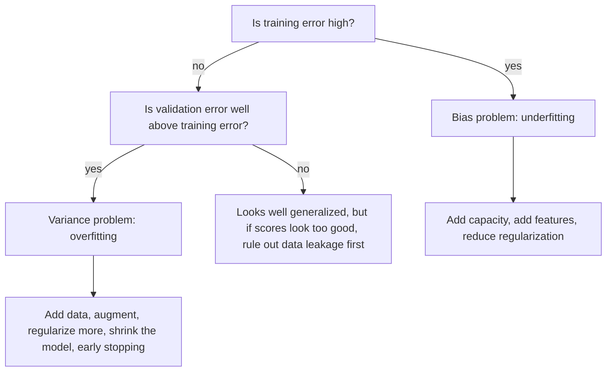
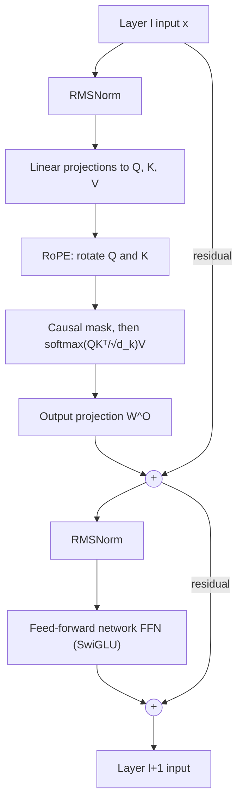
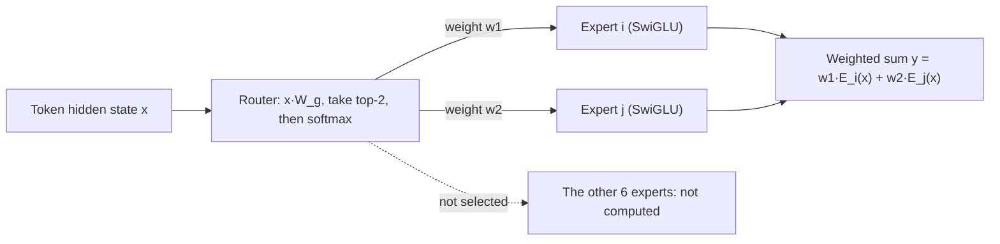

> 🌏 [中文版](/posts/ai/2026-10-03-ai-interview-ml-transformer-basics)

When an interviewer asks about the [Transformer](https://arxiv.org/abs/1706.03762), they rarely want you to redraw the architecture diagram. What separates candidates is the chain of follow-ups: why does attention divide by √d_k, how does [RoPE](https://arxiv.org/abs/2104.09864) make the dot product depend only on relative distance, what exactly differs between [Adam](https://arxiv.org/abs/1412.6980) and [AdamW](https://arxiv.org/abs/1711.05101), why isn't a high AUC enough to ship. The answers all live in the mechanism, and memorized conclusions rarely survive a second "why?".

This post organizes ML fundamentals and Transformer/NLP internals into a talk track you can follow end to end. The first half covers bias-variance, regularization, loss functions, optimizers, evaluation metrics, data leakage and cross-validation; the second half covers self-attention, positional encoding, normalization layers, architecture choices, tokenization, embeddings, long context and MoE. Every section runs concept, then mechanism or comparison, then "How to answer in an interview". Three [numpy](https://numpy.org/) coding exercises close the post, and all the code was actually executed.

This is one post in the "AI Engineer Interview Prep" series. For the big picture, start with the [overview](/en/posts/ai/2026-08-20-ai-engineer-interview-overview-en); the earlier posts on [ML fundamentals](/en/posts/ai/2026-08-20-ai-engineer-interview-ml-fundamentals-en), [deep learning](/en/posts/ai/2026-08-20-ai-engineer-interview-deep-learning-en) and [NLP and LLMs](/en/posts/ai/2026-08-20-ai-engineer-interview-nlp-llm-en) focus on how these topics are tested and on intuition, while this one adds mechanisms and sources. Paper numbers were checked against the original papers; figures marked "derived" were computed from the formulas and verified with code; claims without a primary source are flagged as such rather than stated as fact.

---

## Part 1: ML Fundamentals

### Bias and Variance: The U-Curve Is Only the Classical Version

Start with the concept. For a fixed input point with squared loss in regression, expected prediction error decomposes into three parts ([Wikipedia has the full derivation](https://en.wikipedia.org/wiki/Bias%E2%80%93variance_tradeoff)):

```
Err(x0) = σ² + Bias²(f̂(x0)) + Var(f̂(x0))
        = irreducible noise + bias² + variance
```

Bias is how far the model's expected prediction sits from the true function; it comes from assumptions that are too strong, such as fitting a curve with a straight line. Variance is how much predictions swing when you swap in a different training set; it comes from a model that is too sensitive to sample details. No amount of tuning removes the noise.

Mechanically there are three knobs: model capacity, regularization strength and data size. More capacity lowers bias and raises variance; stronger regularization does the opposite; more data mainly pushes variance down. In practice, training error versus validation error is enough to diagnose, and the logic matches [scikit-learn's definition of overfitting](https://scikit-learn.org/stable/modules/cross_validation.html):



For derivations and sample complexity, see the site's [CS229 notes, chapter 8: generalization](/en/posts/ai/2026-08-22-stanford-cs229-2026-notes-chapter-08-generalization-en).

The U-curve is not the whole story. [Belkin et al.](https://arxiv.org/abs/1812.11118) point out that modern neural networks are often trained to exactly fit (interpolate) the training data, which the classical view would call overfitting, yet they frequently keep high accuracy on test data. Their double descent curve contains the classical U inside it: once capacity passes the interpolation point, test performance improves again. Why large models don't overfit badly is often explained as "implicit regularization", but the mechanism is still an open research question.

**How to answer in an interview**: Give the three-part decomposition and the diagnosis flow, then add one sentence on double descent to show you know where the classical story stops; don't present bias-variance as a law. Asked "training error 2%, validation error 15%, what now?", say it's a variance problem and list more data, augmentation, stronger regularization, a smaller model and early stopping. Asked why large models don't collapse, say "there are proposed mechanisms, but no consensus".

### Regularization: L1, L2, Dropout and Early Stopping

Overfitting is the model memorizing noise in the training data; regularization limits the model's effective capacity during training. The four common techniques do it in different ways and are often combined.

- **L2 (weight decay, ridge)**: add `Ω(w) = ½‖w‖²₂` to the objective, pulling weights toward the origin. Per [chapter 7 of the Deep Learning Book](https://www.deeplearningbook.org/contents/regularization.html), this is the most common weight penalty.
- **L1**: add `λ‖w‖₁`, which can drive some weights to exactly 0, hence sparsity and feature selection. The intuition: L1's gradient has a fixed magnitude of ±λ, so small weights get pushed all the way to 0, while L2's gradient shrinks with the weight, so it shrinks but never zeroes.
- **Dropout**: [Hinton et al.](https://arxiv.org/abs/1207.0580) originally described randomly omitting half of the feature detectors for each training example, which prevents complex co-adaptation among neurons. [PyTorch's implementation](https://docs.pytorch.org/docs/stable/generated/torch.nn.Dropout.html) zeroes elements with probability p during training and scales the output by `1/(1-p)`, so evaluation is just the identity; this is inverted dropout.
- **Early stopping**: stop when validation loss stops improving. In the simple quadratic-approximation case it is equivalent to L2 regularization (same chapter of the book), at the cost of holding out a validation set.

The Transformer itself uses two of these. The [original paper](https://arxiv.org/abs/1706.03762)'s base model applies dropout of 0.1 to each sub-layer output (before the residual add) and to the sum of embeddings and positional encodings; it also uses label smoothing, which the paper says hurts perplexity but improves accuracy and BLEU. For how regularization fits with model selection, see [CS229 notes, chapter 9](/en/posts/ai/2026-08-22-stanford-cs229-2026-notes-chapter-09-regularization-model-selection-en).

The next section covers a classic trap: with Adam, "L2 regularization" and "weight decay" are not the same thing.

**How to answer in an interview**: Classify in one line: L2 shrinks, L1 sparsifies, dropout masks at random, early stopping watches validation. Asked "why does L1 produce sparsity?", answer that a fixed-size gradient pushes small weights to 0. Asked how dropout works at train versus inference time, answer: mask and scale by `1/(1-p)` in training, switch it off entirely at inference.

### Loss Functions: Cross-Entropy and MSE Are Both Maximum Likelihood

A loss function turns "how wrong is the prediction" into a differentiable number. Per [chapter 5 of the Deep Learning Book](https://www.deeplearningbook.org/contents/ml.html), the most common cost function is the negative log-likelihood, and minimizing it is maximum likelihood estimation. Both common losses fit this frame:

```
MSE            L = (1/m) Σ (ŷ_i − y_i)²      negative log-likelihood of p(y|x) = N(y; ŷ(x), σ²)
cross-entropy  L = −Σ_k y_k · log p_k        p = softmax(z); gradient wrt logits ∂L/∂z = p − y
```

With softmax plus cross-entropy, the gradient with respect to the logits collapses to "predicted probability minus one-hot label" (derived, checked with central differences): the more wrong the prediction, the larger the gradient, which is one reason it trains well.

An LLM's pretraining loss is cross-entropy on the next token, and perplexity is the exponential of the mean cross-entropy. Numerically, never compute softmax and then log; use log-softmax or logsumexp, which exercise 1 below demonstrates.

When classes are imbalanced you can swap the loss: [focal loss](https://arxiv.org/abs/1708.02002), proposed for dense object detection, down-weights well-classified examples so a flood of easy negatives doesn't dominate training.

"Don't use MSE for classification because gradients saturate" is a common claim that this post did not verify against a primary source; treat it as a side note and anchor your main argument on the likelihood interpretation and the `p − y` gradient.

**How to answer in an interview**: Say both are negative log-likelihoods with different distributional assumptions (Gaussian for MSE, categorical for cross-entropy). Then say the gradient of softmax plus cross-entropy is `p − y`. Finish with numerical stability: use log-softmax.

### Optimizers: From SGD to Adam, Then AdamW

SGD follows the mini-batch gradient, and momentum steadies it. [Adam](https://arxiv.org/abs/1412.6980) keeps a first moment (momentum) and a second moment (moving average of squared gradients) per parameter, and normalizes the step by the second moment, so it is less sensitive to the learning rate, at the cost of two extra states per parameter. The formulas (in the notation of Algorithms 1 and 2 of the [AdamW paper](https://arxiv.org/abs/1711.05101)):

```
Adam
  g_t = ∇f_t(θ_{t-1})
  m_t = β1·m_{t-1} + (1−β1)·g_t            # first moment
  v_t = β2·v_{t-1} + (1−β2)·g_t²           # second moment
  m̂_t = m_t/(1−β1^t),  v̂_t = v_t/(1−β2^t)  # bias correction
  θ_t = θ_{t-1} − α·m̂_t/(√v̂_t + ε)

AdamW
  θ_t = θ_{t-1} − η_t·( α·m̂_t/(√v̂_t + ε) + λ·θ_{t-1} )   # decay never enters m or v
```

Bias correction exists because m and v start at 0 and are biased toward 0 in the first steps, so they are divided by `1−βᵗ`. The defaults are α = 0.001, β₁ = 0.9, β₂ = 0.999.

AdamW fixes this problem: under plain SGD, weight decay and L2 regularization differ only by a learning-rate-dependent factor, but Propositions 1 and 2 of the AdamW paper show that adaptive methods like Adam have no such equivalent coefficient. The intuition: Adam plus L2 adds `λθ` to the gradient, which is then rescaled by `1/√v̂`, so parameters with a large gradient history get regularized less; AdamW pulls decay out of the gradient update so every weight decays at the same rate. In image classification experiments with the default learning rate, the paper reports about 15% relative improvement in test error over Adam, and the authors themselves say more tasks are needed to confirm it.

For practical settings, [LLaMA](https://arxiv.org/abs/2302.13971) uses AdamW with β₂ set to 0.95 rather than the default 0.999, plus warmup and cosine decay; why 0.95, just say "that is a setting used in practice".

**How to answer in an interview**: Explain Adam's two moments and bias correction, then the AdamW difference: decay stays out of the second-moment scaling. Asked "is Adam always better than SGD?", say no: in the AdamW paper, SGD with momentum often beat Adam plus L2 on image classification, and Adam only caught up after decoupled weight decay was added.

### Evaluation Metrics and Imbalanced Data

With few positives, accuracy lies. On 1% positives, a model that always predicts negative gets 99% accuracy and zero precision and recall (derived). So look at these metrics, each answering a different question:

| Metric | The question it answers |
|---|---|
| precision | Of the samples predicted positive, how many are truly positive |
| recall | Of the true positives, how many were caught |
| F1 | Harmonic mean of precision and recall, i.e. `2tp / (2tp + fp + fn)` |
| ROC AUC | Probability that a random positive is ranked above a random negative |
| PR curve | Fraction of predicted positives that are real, across recall levels |

The general F-beta form is `(1+β²)tp / ((1+β²)tp + fp + β²fn)`, and β above 1 favors recall (see the [scikit-learn metrics guide](https://scikit-learn.org/stable/modules/model_evaluation.html)). The probabilistic reading of AUC is in [Wikipedia's ROC entry](https://en.wikipedia.org/wiki/Receiver_operating_characteristic). AUC measures ranking only, independent of the decision threshold and of probability calibration.

On imbalanced data, [Saito and Rehmsmeier](https://journals.plos.org/plosone/article?id=10.1371/journal.pone.0118432) argue that visual interpretation of ROC plots can be deceptive, while PR plots show the fraction of true positives among predicted positives and better reflect future classification performance. The toolbox for imbalanced data, roughly cheapest first:

1. Switch metrics to precision, recall and PR curves first; split with stratification so each fold keeps the class ratio.
2. Class weights (cost-sensitive learning) and threshold tuning are generic practices that this post did not check against a single primary source.
3. Resampling: [SMOTE](https://arxiv.org/abs/1106.1813) synthesizes new minority-class samples and combines that with undersampling of the majority class.
4. Change the loss, such as the focal loss mentioned earlier.

Whichever you pick, resample only inside the training folds. Resample first and split later, and synthetic samples sit next to validation samples and inflate the score, which is the next section's topic.

**How to answer in an interview**: Start from the cost of errors: if misses are expensive (disease screening, fraud) favor recall; if false alarms are expensive (spam filter casualties, review workload) favor precision. Asked "is a high AUC a good model?", say not necessarily: AUC measures ranking, and under heavy imbalance you should look at the PR curve. SMOTE belongs after the split, on training data only.

### Data Leakage: When Scores Look Too Good, Suspect It First

Per [scikit-learn's Common pitfalls](https://scikit-learn.org/stable/common_pitfalls.html), leakage means using information at modeling time that won't be available at prediction time, giving overly optimistic performance estimates and worse results after deployment. The most common source is standardizing, selecting features or imputing before the split, which mixes test-set information into training. The rule is short: always split first, call every `fit` on training data only, and never use the test set for any model selection.

The scikit-learn docs have a handy demonstration: 200 samples, 10,000 random features, completely random labels. Run `SelectKBest` on all the data before splitting and test accuracy reaches 0.76; split first and select features on the training data only, and accuracy falls back to about 0.5, which is chance. The fix is to chain preprocessing and model in a `Pipeline`, so every cross-validation fold refits from scratch. That random-label sanity check is also a practical way to detect leakage.

[Kapoor and Narayanan](https://arxiv.org/abs/2207.07048) surveyed papers across many fields and found 329 affected by leakage, so this isn't a beginner-only trap. Subtypes interviewers like to mention:

- **Temporal leakage**: time series can't use a randomly shuffled KFold; use `TimeSeriesSplit` and test on "future" observations.
- **Group leakage**: samples from the same person (patient) land on both sides of the split and the model can learn the person; use `GroupKFold`.
- **Target leakage**: a feature itself carries label information, such as a column known only after the outcome. This is the common definition; this post did not check it against a single primary source.

**How to answer in an interview**: One-sentence definition, then two concrete practices: `Pipeline` and the random-label check. Asked "should standardization happen inside or outside cross-validation?", answer inside, via a Pipeline, otherwise validation-fold mean and variance leak into training. Asked how to split for recommenders or time series, answer by time, train earlier and test later.

### Cross-Validation: k Folds Taking Turns as the Validation Set

Learning parameters and testing on the same data is a methodological mistake, and tuning hyperparameters over and over slowly leaks test-set information into the model. So you hold out a test set and use it once, at the end. A separate validation set for tuning shrinks the training data and makes results a matter of luck; [cross-validation](https://scikit-learn.org/stable/modules/cross_validation.html) instead splits the training set into k folds, trains on k−1 and validates on the remaining one in turn, and reports the mean over k runs. It is especially worthwhile with few samples, at the cost of compute.

Choose the split to match the data:

- `StratifiedKFold`: each fold keeps roughly the overall class ratio; `cross_val_score` uses it by default for classifiers.
- `GroupKFold`: the same group never appears on both the training and test side.
- `TimeSeriesSplit`: earlier folds train, a later fold tests, and each training set is a superset of the previous one.

Two details are easy to miss: if the data is sorted by class, shuffle first, but when samples aren't i.i.d. (for example, news sorted by time) shuffling inflates scores instead; and when comparing models, fix the CV split (give the splitter an integer `random_state`).

Picking the best result from a hyperparameter search using the same CV score makes that score optimistic; a commonly mentioned remedy is nested cross-validation, whose details this post did not verify and only names here.

**How to answer in an interview**: First say you still need a test set after CV, because CV is for choosing models and hyperparameters, and the final generalization estimate must come from data never touched. Then pick the split by data type: stratified for classification, by time for time series, group for repeated individuals.

---

## Part 2: Transformer and NLP

### Self-Attention and One Transformer Block

The [Transformer](https://arxiv.org/abs/1706.03762) drops recurrence and convolution entirely and lets any two positions interact directly. In self-attention, Q, K and V are all linear projections of the same layer input, and the core is Equation 1 of the paper:

```
Attention(Q, K, V) = softmax(Q·Kᵀ / √d_k) · V
```

Why divide by √d_k? Assume the components of q and k are independent with mean 0 and variance 1; then the dot product `q·k` has mean 0 and variance d_k. With large d_k the dot products grow in magnitude and push softmax into regions with tiny gradients, so dividing by √d_k brings the variance back to 1. Note that the paper says "We suspect", so this is the authors' conjecture, and it notes that with small d_k scaling makes little difference. Exercise 2 below shows it in action: at d_k = 512, the unscaled softmax's largest weight is nearly 1.0, essentially one-hot.

The decoder's self-attention also needs a causal mask: before softmax, set the scores of future positions to −∞ so information can't flow from the future to the past. The mask goes before softmax because multiplying by 0 afterward would leave the weights unnormalized.

Multi-head attention projects Q, K and V into h lower-dimensional subspaces, attends in each, and concatenates:

```
MultiHead(Q,K,V) = Concat(head_1, …, head_h) · W^O
head_i = Attention(Q·W_i^Q, K·W_i^K, V·W_i^V)
```

The original base model has d_model of 512 split into 8 heads, so each head has d_k of 64 and the total compute is close to single-head attention at full width. More heads are not always better: Table 3(A) of the paper shows that at fixed compute, a single head is 0.9 BLEU worse than the best setting, and quality drops again with too many heads.

Putting the pieces together, one layer of a common decoder-only model (LLaMA style as the example) looks like this:



In the diagram, normalization sits at the sub-layer input (Pre-LN), and positional encoding acts only on Q and K; the next two sections cover each. For a gentler introduction, read the site's [Transformer and Attention](/en/posts/ai/2026-08-26-understanding-ai-models-transformer-en) and [CS224N lecture 5](/en/posts/ai/2026-08-22-cs224n-transformers-en); stable defaults for architecture choices are collected in [CS336 lecture 3](/en/posts/ai/2026-08-22-cs336-architectures-hyperparameters-en).

**How to answer in an interview**: Be able to write `softmax(QKᵀ/√d_k)V`, explain the scaling with "variance grows to d_k", and say it is the authors' conjecture. State clearly that the causal mask sets −∞ before softmax. Asked "why project Q, K and V separately?", the common explanation is that it lets the three use different subspaces, but the paper doesn't argue for it specifically, so present it as intuition, not as a result from the paper.

### Positional Encoding: Sinusoidal and RoPE

Attention itself is blind to order, so position information has to be injected. The original paper adds fixed sin/cos signals to the embeddings:

```
PE(pos, 2i)   = sin(pos / 10000^(2i/d_model))
PE(pos, 2i+1) = cos(pos / 10000^(2i/d_model))
```

The authors' reasoning is that for any fixed offset k, `PE(pos+k)` is a linear function of `PE(pos)`, which may make it easy for the model to attend by relative position. They also tried learned positional embeddings and got nearly identical results (dev BLEU 25.7 versus 25.8).

[RoPE (RoFormer)](https://arxiv.org/abs/2104.09864) takes a different route: instead of adding position to the representation, it rotates Q and K with a rotation matrix. The goal is a function f whose inner product depends only on relative position:

```
⟨f_q(x_m, m), f_k(x_n, n)⟩ = g(x_m, x_n, m − n)
f(x_m, m) = R_{Θ,m} · W · x_m          # R is built from d/2 2×2 rotation blocks
q_mᵀ k_n = x_mᵀ W_qᵀ · R_{Θ,n−m} · W_k x_n    # because R_mᵀ R_n = R_{n−m}
```

Properties worth remembering: R is orthogonal, so rotation doesn't change vector length; the inner product decays with relative distance; it acts only on Q and K, not V, since position only needs to influence attention scores; and it adds no parameters. LLaMA removed absolute position embeddings and applies RoPE in every layer.

RoPE still degrades beyond the training length. [Position Interpolation](https://arxiv.org/abs/2306.15595) linearly scales position indices down to the original window instead of extrapolating, because extrapolation can produce catastrophically high attention scores; the paper uses it to extend LLaMA's window to as much as 32768 with fine-tuning of well under a thousand steps.

**How to answer in an interview**: The key to RoPE is that rotation matrices satisfy `R_mᵀ R_n = R_{n−m}`, so the inner product keeps only the relative offset. For "how do you extend a 4K model to 32K?", answer position interpolation plus brief fine-tuning. Other extension methods weren't verified here, so don't go further.

### LayerNorm, RMSNorm and Pre-LN

[LayerNorm](https://arxiv.org/abs/1607.06450) normalizes using the mean and standard deviation over all neurons of one layer for one sample, independent of batch size and identical at train and test time, which suits variable-length sequences and differs from BatchNorm. [RMSNorm](https://arxiv.org/abs/1910.07467) argues that re-centering is not the key and keeps only re-scaling:

```
LayerNorm:  ā_i = (a_i − μ) / σ · g_i,     μ = mean(a),  σ = sqrt(mean((a − μ)²))
RMSNorm:    ā_i = a_i / RMS(a) · g_i,      RMS(a) = sqrt(mean(a²))
```

When the input mean is 0 the two are identical. The paper hypothesizes that scale invariance, not shift invariance, is why LayerNorm works; experiments show comparable quality with running time reduced by 7% to 64%, depending on the model. Implementations usually add a small ε to avoid dividing by 0; that is a convention, not in the paper's formula.

Where to put the normalization is another frequent question. The original Transformer uses `LayerNorm(x + Sublayer(x))`, called Post-LN. [Xiong et al.](https://arxiv.org/abs/2002.04745) use mean-field theory to show that with Post-LN, at initialization the expected gradients of parameters near the output layer are large, so a large learning rate is unstable and warmup is needed; Pre-LN puts the LN inside the residual block, has well-behaved gradients at initialization, and can drop warmup while reaching comparable results with less training time and tuning. LLaMA's choice combines both ideas: per the paper, it normalizes the input of each sub-layer instead of the output, for training stability, and uses RMSNorm.

**How to answer in an interview**: LayerNorm versus BatchNorm is about which axis the statistics run over; RMSNorm drops re-centering for less compute; for Pre-LN versus Post-LN, talk gradients and warmup. Pre-LN's downsides were not checked against a primary source here, so don't assert any.

### Decoder-Only vs Encoder-Decoder

The original Transformer is encoder-decoder, designed for translation-style "sequence in, sequence out": the encoder reads the input bidirectionally, and the decoder generates while looking back at the encoder output through cross-attention, with a mask to prevent seeing the future. [BERT](https://arxiv.org/abs/1810.04805) uses only the encoder, designed to pretrain deep bidirectional representations from both left and right context and then fine-tune for understanding tasks. GPT and LLaMA-style models use only the decoder, with a causal mask for autoregressive generation.

Why are today's large language models almost all decoder-only? [Wang et al.](https://arxiv.org/abs/2204.05832) ran a large-scale comparison with models above 5B parameters. They compared causal and non-causal decoder-only against encoder-decoder, each with autoregressive and masked language model pretraining objectives. The conclusion has two halves: after purely unsupervised pretraining, causal decoder-only with an autoregressive objective has the strongest zero-shot generalization; but a model with bidirectional visibility on the input side, pretrained with masked LM and then multitask fine-tuned, performed best in their experiments. So it can't be reduced to "encoder-decoder is worse".

**How to answer in an interview**: Say what each of the three architectures is good for. Then cite both halves of Wang et al. to avoid a one-sided answer, and never put it as "encoder-decoder is worse".

### Tokenization: BPE, WordPiece, SentencePiece and the Cost for Chinese

Models don't consume raw strings. Word-level vocabularies are too large and have unknown words; character-level sequences are too long; so models use subwords: common words stay whole and rare words split into smaller pieces.

[BPE](https://arxiv.org/abs/1508.07909) (Sennrich et al.) began as a data compression technique, and the translation version merges character sequences instead: initialize the vocabulary with characters plus an end-of-word symbol, repeatedly count all adjacent symbol pairs, and replace the most frequent pair with a new symbol. The final vocabulary size equals the initial vocabulary plus the number of merges, and the number of merges is the only hyperparameter. Exercise 3 is one step of that loop.

[WordPiece](https://arxiv.org/abs/1609.08144) (GNMT) is data-driven and maximizes the language-model likelihood of the training data; BERT uses WordPiece. [SentencePiece](https://arxiv.org/abs/1808.06226) is a language-independent segmenter that trains directly from raw sentences without pre-tokenization, treats whitespace as an ordinary symbol, and implements both BPE and a unigram model, which is friendly to Chinese and Japanese. LLaMA's tokenizer is BPE implemented with SentencePiece and falls back to bytes (byte fallback) for unknown UTF-8 characters. The one-line difference between BPE and WordPiece is that the former merges the most frequent adjacent pair while the latter looks at language-model likelihood; WordPiece's exact merge-scoring formula wasn't checked word for word here, so it isn't expanded.

The cost problem for Chinese has two layers. The first is bytes: CJK characters take 3 bytes in UTF-8, so when the vocabulary covers them poorly, a byte-level or byte-fallback tokenizer can split one rare character into several tokens in the worst case. The second is cross-language unfairness: [Petrov et al.](https://arxiv.org/abs/2305.15425) found that the same text translated into different languages can differ in tokenized length by up to 15 times, even for tokenizers deliberately trained to be multilingual; [Ahia et al.](https://arxiv.org/abs/2305.13707) point out that APIs bill by token count, so speakers of many languages pay more for worse results.

This post has no reliable primary-source figure for the actual Chinese-versus-English token ratio, so it doesn't give one. The safe approach is to measure your own data with the vendor's token-counting tool or official tokenizer instead of estimating cost from character counts. Token counts also can't be converted across model families, so RAG chunk sizes should be measured with the target model's tokenizer. The site's [Tokenization: the BPE algorithm and why Chinese costs more than English](/en/posts/ai/2026-08-26-understanding-ai-models-tokenization-en), [CS224N lecture 14](/en/posts/ai/2026-08-22-cs224n-tokenization-multilinguality-en) and [CS336 lecture 1](/en/posts/ai/2026-08-22-cs336-overview-tokenization-en) go further.

**How to answer in an interview**: Say why subwords, then the BPE loop and "the merge count sets vocabulary size". Cover the Chinese cost in two layers (bytes, cross-language gap) and land on "measure your own data".

### Embeddings and Similarity: Cosine vs Dot Product

An embedding maps text to a vector so that semantically similar items sit close together. Cosine similarity is the cosine of the angle between two vectors, equal to normalizing to unit length and then taking the inner product, so it looks at direction only; the dot product depends on both direction and length. When both vectors are already unit length the two give identical results, and for unit vectors `‖a−b‖² = 2 − 2cos(a,b)`, so cosine ranking agrees with Euclidean ranking.

```
cos(a, b) = a·b / (‖a‖·‖b‖)
```

[OpenAI's embeddings documentation](https://platform.openai.com/docs/guides/embeddings) recommends cosine similarity and says the choice of distance function usually matters little; its embeddings are normalized to length 1, so cosine can be computed with just the inner product, slightly faster.

Cosine is not a cure-all, though. [Steck et al.](https://arxiv.org/abs/2403.05440) analytically derive, for regularized linear models, that cosine similarity can yield "arbitrary and therefore meaningless" similarities, and warn against using it blindly. In practice, a vector database's distance metric should match how the embedding model was trained, per the model's documentation (a common engineering practice, not checked against a single primary source).

A common mix-up: attention uses the scaled dot product `QKᵀ/√d_k`, not cosine. For how embeddings are trained, read the site's [Embedding: how models turn text into computable vectors](/en/posts/ai/2026-08-26-understanding-ai-models-embedding-en).

**How to answer in an interview**: Cosine and dot product coincide when vectors are normalized, which is the safest first sentence. Then add the Steck et al. warning to show you know cosine isn't always meaningful, and finish by saying the metric must match how the embedding model was trained.

### Why Attention Is O(n²), and How Long Context Gets Handled

`QKᵀ` scores every pair of positions, producing an n×n matrix, so compute and (if stored in full) memory are both quadratic in n. Table 1 of the original paper sets it side by side with other layer types:

| Layer type | Complexity per layer | Sequential operations | Maximum path length |
|---|---|---|---|
| Self-Attention | O(n²·d) | O(1) | O(1) |
| Recurrent | O(n·d²) | O(n) | O(n) |
| Convolutional | O(k·n·d²) | O(1) | O(log_k n) |
| Self-Attention (restricted, neighborhood r) | O(r·n·d) | O(1) | O(n/r) |

The upside is that any two positions connect directly and the computation parallelizes; the cost is that it blows up as n grows. Estimated for fp16, one head, one layer, the score matrix alone at n = 32,768 is 2 GiB (derived). Long-context techniques fall into four groups.

**First, change the hardware implementation.** [FlashAttention](https://arxiv.org/abs/2205.14135) is IO-aware exact attention that uses tiling to cut reads and writes between GPU high-bandwidth memory and on-chip SRAM; it is not an approximation, and it trains BERT-large (sequence length 512) 15% faster end to end. Because it is exact attention, the arithmetic is still of order n², and what it saves is mainly memory traffic (inferred from "exact").

**Second, change the attention scope.** [Longformer](https://arxiv.org/abs/2004.05150) uses a fixed window where each token sees only the w tokens around it, for O(n×w) complexity. [Mistral 7B](https://arxiv.org/abs/2310.06825) uses a window of 4096, and stacked layers give a theoretical attention span of about 131K tokens at the last layer; its rolling buffer cache fixes the KV cache at the window size, cutting cache memory 8 times at sequence length 32k. [Sparse Transformers](https://arxiv.org/abs/1904.10509) use sparse factorization to bring the cost down to O(n√n). The trade-off is that information outside the window can only pass indirectly through layers, and theoretical receptive field is not the same as context the model effectively uses.

**Third, shrink the KV cache.** In autoregressive decoding, the bottleneck is memory bandwidth spent repeatedly loading the large K and V tensors. [MQA](https://arxiv.org/abs/1911.02150) has all heads share one set of K and V, and the paper concludes quality drops only slightly. [GQA](https://arxiv.org/abs/2305.13245) splits query heads into G groups that each share one K head and one V head: GQA-1 is MQA, and G equal to the head count is MHA; when converting from a multi-head checkpoint, the K and V projections of the original heads in a group are mean-pooled, then training continues with about 5% of the original pretraining compute. The paper concludes quality close to MHA with speed close to MQA. Mistral 7B and [Mixtral](https://arxiv.org/abs/2401.04088) both use 32 query heads with 8 KV heads.

You can work out KV cache size yourself, which makes a good whiteboard question:

```
bytes/token = 2 × layers × n_kv_heads × head_dim × bytes_per_element
```

With Mistral 7B's configuration (32 layers, head_dim 128, fp16): full MHA (32 KV heads) is 512 KiB per token, GQA-8 is 128 KiB and MQA is 16 KiB (derived). At a 32K sequence, MHA is about 16 GiB and GQA-8 about 4 GiB.

**Fourth, position interpolation.** The Position Interpolation mentioned earlier can extend a RoPE model's window to 32768. For how the course covers it, see [CS336 lecture 4: Attention and MoE](/en/posts/ai/2026-08-22-cs336-attention-moe-en).

**How to answer in an interview**: Say O(n²) covers both time and memory, and add that FlashAttention doesn't change the order of the exact arithmetic and saves memory traffic. Cover long context in four groups (hardware, scope, KV cache, position) and work one KV cache number with the formula. Asked "why is the KV cache the bottleneck?", answer that every generated token reads the entire K and V, so decoding is memory-bandwidth bound.

### MoE: Big Capacity, Only a Sliver Computed Per Token

MoE (Mixture of Experts) replaces each layer's feed-forward network with many "experts" and adds a small router so each token goes through only a few of them. The sparsely-gated MoE of [Shazeer et al.](https://arxiv.org/abs/1701.06538) was an early large-scale form of conditional computation: a trainable gating network picks a sparse combination of experts per example. [Switch Transformer](https://arxiv.org/abs/2101.03961) simplified routing to k = 1 and added an auxiliary load-balancing loss so experts aren't used unevenly; its abstract states plainly that the obstacles to MoE adoption are complexity, communication cost and training instability.

The most common example is [Mixtral 8x7B](https://arxiv.org/abs/2401.04088): same architecture as Mistral 7B, except each layer has 8 feed-forward blocks, and a router picks 2 experts per token and combines their outputs. Each token has access to 47B parameters but uses only 13B active parameters at inference.



```
G(x) = Softmax(TopK(x·W_g))       # TopK: logits outside the top K are set to −∞
y = Σ_i Softmax(Top2(x·W_g))_i · SwiGLU_i(x)
```

Two common traps. First, experts are not "math experts" or "code experts": the Mixtral paper's routing analysis suggests expert selection tracks syntax more than domain, especially in the first and last layers. Second, MoE saves compute, not memory: any token may be routed to any expert, so all 47B parameters must be loaded (inferred from "each token can access 47B"; deployment details such as expert parallelism and offloading were not verified). Total parameters aren't 8×7B because the paper replaces only each layer's feed-forward block with experts, from which it follows that the rest is shared (the abstract doesn't say so word for word). For the longer story, read the site's [Why MoE wins](/en/posts/ai/2026-08-26-moe-architecture-why-it-wins-en).

**How to answer in an interview**: Lead with "big capacity, same per-token compute", then use Mixtral's top-2 routing as the example and separate active parameters from total parameters. Give three downsides: memory is still paid in full, load imbalance, and training instability. Describe expert specialization as "closer to syntax than domain", never as domain experts.

---

## Coding Exercises: softmax, Attention, One BPE Merge

All three ran under Python 3.11 and numpy 2.4.6, and every built-in assert passes. Exercise 2 imports from exercise 1, so save exercise 1 as `softmax_stable.py` first.

### Exercise 1: Numerically Stable softmax

Key points: softmax is invariant to adding a constant to the input, so subtract the max first and every exp argument is ≤ 0. The naive version's `exp(1000)` overflows to inf, and inf/inf gives nan. Add log-softmax and cross-entropy while you're there. If an entire row is −inf this version returns nan; a causal mask always leaves at least the diagonal, so it is safe.

```python
import numpy as np


def softmax_naive(x):
    e = np.exp(x)
    return e / e.sum(axis=-1, keepdims=True)


def softmax(x, axis=-1):
    """Stable softmax: subtract the max before exp.
    softmax is shift-invariant, so the result matches the naive version;
    but exp never sees a positive argument, so it cannot overflow,
    and at least one term in the denominator is 1."""
    x = np.asarray(x, dtype=np.float64)
    z = x - np.max(x, axis=axis, keepdims=True)
    e = np.exp(z)
    return e / np.sum(e, axis=axis, keepdims=True)


def logsumexp(x, axis=-1):
    x = np.asarray(x, dtype=np.float64)
    m = np.max(x, axis=axis, keepdims=True)
    return (m + np.log(np.sum(np.exp(x - m), axis=axis, keepdims=True))).squeeze(axis)


def log_softmax(x, axis=-1):
    x = np.asarray(x, dtype=np.float64)
    return x - np.expand_dims(logsumexp(x, axis=axis), axis)


def cross_entropy_from_logits(logits, target_idx):
    """-log softmax(logits)[target], never forming probabilities that can underflow to 0."""
    return -log_softmax(logits)[np.arange(len(target_idx)), target_idx]


if __name__ == "__main__":
    np.set_printoptions(precision=6, suppress=True)
    big = np.array([1000.0, 1001.0, 1002.0])
    small = np.array([0.0, 1.0, 2.0])
    with np.errstate(all="ignore"):
        print("naive  softmax([1000,1001,1002]) =", softmax_naive(big))
    print("stable softmax([1000,1001,1002]) =", softmax(big))
    print("stable softmax([0,1,2])          =", softmax(small))
    assert np.allclose(softmax(small), softmax(big))           # shift invariance
    ref = np.exp([0, 1, 2]) / np.exp([0, 1, 2]).sum()
    assert np.allclose(softmax(small), ref)                    # matches the textbook definition
    P = softmax(np.random.default_rng(0).normal(size=(4, 7)) * 50)
    assert np.allclose(P.sum(-1), 1.0) and (P >= 0).all()      # every row sums to 1
    neg = np.array([-1000.0, -1001.0, -1002.0])
    assert np.allclose(softmax(neg), softmax(np.array([0.0, -1.0, -2.0])))
    l = np.array([[0.0, 800.0]])
    with np.errstate(all="ignore"):
        print("log(softmax):", np.log(softmax(l)), "| log_softmax:", log_softmax(l))
    assert np.isclose(log_softmax(l)[0, 0], -800.0)            # log_softmax stays finite
    ce = cross_entropy_from_logits(np.zeros((3, 10)), np.array([0, 3, 9]))
    assert np.allclose(ce, np.log(10))                         # uniform-distribution CE = ln(num classes)
    print("cross_entropy(uniform, V=10) =", ce)
    print("ALL SOFTMAX CHECKS PASSED")
```

Output:

```
naive  softmax([1000,1001,1002]) = [nan nan nan]
stable softmax([1000,1001,1002]) = [0.090031 0.244728 0.665241]
stable softmax([0,1,2])          = [0.090031 0.244728 0.665241]
log(softmax): [[-inf   0.]] | log_softmax: [[-800.    0.]]
cross_entropy(uniform, V=10) = [2.302585 2.302585 2.302585]
ALL SOFTMAX CHECKS PASSED
```

Complexity: for a row of length n, O(n) time (one pass each for max, exp and sum) and O(n) extra space. log_softmax is also O(n), and where `log(softmax)` returns −inf for an input like 800, log_softmax stays finite.

### Exercise 2: Scaled Dot-Product Attention (with Causal Mask)

Key points: `softmax(QKᵀ/√d_k)V`; the causal mask sets future positions to −∞ before softmax, built with `np.tril`; and the extra batch and head dimensions come along for free. Say the checks out loud: upper-triangle weights are exactly 0, token 0's output equals `V[0]` exactly, and changing future K/V doesn't affect earlier positions. The second half of the program also runs the "why divide by √d_k" experiment.

```python
import numpy as np
from softmax_stable import softmax   # save the previous exercise as softmax_stable.py first


def scaled_dot_product_attention(Q, K, V, causal=False):
    """Attention(Q,K,V) = softmax(Q K^T / sqrt(d_k)) V
    Q: (..., n_q, d_k)  K: (..., n_k, d_k)  V: (..., n_k, d_v)
    causal=True: position i may only attend to positions <= i (future scores set to -inf before softmax)."""
    d_k = Q.shape[-1]
    scores = Q @ np.swapaxes(K, -1, -2) / np.sqrt(d_k)
    if causal:
        n_q, n_k = scores.shape[-2], scores.shape[-1]
        mask = np.tril(np.ones((n_q, n_k), dtype=bool))   # lower triangle (incl. diagonal) is visible
        scores = np.where(mask, scores, -np.inf)          # exp(-inf)=0, and the row is renormalized
    weights = softmax(scores, axis=-1)
    return weights @ V, weights


def reference_loop(Q, K, V, causal):
    """Slow but obviously correct per-row implementation, used only for cross-checking."""
    n, d_k = Q.shape
    out = np.zeros((n, V.shape[-1]))
    for i in range(n):
        js = range(i + 1) if causal else range(K.shape[0])
        s = np.array([Q[i] @ K[j] / np.sqrt(d_k) for j in js])
        w = np.exp(s - s.max())
        w /= w.sum()
        out[i] = sum(w[t] * V[j] for t, j in enumerate(js))
    return out


if __name__ == "__main__":
    np.set_printoptions(precision=4, suppress=True)
    rng = np.random.default_rng(42)
    n, d_k, d_v = 5, 8, 4
    Q, K, V = rng.normal(size=(n, d_k)), rng.normal(size=(n, d_k)), rng.normal(size=(n, d_v))

    out, w = scaled_dot_product_attention(Q, K, V)
    out_c, w_c = scaled_dot_product_attention(Q, K, V, causal=True)
    print("causal attention weights (rows = query position):\n", w_c)

    assert out.shape == (n, d_v) and w.shape == (n, n)
    assert np.allclose(w.sum(-1), 1) and np.allclose(w_c.sum(-1), 1)
    assert np.all(np.triu(w_c, k=1) == 0.0)            # strict upper triangle is exactly 0: no peeking at the future
    assert np.allclose(out_c[0], V[0])                 # token 0 can only see itself
    assert np.allclose(out, reference_loop(Q, K, V, False))
    assert np.allclose(out_c, reference_loop(Q, K, V, True))
    K2, V2 = K.copy(), V.copy()                        # changing "future" K/V must not change earlier outputs
    K2[3:], V2[3:] = rng.normal(size=K2[3:].shape), rng.normal(size=V2[3:].shape)
    out_c2, _ = scaled_dot_product_attention(Q, K2, V2, causal=True)
    assert np.allclose(out_c[:3], out_c2[:3]) and not np.allclose(out_c[3:], out_c2[3:])
    Qb, Kb, Vb = (rng.normal(size=(2, 3, n, d)) for d in (d_k, d_k, d_v))   # (batch, head, n, d)
    ob, _ = scaled_dot_product_attention(Qb, Kb, Vb, causal=True)
    assert np.allclose(ob[1, 2], reference_loop(Qb[1, 2], Kb[1, 2], Vb[1, 2], True))
    big, _ = scaled_dot_product_attention(Q * 1e3, K * 1e3, V, causal=True)
    assert np.isfinite(big).all()                      # huge scores do not overflow

    print("\nVar(q.k) vs d_k (100k samples each):")     # why divide by sqrt(d_k)
    for d in (4, 64, 512):
        q, k = rng.normal(size=(100_000, d)), rng.normal(size=(100_000, d))
        dots = (q * k).sum(-1)
        print(f"  d_k={d:4d}  Var(q.k)={dots.var():8.2f}   scaled={(dots / np.sqrt(d)).var():5.2f}")
    q, keys = rng.normal(size=512), rng.normal(size=(10, 512))
    p_raw, p_scaled = softmax(keys @ q), softmax(keys @ q / np.sqrt(512))
    print(f"\nd_k=512, 10 keys: max weight unscaled={p_raw.max():.4f}  scaled={p_scaled.max():.4f}")
    assert p_raw.max() > p_scaled.max()
    print("ALL ATTENTION CHECKS PASSED")
```

Output:

```
causal attention weights (rows = query position):
 [[1.     0.     0.     0.     0.    ]
 [0.416  0.584  0.     0.     0.    ]
 [0.3706 0.4271 0.2022 0.     0.    ]
 [0.4825 0.1955 0.2078 0.1142 0.    ]
 [0.1162 0.295  0.2311 0.1325 0.2253]]

Var(q.k) vs d_k (100k samples each):
  d_k=   4  Var(q.k)=    4.03   scaled= 1.01
  d_k=  64  Var(q.k)=   63.13   scaled= 0.99
  d_k= 512  Var(q.k)=  509.65   scaled= 1.00

d_k=512, 10 keys: max weight unscaled=1.0000  scaled=0.3235
ALL ATTENTION CHECKS PASSED
```

Complexity: with query length n_q and key length n_k, computing `QKᵀ` is O(n_q·n_k·d_k) and multiplying the weights by V is O(n_q·n_k·d_v); storing the weight matrix takes O(n_q·n_k) memory, which is where O(n²) comes from.

### Exercise 3: One Merge Step of Simplified BPE Training

Key points: represent each word as a character sequence plus the end-of-word symbol `</w>` along with its frequency, count weighted adjacent symbol pairs, pick the most frequent pair, and merge left to right without overlap. The example uses the toy vocabulary from the code listing in [Sennrich et al.](https://arxiv.org/abs/1508.07909). In this data the first step has three pairs, `(e,s)`, `(s,t)` and `(t,</w>)`, tied at 9, so say out loud that the tie-break rule (lexicographic order here) affects the result.

```python
import collections

EOW = "</w>"   # end-of-word symbol


def build_vocab(word_freqs):
    """{'low': 5} -> {('l','o','w','</w>'): 5}"""
    return {tuple(w) + (EOW,): f for w, f in word_freqs.items()}


def get_stats(vocab):
    """Count weighted occurrences of every adjacent symbol pair."""
    pairs = collections.Counter()
    for symbols, freq in vocab.items():
        for a, b in zip(symbols, symbols[1:]):
            pairs[(a, b)] += freq
    return pairs


def merge_vocab(pair, vocab):
    """Replace every occurrence of the pair, left to right and non-overlapping, with the merged symbol."""
    a, b = pair
    out = {}
    for symbols, freq in vocab.items():
        new, i = [], 0
        while i < len(symbols):
            if i < len(symbols) - 1 and symbols[i] == a and symbols[i + 1] == b:
                new.append(a + b)
                i += 2
            else:
                new.append(symbols[i])
                i += 1
        out[tuple(new)] = out.get(tuple(new), 0) + freq
    return out


def bpe_merge_step(vocab):
    """One BPE step: merge the most frequent adjacent pair. Ties go to the lexicographically smallest pair so results are reproducible."""
    pairs = get_stats(vocab)
    if not pairs:
        return None, vocab
    best = min(pairs, key=lambda p: (-pairs[p], p))
    return best, merge_vocab(best, vocab)


if __name__ == "__main__":
    words = {"low": 5, "lower": 2, "newest": 6, "widest": 3}   # toy vocabulary from the code listing in Sennrich et al.
    vocab = build_vocab(words)
    stats = get_stats(vocab)
    print("top pairs:", stats.most_common(4))
    best, vocab1 = bpe_merge_step(vocab)
    print("step 1 merge:", best, "->", "".join(best))
    for k, v in vocab1.items():
        print("  ", " ".join(k), v)

    assert stats[("e", "s")] == stats[("s", "t")] == stats[("t", EOW)] == 9   # three-way tie
    assert best == ("e", "s")                                               # lexicographic tie-break
    assert vocab1[("n", "e", "w", "es", "t", EOW)] == 6
    assert vocab1[("w", "i", "d", "es", "t", EOW)] == 3
    assert vocab1[("l", "o", "w", EOW)] == 5                                # words without (e,s) are unchanged
    assert sum(vocab.values()) == sum(vocab1.values())                      # total frequency mass is preserved
    assert merge_vocab(("a", "a"), {("a", "a", "a"): 1}) == {("aa", "a"): 1}  # overlapping case: left to right

    v = build_vocab(words)
    print("\nfirst 6 merges:")
    for i in range(6):
        b, v = bpe_merge_step(v)
        print(f"  {i + 1}: {b[0]!r} + {b[1]!r} -> {''.join(b)!r}")
    print("ALL BPE CHECKS PASSED")
```

Output:

```
top pairs: [(('e', 's'), 9), (('s', 't'), 9), (('t', '</w>'), 9), (('w', 'e'), 8)]
step 1 merge: ('e', 's') -> es
   l o w </w> 5
   l o w e r </w> 2
   n e w es t </w> 6
   w i d es t </w> 3

first 6 merges:
  1: 'e' + 's' -> 'es'
  2: 'es' + 't' -> 'est'
  3: 'est' + '</w>' -> 'est</w>'
  4: 'l' + 'o' -> 'lo'
  5: 'lo' + 'w' -> 'low'
  6: 'e' + 'w' -> 'ew'
ALL BPE CHECKS PASSED
```

Complexity: let L be the total number of symbols over distinct word types. `get_stats` and `merge_vocab` each scan once, so one step is O(L); training with M merges is O(M·L) in the naive form.

---

## Takeaways

These topics keep returning to three questions: what is this design constraining, why is this number chosen, and could the evaluation or the cost be misleading (leakage, AUC, token counts, active parameters).

Three things you can do tonight:

1. Write exercise 1's softmax from memory and say why the max is subtracted first.
2. Redo scikit-learn's random-label leakage demo and compare the `Pipeline` accuracy with the leaky one side by side.
3. Take a model configuration you know and use the KV cache formula to get the per-token size and the size at a 32K sequence.

## Questions that keep showing up in public question banks

These are questions that recur across the 7 public question banks compared in [part 11 of this series](/en/posts/ai/2026-09-30-ai-engineer-interview-resources-en). "Independent sources" only counts overlap between the banks and says nothing about how often a question is asked in real interviews, and the amitshekhar and pallavi banks cite no sources, so this post does not use their company labels. The table lists question titles and links to where each one appears, without reproducing any answers.

| Question | Independent sources | Question-bank links | Section in this post |
|---|---|---|---|
| Why do Transformers need positional encoding, and how does RoPE work compared with learned positions? | 5 | [om](https://github.com/ombharatiya/AI-Engineer-Interview-Questions/blob/main/02-llm-fundamentals/questions.md#27-explain-rope-whats-the-rotation-intuition-and-why-did-it-become-the-default), [aeg](https://github.com/alexeygrigorev/ai-engineering-field-guide/blob/main/interview/questions/questions.md?plain=1#L35), [AIML](https://github.com/alirezadir/AIMLInterviews/blob/main/src/ml-fundamental.md#llm--genai--multimodal-sample-questions-2026), [amit](https://github.com/amitshekhariitbhu/ai-engineering-interview-questions/blob/main/README.md#L96), [pal](https://github.com/pallavi-shekhar/ai-engineering-interview-questions-company-wise/blob/main/README.md#L135), [ks](https://github.com/KalyanKS-NLP/LLM-Interview-Questions-and-Answers-Hub/blob/main/Interview_QA/QA_1-3.md) | Positional Encoding: Sinusoidal and RoPE |
| Explain the bias-variance trade-off. How do you tell which one is hurting your model? | 4 | [om](https://github.com/ombharatiya/AI-Engineer-Interview-Questions/blob/main/01-ml-and-dl-foundations/questions.md#1-explain-the-bias-variance-tradeoff-how-do-you-tell-which-one-is-hurting-your-model), [aeg](https://github.com/alexeygrigorev/ai-engineering-field-guide/blob/main/interview/questions/questions.md?plain=1#L171), [AIML](https://github.com/alirezadir/AIMLInterviews/blob/main/src/ml-fundamental.md#3-ml-fundamentals-sample-questions), [pal](https://github.com/pallavi-shekhar/ai-engineering-interview-questions-company-wise/blob/main/README.md#L616) | Bias and Variance: The U-Curve Is Only the Classical Version |
| What is regularization? Compare L1, L2 and dropout. Why does L1 produce sparse weights? | 4 | [om](https://github.com/ombharatiya/AI-Engineer-Interview-Questions/blob/main/01-ml-and-dl-foundations/questions.md#3-compare-l1-and-l2-regularization-why-does-l1-produce-sparse-weights), [aeg](https://github.com/alexeygrigorev/ai-engineering-field-guide/blob/main/interview/questions/questions.md?plain=1#L178), [AIML](https://github.com/alirezadir/AIMLInterviews/blob/main/src/ml-fundamental.md#3-ml-fundamentals-sample-questions), [pal](https://github.com/pallavi-shekhar/ai-engineering-interview-questions-company-wise/blob/main/README.md#L1116) | Regularization: L1, L2, Dropout and Early Stopping |
| Walk through what happens inside a single Transformer (decoder) block. | 4 | [om](https://github.com/ombharatiya/AI-Engineer-Interview-Questions/blob/main/02-llm-fundamentals/questions.md#2-walk-me-through-what-happens-inside-a-single-transformer-decoder-block), [aeg](https://github.com/alexeygrigorev/ai-engineering-field-guide/blob/main/interview/questions/questions.md?plain=1#L10), [AIML](https://github.com/alirezadir/AIMLInterviews/blob/main/src/ml-fundamental.md#llm--genai--multimodal-sample-questions-2026), [amit](https://github.com/amitshekhariitbhu/ai-engineering-interview-questions/blob/main/README.md#L85) | Self-Attention and One Transformer Block |
| Explain self-attention step by step. What exactly are Q, K and V? | 4 | [om](https://github.com/ombharatiya/AI-Engineer-Interview-Questions/blob/main/02-llm-fundamentals/questions.md#3-explain-self-attention-step-by-step-what-exactly-are-q-k-and-v), [aeg](https://github.com/alexeygrigorev/ai-engineering-field-guide/blob/main/interview/questions/questions.md?plain=1#L30), [amit](https://github.com/amitshekhariitbhu/ai-engineering-interview-questions/blob/main/README.md#L100), [ks](https://github.com/KalyanKS-NLP/LLM-Interview-Questions-and-Answers-Hub/blob/main/Interview_QA/QA_7-9.md) | Self-Attention and One Transformer Block |
| Why scale dot-product attention by √d_k? | 4 | [om](https://github.com/ombharatiya/AI-Engineer-Interview-Questions/blob/main/02-llm-fundamentals/questions.md), [AIML](https://github.com/alirezadir/AIMLInterviews/blob/main/src/ml-fundamental.md#llm--genai--multimodal-sample-questions-2026), [amit](https://github.com/amitshekhariitbhu/ai-engineering-interview-questions/blob/main/README.md#L106), [pal](https://github.com/pallavi-shekhar/ai-engineering-interview-questions-company-wise/blob/main/README.md#L118), [ks](https://github.com/KalyanKS-NLP/LLM-Interview-Questions-and-Answers-Hub/blob/main/Interview_QA/QA_19-21.md) | Self-Attention and One Transformer Block |
| What are MQA and GQA, and how do they compare with MHA? | 4 | [om](https://github.com/ombharatiya/AI-Engineer-Interview-Questions/blob/main/02-llm-fundamentals/questions.md#30-what-are-mqa-and-gqa-and-why-do-they-exist), [aeg](https://github.com/alexeygrigorev/ai-engineering-field-guide/blob/main/interview/questions/questions.md?plain=1#L30), [AIML](https://github.com/alirezadir/AIMLInterviews/blob/main/src/ml-fundamental.md#llm--genai--multimodal-sample-questions-2026), [amit](https://github.com/amitshekhariitbhu/ai-engineering-interview-questions/blob/main/README.md#L153), [pal](https://github.com/pallavi-shekhar/ai-engineering-interview-questions-company-wise/blob/main/README.md#L123) | Why Attention Is O(n²), and How Long Context Gets Handled |
| Why do LLMs use subword tokenization? Compare BPE, WordPiece and SentencePiece. | 4 | [om](https://github.com/ombharatiya/AI-Engineer-Interview-Questions/blob/main/02-llm-fundamentals/questions.md#9-why-do-llms-use-subword-tokenization-instead-of-whole-words-or-raw-characters), [aeg](https://github.com/alexeygrigorev/ai-engineering-field-guide/blob/main/interview/questions/questions.md?plain=1#L11), [amit](https://github.com/amitshekhariitbhu/ai-engineering-interview-questions/blob/main/README.md#L91), [pal](https://github.com/pallavi-shekhar/ai-engineering-interview-questions-company-wise/blob/main/README.md#L132), [ks](https://github.com/KalyanKS-NLP/LLM-Interview-Questions-and-Answers-Hub/blob/main/Interview_QA/QA_7-9.md) | Tokenization: BPE, WordPiece, SentencePiece and the Cost for Chinese |
| What is Mixture-of-Experts? Explain the router and total vs active parameters. | 4 | [om](https://github.com/ombharatiya/AI-Engineer-Interview-Questions/blob/main/02-llm-fundamentals/questions.md#48-explain-mixture-of-experts-the-router-top-k-experts-total-vs-active-parameters-why-does-it-win), [AIML](https://github.com/alirezadir/AIMLInterviews/blob/main/src/ml-fundamental.md#llm--genai--multimodal-sample-questions-2026), [amit](https://github.com/amitshekhariitbhu/ai-engineering-interview-questions/blob/main/README.md#L143), [pal](https://github.com/pallavi-shekhar/ai-engineering-interview-questions-company-wise/blob/main/README.md#L142), [ks](https://github.com/KalyanKS-NLP/LLM-Interview-Questions-and-Answers-Hub/blob/main/Interview_QA/QA_112-114.md) | MoE: Big Capacity, Only a Sliver Computed Per Token |
| What is cross-entropy loss, and why is it the right loss for classification and language modeling? | 3 | [om](https://github.com/ombharatiya/AI-Engineer-Interview-Questions/blob/main/01-ml-and-dl-foundations/questions.md#27-derive-cross-entropy-loss-from-first-principles-why-is-it-the-right-loss-for-classification-and-language-modeling), [amit](https://github.com/amitshekhariitbhu/ai-engineering-interview-questions/blob/main/README.md#L151), [pal](https://github.com/pallavi-shekhar/ai-engineering-interview-questions-company-wise/blob/main/README.md#L557), [ks](https://github.com/KalyanKS-NLP/LLM-Interview-Questions-and-Answers-Hub/blob/main/Interview_QA/QA_25-27.md) | Loss Functions: Cross-Entropy and MSE Are Both Maximum Likelihood |
| How are cross-entropy, KL divergence and perplexity related? | 3 | [om](https://github.com/ombharatiya/AI-Engineer-Interview-Questions/blob/main/14-company-interview-questions/openai.md), [aeg](https://github.com/alexeygrigorev/ai-engineering-field-guide/blob/main/interview/questions/questions.md?plain=1#L26), [pal](https://github.com/pallavi-shekhar/ai-engineering-interview-questions-company-wise/blob/main/README.md#L557) | Loss Functions: Cross-Entropy and MSE Are Both Maximum Likelihood |
| How do you handle imbalanced datasets in real projects? | 3 | [om](https://github.com/ombharatiya/AI-Engineer-Interview-Questions/blob/main/01-ml-and-dl-foundations/questions.md), [aeg](https://github.com/alexeygrigorev/ai-engineering-field-guide/blob/main/interview/questions/questions.md?plain=1#L173), [pal](https://github.com/pallavi-shekhar/ai-engineering-interview-questions-company-wise/blob/main/README.md#L1130) | Evaluation Metrics and Imbalanced Data |
| What is multi-head attention, and why use multiple heads? | 3 | [aeg](https://github.com/alexeygrigorev/ai-engineering-field-guide/blob/main/interview/questions/questions.md?plain=1#L30), [amit](https://github.com/amitshekhariitbhu/ai-engineering-interview-questions/blob/main/README.md#L110), [ks](https://github.com/KalyanKS-NLP/LLM-Interview-Questions-and-Answers-Hub/blob/main/Interview_QA/QA_19-21.md) | Self-Attention and One Transformer Block |
| Compare encoder-only, decoder-only and encoder-decoder Transformers. | 3 | [aeg](https://github.com/alexeygrigorev/ai-engineering-field-guide/blob/main/interview/questions/questions.md?plain=1#L33), [amit](https://github.com/amitshekhariitbhu/ai-engineering-interview-questions/blob/main/README.md#L133), [ks](https://github.com/KalyanKS-NLP/LLM-Interview-Questions-and-Answers-Hub/blob/main/Interview_QA/QA_16-18.md) | Decoder-Only vs Encoder-Decoder |
| What are embeddings? Compare cosine similarity, dot product and Euclidean distance: when does the choice matter? | 3 | [om](https://github.com/ombharatiya/AI-Engineer-Interview-Questions/blob/main/01-ml-and-dl-foundations/questions.md#9-what-are-embeddings-compare-cosine-similarity-dot-product-and-euclidean-distance---when-does-the-choice-matter), [amit](https://github.com/amitshekhariitbhu/ai-engineering-interview-questions/blob/main/README.md#L98), [ks](https://github.com/KalyanKS-NLP/LLM-Interview-Questions-and-Answers-Hub/blob/main/Interview_QA/QA_4-6.md) | Embeddings and Similarity: Cosine vs Dot Product |
| What is the computational complexity of self-attention, and what are the options for long contexts? | 3 | [om](https://github.com/ombharatiya/AI-Engineer-Interview-Questions/blob/main/14-company-interview-questions/openai.md), [pal](https://github.com/pallavi-shekhar/ai-engineering-interview-questions-company-wise/blob/main/README.md#L555), [ks](https://github.com/KalyanKS-NLP/LLM-Interview-Questions-and-Answers-Hub/blob/main/Interview_QA/QA_10-12.md) | Why Attention Is O(n²), and How Long Context Gets Handled |
| Explain precision, recall and F1: when do you prioritize which? | 2 | [om](https://github.com/ombharatiya/AI-Engineer-Interview-Questions/blob/main/01-ml-and-dl-foundations/questions.md#6-explain-precision-recall-and-f1-give-a-concrete-case-where-99-accuracy-means-the-model-is-useless), [pal](https://github.com/pallavi-shekhar/ai-engineering-interview-questions-company-wise/blob/main/README.md#L1128) | Evaluation Metrics and Imbalanced Data |
| How do Adam and AdamW differ, and what is decoupled weight decay? How does Adam compare with other optimizers? | 2 | [om](https://github.com/ombharatiya/AI-Engineer-Interview-Questions/blob/main/01-ml-and-dl-foundations/questions.md#21-adam-vs-adamw---what-exactly-is-decoupled-weight-decay-and-why-did-adamw-become-the-transformer-default), [pal](https://github.com/pallavi-shekhar/ai-engineering-interview-questions-company-wise/blob/main/README.md#L1229) | Optimizers: From SGD to Adam, Then AdamW |
| How do LayerNorm and RMSNorm differ, and why do modern Transformers use Pre-Norm rather than Post-Norm? | 2 | [amit](https://github.com/amitshekhariitbhu/ai-engineering-interview-questions/blob/main/README.md#L130), [pal](https://github.com/pallavi-shekhar/ai-engineering-interview-questions-company-wise/blob/main/README.md#L154), [ks](https://github.com/KalyanKS-NLP/LLM-Interview-Questions-and-Answers-Hub/blob/main/Interview_QA/QA_28-30.md) | LayerNorm, RMSNorm and Pre-LN |
| What is causal (masked) self-attention, and how does the mask work? | 2 | [amit](https://github.com/amitshekhariitbhu/ai-engineering-interview-questions/blob/main/README.md#L108), [ks](https://github.com/KalyanKS-NLP/LLM-Interview-Questions-and-Answers-Hub/blob/main/Interview_QA/QA_22-24.md) | Self-Attention and One Transformer Block |

Label key: om = ombharatiya, aeg = alexeygrigorev, AIML = alirezadir, amit = amitshekhariitbhu, pal = pallavi-shekhar, ks = KalyanKS-NLP's LLM bank. How sources are counted: amit and pal appear to be maintained by the same organization (Outcome School) and share 26 near-verbatim questions, so they count as one source; ks-llm and ks-rag have the same author and count as one; om, aeg and AIML count as one each, so the maximum is 5. On licensing, om and AIML are MIT, amit, pal and ks are Apache-2.0 (the amit and pal READMEs carry an Outcome School copyright), and aeg states no license. This section lists only question titles and links; see the original repos for the answers.

## Other Posts in the Series

- [RAG variants](/en/posts/ai/2026-10-03-ai-interview-rag-variants-en)
- [Agents, MCP and caching](/en/posts/ai/2026-10-03-ai-interview-agent-mcp-caching-en)
- [Prompt, context and harness](/en/posts/ai/2026-10-03-ai-interview-prompt-context-harness-en)
- [LLM engineering](/en/posts/ai/2026-10-03-ai-interview-llm-engineering-en)
- [System design, coding and behavioral interviews](/en/posts/ai/2026-10-03-ai-interview-design-coding-behavioral-en)

## References

**ML fundamentals**

- [Bias–variance tradeoff (Wikipedia, secondary)](https://en.wikipedia.org/wiki/Bias%E2%80%93variance_tradeoff)
- [Belkin et al., Reconciling modern machine learning practice and the bias-variance trade-off](https://arxiv.org/abs/1812.11118)
- [Deep Learning Book, ch.7 Regularization](https://www.deeplearningbook.org/contents/regularization.html)
- [Deep Learning Book, ch.5 Machine Learning Basics](https://www.deeplearningbook.org/contents/ml.html)
- [Hinton et al., Improving neural networks by preventing co-adaptation of feature detectors](https://arxiv.org/abs/1207.0580)
- [PyTorch, torch.nn.Dropout](https://docs.pytorch.org/docs/stable/generated/torch.nn.Dropout.html)
- [Lin et al., Focal Loss for Dense Object Detection](https://arxiv.org/abs/1708.02002)
- [Kingma & Ba, Adam: A Method for Stochastic Optimization](https://arxiv.org/abs/1412.6980)
- [Loshchilov & Hutter, Decoupled Weight Decay Regularization](https://arxiv.org/abs/1711.05101)
- [scikit-learn, Metrics and scoring](https://scikit-learn.org/stable/modules/model_evaluation.html)
- [Receiver operating characteristic (Wikipedia, secondary)](https://en.wikipedia.org/wiki/Receiver_operating_characteristic)
- [Saito & Rehmsmeier, The Precision-Recall Plot Is More Informative than the ROC Plot (PLoS ONE)](https://journals.plos.org/plosone/article?id=10.1371/journal.pone.0118432)
- [Chawla et al., SMOTE](https://arxiv.org/abs/1106.1813)
- [scikit-learn, Common pitfalls](https://scikit-learn.org/stable/common_pitfalls.html)
- [scikit-learn, Cross-validation](https://scikit-learn.org/stable/modules/cross_validation.html)
- [Kapoor & Narayanan, Leakage and the Reproducibility Crisis in ML-based Science](https://arxiv.org/abs/2207.07048)

**Transformer and NLP**

- [Vaswani et al., Attention Is All You Need](https://arxiv.org/abs/1706.03762)
- [Su et al., RoFormer](https://arxiv.org/abs/2104.09864)
- [Chen et al., Extending Context Window of Large Language Models via Positional Interpolation](https://arxiv.org/abs/2306.15595)
- [Ba et al., Layer Normalization](https://arxiv.org/abs/1607.06450)
- [Zhang & Sennrich, Root Mean Square Layer Normalization](https://arxiv.org/abs/1910.07467)
- [Xiong et al., On Layer Normalization in the Transformer Architecture](https://arxiv.org/abs/2002.04745)
- [Touvron et al., LLaMA](https://arxiv.org/abs/2302.13971)
- [Devlin et al., BERT](https://arxiv.org/abs/1810.04805)
- [Wang et al., What Language Model Architecture and Pretraining Objective Work Best for Zero-Shot Generalization?](https://arxiv.org/abs/2204.05832)
- [Sennrich et al., Neural Machine Translation of Rare Words with Subword Units](https://arxiv.org/abs/1508.07909)
- [Wu et al., Google's Neural Machine Translation System](https://arxiv.org/abs/1609.08144)
- [Kudo & Richardson, SentencePiece](https://arxiv.org/abs/1808.06226)
- [Petrov et al., Language Model Tokenizers Introduce Unfairness Between Languages](https://arxiv.org/abs/2305.15425)
- [Ahia et al., Do All Languages Cost the Same?](https://arxiv.org/abs/2305.13707)
- [Steck et al., Is Cosine-Similarity of Embeddings Really About Similarity?](https://arxiv.org/abs/2403.05440)
- [OpenAI, Embeddings guide](https://platform.openai.com/docs/guides/embeddings)
- [Dao et al., FlashAttention](https://arxiv.org/abs/2205.14135)
- [Beltagy et al., Longformer](https://arxiv.org/abs/2004.05150)
- [Jiang et al., Mistral 7B](https://arxiv.org/abs/2310.06825)
- [Child et al., Generating Long Sequences with Sparse Transformers](https://arxiv.org/abs/1904.10509)
- [Shazeer, Fast Transformer Decoding: One Write-Head is All You Need](https://arxiv.org/abs/1911.02150)
- [Ainslie et al., GQA](https://arxiv.org/abs/2305.13245)
- [Shazeer et al., Outrageously Large Neural Networks: The Sparsely-Gated Mixture-of-Experts Layer](https://arxiv.org/abs/1701.06538)
- [Fedus et al., Switch Transformers](https://arxiv.org/abs/2101.03961)
- [Jiang et al., Mixtral of Experts](https://arxiv.org/abs/2401.04088)

**Public question banks (question sources)**

- [ombharatiya/AI-Engineer-Interview-Questions](https://github.com/ombharatiya/AI-Engineer-Interview-Questions) — source of question titles (only titles are cited)
- [alexeygrigorev/ai-engineering-field-guide](https://github.com/alexeygrigorev/ai-engineering-field-guide) — source of question titles (only titles are cited)
- [alirezadir/AIMLInterviews](https://github.com/alirezadir/AIMLInterviews) — source of question titles (only titles are cited)
- [amitshekhariitbhu/ai-engineering-interview-questions](https://github.com/amitshekhariitbhu/ai-engineering-interview-questions) — source of question titles (only titles are cited)
- [pallavi-shekhar/ai-engineering-interview-questions-company-wise](https://github.com/pallavi-shekhar/ai-engineering-interview-questions-company-wise) — source of question titles (only titles are cited)
- [KalyanKS-NLP/LLM-Interview-Questions-and-Answers-Hub](https://github.com/KalyanKS-NLP/LLM-Interview-Questions-and-Answers-Hub) — source of question titles (only titles are cited)
- [KalyanKS-NLP/RAG-Interview-Questions-and-Answers-Hub](https://github.com/KalyanKS-NLP/RAG-Interview-Questions-and-Answers-Hub) — source of question titles (only titles are cited)

**More on this site**

- [AI Engineer interview overview](/en/posts/ai/2026-08-20-ai-engineer-interview-overview-en)
- [CS229 notes, chapter 8: generalization](/en/posts/ai/2026-08-22-stanford-cs229-2026-notes-chapter-08-generalization-en)
- [CS229 notes, chapter 9: regularization and model selection](/en/posts/ai/2026-08-22-stanford-cs229-2026-notes-chapter-09-regularization-model-selection-en)
- [CS224N lecture 5: from recurrence to Transformer](/en/posts/ai/2026-08-22-cs224n-transformers-en)
- [CS224N lecture 14: how tokenization creates multilingual cost gaps](/en/posts/ai/2026-08-22-cs224n-tokenization-multilinguality-en)
- [CS336 lecture 3: stable defaults for Transformer architecture](/en/posts/ai/2026-08-22-cs336-architectures-hyperparameters-en)
- [CS336 lecture 4: Attention and MoE](/en/posts/ai/2026-08-22-cs336-attention-moe-en)
- [Why MoE wins](/en/posts/ai/2026-08-26-moe-architecture-why-it-wins-en)
