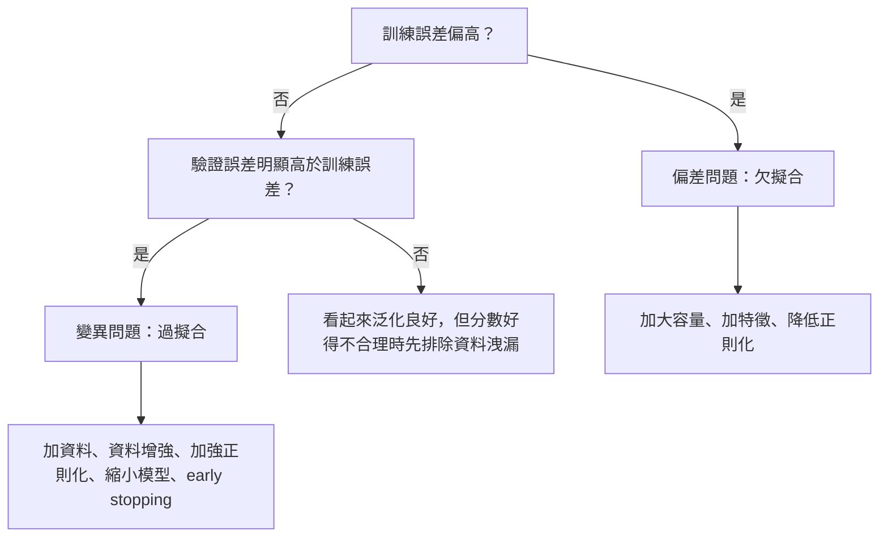
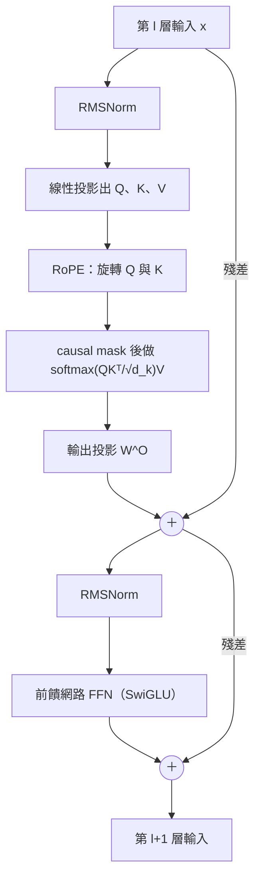
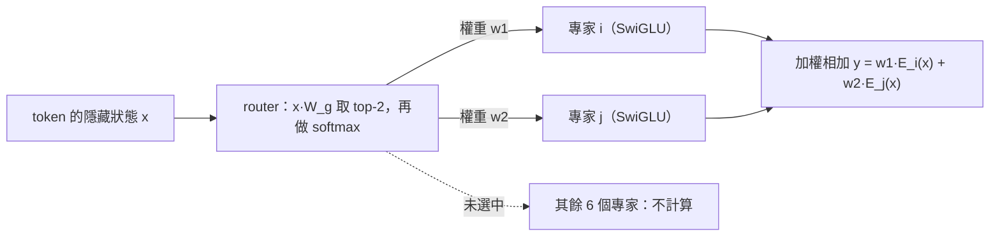

> 🌏 [English version](/en/posts/ai/2026-10-03-ai-interview-ml-transformer-basics-en)

面試問到 [Transformer](https://arxiv.org/abs/1706.03762)，很少是要你重畫一次論文的架構圖，真正拉開差距的是後面那一串追問：為什麼 attention 要除以 √d_k、[RoPE](https://arxiv.org/abs/2104.09864) 怎麼讓內積只剩相對距離、[Adam](https://arxiv.org/abs/1412.6980) 和 [AdamW](https://arxiv.org/abs/1711.05101) 到底差在哪、AUC 很高為什麼還不能上線。這些問題的答案都在機制裡，背結論撐不過第二個「為什麼」。

這篇把 ML 基礎與 Transformer／NLP 的底層概念整理成可以順著講下去的稿。前半是偏差變異、正則化、損失函數、優化器、評估指標、資料洩漏與交叉驗證；後半是 self-attention、位置編碼、正規化層、架構選擇、tokenization、embedding、長上下文與 MoE。每一節照「概念 → 機制或比較 → 面試怎麼答」展開，最後附三題 [numpy](https://numpy.org/) 手寫題，程式都實際執行過。

這是「AI Engineer 面試準備」系列的一篇。想先看整體地圖，可以從[總覽](/posts/ai/2026-08-20-ai-engineer-interview-overview)開始；站上較早的 [ML 基礎](/posts/ai/2026-08-20-ai-engineer-interview-ml-fundamentals)、[深度學習](/posts/ai/2026-08-20-ai-engineer-interview-deep-learning)、[NLP 與 LLM](/posts/ai/2026-08-20-ai-engineer-interview-nlp-llm) 三篇著重考法與直覺，本篇則補上機制與出處。文中的論文數字都對照過原文；標「推算」的是由公式自行算出、再用程式驗算的數字；查不到一手來源的說法會直接註明，不寫成事實。

---

## 第一部分：ML 基礎

### 偏差與變異：U 型曲線只是古典版本

先講概念。固定一個輸入點、用平方損失做回歸時，期望預測誤差可以拆成三塊（[維基百科有完整推導](https://en.wikipedia.org/wiki/Bias%E2%80%93variance_tradeoff)）：

```
Err(x0) = σ² + Bias²(f̂(x0)) + Var(f̂(x0))
        = 不可約雜訊 + 偏差² + 變異數
```

偏差是「模型的期望預測和真實函數差多遠」，來自假設太強，例如拿直線去配彎曲的資料。變異數是「換一份訓練資料，預測會晃多大」，來自模型對樣本細節太敏感。雜訊怎麼調模型都消不掉。

機制上有三個旋鈕：模型容量、正則化強度、資料量。容量變大，偏差下降、變異上升；正則化變強，方向相反；資料變多，主要壓低變異。實務上看訓練誤差與驗證誤差就能診斷，判斷邏輯與 [scikit-learn 對過擬合的定義](https://scikit-learn.org/stable/modules/cross_validation.html)一致：



想看推導與樣本複雜度，可以讀站內的 [CS229 筆記第 8 章：泛化](/posts/ai/2026-08-22-stanford-cs229-2026-notes-chapter-08-generalization)。

U 型曲線不是全貌。[Belkin 等人](https://arxiv.org/abs/1812.11118)指出，現代實務中神經網路常被訓練到剛好擬合（interpolate）訓練資料，古典觀點會稱之為過擬合，卻常在測試資料上維持高準確率；他們用雙下降（double descent）曲線把古典 U 型包含進去：容量越過 interpolation 點之後，測試表現會再度改善。大模型為什麼沒有嚴重過擬合，常聽到「隱性正則化」這個解釋，但機制仍是研究中的議題。

**面試怎麼答**：先給三段式分解和診斷流程，再補一句雙下降，表示知道古典說法的適用邊界，不要把偏差變異講成鐵律。被問「訓練誤差 2%、驗證誤差 15% 怎麼辦」，答變異問題，列出加資料、增強、加強正則化、縮小模型、early stopping。被追問大模型為什麼不崩，答「有研究提出機制，尚無定論」。

### 正則化：L1、L2、dropout 與 early stopping

過擬合是模型把訓練資料的雜訊也背起來；正則化就是在訓練時限制模型的有效容量。四種常見手法用不同方式做這件事，常常一起用。

- **L2（weight decay、ridge）**：在目標函數加 `Ω(w) = ½‖w‖²₂`，把權重往原點拉。依 [Deep Learning Book 第 7 章](https://www.deeplearningbook.org/contents/regularization.html)，這是最常見的權重懲罰。
- **L1**：加 `λ‖w‖₁`，能讓部分權重正好變成 0，所以有稀疏與特徵選擇的效果。直覺是 L1 懲罰的梯度大小固定為 ±λ，小權重會被一路推到 0；L2 的梯度隨權重縮小而變小，只縮小、不歸零。
- **dropout**：[Hinton 等人](https://arxiv.org/abs/1207.0580)的原始描述是每個訓練樣本隨機省略一半的 feature detectors，避免神經元之間複雜的 co-adaptation。[PyTorch 的實作](https://docs.pytorch.org/docs/stable/generated/torch.nn.Dropout.html)在訓練時以機率 p 把元素設為 0，並把輸出乘上 `1/(1-p)`，所以評估時直接當恆等函數，這就是 inverted dropout。
- **early stopping**：驗證損失不再進步就停。在二次近似的簡單情形下，它與 L2 正則化可視為等價（同見該章），代價是需要留出驗證集。

Transformer 本身也用了其中兩種。[原論文](https://arxiv.org/abs/1706.03762)的 base 模型對每個子層輸出（加回殘差之前）以及 embedding 加位置編碼的總和做 dropout，機率是 0.1；另外用了 label smoothing，論文說它會讓 perplexity 變差、卻讓準確率與 BLEU 變好。正則化怎麼和模型選擇搭配，可讀 [CS229 筆記第 9 章](/posts/ai/2026-08-22-stanford-cs229-2026-notes-chapter-09-regularization-model-selection)。

下一節會看到一個高頻陷阱：用 Adam 時，「L2 正則化」和「weight decay」不是同一件事。

**面試怎麼答**：用一句話分類，L2 縮小、L1 稀疏、dropout 隨機遮罩、early stopping 看驗證集。問「L1 為什麼產生稀疏」，答固定大小的梯度會把小權重推到 0。問訓練與推論時 dropout 怎麼處理，答訓練時遮罩並乘 `1/(1-p)`，推論時整個關掉。

### 損失函數：cross-entropy 與 MSE 其實都是最大概似

損失函數把「預測有多錯」變成可微分的數字。依 [Deep Learning Book 第 5 章](https://www.deeplearningbook.org/contents/ml.html)，最常見的成本函數就是負對數概似，最小化它等於最大概似估計。兩個常用損失都落在這個框架裡：

```
MSE            L = (1/m) Σ (ŷ_i − y_i)²      對應 p(y|x) = N(y; ŷ(x), σ²) 的負對數概似
cross-entropy  L = −Σ_k y_k · log p_k        p = softmax(z)，對 logits 的梯度 ∂L/∂z = p − y
```

softmax 搭配 cross-entropy 時，對 logits 的梯度簡單到只剩「預測機率減去 one-hot 標籤」（推算，已用中央差分驗證），錯得越多梯度越大，這是它好訓練的原因之一。

LLM 的預訓練損失就是對下一個 token 的 cross-entropy，perplexity 則是平均 cross-entropy 取指數。數值上，不要先算 softmax 再取 log，要用 log-softmax 或 logsumexp，後面的手寫題 1 會示範原因。

類別不平衡時可以換損失：[Focal loss](https://arxiv.org/abs/1708.02002) 提出於密集物件偵測，降低已分類良好樣本的權重，避免大量容易的負樣本壓過訓練。「分類不用 MSE，因為梯度會飽和」是常見說法，本文沒有對照一手來源，答題時當補充，主論述放在概似意義與 `p − y` 這個梯度上。

**面試怎麼答**：先說兩者都是負對數概似，只是分布假設不同（高斯對 MSE、類別分布對 cross-entropy）。再說 softmax 加 cross-entropy 的梯度是 `p − y`。最後補數值穩定：用 log-softmax。

### 優化器：從 SGD 到 Adam，再到 AdamW

SGD 沿著小批次梯度走，加動量會更穩。[Adam](https://arxiv.org/abs/1412.6980) 為每個參數維護梯度的一階矩（動量）與二階矩（梯度平方的移動平均），用二階矩把步長依參數正規化，所以對學習率不那麼敏感，代價是每個參數多存兩份狀態。公式如下（[AdamW 論文](https://arxiv.org/abs/1711.05101)的 Algorithm 1、2 寫法）：

```
Adam
  g_t = ∇f_t(θ_{t-1})
  m_t = β1·m_{t-1} + (1−β1)·g_t            # 一階矩
  v_t = β2·v_{t-1} + (1−β2)·g_t²           # 二階矩
  m̂_t = m_t/(1−β1^t),  v̂_t = v_t/(1−β2^t)  # 偏差修正
  θ_t = θ_{t-1} − α·m̂_t/(√v̂_t + ε)

AdamW
  θ_t = θ_{t-1} − η_t·( α·m̂_t/(√v̂_t + ε) + λ·θ_{t-1} )   # decay 不進入 m、v
```

偏差修正是因為 m、v 以 0 初始化，前幾步會偏向 0，所以除以 `1−βᵗ` 校正。預設值是 α = 0.001、β₁ = 0.9、β₂ = 0.999。

AdamW 要解決的是這個問題：在標準 SGD 下，weight decay 與 L2 正則化只差一個以學習率換算的係數，但 AdamW 論文的 Proposition 1、2 證明 Adam 這類自適應方法不存在這樣的等價係數。直覺是 Adam＋L2 把 `λθ` 加進梯度，之後被 `1/√v̂` 一起縮放，梯度歷史大的參數被正則化得比較少；AdamW 把 decay 從梯度更新拆出來，所有權重以同樣速率衰減。論文在影像分類實驗報告，以預設學習率比較，AdamW 的測試錯誤率相對 Adam 改善約 15%，論文自己也說需要在更多任務上驗證。

實務設定可以當對照：[LLaMA](https://arxiv.org/abs/2302.13971) 用 AdamW，β₂ 設 0.95 而非預設的 0.999，並搭配 warmup 與 cosine 衰減；為什麼是 0.95，面試時只說「實務上有這個設定」即可。

**面試怎麼答**：先講 Adam 的兩個矩與偏差修正，再講 AdamW 的差異：decay 不進入二階矩的縮放。被問「Adam 一定比 SGD 好嗎」，答不一定，AdamW 論文裡 SGD 加動量在影像分類常勝過 Adam＋L2，補上 decoupled weight decay 後 Adam 才追上。

### 評估指標與不平衡資料

正類很少時，準確率會騙人。1% 正類的資料，模型永遠猜負，準確率 99%，精確率與召回率都是 0（推算）。所以要看這幾個指標，各自回答不同的問題：

| 指標 | 回答的問題 |
|---|---|
| precision | 預測為正的樣本，有多少是真的 |
| recall | 真的正類，抓到多少 |
| F1 | precision 與 recall 的調和平均，即 `2tp / (2tp + fp + fn)` |
| ROC AUC | 隨機抽一個正樣本與一個負樣本，模型把正樣本排在前面的機率 |
| PR 曲線 | 在不同召回率下，預測為正的樣本中真正例的比例 |

F-beta 的一般式是 `(1+β²)tp / ((1+β²)tp + fp + β²fn)`，β 大於 1 偏重召回（見 [scikit-learn 指標說明](https://scikit-learn.org/stable/modules/model_evaluation.html)）。AUC 的機率解讀可看 [Wikipedia 的 ROC 條目](https://en.wikipedia.org/wiki/Receiver_operating_characteristic)。AUC 只衡量排序能力，與決策門檻和機率校準無關。

不平衡資料上，[Saito 與 Rehmsmeier](https://journals.plos.org/plosone/article?id=10.1371/journal.pone.0118432) 指出 ROC 圖的視覺解讀可能具欺騙性，PR 圖看的是預測為正的樣本中真正例的比例，更能反映未來的分類表現。處理不平衡資料的工具箱，由便宜到貴：

1. 先換指標，改看 precision、recall、PR 曲線；切分資料用 stratified，各折保持類別比例。
2. 類別權重（成本敏感學習）與調整決策門檻，都是通用做法，本文沒有逐一對照單一一手來源。
3. 重新取樣：[SMOTE](https://arxiv.org/abs/1106.1813) 對少數類合成新的樣本，並搭配多數類的欠取樣。
4. 換損失，例如前面提過的 focal loss。

不論用哪一招，重新取樣只能在訓練折內做。先取樣再切分，合成樣本會和驗證樣本相鄰，分數虛高，這是下一節的主題。

**面試怎麼答**：從錯誤成本出發，漏掉代價高（疾病篩檢、詐欺）重 recall，誤報代價高（垃圾信誤殺、審核人力）重 precision。被問「AUC 很高就是好模型嗎」，答不一定：AUC 衡量排序，極度不平衡時要看 PR 曲線。SMOTE 要在切分後、只對訓練資料做。

### 資料洩漏：分數太好的時候先懷疑它

依 [scikit-learn 的 Common pitfalls](https://scikit-learn.org/stable/common_pitfalls.html)，洩漏是建模時用了預測時拿不到的資訊，使效能估計過度樂觀，上線後表現較差。最常見的來源是在切分資料前做了標準化、特徵選擇或補值，把測試集的資訊混進訓練。規則很短：永遠先切分，所有 `fit` 只碰訓練資料，測試集不用於任何模型選擇。

scikit-learn 文件有個很好用的示範：200 筆樣本、10,000 個隨機特徵、標籤完全隨機。若先用全部資料做 `SelectKBest` 再切分，測試準確率高達 0.76；先切分、只在訓練資料上選特徵，準確率回到約 0.5，也就是隨機水準。解法是把前處理與模型串進 `Pipeline`，交叉驗證每一折都會重新 fit，這個「隨機標籤 sanity check」也是偵測洩漏的實用方法。

[Kapoor 與 Narayanan](https://arxiv.org/abs/2207.07048) 調查了橫跨多個領域的論文，共 329 篇受洩漏影響，可見它不是新手才會踩的坑。面試常提的子類型有：

- **時間洩漏**：時間序列不能用隨機 shuffle 的 KFold，要用 `TimeSeriesSplit`，以「未來」的觀測當測試。
- **群組洩漏**：同一個人（病患）的多筆樣本分到兩邊，模型可以學到「人」的特徵，用 `GroupKFold`。
- **目標洩漏**：特徵本身含有標籤資訊，例如事後才知道的欄位。這是常見定義，本文未對照單一一手來源。

**面試怎麼答**：定義一句話，再給 `Pipeline` 與隨機標籤兩個具體做法。被問「標準化要在交叉驗證之內還是之外」，答之內，用 Pipeline，否則驗證折的平均與變異會漏進訓練。被問推薦系統與時間序列怎麼切，答按時間切，訓練在前、測試在後。

### 交叉驗證：k 折輪流當驗證集

在同一份資料上學參數又測試，是方法論錯誤；反覆調超參數也會讓測試集的資訊慢慢漏進模型。所以要留出測試集，只在最後用一次。調參另切驗證集又會讓訓練資料變少、結果看運氣，[交叉驗證](https://scikit-learn.org/stable/modules/cross_validation.html)的做法是把訓練集切成 k 折，輪流拿 k−1 折訓練、剩下一折驗證，報告 k 次的平均。樣本少時特別划算，代價是計算量。

切法要配合資料的性質：

- `StratifiedKFold`：每折的類別比例約等於整體，分類器的 `cross_val_score` 預設就用它。
- `GroupKFold`：同一組不會同時出現在訓練與測試。
- `TimeSeriesSplit`：前面的折訓練、後面一折測試，訓練集依序是前一個的超集。

兩個容易忽略的細節：資料若按類別排序要先 shuffle，但資料不是 i.i.d.（例如按時間排序的新聞）時，shuffle 反而造成分數虛高；比較模型時，CV 的切分要固定（給 splitter 整數的 `random_state`）。

超參數搜尋時又拿同一份 CV 分數挑最佳，那個分數會偏樂觀；常被提到的處理方式是巢狀交叉驗證（nested CV），本文沒有查證其細節，只在此點名。

**面試怎麼答**：先答 CV 之後仍需要測試集，因為 CV 用來選模型與超參數，最終泛化估計要在沒碰過的資料上做一次。再依資料性質選切法：分類用 stratified、時間序列用時間切、同一個體用 group。

---

## 第二部分：Transformer 與 NLP

### Self-attention 與一個 Transformer block

[Transformer](https://arxiv.org/abs/1706.03762) 完全不用遞迴與卷積，讓序列中任兩個位置直接互動。self-attention 的 Q、K、V 都由同一層的輸入線性投影而來，核心是論文的式 1：

```
Attention(Q, K, V) = softmax(Q·Kᵀ / √d_k) · V
```

為什麼除以 √d_k？假設 q、k 各分量獨立、平均 0、變異數 1，則內積 `q·k` 的平均是 0、變異數是 d_k。d_k 大時內積量級跟著變大，softmax 被推進梯度極小的區域，除以 √d_k 讓變異數回到 1。要注意，論文用的是「We suspect」，也就是作者的推測，並指出 d_k 小時有沒有縮放表現相近。手寫題 2 會實際跑出這件事：d_k = 512 時，未縮放的 softmax 最大權重接近 1.0，幾乎是 one-hot。

decoder 的 self-attention 還需要 causal mask：在 softmax 之前，把未來位置的分數設成 −∞，防止資訊從未來流向過去。要在 softmax 之前遮，是因為之後再乘 0，權重就不會重新正規化。

multi-head 是把 Q、K、V 投影到 h 個較低維的子空間分別做 attention，再串接起來：

```
MultiHead(Q,K,V) = Concat(head_1, …, head_h) · W^O
head_i = Attention(Q·W_i^Q, K·W_i^K, V·W_i^V)
```

原論文 base 模型的 d_model 是 512、分成 8 個頭，每個頭的 d_k 是 64，所以總計算量與單頭全維度相近。頭數不是越多越好：論文 Table 3(A) 顯示，固定計算量下，單頭比最佳設定差 0.9 BLEU，頭太多品質也會下降。

把這些零件放在一起，現在常見的 decoder-only 模型（以 LLaMA 風格為例）的一層長這樣：



圖中的正規化放在子層輸入（Pre-LN），位置編碼只作用在 Q、K，這兩點分別在後面兩節展開。更口語的入門可以讀站內的 [Transformer 與 Attention](/posts/ai/2026-08-26-understanding-ai-models-transformer) 與 [CS224N 第 5 講](/posts/ai/2026-08-22-cs224n-transformers)；架構選擇的預設值整理在 [CS336 Lecture 3](/posts/ai/2026-08-22-cs336-architectures-hyperparameters)。

**面試怎麼答**：寫得出 `softmax(QKᵀ/√d_k)V`，用「變異數會長到 d_k」解釋縮放，並說這是原作者的推測。causal mask 要說清楚是 softmax 之前設 −∞。被問「Q、K、V 為什麼要分開投影」，常見說法是讓三者用不同子空間表示，但論文沒有專門論證，當直覺說明，不要說成論文結論。

### 位置編碼：sinusoidal 與 RoPE

attention 本身不知道順序，所以要注入位置資訊。原論文用固定的 sin／cos 加到 embedding 上：

```
PE(pos, 2i)   = sin(pos / 10000^(2i/d_model))
PE(pos, 2i+1) = cos(pos / 10000^(2i/d_model))
```

作者的理由是，對固定偏移 k，`PE(pos+k)` 是 `PE(pos)` 的線性函數，也許讓模型容易以相對位置做 attention。論文同時試了學習式位置嵌入，結果幾乎相同（dev BLEU 25.7 對 25.8）。

[RoPE（RoFormer）](https://arxiv.org/abs/2104.09864) 換了思路：不是把位置「加」到表示上，而是用旋轉矩陣「轉」Q 和 K。目標是找函數 f，使內積只依賴相對位置：

```
⟨f_q(x_m, m), f_k(x_n, n)⟩ = g(x_m, x_n, m − n)
f(x_m, m) = R_{Θ,m} · W · x_m          # R 由 d/2 個 2×2 旋轉塊組成
q_mᵀ k_n = x_mᵀ W_qᵀ · R_{Θ,n−m} · W_k x_n    # 因為 R_mᵀ R_n = R_{n−m}
```

好記的性質：R 是正交矩陣，旋轉不改變向量長度；內積隨相對距離增加有長程衰減；只作用在 Q、K，V 不旋轉，因為位置只需要影響注意力分數；沒有額外參數。LLaMA 移除了絕對位置嵌入，在每一層加上 RoPE。

RoPE 超出訓練長度仍會退化。[Position Interpolation](https://arxiv.org/abs/2306.15595) 的做法是把輸入位置索引線性縮小到原始視窗大小，而不是外推，因為外推可能造成災難性的高注意力分數；論文用它把 LLaMA 的視窗擴到最多 32768，只需微調約一千步以內。

**面試怎麼答**：答 RoPE 的關鍵是旋轉矩陣滿足 `R_mᵀ R_n = R_{n−m}`，所以內積只剩相對位移。「怎麼把 4K 的模型擴到 32K」，答位置內插加短時間微調。其他延伸方法本文沒有查證，不展開。

### LayerNorm、RMSNorm 與 Pre-LN

[LayerNorm](https://arxiv.org/abs/1607.06450) 對單一樣本、同一層的所有神經元算平均與標準差來正規化，不依賴批次大小，訓練與測試做一樣的計算，所以適合變長序列，這點和 BatchNorm 不同。[RMSNorm](https://arxiv.org/abs/1910.07467) 的主張是「減平均」不是成功關鍵，只保留縮放：

```
LayerNorm:  ā_i = (a_i − μ) / σ · g_i,     μ = mean(a),  σ = sqrt(mean((a − μ)²))
RMSNorm:    ā_i = a_i / RMS(a) · g_i,      RMS(a) = sqrt(mean(a²))
```

輸入平均為 0 時兩者完全相同。論文假設縮放不變性才是 LayerNorm 成功的原因，實驗顯示效果相當，執行時間減少 7% 到 64%（依模型而異）。RMSNorm 少了減平均，失去平移不變性，換來更少運算。實作上通常會加小 ε 避免除以 0，這是慣例，不在論文的式子裡。

正規化放在哪裡也是高頻題。原 Transformer 是 `LayerNorm(x + Sublayer(x))`，稱為 Post-LN。[Xiong 等人](https://arxiv.org/abs/2002.04745)用平均場理論證明，Post-LN 在初始化時靠近輸出層的參數期望梯度很大，用大學習率會不穩，所以需要 warmup；Pre-LN 把 LN 放進殘差區塊內，初始化時梯度表現良好，可以拿掉 warmup，以較少的訓練時間與調參達到相近結果。LLaMA 的選擇是兩者合用：依論文說法，為了提升訓練穩定性，對每個子層的輸入做正規化而非輸出，並使用 RMSNorm。

**面試怎麼答**：LayerNorm 與 BatchNorm 的差別是統計量跨誰算；RMSNorm 少了減平均，換來更少運算；Pre-LN 與 Post-LN 答梯度與 warmup。Pre-LN 的缺點，本文沒有對照一手來源，不宜斷言。

### Decoder-only 與 encoder-decoder

原始 Transformer 是 encoder-decoder，為翻譯這類「輸入序列轉輸出序列」設計：encoder 雙向讀完輸入，decoder 一邊生成、一邊用 cross-attention 回頭看 encoder 的輸出，並用遮罩防止看到未來。[BERT](https://arxiv.org/abs/1810.04805) 只用 encoder，設計成同時用左右兩側上下文預訓練深層雙向表示，再微調到理解類任務。GPT、LLaMA 這類則只用 decoder，用因果遮罩做自迴歸生成。

為什麼現在的大型語言模型幾乎都是 decoder-only？[Wang 等人](https://arxiv.org/abs/2204.05832)以超過 50 億參數的模型做過大規模比較。他們比的是 causal 與 non-causal 的 decoder-only 以及 encoder-decoder，並搭配自迴歸與 masked language model 兩種預訓練目標。結論有兩半：純無監督預訓練後，causal decoder-only 加自迴歸目標的零樣本泛化最強；但輸入端雙向的模型，用 masked LM 預訓練再加多任務微調，是實驗中表現最好的。所以不能簡化成「encoder-decoder 比較差」。

**面試怎麼答**：先講三種架構各自適合什麼。再引用 Wang 等人的兩半結論，避免一面倒，更不要說成「encoder-decoder 比較差」。

### Tokenization：BPE、WordPiece、SentencePiece 與中文成本

模型不直接吃字串。字級詞表太大且有未知詞，字元級序列太長，所以用子詞（subword）：常見詞保留整詞，罕見詞拆成較小片段。

[BPE](https://arxiv.org/abs/1508.07909)（Sennrich 等人）原本是資料壓縮技術，翻譯版改成合併字元序列：以「字元加詞尾符號」初始化詞表，反覆統計所有相鄰符號對，把最常見的一對換成新符號。最終詞表大小等於初始詞表加合併次數，合併次數是唯一的超參數。手寫題 3 就是這個迴圈的一步。

[WordPiece](https://arxiv.org/abs/1609.08144)（GNMT）以資料驅動方式最大化訓練資料的語言模型概似；BERT 使用的是 WordPiece。[SentencePiece](https://arxiv.org/abs/1808.06226) 則是語言無關的切分工具，直接從原始句子訓練，不需預先斷詞，連空白也當成一般符號，實作了 BPE 與 unigram 兩種演算法，對中日文友善。LLaMA 的 tokenizer 是用 SentencePiece 實作的 BPE，遇到未知 UTF-8 字元會退回位元組（byte fallback）。BPE 與 WordPiece 的差別，一句話講是前者合併最常相鄰的一對、後者看語言模型概似；WordPiece 的合併計分公式本文沒有逐字核對，不展開。

中文的成本問題來自兩層。第一層是位元組：UTF-8 的中日韓字元佔 3 bytes，詞表覆蓋不好時，byte-level 或 byte fallback 的 tokenizer 在最壞情況會把一個罕見字拆成多個 token。第二層是跨語言的不公平：[Petrov 等人](https://arxiv.org/abs/2305.15425)發現，同一段文字翻成不同語言，tokenization 長度可以差到 15 倍，即使是刻意訓練成支援多語言的 tokenizer 也一樣；[Ahia 等人](https://arxiv.org/abs/2305.13707)則指出 API 依 token 數計費，許多語言的使用者因此被多收費，成果卻較差。

中文相對英文的實際 token 倍率，本文沒有可靠的一手數字，所以不寫。穩妥的做法是用供應商的 token 計數工具或官方 tokenizer 實測自己的資料，不用字數估算成本。不同模型家族的 token 數不能互相換算，RAG 的 chunk 大小也要用該模型的 tokenizer 來量。站內的 [Tokenization：BPE 演算法，以及為什麼中文比英文貴](/posts/ai/2026-08-26-understanding-ai-models-tokenization)、[CS224N 第 14 講](/posts/ai/2026-08-22-cs224n-tokenization-multilinguality)與 [CS336 Lecture 1](/posts/ai/2026-08-22-cs336-overview-tokenization) 都有進一步的討論。

**面試怎麼答**：先講為什麼用子詞，再講 BPE 的迴圈與「合併次數決定詞表大小」。中文成本講兩層（位元組、跨語言差距），最後落到「實測自己的資料」。

### Embedding 與相似度：cosine 與內積

Embedding 把文字映射成向量，語意相近的向量距離近。cosine 相似度是兩向量夾角的餘弦，等於先正規化成單位長度再做內積，只看方向；內積同時受方向與長度影響。兩向量已正規化成單位長度時，兩者結果完全一樣，而且單位向量時 `‖a−b‖² = 2 − 2cos(a,b)`，所以 cosine 排序與歐氏距離排序一致。

```
cos(a, b) = a·b / (‖a‖·‖b‖)
```

[OpenAI 的 embeddings 文件](https://platform.openai.com/docs/guides/embeddings)建議使用 cosine 相似度，並說距離函數的選擇通常影響不大；其 embeddings 已正規化為長度 1，所以 cosine 只用內積就能算，略快。

不過 cosine 不是萬靈丹。[Steck 等人](https://arxiv.org/abs/2403.05440)在正則化線性模型上解析推導，顯示 cosine 相似度可能產生「任意、因此沒有意義」的相似度，提醒不要盲目使用。實務上，向量資料庫的距離度量要與 embedding 模型的訓練設定一致，以模型文件為準（通用工程做法，未對照單一一手來源）。

容易混淆的是 attention 用縮放後的內積 `QKᵀ/√d_k`，不是 cosine。embedding 怎麼訓練出來，可讀站內的 [Embedding：模型怎麼把文字變成可以計算的向量](/posts/ai/2026-08-26-understanding-ai-models-embedding)。

**面試怎麼答**：cosine 與內積在向量都正規化時相同，是最安全的第一句。再補 Steck 等人的警告，表示知道 cosine 並非永遠有意義。最後說度量要跟 embedding 模型的訓練設定對齊。

### 為什麼 attention 是 O(n²)，長上下文怎麼做

`QKᵀ` 要算序列中每一對位置的分數，產生 n×n 的矩陣，所以計算與（完整存下來時的）記憶體都是 n 的平方。原論文的 Table 1 把它和其他層類型並排：

| 層類型 | 每層複雜度 | 循序運算數 | 最大路徑長度 |
|---|---|---|---|
| Self-Attention | O(n²·d) | O(1) | O(1) |
| Recurrent | O(n·d²) | O(n) | O(n) |
| Convolutional | O(k·n·d²) | O(1) | O(log_k n) |
| Self-Attention（受限，鄰域 r） | O(r·n·d) | O(1) | O(n/r) |

優點是任意兩位置直接相連、可平行；代價是 n 大時成本爆增。以 fp16、單頭單層估算，n = 32,768 時，光是分數矩陣就是 2 GiB（推算）。長上下文的做法可以分成四類。

**第一類，改硬體實作。**[FlashAttention](https://arxiv.org/abs/2205.14135) 是 IO-aware 的精確注意力，用 tiling 減少 GPU 高頻寬記憶體與晶片上 SRAM 之間的讀寫，不是近似法；BERT-large（序列 512）端到端訓練快 15%。因為是精確注意力，運算量仍與 n² 同階，省下的主要是記憶體讀寫（這句由「exact」推論）。

**第二類，改 attention 的範圍。**[Longformer](https://arxiv.org/abs/2004.05150) 用固定視窗，每個 token 只看周圍 w 個 token，複雜度 O(n×w)。[Mistral 7B](https://arxiv.org/abs/2310.06825) 的視窗是 4096，堆疊後理論上最後一層的注意力範圍約 131K tokens；它的 rolling buffer cache 把 KV cache 固定在視窗大小，序列 32k 時快取記憶體少 8 倍。[Sparse Transformers](https://arxiv.org/abs/1904.10509) 用稀疏分解把成本降到 O(n√n)。取捨是視窗外的資訊只能透過多層間接傳遞，理論感受野不等於實際有效利用的上下文。

**第三類，縮小 KV cache。**自迴歸解碼時，瓶頸是反覆載入大的 K、V 張量的記憶體頻寬。[MQA](https://arxiv.org/abs/1911.02150) 讓所有頭共用一組 K 和 V，論文結論是品質只有輕微下降。[GQA](https://arxiv.org/abs/2305.13245) 把 query 頭分成 G 組、每組共用一個 K 頭與 V 頭：GQA-1 就是 MQA，組數等於頭數就是 MHA；從 multi-head checkpoint 轉換時，對組內原始頭的 K、V 投影做平均池化，再用約 5% 的預訓練運算量繼續訓練。論文的結論是品質接近 MHA、速度接近 MQA。Mistral 7B 與 [Mixtral](https://arxiv.org/abs/2401.04088) 都是 32 個 query 頭搭配 8 個 KV 頭。

KV cache 的大小可以自己算，這是很適合在面試白板上推的一題：

```
bytes/token = 2 × layers × n_kv_heads × head_dim × bytes_per_element
```

以 Mistral 7B 的設定（32 層、head_dim 128、fp16）代入：若是完整 MHA（32 個 KV 頭）每 token 是 512 KiB，GQA-8 是 128 KiB，MQA 是 16 KiB（推算）。序列 32K 時，MHA 約 16 GiB，GQA-8 約 4 GiB。

**第四類，位置內插。**前面提過的 Position Interpolation，能把 RoPE 模型的視窗擴到 32768。課程裡的講法可讀 [CS336 Lecture 4：Attention 與 MoE](/posts/ai/2026-08-22-cs336-attention-moe)。

**面試怎麼答**：O(n²) 要同時說時間與記憶體，並補一句 FlashAttention 不改變精確計算的運算量階數，省的是記憶體讀寫。長上下文講四類（硬體、範圍、KV cache、位置），再用 KV cache 公式算一次數字。被問「KV cache 為什麼是瓶頸」，答每生成一個 token 都要讀整段 K、V，解碼受記憶體頻寬限制。

### MoE：容量大、每個 token 只算一小部分

MoE（Mixture of Experts）把每層的前饋網路換成很多個「專家」，加一個小的 router，每個 token 只送進其中少數幾個。[Shazeer 等人](https://arxiv.org/abs/1701.06538)提出的 sparsely-gated MoE 是條件式運算的早期大規模實作：由可訓練的 gating network 對每個樣本決定稀疏的專家組合。[Switch Transformer](https://arxiv.org/abs/2101.03961) 把路由簡化成 k = 1，並加輔助的負載平衡損失，避免專家被用得不均；它的摘要直言 MoE 普及的障礙是複雜度、通訊成本與訓練不穩定。

最常被當範例的是 [Mixtral 8x7B](https://arxiv.org/abs/2401.04088)：架構與 Mistral 7B 相同，只是每層換成 8 個前饋區塊，router 為每個 token 選 2 個專家並合併輸出。每個 token 能存取 47B 參數，推論時只用 13B 個活躍參數。



```
G(x) = Softmax(TopK(x·W_g))       # TopK：非前 K 名的 logits 設為 −∞
y = Σ_i Softmax(Top2(x·W_g))_i · SwiGLU_i(x)
```

兩個常見陷阱。第一，專家不是「數學專家」「程式專家」：Mixtral 論文的路由分析顯示，專家的選擇似乎更貼近語法而非領域，特別在最初與最後的層。第二，MoE 省運算量，不省記憶體：任何 token 都可能被路由到任一專家，所以 47B 參數都得載入（這是由「每個 token 可存取 47B」推論，部署細節如專家平行與卸載策略未查證）。總參數不是 8×7B，是因為論文只把每層的前饋區塊換成專家，由此可推其餘部分共用（摘要沒有逐字解釋）。更完整的來龍去脈可讀站內的 [MoE 為什麼贏](/posts/ai/2026-08-26-moe-architecture-why-it-wins)。

**面試怎麼答**：先說「容量大、單 token 計算量不變」，再用 Mixtral 的 top-2 路由舉例，並說清楚活躍參數與總參數的差別。缺點答三件事：記憶體照吃、負載不均、訓練不穩。專家的專長要說「更貼近語法而非領域」，不要說成領域專家。

---

## 手寫題：softmax、attention、BPE 一步合併

三題都在 Python 3.11、numpy 2.4.6 下實際執行過，內建 assert 全部通過。題 2 會 import 題 1 的函式，請先把題 1 存成 `softmax_stable.py`。

### 題 1：數值穩定的 softmax

答題重點：softmax 對輸入加常數不變，所以先減最大值，讓 exp 的輸入都 ≤ 0。naive 版的 `exp(1000)` 會溢位成 inf，inf/inf 得到 nan。順手給 log-softmax 與 cross-entropy。整列都是 −inf 時這版會得到 nan；causal mask 每列至少有對角線，所以安全。

```python
import numpy as np


def softmax_naive(x):
    e = np.exp(x)
    return e / e.sum(axis=-1, keepdims=True)


def softmax(x, axis=-1):
    """穩定版 softmax：先減最大值再 exp。
    softmax 對輸入平移不變，所以結果與 naive 版相同；
    但 exp 的輸入永遠 <= 0，不會溢位，分母也至少有一項是 1。"""
    x = np.asarray(x, dtype=np.float64)
    z = x - np.max(x, axis=axis, keepdims=True)
    e = np.exp(z)
    return e / np.sum(e, axis=axis, keepdims=True)


def logsumexp(x, axis=-1):
    x = np.asarray(x, dtype=np.float64)
    m = np.max(x, axis=axis, keepdims=True)
    return (m + np.log(np.sum(np.exp(x - m), axis=axis, keepdims=True))).squeeze(axis)


def log_softmax(x, axis=-1):
    x = np.asarray(x, dtype=np.float64)
    return x - np.expand_dims(logsumexp(x, axis=axis), axis)


def cross_entropy_from_logits(logits, target_idx):
    """-log softmax(logits)[target]，全程不產生可能變成 0 的機率。"""
    return -log_softmax(logits)[np.arange(len(target_idx)), target_idx]


if __name__ == "__main__":
    np.set_printoptions(precision=6, suppress=True)
    big = np.array([1000.0, 1001.0, 1002.0])
    small = np.array([0.0, 1.0, 2.0])
    with np.errstate(all="ignore"):
        print("naive  softmax([1000,1001,1002]) =", softmax_naive(big))
    print("stable softmax([1000,1001,1002]) =", softmax(big))
    print("stable softmax([0,1,2])          =", softmax(small))
    assert np.allclose(softmax(small), softmax(big))           # 平移不變
    ref = np.exp([0, 1, 2]) / np.exp([0, 1, 2]).sum()
    assert np.allclose(softmax(small), ref)                    # 與定義式一致
    P = softmax(np.random.default_rng(0).normal(size=(4, 7)) * 50)
    assert np.allclose(P.sum(-1), 1.0) and (P >= 0).all()      # 每列和為 1
    neg = np.array([-1000.0, -1001.0, -1002.0])
    assert np.allclose(softmax(neg), softmax(np.array([0.0, -1.0, -2.0])))
    l = np.array([[0.0, 800.0]])
    with np.errstate(all="ignore"):
        print("log(softmax):", np.log(softmax(l)), "| log_softmax:", log_softmax(l))
    assert np.isclose(log_softmax(l)[0, 0], -800.0)            # log_softmax 仍然有限
    ce = cross_entropy_from_logits(np.zeros((3, 10)), np.array([0, 3, 9]))
    assert np.allclose(ce, np.log(10))                         # 均勻分布的 CE = ln(類別數)
    print("cross_entropy(uniform, V=10) =", ce)
    print("ALL SOFTMAX CHECKS PASSED")
```

執行輸出：

```
naive  softmax([1000,1001,1002]) = [nan nan nan]
stable softmax([1000,1001,1002]) = [0.090031 0.244728 0.665241]
stable softmax([0,1,2])          = [0.090031 0.244728 0.665241]
log(softmax): [[-inf   0.]] | log_softmax: [[-800.    0.]]
cross_entropy(uniform, V=10) = [2.302585 2.302585 2.302585]
ALL SOFTMAX CHECKS PASSED
```

複雜度：對長度 n 的一列，時間 O(n)（找最大值、exp、加總，各一趟），額外空間 O(n)。log_softmax 同樣是 O(n)，而且 `log(softmax)` 在 800 這種輸入會得到 −inf，log_softmax 則保持有限。

### 題 2：scaled dot-product attention（含 causal mask）

答題重點：`softmax(QKᵀ/√d_k)V`；causal mask 在 softmax 之前把未來位置設為 −∞，用 `np.tril` 產生下三角；支援前面多餘的 batch、head 維度。驗證項目要主動講出來：上三角權重恰為 0、第 0 個 token 的輸出恰等於 `V[0]`、改動未來的 K/V 不影響較早位置。程式後半把「為什麼要除以 √d_k」也跑了一遍。

```python
import numpy as np
from softmax_stable import softmax   # 先存好上一題的 softmax_stable.py


def scaled_dot_product_attention(Q, K, V, causal=False):
    """Attention(Q,K,V) = softmax(Q K^T / sqrt(d_k)) V
    Q: (..., n_q, d_k)  K: (..., n_k, d_k)  V: (..., n_k, d_v)
    causal=True：位置 i 只能看 <= i 的位置（softmax 之前把未來位置設為 -inf）。"""
    d_k = Q.shape[-1]
    scores = Q @ np.swapaxes(K, -1, -2) / np.sqrt(d_k)
    if causal:
        n_q, n_k = scores.shape[-2], scores.shape[-1]
        mask = np.tril(np.ones((n_q, n_k), dtype=bool))   # 下三角（含對角線）可見
        scores = np.where(mask, scores, -np.inf)          # exp(-inf)=0，且會重新正規化
    weights = softmax(scores, axis=-1)
    return weights @ V, weights


def reference_loop(Q, K, V, causal):
    """慢但一眼看得出對的逐列實作，只用來對拍。"""
    n, d_k = Q.shape
    out = np.zeros((n, V.shape[-1]))
    for i in range(n):
        js = range(i + 1) if causal else range(K.shape[0])
        s = np.array([Q[i] @ K[j] / np.sqrt(d_k) for j in js])
        w = np.exp(s - s.max())
        w /= w.sum()
        out[i] = sum(w[t] * V[j] for t, j in enumerate(js))
    return out


if __name__ == "__main__":
    np.set_printoptions(precision=4, suppress=True)
    rng = np.random.default_rng(42)
    n, d_k, d_v = 5, 8, 4
    Q, K, V = rng.normal(size=(n, d_k)), rng.normal(size=(n, d_k)), rng.normal(size=(n, d_v))

    out, w = scaled_dot_product_attention(Q, K, V)
    out_c, w_c = scaled_dot_product_attention(Q, K, V, causal=True)
    print("causal attention weights (rows = query position):\n", w_c)

    assert out.shape == (n, d_v) and w.shape == (n, n)
    assert np.allclose(w.sum(-1), 1) and np.allclose(w_c.sum(-1), 1)
    assert np.all(np.triu(w_c, k=1) == 0.0)            # 上三角恰為 0：看不到未來
    assert np.allclose(out_c[0], V[0])                 # 第 0 個 token 只看得到自己
    assert np.allclose(out, reference_loop(Q, K, V, False))
    assert np.allclose(out_c, reference_loop(Q, K, V, True))
    K2, V2 = K.copy(), V.copy()                        # 改動「未來」的 K/V，較早位置的輸出不變
    K2[3:], V2[3:] = rng.normal(size=K2[3:].shape), rng.normal(size=V2[3:].shape)
    out_c2, _ = scaled_dot_product_attention(Q, K2, V2, causal=True)
    assert np.allclose(out_c[:3], out_c2[:3]) and not np.allclose(out_c[3:], out_c2[3:])
    Qb, Kb, Vb = (rng.normal(size=(2, 3, n, d)) for d in (d_k, d_k, d_v))   # (batch, head, n, d)
    ob, _ = scaled_dot_product_attention(Qb, Kb, Vb, causal=True)
    assert np.allclose(ob[1, 2], reference_loop(Qb[1, 2], Kb[1, 2], Vb[1, 2], True))
    big, _ = scaled_dot_product_attention(Q * 1e3, K * 1e3, V, causal=True)
    assert np.isfinite(big).all()                      # 分數很大也不溢位

    print("\nVar(q.k) vs d_k (100k samples each):")     # 為什麼要除以 sqrt(d_k)
    for d in (4, 64, 512):
        q, k = rng.normal(size=(100_000, d)), rng.normal(size=(100_000, d))
        dots = (q * k).sum(-1)
        print(f"  d_k={d:4d}  Var(q.k)={dots.var():8.2f}   scaled={(dots / np.sqrt(d)).var():5.2f}")
    q, keys = rng.normal(size=512), rng.normal(size=(10, 512))
    p_raw, p_scaled = softmax(keys @ q), softmax(keys @ q / np.sqrt(512))
    print(f"\nd_k=512, 10 keys: max weight unscaled={p_raw.max():.4f}  scaled={p_scaled.max():.4f}")
    assert p_raw.max() > p_scaled.max()
    print("ALL ATTENTION CHECKS PASSED")
```

執行輸出：

```
causal attention weights (rows = query position):
 [[1.     0.     0.     0.     0.    ]
 [0.416  0.584  0.     0.     0.    ]
 [0.3706 0.4271 0.2022 0.     0.    ]
 [0.4825 0.1955 0.2078 0.1142 0.    ]
 [0.1162 0.295  0.2311 0.1325 0.2253]]

Var(q.k) vs d_k (100k samples each):
  d_k=   4  Var(q.k)=    4.03   scaled= 1.01
  d_k=  64  Var(q.k)=   63.13   scaled= 0.99
  d_k= 512  Var(q.k)=  509.65   scaled= 1.00

d_k=512, 10 keys: max weight unscaled=1.0000  scaled=0.3235
ALL ATTENTION CHECKS PASSED
```

複雜度：設查詢長度 n_q、鍵長度 n_k。計算 `QKᵀ` 是 O(n_q·n_k·d_k)，權重乘 V 是 O(n_q·n_k·d_v)；把權重矩陣存下來，記憶體是 O(n_q·n_k)，這就是 O(n²) 的來源。

### 題 3：簡化版 BPE 訓練的一步合併

答題重點：每個詞表示成「字元序列加詞尾符號 `</w>`」並記錄詞頻，統計相鄰符號對的加權次數，選最常見的一對，由左到右、不重疊地合併。範例用的是 [Sennrich 等人](https://arxiv.org/abs/1508.07909)程式範例中的玩具詞表。這份資料第一步的 `(e,s)`、`(s,t)`、`(t,</w>)` 三對都是 9 次，平手，所以面試時要主動說明平手規則（這裡用字典序）會影響結果。

```python
import collections

EOW = "</w>"   # 詞尾符號


def build_vocab(word_freqs):
    """{'low': 5} -> {('l','o','w','</w>'): 5}"""
    return {tuple(w) + (EOW,): f for w, f in word_freqs.items()}


def get_stats(vocab):
    """統計所有相鄰符號對的加權出現次數。"""
    pairs = collections.Counter()
    for symbols, freq in vocab.items():
        for a, b in zip(symbols, symbols[1:]):
            pairs[(a, b)] += freq
    return pairs


def merge_vocab(pair, vocab):
    """把每個詞裡出現的 pair 由左到右、不重疊地換成合併後的符號。"""
    a, b = pair
    out = {}
    for symbols, freq in vocab.items():
        new, i = [], 0
        while i < len(symbols):
            if i < len(symbols) - 1 and symbols[i] == a and symbols[i + 1] == b:
                new.append(a + b)
                i += 2
            else:
                new.append(symbols[i])
                i += 1
        out[tuple(new)] = out.get(tuple(new), 0) + freq
    return out


def bpe_merge_step(vocab):
    """一步 BPE：選最常見的相鄰對並合併。平手時取字典序最小，讓結果可重現。"""
    pairs = get_stats(vocab)
    if not pairs:
        return None, vocab
    best = min(pairs, key=lambda p: (-pairs[p], p))
    return best, merge_vocab(best, vocab)


if __name__ == "__main__":
    words = {"low": 5, "lower": 2, "newest": 6, "widest": 3}   # Sennrich et al. 程式範例的玩具詞表
    vocab = build_vocab(words)
    stats = get_stats(vocab)
    print("top pairs:", stats.most_common(4))
    best, vocab1 = bpe_merge_step(vocab)
    print("step 1 merge:", best, "->", "".join(best))
    for k, v in vocab1.items():
        print("  ", " ".join(k), v)

    assert stats[("e", "s")] == stats[("s", "t")] == stats[("t", EOW)] == 9   # 三者平手
    assert best == ("e", "s")                                               # 字典序決勝
    assert vocab1[("n", "e", "w", "es", "t", EOW)] == 6
    assert vocab1[("w", "i", "d", "es", "t", EOW)] == 3
    assert vocab1[("l", "o", "w", EOW)] == 5                                # 沒出現 (e,s) 的詞不變
    assert sum(vocab.values()) == sum(vocab1.values())                      # 詞頻總量不變
    assert merge_vocab(("a", "a"), {("a", "a", "a"): 1}) == {("aa", "a"): 1}  # 重疊情況：左到右

    v = build_vocab(words)
    print("\nfirst 6 merges:")
    for i in range(6):
        b, v = bpe_merge_step(v)
        print(f"  {i + 1}: {b[0]!r} + {b[1]!r} -> {''.join(b)!r}")
    print("ALL BPE CHECKS PASSED")
```

執行輸出：

```
top pairs: [(('e', 's'), 9), (('s', 't'), 9), (('t', '</w>'), 9), (('w', 'e'), 8)]
step 1 merge: ('e', 's') -> es
   l o w </w> 5
   l o w e r </w> 2
   n e w es t </w> 6
   w i d es t </w> 3

first 6 merges:
  1: 'e' + 's' -> 'es'
  2: 'es' + 't' -> 'est'
  3: 'est' + '</w>' -> 'est</w>'
  4: 'l' + 'o' -> 'lo'
  5: 'lo' + 'w' -> 'low'
  6: 'e' + 'w' -> 'ew'
ALL BPE CHECKS PASSED
```

複雜度：設不重複詞型的符號總數為 L。`get_stats` 與 `merge_vocab` 各掃一遍，一步是 O(L)；訓練 M 次合併，樸素做法是 O(M·L)。

---

## 整體來說

這些主題反覆回到三個問題：這個設計在限制什麼、這個數字為什麼這樣取、評估或成本有沒有被誤導（洩漏、AUC、token 數、活躍參數）。

今晚就能做的三件事：

1. 不看筆記默寫題 1 的 softmax，並說出為什麼先減最大值。
2. 用 scikit-learn 重做一次隨機標籤的洩漏示範，把 `Pipeline` 版與洩漏版的準確率並排看。
3. 拿自己熟悉的模型設定，用 KV cache 公式算出每 token 與 32K 序列的大小。

## 題庫裡常見的題目

以下是從 7 個公開題庫（各題庫的比較見[系列第 11 篇](/posts/ai/2026-09-30-ai-engineer-interview-resources)）整理出來、在不同題庫重複出現的題目。「獨立來源數」只代表題庫之間的重疊，不代表真實面試的頻率；amitshekhar 與 pallavi 兩個題庫沒有來源，其公司標籤本文不採用。表中只列題目與出處連結，沒有轉載答案。

| 題目 | 獨立來源數 | 題庫連結 | 本文對應段落 |
|---|---|---|---|
| 為什麼 Transformer 需要位置編碼？RoPE 如何運作、為何比學習式位置嵌入更受青睞？ | 5 | [om](https://github.com/ombharatiya/AI-Engineer-Interview-Questions/blob/main/02-llm-fundamentals/questions.md#27-explain-rope-whats-the-rotation-intuition-and-why-did-it-become-the-default)、[aeg](https://github.com/alexeygrigorev/ai-engineering-field-guide/blob/main/interview/questions/questions.md?plain=1#L35)、[AIML](https://github.com/alirezadir/AIMLInterviews/blob/main/src/ml-fundamental.md#llm--genai--multimodal-sample-questions-2026)、[amit](https://github.com/amitshekhariitbhu/ai-engineering-interview-questions/blob/main/README.md#L96)、[pal](https://github.com/pallavi-shekhar/ai-engineering-interview-questions-company-wise/blob/main/README.md#L135)、[ks](https://github.com/KalyanKS-NLP/LLM-Interview-Questions-and-Answers-Hub/blob/main/Interview_QA/QA_1-3.md) | 位置編碼：sinusoidal 與 RoPE |
| 說明偏差—變異權衡。如何判斷是哪一個在拖累模型？ | 4 | [om](https://github.com/ombharatiya/AI-Engineer-Interview-Questions/blob/main/01-ml-and-dl-foundations/questions.md#1-explain-the-bias-variance-tradeoff-how-do-you-tell-which-one-is-hurting-your-model)、[aeg](https://github.com/alexeygrigorev/ai-engineering-field-guide/blob/main/interview/questions/questions.md?plain=1#L171)、[AIML](https://github.com/alirezadir/AIMLInterviews/blob/main/src/ml-fundamental.md#3-ml-fundamentals-sample-questions)、[pal](https://github.com/pallavi-shekhar/ai-engineering-interview-questions-company-wise/blob/main/README.md#L616) | 偏差與變異：U 型曲線只是古典版本 |
| 什麼是正則化？比較 L1、L2 與 dropout，為什麼 L1 會產生稀疏權重？ | 4 | [om](https://github.com/ombharatiya/AI-Engineer-Interview-Questions/blob/main/01-ml-and-dl-foundations/questions.md#3-compare-l1-and-l2-regularization-why-does-l1-produce-sparse-weights)、[aeg](https://github.com/alexeygrigorev/ai-engineering-field-guide/blob/main/interview/questions/questions.md?plain=1#L178)、[AIML](https://github.com/alirezadir/AIMLInterviews/blob/main/src/ml-fundamental.md#3-ml-fundamentals-sample-questions)、[pal](https://github.com/pallavi-shekhar/ai-engineering-interview-questions-company-wise/blob/main/README.md#L1116) | 正則化：L1、L2、dropout 與 early stopping |
| 請說明單一 Transformer 區塊（decoder block）內部發生什麼事。 | 4 | [om](https://github.com/ombharatiya/AI-Engineer-Interview-Questions/blob/main/02-llm-fundamentals/questions.md#2-walk-me-through-what-happens-inside-a-single-transformer-decoder-block)、[aeg](https://github.com/alexeygrigorev/ai-engineering-field-guide/blob/main/interview/questions/questions.md?plain=1#L10)、[AIML](https://github.com/alirezadir/AIMLInterviews/blob/main/src/ml-fundamental.md#llm--genai--multimodal-sample-questions-2026)、[amit](https://github.com/amitshekhariitbhu/ai-engineering-interview-questions/blob/main/README.md#L85) | Self-attention 與一個 Transformer block |
| 逐步說明 self-attention。Q、K、V 到底是什麼？ | 4 | [om](https://github.com/ombharatiya/AI-Engineer-Interview-Questions/blob/main/02-llm-fundamentals/questions.md#3-explain-self-attention-step-by-step-what-exactly-are-q-k-and-v)、[aeg](https://github.com/alexeygrigorev/ai-engineering-field-guide/blob/main/interview/questions/questions.md?plain=1#L30)、[amit](https://github.com/amitshekhariitbhu/ai-engineering-interview-questions/blob/main/README.md#L100)、[ks](https://github.com/KalyanKS-NLP/LLM-Interview-Questions-and-Answers-Hub/blob/main/Interview_QA/QA_7-9.md) | Self-attention 與一個 Transformer block |
| 為什麼 dot-product attention 要除以 √d_k？ | 4 | [om](https://github.com/ombharatiya/AI-Engineer-Interview-Questions/blob/main/02-llm-fundamentals/questions.md)、[AIML](https://github.com/alirezadir/AIMLInterviews/blob/main/src/ml-fundamental.md#llm--genai--multimodal-sample-questions-2026)、[amit](https://github.com/amitshekhariitbhu/ai-engineering-interview-questions/blob/main/README.md#L106)、[pal](https://github.com/pallavi-shekhar/ai-engineering-interview-questions-company-wise/blob/main/README.md#L118)、[ks](https://github.com/KalyanKS-NLP/LLM-Interview-Questions-and-Answers-Hub/blob/main/Interview_QA/QA_19-21.md) | Self-attention 與一個 Transformer block |
| MQA 與 GQA 是什麼？與 MHA 相比取捨在哪？ | 4 | [om](https://github.com/ombharatiya/AI-Engineer-Interview-Questions/blob/main/02-llm-fundamentals/questions.md#30-what-are-mqa-and-gqa-and-why-do-they-exist)、[aeg](https://github.com/alexeygrigorev/ai-engineering-field-guide/blob/main/interview/questions/questions.md?plain=1#L30)、[AIML](https://github.com/alirezadir/AIMLInterviews/blob/main/src/ml-fundamental.md#llm--genai--multimodal-sample-questions-2026)、[amit](https://github.com/amitshekhariitbhu/ai-engineering-interview-questions/blob/main/README.md#L153)、[pal](https://github.com/pallavi-shekhar/ai-engineering-interview-questions-company-wise/blob/main/README.md#L123) | 為什麼 attention 是 O(n²)，長上下文怎麼做 |
| 為什麼 LLM 使用子詞分詞？比較 BPE、WordPiece 與 SentencePiece。 | 4 | [om](https://github.com/ombharatiya/AI-Engineer-Interview-Questions/blob/main/02-llm-fundamentals/questions.md#9-why-do-llms-use-subword-tokenization-instead-of-whole-words-or-raw-characters)、[aeg](https://github.com/alexeygrigorev/ai-engineering-field-guide/blob/main/interview/questions/questions.md?plain=1#L11)、[amit](https://github.com/amitshekhariitbhu/ai-engineering-interview-questions/blob/main/README.md#L91)、[pal](https://github.com/pallavi-shekhar/ai-engineering-interview-questions-company-wise/blob/main/README.md#L132)、[ks](https://github.com/KalyanKS-NLP/LLM-Interview-Questions-and-Answers-Hub/blob/main/Interview_QA/QA_7-9.md) | Tokenization：BPE、WordPiece、SentencePiece 與中文成本 |
| 什麼是混合專家（MoE）？說明路由器，以及總參數與啟用參數的差別。 | 4 | [om](https://github.com/ombharatiya/AI-Engineer-Interview-Questions/blob/main/02-llm-fundamentals/questions.md#48-explain-mixture-of-experts-the-router-top-k-experts-total-vs-active-parameters-why-does-it-win)、[AIML](https://github.com/alirezadir/AIMLInterviews/blob/main/src/ml-fundamental.md#llm--genai--multimodal-sample-questions-2026)、[amit](https://github.com/amitshekhariitbhu/ai-engineering-interview-questions/blob/main/README.md#L143)、[pal](https://github.com/pallavi-shekhar/ai-engineering-interview-questions-company-wise/blob/main/README.md#L142)、[ks](https://github.com/KalyanKS-NLP/LLM-Interview-Questions-and-Answers-Hub/blob/main/Interview_QA/QA_112-114.md) | MoE：容量大、每個 token 只算一小部分 |
| 什麼是交叉熵損失？為什麼它是分類與語言建模的合適損失？ | 3 | [om](https://github.com/ombharatiya/AI-Engineer-Interview-Questions/blob/main/01-ml-and-dl-foundations/questions.md#27-derive-cross-entropy-loss-from-first-principles-why-is-it-the-right-loss-for-classification-and-language-modeling)、[amit](https://github.com/amitshekhariitbhu/ai-engineering-interview-questions/blob/main/README.md#L151)、[pal](https://github.com/pallavi-shekhar/ai-engineering-interview-questions-company-wise/blob/main/README.md#L557)、[ks](https://github.com/KalyanKS-NLP/LLM-Interview-Questions-and-Answers-Hub/blob/main/Interview_QA/QA_25-27.md) | 損失函數：cross-entropy 與 MSE 其實都是最大概似 |
| 交叉熵、KL 散度與 perplexity 之間是什麼關係？ | 3 | [om](https://github.com/ombharatiya/AI-Engineer-Interview-Questions/blob/main/14-company-interview-questions/openai.md)、[aeg](https://github.com/alexeygrigorev/ai-engineering-field-guide/blob/main/interview/questions/questions.md?plain=1#L26)、[pal](https://github.com/pallavi-shekhar/ai-engineering-interview-questions-company-wise/blob/main/README.md#L557) | 損失函數：cross-entropy 與 MSE 其實都是最大概似 |
| 實際專案中如何處理不平衡資料集？ | 3 | [om](https://github.com/ombharatiya/AI-Engineer-Interview-Questions/blob/main/01-ml-and-dl-foundations/questions.md)、[aeg](https://github.com/alexeygrigorev/ai-engineering-field-guide/blob/main/interview/questions/questions.md?plain=1#L173)、[pal](https://github.com/pallavi-shekhar/ai-engineering-interview-questions-company-wise/blob/main/README.md#L1130) | 評估指標與不平衡資料 |
| 什麼是多頭注意力？為什麼要用多個頭？ | 3 | [aeg](https://github.com/alexeygrigorev/ai-engineering-field-guide/blob/main/interview/questions/questions.md?plain=1#L30)、[amit](https://github.com/amitshekhariitbhu/ai-engineering-interview-questions/blob/main/README.md#L110)、[ks](https://github.com/KalyanKS-NLP/LLM-Interview-Questions-and-Answers-Hub/blob/main/Interview_QA/QA_19-21.md) | Self-attention 與一個 Transformer block |
| 說明 encoder-only、decoder-only 與 encoder-decoder Transformer 的差異。 | 3 | [aeg](https://github.com/alexeygrigorev/ai-engineering-field-guide/blob/main/interview/questions/questions.md?plain=1#L33)、[amit](https://github.com/amitshekhariitbhu/ai-engineering-interview-questions/blob/main/README.md#L133)、[ks](https://github.com/KalyanKS-NLP/LLM-Interview-Questions-and-Answers-Hub/blob/main/Interview_QA/QA_16-18.md) | Decoder-only 與 encoder-decoder |
| 什麼是 embedding？比較餘弦相似度、內積與歐氏距離，何時選擇會有影響？ | 3 | [om](https://github.com/ombharatiya/AI-Engineer-Interview-Questions/blob/main/01-ml-and-dl-foundations/questions.md#9-what-are-embeddings-compare-cosine-similarity-dot-product-and-euclidean-distance---when-does-the-choice-matter)、[amit](https://github.com/amitshekhariitbhu/ai-engineering-interview-questions/blob/main/README.md#L98)、[ks](https://github.com/KalyanKS-NLP/LLM-Interview-Questions-and-Answers-Hub/blob/main/Interview_QA/QA_4-6.md) | Embedding 與相似度：cosine 與內積 |
| self-attention 的運算複雜度為何？上下文變長時有哪些做法？ | 3 | [om](https://github.com/ombharatiya/AI-Engineer-Interview-Questions/blob/main/14-company-interview-questions/openai.md)、[pal](https://github.com/pallavi-shekhar/ai-engineering-interview-questions-company-wise/blob/main/README.md#L555)、[ks](https://github.com/KalyanKS-NLP/LLM-Interview-Questions-and-Answers-Hub/blob/main/Interview_QA/QA_10-12.md) | 為什麼 attention 是 O(n²)，長上下文怎麼做 |
| 說明精確率、召回率與 F1：何時該優先看哪一個？ | 2 | [om](https://github.com/ombharatiya/AI-Engineer-Interview-Questions/blob/main/01-ml-and-dl-foundations/questions.md#6-explain-precision-recall-and-f1-give-a-concrete-case-where-99-accuracy-means-the-model-is-useless)、[pal](https://github.com/pallavi-shekhar/ai-engineering-interview-questions-company-wise/blob/main/README.md#L1128) | 評估指標與不平衡資料 |
| Adam 與 AdamW 的差異是什麼？什麼是解耦權重衰減？Adam 與其他優化器相比如何？ | 2 | [om](https://github.com/ombharatiya/AI-Engineer-Interview-Questions/blob/main/01-ml-and-dl-foundations/questions.md#21-adam-vs-adamw---what-exactly-is-decoupled-weight-decay-and-why-did-adamw-become-the-transformer-default)、[pal](https://github.com/pallavi-shekhar/ai-engineering-interview-questions-company-wise/blob/main/README.md#L1229) | 優化器：從 SGD 到 Adam，再到 AdamW |
| LayerNorm 與 RMSNorm 有何不同？為什麼現代 Transformer 用 Pre-Norm 而非 Post-Norm？ | 2 | [amit](https://github.com/amitshekhariitbhu/ai-engineering-interview-questions/blob/main/README.md#L130)、[pal](https://github.com/pallavi-shekhar/ai-engineering-interview-questions-company-wise/blob/main/README.md#L154)、[ks](https://github.com/KalyanKS-NLP/LLM-Interview-Questions-and-Answers-Hub/blob/main/Interview_QA/QA_28-30.md) | LayerNorm、RMSNorm 與 Pre-LN |
| 什麼是因果遮罩（遮罩式 self-attention）？遮罩如何運作？ | 2 | [amit](https://github.com/amitshekhariitbhu/ai-engineering-interview-questions/blob/main/README.md#L108)、[ks](https://github.com/KalyanKS-NLP/LLM-Interview-Questions-and-Answers-Hub/blob/main/Interview_QA/QA_22-24.md) | Self-attention 與一個 Transformer block |

標籤對照：om＝ombharatiya、aeg＝alexeygrigorev、AIML＝alirezadir、amit＝amitshekhariitbhu、pal＝pallavi-shekhar、ks＝KalyanKS-NLP 的 LLM 題庫。來源數的算法：amit 與 pal 疑似同為 Outcome School 維護，且有 26 題近乎逐字相同，合算 1 個來源；ks-llm 與 ks-rag 同作者，合算 1 個來源；om、aeg、AIML 各算 1 個，所以最大值是 5。授權方面，om 與 AIML 為 MIT，amit、pal、ks 為 Apache-2.0（amit 與 pal 的 README 標 Outcome School 版權），aeg 未標示授權。本節只列題目標題與連結，答案請回原 repo 查看。

## 系列其他篇

- [RAG 變體](/posts/ai/2026-10-03-ai-interview-rag-variants)
- [Agent、MCP 與快取](/posts/ai/2026-10-03-ai-interview-agent-mcp-caching)
- [Prompt、Context 與 Harness](/posts/ai/2026-10-03-ai-interview-prompt-context-harness)
- [LLM 工程](/posts/ai/2026-10-03-ai-interview-llm-engineering)
- [系統設計、程式與行為面試](/posts/ai/2026-10-03-ai-interview-design-coding-behavioral)

## 參考資料

**ML 基礎**

- [Bias–variance tradeoff（Wikipedia，二手）](https://en.wikipedia.org/wiki/Bias%E2%80%93variance_tradeoff)
- [Belkin et al., Reconciling modern machine learning practice and the bias-variance trade-off](https://arxiv.org/abs/1812.11118)
- [Deep Learning Book, ch.7 Regularization](https://www.deeplearningbook.org/contents/regularization.html)
- [Deep Learning Book, ch.5 Machine Learning Basics](https://www.deeplearningbook.org/contents/ml.html)
- [Hinton et al., Improving neural networks by preventing co-adaptation of feature detectors](https://arxiv.org/abs/1207.0580)
- [PyTorch, torch.nn.Dropout](https://docs.pytorch.org/docs/stable/generated/torch.nn.Dropout.html)
- [Lin et al., Focal Loss for Dense Object Detection](https://arxiv.org/abs/1708.02002)
- [Kingma & Ba, Adam: A Method for Stochastic Optimization](https://arxiv.org/abs/1412.6980)
- [Loshchilov & Hutter, Decoupled Weight Decay Regularization](https://arxiv.org/abs/1711.05101)
- [scikit-learn, Metrics and scoring](https://scikit-learn.org/stable/modules/model_evaluation.html)
- [Receiver operating characteristic（Wikipedia，二手）](https://en.wikipedia.org/wiki/Receiver_operating_characteristic)
- [Saito & Rehmsmeier, The Precision-Recall Plot Is More Informative than the ROC Plot (PLoS ONE)](https://journals.plos.org/plosone/article?id=10.1371/journal.pone.0118432)
- [Chawla et al., SMOTE](https://arxiv.org/abs/1106.1813)
- [scikit-learn, Common pitfalls](https://scikit-learn.org/stable/common_pitfalls.html)
- [scikit-learn, Cross-validation](https://scikit-learn.org/stable/modules/cross_validation.html)
- [Kapoor & Narayanan, Leakage and the Reproducibility Crisis in ML-based Science](https://arxiv.org/abs/2207.07048)

**Transformer 與 NLP**

- [Vaswani et al., Attention Is All You Need](https://arxiv.org/abs/1706.03762)
- [Su et al., RoFormer](https://arxiv.org/abs/2104.09864)
- [Chen et al., Extending Context Window of Large Language Models via Positional Interpolation](https://arxiv.org/abs/2306.15595)
- [Ba et al., Layer Normalization](https://arxiv.org/abs/1607.06450)
- [Zhang & Sennrich, Root Mean Square Layer Normalization](https://arxiv.org/abs/1910.07467)
- [Xiong et al., On Layer Normalization in the Transformer Architecture](https://arxiv.org/abs/2002.04745)
- [Touvron et al., LLaMA](https://arxiv.org/abs/2302.13971)
- [Devlin et al., BERT](https://arxiv.org/abs/1810.04805)
- [Wang et al., What Language Model Architecture and Pretraining Objective Work Best for Zero-Shot Generalization?](https://arxiv.org/abs/2204.05832)
- [Sennrich et al., Neural Machine Translation of Rare Words with Subword Units](https://arxiv.org/abs/1508.07909)
- [Wu et al., Google's Neural Machine Translation System](https://arxiv.org/abs/1609.08144)
- [Kudo & Richardson, SentencePiece](https://arxiv.org/abs/1808.06226)
- [Petrov et al., Language Model Tokenizers Introduce Unfairness Between Languages](https://arxiv.org/abs/2305.15425)
- [Ahia et al., Do All Languages Cost the Same?](https://arxiv.org/abs/2305.13707)
- [Steck et al., Is Cosine-Similarity of Embeddings Really About Similarity?](https://arxiv.org/abs/2403.05440)
- [OpenAI, Embeddings guide](https://platform.openai.com/docs/guides/embeddings)
- [Dao et al., FlashAttention](https://arxiv.org/abs/2205.14135)
- [Beltagy et al., Longformer](https://arxiv.org/abs/2004.05150)
- [Jiang et al., Mistral 7B](https://arxiv.org/abs/2310.06825)
- [Child et al., Generating Long Sequences with Sparse Transformers](https://arxiv.org/abs/1904.10509)
- [Shazeer, Fast Transformer Decoding: One Write-Head is All You Need](https://arxiv.org/abs/1911.02150)
- [Ainslie et al., GQA](https://arxiv.org/abs/2305.13245)
- [Shazeer et al., Outrageously Large Neural Networks: The Sparsely-Gated Mixture-of-Experts Layer](https://arxiv.org/abs/1701.06538)
- [Fedus et al., Switch Transformers](https://arxiv.org/abs/2101.03961)
- [Jiang et al., Mixtral of Experts](https://arxiv.org/abs/2401.04088)

**公開題庫（題目來源）**

- [ombharatiya/AI-Engineer-Interview-Questions](https://github.com/ombharatiya/AI-Engineer-Interview-Questions) — 題目來源（只引用題目標題）
- [alexeygrigorev/ai-engineering-field-guide](https://github.com/alexeygrigorev/ai-engineering-field-guide) — 題目來源（只引用題目標題）
- [alirezadir/AIMLInterviews](https://github.com/alirezadir/AIMLInterviews) — 題目來源（只引用題目標題）
- [amitshekhariitbhu/ai-engineering-interview-questions](https://github.com/amitshekhariitbhu/ai-engineering-interview-questions) — 題目來源（只引用題目標題）
- [pallavi-shekhar/ai-engineering-interview-questions-company-wise](https://github.com/pallavi-shekhar/ai-engineering-interview-questions-company-wise) — 題目來源（只引用題目標題）
- [KalyanKS-NLP/LLM-Interview-Questions-and-Answers-Hub](https://github.com/KalyanKS-NLP/LLM-Interview-Questions-and-Answers-Hub) — 題目來源（只引用題目標題）
- [KalyanKS-NLP/RAG-Interview-Questions-and-Answers-Hub](https://github.com/KalyanKS-NLP/RAG-Interview-Questions-and-Answers-Hub) — 題目來源（只引用題目標題）

**站內延伸閱讀**

- [AI Engineer 面試總覽](/posts/ai/2026-08-20-ai-engineer-interview-overview)
- [CS229 筆記第 8 章：泛化](/posts/ai/2026-08-22-stanford-cs229-2026-notes-chapter-08-generalization)
- [CS229 筆記第 9 章：正規化與模型選擇](/posts/ai/2026-08-22-stanford-cs229-2026-notes-chapter-09-regularization-model-selection)
- [CS224N 第 5 講：從 recurrence 到 Transformer](/posts/ai/2026-08-22-cs224n-transformers)
- [CS224N 第 14 講：Tokenization 如何製造多語言成本差](/posts/ai/2026-08-22-cs224n-tokenization-multilinguality)
- [CS336 Lecture 3：Transformer 架構的穩定預設值](/posts/ai/2026-08-22-cs336-architectures-hyperparameters)
- [CS336 Lecture 4：Attention 與 MoE](/posts/ai/2026-08-22-cs336-attention-moe)
- [MoE 為什麼贏](/posts/ai/2026-08-26-moe-architecture-why-it-wins)
