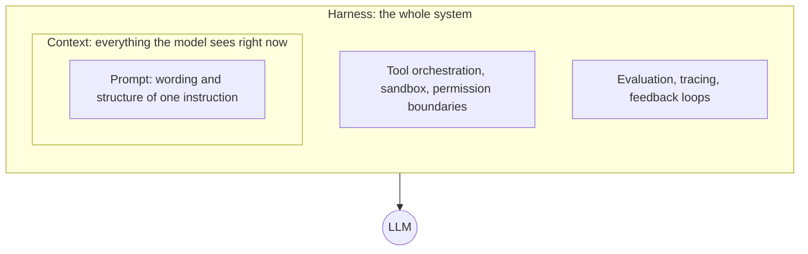
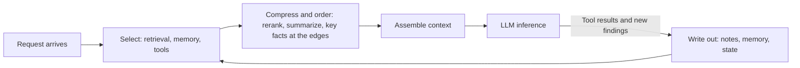
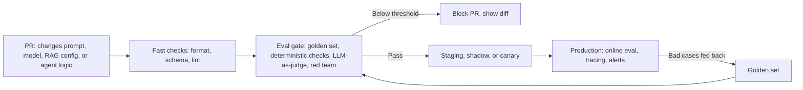

> 🌏 [中文版](/posts/ai/2026-10-03-ai-interview-prompt-context-harness)

Interviews for LLM application roles tend to chain the same questions together: why prompt engineering matters, how context engineering differs, what harness engineering is, what happens without evaluation, and how a team should wire LLM development into CI/CD. They look scattered, but they ask one thing: **when the model gets it wrong, do you know which layer to fix?**

This is part 14 of the "AI Engineer Interview Prep" series. It follows the layers from the inside out: prompts first, then context (which decides what goes into the prompt), then the harness that wraps both, and finally evaluation and CI/CD gates. Each section moves from concept to mechanism or comparison to how to answer in an interview. Where the site already has a full article on a topic, the text links to it.

## The Big Picture: Three Layers, Inside Out

The three layers are not successive eras that replace each other. They are three scales. The inner layer asks how to word this instruction. The middle layer asks what the model should see at this step. The outer layer asks how the whole system lets an error-prone model work reliably.

The vocabulary is young. In June 2025, Shopify CEO Tobi Lütke [said he preferred "context engineering" over "prompt engineering"](https://simonwillison.net/2025/jun/27/context-engineering/), and Andrej Karpathy [backed the term in his own post](https://x.com/karpathy/status/1937902205765607626). Anthropic's engineering team wrote in [Effective context engineering for AI agents](https://www.anthropic.com/engineering/effective-context-engineering-for-ai-agents) that they see context engineering as the natural progression of prompt engineering. The word "harness" spread in February 2026 after an OpenAI article, covered below. For another take on the progression, see the site's [From Prompt to Harness: The Three Evolutions of AI Engineering](/en/posts/ai/2026-03-28-harness-engineering-evolution-en).

| Layer | Core question | What it governs | Typical failure | First fix |
|---|---|---|---|---|
| Prompt | How should this be worded? | Instructions, examples, output format | Ambiguity, unstable format, skipped reasoning | Be explicit, add examples, ask for step-by-step reasoning |
| Context | What does the model need right now? | Retrieval, memory, tool output, history | Too little, too much, or contradictory information | Dynamic assembly, compression, isolation |
| Harness | How does the system stay reliable? | Tools, sandbox, constraints, evaluation, observability | Overreach, infinite loops, silent regressions | Deterministic checks, feedback loops, gates |

The most practical use of the boundary is as a **diagnostic order**. When output is wrong, first check whether the wording is ambiguous, then whether the model received the information it needed, and only then whether the system guards against errors. Outer-layer fixes cost more, but they remove a whole class of failures at once.

**How to answer in an interview**

Start with containment in one sentence: a prompt is what you do inside the context window, context decides what enters the window, and the harness packages context, tools, permissions, and evaluation into a reliable system. Add that this is a change of scale, not a replacement, so earlier techniques still apply. If pressed, close with "diagnose from the inside out"; that ordering is usually what the interviewer wants to hear.

## Layer 1, Prompt: Make One Interaction Clear

Prompt engineering is the practice of designing, refining, and iterating on inputs to steer a model toward the output you want. [Liu et al.'s survey](https://arxiv.org/abs/2107.13586) frames it as a paradigm shift in NLP: from "pre-train then fine-tune" to "pre-train, prompt, predict," where behavior changes without retraining. [The Prompt Report](https://arxiv.org/abs/2406.06608) catalogs 58 text-based prompting techniques and works as a map of the field.

Six factors usually come up when interviewers ask what affects output quality:

| Factor | What it does | Evidence and limits |
|---|---|---|
| Instruction clarity | Leaves less for the model to guess | [Bsharat et al.](https://arxiv.org/abs/2312.16171) proposed 26 principles; on their own ATLAS benchmark, GPT-4 response quality rose 57.7% on average (human-rated, GPT-4 and that benchmark only) |
| Context | Narrows the search space and supplies facts the model never trained on | [Lewis et al.'s RAG](https://arxiv.org/abs/2005.11401) injects retrieved knowledge into the prompt, the canonical example |
| Role | Adjusts tone, expertise level, and viewpoint | [Zheng et al.](https://arxiv.org/abs/2311.10054) tested 162 personas; adding a persona gave no consistent gain on factual questions |
| Few-shot examples | Shows the input-to-output mapping | The [GPT-3 paper](https://arxiv.org/abs/2005.14165) showed new tasks can be done from a few examples without fine-tuning |
| Output format | Improves parseability, cuts post-processing | Guaranteeing format takes a constraint mechanism such as structured output, not just asking nicely in the prompt |
| Reasoning guidance | Gets the model to write intermediate steps | In [Wei et al.](https://arxiv.org/abs/2201.11903), chain-of-thought on PaLM 540B lifted GSM8K from 17.9% to 56.9% |

Three points on this table are easy to overstate.

First, 57.7% is response *quality*, not accuracy, and it is human-rated, limited to GPT-4 and the ATLAS benchmark. Carry those qualifiers when you cite it, or you are inflating the paper's claim.

Second, role prompts are often treated as a shortcut to correctness. The Zheng et al. paper even reversed its conclusion between versions: the first version said interpersonal roles helped, while the [latest version](https://arxiv.org/abs/2311.10054) says adding a persona did not improve performance and the effect looks close to random. Roles suit tone and style. They do not replace supplying data.

Third, separate "valid" from "correct" when specifying format. OpenAI's [Structured Outputs](https://openai.com/index/introducing-structured-outputs-in-the-api), introduced in August 2024, makes output follow a developer-supplied JSON Schema. That solves format. Whether the content is right still needs separate verification.

Chain-of-thought also has a zero-example form: [Kojima et al.](https://arxiv.org/abs/2205.11916) found that appending "Let's think step by step" beats standard zero-shot prompting on several reasoning tasks.

A solid prompt roughly contains role, background, task and constraints, examples, output format, and reasoning guidance, though not every prompt needs all six. Anthropic's advice runs the other way: [start with a minimal prompt](https://www.anthropic.com/engineering/effective-context-engineering-for-ai-agents) and add instructions and examples only for failures you actually observe. For the iteration workflow, read the site's [Prompt Engineering in Practice](/en/posts/ai/2026-03-13-prompt-engineering-iteration-guide-en). For versioning prompt changes against evals, see [Prompt Versioning: One Word Can Drop an Eval from 5/5 to 0/5](/en/posts/ai/2026-08-25-coding-agent-prompt-versioning-en). Prompt design for RAG is covered in [RAG Prompt Engineering](/en/posts/ai/2026-03-12-rag-prompt-engineering-en).

**How to answer in an interview**

Give the definition and the paradigm shift, then pick the three factors that matter most: instruction clarity, supplying data, and examples plus reasoning guidance. Volunteering the limits of role prompts earns more credit than reciting the list of six. Finish with how to improve prompts systematically: build a test set, change one thing at a time, run the evaluation, and check for regressions instead of going by feel.

## Layer 2, Context: Decide What Enters the Window

### Definition and boundary

Context engineering aims to put the right information and tools in front of the model at the right time and in the right format. Karpathy's phrasing is filling the context window with just the right information for the next step, which he breaks into task descriptions, few-shot examples, RAG, tools, state and history, and compaction, with both science and art involved. Anthropic's definition is more engineering-flavored: [curating and maintaining the optimal set of tokens during inference](https://www.anthropic.com/engineering/effective-context-engineering-for-ai-agents), including everything that reaches the model beyond the prompt.

It differs from prompting in three ways. In scope, prompting asks how to word something while context asks what the model needs access to. In time, prompting optimizes one interaction while context reasons about sequences: what earlier turns left behind and which tool outputs should still be there three steps later. In maturity, context engineering reads more like system design. Karpathy's [LLM-as-operating-system](https://www.youtube.com/watch?v=LCEmiRjPEtQ) analogy was [packaged by LangChain](https://blog.langchain.com/context-engineering-for-agents/) as "the LLM is the CPU and the context window is the RAM." That sentence is LangChain's phrasing, not a quote from Karpathy's post, so attribute it carefully.

On the academic side, [Mei et al.'s survey](https://arxiv.org/abs/2507.13334) analyzes more than 1,400 papers and proposes a taxonomy, which makes it the best scholarly citation available. Two 2026 preprints, [Calboreanu's practitioner methodology](https://arxiv.org/abs/2604.04258) and [Vishnyakova's enterprise multi-agent architecture](https://arxiv.org/abs/2603.09619), are single-author. The first is an observational study of 200 interactions with no control group, so its evidence is limited and it works only as background. On the industry side, Gartner's March 2026 [data and analytics predictions release](https://www.gartner.com/en/newsroom/press-releases/2026-03-11-gartner-announces-top-predictions-for-data-and-analytics-in-2026) lists "the need for context" among the areas AI will affect.

### What context is made of

At any moment, an agent's context usually holds these parts:

| Part | Content | Common problem |
|---|---|---|
| System prompt | Role, rules, boundaries | Too rigid or too vague |
| User input | This turn's request, from a person or an upstream agent | Requirements added turn by turn that contradict each other |
| Conversation history | Earlier exchanges | Grows without bound |
| Retrieved knowledge | Snippets from a vector store, search, or APIs | Relevant but unusable, or ranked wrong |
| Tool descriptions | Available actions and parameter schemas | Too many tools, overlapping descriptions |
| Task metadata | User attributes, permissions, constraints | Missing data leads to overreach or off-target answers |
| Examples | Few-shot input and output pairs | Stuffed with edge cases |
| Long-term memory | Preferences and conclusions kept across sessions | Stale or poisoned |

[LangChain](https://blog.langchain.com/context-engineering-for-agents/) also offers a coarser three-way split into instructions, knowledge, and tool feedback, which is easy to remember. The site's [Context Engineering: Why Your AI Agent's Problem Is Information, Not the Model](/en/posts/ai/2026-03-24-context-engineering-guide-en) has the full diagrams and examples.

### How poor design breaks things

The intuitive split has three cases. Too little information forces the model to guess, which produces hallucination. Too much dilutes attention and raises cost and latency. Contradictory information leaves the model unsure whom to follow. Drew Breunig splits the "too much and conflicting" cases into [four failures](https://www.dbreunig.com/2025/06/22/how-contexts-fail-and-how-to-fix-them.html):

| Failure | Description | A concrete example |
|---|---|---|
| Poisoning | A hallucination or error enters the context and is referenced repeatedly | The Gemini 2.5 technical report describes a Pokémon-playing agent whose goal fields were polluted with wrong game state, and the error took a long time to undo |
| Distraction | The context grows so long the model leans on its history | The same report saw the agent favor repeating past actions once context went well beyond 100k tokens |
| Confusion | Superfluous content gets used in the answer | On the 46-tool GeoEngine benchmark, a quantized small model failed even though the context was within its window |
| Clash | New information contradicts earlier information | A Microsoft and Salesforce [multi-turn study](https://arxiv.org/abs/2505.06120) split full instructions across turns, and average performance dropped 39% |

Position matters too. [Lost in the Middle](https://arxiv.org/abs/2307.03172) (TACL 2024) found that performance is highest when relevant information sits at the start or end of the input and degrades noticeably when it sits in the middle of a long context, even for models built for long inputs. Anthropic cites Chroma's [context rot](https://research.trychroma.com/context-rot) work for the same phenomenon: as tokens accumulate, the model's ability to accurately recall from them declines, so context should be treated as a finite resource with diminishing returns.

That answers the common follow-up, "if windows keep growing, do we still need context engineering?" Yes. A bigger window lets you fit more in. It does not mean the model uses it well, and longer inputs cost more and run slower.

### How architecture raises context quality

The guiding principle is Anthropic's: find the **smallest set of high-signal tokens** that maximizes the chance of the outcome you want. In architecture, that comes down to five moves.

1. **Dynamic assembly.** Context is not a static template. It is the output of code that runs before the main LLM call and decides, per task, what to include.
2. **Retrieval, reranking, compression.** Fetch candidates, use a reranker to keep the few most useful snippets, and summarize into key points when needed. The site's [RAG Evaluation Frameworks and Tool Selection](/en/posts/ai/2026-03-12-rag-evaluation-frameworks-en) shows how to measure this stage.
3. **On-demand retrieval.** In the [just-in-time approach](https://www.anthropic.com/engineering/effective-context-engineering-for-ai-agents) Anthropic describes, an agent holds lightweight identifiers such as file paths or queries and loads data through tools only when needed. The cost is speed compared with precomputed retrieval, and the design has to teach the model how to look.
4. **Compression and pruning.** Long tasks can use compaction (summarize, then restart the window), structured notes, and subagents. Anthropic's compaction keeps architectural decisions and unresolved issues and drops redundant tool output. The hard part is choosing what to keep, because over-aggressive compaction loses details whose importance only shows up later.
5. **Isolation.** In LangChain's write, select, compress, isolate framework, isolation means giving multiple agents clean windows or keeping large objects in a sandbox and returning only a summary.

Also treat observability as a design requirement: log the prompts actually sent, the snippets retrieved, and the outputs. Otherwise you cannot tell which part failed.

**How to answer in an interview**

Define it as "the right information and tools, at the right time, in the right format," and distinguish it from prompting as "wording versus information, single turn versus sequence." List six to eight components, split failures into too little, too much, and conflicting, and add Breunig's four modes and Lost in the Middle for depth. Pick three architectural strategies and go deep: dynamic assembly, compression and pruning, and isolation. Close by saying token cost and latency are design variables.

## Layer 3, Harness: Engineering Around a Non-Deterministic Core

### Definition and role

The common definition of a harness is everything in an AI agent except the model. [LangChain's formulation](https://blog.langchain.com/the-anatomy-of-an-agent-harness/) is Agent = Model + Harness, and Böckeler's [analysis on Martin Fowler's site](https://martinfowler.com/articles/harness-engineering.html) cites the same equation. The relationship to the other layers is containment: a prompt is a technique a harness may use, context management is one of its duties, and the harness also owns tool execution, permission boundaries, error handling, and the whole interaction loop.

What separates this work from traditional software engineering is the non-deterministic core. A harness must expect the model to say or do unexpected things and handle them gracefully. Karpathy's post already hints at this: context engineering is one small part of a "thick layer" of software that also includes control flow decomposition, model dispatch, guardrails, security, evals, and parallelism, which is nearly the harness checklist.

### OpenAI's case and Böckeler's grouping

In February 2026, OpenAI's Ryan Lopopolo published [Harness engineering: leveraging Codex in an agent-first world](https://openai.com/index/harness-engineering/). By OpenAI's own account (not independently audited), a team used Codex to build an internal product of roughly one million lines of code in about five months, with around 1,500 pull requests and zero hand-written lines. The article describes the engineer's job as designing environments, specifying intent, and building feedback loops. The site has a full walkthrough: [OpenAI Wrote a Million Lines with Codex: Harness Engineering in Practice](/en/posts/ai/2026-04-21-openai-harness-engineering-codex-agent-first-en).

Birgitta Böckeler's [first-thoughts memo](https://martinfowler.com/articles/exploring-gen-ai/harness-engineering-memo.html) on Fowler's site grouped the OpenAI team's harness into three categories. She notes in the text that this grouping is her interpretation, not headings from OpenAI's article:

- **Context engineering:** a continuously enriched in-repo knowledge base, plus agent access to dynamic information such as observability data and browser navigation.
- **Architectural constraints:** enforced not only by LLM-based agents but also by deterministic custom linters and structural tests.
- **Garbage collection:** agents that run periodically to find documentation inconsistencies or violations of architectural constraints, fighting entropy and decay.

That memo was later superseded by her [full article](https://martinfowler.com/articles/harness-engineering.html), which switches to two axes: guides (feedforward controls applied before the agent acts) and sensors (feedback controls applied afterward). It also splits them by execution type into computational (deterministic and fast, running on CPU, such as tests, linters, and type checkers) and inferential (semantic analysis and LLM-as-judge, slower, costlier, and less deterministic). Mentioning this shows you followed the topic to its latest version. In the memo she also flagged a gap: OpenAI's write-up does not address verification of functionality and behavior, which is exactly what the evaluation section below fills.

OpenAI later turned this into a platform story. [Codex as a platform](https://developers.openai.com/blog/codex-as-a-platform) argues that the open-source Codex harness powers the App, CLI, and IDE extension, and can be embedded in your own product through `codex exec`, the Codex SDK, and app-server. The timing can only be given as summer 2026, and the [Codex CLI](https://github.com/openai/codex) itself was open-sourced in April 2025, so this was not a "first release." The same post cites an [ARC-AGI-3 example](https://developers.openai.com/blog/codex-as-a-platform): retained reasoning and context compaction raised GPT-5.6 Sol's score by nearly three times, which is OpenAI's own account of its own model and harness.

### What a harness contains, and recent research

Combining OpenAI's account, Böckeler's frameworks, and the site's own write-ups gives a checklist for interviews:

| Component | Responsibility |
|---|---|
| Context management | Dynamic assembly, compression, memory, knowledge base |
| Tool orchestration | Tool registry, selection, result handling |
| Sandbox and approval boundaries | Execution isolation, least privilege, human confirmation for risky actions |
| Deterministic constraints | Linters, structural tests, schema validation |
| Feedback loops | Returning failure signals to the model so it can self-correct |
| Observability | Tracing, logs, cost and latency |
| Session management | Multi-turn state, checkpoint and resume |

The site's [Advanced Harness Engineering Patterns](/en/posts/ai/2026-03-30-harness-engineering-patterns-en) covers the Tool Registry, Guard System, and Checkpoint-Resume. [Anthropic's Harness Design](/en/posts/ai/2026-03-28-anthropic-harness-design-en) and [Phil Schmid on the Agent Harness](/en/posts/ai/2026-03-28-phil-schmid-agent-harness-en) offer two more angles, and [The Model Is a Component, the Harness Is the System](/en/posts/ai/2026-08-10-model-component-harness-system-en) collects conclusions from several companies.

Preprints on the topic have appeared since 2026. Evidence strength varies, and an interview citation should say so:

| Paper | Content | Evidence strength |
|---|---|---|
| [Harness Engineering for Agentic AI Coding Tools](https://arxiv.org/abs/2602.14690) | Exploratory study of 2,853 GitHub repos; context files dominate and AGENTS.md is becoming an interoperable format | Multi-author empirical study, marked as published at AIware 2026 |
| [Natural-Language Agent Harnesses](https://arxiv.org/abs/2603.25723) | Specifying harnesses in natural language | Method proposal |
| [Agentic Harness Engineering](https://arxiv.org/abs/2604.25850) | Observability-driven automatic evolution of harnesses | Multi-author method paper |
| [From Model Scaling to System Scaling](https://arxiv.org/abs/2605.26112) | Argues that scaling the harness matters as much as scaling the model | Single author, position paper, not experimental evidence |
| [Adapting the Interface, Not the Model](https://arxiv.org/abs/2605.22166) | Adapting the harness interface at runtime; improved 116 of 126 model and environment settings | Page marks it as work in progress |

### The other "harness": evaluation frameworks

In evaluation, "harness" has a second meaning that you should keep apart. [EleutherAI's LM Evaluation Harness](https://github.com/EleutherAI/lm-evaluation-harness) is a unified framework that tests different models on the same code and inputs. [Maiorano's LLM Readiness Harness](https://arxiv.org/abs/2603.27355) turns evaluation into a deployment decision workflow, combining benchmarks, OpenTelemetry, and CI quality gates, and is a single-author preprint. Both are evaluation harnesses, a different thing from an agent's execution harness.

**How to answer in an interview**

Start with the definition: a harness is the engineering wrapped around a non-deterministic model, where humans design the environment, specify intent, and build feedback loops. Then explain composition with Böckeler's three categories or guides and sensors, and say up front that the first is her interpretation and she later changed frameworks. Finish by noting that "harness" has an execution sense and an evaluation sense, so the interviewer sees you can tell them apart.

## Evaluation and Monitoring: The Part of the Harness Most Often Skipped

### What a complete system needs

| Capability | What it does | Why it matters |
|---|---|---|
| Multi-dimensional metrics | Track task success, policy compliance, groundedness, retrieval hit rate, cost, and p95 latency together | Readiness is not one score |
| Mixed scoring | Deterministic checks (valid JSON, PII detection), statistical metrics, LLM-as-judge | Each method has different blind spots |
| CI quality gate | Block the PR below threshold and show the diff in the PR | Turns evaluation from a report into a decision |
| Tracing and observability | Component-level traces to see which pipeline stage failed | Avoids unnecessary changes |
| Online continuous evaluation | Score sampled production traffic and alert | Offline sets lag the real distribution |
| Feedback into the dataset | Tag bad cases and add them to the eval set | Every incident becomes permanent protection |

Maiorano's results give a concrete example of "not a single metric": on FiQA in an SLA-first scenario, gpt-4.1-mini [led on readiness and faithfulness](https://arxiv.org/abs/2603.27355) while gpt-5.2 paid a substantial latency cost. The same paper's ticket-routing experiments show regression gates consistently rejecting unsafe prompt variants. This is a single-author result, good for illustrating design thinking and not for generalizing.

The most common follow-up on mixed scoring is whether LLM-as-judge can be trusted. It carries biases, so calibrate against human labels, fix the rubric, and add deterministic checks for critical items. The site's [How to Rigorously Compare an Agent Before and After a Change](/en/posts/ai/2026-06-04-agent-change-rigorous-evaluation-en) covers golden-set sizing, judge bias, and statistical tests, and [Self-Reflection + LLM-as-Judge](/en/posts/ai/2026-03-12-self-reflection-llm-as-judge-en) covers letting a model evaluate itself. On tooling, see [Promptfoo](/en/posts/ai/2026-08-22-promptfoo-llm-evaluation-en), [Braintrust](/en/posts/ai/2026-08-22-braintrust-llm-evaluation-en), and [Arize Phoenix](/en/posts/ai/2026-08-22-arize-phoenix-observability-evaluation-en). For observability, there is the [Langfuse guide](/en/posts/ai/2026-03-26-langfuse-llm-observability-guide-en) and [Agent Observability: From OTel Traces to Catching Hallucinations, Tool Misuse, and Infinite Loops](/en/posts/ai/2026-06-04-agent-observability-failure-detection-en).

### The risks of having no evaluation

Without evaluation, risk does not arrive as one explosion. It accumulates where nobody can see it:

- **Silent regression.** You change a prompt to fix one problem and quietly break three other cases. It is the signature risk of LLM development, because outputs are non-deterministic and traditional assertions miss it.
- **Hallucination reaching users.** Nobody measures groundedness, so wrong answers go straight to users.
- **Drift.** A provider updates the model or users' questions shift, and yesterday's passing cases fail today. Only continuous evaluation reveals it.
- **Security and privacy.** Prompt injection and leakage of sensitive data. The site's [Agent Security: Prompt Injection and Trust Boundaries](/en/posts/ai/2026-06-04-agent-security-prompt-injection-trust-boundaries-en) covers layered defenses.
- **Cascading failure.** When output feeds other automation, one error amplifies into an operational incident, so high-risk flows need human confirmation.
- **Compliance and accountability.** Without records and tests you cannot show how the system behaves at its limits.

**How to answer in an interview**

Open with six phrases: multi-dimensional metrics, mixed scoring, gates, tracing, online evaluation, and feeding failures back. Give each one sentence. For risks, make silent regression the headline, since it best explains why LLMs need regression tests like any software. If asked about judge reliability, answer with calibration, a fixed rubric, and deterministic checks.

## Team Adoption: CI/CD and Evaluation Gates for LLM Development

Traditional CI assumes you can assert on output. LLM output spans too wide a range, so you compare against reference answers or ask another model to judge. The whole flow looks like this:

Stage by stage, each one should answer what it blocks, how, and at what cost:

1. **Triggers.** Not only code: prompts, model versions, RAG settings, agent logic, and tool descriptions all trigger the pipeline. Put them all under version control, including the evaluation dataset, or results cannot be reproduced.
2. **Fast checks.** Valid JSON, schema validation, lint. Milliseconds to seconds, run on every commit. Böckeler's [keep quality left](https://martinfowler.com/articles/harness-engineering.html) means exactly this: cheap checks before integration, expensive ones (broader review, mutation testing) after.
3. **Evaluation gate.** Run the frozen golden set with deterministic checks first and LLM-as-judge for semantics. Run each case several times and look at the pass rate rather than a single right-or-wrong. Set explicit thresholds, block the PR below them, and post the diff against main. Frameworks such as [DeepEval](https://github.com/confident-ai/deepeval), which works in a pytest style, or the Promptfoo mentioned above, fit here.
4. **Pre-production.** Beyond staging, use shadow deployment (mirror traffic without returning results to users), canary, and A/B, plus human spot checks. This stage measures latency and cost.
5. **Production monitoring.** Online sampled scoring, drift detection, anomaly alerts, and user feedback collection.
6. **Feeding back.** Tag bad cases and add them to the golden set so every incident becomes a permanent test. The site's [AI-Native SDLC Playbook L9](/en/posts/ai/2026-09-12-ai-native-sdlc-playbook-09-ci-evals-en) applies this idea to CI for agent configuration.

Model selection belongs in the same flow. Weight readiness by scenario (cost-first, risk-first, latency-first) instead of chasing a single top score.

**A first step you can take tonight:** collect 20 to 50 real cases as a golden set and wire up the simplest CI check, so that "changing a prompt gets tested" becomes true, then add dimensions gradually. The site's L9 article recommends starting at the same scale.

**How to answer in an interview**

Walk through four stages: development, evaluation gate, deployment (shadow, canary, A/B), and production monitoring, then add the step that closes the loop, feeding bad cases back. If asked how to test non-determinism, say sample several runs and look at pass rates, with thresholds set as ranges. If asked how to start, say 20 to 50 real cases and one simple CI check, not a full platform on day one.

## The Takeaway

The trade-off across the three layers fits on one line: the further out you go, the larger the investment and the more failures you remove at once. Prompts are cheap and fast but have a low ceiling. Context decides whether the model has a chance of being right. The harness decides whether the system notices and contains the error afterward. Evaluation is part of the harness, and it is the only mechanism that lets changes to the other two layers be proven effective.

| Common follow-up | One-line answer |
|---|---|
| Will prompt engineering become obsolete? | The techniques remain foundational, but the focus has moved up to context and harness |
| Do role prompts really help? | They help tone and depth, not factual accuracy in any consistent way |
| Do we still need context engineering as windows grow? | Yes: longer is costlier and slower, and accuracy still degrades with length |
| Can LLM-as-judge be trusted? | It is biased, so calibrate, fix the rubric, and add deterministic checks |

## Questions that keep showing up in public question banks

These questions come from seven public question banks (compared in [post 11 of this series](/en/posts/ai/2026-09-30-ai-engineer-interview-resources-en)), keeping the ones that repeat across banks plus a few newer question types that map onto sections of this article. "Independent sources" only counts overlap between banks. It says nothing about how often a question appears in real interviews, and the amitshekhar and pallavi banks cite no sources, so this article does not use their company tags. Only question titles and links to where they appear are listed here, with no answers reproduced.

| Question | Independent sources | Question-bank links | Where it fits in this article |
|---|---|---|---|
| How do you evaluate an LLM / RAG system? What is the taxonomy of evaluation methods, and which metrics do you use? | 4 | [om](https://github.com/ombharatiya/AI-Engineer-Interview-Questions/blob/main/07-evaluation-and-observability/questions.md#2-walk-me-through-the-taxonomy-of-evaluation-methods-for-llm-systems-and-when-youd-use-each) · [aeg](https://github.com/alexeygrigorev/ai-engineering-field-guide/blob/main/interview/questions/questions.md?plain=1#L146) · [AIML](https://github.com/alirezadir/AIMLInterviews/blob/main/src/ml-fundamental.md#llm--genai--multimodal-sample-questions-2026) · [amit](https://github.com/amitshekhariitbhu/ai-engineering-interview-questions/blob/main/README.md#L682) | What a complete system needs |
| Explain few-shot learning and chain-of-thought prompting. When should you use CoT? | 3 | [aeg](https://github.com/alexeygrigorev/ai-engineering-field-guide/blob/main/interview/questions/questions.md?plain=1#L16) · [amit](https://github.com/amitshekhariitbhu/ai-engineering-interview-questions/blob/main/README.md#L224) · [ks](https://github.com/KalyanKS-NLP/LLM-Interview-Questions-and-Answers-Hub/blob/main/Interview_QA/QA_73-75.md) | Layer 1, Prompt: Make One Interaction Clear |
| How do you evaluate an agent? Compare trajectory evals and final-outcome evals; why can SWE-bench pass rates be misleading? | 3 | [om](https://github.com/ombharatiya/AI-Engineer-Interview-Questions/blob/main/06-agents-and-tool-use/questions.md#28-how-do-you-evaluate-an-agent-compare-trajectory-evals-and-final-outcome-evals) · [aeg](https://github.com/alexeygrigorev/ai-engineering-field-guide/blob/main/interview/questions/questions.md?plain=1#L117) · [amit](https://github.com/amitshekhariitbhu/ai-engineering-interview-questions/blob/main/README.md#L705) · [pal](https://github.com/pallavi-shekhar/ai-engineering-interview-questions-company-wise/blob/main/README.md#L327) | What a complete system needs |
| How do you version and manage prompts in production, and roll back behavior? | 3 | [om](https://github.com/ombharatiya/AI-Engineer-Interview-Questions/blob/main/03-prompt-engineering-and-context/questions.md#25-how-do-you-version-and-govern-prompts-in-production-someone-asks-which-prompt-produced-a-bad-output-three-weeks-ago---can-you-answer) · [aeg](https://github.com/alexeygrigorev/ai-engineering-field-guide/blob/main/interview/questions/questions.md?plain=1#L104) · [amit](https://github.com/amitshekhariitbhu/ai-engineering-interview-questions/blob/main/README.md#L620) · [pal](https://github.com/pallavi-shekhar/ai-engineering-interview-questions-company-wise/blob/main/README.md#L324) | Team Adoption: CI/CD and Evaluation Gates for LLM Development |
| Why do people say "evals are the moat"? What is vibes-based evaluation vs. a formal eval framework? | 2 | [om](https://github.com/ombharatiya/AI-Engineer-Interview-Questions/blob/main/07-evaluation-and-observability/questions.md#1-why-do-people-say-evals-are-the-moat-for-ai-products-what-makes-them-the-core-engineering-artifact) · [aeg](https://github.com/alexeygrigorev/ai-engineering-field-guide/blob/main/interview/questions/questions.md?plain=1#L152) | Evaluation and Monitoring: The Part of the Harness Most Often Skipped |
| How do you structure prompts for consistent structured output (JSON, XML)? | 2 | [amit](https://github.com/amitshekhariitbhu/ai-engineering-interview-questions/blob/main/README.md#L231) · [ks](https://github.com/KalyanKS-NLP/LLM-Interview-Questions-and-Answers-Hub/blob/main/Interview_QA/QA_85-87.md) | Layer 1, Prompt: Make One Interaction Clear |
| What is context engineering, and how is it different from prompt engineering? | 2 | [om](https://github.com/ombharatiya/AI-Engineer-Interview-Questions/blob/main/03-prompt-engineering-and-context/questions.md#6-what-is-context-engineering-and-how-is-it-different-from-prompt-engineering) · [amit](https://github.com/amitshekhariitbhu/ai-engineering-interview-questions/blob/main/README.md#L366) | Definition and boundary |
| What is context rot, and how does context compaction work in long-running agents? | 2 | [om](https://github.com/ombharatiya/AI-Engineer-Interview-Questions/blob/main/03-prompt-engineering-and-context/questions.md#37-what-is-context-rot-and-what-compaction-strategies-do-you-use-in-long-running-agents) · [amit](https://github.com/amitshekhariitbhu/ai-engineering-interview-questions/blob/main/README.md#L368) | How architecture raises context quality |
| What is the context window, and what happens when you exceed it? What is the "lost in the middle" problem? | 2 | [aeg](https://github.com/alexeygrigorev/ai-engineering-field-guide/blob/main/interview/questions/questions.md?plain=1#L44) · [amit](https://github.com/amitshekhariitbhu/ai-engineering-interview-questions/blob/main/README.md#L247) | How poor design breaks things |
| What matters more for an agentic coding tool like Claude Code: the model or the harness? | 2 | [om](https://github.com/ombharatiya/AI-Engineer-Interview-Questions/blob/main/14-company-interview-questions/anthropic.md) · [amit](https://github.com/amitshekhariitbhu/ai-engineering-interview-questions/blob/main/README.md#L338) · [pal](https://github.com/pallavi-shekhar/ai-engineering-interview-questions-company-wise/blob/main/README.md#L485) | Definition and role |
| Build the evaluation harness for a new frontier model release. What does it need to do? | 2 | [om](https://github.com/ombharatiya/AI-Engineer-Interview-Questions/blob/main/14-company-interview-questions/google-deepmind.md) · [pal](https://github.com/pallavi-shekhar/ai-engineering-interview-questions-company-wise/blob/main/README.md#L643) | The other "harness": evaluation frameworks |
| What is LLM-as-a-judge evaluation, and what are its known biases and limitations? | 2 | [om](https://github.com/ombharatiya/AI-Engineer-Interview-Questions/blob/main/07-evaluation-and-observability/questions.md#16-what-are-the-known-biases-of-llm-judges-and-how-do-you-mitigate-each) · [amit](https://github.com/amitshekhariitbhu/ai-engineering-interview-questions/blob/main/README.md#L688) · [pal](https://github.com/pallavi-shekhar/ai-engineering-interview-questions-company-wise/blob/main/README.md#L308) | What a complete system needs |
| What is LLM observability? Design the observability stack for a production LLM application. | 2 | [om](https://github.com/ombharatiya/AI-Engineer-Interview-Questions/blob/main/07-evaluation-and-observability/questions.md#42-design-the-observability-stack-for-a-production-llm-application-what-does-a-good-trace-look-like) · [amit](https://github.com/amitshekhariitbhu/ai-engineering-interview-questions/blob/main/README.md#L609) · [pal](https://github.com/pallavi-shekhar/ai-engineering-interview-questions-company-wise/blob/main/README.md#L322) | What a complete system needs |
| How do you evaluate and monitor a model in production, not just offline, and detect drift? | 2 | [aeg](https://github.com/alexeygrigorev/ai-engineering-field-guide/blob/main/interview/questions/questions.md?plain=1#L148) · [amit](https://github.com/amitshekhariitbhu/ai-engineering-interview-questions/blob/main/README.md#L712) · [pal](https://github.com/pallavi-shekhar/ai-engineering-interview-questions-company-wise/blob/main/README.md#L325) | What a complete system needs |
| How do you detect and measure hallucination rate in production? | 2 | [aeg](https://github.com/alexeygrigorev/ai-engineering-field-guide/blob/main/interview/questions/questions.md?plain=1#L151) · [pal](https://github.com/pallavi-shekhar/ai-engineering-interview-questions-company-wise/blob/main/README.md#L313) | The risks of having no evaluation |
| Walk me through error analysis for 500 flagged production failures; how do you diagnose a chatbot whose accuracy dropped from 95% to 80% before retraining? | 2 | [om](https://github.com/ombharatiya/AI-Engineer-Interview-Questions/blob/main/07-evaluation-and-observability/questions.md#27-you-have-500-production-transcripts-flagged-as-failures-walk-me-through-your-error-analysis-process) · [aeg](https://github.com/alexeygrigorev/ai-engineering-field-guide/blob/main/interview/questions/questions.md?plain=1#L159) | The risks of having no evaluation |
| How do you wire evals into CI so prompt or model changes can't silently regress quality? How does CI/CD for AI applications differ from traditional CI/CD? | 2 | [om](https://github.com/ombharatiya/AI-Engineer-Interview-Questions/blob/main/07-evaluation-and-observability/questions.md#25-how-do-you-wire-evals-into-ci-so-that-prompt-or-model-changes-cant-silently-regress-quality) · [amit](https://github.com/amitshekhariitbhu/ai-engineering-interview-questions/blob/main/README.md#L619) · [pal](https://github.com/pallavi-shekhar/ai-engineering-interview-questions-company-wise/blob/main/README.md#L315) | Team Adoption: CI/CD and Evaluation Gates for LLM Development |
| How do you build a golden dataset and a regression test suite for AI applications? | 2 | [aeg](https://github.com/alexeygrigorev/ai-engineering-field-guide/blob/main/interview/questions/questions.md?plain=1#L153) · [amit](https://github.com/amitshekhariitbhu/ai-engineering-interview-questions/blob/main/README.md#L695) | Team Adoption: CI/CD and Evaluation Gates for LLM Development |
| How do you implement A/B testing for LLM systems, and test a new model before full deployment (A/B, canary, interleaved, shadow)? | 2 | [aeg](https://github.com/alexeygrigorev/ai-engineering-field-guide/blob/main/interview/questions/questions.md?plain=1#L156) · [amit](https://github.com/amitshekhariitbhu/ai-engineering-interview-questions/blob/main/README.md#L618) | Team Adoption: CI/CD and Evaluation Gates for LLM Development |
| What belongs in a repository instruction file such as AGENTS.md or CLAUDE.md for a coding agent, and what should stay out? | 1 | [om](https://github.com/ombharatiya/AI-Engineer-Interview-Questions/blob/main/03-prompt-engineering-and-context/questions.md#35-what-belongs-in-a-repository-instruction-file-such-as-agentsmd-or-claudemd-for-a-coding-agent-and-what-should-stay-out) | What a harness contains, and recent research |
| What operational and business metrics matter for AI systems beyond accuracy? | 1 | [aeg](https://github.com/alexeygrigorev/ai-engineering-field-guide/blob/main/interview/questions/questions.md?plain=1#L147) | What a complete system needs |
| Your new model version scores higher on every benchmark, but users say it got worse. Why does this happen, and how do you find the problem? | 1 | [amit](https://github.com/amitshekhariitbhu/ai-engineering-interview-questions/blob/main/README.md#L700) · [pal](https://github.com/pallavi-shekhar/ai-engineering-interview-questions-company-wise/blob/main/README.md#L317) | What a complete system needs |
| What are your testing strategies for non-deterministic outputs? | 1 | [aeg](https://github.com/alexeygrigorev/ai-engineering-field-guide/blob/main/interview/questions/questions.md?plain=1#L145) | Team Adoption: CI/CD and Evaluation Gates for LLM Development |
| Your new prompt scores 78% vs the old prompt's 74% on a 100-example eval. Do you ship it? | 1 | [om](https://github.com/ombharatiya/AI-Engineer-Interview-Questions/blob/main/07-evaluation-and-observability/questions.md#41-your-new-prompt-scores-78-vs-the-old-prompts-74-on-a-100-example-eval-do-you-ship-it) | Team Adoption: CI/CD and Evaluation Gates for LLM Development |

How sources are counted: amit and pal appear to be maintained by the same organization and share 26 near-verbatim questions, so together they count as 1 source; the two ks banks have the same author and count as 1; om, aeg, and AIML count as 1 each, so the maximum is 5. This section lists only question titles and links; see the original repos for answers.

The line-number links for amit, pal and aeg point to the main branch as of 2026-10-03 and can shift after those repos change; if a link lands on a different question, search the original file for the question text.

## Other Posts in This Series

- [RAG Variants](/en/posts/ai/2026-10-03-ai-interview-rag-variants-en)
- [Agents, MCP, and Prompt Caching](/en/posts/ai/2026-10-03-ai-interview-agent-mcp-caching-en)
- [LLM Engineering](/en/posts/ai/2026-10-03-ai-interview-llm-engineering-en)
- [ML and Transformer Basics](/en/posts/ai/2026-10-03-ai-interview-ml-transformer-basics-en)
- [System Design, Coding, and Behavioral](/en/posts/ai/2026-10-03-ai-interview-design-coding-behavioral-en)

## References

### Prompt layer

- [Pre-train, Prompt, and Predict: A Systematic Survey of Prompting Methods in NLP](https://arxiv.org/abs/2107.13586) (Liu et al.)
- [The Prompt Report: A Systematic Survey of Prompt Engineering Techniques](https://arxiv.org/abs/2406.06608) (Schulhoff et al.)
- [Principled Instructions Are All You Need for Questioning LLaMA-1/2, GPT-3.5/4](https://arxiv.org/abs/2312.16171) (Bsharat et al.)
- [Retrieval-Augmented Generation for Knowledge-Intensive NLP Tasks](https://arxiv.org/abs/2005.11401) (Lewis et al.)
- [When "A Helpful Assistant" Is Not Really Helpful: Personas in System Prompts Do Not Improve Performances of Large Language Models](https://arxiv.org/abs/2311.10054) (Zheng et al., Findings of EMNLP 2024)
- [Language Models are Few-Shot Learners](https://arxiv.org/abs/2005.14165) (Brown et al.)
- [Chain-of-Thought Prompting Elicits Reasoning in Large Language Models](https://arxiv.org/abs/2201.11903) (Wei et al.)
- [Large Language Models are Zero-Shot Reasoners](https://arxiv.org/abs/2205.11916) (Kojima et al.)
- [Introducing Structured Outputs in the API](https://openai.com/index/introducing-structured-outputs-in-the-api) (OpenAI)

### Context layer

- [Andrej Karpathy's context engineering post](https://x.com/karpathy/status/1937902205765607626)
- [Simon Willison: Context engineering](https://simonwillison.net/2025/jun/27/context-engineering/) (includes Tobi Lütke's post)
- [Anthropic: Effective context engineering for AI agents](https://www.anthropic.com/engineering/effective-context-engineering-for-ai-agents)
- [LangChain: Context Engineering](https://blog.langchain.com/context-engineering-for-agents/)
- [Drew Breunig: How Long Contexts Fail](https://www.dbreunig.com/2025/06/22/how-contexts-fail-and-how-to-fix-them.html)
- [Lost in the Middle: How Language Models Use Long Contexts](https://arxiv.org/abs/2307.03172) (Liu et al.)
- [Chroma: Context Rot](https://research.trychroma.com/context-rot)
- [Microsoft and Salesforce multi-turn study (arXiv:2505.06120)](https://arxiv.org/abs/2505.06120)
- [A Survey of Context Engineering for Large Language Models](https://arxiv.org/abs/2507.13334) (Mei et al.)
- [Context Engineering: A Practitioner Methodology for Structured Human-AI Collaboration](https://arxiv.org/abs/2604.04258) (single author)
- [Context Engineering: From Prompts to Corporate Multi-Agent Architecture](https://arxiv.org/abs/2603.09619) (single author)
- [Gartner Announces Top Predictions for Data and Analytics in 2026](https://www.gartner.com/en/newsroom/press-releases/2026-03-11-gartner-announces-top-predictions-for-data-and-analytics-in-2026)
- [Karpathy: Software Is Changing (Again)](https://www.youtube.com/watch?v=LCEmiRjPEtQ) (YC talk)

### Harness and evaluation

- [OpenAI: Harness engineering: leveraging Codex in an agent-first world](https://openai.com/index/harness-engineering/)
- [OpenAI: Codex as a platform: build on the open agent harness](https://developers.openai.com/blog/codex-as-a-platform)
- [openai/codex (GitHub)](https://github.com/openai/codex)
- [Birgitta Böckeler: Harness Engineering - first thoughts](https://martinfowler.com/articles/exploring-gen-ai/harness-engineering-memo.html)
- [Birgitta Böckeler: Harness engineering for coding agent users](https://martinfowler.com/articles/harness-engineering.html)
- [LangChain: The anatomy of an agent harness](https://blog.langchain.com/the-anatomy-of-an-agent-harness/)
- [Harness Engineering for Agentic AI Coding Tools: An Exploratory Study](https://arxiv.org/abs/2602.14690)
- [Natural-Language Agent Harnesses](https://arxiv.org/abs/2603.25723)
- [Agentic Harness Engineering: Observability-Driven Automatic Evolution of Coding-Agent Harnesses](https://arxiv.org/abs/2604.25850)
- [From Model Scaling to System Scaling: Scaling the Harness in Agentic AI](https://arxiv.org/abs/2605.26112) (single author)
- [Adapting the Interface, Not the Model: Runtime Harness Adaptation for Deterministic LLM Agents](https://arxiv.org/abs/2605.22166) (work in progress)
- [LLM Readiness Harness: Evaluation, Observability, and CI Gates for LLM/RAG Applications](https://arxiv.org/abs/2603.27355) (single author)
- [EleutherAI: lm-evaluation-harness](https://github.com/EleutherAI/lm-evaluation-harness)
- [DeepEval](https://github.com/confident-ai/deepeval)

### Question banks

- [ombharatiya/AI-Engineer-Interview-Questions](https://github.com/ombharatiya/AI-Engineer-Interview-Questions) — source of questions (only question titles are cited)
- [alexeygrigorev/ai-engineering-field-guide](https://github.com/alexeygrigorev/ai-engineering-field-guide) — source of questions (only question titles are cited)
- [alirezadir/AIMLInterviews](https://github.com/alirezadir/AIMLInterviews) — source of questions (only question titles are cited)
- [amitshekhariitbhu/ai-engineering-interview-questions](https://github.com/amitshekhariitbhu/ai-engineering-interview-questions) — source of questions (only question titles are cited)
- [pallavi-shekhar/ai-engineering-interview-questions-company-wise](https://github.com/pallavi-shekhar/ai-engineering-interview-questions-company-wise) — source of questions (only question titles are cited)
- [KalyanKS-NLP/LLM-Interview-Questions-and-Answers-Hub](https://github.com/KalyanKS-NLP/LLM-Interview-Questions-and-Answers-Hub) — source of questions (only question titles are cited)
- [KalyanKS-NLP/RAG-Interview-Questions-and-Answers-Hub](https://github.com/KalyanKS-NLP/RAG-Interview-Questions-and-Answers-Hub) — source of questions (only question titles are cited)

### Related posts on this site

- [From Prompt to Harness: The Three Evolutions of AI Engineering](/en/posts/ai/2026-03-28-harness-engineering-evolution-en)
- [Context Engineering: Why Your AI Agent's Problem Is Information, Not the Model](/en/posts/ai/2026-03-24-context-engineering-guide-en)
- [Prompt Engineering in Practice](/en/posts/ai/2026-03-13-prompt-engineering-iteration-guide-en)
- [Prompt Versioning: One Word Can Drop an Eval from 5/5 to 0/5](/en/posts/ai/2026-08-25-coding-agent-prompt-versioning-en)
- [RAG Prompt Engineering](/en/posts/ai/2026-03-12-rag-prompt-engineering-en)
- [RAG Evaluation Frameworks and Tool Selection](/en/posts/ai/2026-03-12-rag-evaluation-frameworks-en)
- [OpenAI Wrote a Million Lines with Codex: Harness Engineering in Practice](/en/posts/ai/2026-04-21-openai-harness-engineering-codex-agent-first-en)
- [Advanced Harness Engineering Patterns](/en/posts/ai/2026-03-30-harness-engineering-patterns-en)
- [Anthropic's Harness Design](/en/posts/ai/2026-03-28-anthropic-harness-design-en)
- [Phil Schmid on the Agent Harness](/en/posts/ai/2026-03-28-phil-schmid-agent-harness-en)
- [The Model Is a Component, the Harness Is the System](/en/posts/ai/2026-08-10-model-component-harness-system-en)
- [AI-Native SDLC Playbook L9: Continuous Evaluation in CI](/en/posts/ai/2026-09-12-ai-native-sdlc-playbook-09-ci-evals-en)
- [How to Rigorously Compare an Agent Before and After a Change](/en/posts/ai/2026-06-04-agent-change-rigorous-evaluation-en)
- [Self-Reflection + LLM-as-Judge](/en/posts/ai/2026-03-12-self-reflection-llm-as-judge-en)
- [Promptfoo Deep Dive](/en/posts/ai/2026-08-22-promptfoo-llm-evaluation-en)
- [Braintrust: LLM Evaluation as a Loop from Dataset to Production](/en/posts/ai/2026-08-22-braintrust-llm-evaluation-en)
- [Arize Phoenix Observability and Evaluation](/en/posts/ai/2026-08-22-arize-phoenix-observability-evaluation-en)
- [Langfuse Complete Guide](/en/posts/ai/2026-03-26-langfuse-llm-observability-guide-en)
- [Agent Observability: From OTel Traces to Catching Hallucinations, Tool Misuse, and Infinite Loops](/en/posts/ai/2026-06-04-agent-observability-failure-detection-en)
- [Agent Security: Prompt Injection and Trust Boundaries](/en/posts/ai/2026-06-04-agent-security-prompt-injection-trust-boundaries-en)
