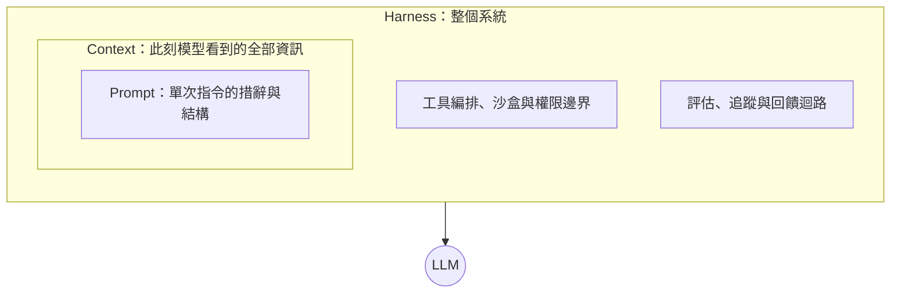
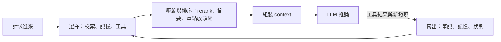
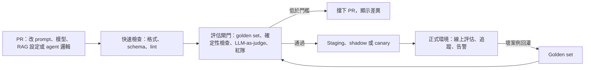

> 🌏 [English version](/en/posts/ai/2026-10-03-ai-interview-prompt-context-harness-en)

LLM 應用的面試常把一串問題連著問：Prompt Engineering 為什麼重要、Context Engineering 跟它差在哪、Harness Engineering 又是什麼、沒有評估會出什麼事、團隊要怎麼把 LLM 開發接上 CI/CD。這些題目看起來分散，其實在問同一件事：**模型出錯時，你知道該從哪一層下手嗎？**

這篇是「AI Engineer 面試準備」系列第 14 篇。主軸按三層由內到外展開：先看 Prompt，再看決定 prompt 裡放什麼的 Context，最後看包住兩者的 Harness，並以評估與 CI/CD 閘門收尾。每一節的寫法都是「概念 → 機制或比較 → 面試怎麼答」。名詞的細部展開，站內已有完整文章，文中會就地連過去。

## 先看全貌：三層由內到外

三層不是三個互相取代的時代，而是三個尺度。內層回答「這句話怎麼寫」，中層回答「這一步模型該看到什麼」，外層回答「整個系統怎麼讓一個會出錯的模型可靠地做事」。

這個命名的歷史不長。2025 年 6 月，Shopify CEO Tobi Lütke 先在推文中表示[比起 prompt engineering 更喜歡 context engineering 這個詞](https://simonwillison.net/2025/jun/27/context-engineering/)，Andrej Karpathy 隨後在[自己的推文](https://x.com/karpathy/status/1937902205765607626)裡表態支持；Anthropic 的工程團隊則在 [Effective context engineering for AI agents](https://www.anthropic.com/engineering/effective-context-engineering-for-ai-agents) 裡說，他們把 context engineering 視為 prompt engineering 的自然延伸。Harness 一詞在 2026 年 2 月因 OpenAI 的文章被廣泛討論，後文會細講。站內的[從 Prompt 到 Harness：AI 工程的三次演化](/posts/ai/2026-03-28-harness-engineering-evolution)有另一種整理。

| 層 | 核心問題 | 管的對象 | 典型失敗 | 第一個修法 |
|---|---|---|---|---|
| Prompt | 這句話該怎麼寫 | 指令、範例、輸出格式 | 模糊、格式不穩、推理跳步 | 寫清楚、給範例、要求逐步推理 |
| Context | 模型此刻需要什麼資訊 | 檢索、記憶、工具輸出、歷史 | 資訊太少、太多、互相矛盾 | 動態組裝、壓縮、隔離 |
| Harness | 怎麼讓系統可靠 | 工具、沙盒、約束、評估、觀測 | 越權、無限迴圈、沉默回歸 | 確定性檢查、回饋迴路、閘門 |

分界最實用的用法是**診斷順序**：輸出不對時，先檢查措辭有沒有歧義，再檢查模型有沒有拿到該拿的資訊，最後才檢查系統有沒有對錯誤設防。越外層的修法成本越高，但能一次解決整類問題。

**面試怎麼答**

先用一句話講包含關係：Prompt 是在 context window 裡做的事，Context 決定什麼進 window，Harness 把 context、工具、權限與評估包成可靠的系統。再補一句這不是取代而是換尺度，前面學的技巧都還在用。被追問時，用「出錯時由內而外診斷」收尾，面試官通常想聽的是這個判斷順序。

## 第一層 Prompt：把單次互動寫清楚

Prompt Engineering 是設計、優化並迭代輸入，來引導模型產生預期輸出的方法。[Liu 等人的綜述](https://arxiv.org/abs/2107.13586)把它放進 NLP 的範式轉移裡：從「預訓練再微調」變成「預訓練、提示、預測」，不重訓模型就能調整行為。[The Prompt Report](https://arxiv.org/abs/2406.06608) 彙整出 58 種文字提示技術，可以當作這個領域的地圖。

影響輸出品質的要素，面試常見的講法有六項：

| 要素 | 作用 | 證據與限制 |
|---|---|---|
| 指令明確度 | 少讓模型猜意圖 | [Bsharat 等人](https://arxiv.org/abs/2312.16171)的 26 條原則，在自建的 ATLAS 基準上讓 GPT-4 的回應品質平均提升 57.7%（人工評分，僅限 GPT-4 與該基準） |
| 上下文 | 縮小搜索空間、補上訓練資料沒有的資訊 | [Lewis 等人的 RAG](https://arxiv.org/abs/2005.11401) 把檢索到的外部知識注入 prompt，是這個思路的代表 |
| 角色 | 調整語氣、專業程度與視角 | [Zheng 等人](https://arxiv.org/abs/2311.10054)測了 162 種角色，persona 對事實題沒有穩定幫助 |
| Few-shot 範例 | 用範例示範輸入與輸出的對應 | [GPT-3 論文](https://arxiv.org/abs/2005.14165)展示不微調也能靠少量範例做新任務 |
| 輸出格式 | 提高可解析性、降低後處理成本 | 要保證格式，得靠 structured output 這類約束機制，而不只是在 prompt 裡拜託 |
| 推理引導 | 讓模型寫出中間步驟 | [Wei 等人](https://arxiv.org/abs/2201.11903)的 CoT 在 PaLM 540B 上，GSM8K 從 17.9% 升到 56.9% |

這張表有三個容易被講過頭的地方。

第一，57.7% 是「回應品質」而不是準確率，而且是人工評分、限定 GPT-4 與 ATLAS 基準。面試時引用要把這三個限定詞帶上，不然等於替論文放大主張。

第二，角色設定常被當成提升正確率的捷徑。Zheng 等人的論文在版本間結論還翻轉過：初版說人際角色有幫助，[最新版](https://arxiv.org/abs/2311.10054)改成加入 persona 並未提升表現、效果接近隨機。所以角色適合調整語氣與風格，不能代替提供資料。

第三，格式規範要分清楚「合法」與「正確」。OpenAI 在 2024 年 8 月推出的 [Structured Outputs](https://openai.com/index/introducing-structured-outputs-in-the-api) 讓輸出依開發者提供的 JSON Schema 產生，這解決的是格式，答案內容對不對還是得另外驗證。

CoT 還有一個零範例版本：[Kojima 等人](https://arxiv.org/abs/2205.11916)發現只要加上「Let's think step by step」，就能在多項推理任務上超越標準的零範例提示。

一個高品質 prompt 的骨架，大致是角色、背景、任務與限制、範例、輸出格式、推理引導，但不需要每次都塞滿六項。Anthropic 的建議反而是[從最小的 prompt 開始測](https://www.anthropic.com/engineering/effective-context-engineering-for-ai-agents)，依據實際失敗再加指令與範例。想看迭代流程，可讀站內的 [Prompt Engineering 實戰：迭代方法論、常見錯誤與 Few-shot 最佳化](/posts/ai/2026-03-13-prompt-engineering-iteration-guide)；想看 prompt 變更如何被版本化並綁上評估，可讀 [Prompt 版本控制：改一個字可能讓 eval 從 5/5 掉到 0/5](/posts/ai/2026-08-25-coding-agent-prompt-versioning)；RAG 情境下的 prompt 設計則在 [RAG Prompt Engineering](/posts/ai/2026-03-12-rag-prompt-engineering)。

**面試怎麼答**

先給定義與範式轉移，再挑三個最影響結果的要素講：指令明確度、提供資料、範例加推理引導。主動說出角色設定的限制，會比背六項清單加分。最後補一句怎麼系統化改 prompt：建測試集、一次只改一處、跑評估看回歸，不憑感覺。

## 第二層 Context：決定什麼資訊進入 window

### 定義與分界

Context Engineering 的目標，是在對的時間、以對的格式，把對的資訊與工具送進模型。Karpathy 的說法是「為下一步，把 context window 填上恰到好處的資訊」，他把它拆成任務描述、few-shot、RAG、工具、狀態與歷史、壓縮等項目，兼具科學與藝術。Anthropic 的定義更偏工程：[在推論期間策展並維護最佳的 token 集合](https://www.anthropic.com/engineering/effective-context-engineering-for-ai-agents)，包含 prompt 以外會進到模型眼前的所有東西。

與 Prompt 的差別有三個。範疇上，Prompt 問「怎麼措辭」，Context 問「模型現在需要存取什麼」；時間上，Prompt 優化單次互動，Context 要思考序列，也就是前幾輪留下什麼、哪些工具輸出要帶到三步之後；成熟度上，Context 更像系統設計。Karpathy 的 [LLM 即作業系統](https://www.youtube.com/watch?v=LCEmiRjPEtQ)比喻，經 [LangChain 整理](https://blog.langchain.com/context-engineering-for-agents/)成「LLM 像 CPU、context window 像 RAM」，這句話出自 LangChain 的整理，不是 Karpathy 推文的原文，引用時要分清楚。

學術上，[Mei 等人的綜述](https://arxiv.org/abs/2507.13334)分析了超過 1,400 篇論文，提出 context engineering 的分類法，是目前最適合引用的學術出處。另有兩篇 2026 年的預印本，[Calboreanu 的實務方法論](https://arxiv.org/abs/2604.04258)與 [Vishnyakova 的企業多 agent 架構](https://arxiv.org/abs/2603.09619)，都是單一作者；前者是 200 筆互動的觀察性研究、沒有對照組，證據強度有限，只適合當背景。產業端，Gartner 在 2026 年 3 月的[資料與分析預測新聞稿](https://www.gartner.com/en/newsroom/press-releases/2026-03-11-gartner-announces-top-predictions-for-data-and-analytics-in-2026)也把「對 context 的需求」列為 AI 影響的面向之一。

### Context 由什麼組成

一個 agent 在某個時間點的 context，通常包含這些部件：

| 部件 | 內容 | 常見問題 |
|---|---|---|
| System prompt | 角色、規則、邊界 | 寫得太死或太空泛 |
| 使用者輸入 | 本輪請求，可能來自人或上游 agent | 需求逐輪補充而互相衝突 |
| 對話歷史 | 前幾輪的來回 | 越積越長 |
| 檢索知識 | 向量庫、搜尋、API 取回的片段 | 相關但不能用，或排序錯 |
| 工具描述 | 可用動作與參數 schema | 工具太多、描述重疊 |
| 任務 metadata | 使用者屬性、權限、限制 | 缺漏導致越權或答非所問 |
| 範例 | few-shot 的輸入輸出對 | 塞滿邊角案例 |
| 長期記憶 | 跨對話保存的偏好與結論 | 過期或被污染 |

[LangChain](https://blog.langchain.com/context-engineering-for-agents/) 把 context 粗分成指令、知識與工具回饋三類，也很好記。站內的 [Context Engineering：為什麼你的 AI Agent 問題出在資訊，不在模型](/posts/ai/2026-03-24-context-engineering-guide)有完整的圖示與案例。

### 設計不佳會怎麼壞

最直覺的分法是三種：資訊太少，模型只能猜，結果是幻覺；資訊太多，注意力被稀釋、成本與延遲上升；資訊互相衝突，模型不知道聽誰的。Drew Breunig 把「太多與衝突」細分成[四種失敗](https://www.dbreunig.com/2025/06/22/how-contexts-fail-and-how-to-fix-them.html)：

| 失敗模式 | 說明 | 一個具體例子 |
|---|---|---|
| Poisoning 毒化 | 幻覺或錯誤進了 context，被反覆引用 | Gemini 2.5 技術報告描述玩 Pokémon 時，目標欄位被錯誤資訊污染，很久才能糾正 |
| Distraction 分心 | context 太長，模型過度依賴歷史 | 同一份報告觀察到 context 遠超 10 萬 token 後，agent 傾向重複過去動作 |
| Confusion 混淆 | 多餘內容被拿來生成回答 | 在 46 個工具的 GeoEngine 基準上，量化小模型即使沒超出 window 也答不出來 |
| Clash 衝突 | 新資訊與舊資訊互相矛盾 | Microsoft 與 Salesforce 的[多輪研究](https://arxiv.org/abs/2505.06120)把完整指令拆成多輪揭露，平均表現下降 39% |

位置也會出問題。[Lost in the Middle](https://arxiv.org/abs/2307.03172)（TACL 2024）發現，相關資訊在輸入開頭或結尾時表現最好，擺在長 context 中間時明顯變差，即使是明確支援長 context 的模型也一樣。Anthropic 引用 Chroma 提出的 [context rot](https://research.trychroma.com/context-rot) 概念描述這個現象：token 越多，模型從中準確回想資訊的能力越低，因此 context 應被當成邊際效益遞減的有限資源。

這也回答了常見的追問「context window 變大還需要 context engineering 嗎」：需要。更大的 window 讓你放得進去，不代表模型用得好，而且越長越貴、越慢。

### 架構層級怎麼提升 context 品質

核心原則是 Anthropic 那句：找出能最大化期望結果機率的**最小高訊號 token 集合**。落到架構，有五件事。

1. **動態組裝**：context 不是靜態模板，而是主要 LLM 呼叫之前一段程式的輸出，每次依任務決定放什麼。
2. **檢索加 rerank 加壓縮**：先取回候選，再用 reranker 留下最有用的少數片段，必要時摘要成重點。站內的 [RAG 評估框架與工具選型](/posts/ai/2026-03-12-rag-evaluation-frameworks)可以接著看怎麼量這一段。
3. **按需檢索**：Anthropic 描述的[即時載入](https://www.anthropic.com/engineering/effective-context-engineering-for-ai-agents)做法，是 agent 只保留檔案路徑、查詢等輕量識別，需要時才透過工具把資料讀進來；代價是比預先算好的檢索慢，且要靠設計讓模型知道怎麼找。
4. **壓縮與修剪**：長任務可以靠 compaction（摘要後重開視窗）、結構化筆記，以及子 agent。Anthropic 的做法是保留架構決策與未解問題、丟掉重複的工具輸出。壓縮最難的是選擇保留什麼，過度壓縮會丟掉日後才發現重要的細節。
5. **隔離**：LangChain 的 write、select、compress、isolate 四分法裡，隔離指的是多 agent 各用乾淨的 window，或把大物件留在沙盒，只回傳摘要。

另外別忘了把可觀測性當成設計條件：記錄實際送進模型的 prompt、取回的片段與輸出，否則根本不知道是哪一部件出了問題。

**面試怎麼答**

定義用「對的時間、對的格式、對的資訊與工具」，差異用「措辭 vs 資訊、單次 vs 序列」。組成講六到八項即可，失敗模式用「太少、太多、衝突」三分，再補 Breunig 的四種與 Lost in the Middle 展現深度。架構策略挑三個講透：動態組裝、壓縮修剪、隔離，最後強調 token 成本與延遲是設計變數。

## 第三層 Harness：包住非確定性核心的整套工程

### 定義與角色

Harness 的通俗定義，是 AI agent 裡除了模型以外的一切：[LangChain 的說法](https://blog.langchain.com/the-anatomy-of-an-agent-harness/)是 Agent = Model + Harness，Böckeler 在 Fowler 站上的[分析](https://martinfowler.com/articles/harness-engineering.html)也引用了這個公式。它與 Prompt 和 Context 的關係是包含：Prompt 是 harness 可能用到的技術，Context 管理是 harness 的一項職責，但 harness 還要管工具執行、權限邊界、錯誤處理與整個互動迴路。

這個領域與傳統軟體工程的差別，在於核心是非確定性的。Harness 必須預期模型會說出或做出意料之外的事，並設計成能優雅地處理。Karpathy 在那則推文裡就提過，context engineering 只是一層「厚厚的軟體」中的一小塊，其餘還有控制流拆解、模型調度、guardrails、安全、evals、平行化等，這幾乎是 harness 的清單。

### OpenAI 的案例與 Böckeler 的歸納

2026 年 2 月，OpenAI 的 Ryan Lopopolo 發表 [Harness engineering: leveraging Codex in an agent-first world](https://openai.com/index/harness-engineering/)。依 OpenAI 自述（非獨立審計），團隊用 Codex 在約五個月內做出一個約一百萬行程式碼的內部產品，約 1,500 個 PR，零行手寫。文章把工程師的工作重心描述成設計環境、指定意圖與建立回饋迴路。站內有完整導讀：[OpenAI 用 Codex 寫了 100 萬行程式碼：Harness Engineering 實戰](/posts/ai/2026-04-21-openai-harness-engineering-codex-agent-first)。

Birgitta Böckeler 在 Fowler 站上的[初步筆記](https://martinfowler.com/articles/exploring-gen-ai/harness-engineering-memo.html)，把 OpenAI 團隊的 harness 歸納成三類。她在文中註明這是自己的詮釋，不是 OpenAI 原文的小標：

- **Context engineering**：持續充實的程式庫內知識庫，加上 agent 可存取的動態資訊，例如可觀測性資料與瀏覽器操作。
- **架構約束**：不只由 LLM 型 agent 監督，也由確定性的自訂 linter 與結構測試把關。
- **垃圾回收**：定期執行的 agent，找出文件不一致或違反架構約束的地方，對抗熵與腐化。

這篇筆記後來被她的[完整文章](https://martinfowler.com/articles/harness-engineering.html)取代，新文章改用 guides（事前的前饋控制）與 sensors（事後的回饋控制）兩個軸，再按執行方式分成 computational（確定性、快、跑在 CPU 上，如測試、linter、型別檢查）與 inferential（語意分析、LLM-as-judge，慢、貴、較不確定）。面試時講到這裡，等於證明你追到了最新版。筆記裡她也指出一個缺口：OpenAI 的文章沒有談功能與行為層面的驗證，這正是下一節評估要補的。

OpenAI 後來把這套東西平台化：[Codex as a platform](https://developers.openai.com/blog/codex-as-a-platform) 一文主張開源的 Codex harness 驅動 App、CLI 與 IDE 擴充，並可透過 `codex exec`、Codex SDK 與 app-server 嵌入自家產品。時間點只能說是 2026 年夏天；[Codex CLI](https://github.com/openai/codex) 本身 2025 年 4 月就已開源，所以這不是「首次公開」。同一篇文章還舉了 [ARC-AGI-3 的例子](https://developers.openai.com/blog/codex-as-a-platform)：保留推理與 context compaction，讓 GPT-5.6 Sol 的分數提高近三倍，這是 OpenAI 對自家模型與 harness 的自述。

### Harness 的構成，以及近期的研究

把 OpenAI 與 Böckeler 的框架，加上站內的整理，可以得到一份面試用的構成清單：

| 構成 | 負責什麼 |
|---|---|
| Context 管理 | 動態組裝、壓縮、記憶、知識庫 |
| 工具編排 | 工具註冊、選擇、結果處理 |
| 沙盒與核准邊界 | 執行環境隔離、最小權限、高風險動作的人工確認 |
| 確定性約束 | linter、結構測試、schema 驗證 |
| 回饋迴路 | 失敗訊號回到模型、讓它自我修正 |
| 可觀測性 | 追蹤、日誌、成本與延遲 |
| 工作階段管理 | 多輪狀態、checkpoint 與續跑 |

站內的 [Harness Engineering 進階模式](/posts/ai/2026-03-30-harness-engineering-patterns)談 Tool Registry、Guard System 與 Checkpoint-Resume，[Anthropic 的 Harness Design](/posts/ai/2026-03-28-anthropic-harness-design)與 [Phil Schmid 談 Agent Harness](/posts/ai/2026-03-28-phil-schmid-agent-harness)提供另外兩個視角，[模型只是元件，harness 才是系統](/posts/ai/2026-08-10-model-component-harness-system)則整理了多家公司的收斂結論。

2026 年起這個主題也有了預印本。證據強度各不相同，面試引用時要說清楚：

| 論文 | 內容 | 證據強度 |
|---|---|---|
| [Harness Engineering for Agentic AI Coding Tools](https://arxiv.org/abs/2602.14690) | 對 2,853 個 GitHub 專案的探索研究，發現 context 檔案占主導、AGENTS.md 成為互通格式 | 多作者實證，已標示發表於 AIware 2026 |
| [Natural-Language Agent Harnesses](https://arxiv.org/abs/2603.25723) | 以自然語言描述 harness 規格 | 方法提案 |
| [Agentic Harness Engineering](https://arxiv.org/abs/2604.25850) | 以可觀測性驅動 harness 的自動演化 | 多作者方法論文 |
| [From Model Scaling to System Scaling](https://arxiv.org/abs/2605.26112) | 主張擴展 harness 與擴展模型同等重要 | 單一作者，立場型論文，不是實驗證據 |
| [Adapting the Interface, Not the Model](https://arxiv.org/abs/2605.22166) | 執行期調整 harness 介面；在 126 個模型與環境組合中改善了 116 個 | 頁面標註為 work in progress |

### 另一個「harness」：評估框架

「harness」在評估領域還有另一個意思，也要分清楚。[EleutherAI 的 LM Evaluation Harness](https://github.com/EleutherAI/lm-evaluation-harness)是統一的模型評測框架，讓不同模型在同一份程式碼與輸入上被測試。[Maiorano 的 LLM Readiness Harness](https://arxiv.org/abs/2603.27355)則是把評估變成部署決策流程，結合基準測試、OpenTelemetry 與 CI 品質閘門，屬於單一作者的預印本。這兩者說的是「評測用的 harness」，與 agent 的執行 harness 是不同東西。

**面試怎麼答**

先講定義：harness 是包在非確定性模型外面的整套工程，人類負責設計環境、指定意圖、建立回饋迴路。再用 Böckeler 的三類或 guides 與 sensors 說明組成，並主動標註那是她的詮釋、且後來改了框架。最後點出 harness 有「執行」與「評測」兩種語意，讓面試官看到你分得清楚。

## 評估與監控：harness 裡最容易被省略的一塊

### 完整的評估與監控系統要有哪些能力

| 能力 | 做什麼 | 為什麼需要 |
|---|---|---|
| 多維指標 | 同時看任務成功率、策略合規、groundedness、檢索命中、成本、p95 延遲 | 就緒度不是單一分數 |
| 混合評分 | 確定性檢查（JSON 合法、PII 偵測）、統計指標、LLM-as-judge | 每種方法的盲點不同 |
| CI 品質閘門 | 低於門檻就擋 PR，並在 PR 上顯示差異 | 把評估從報告變成決策 |
| 追蹤與可觀測性 | 元件層級追蹤，知道 pipeline 的哪一段壞 | 避免做不必要的更動 |
| 線上持續評估 | 對正式流量抽樣評分、告警 | 離線集合跟不上真實分布 |
| 回灌機制 | 壞案例標記後加入評估集 | 每個事故變成永久防護 |

Maiorano 的結果提供了「不是單一指標」的具體例子：在 FiQA 的 SLA 優先情境下，gpt-4.1-mini 的[就緒度與忠實度領先](https://arxiv.org/abs/2603.27355)，而 gpt-5.2 付出明顯的延遲代價。同一篇的工單分流實驗也顯示，回歸閘門能穩定擋下不安全的 prompt 變體。這是單一作者的結果，適合拿來說明設計思路，不宜當成通則。

混合評分裡最常被追問的是 LLM-as-judge 可不可信。它有偏誤，所以要用人工標註校準、固定 rubric，關鍵項目再補確定性檢查。站內的[調整 agent 之後，怎麼嚴謹比較前後差異](/posts/ai/2026-06-04-agent-change-rigorous-evaluation)談了 golden set 規模、judge 偏誤與統計檢定，[Self-Reflection + LLM-as-Judge](/posts/ai/2026-03-12-self-reflection-llm-as-judge)則談讓模型評估自己的做法。工具面可以參考 [Promptfoo](/posts/ai/2026-08-22-promptfoo-llm-evaluation)、[Braintrust](/posts/ai/2026-08-22-braintrust-llm-evaluation)與 [Arize Phoenix](/posts/ai/2026-08-22-arize-phoenix-observability-evaluation)，可觀測性則有 [Langfuse 完整指南](/posts/ai/2026-03-26-langfuse-llm-observability-guide)與 [Agent 可觀測性：從 OTel Trace 到抓出幻覺、工具誤用與無限迴圈](/posts/ai/2026-06-04-agent-observability-failure-detection)。

### 缺乏評估的風險

沒有評估，風險不是一次爆發，而是慢慢累積且看不見：

- **沉默回歸**：為了修一個問題而改了 prompt，結果悄悄弄壞三個別的案例。這是 LLM 開發最典型的風險，因為輸出非確定，傳統斷言抓不到。
- **幻覺外流**：沒人量測 groundedness，錯誤答案直接到使用者手上。
- **漂移**：供應商更新模型、使用者的提問分布改變，昨天通過的案例今天悄悄失敗，只有持續評估才看得到。
- **安全與隱私**：prompt injection、敏感資訊洩漏。站內的 [Agent 安全：prompt injection 與信任邊界](/posts/ai/2026-06-04-agent-security-prompt-injection-trust-boundaries)談了防禦怎麼分層。
- **連鎖失敗**：當輸出接到其他自動化流程，一個錯誤會被放大成營運事故，高風險流程要保留人工確認。
- **合規與責任**：沒有紀錄與測試，就無法證明系統在邊界條件下的行為。

**面試怎麼答**

用「多維指標、混合評分、閘門、追蹤、線上評估、回灌」六個詞開場，每個一句話。風險則抓「沉默回歸」當主角，因為它最能說明為什麼 LLM 需要像軟體一樣的回歸測試。被追問 judge 可信度時，講校準、固定 rubric、加確定性檢查。

## 團隊導入：LLM 開發的 CI/CD 與評估閘門

傳統 CI 的前提是輸出可以用斷言判斷對錯。LLM 的輸出範圍太廣，得改用「與標準答案比較」或「請另一個模型當裁判」。因此整條流程長得像這樣：

逐階段來看，每一階段都要能回答「擋什麼、怎麼擋、成本多高」：

1. **觸發條件**：不只程式碼，prompt、模型版本、RAG 設定、agent 邏輯、工具描述任一變更都要觸發。這些東西都要放進版本控制，包括評估資料集，否則結果無法重現。
2. **快速檢查**：JSON 合法、schema 通過、lint，毫秒到秒級，每次提交都跑。Böckeler 提到的[把品質往左移](https://martinfowler.com/articles/harness-engineering.html)就是這個意思：便宜的檢查放在整合之前，昂貴的（較大範圍的審查、變異測試）才放到整合之後。
3. **評估閘門**：用凍結的 golden set 跑，確定性檢查先，LLM-as-judge 補語意；每題多跑幾次看通過率，而不是單次對錯。門檻要明確，低於門檻就擋 PR，並在 PR 上貼出與主線的差異。可用 [DeepEval](https://github.com/confident-ai/deepeval) 這類 pytest 風格的框架，或前面提到的 Promptfoo。
4. **預備環境**：staging 之外，可用 shadow 部署（複製流量但不回給使用者）、canary 與 A/B，再搭配人工抽檢。這一層量延遲與成本。
5. **正式環境監控**：線上抽樣評分、drift 偵測、異常告警，並收集使用者回饋。
6. **回灌**：壞案例標記後進 golden set，讓每個事故都成為永久的測試。站內的 [AI-Native SDLC Playbook L9](/posts/ai/2026-09-12-ai-native-sdlc-playbook-09-ci-evals)就是用這個思路做 agent 設定的 CI。

模型選型也要放進這個流程。就緒度要依情境加權（成本優先、風險優先、延遲優先），而不是追單一最高分。

**今晚就能做的第一步**：收集 20 到 50 個真實案例當 golden set，接上一個最簡單的 CI 檢查，先讓「改 prompt 會被測到」成立，再逐步加維度。站內的 L9 文章同樣建議從這個規模起步。

**面試怎麼答**

用四個階段說完整流程：開發、評估閘門、部署（shadow、canary、A/B）、生產監控，然後補上「壞案例回灌」這個閉合動作。被問到非確定性怎麼測，答多次取樣看通過率、門檻設區間。被問到怎麼起步，答 20 到 50 個真實案例加一個最簡單的 CI 檢查，不要一開始就追求完整平台。

## 整體來說

三層的取捨可以濃縮成一條線：越往外，投入越大，也越能一次消滅整類錯誤。Prompt 便宜、見效快，但天花板低；Context 決定模型有沒有機會答對；Harness 決定錯了之後系統能不能自己發現並止血。評估是 harness 的一部分，也是唯一能讓前兩層的改動「可以被證明有效」的機制。

| 常被追問 | 一句話答法 |
|---|---|
| Prompt Engineering 會過時嗎 | 技巧仍是基礎，但重心已上移到 context 與 harness |
| 角色設定真的有用嗎 | 有助於語氣與深度，對事實正確率沒有穩定幫助 |
| Window 變大還需要 context engineering 嗎 | 需要，越長越貴越慢，準確度也會隨長度退化 |
| LLM-as-judge 可信嗎 | 有偏誤，要校準、固定 rubric、加確定性檢查 |

## 題庫裡常見的題目

下面是從 7 個公開題庫（各題庫的比較見[系列第 11 篇](/posts/ai/2026-09-30-ai-engineer-interview-resources)）整理出來、跨題庫重複出現的題目，另補幾題對得上本文各節的新題型。「獨立來源數」只代表題庫之間的重疊，不代表真實面試的頻率；其中 amitshekhar 與 pallavi 兩個題庫沒有來源，它們的公司標籤本文不採用。這裡只列題目與出處連結，沒有轉載答案。

| 題目 | 獨立來源數 | 題庫連結 | 本文對應段落 |
|---|---|---|---|
| LLM／RAG 系統怎麼評估？評估方法有哪些類型、該用哪些指標 | 4 | [om](https://github.com/ombharatiya/AI-Engineer-Interview-Questions/blob/main/07-evaluation-and-observability/questions.md#2-walk-me-through-the-taxonomy-of-evaluation-methods-for-llm-systems-and-when-youd-use-each) · [aeg](https://github.com/alexeygrigorev/ai-engineering-field-guide/blob/main/interview/questions/questions.md?plain=1#L146) · [AIML](https://github.com/alirezadir/AIMLInterviews/blob/main/src/ml-fundamental.md#llm--genai--multimodal-sample-questions-2026) · [amit](https://github.com/amitshekhariitbhu/ai-engineering-interview-questions/blob/main/README.md#L682) | 完整的評估與監控系統要有哪些能力 |
| 什麼是 few-shot 與 chain-of-thought 提示？CoT 何時該用 | 3 | [aeg](https://github.com/alexeygrigorev/ai-engineering-field-guide/blob/main/interview/questions/questions.md?plain=1#L16) · [amit](https://github.com/amitshekhariitbhu/ai-engineering-interview-questions/blob/main/README.md#L224) · [ks](https://github.com/KalyanKS-NLP/LLM-Interview-Questions-and-Answers-Hub/blob/main/Interview_QA/QA_73-75.md) | 第一層 Prompt：把單次互動寫清楚 |
| 為什麼大家說「evals 就是護城河」？憑感覺評估與正式 eval 框架差在哪 | 3 | [om](https://github.com/ombharatiya/AI-Engineer-Interview-Questions/blob/main/07-evaluation-and-observability/questions.md#1-why-do-people-say-evals-are-the-moat-for-ai-products-what-makes-them-the-core-engineering-artifact) · [aeg](https://github.com/alexeygrigorev/ai-engineering-field-guide/blob/main/interview/questions/questions.md?plain=1#L152) · [amit](https://github.com/amitshekhariitbhu/ai-engineering-interview-questions/blob/main/README.md#L679) | 評估與監控：harness 裡最容易被省略的一塊 |
| 如何評估 agent？軌跡評估與最終結果評估的差別，以及 SWE-bench 通過率為何可能誤導 | 3 | [om](https://github.com/ombharatiya/AI-Engineer-Interview-Questions/blob/main/06-agents-and-tool-use/questions.md#28-how-do-you-evaluate-an-agent-compare-trajectory-evals-and-final-outcome-evals) · [aeg](https://github.com/alexeygrigorev/ai-engineering-field-guide/blob/main/interview/questions/questions.md?plain=1#L117) · [amit](https://github.com/amitshekhariitbhu/ai-engineering-interview-questions/blob/main/README.md#L705) · [pal](https://github.com/pallavi-shekhar/ai-engineering-interview-questions-company-wise/blob/main/README.md#L327) | 完整的評估與監控系統要有哪些能力 |
| 正式環境如何做 prompt 版本管理與回滾 | 3 | [om](https://github.com/ombharatiya/AI-Engineer-Interview-Questions/blob/main/03-prompt-engineering-and-context/questions.md#25-how-do-you-version-and-govern-prompts-in-production-someone-asks-which-prompt-produced-a-bad-output-three-weeks-ago---can-you-answer) · [aeg](https://github.com/alexeygrigorev/ai-engineering-field-guide/blob/main/interview/questions/questions.md?plain=1#L104) · [amit](https://github.com/amitshekhariitbhu/ai-engineering-interview-questions/blob/main/README.md#L620) · [pal](https://github.com/pallavi-shekhar/ai-engineering-interview-questions-company-wise/blob/main/README.md#L324) | 團隊導入：LLM 開發的 CI/CD 與評估閘門 |
| 如何讓 LLM 穩定輸出結構化格式（JSON、XML） | 2 | [amit](https://github.com/amitshekhariitbhu/ai-engineering-interview-questions/blob/main/README.md#L231) · [ks](https://github.com/KalyanKS-NLP/LLM-Interview-Questions-and-Answers-Hub/blob/main/Interview_QA/QA_85-87.md) | 第一層 Prompt：把單次互動寫清楚 |
| 什麼是 context engineering？它和 prompt engineering 有何不同 | 2 | [om](https://github.com/ombharatiya/AI-Engineer-Interview-Questions/blob/main/03-prompt-engineering-and-context/questions.md#6-what-is-context-engineering-and-how-is-it-different-from-prompt-engineering) · [amit](https://github.com/amitshekhariitbhu/ai-engineering-interview-questions/blob/main/README.md#L366) | 定義與分界 |
| 什麼是 context rot？長時間執行的 agent 如何做上下文壓縮（compaction） | 2 | [om](https://github.com/ombharatiya/AI-Engineer-Interview-Questions/blob/main/03-prompt-engineering-and-context/questions.md#37-what-is-context-rot-and-what-compaction-strategies-do-you-use-in-long-running-agents) · [amit](https://github.com/amitshekhariitbhu/ai-engineering-interview-questions/blob/main/README.md#L368) | 架構層級怎麼提升 context 品質 |
| 上下文視窗超過上限會怎樣？如何處理長文件與 lost in the middle 問題 | 2 | [aeg](https://github.com/alexeygrigorev/ai-engineering-field-guide/blob/main/interview/questions/questions.md?plain=1#L44) · [amit](https://github.com/amitshekhariitbhu/ai-engineering-interview-questions/blob/main/README.md#L247) | 設計不佳會怎麼壞 |
| Claude Code 這類 coding agent，模型與 harness 何者更重要 | 2 | [om](https://github.com/ombharatiya/AI-Engineer-Interview-Questions/blob/main/14-company-interview-questions/anthropic.md) · [amit](https://github.com/amitshekhariitbhu/ai-engineering-interview-questions/blob/main/README.md#L338) · [pal](https://github.com/pallavi-shekhar/ai-engineering-interview-questions-company-wise/blob/main/README.md#L485) | 定義與角色 |
| 為新的旗艦模型發布建立評估框架（evaluation harness），它需要做到什麼 | 2 | [om](https://github.com/ombharatiya/AI-Engineer-Interview-Questions/blob/main/14-company-interview-questions/google-deepmind.md) · [pal](https://github.com/pallavi-shekhar/ai-engineering-interview-questions-company-wise/blob/main/README.md#L643) | 另一個「harness」：評估框架 |
| LLM-as-a-judge 有哪些已知偏誤與限制，如何修正 | 2 | [om](https://github.com/ombharatiya/AI-Engineer-Interview-Questions/blob/main/07-evaluation-and-observability/questions.md#16-what-are-the-known-biases-of-llm-judges-and-how-do-you-mitigate-each) · [amit](https://github.com/amitshekhariitbhu/ai-engineering-interview-questions/blob/main/README.md#L688) · [pal](https://github.com/pallavi-shekhar/ai-engineering-interview-questions-company-wise/blob/main/README.md#L308) | 完整的評估與監控系統要有哪些能力 |
| 什麼是 LLM 可觀測性？為正式環境的 LLM 應用設計可觀測性架構 | 2 | [om](https://github.com/ombharatiya/AI-Engineer-Interview-Questions/blob/main/07-evaluation-and-observability/questions.md#42-design-the-observability-stack-for-a-production-llm-application-what-does-a-good-trace-look-like) · [amit](https://github.com/amitshekhariitbhu/ai-engineering-interview-questions/blob/main/README.md#L609) · [pal](https://github.com/pallavi-shekhar/ai-engineering-interview-questions-company-wise/blob/main/README.md#L322) | 完整的評估與監控系統要有哪些能力 |
| 如何在正式環境做持續（線上）評估與監控，並偵測漂移 | 2 | [aeg](https://github.com/alexeygrigorev/ai-engineering-field-guide/blob/main/interview/questions/questions.md?plain=1#L148) · [amit](https://github.com/amitshekhariitbhu/ai-engineering-interview-questions/blob/main/README.md#L712) · [pal](https://github.com/pallavi-shekhar/ai-engineering-interview-questions-company-wise/blob/main/README.md#L325) | 完整的評估與監控系統要有哪些能力 |
| 如何在正式環境量測幻覺率 | 2 | [aeg](https://github.com/alexeygrigorev/ai-engineering-field-guide/blob/main/interview/questions/questions.md?plain=1#L151) · [pal](https://github.com/pallavi-shekhar/ai-engineering-interview-questions-company-wise/blob/main/README.md#L313) | 缺乏評估的風險 |
| 對 500 筆被標為失敗的正式環境對話做錯誤分析；準確率掉了一截時如何找根本原因 | 2 | [om](https://github.com/ombharatiya/AI-Engineer-Interview-Questions/blob/main/07-evaluation-and-observability/questions.md#27-you-have-500-production-transcripts-flagged-as-failures-walk-me-through-your-error-analysis-process) · [aeg](https://github.com/alexeygrigorev/ai-engineering-field-guide/blob/main/interview/questions/questions.md?plain=1#L159) | 缺乏評估的風險 |
| 如何把 evals 接進 CI，讓 prompt 或模型變更不會悄悄退步；AI 應用的 CI/CD 有何不同 | 2 | [om](https://github.com/ombharatiya/AI-Engineer-Interview-Questions/blob/main/07-evaluation-and-observability/questions.md#25-how-do-you-wire-evals-into-ci-so-that-prompt-or-model-changes-cant-silently-regress-quality) · [amit](https://github.com/amitshekhariitbhu/ai-engineering-interview-questions/blob/main/README.md#L619) · [pal](https://github.com/pallavi-shekhar/ai-engineering-interview-questions-company-wise/blob/main/README.md#L315) | 團隊導入：LLM 開發的 CI/CD 與評估閘門 |
| 如何建立 golden dataset 與回歸測試集 | 2 | [aeg](https://github.com/alexeygrigorev/ai-engineering-field-guide/blob/main/interview/questions/questions.md?plain=1#L153) · [amit](https://github.com/amitshekhariitbhu/ai-engineering-interview-questions/blob/main/README.md#L695) | 團隊導入：LLM 開發的 CI/CD 與評估閘門 |
| LLM 系統如何做 A/B 測試？新模型全面部署前如何以 canary、shadow 測試 | 2 | [aeg](https://github.com/alexeygrigorev/ai-engineering-field-guide/blob/main/interview/questions/questions.md?plain=1#L156) · [amit](https://github.com/amitshekhariitbhu/ai-engineering-interview-questions/blob/main/README.md#L618) | 團隊導入：LLM 開發的 CI/CD 與評估閘門 |
| 給 coding agent 的 repo 指示檔（如 AGENTS.md、CLAUDE.md）該放什麼、不該放什麼 | 1 | [om](https://github.com/ombharatiya/AI-Engineer-Interview-Questions/blob/main/03-prompt-engineering-and-context/questions.md#35-what-belongs-in-a-repository-instruction-file-such-as-agentsmd-or-claudemd-for-a-coding-agent-and-what-should-stay-out) | Harness 的構成，以及近期的研究 |
| 除了準確度，AI 系統還有哪些營運與商業指標重要 | 1 | [aeg](https://github.com/alexeygrigorev/ai-engineering-field-guide/blob/main/interview/questions/questions.md?plain=1#L147) | 完整的評估與監控系統要有哪些能力 |
| 新版模型各項 benchmark 都更高，使用者卻說變差了，原因與排查方式 | 1 | [amit](https://github.com/amitshekhariitbhu/ai-engineering-interview-questions/blob/main/README.md#L700) · [pal](https://github.com/pallavi-shekhar/ai-engineering-interview-questions-company-wise/blob/main/README.md#L317) | 完整的評估與監控系統要有哪些能力 |
| 對非確定性輸出，測試策略是什麼 | 1 | [aeg](https://github.com/alexeygrigorev/ai-engineering-field-guide/blob/main/interview/questions/questions.md?plain=1#L145) | 團隊導入：LLM 開發的 CI/CD 與評估閘門 |
| 新 prompt 在 100 筆評測拿 78%、舊的是 74%，要上線嗎 | 1 | [om](https://github.com/ombharatiya/AI-Engineer-Interview-Questions/blob/main/07-evaluation-and-observability/questions.md#41-your-new-prompt-scores-78-vs-the-old-prompts-74-on-a-100-example-eval-do-you-ship-it) | 團隊導入：LLM 開發的 CI/CD 與評估閘門 |

獨立來源數的算法：amit 與 pal 疑似由同一機構維護，且有 26 題近乎逐字相同，合算 1 個來源；ks 的兩個題庫同作者，合算 1 個來源；om、aeg、AIML 各算 1 個，所以最大值是 5。本節只列題目標題與連結，答案請回原 repo 查看。

## 系列其他篇

- [RAG 變體](/posts/ai/2026-10-03-ai-interview-rag-variants)
- [Agent、MCP 與 Prompt Caching](/posts/ai/2026-10-03-ai-interview-agent-mcp-caching)
- [LLM 工程](/posts/ai/2026-10-03-ai-interview-llm-engineering)
- [ML 與 Transformer 基礎](/posts/ai/2026-10-03-ai-interview-ml-transformer-basics)
- [系統設計、程式題與行為面試](/posts/ai/2026-10-03-ai-interview-design-coding-behavioral)

## 參考資料

### Prompt 層

- [Pre-train, Prompt, and Predict: A Systematic Survey of Prompting Methods in NLP](https://arxiv.org/abs/2107.13586)（Liu 等人）
- [The Prompt Report: A Systematic Survey of Prompt Engineering Techniques](https://arxiv.org/abs/2406.06608)（Schulhoff 等人）
- [Principled Instructions Are All You Need for Questioning LLaMA-1/2, GPT-3.5/4](https://arxiv.org/abs/2312.16171)（Bsharat 等人）
- [Retrieval-Augmented Generation for Knowledge-Intensive NLP Tasks](https://arxiv.org/abs/2005.11401)（Lewis 等人）
- [When "A Helpful Assistant" Is Not Really Helpful: Personas in System Prompts Do Not Improve Performances of Large Language Models](https://arxiv.org/abs/2311.10054)（Zheng 等人，Findings of EMNLP 2024）
- [Language Models are Few-Shot Learners](https://arxiv.org/abs/2005.14165)（Brown 等人）
- [Chain-of-Thought Prompting Elicits Reasoning in Large Language Models](https://arxiv.org/abs/2201.11903)（Wei 等人）
- [Large Language Models are Zero-Shot Reasoners](https://arxiv.org/abs/2205.11916)（Kojima 等人）
- [Introducing Structured Outputs in the API](https://openai.com/index/introducing-structured-outputs-in-the-api)（OpenAI）

### Context 層

- [Andrej Karpathy 的 context engineering 推文](https://x.com/karpathy/status/1937902205765607626)
- [Simon Willison：Context engineering](https://simonwillison.net/2025/jun/27/context-engineering/)（內含 Tobi Lütke 推文）
- [Anthropic：Effective context engineering for AI agents](https://www.anthropic.com/engineering/effective-context-engineering-for-ai-agents)
- [LangChain：Context Engineering](https://blog.langchain.com/context-engineering-for-agents/)
- [Drew Breunig：How Long Contexts Fail](https://www.dbreunig.com/2025/06/22/how-contexts-fail-and-how-to-fix-them.html)
- [Lost in the Middle: How Language Models Use Long Contexts](https://arxiv.org/abs/2307.03172)（Liu 等人）
- [Chroma：Context Rot](https://research.trychroma.com/context-rot)
- [Microsoft 與 Salesforce 的多輪對話研究（arXiv:2505.06120）](https://arxiv.org/abs/2505.06120)
- [A Survey of Context Engineering for Large Language Models](https://arxiv.org/abs/2507.13334)（Mei 等人）
- [Context Engineering: A Practitioner Methodology for Structured Human-AI Collaboration](https://arxiv.org/abs/2604.04258)（單一作者）
- [Context Engineering: From Prompts to Corporate Multi-Agent Architecture](https://arxiv.org/abs/2603.09619)（單一作者）
- [Gartner Announces Top Predictions for Data and Analytics in 2026](https://www.gartner.com/en/newsroom/press-releases/2026-03-11-gartner-announces-top-predictions-for-data-and-analytics-in-2026)
- [Karpathy：Software Is Changing (Again)（YC 演講）](https://www.youtube.com/watch?v=LCEmiRjPEtQ)

### Harness 與評估

- [OpenAI：Harness engineering: leveraging Codex in an agent-first world](https://openai.com/index/harness-engineering/)
- [OpenAI：Codex as a platform: build on the open agent harness](https://developers.openai.com/blog/codex-as-a-platform)
- [openai/codex（GitHub）](https://github.com/openai/codex)
- [Birgitta Böckeler：Harness Engineering - first thoughts](https://martinfowler.com/articles/exploring-gen-ai/harness-engineering-memo.html)
- [Birgitta Böckeler：Harness engineering for coding agent users](https://martinfowler.com/articles/harness-engineering.html)
- [LangChain：The anatomy of an agent harness](https://blog.langchain.com/the-anatomy-of-an-agent-harness/)
- [Harness Engineering for Agentic AI Coding Tools: An Exploratory Study](https://arxiv.org/abs/2602.14690)
- [Natural-Language Agent Harnesses](https://arxiv.org/abs/2603.25723)
- [Agentic Harness Engineering: Observability-Driven Automatic Evolution of Coding-Agent Harnesses](https://arxiv.org/abs/2604.25850)
- [From Model Scaling to System Scaling: Scaling the Harness in Agentic AI](https://arxiv.org/abs/2605.26112)（單一作者）
- [Adapting the Interface, Not the Model: Runtime Harness Adaptation for Deterministic LLM Agents](https://arxiv.org/abs/2605.22166)（work in progress）
- [LLM Readiness Harness: Evaluation, Observability, and CI Gates for LLM/RAG Applications](https://arxiv.org/abs/2603.27355)（單一作者）
- [EleutherAI：lm-evaluation-harness](https://github.com/EleutherAI/lm-evaluation-harness)
- [DeepEval](https://github.com/confident-ai/deepeval)

### 題庫來源

- [ombharatiya/AI-Engineer-Interview-Questions](https://github.com/ombharatiya/AI-Engineer-Interview-Questions) — 題目來源（只引用題目標題）
- [alexeygrigorev/ai-engineering-field-guide](https://github.com/alexeygrigorev/ai-engineering-field-guide) — 題目來源（只引用題目標題）
- [alirezadir/AIMLInterviews](https://github.com/alirezadir/AIMLInterviews) — 題目來源（只引用題目標題）
- [amitshekhariitbhu/ai-engineering-interview-questions](https://github.com/amitshekhariitbhu/ai-engineering-interview-questions) — 題目來源（只引用題目標題）
- [pallavi-shekhar/ai-engineering-interview-questions-company-wise](https://github.com/pallavi-shekhar/ai-engineering-interview-questions-company-wise) — 題目來源（只引用題目標題）
- [KalyanKS-NLP/LLM-Interview-Questions-and-Answers-Hub](https://github.com/KalyanKS-NLP/LLM-Interview-Questions-and-Answers-Hub) — 題目來源（只引用題目標題）
- [KalyanKS-NLP/RAG-Interview-Questions-and-Answers-Hub](https://github.com/KalyanKS-NLP/RAG-Interview-Questions-and-Answers-Hub) — 題目來源（只引用題目標題）

### 站內文章

- [從 Prompt 到 Harness：AI 工程的三次演化](/posts/ai/2026-03-28-harness-engineering-evolution)
- [Context Engineering：為什麼你的 AI Agent 問題出在資訊，不在模型](/posts/ai/2026-03-24-context-engineering-guide)
- [Prompt Engineering 實戰：迭代方法論、常見錯誤與 Few-shot 最佳化](/posts/ai/2026-03-13-prompt-engineering-iteration-guide)
- [Prompt 版本控制：改一個字可能讓 eval 從 5/5 掉到 0/5](/posts/ai/2026-08-25-coding-agent-prompt-versioning)
- [RAG Prompt Engineering](/posts/ai/2026-03-12-rag-prompt-engineering)
- [RAG 評估框架與工具選型](/posts/ai/2026-03-12-rag-evaluation-frameworks)
- [OpenAI 用 Codex 寫了 100 萬行程式碼：Harness Engineering 實戰](/posts/ai/2026-04-21-openai-harness-engineering-codex-agent-first)
- [Harness Engineering 進階模式](/posts/ai/2026-03-30-harness-engineering-patterns)
- [Anthropic 的 Harness Design](/posts/ai/2026-03-28-anthropic-harness-design)
- [Phil Schmid：為什麼 Agent Harness 是 2026 年最重要的事](/posts/ai/2026-03-28-phil-schmid-agent-harness)
- [模型只是元件，harness 才是系統](/posts/ai/2026-08-10-model-component-harness-system)
- [AI-Native SDLC Playbook L9：在 CI 裡跑持續評估](/posts/ai/2026-09-12-ai-native-sdlc-playbook-09-ci-evals)
- [調整 agent 之後，怎麼嚴謹比較前後差異](/posts/ai/2026-06-04-agent-change-rigorous-evaluation)
- [Self-Reflection + LLM-as-Judge](/posts/ai/2026-03-12-self-reflection-llm-as-judge)
- [Promptfoo 深入介紹](/posts/ai/2026-08-22-promptfoo-llm-evaluation)
- [Braintrust：把 LLM 評估做成從 Dataset 回到 Production 的迴圈](/posts/ai/2026-08-22-braintrust-llm-evaluation)
- [Arize Phoenix 可觀測性與評估](/posts/ai/2026-08-22-arize-phoenix-observability-evaluation)
- [Langfuse 完整指南](/posts/ai/2026-03-26-langfuse-llm-observability-guide)
- [Agent 可觀測性：從 OTel Trace 到抓出幻覺、工具誤用與無限迴圈](/posts/ai/2026-06-04-agent-observability-failure-detection)
- [Agent 安全：prompt injection 與信任邊界](/posts/ai/2026-06-04-agent-security-prompt-injection-trust-boundaries)
