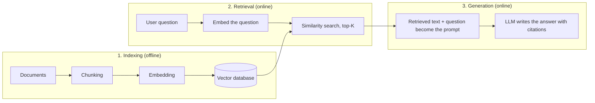
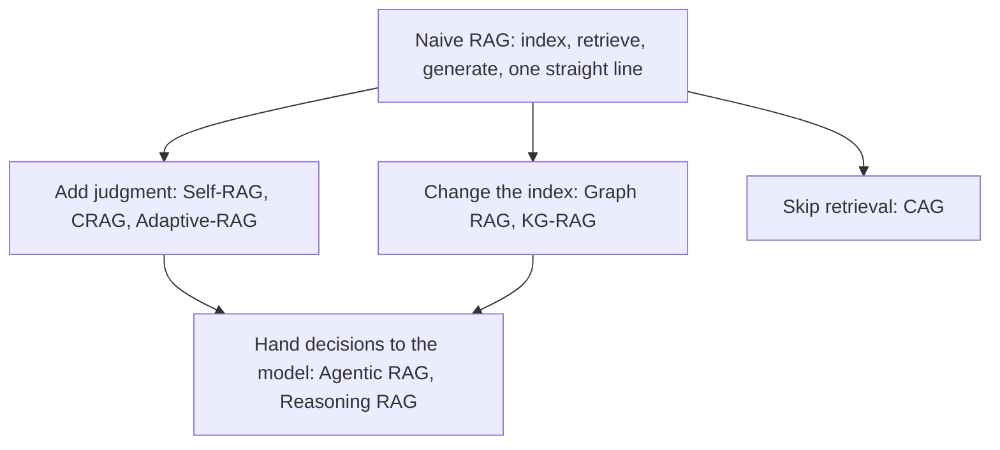

> 🌏 [中文版](/posts/ai/2026-10-03-ai-interview-rag-variants)

RAG (Retrieval-Augmented Generation) comes up often in AI Engineer interviews, and it is rarely a one-line question. The usual follow-ups are four: how it works and why it helps, the most representative use case and its challenges, which RAG techniques exist, and what RAG cannot solve.

Those four are really one thread. RAG bolts "look things up" onto the front of "answer", so every step can go wrong; each variant patches one of those holes; and after all the patching, some problems still sit outside RAG's reach. Telling it in that order keeps you from reciting a list of names.

This is part 12 of the "AI Engineer Interview Prep" series. Each section covers the concept and mechanism first, then gives a short "How to answer" you can adapt into your own words.

## The Core Idea: Look It Up, Then Answer

RAG comes from Patrick Lewis et al., [Retrieval-Augmented Generation for Knowledge-Intensive NLP Tasks](https://arxiv.org/abs/2005.11401) (NeurIPS 2020). Their starting point: language models keep knowledge in their parameters, but their ability to access and precisely manipulate that knowledge is limited, and giving provenance for decisions and updating world knowledge were still open problems. Their fix was to pair a pretrained generator (parametric memory) with a dense vector index of [Wikipedia](https://www.wikipedia.org/) (non-parametric memory), and they [set the state of the art on three open-domain QA tasks](https://arxiv.org/abs/2005.11401) at the time.

The easiest analogy is an open-book exam. A plain LLM answers from memory; RAG may flip through the book, the answer comes with a source, and the book can be swapped for a new edition at any time.

In practice the system splits into three stages:

Indexing happens offline; retrieval and generation run on every question. The split matters because every variant below tampers with one of the three stages: the judgment-adding ones work around retrieval, the index-changing ones rework stage one, and the retrieval-free one removes stage two outright.

### Why Use RAG

The survey by Gao et al., [Retrieval-Augmented Generation for Large Language Models: A Survey](https://arxiv.org/abs/2312.10997), opens by naming three LLM problems (hallucination, outdated knowledge, and opaque, untraceable reasoning) and presents RAG as a way to ease them by bringing in external databases. In interview-friendly form:

| Advantage | Why RAG delivers it |
|---|---|
| Fewer hallucinations | The answer rests on retrieved documents, so the model does not have to guess from parametric memory |
| Updatable knowledge | Update the document store; no retraining |
| Traceable | The answer can point to its source document so readers can check it |
| Domain adaptation | Connect private company data and the model can answer things it never saw in pretraining |

"RAG is cheaper than fine-tuning" only holds depending on data volume and update frequency, so do not state it as a given. The trade-off is covered in [RAG vs Fine-tuning: It's Not Either/Or](/en/posts/ai/2026-03-12-rag-vs-fine-tuning-en).

**How to answer**

RAG lets the model look things up before answering, like an open-book exam. Three steps: at indexing time, chunk the documents, embed them and store them in a vector database; at question time, embed the question and fetch the top-K closest passages; finally hand those passages plus the question to the LLM. The payoff is fewer hallucinations, knowledge updates without retraining, and answers you can trace to a source.

## The Representative Use Case: Enterprise Knowledge Base and Support Bot

If you need one representative scenario, an internal enterprise knowledge base or customer-support assistant is the safest pick: employees or customers ask questions, and the system pulls relevant passages from product manuals, SOPs, regulations and FAQs, then writes an answer with sources.

It earns that status for three reasons: it uses all three stages; its data is private content the model never saw in pretraining, which is exactly where RAG shines; and the business value is direct, because a wrong answer gets noticed immediately.

The challenges also line up with each stage of the pipeline:

| Challenge | The concrete problem | Further reading |
|---|---|---|
| Chunking | Too small loses context; too large lets noise in | [Chunking Strategies](/en/posts/ai/2026-03-12-chunking-strategies-en) |
| Retrieval quality | Vector search returns passages that look similar but are irrelevant; exact strings such as proper nouns and error codes slip past semantic models | [Hybrid Search](/en/posts/ai/2026-03-12-hybrid-search-bm25-vector-rrf-en), [Cross-Encoder Reranking](/en/posts/ai/2026-03-12-cross-encoder-reranking-en) |
| Multi-hop questions | The answer is spread over several documents and one retrieval cannot gather it | [Multi-hop Retrieval](/en/posts/ai/2026-09-03-multi-hop-retrieval-rag-en) |
| Data freshness | If the store is not updated, answers go stale | [RAG Common Failure Modes](/en/posts/ai/2026-03-12-rag-failure-modes-en) |
| Access control | Different roles may see different documents; filter at retrieval time, not by masking after generation | [RAG Guardrails](/en/posts/ai/2026-03-12-rag-guardrails-en) |
| Evaluation | Retrieval and generation fail separately, so measure them separately to know where the problem is | [RAG Evaluation Frameworks](/en/posts/ai/2026-03-12-rag-evaluation-frameworks-en) |

Evaluation deserves one more sentence. [Ragas](https://arxiv.org/abs/2309.15217) splits RAG evaluation into dimensions: whether retrieval finds relevant and focused passages, whether the LLM uses them faithfully, and the quality of the generation itself, all without needing human-annotated ground truth. Saying "measure retrieval and generation separately" is a stronger answer than just "use Ragas".

The most dangerous failure is a silent retrieval error: the retriever returns irrelevant passages, the model composes a fluent answer anyway, and the user cannot tell. A real case is on this site: [10% of Conversations Were Making Things Up](/en/posts/ai/2026-09-19-retriever-silent-failure-en).

**How to answer**

The representative scenario is an enterprise knowledge base and support bot, because it covers all three stages and uses private data the model has never seen. Pick three challenges: chunk granularity, retrieval quality (hybrid search plus a reranker), and multi-hop questions. Add that permissions must be filtered at retrieval time and that evaluation should measure retrieval and generation separately.

## The Variant Map: Start With the Evolution, Then See What Each One Patches

Gao et al. group RAG into [Naive RAG, Advanced RAG and Modular RAG paradigms](https://arxiv.org/abs/2312.10997), and this site has a dedicated piece on that line: [Three Generations of RAG: From Naive to Modular](/en/posts/ai/2026-03-12-naive-advanced-modular-rag-evolution-en). The nine techniques interviewers usually ask about hang off that line:

Naive RAG is the straight pipeline from the previous section. Its structural weakness is that retrieval and generation are tightly coupled: whatever retrieval returns is what the model consumes. The Corrective RAG paper asks it bluntly: existing methods mostly ignore one question, [what if the retrieval goes wrong?](https://arxiv.org/abs/2401.15884) Most of the variants below are different answers to it.

**How to answer**

State Naive RAG's weakness first: when retrieval goes wrong nobody notices, and every question gets the same fixed retrieval and top-K. Then classify in one line: some variants add judgment, some change the index, one skips retrieval, and the newest hand the whole flow to an agent.

## Adding Judgment to the Flow: Self-RAG, CRAG, Adaptive-RAG

All three answer one question: when should we look things up, can what we found be used, and is this question worth that much effort? They differ in who makes the call and where.

### Self-RAG: judgment built into the model

[Self-RAG](https://arxiv.org/abs/2310.11511) (Asai et al.) trains a single LM to emit special reflection tokens during generation, judging whether to retrieve, whether retrieved passages are relevant, and whether its own answer is supported. The paper reports that Self-RAG, even at just 7B and 13B sizes, [outperforms](https://arxiv.org/abs/2310.11511) [ChatGPT](https://chatgpt.com/) and retrieval-augmented Llama2-chat on open-domain QA, reasoning and fact-verification tasks.

The cost is in training: the judgment is fine-tuned into the model, so it only works on models you can train and does not drop onto API-only closed models. For the mechanics, see [Self-RAG: Teaching the Model to Decide When to Retrieve](/en/posts/ai/2026-09-03-self-rag-reflection-tokens-en).

### CRAG: a separate retrieval evaluator

[CRAG (Corrective RAG)](https://arxiv.org/abs/2401.15884) (Yan et al.) takes a different route: add a lightweight retrieval evaluator that scores each retrieval, then branch on the confidence:

| Evaluation | Action |
|---|---|
| Correct | Split the retrieved documents into small strips, filter out the irrelevant ones, and recompose the rest as refined knowledge |
| Incorrect | Discard the retrieved results and fall back to web search |
| Ambiguous | Use both together |

Two details earn interview points. First, the evaluator is small: [about 0.77B parameters, against a 7B Llama-2 as the Self-RAG critic](https://arxiv.org/html/2401.15884v3). Second, the Ambiguous branch is deliberate: the authors found that with only Correct and Incorrect actions, [results were easily affected by the evaluator's accuracy](https://arxiv.org/html/2401.15884v3), and adding a middle ground eased that dependence.

The limits are plain too: the Incorrect path relies on an external search engine, and the ceiling of the whole system is the judgment of that evaluator. This site discusses the issue in [Three Shapes of RAG and the Evaluator Paradox](/en/posts/ai/2026-08-10-rag-graph-agentic-variants-en). For implementation, see [CRAG: Automatically Relaxing Filters When Retrieval Comes Up Empty](/en/posts/ai/2026-03-12-corrective-rag-crag-en).

### Adaptive-RAG: route by question difficulty

[Adaptive-RAG](https://arxiv.org/abs/2403.14403) (Jeong et al., NAACL 2024) is about efficiency: simple questions do not need retrieval, while complex multi-step ones need more than a single retrieval. It trains a smaller LM as a classifier to predict how complex an incoming question is, then switches among three strategies: no retrieval, single-step retrieval, and iterative multi-step retrieval.

The bottleneck is easy to see: if the classifier errs, simple questions get forced into multi-step retrieval (waste) and complex ones get single-step retrieval (no answer). The multi-step case is essentially the [multi-hop retrieval](/en/posts/ai/2026-09-03-multi-hop-retrieval-rag-en) problem from the table above.

**How to answer**

All three add "judgment". Self-RAG trains it into the model, using special tokens to decide whether to retrieve and whether the result is usable; CRAG bolts on a small evaluator and falls back to web search when retrieval is poor; Adaptive-RAG uses a classifier to route among no retrieval, single-step and multi-step by difficulty. The trade-offs: Self-RAG needs training, CRAG depends on the evaluator and a search engine, and Adaptive-RAG is limited by classifier accuracy.

## Changing the Index: Graph RAG and KG-RAG

Vector retrieval assumes the answer sits in a few nearby passages. When the question needs relationships between entities, or a picture of the whole corpus, that assumption fails, and what you change is the index itself.

### Graph RAG: growing a graph from the documents

[Graph RAG](https://arxiv.org/abs/2404.16130) (Edge et al., Microsoft Research) argues that conventional RAG fails on global questions about an entire corpus, such as [“What are the main themes in the dataset?”](https://arxiv.org/abs/2404.16130), because that is inherently a query-focused summarization task, not a retrieval task.

It builds its index in two stages: an LLM first derives an entity knowledge graph from the documents, then pre-generates community summaries for groups of closely related entities (the output of [community detection](https://arxiv.org/abs/2404.16130)). At query time each community summary produces a partial answer, and the partial answers are summarized into the final one. On datasets in the million-token range, the paper reports [better comprehensiveness and diversity than a conventional RAG baseline](https://arxiv.org/abs/2404.16130) for global questions.

The cost is just as clear: the index relies on an LLM for extraction and summarization, which is far more expensive than plain chunking and embedding. For selection and cost comparison, see [GraphRAG: Structuring Knowledge as a Graph for Relationship-Based Reasoning](/en/posts/ai/2026-03-12-graph-rag-en) and [Which Graph RAG to Choose](/en/posts/ai/2026-08-25-graphrag-lightrag-hipporag-en).

### KG-RAG: using an existing knowledge graph

[KG-RAG](https://arxiv.org/abs/2311.17330) (Soman et al.) starts from a different premise: the graph already exists, so you do not build one from documents. The paper connects a large biomedical knowledge graph, [SPOKE](https://arxiv.org/abs/2311.17330), to Llama-2, GPT-3.5-Turbo and GPT-4, extracts context with a minimal graph schema, and prunes it with embeddings, [cutting token use by more than half without hurting accuracy](https://arxiv.org/abs/2311.17330).

So the dividing line is easy to remember: Graph RAG builds a graph from documents; KG-RAG uses a graph that already exists. KG-RAG fits domains like biomedicine that have mature graphs; the limit is that the system's quality is capped by the graph's quality and coverage.

**How to answer**

Both change the index. Graph RAG has an LLM extract entities and relations from documents into a graph, then builds community summaries; its strength is global questions like "what are the main themes of this corpus", and its weakness is indexing cost. KG-RAG uses an existing knowledge graph, such as SPOKE in biomedicine; the difference is whether you build the graph or inherit it.

## Answering Without Retrieval: CAG

[CAG (Cache-Augmented Generation)](https://arxiv.org/abs/2412.15605) (Chan et al., WWW '25 short paper) asks the opposite question: models now have very long context windows, so why retrieve every time?

Offline, load all relevant documents into the long context at once and [precompute the key-value cache](https://arxiv.org/html/2412.15605v1); online, reuse that cache directly, with no retrieval step. The paper argues this removes retrieval latency and reduces document-selection errors, and it scopes the approach to [knowledge bases small enough to load whole](https://arxiv.org/abs/2412.15605).

The conditions are therefore clear: a limited knowledge base, infrequent updates, and latency sensitivity. Conversely, when the knowledge base outgrows the context window CAG is out, and any knowledge update forces the cache to be recomputed. Even when it fits, information inside a long context is not guaranteed to be used, which comes back later. For a different take on rethinking retrieval units with long context, read [LongRAG](/en/posts/ai/2026-03-15-longrag-long-context-retrieval-en).

**How to answer**

CAG skips real-time retrieval: it preloads the whole knowledge base into a long context, precomputes the KV cache, and uses it directly at question time. Latency is low and the architecture is simple, which suits a small, stable knowledge base. The limits are the context window and recomputing the cache on every update, so it cannot replace RAG for large knowledge bases.

## Handing Decisions to the Model: Agentic RAG and Reasoning RAG

The variants so far each patch one hole, but a human still wrote the flow in advance. The next step is to let the model decide the flow.

### Agentic RAG

The survey by Singh et al., [Agentic Retrieval-Augmented Generation: A Survey on Agentic RAG](https://arxiv.org/abs/2501.09136), defines it as embedding autonomous AI agents in the RAG pipeline, using [reflection, planning, tool use and multi-agent collaboration](https://arxiv.org/abs/2501.09136) to manage retrieval strategy dynamically and refine their understanding of the context step by step.

Concretely: which retriever should be used (vector, SQL, graph, web search)? Was the first round enough? If not, rewrite the query and search again. Traditional RAG hard-codes all of this; Agentic RAG turns it into decisions made at run time.

One useful way to read it: in an agentic framework, the three "add judgment" variants above become steps the agent can call, so Agentic RAG is closer to an umbrella framework than a peer algorithm. (That is a reading of the landscape, not a conclusion from the paper.)

The cost lives here too. The survey itself lists open problems including [evaluation, coordination, memory management, efficiency and governance](https://arxiv.org/abs/2501.09136); in engineering terms, multiple LLM calls raise latency and cost, and a flow that is no longer fixed is harder to debug. To go further on this site, read [Agentic RAG: Letting the LLM Decide When to Search Again](/en/posts/ai/2026-03-12-agentic-rag-react-loop-en).

### Reasoning RAG

Reasoning RAG is often presented in interviews as a standalone technique, but its basis is a survey: Liang et al., [Reasoning RAG via System 1 or System 2](https://arxiv.org/abs/2506.10408). It observes that static-pipeline RAG struggles with complex reasoning and dynamic retrieval, so the field has shifted toward Reasoning Agentic RAG. The survey sorts methods into [two groups](https://arxiv.org/abs/2506.10408): predefined reasoning, which keeps fixed modular pipelines and strengthens the reasoning inside them, and agentic reasoning, where the model orchestrates tools itself at inference time.

So the difference from Adaptive-RAG is this: Adaptive-RAG picks how many retrieval steps by question difficulty, while Reasoning RAG is about how reasoning and retrieval interleave. When you answer, do not describe it as a single algorithm; "a category of approaches in this direction" is more accurate. For more depth, see [Agentic / Reasoning RAG](/en/posts/ai/2026-08-25-agentic-reasoning-rag-en).

**How to answer**

Agentic RAG lets an agent decide dynamically which retriever to use, how many rounds to run and whether the results are enough, instead of a hard-coded pipeline; the judgment logic of Self-RAG and CRAG can become one of its steps. The price is latency, cost and debugging difficulty. Reasoning RAG is the direction that pulls reasoning depth in; the survey splits it into predefined reasoning with a fixed pipeline and agentic reasoning where the model orchestrates tools itself.

## All Nine Variants in One Table

| Technique | Which hole it patches | Mechanism in one line | Fits | Main limit |
|---|---|---|---|---|
| Naive RAG | Baseline | Index, retrieve, generate in a straight line | General Q&A | Retrieval errors go unnoticed |
| Self-RAG | Judgment | The model self-judges with reflection tokens | High factual accuracy needs | Requires training the model |
| CRAG | Judgment | A small evaluator scores retrieval; fall back to web search if poor | Unstable retrieval quality | Depends on evaluator and search engine |
| Adaptive-RAG | Judgment | A classifier routes by difficulty | Wide spread in question difficulty | Classifier accuracy |
| Graph RAG | Index | Extract entities, build a graph, summarize communities | Global questions, whole-corpus summaries | High indexing cost |
| KG-RAG | Index | Pull subgraphs from an existing knowledge graph | Domains with mature graphs, such as biomedicine | Limited by graph quality and coverage |
| CAG | No retrieval | Preload knowledge, precompute the KV cache | Small, stable knowledge bases | Bound by window size; updates force recompute |
| Agentic RAG | Decisions | An agent plans retrieval dynamically | Many sources, complex questions | Latency, cost and debugging difficulty |
| Reasoning RAG | Decisions | Reasoning and retrieval interleave | Questions needing multi-step reasoning | A category of approaches; implementations vary widely |

The full ten-generation evolution and a selection guide are in [The Complete Guide to RAG System Patterns](/en/posts/ai/2026-03-14-rag-patterns-complete-guide-en).

**How to answer**

Do not recite nine names; explain the selection logic. First measure which stage is failing today: unstable retrieval calls for evaluation and retry, a wide spread of difficulty calls for routing, a need for whole-corpus views justifies building a graph, a small knowledge base suggests skipping retrieval, and only a complex flow earns an agent. Each one has a price, and the highest are Graph RAG's indexing cost and Agentic RAG's run-time cost.

## What RAG Cannot Solve

The two surveys by Gao et al. and [Fan et al. (KDD 2024)](https://arxiv.org/abs/2405.06211) both devote space to limitations and future directions. Organized into an interview-ready form, there are six kinds.

**1. Reasoning is not a data problem.** RAG supplies information, not reasoning ability. Ask for "the three-year compound growth rate from the financial statements" and RAG can find the statements, but the calculation and inference still depend on the model. The Reasoning RAG survey also notes that [static-pipeline RAG struggles with complex reasoning](https://arxiv.org/abs/2506.10408).

**2. The answer is not in the knowledge base.** RAG can only find information, not create facts. Implicit common sense that was never written into any document cannot be retrieved either. Worse, retrieving irrelevant content can mislead the model. In the CRAG paper's words: "[If retrieved documents are irrelevant, the retrieval system can even exacerbate the factual error that LMs make.](https://arxiv.org/html/2401.15884v3)"

**3. Nobody arbitrates contradictory documents.** When two documents in the store contradict each other, retrieval cares about relevance, not truth. The practical fix is to add metadata such as version, effective date and source tier, then filter or rank on it at retrieval time, rather than hoping the model sorts it out.

**4. Limits of the model itself.** Retrieved content still has to fit in the context, and [Lost in the Middle](https://arxiv.org/abs/2307.03172) (Liu et al., TACL 2024) found that models do best when relevant information sits at the start or end of the input and [degrade significantly](https://arxiv.org/abs/2307.03172) when it is in the middle of a long context, even for models explicitly built for long context. So retrieving more is not using better: pass fewer passages and put the key ones at the edges. This belongs to overall context design; see [Context Engineering](/en/posts/ai/2026-03-24-context-engineering-guide-en).

**5. Freshness.** Unless the knowledge base updates in real time, RAG cannot answer what is happening "now", such as live stock prices. There are two remedies: make the index update incrementally, or, as CRAG does, fall back to web search when needed.

**6. The knowledge base is an attack surface.** [PoisonedRAG](https://arxiv.org/abs/2402.07867) demonstrated [knowledge poisoning](https://arxiv.org/abs/2402.07867): by injecting just five malicious texts per target question into a knowledge base of millions of texts, an attacker reached a 90% attack success rate, and the defenses the paper evaluated were insufficient. [SafeRAG](https://arxiv.org/abs/2501.18636) is a benchmark built specifically to evaluate RAG security, starting from the same observation: RAG brings in external, unverified knowledge, so attackers can attack the model by manipulating that knowledge. Because retrieved text goes straight into the prompt, the attack surface also includes documents that smuggle in prompt injection. Defenses are covered in [RAG Guardrails](/en/posts/ai/2026-03-12-rag-guardrails-en).

**How to answer**

RAG fixes "the model does not know", not "the model cannot think". Six things it cannot solve: problems that need reasoning, information that is not in the knowledge base, contradictory documents, the model's own long-context weaknesses, freshness, and a poisoned knowledge base. The last one deserves the most airtime, because retrieved content goes straight into the prompt, and once the upstream of the trust chain is contaminated, RAG faithfully outputs it.

## Three Follow-Up Backups

**"How do you choose between RAG and fine-tuning?"** Use RAG when knowledge changes often and you need traceability; use fine-tuning to change style, format or behavior; the two can be combined. The full comparison is in [RAG vs Fine-tuning](/en/posts/ai/2026-03-12-rag-vs-fine-tuning-en).

**"How do you evaluate RAG?"** Measure retrieval and generation separately. For retrieval, look at recall and ranking; for generation, check whether it stays faithful to the retrieved content and answers the question. Ragas is one tool, and [RAG Evaluation Frameworks and Tool Selection](/en/posts/ai/2026-03-12-rag-evaluation-frameworks-en) compares others.

**"Why not use CAG for everything?"** The knowledge base has to be small enough to fit in the context window, and any update means recomputing the cache; at larger scale or with frequent updates, retrieval remains the more practical choice.

## Questions that keep showing up in public question banks

This section pulls together the RAG and retrieval questions that repeat across the 7 public GitHub interview banks compared in [part 11 of the series](/en/posts/ai/2026-09-30-ai-engineer-interview-resources-en), merging questions that mean the same thing into one. The "independent sources" count only measures overlap between the banks; it says nothing about how often a question comes up in real interviews. The amitshekhar and pallavi banks cite no sources for their questions, so this post does not use their company labels, and it lists only the questions and links to where they appear, with no answers reproduced.

| Question | Independent sources | Bank links | Where it fits in this post |
|---|---|---|---|
| What is RAG, what problem does it solve, and what are the stages of the pipeline? | 4 | [om](https://github.com/ombharatiya/AI-Engineer-Interview-Questions/blob/main/04-rag-and-retrieval/questions.md#1-what-is-rag-and-what-problem-does-it-actually-solve) [aeg](https://github.com/alexeygrigorev/ai-engineering-field-guide/blob/main/interview/questions/questions.md?plain=1#L20) [amit](https://github.com/amitshekhariitbhu/ai-engineering-interview-questions/blob/main/README.md#L262) [ks](https://github.com/KalyanKS-NLP/RAG-Interview-Questions-and-Answers-Hub/blob/main/Interview_QA/QA_1-3.md) | The Core Idea: Look It Up, Then Answer |
| What chunking strategies exist, and how do you choose a strategy and chunk size? | 4 | [om](https://github.com/ombharatiya/AI-Engineer-Interview-Questions/blob/main/04-rag-and-retrieval/questions.md#4-what-chunking-strategies-do-you-know-and-how-do-you-pick-one) [aeg](https://github.com/alexeygrigorev/ai-engineering-field-guide/blob/main/interview/questions/questions.md?plain=1#L22) [amit](https://github.com/amitshekhariitbhu/ai-engineering-interview-questions/blob/main/README.md#L268) [pal](https://github.com/pallavi-shekhar/ai-engineering-interview-questions-company-wise/blob/main/README.md#L209) [ks](https://github.com/KalyanKS-NLP/RAG-Interview-Questions-and-Answers-Hub/blob/main/Interview_QA/QA_34-36.md) | The Representative Use Case: Enterprise Knowledge Base and Support Bot |
| What is hybrid search, and how do sparse and dense retrieval compare? | 4 | [om](https://github.com/ombharatiya/AI-Engineer-Interview-Questions/blob/main/04-rag-and-retrieval/questions.md#9-what-is-hybrid-search-and-why-does-pure-vector-search-fail-on-some-queries) [aeg](https://github.com/alexeygrigorev/ai-engineering-field-guide/blob/main/interview/questions/questions.md?plain=1#L65) [amit](https://github.com/amitshekhariitbhu/ai-engineering-interview-questions/blob/main/README.md#L277) [pal](https://github.com/pallavi-shekhar/ai-engineering-interview-questions-company-wise/blob/main/README.md#L212) [ks](https://github.com/KalyanKS-NLP/RAG-Interview-Questions-and-Answers-Hub/blob/main/Interview_QA/QA_52-54.md) | The Representative Use Case: Enterprise Knowledge Base and Support Bot |
| What is a reranker, and why add one after vector search (cross-encoder vs bi-encoder)? | 4 | [om](https://github.com/ombharatiya/AI-Engineer-Interview-Questions/blob/main/04-rag-and-retrieval/questions.md#10-what-is-a-reranker-and-why-add-one-after-vector-search) [aeg](https://github.com/alexeygrigorev/ai-engineering-field-guide/blob/main/interview/questions/questions.md?plain=1#L66) [amit](https://github.com/amitshekhariitbhu/ai-engineering-interview-questions/blob/main/README.md#L279) [pal](https://github.com/pallavi-shekhar/ai-engineering-interview-questions-company-wise/blob/main/README.md#L215) [ks](https://github.com/KalyanKS-NLP/RAG-Interview-Questions-and-Answers-Hub/blob/main/Interview_QA/QA_61-63.md) | The Representative Use Case: Enterprise Knowledge Base and Support Bot |
| How do you evaluate a RAG pipeline, and why measure retrieval and generation separately? | 4 | [om](https://github.com/ombharatiya/AI-Engineer-Interview-Questions/blob/main/07-evaluation-and-observability/questions.md#22-how-do-you-evaluate-a-rag-pipeline-why-evaluate-components-separately-from-the-end-to-end-system) [aeg](https://github.com/alexeygrigorev/ai-engineering-field-guide/blob/main/interview/questions/questions.md?plain=1#L69) [amit](https://github.com/amitshekhariitbhu/ai-engineering-interview-questions/blob/main/README.md#L289) [pal](https://github.com/pallavi-shekhar/ai-engineering-interview-questions-company-wise/blob/main/README.md#L218) [ks](https://github.com/KalyanKS-NLP/RAG-Interview-Questions-and-Answers-Hub/blob/main/Interview_QA/QA_79-81.md) | The Representative Use Case: Enterprise Knowledge Base and Support Bot |
| How do you choose an embedding model? | 3 | [om](https://github.com/ombharatiya/AI-Engineer-Interview-Questions/blob/main/04-rag-and-retrieval/questions.md#7-how-would-you-choose-an-embedding-model-what-role-does-mteb-play-and-what-are-its-limits) [amit](https://github.com/amitshekhariitbhu/ai-engineering-interview-questions/blob/main/README.md#L274) [ks](https://github.com/KalyanKS-NLP/RAG-Interview-Questions-and-Answers-Hub/blob/main/Interview_QA/QA_43-45.md) | The Core Idea: Look It Up, Then Answer |
| How does approximate nearest neighbor (ANN) search work, and how do you trade off indexes such as HNSW? | 3 | [aeg](https://github.com/alexeygrigorev/ai-engineering-field-guide/blob/main/interview/questions/questions.md?plain=1#L71) [pal](https://github.com/pallavi-shekhar/ai-engineering-interview-questions-company-wise/blob/main/README.md#L229) [ks](https://github.com/KalyanKS-NLP/RAG-Interview-Questions-and-Answers-Hub/blob/main/Interview_QA/QA_46-48.md) | The Core Idea: Look It Up, Then Answer |
| What do retrieval metrics (recall@k, MRR, nDCG) each tell you? | 3 | [om](https://github.com/ombharatiya/AI-Engineer-Interview-Questions/blob/main/04-rag-and-retrieval/questions.md#43-what-retrieval-metrics-would-you-track---recallk-mrr-ndcg---and-what-does-each-actually-tell-you) [aeg](https://github.com/alexeygrigorev/ai-engineering-field-guide/blob/main/interview/questions/questions.md?plain=1#L69) [ks](https://github.com/KalyanKS-NLP/RAG-Interview-Questions-and-Answers-Hub/blob/main/Interview_QA/QA_73-75.md) | The Representative Use Case: Enterprise Knowledge Base and Support Bot |
| A user says the RAG assistant gave a wrong answer: how do you triage, and what are the common failure points? | 3 | [om](https://github.com/ombharatiya/AI-Engineer-Interview-Questions/blob/main/04-rag-and-retrieval/questions.md#46-a-user-reports-the-rag-assistant-gave-a-wrong-answer-walk-me-through-your-triage) [aeg](https://github.com/alexeygrigorev/ai-engineering-field-guide/blob/main/interview/questions/questions.md?plain=1#L61) [amit](https://github.com/amitshekhariitbhu/ai-engineering-interview-questions/blob/main/README.md#L298) | The Representative Use Case: Enterprise Knowledge Base and Support Bot |
| How do you handle tables, figures and document-wide context when splitting PDFs? | 3 | [aeg](https://github.com/alexeygrigorev/ai-engineering-field-guide/blob/main/interview/questions/questions.md?plain=1#L54) [pal](https://github.com/pallavi-shekhar/ai-engineering-interview-questions-company-wise/blob/main/README.md#L231) [ks](https://github.com/KalyanKS-NLP/RAG-Interview-Questions-and-Answers-Hub/blob/main/Interview_QA/QA_37-39.md) | The Representative Use Case: Enterprise Knowledge Base and Support Bot |
| When should you use retrieval versus putting everything in a long context window? | 3 | [om](https://github.com/ombharatiya/AI-Engineer-Interview-Questions/blob/main/04-rag-and-retrieval/questions.md#50-long-context-models-made-rag-obsolete-argue-both-sides-then-give-your-actual-position) [amit](https://github.com/amitshekhariitbhu/ai-engineering-interview-questions/blob/main/README.md#L305) [pal](https://github.com/pallavi-shekhar/ai-engineering-interview-questions-company-wise/blob/main/README.md#L1589) [ks](https://github.com/KalyanKS-NLP/RAG-Interview-Questions-and-Answers-Hub/blob/main/Interview_QA/QA_1-3.md) | Answering Without Retrieval: CAG |
| When do you choose RAG, fine-tuning or long context? | 3 | [AIML](https://github.com/alirezadir/AIMLInterviews/blob/main/src/ml-fundamental.md#llm--genai--multimodal-sample-questions-2026) [amit](https://github.com/amitshekhariitbhu/ai-engineering-interview-questions/blob/main/README.md#L303) [ks](https://github.com/KalyanKS-NLP/LLM-Interview-Questions-and-Answers-Hub/blob/main/Interview_QA/QA_97-99.md) | Three Follow-Up Backups |
| What is GraphRAG, how does it differ from standard RAG, and when is it worth it? | 3 | [om](https://github.com/ombharatiya/AI-Engineer-Interview-Questions/blob/main/04-rag-and-retrieval/questions.md#39-what-is-graphrag-and-when-is-the-knowledge-graph-structure-worth-the-complexity) [aeg](https://github.com/alexeygrigorev/ai-engineering-field-guide/blob/main/interview/questions/questions.md?plain=1#L24) [amit](https://github.com/amitshekhariitbhu/ai-engineering-interview-questions/blob/main/README.md#L293) | Changing the Index: Graph RAG and KG-RAG |
| How do you handle citations and source attribution in a RAG system? | 2 | [aeg](https://github.com/alexeygrigorev/ai-engineering-field-guide/blob/main/interview/questions/questions.md?plain=1#L70) [pal](https://github.com/pallavi-shekhar/ai-engineering-interview-questions-company-wise/blob/main/README.md#L234) | The Core Idea: Look It Up, Then Answer |
| How do you design permission-aware retrieval so users never see content they cannot access? | 2 | [om](https://github.com/ombharatiya/AI-Engineer-Interview-Questions/blob/main/04-rag-and-retrieval/questions.md#42-design-retrieval-for-a-multi-tenant-saas-product-where-users-have-different-document-permissions) [amit](https://github.com/amitshekhariitbhu/ai-engineering-interview-questions/blob/main/README.md#L319) [pal](https://github.com/pallavi-shekhar/ai-engineering-interview-questions-company-wise/blob/main/README.md#L227) | The Representative Use Case: Enterprise Knowledge Base and Support Bot |
| How does agentic RAG differ from single-shot RAG, and when is the extra complexity justified? | 2 | [om](https://github.com/ombharatiya/AI-Engineer-Interview-Questions/blob/main/04-rag-and-retrieval/questions.md#40-compare-single-shot-rag-with-agentic-rag-when-does-retrieval-as-a-tool-win) [amit](https://github.com/amitshekhariitbhu/ai-engineering-interview-questions/blob/main/README.md#L275) [pal](https://github.com/pallavi-shekhar/ai-engineering-interview-questions-company-wise/blob/main/README.md#L223) | Handing Decisions to the Model: Agentic RAG and Reasoning RAG |
| What is query transformation (HyDE, query decomposition)? | 2 | [amit](https://github.com/amitshekhariitbhu/ai-engineering-interview-questions/blob/main/README.md#L307) [pal](https://github.com/pallavi-shekhar/ai-engineering-interview-questions-company-wise/blob/main/README.md#L221) [ks](https://github.com/KalyanKS-NLP/RAG-Interview-Questions-and-Answers-Hub/blob/main/Interview_QA/QA_25-27.md) | Handing Decisions to the Model: Agentic RAG and Reasoning RAG |
| Where do embeddings fail (negation, temporal reasoning, precision requirements)? | 1 | [aeg](https://github.com/alexeygrigorev/ai-engineering-field-guide/blob/main/interview/questions/questions.md?plain=1#L72) | The Representative Use Case: Enterprise Knowledge Base and Support Bot |
| How do you keep an index and knowledge base fresh as the corpus changes? | 1 | [amit](https://github.com/amitshekhariitbhu/ai-engineering-interview-questions/blob/main/README.md#L299) [pal](https://github.com/pallavi-shekhar/ai-engineering-interview-questions-company-wise/blob/main/README.md#L232) | The Representative Use Case: Enterprise Knowledge Base and Support Bot |
| If anyone can add documents to the corpus, how do you stop an attacker planting one that hijacks the assistant? | 1 | [om](https://github.com/ombharatiya/AI-Engineer-Interview-Questions/blob/main/04-rag-and-retrieval/questions.md#56-anyone-can-add-documents-to-your-corpus-how-do-you-stop-an-attacker-planting-a-document-that-hijacks-the-assistant) | What RAG Cannot Solve |
| A teammate wants to drop the vector index and give the agent grep and keyword search instead: where are they right, and where does it break? | 1 | [om](https://github.com/ombharatiya/AI-Engineer-Interview-Questions/blob/main/04-rag-and-retrieval/questions.md#59-a-teammate-wants-to-delete-the-vector-index-and-give-the-agent-grep-file-reads-and-keyword-search-instead-the-way-coding-agents-work-where-are-they-right-and-where-does-it-break-outside-code) | Handing Decisions to the Model: Agentic RAG and Reasoning RAG |

How the counts work: amit and pal appear to be maintained by the same organization (Outcome School) and share 26 near-verbatim questions, so together they count as 1 source; ks is the same author's LLM and RAG banks, also 1 source; om, aeg and AIML are 1 source each, so the maximum is 5. Label key: om = ombharatiya, aeg = alexeygrigorev, AIML = alirezadir, amit = amitshekhariitbhu, pal = pallavi-shekhar, ks = KalyanKS-NLP. On licensing, om and AIML are MIT, aeg states no license, and amit, pal and ks are Apache-2.0 (the amit and pal READMEs carry an Outcome School copyright notice). This section lists only question titles and links; see the original repos for the answers.

The line-number links for amit, pal and aeg point to the main branch as of 2026-10-03 and can shift after those repos change; if a link lands on a different question, search the original file for the question text.

## Other Parts of the Series

Other parts of the "AI Engineer Interview Prep" series:

- [Agents, MCP and Caching](/en/posts/ai/2026-10-03-ai-interview-agent-mcp-caching-en)
- [Prompt, Context and Harness](/en/posts/ai/2026-10-03-ai-interview-prompt-context-harness-en)
- [LLM Engineering in Practice](/en/posts/ai/2026-10-03-ai-interview-llm-engineering-en)
- [ML and Transformer Basics](/en/posts/ai/2026-10-03-ai-interview-ml-transformer-basics-en)
- [System Design, Coding and Behavioral Interviews](/en/posts/ai/2026-10-03-ai-interview-design-coding-behavioral-en)

## References

Papers

- [Retrieval-Augmented Generation for Knowledge-Intensive NLP Tasks](https://arxiv.org/abs/2005.11401) (Lewis et al., NeurIPS 2020)
- [Retrieval-Augmented Generation for Large Language Models: A Survey](https://arxiv.org/abs/2312.10997) (Gao et al.)
- [A Survey on RAG Meeting LLMs: Towards Retrieval-Augmented Large Language Models](https://arxiv.org/abs/2405.06211) (Fan et al., KDD 2024; the arXiv version is the long version)
- [Self-RAG: Learning to Retrieve, Generate, and Critique through Self-Reflection](https://arxiv.org/abs/2310.11511) (Asai et al.)
- [Corrective Retrieval Augmented Generation](https://arxiv.org/abs/2401.15884) (Yan et al.; [full text in HTML](https://arxiv.org/html/2401.15884v3))
- [Adaptive-RAG: Learning to Adapt Retrieval-Augmented Large Language Models through Question Complexity](https://arxiv.org/abs/2403.14403) (Jeong et al., NAACL 2024)
- [From Local to Global: A Graph RAG Approach to Query-Focused Summarization](https://arxiv.org/abs/2404.16130) (Edge et al.)
- [Biomedical knowledge graph-optimized prompt generation for large language models](https://arxiv.org/abs/2311.17330) (Soman et al.; the v1 title read "...graph-enhanced...")
- [Don't Do RAG: When Cache-Augmented Generation is All You Need for Knowledge Tasks](https://arxiv.org/abs/2412.15605) (Chan et al., WWW '25 short paper; [v1 full text](https://arxiv.org/html/2412.15605v1))
- [Agentic Retrieval-Augmented Generation: A Survey on Agentic RAG](https://arxiv.org/abs/2501.09136) (Singh et al.)
- [Reasoning RAG via System 1 or System 2: A Survey on Reasoning Agentic Retrieval-Augmented Generation for Industry Challenges](https://arxiv.org/abs/2506.10408) (Liang et al.)
- [Lost in the Middle: How Language Models Use Long Contexts](https://arxiv.org/abs/2307.03172) (Liu et al., TACL 2024)
- [PoisonedRAG: Knowledge Corruption Attacks to Retrieval-Augmented Generation of Large Language Models](https://arxiv.org/abs/2402.07867) (USENIX Security 2025)
- [SafeRAG: Benchmarking Security in Retrieval-Augmented Generation of Large Language Model](https://arxiv.org/abs/2501.18636) (Liang et al., ACL 2025; [ACL Anthology](https://aclanthology.org/2025.acl-long.230))
- [Ragas: Automated Evaluation of Retrieval Augmented Generation](https://arxiv.org/abs/2309.15217)

On this site

- [Three Generations of RAG: From Naive to Modular](/en/posts/ai/2026-03-12-naive-advanced-modular-rag-evolution-en)
- [The Complete Guide to RAG System Patterns](/en/posts/ai/2026-03-14-rag-patterns-complete-guide-en)
- [Self-RAG: Teaching the Model to Decide When to Retrieve](/en/posts/ai/2026-09-03-self-rag-reflection-tokens-en)
- [CRAG: Automatically Relaxing Filters When Retrieval Comes Up Empty](/en/posts/ai/2026-03-12-corrective-rag-crag-en)
- [Which Graph RAG to Choose](/en/posts/ai/2026-08-25-graphrag-lightrag-hipporag-en)
- [Agentic RAG: Letting the LLM Decide When to Search Again](/en/posts/ai/2026-03-12-agentic-rag-react-loop-en)
- [RAG Common Failure Modes](/en/posts/ai/2026-03-12-rag-failure-modes-en)
- [RAG vs Fine-tuning: It's Not Either/Or](/en/posts/ai/2026-03-12-rag-vs-fine-tuning-en)
- [RAG Evaluation Frameworks and Tool Selection](/en/posts/ai/2026-03-12-rag-evaluation-frameworks-en)

Question banks

- [ombharatiya/AI-Engineer-Interview-Questions](https://github.com/ombharatiya/AI-Engineer-Interview-Questions) — source of the questions (only question titles are cited)
- [alexeygrigorev/ai-engineering-field-guide](https://github.com/alexeygrigorev/ai-engineering-field-guide) — source of the questions (only question titles are cited)
- [alirezadir/AIMLInterviews](https://github.com/alirezadir/AIMLInterviews) — source of the questions (only question titles are cited)
- [amitshekhariitbhu/ai-engineering-interview-questions](https://github.com/amitshekhariitbhu/ai-engineering-interview-questions) — source of the questions (only question titles are cited)
- [pallavi-shekhar/ai-engineering-interview-questions-company-wise](https://github.com/pallavi-shekhar/ai-engineering-interview-questions-company-wise) — source of the questions (only question titles are cited)
- [KalyanKS-NLP/LLM-Interview-Questions-and-Answers-Hub](https://github.com/KalyanKS-NLP/LLM-Interview-Questions-and-Answers-Hub) — source of the questions (only question titles are cited)
- [KalyanKS-NLP/RAG-Interview-Questions-and-Answers-Hub](https://github.com/KalyanKS-NLP/RAG-Interview-Questions-and-Answers-Hub) — source of the questions (only question titles are cited)
