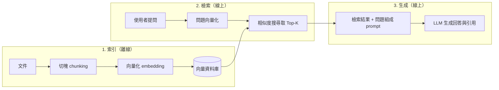
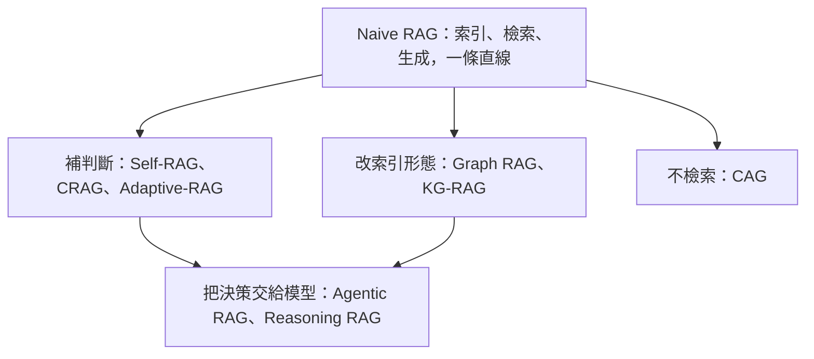

> 🌏 [English version](/en/posts/ai/2026-10-03-ai-interview-rag-variants-en)

RAG（Retrieval-Augmented Generation，檢索增強生成）是 AI Engineer 面試裡很常被問到的題目，而且很少只問一句。常見的追問是四件事：原理與優勢、最具代表性的應用場景與挑戰、有哪些 RAG 技術變體、RAG 解不了什麼。

這四題其實是同一條主線：RAG 把「查資料」接在「回答」前面，於是每個環節都可能出錯；每一種變體，都是在補其中一個洞；補完之後，仍然有一些問題超出 RAG 的範圍。照這個順序講，就不會變成背名詞。

這篇是「AI Engineer 面試準備」系列的第 12 篇。每一節先講概念與機制，再給一段「面試怎麼答」，可以直接改成自己的話講出口。

## RAG 的核心概念：先查資料，再回答

RAG 的原始論文是 Patrick Lewis 等人的 [Retrieval-Augmented Generation for Knowledge-Intensive NLP Tasks](https://arxiv.org/abs/2005.11401)（NeurIPS 2020）。他們點出的問題是：大型語言模型把知識存在參數裡，但存取與精確操作這些知識的能力有限，而且「提供決策的出處」與「更新世界知識」在當時都還是未解問題。他們的做法是把預訓練的生成模型（參數記憶）接上一個 [Wikipedia](https://www.wikipedia.org/) 向量索引（非參數記憶），並在[三個開放領域問答任務上刷新當時的最佳成績](https://arxiv.org/abs/2005.11401)。

最好記的比喻是「開書考試」：沒有 RAG 的 LLM 只能憑記憶答題，RAG 則允許考試時翻書，答案有出處，書也可以隨時換新版。

實際系統通常拆成三個階段：

索引在離線時做好，檢索與生成在每次提問時才執行。這個切法很重要，因為後面每一個變體，都是在這三段裡的某一處動手腳：加判斷的在檢索前後、改索引形態的動第一段、取消檢索的直接拿掉第二段。

### 為什麼要用 RAG

Gao 等人的綜述 [Retrieval-Augmented Generation for Large Language Models: A Survey](https://arxiv.org/abs/2312.10997) 開宗明義指出，LLM 遇到幻覺、知識過時、推理過程不透明且無法追溯三個問題，RAG 是引入外部資料庫來緩解它們。整理成面試好講的版本：

| 優勢 | 為什麼 RAG 做得到 |
|---|---|
| 減少幻覺 | 回答有檢索到的文件當依據，模型不必只靠參數記憶硬猜 |
| 知識可更新 | 更新文件庫即可，不必重新訓練模型 |
| 可溯源 | 能標出答案來自哪份文件，讀者可以回頭驗證 |
| 領域適應 | 把企業私有資料接進來，模型就能回答預訓練時沒看過的內容 |

至於「RAG 比 fine-tuning 便宜」這句話，要看資料量與更新頻率才成立，不能當定論。兩者的取捨見站內文章 [RAG vs Fine-tuning：不是非此即彼](/posts/ai/2026-03-12-rag-vs-fine-tuning)。

**面試怎麼答**

RAG 就是讓模型先查資料再回答，像開書考試。流程是三步：索引時把文件切塊、向量化、存進向量資料庫；提問時把問題向量化、取回最相近的 Top-K 段落；最後把這些段落和問題一起交給 LLM 生成。好處是減少幻覺、知識更新不必重訓、答案可以溯源。

## 代表場景：企業知識庫與智慧客服

要選一個代表性場景，企業內部知識庫與智慧客服是最穩的答案：員工或客戶提問，系統從產品手冊、SOP、法規文件、FAQ 裡撈出相關段落，生成附出處的回答。

它之所以有代表性，有三個理由：三個階段全部用到；資料是模型預訓練時沒見過的私有內容，正好是 RAG 的強項；而且商業價值直接，回答錯了馬上有人發現。

這個場景的挑戰，也正好對應 RAG 流程的每一段：

| 挑戰 | 具體問題 | 延伸閱讀 |
|---|---|---|
| 切塊（chunking） | 切太小失去上下文，切太大混進雜訊 | [Chunking 策略](/posts/ai/2026-03-12-chunking-strategies) |
| 檢索品質 | 向量搜尋會撈回「字面相似但實際無關」的段落；專有名詞、錯誤碼這類精確字串容易被語意模型漏掉 | [Hybrid Search](/posts/ai/2026-03-12-hybrid-search-bm25-vector-rrf)、[Cross-Encoder Reranking](/posts/ai/2026-03-12-cross-encoder-reranking) |
| 多跳問題 | 答案分散在多份文件，單次檢索撈不齊 | [Multi-hop Retrieval](/posts/ai/2026-09-03-multi-hop-retrieval-rag) |
| 資料時效 | 文件庫沒更新，答案就過時 | [RAG 常見失敗模式](/posts/ai/2026-03-12-rag-failure-modes) |
| 權限控制 | 不同身分能看的文件不同，檢索階段就要過濾，不能等生成完再遮 | [RAG Guardrails](/posts/ai/2026-03-12-rag-guardrails) |
| 評估 | 檢索與生成各自會錯，要分開量才知道問題在哪 | [RAG 評估框架](/posts/ai/2026-03-12-rag-evaluation-frameworks) |

評估這一項值得多講一句。[Ragas](https://arxiv.org/abs/2309.15217) 把 RAG 評估拆成幾個維度：檢索系統能不能找到相關且聚焦的段落、LLM 有沒有忠實地使用這些段落、生成本身的品質，而且不需要人工標註的標準答案。面試時講出「檢索與生成分開量」，就比只說「用 Ragas 評估」更完整。

最危險的失敗是檢索靜默出錯：撈回不相關的段落，模型照樣編出一個通順的答案，使用者看不出來。站內的 [Retriever 靜默失敗排查紀錄](/posts/ai/2026-09-19-retriever-silent-failure) 是一個實際案例。

**面試怎麼答**

代表場景是企業知識庫與智慧客服，因為它涵蓋完整三階段，又用到模型沒見過的私有資料。挑戰挑三個講就夠：chunking 的粒度、檢索品質（用 hybrid search 加 reranker 補強）、以及多跳問題。另外補一句：權限要在檢索階段過濾，評估要把檢索和生成分開量。

## 變體地圖：先看演進，再看各自補哪個洞

Gao 等人的綜述把 RAG 分成 [Naive RAG、Advanced RAG、Modular RAG 三個典範](https://arxiv.org/abs/2312.10997)，站內有一篇專門整理這條演進線：[RAG 的三個世代](/posts/ai/2026-03-12-naive-advanced-modular-rag-evolution)。面試常問的九種技術，可以掛在這條線上：

Naive RAG 就是上一節的直線流程。它的結構性弱點是檢索與生成緊緊綁在一起：檢索回來什麼，模型就吃什麼。Corrective RAG 的論文把這件事問得很直接：既有方法大多忽略了一個問題，[what if the retrieval goes wrong?](https://arxiv.org/abs/2401.15884)。後面的變體，幾乎都是各自的答案。

**面試怎麼答**

先把 Naive RAG 的弱點講清楚：檢索錯了沒人發現，而且每個問題都固定檢索、固定 Top-K。然後用一句話分類：有的變體補判斷，有的改索引，有的乾脆不檢索，最新的則把整個流程交給 agent 決策。

## 在流程中加判斷：Self-RAG、CRAG、Adaptive-RAG

這三種都在回答同一個問題：什麼時候該查、查到的能不能用、問題值不值得花這麼多力氣查。差別在判斷由誰做、放在哪裡。

### Self-RAG：判斷內建在模型裡

[Self-RAG](https://arxiv.org/abs/2310.11511)（Asai 等人）訓練單一個 LM，讓它在生成過程中輸出特殊的 reflection token，用來判斷要不要檢索、檢索到的段落相不相關、自己的回答有沒有依據。論文報告 Self-RAG 即使只有 7B 與 13B 兩種規模，在開放領域問答、推理與事實查核任務上，[勝過 [ChatGPT](https://chatgpt.com/) 與加了檢索的 Llama2-chat](https://arxiv.org/abs/2310.11511)。

它的代價在訓練：判斷能力是 fine-tune 進模型的，所以只能用在你能訓練的模型上，不適合直接套到只提供 API 的閉源模型。機制細節見 [Self-RAG：用 Reflection Token 讓模型自己決定要不要檢索](/posts/ai/2026-09-03-self-rag-reflection-tokens)。

### CRAG：外掛一個檢索評估器

[CRAG（Corrective RAG）](https://arxiv.org/abs/2401.15884)（Yan 等人，2024）的思路是另外放一個輕量的檢索評估器，替每次檢索的品質打分，再依信心分數走三條路：

| 評估結果 | 動作 |
|---|---|
| Correct | 把檢索文件拆成小段、濾掉不相關的，再重組成精煉過的知識 |
| Incorrect | 丟掉檢索結果，改走網路搜尋 |
| Ambiguous | 兩邊的結果合併使用 |

兩個細節是面試加分點。第一，評估器很小，[參數量約 0.77B，Self-RAG 的評判模型則是 7B 的 Llama-2](https://arxiv.org/html/2401.15884v3)。第二，Ambiguous 這條路是刻意設計的：論文發現只留 Correct 與 Incorrect 兩種動作時，[效果很容易受評估器準確度影響](https://arxiv.org/html/2401.15884v3)，加上中間地帶才緩和這個依賴。

限制也很直接：Incorrect 路徑要靠外部搜尋引擎，而整個系統的上限就是那個評估器的判斷力。這個問題站內另有討論，見 [RAG 的三種形態與 evaluator paradox](/posts/ai/2026-08-10-rag-graph-agentic-variants)。CRAG 的實作面見 [CRAG：檢索失敗時，自動放寬條件重試](/posts/ai/2026-03-12-corrective-rag-crag)。

### Adaptive-RAG：依問題難度分流

[Adaptive-RAG](https://arxiv.org/abs/2403.14403)（Jeong 等人，NAACL 2024）盯的是效率：簡單問題不需要檢索，複雜的多步問題單次檢索又不夠。它訓練一個較小的 LM 當分類器，預測進來的問題有多複雜，再在「不檢索」「單步檢索」「迭代式多步檢索」三種策略之間切換。

這裡的瓶頸很好推：分類器分錯，簡單題會被迫多步檢索（浪費），複雜題只拿到單步檢索（答不出來）。多步檢索的問題本質，就是前面表格提到的[多跳檢索](/posts/ai/2026-09-03-multi-hop-retrieval-rag)。

**面試怎麼答**

三者都在補「判斷」。Self-RAG 把判斷訓練進模型，用特殊 token 決定要不要檢索、結果能不能用；CRAG 外掛一個小評估器，檢索不好就改走網路搜尋；Adaptive-RAG 則用分類器依問題難度，在不檢索、單步、多步之間分流。取捨是 Self-RAG 要訓練、CRAG 依賴評估器與搜尋引擎、Adaptive-RAG 卡在分類準確度。

## 改變索引形態：Graph RAG 與 KG-RAG

向量檢索的底層假設是「答案在某幾個相近的段落裡」。當問題需要的是實體之間的關係，或是整份資料的全貌，這個假設就不成立，這時候改的是索引本身。

### Graph RAG：從文件自己長出一張圖

[Graph RAG](https://arxiv.org/abs/2404.16130)（Edge 等人，Microsoft Research）指出，傳統 RAG 在針對整個語料的全局問題上會失敗，例如 [「What are the main themes in the dataset?」](https://arxiv.org/abs/2404.16130)，因為這本質上是「聚焦查詢的摘要」，不是單純的檢索。

它分兩段建索引：先用 LLM 從文件抽出實體知識圖譜，再對緊密相連的實體群組（[社群偵測](https://arxiv.org/abs/2404.16130)的結果）預先產生社群摘要。查詢時，每份社群摘要各自產生一份部分回答，最後再彙整成最終答案。論文在百萬 token 等級的資料集上，報告對全局性問題的[回答完整度與多樣性優於一般 RAG 基準](https://arxiv.org/abs/2404.16130)。

代價同樣明顯：索引要靠 LLM 抽取與摘要，成本比單純切塊加向量化高得多。選型與成本比較見 [GraphRAG：把知識做成圖，讓 LLM 沿著關係推理](/posts/ai/2026-03-12-graph-rag) 與 [圖譜 RAG 怎麼選](/posts/ai/2026-08-25-graphrag-lightrag-hipporag)。

### KG-RAG：用現成的知識圖譜

[KG-RAG](https://arxiv.org/abs/2311.17330)（Soman 等人）的前提不同：圖譜已經存在，不必從文件自己建。論文把大型生醫知識圖譜 [SPOKE](https://arxiv.org/abs/2311.17330) 接上 Llama-2、GPT-3.5-Turbo 與 GPT-4，用最小化的圖譜 schema 抽取上下文，再用 embedding 修剪，[token 用量減少超過一半且不影響準確度](https://arxiv.org/abs/2311.17330)。

所以兩者的分界很好記：Graph RAG 是「從文件建圖」，KG-RAG 是「用現成的圖」。KG-RAG 適合生醫這類已有成熟圖譜的領域，限制則是整套系統的品質受限於圖譜本身的品質與覆蓋度。

**面試怎麼答**

兩者都是改索引。Graph RAG 用 LLM 從文件抽出實體與關係建成圖譜，再做社群摘要，強項是「這份資料的主要主題是什麼」這類全局問題，缺點是索引貴。KG-RAG 則是直接利用已有的知識圖譜，例如生醫領域的 SPOKE；差別就在圖是自己建，還是現成的。

## 不檢索也能答：CAG

[CAG（Cache-Augmented Generation）](https://arxiv.org/abs/2412.15605)（Chan 等人，WWW '25 short paper）反過來問：既然現在的模型有很長的上下文視窗，何必每次都檢索？

做法是離線時把所有相關文件一次載入長上下文，[預先算好 key-value cache](https://arxiv.org/html/2412.15605v1)；線上提問時直接沿用這份快取，沒有檢索步驟。論文認為這樣能消除檢索延遲、減少文件選擇的錯誤，並把適用範圍限定在[知識庫小到可以整份載入的情境](https://arxiv.org/abs/2412.15605)。

適用條件因此很清楚：知識庫規模有限、更新不頻繁、對延遲敏感。反過來，知識庫大到放不進上下文視窗時，CAG 就用不了；知識一更新，快取也得重算。即使放得下，長上下文裡的資訊也不保證都被用到，後面會再談。想看用長上下文重新設計檢索單位的做法，可以讀 [LongRAG](/posts/ai/2026-03-15-longrag-long-context-retrieval)。

**面試怎麼答**

CAG 不做即時檢索，而是把整份知識預載進長上下文、預先算好 KV cache，提問時直接用。它延遲低、架構簡單，適合小而穩定的知識庫。限制是受上下文視窗長度限制，知識更新就要重算快取，所以不能取代大規模知識庫的 RAG。

## 把決策交給模型：Agentic RAG 與 Reasoning RAG

前面的變體各自補一個洞，流程仍然是人事先寫好的。下一步是讓模型自己決定流程。

### Agentic RAG

Singh 等人的綜述 [Agentic Retrieval-Augmented Generation: A Survey on Agentic RAG](https://arxiv.org/abs/2501.09136) 把它定義為：把自主的 AI agent 嵌進 RAG 流程，讓 agent 運用[反思、規劃、工具使用與多代理協作這些設計模式](https://arxiv.org/abs/2501.09136)，動態管理檢索策略、逐步修正對上下文的理解。

具體來說：該用哪個檢索器（向量、SQL、圖譜、網路搜尋）？第一輪撈到的夠不夠？不夠就改寫查詢再查。傳統 RAG 把這些寫死，Agentic RAG 讓它們變成執行時的決策。

一個好用的理解方式：前面三種「加判斷」的變體，在 agentic 的框架裡可以當成 agent 能呼叫的步驟，所以 Agentic RAG 比較像上層框架，不是和它們並列的另一種演算法。（這是整理上的看法，不是論文的結論。）

代價也在這裡。綜述自己列出的開放問題包括[評估、協調、記憶管理、效率與治理](https://arxiv.org/abs/2501.09136)；工程上最直接的感受是：多輪 LLM 呼叫會拉高延遲與成本，而且流程不再固定，除錯也比較難。站內可以接著讀 [Agentic RAG：讓 LLM 自己決定要不要再搜尋一次](/posts/ai/2026-03-12-agentic-rag-react-loop)。

### Reasoning RAG

Reasoning RAG 在面試裡常被當成一個獨立技術，但依據是一篇綜述：Liang 等人的 [Reasoning RAG via System 1 or System 2](https://arxiv.org/abs/2506.10408)。它觀察到靜態流程的 RAG 遇到複雜推理與動態檢索就吃力，領域因此轉向 Reasoning Agentic RAG。綜述把方法分成[兩類](https://arxiv.org/abs/2506.10408)：預定義推理沿用固定的模組化流程來加強推理，代理式推理則由模型在推論時自己協調工具。

所以它和 Adaptive-RAG 的差別是：Adaptive-RAG 依問題難度挑「查幾步」，Reasoning RAG 關心的是推理與檢索怎麼交錯。回答時不要把它講成單一演算法，講成「這個方向的分類」比較準確。更深入的內容見 [Agentic / Reasoning RAG](/posts/ai/2026-08-25-agentic-reasoning-rag)。

**面試怎麼答**

Agentic RAG 是讓 agent 動態決定用哪種檢索器、查幾輪、結果夠不夠，不再用寫死的 pipeline；Self-RAG、CRAG 的判斷邏輯都可以變成它的其中一步。代價是延遲、成本和除錯難度。Reasoning RAG 則是把推理深度拉進來的方向，綜述把它分成固定流程的預定義推理，與模型自己協調工具的代理式推理。

## 九種變體一張表比較

| 技術 | 補哪個洞 | 一句話機制 | 適用 | 主要限制 |
|---|---|---|---|---|
| Naive RAG | 基準線 | 索引、檢索、生成一條直線 | 一般問答 | 檢索錯了沒人發現 |
| Self-RAG | 判斷 | 模型用 reflection token 自我判斷 | 需要高事實準確度 | 要訓練模型 |
| CRAG | 判斷 | 小評估器打分，不好就走網搜 | 檢索品質不穩定 | 依賴評估器與搜尋引擎 |
| Adaptive-RAG | 判斷 | 分類器依難度分流 | 問題難度落差大 | 分類器準確度 |
| Graph RAG | 索引 | 抽實體建圖，再做社群摘要 | 全局問題、整份資料摘要 | 索引成本高 |
| KG-RAG | 索引 | 用現成知識圖譜取子圖 | 生醫等有成熟圖譜的領域 | 受圖譜品質與覆蓋度限制 |
| CAG | 不檢索 | 預載知識、預算 KV cache | 小而穩定的知識庫 | 受視窗長度限制，更新要重算 |
| Agentic RAG | 決策 | agent 動態規劃檢索 | 多資料源、複雜問題 | 延遲、成本與除錯難度 |
| Reasoning RAG | 決策 | 推理與檢索交錯 | 需要多步推理的問答 | 屬於分類方向，實作差異大 |

完整的十代演化與選型導航見 [RAG 系統模式完整指南](/posts/ai/2026-03-14-rag-patterns-complete-guide)。

**面試怎麼答**

不要逐一背九種，而是講選型邏輯：先量出系統現在壞在哪一段，檢索不穩就補評估與重試，難度落差大就分流，需要全局視野才建圖，知識庫小就考慮不檢索，流程複雜才交給 agent。每一種都有代價，最貴的通常是 Graph RAG 的索引成本與 Agentic RAG 的執行成本。

## RAG 解不了的問題

Gao 與 [Fan 等人（KDD 2024）](https://arxiv.org/abs/2405.06211)的兩篇綜述，都有專門討論限制與未來方向。把它們整理成面試能講的版本，大致有六類。

**1. 推理不是資料問題。** RAG 給的是資訊，不是推理能力。要求「根據財報算出未來三年的複合成長率」，RAG 能找到財報，但計算與推論仍靠模型本身。Reasoning RAG 綜述也指出，[靜態流程的 RAG 在需要複雜推理的情境下吃力](https://arxiv.org/abs/2506.10408)。

**2. 答案不在知識庫裡。** RAG 只能找到資訊，不能創造事實。隱含的常識若沒寫進任何文件，也查不到。更糟的是，查到不相關的內容反而會誤導模型，CRAG 論文的原話是：「[If retrieved documents are irrelevant, the retrieval system can even exacerbate the factual error that LMs make.](https://arxiv.org/html/2401.15884v3)」

**3. 矛盾資訊沒人裁決。** 知識庫裡有兩份互相矛盾的文件時，檢索只管相關，不管誰對。實務上的補救是替文件加上版本、生效日、來源層級這類 metadata，檢索時過濾或排序，而不是指望模型自己判斷。

**4. 模型本身的限制。** 檢索回來的內容最終還是要塞進上下文，而 [Lost in the Middle](https://arxiv.org/abs/2307.03172)（Liu 等人，TACL 2024）發現，相關資訊在輸入開頭或結尾時表現最好，擺在長上下文中段時[明顯變差](https://arxiv.org/abs/2307.03172)，連明確標榜長上下文的模型也一樣。所以撈得多不等於用得好，要少放、並把關鍵段落擺在兩端。這屬於 context 的整體設計，見 [Context Engineering](/posts/ai/2026-03-24-context-engineering-guide)。

**5. 即時性。** 除非知識庫即時更新，RAG 答不了「現在」發生的事，例如即時股價。補法有兩種：把索引做成增量更新，或像 CRAG 一樣在必要時改走網路搜尋。

**6. 知識庫本身是攻擊面。** [PoisonedRAG](https://arxiv.org/abs/2402.07867) 示範了[知識庫投毒](https://arxiv.org/abs/2402.07867)：攻擊者只要對每個目標問題注入五段惡意文字，就能在含有數百萬段文字的知識庫上達到 90% 的攻擊成功率，而且論文評估的幾種防禦都不夠。[SafeRAG](https://arxiv.org/abs/2501.18636) 則是專門評測 RAG 安全性的基準，出發點同樣是：RAG 引進了外部且未經驗證的知識，攻擊者因此可以靠操弄知識來攻擊模型。因為檢索回來的文字會直接進入 prompt，這個攻擊面也包含夾帶 prompt injection 的文件。防線見 [RAG Guardrails](/posts/ai/2026-03-12-rag-guardrails)。

**面試怎麼答**

RAG 解的是「模型不知道」，不是「模型不會想」。它解不了的有六類：需要推理的問題、知識庫裡根本沒有的資訊、互相矛盾的文件、模型本身的長上下文缺陷、即時性、以及知識庫被投毒。最後一項最值得多講，因為檢索內容會直接進 prompt，信任鏈的上游一旦被汙染，RAG 會很忠實地把它輸出。

## 被追問時的三個備案

**「RAG 跟 fine-tuning 怎麼選？」** 知識常變、需要溯源，用 RAG；要改風格、格式或行為，用 fine-tuning；兩者可以併用。完整比較見 [RAG vs Fine-tuning](/posts/ai/2026-03-12-rag-vs-fine-tuning)。

**「怎麼評估 RAG？」** 拆成檢索與生成兩段量。檢索看召回與排序，生成看是否忠於檢索內容、是否切題；工具上可以用 Ragas，也可以參考 [RAG 評估框架與工具選型](/posts/ai/2026-03-12-rag-evaluation-frameworks)。

**「為什麼不全部用 CAG？」** 知識庫要小到放得進上下文視窗，而且知識一更新快取就要重算；規模大或更新頻繁的場景，檢索仍然是比較務實的選擇。

## 題庫裡常見的題目

以下從 7 個公開 GitHub 面試題庫（比較見系列第 11 篇[《AI Engineer 面試準備資源》](/posts/ai/2026-09-30-ai-engineer-interview-resources)）整理出跨題庫重複出現的 RAG 與檢索題目，意思相同的題目合併成一題。「獨立來源數」只代表題庫之間的重疊，不代表真實面試的出現頻率。amitshekhar 與 pallavi 兩個題庫沒有題目來源，它們的公司標籤本文不採用；本節只列題目與出處連結，沒有轉載答案。

| 題目 | 獨立來源數 | 題庫連結 | 本文對應段落 |
|---|---|---|---|
| 什麼是 RAG？它解決什麼問題？完整流程有哪些階段？ | 4 | [om](https://github.com/ombharatiya/AI-Engineer-Interview-Questions/blob/main/04-rag-and-retrieval/questions.md#1-what-is-rag-and-what-problem-does-it-actually-solve) [aeg](https://github.com/alexeygrigorev/ai-engineering-field-guide/blob/main/interview/questions/questions.md?plain=1#L20) [amit](https://github.com/amitshekhariitbhu/ai-engineering-interview-questions/blob/main/README.md#L262) [ks](https://github.com/KalyanKS-NLP/RAG-Interview-Questions-and-Answers-Hub/blob/main/Interview_QA/QA_1-3.md) | RAG 的核心概念：先查資料，再回答 |
| chunking 策略有哪些？怎麼選策略與 chunk 大小？ | 4 | [om](https://github.com/ombharatiya/AI-Engineer-Interview-Questions/blob/main/04-rag-and-retrieval/questions.md#4-what-chunking-strategies-do-you-know-and-how-do-you-pick-one) [aeg](https://github.com/alexeygrigorev/ai-engineering-field-guide/blob/main/interview/questions/questions.md?plain=1#L21) [amit](https://github.com/amitshekhariitbhu/ai-engineering-interview-questions/blob/main/README.md#L268) [pal](https://github.com/pallavi-shekhar/ai-engineering-interview-questions-company-wise/blob/main/README.md#L209) [ks](https://github.com/KalyanKS-NLP/RAG-Interview-Questions-and-Answers-Hub/blob/main/Interview_QA/QA_10-12.md) | 代表場景：企業知識庫與智慧客服 |
| 什麼是混合檢索（hybrid search）？稀疏與稠密檢索怎麼取捨？ | 4 | [om](https://github.com/ombharatiya/AI-Engineer-Interview-Questions/blob/main/04-rag-and-retrieval/questions.md#9-what-is-hybrid-search-and-why-does-pure-vector-search-fail-on-some-queries) [aeg](https://github.com/alexeygrigorev/ai-engineering-field-guide/blob/main/interview/questions/questions.md?plain=1#L65) [amit](https://github.com/amitshekhariitbhu/ai-engineering-interview-questions/blob/main/README.md#L277) [pal](https://github.com/pallavi-shekhar/ai-engineering-interview-questions-company-wise/blob/main/README.md#L212) [ks](https://github.com/KalyanKS-NLP/RAG-Interview-Questions-and-Answers-Hub/blob/main/Interview_QA/QA_52-54.md) | 代表場景：企業知識庫與智慧客服 |
| 什麼是 reranker？為什麼要在向量檢索之後再加一層？cross-encoder 與 bi-encoder 差在哪？ | 4 | [om](https://github.com/ombharatiya/AI-Engineer-Interview-Questions/blob/main/04-rag-and-retrieval/questions.md#10-what-is-a-reranker-and-why-add-one-after-vector-search) [aeg](https://github.com/alexeygrigorev/ai-engineering-field-guide/blob/main/interview/questions/questions.md?plain=1#L66) [amit](https://github.com/amitshekhariitbhu/ai-engineering-interview-questions/blob/main/README.md#L279) [pal](https://github.com/pallavi-shekhar/ai-engineering-interview-questions-company-wise/blob/main/README.md#L215) [ks](https://github.com/KalyanKS-NLP/RAG-Interview-Questions-and-Answers-Hub/blob/main/Interview_QA/QA_61-63.md) | 代表場景：企業知識庫與智慧客服 |
| 如何評估 RAG 管線？為什麼檢索與生成要分開量？ | 4 | [om](https://github.com/ombharatiya/AI-Engineer-Interview-Questions/blob/main/07-evaluation-and-observability/questions.md#22-how-do-you-evaluate-a-rag-pipeline-why-evaluate-components-separately-from-the-end-to-end-system) [aeg](https://github.com/alexeygrigorev/ai-engineering-field-guide/blob/main/interview/questions/questions.md?plain=1#L69) [amit](https://github.com/amitshekhariitbhu/ai-engineering-interview-questions/blob/main/README.md#L289) [pal](https://github.com/pallavi-shekhar/ai-engineering-interview-questions-company-wise/blob/main/README.md#L218) [ks](https://github.com/KalyanKS-NLP/RAG-Interview-Questions-and-Answers-Hub/blob/main/Interview_QA/QA_79-81.md) | 代表場景：企業知識庫與智慧客服 |
| embedding 模型怎麼選？ | 3 | [om](https://github.com/ombharatiya/AI-Engineer-Interview-Questions/blob/main/04-rag-and-retrieval/questions.md#7-how-would-you-choose-an-embedding-model-what-role-does-mteb-play-and-what-are-its-limits) [amit](https://github.com/amitshekhariitbhu/ai-engineering-interview-questions/blob/main/README.md#L274) [ks](https://github.com/KalyanKS-NLP/RAG-Interview-Questions-and-Answers-Hub/blob/main/Interview_QA/QA_43-45.md) | RAG 的核心概念：先查資料，再回答 |
| ANN 近似最近鄰搜尋如何運作？HNSW 等索引怎麼取捨？ | 3 | [aeg](https://github.com/alexeygrigorev/ai-engineering-field-guide/blob/main/interview/questions/questions.md?plain=1#L71) [pal](https://github.com/pallavi-shekhar/ai-engineering-interview-questions-company-wise/blob/main/README.md#L229) [ks](https://github.com/KalyanKS-NLP/RAG-Interview-Questions-and-Answers-Hub/blob/main/Interview_QA/QA_46-48.md) | RAG 的核心概念：先查資料，再回答 |
| 檢索指標（recall@k、MRR、nDCG）各自反映什麼？ | 3 | [om](https://github.com/ombharatiya/AI-Engineer-Interview-Questions/blob/main/04-rag-and-retrieval/questions.md#43-what-retrieval-metrics-would-you-track---recallk-mrr-ndcg---and-what-does-each-actually-tell-you) [aeg](https://github.com/alexeygrigorev/ai-engineering-field-guide/blob/main/interview/questions/questions.md?plain=1#L69) [ks](https://github.com/KalyanKS-NLP/RAG-Interview-Questions-and-Answers-Hub/blob/main/Interview_QA/QA_73-75.md) | 代表場景：企業知識庫與智慧客服 |
| 使用者說 RAG 助理答錯了，怎麼排查？常見失敗點有哪些？ | 3 | [om](https://github.com/ombharatiya/AI-Engineer-Interview-Questions/blob/main/04-rag-and-retrieval/questions.md#46-a-user-reports-the-rag-assistant-gave-a-wrong-answer-walk-me-through-your-triage) [aeg](https://github.com/alexeygrigorev/ai-engineering-field-guide/blob/main/interview/questions/questions.md?plain=1#L61) [amit](https://github.com/amitshekhariitbhu/ai-engineering-interview-questions/blob/main/README.md#L298) | 代表場景：企業知識庫與智慧客服 |
| 切分 PDF 時，表格、圖片與整份文件層級的上下文怎麼處理？ | 3 | [aeg](https://github.com/alexeygrigorev/ai-engineering-field-guide/blob/main/interview/questions/questions.md?plain=1#L54) [pal](https://github.com/pallavi-shekhar/ai-engineering-interview-questions-company-wise/blob/main/README.md#L231) [ks](https://github.com/KalyanKS-NLP/RAG-Interview-Questions-and-Answers-Hub/blob/main/Interview_QA/QA_37-39.md) | 代表場景：企業知識庫與智慧客服 |
| 長上下文越來越強，什麼時候該用檢索、什麼時候直接全塞進上下文？ | 3 | [om](https://github.com/ombharatiya/AI-Engineer-Interview-Questions/blob/main/04-rag-and-retrieval/questions.md#50-long-context-models-made-rag-obsolete-argue-both-sides-then-give-your-actual-position) [amit](https://github.com/amitshekhariitbhu/ai-engineering-interview-questions/blob/main/README.md#L305) [pal](https://github.com/pallavi-shekhar/ai-engineering-interview-questions-company-wise/blob/main/README.md#L1589) [ks](https://github.com/KalyanKS-NLP/RAG-Interview-Questions-and-Answers-Hub/blob/main/Interview_QA/QA_1-3.md) | 不檢索也能答：CAG |
| RAG、微調與長上下文怎麼選？ | 3 | [AIML](https://github.com/alirezadir/AIMLInterviews/blob/main/src/ml-fundamental.md#llm--genai--multimodal-sample-questions-2026) [amit](https://github.com/amitshekhariitbhu/ai-engineering-interview-questions/blob/main/README.md#L303) [ks](https://github.com/KalyanKS-NLP/LLM-Interview-Questions-and-Answers-Hub/blob/main/Interview_QA/QA_97-99.md) | 被追問時的三個備案 |
| 什麼是 GraphRAG？和一般 RAG 有何不同、什麼時候值得用？ | 3 | [om](https://github.com/ombharatiya/AI-Engineer-Interview-Questions/blob/main/04-rag-and-retrieval/questions.md#39-what-is-graphrag-and-when-is-the-knowledge-graph-structure-worth-the-complexity) [aeg](https://github.com/alexeygrigorev/ai-engineering-field-guide/blob/main/interview/questions/questions.md?plain=1#L24) [amit](https://github.com/amitshekhariitbhu/ai-engineering-interview-questions/blob/main/README.md#L293) | 改變索引形態：Graph RAG 與 KG-RAG |
| RAG 系統怎麼處理引用與來源標註？ | 2 | [aeg](https://github.com/alexeygrigorev/ai-engineering-field-guide/blob/main/interview/questions/questions.md?plain=1#L70) [pal](https://github.com/pallavi-shekhar/ai-engineering-interview-questions-company-wise/blob/main/README.md#L234) | RAG 的核心概念：先查資料，再回答 |
| 如何設計具權限感知的檢索，讓使用者看不到自己無權存取的內容？ | 2 | [om](https://github.com/ombharatiya/AI-Engineer-Interview-Questions/blob/main/04-rag-and-retrieval/questions.md#42-design-retrieval-for-a-multi-tenant-saas-product-where-users-have-different-document-permissions) [amit](https://github.com/amitshekhariitbhu/ai-engineering-interview-questions/blob/main/README.md#L319) [pal](https://github.com/pallavi-shekhar/ai-engineering-interview-questions-company-wise/blob/main/README.md#L227) | 代表場景：企業知識庫與智慧客服 |
| Agentic RAG 與單次 RAG 有何差異？什麼時候值得多付出這份複雜度？ | 2 | [om](https://github.com/ombharatiya/AI-Engineer-Interview-Questions/blob/main/04-rag-and-retrieval/questions.md#40-compare-single-shot-rag-with-agentic-rag-when-does-retrieval-as-a-tool-win) [amit](https://github.com/amitshekhariitbhu/ai-engineering-interview-questions/blob/main/README.md#L275) [pal](https://github.com/pallavi-shekhar/ai-engineering-interview-questions-company-wise/blob/main/README.md#L223) | 把決策交給模型：Agentic RAG 與 Reasoning RAG |
| 什麼是查詢轉換（HyDE、查詢拆解）？ | 2 | [amit](https://github.com/amitshekhariitbhu/ai-engineering-interview-questions/blob/main/README.md#L307) [pal](https://github.com/pallavi-shekhar/ai-engineering-interview-questions-company-wise/blob/main/README.md#L221) [ks](https://github.com/KalyanKS-NLP/RAG-Interview-Questions-and-Answers-Hub/blob/main/Interview_QA/QA_25-27.md) | 把決策交給模型：Agentic RAG 與 Reasoning RAG |
| embedding 在哪些情況會失效（否定、時間推理、精確度需求）？ | 1 | [aeg](https://github.com/alexeygrigorev/ai-engineering-field-guide/blob/main/interview/questions/questions.md?plain=1#L72) | 代表場景：企業知識庫與智慧客服 |
| 語料持續變動時，怎麼讓索引與知識庫保持最新？ | 1 | [amit](https://github.com/amitshekhariitbhu/ai-engineering-interview-questions/blob/main/README.md#L299) [pal](https://github.com/pallavi-shekhar/ai-engineering-interview-questions-company-wise/blob/main/README.md#L232) | 代表場景：企業知識庫與智慧客服 |
| 任何人都能把文件加進語料庫時，怎麼防止攻擊者植入文件來劫持助理？ | 1 | [om](https://github.com/ombharatiya/AI-Engineer-Interview-Questions/blob/main/04-rag-and-retrieval/questions.md#56-anyone-can-add-documents-to-your-corpus-how-do-you-stop-an-attacker-planting-a-document-that-hijacks-the-assistant) | RAG 解不了的問題 |
| 想刪掉向量索引、改讓 agent 用 grep 與關鍵字搜尋，哪裡說得對、哪裡會出問題？ | 1 | [om](https://github.com/ombharatiya/AI-Engineer-Interview-Questions/blob/main/04-rag-and-retrieval/questions.md#59-a-teammate-wants-to-delete-the-vector-index-and-give-the-agent-grep-file-reads-and-keyword-search-instead-the-way-coding-agents-work-where-are-they-right-and-where-does-it-break-outside-code) | 把決策交給模型：Agentic RAG 與 Reasoning RAG |

來源數的算法：amit 與 pal 疑似由同一機構（Outcome School）維護，且有 26 題近乎逐字相同，合算為 1 個來源；ks 是同一作者的 LLM 與 RAG 兩個題庫，合算為 1 個來源；om、aeg、AIML 各為 1 個來源，所以最大值是 5。標籤對應：om = ombharatiya、aeg = alexeygrigorev、AIML = alirezadir、amit = amitshekhariitbhu、pal = pallavi-shekhar、ks = KalyanKS-NLP。授權上，om 與 AIML 為 MIT，aeg 未標示授權，amit、pal、ks 為 Apache-2.0（amit 與 pal 的 README 標註 Outcome School 版權）；本節只列題目標題與連結，答案請回原 repo 查看。

## 系列其他篇

「AI Engineer 面試準備」系列的其他篇章：

- [Agent、MCP 與快取](/posts/ai/2026-10-03-ai-interview-agent-mcp-caching)
- [Prompt、Context 與 Harness](/posts/ai/2026-10-03-ai-interview-prompt-context-harness)
- [LLM 工程實務](/posts/ai/2026-10-03-ai-interview-llm-engineering)
- [ML 與 Transformer 基礎](/posts/ai/2026-10-03-ai-interview-ml-transformer-basics)
- [系統設計、Coding 與行為面試](/posts/ai/2026-10-03-ai-interview-design-coding-behavioral)

## 參考資料

論文

- [Retrieval-Augmented Generation for Knowledge-Intensive NLP Tasks](https://arxiv.org/abs/2005.11401)（Lewis et al., NeurIPS 2020）
- [Retrieval-Augmented Generation for Large Language Models: A Survey](https://arxiv.org/abs/2312.10997)（Gao et al.）
- [A Survey on RAG Meeting LLMs: Towards Retrieval-Augmented Large Language Models](https://arxiv.org/abs/2405.06211)（Fan et al., KDD 2024，arXiv 為 long version）
- [Self-RAG: Learning to Retrieve, Generate, and Critique through Self-Reflection](https://arxiv.org/abs/2310.11511)（Asai et al.）
- [Corrective Retrieval Augmented Generation](https://arxiv.org/abs/2401.15884)（Yan et al.，[HTML 全文](https://arxiv.org/html/2401.15884v3)）
- [Adaptive-RAG: Learning to Adapt Retrieval-Augmented Large Language Models through Question Complexity](https://arxiv.org/abs/2403.14403)（Jeong et al., NAACL 2024）
- [From Local to Global: A Graph RAG Approach to Query-Focused Summarization](https://arxiv.org/abs/2404.16130)（Edge et al.）
- [Biomedical knowledge graph-optimized prompt generation for large language models](https://arxiv.org/abs/2311.17330)（Soman et al.，v1 標題為 "...graph-enhanced..."）
- [Don't Do RAG: When Cache-Augmented Generation is All You Need for Knowledge Tasks](https://arxiv.org/abs/2412.15605)（Chan et al., WWW '25 short paper，[v1 全文](https://arxiv.org/html/2412.15605v1)）
- [Agentic Retrieval-Augmented Generation: A Survey on Agentic RAG](https://arxiv.org/abs/2501.09136)（Singh et al.）
- [Reasoning RAG via System 1 or System 2: A Survey on Reasoning Agentic Retrieval-Augmented Generation for Industry Challenges](https://arxiv.org/abs/2506.10408)（Liang et al.）
- [Lost in the Middle: How Language Models Use Long Contexts](https://arxiv.org/abs/2307.03172)（Liu et al., TACL 2024）
- [PoisonedRAG: Knowledge Corruption Attacks to Retrieval-Augmented Generation of Large Language Models](https://arxiv.org/abs/2402.07867)（USENIX Security 2025）
- [SafeRAG: Benchmarking Security in Retrieval-Augmented Generation of Large Language Model](https://arxiv.org/abs/2501.18636)（Liang et al., ACL 2025，[ACL Anthology](https://aclanthology.org/2025.acl-long.230)）
- [Ragas: Automated Evaluation of Retrieval Augmented Generation](https://arxiv.org/abs/2309.15217)

站內文章

- [RAG 的三個世代：從 Naive 到 Modular](/posts/ai/2026-03-12-naive-advanced-modular-rag-evolution)
- [RAG 系統模式完整指南](/posts/ai/2026-03-14-rag-patterns-complete-guide)
- [Self-RAG：用 Reflection Token 讓模型自己決定要不要檢索](/posts/ai/2026-09-03-self-rag-reflection-tokens)
- [CRAG：檢索失敗時，自動放寬條件重試](/posts/ai/2026-03-12-corrective-rag-crag)
- [圖譜 RAG 怎麼選](/posts/ai/2026-08-25-graphrag-lightrag-hipporag)
- [Agentic RAG：讓 LLM 自己決定要不要再搜尋一次](/posts/ai/2026-03-12-agentic-rag-react-loop)
- [RAG 常見失敗模式](/posts/ai/2026-03-12-rag-failure-modes)
- [RAG vs Fine-tuning：不是非此即彼](/posts/ai/2026-03-12-rag-vs-fine-tuning)
- [RAG 評估框架與工具選型](/posts/ai/2026-03-12-rag-evaluation-frameworks)

題庫

- [ombharatiya/AI-Engineer-Interview-Questions](https://github.com/ombharatiya/AI-Engineer-Interview-Questions) — 題目來源（只引用題目標題）
- [alexeygrigorev/ai-engineering-field-guide](https://github.com/alexeygrigorev/ai-engineering-field-guide) — 題目來源（只引用題目標題）
- [alirezadir/AIMLInterviews](https://github.com/alirezadir/AIMLInterviews) — 題目來源（只引用題目標題）
- [amitshekhariitbhu/ai-engineering-interview-questions](https://github.com/amitshekhariitbhu/ai-engineering-interview-questions) — 題目來源（只引用題目標題）
- [pallavi-shekhar/ai-engineering-interview-questions-company-wise](https://github.com/pallavi-shekhar/ai-engineering-interview-questions-company-wise) — 題目來源（只引用題目標題）
- [KalyanKS-NLP/LLM-Interview-Questions-and-Answers-Hub](https://github.com/KalyanKS-NLP/LLM-Interview-Questions-and-Answers-Hub) — 題目來源（只引用題目標題）
- [KalyanKS-NLP/RAG-Interview-Questions-and-Answers-Hub](https://github.com/KalyanKS-NLP/RAG-Interview-Questions-and-Answers-Hub) — 題目來源（只引用題目標題）
