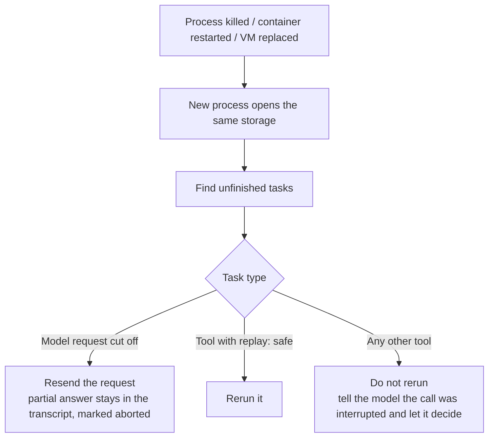

> 🌏 [中文版](/posts/ai/2026-10-05-pi-durable-long-running-agents)

If you are building an agent that runs for a long time, such as analyzing 100 files in one go or answering questions in a Slack channel around the clock, the first question to settle is: when the process dies, where does the agent's state live? This article covers [Pi 1.0](https://earendil.com/posts/pi-1-0/) and [Pi Durable](https://earendil.com/posts/pi-durable/), released by Earendil in early October 2026: what it stores that ordinary session persistence does not, and what limits apply when you run it on Cloudflare.

## What It Is

[Pi](https://pi.dev/) is a minimal, extensible agent harness. A harness, in Earendil's words, is storage plus the machinery to run one or more LLM conversations in parallel, along with the tools those models call and the environments the tools run in. The model thinks; the harness does everything else.

The release contains two things that should not be conflated:

| | Pi 1.0 | Pi Durable |
|---|---|---|
| Role | A coding agent for one person in a terminal | A foundation for long-running agentic applications; coding agents are one kind |
| Status | Stable release | Experimental package, API may change |
| License | MIT | MIT |

According to the release post, Pi 1.0 adds Codemode (native MCP support, plus non-LLM models such as Jev and image models), extension support for virtual models, deferred tool loading, cache warming for Anthropic models, mid-conversation system messages, and a full-screen TUI by default. In the official demo, a virtual model plans with Claude Opus and implements with GPT, with Jev deciding when to switch. That is model routing built into the harness.

The part worth reading closely is Pi Durable. Earendil's reasoning: Pi was designed for one person in a terminal, where a dead process means a human looks at what happened and says "continue." To reach other surfaces and longer tasks, it needs a layer that resumes on its own, so they put it in a separate package and kept Pi itself minimal.

## It Stores More Than the Conversation

Ordinary session persistence stores the transcript. If an agent is killed while analyzing file 64 of 100, it comes back knowing only that it was asked to analyze 100 files. It does not know whether the first 64 actually finished or whether the last tool call succeeded. (Another post on this site, [session persistence and crash recovery in coding agents](/en/posts/ai/2026-08-25-coding-agent-session-persistence-crash-recovery-en), compares how different agents write transcripts and where their crash windows are.)

Pi Durable makes everything the harness runs a task. In the official wording, "every step of a run is a task that stores a checkpoint before it moves on." The built-in tasks are one per model request, one per tool call, and one for compaction, and extensions can define their own. After a restart, a new process opens the same storage, finds the unfinished tasks, and continues each from its last checkpoint.



The two bottom branches are the most important trade-off in the design.

## Tool Replay: Reads Can Repeat, Emails Cannot

A tool declares whether it can be replayed with the `replay` field. The official example:

```ts
const searchIssues = defineTool({
    name: "search_issues",
    replay: "safe", // only reads, so a rerun after a crash is fine
    // ...
});

const deploy = defineTool({
    name: "deploy",
    // No replay: a deploy interrupted by a crash is reported to the model,
    // never repeated.
    // ...
});
```

For a tool not marked `safe`, the restarted agent gets an "interrupted" result along with whatever output was stored before the crash, and the model decides what to do. The reason is practical: if the email was already sent but the success state was not written back before the crash, replaying sends it twice. Pi Durable does not solve that for you. It leaves the decision visible.

Guaranteeing no duplicates still depends on an external [idempotency key](https://earendil.com/posts/pi-durable/). The official split-payment example passes `payment-<task id>` to the bank as the key, so if a phase reruns after a crash, the card is charged once. Separately, a `requestId` on each submission makes the submission exactly-once: a client that retries after a crash gets the original submission back instead of asking twice.

## One Harness, Many Conversations

Pi Durable is not a "one person, one agent" model. A harness runs many conversations concurrently, and a conversation can fork another at any point in its transcript, seeing the parent's history without copying it. The official analogy is Slack: the channel is one conversation, a thread forks from the message it replies to, and both run at once without blocking each other.

Each conversation stores its own agent: model, thinking level, which extensions and tools are active, extra instructions, and working directory in its execution environment. So a reviewer with a cheaper model, read-only tools and its own checkout is straightforward. One easy misreading: Pi Durable has **no built-in subagents**. The official approach is a tool that creates a conversation it owns, which takes a few lines of code. Because a subagent is just a conversation, it also resumes after a crash.

## Long Context and Application State

Compaction is also a task, and it runs in the background while the conversation continues. The conversation waits only when the next request would not fit. The post stresses that "older messages always stay in storage," so you can write a `search_history` tool to look up what was compacted away after a handoff.

Application state such as a todo list, plan, ticket or sandbox status goes into documents: typed JSON written in the same atomic commit as the transcript, so state never disagrees with the conversation that produced it. Each document also declares what a fork starts with.

## Running on Cloudflare

Cloudflare's [changelog of 2026-10-02](https://developers.cloudflare.com/changelog/post/2026-10-02-pi-harness) announced `PiHarness` in the Agents SDK. The split is: Pi Durable owns the agent loop and checkpoints, and Cloudflare's Lifecycle keeps it running inside a Durable Object. Pi's transcripts, inbox and tasks live in the object's SQLite database in tables prefixed `pi_`. Pi's scheduler is in memory and disappears when the object is evicted, so while a session has work, `PiHarness` schedules a Lifecycle job with a heartbeat, and its alarm restarts an evicted object.

Recovery behavior from the [official docs](https://developers.cloudflare.com/agents/harnesses/pi):

| What happens | Result |
|---|---|
| Object evicted, crashes, or exceeds memory or CPU limit | The next alarm restarts it and Pi continues from its last checkpoint |
| Deploy mid-run | Same as a crash; in-flight work gets 30 seconds, then an alarm restarts the object |
| Model was streaming | Pi keeps the stored partial answer and calls the model again |
| Tool with `replay: "safe"` was running | Pi runs it again |
| Any other tool was running | Pi does not rerun it; the model gets an interrupted result |

The heartbeat alarm fires every 30 seconds, so a crashed object comes back by the next heartbeat at the latest.

## Limitations

- **Everything is new.** Pi Durable is experimental and `PiHarness` is in beta. Cloudflare's docs say the API will likely change.
- **No approval step.** There is no built-in approval or permission step for tool calls. The official example builds deploy approval with a hook plus a memo, but it is not a built-in feature.
- **Long model calls can be cut.** An alarm invocation runs for up to 15 minutes and the harness hands off every 10, but a single model request that streams longer than 15 minutes can still be cut off.
- **No cursor on event streams.** Reconnecting clients always start from a snapshot.
- **One process owns a storage at a time.** Other clients attach to that process.
- **Conversations cannot be deleted yet.**
- **A machine that is off stays off.** Durability means the state survives, not that anything is running. If the power is out, the agent does nothing.

Also note that the guarantee is resume from checkpoint, not exactly-once execution of every step. The gap between checkpoints is where your tools have to protect themselves with `replay` declarations and idempotency keys.

## How to Use It

First decide whether your agent needs this. For an interactive coding session, Pi alone is enough. Pi Durable is for agents that stay resident, run long, or have several people stepping in.

The shortest path to trying it:

```bash
npm install @earendil-works/pi-durable @earendil-works/pi-ai @earendil-works/chord
```

Then read the README in `packages/durable` and its thirty-odd examples. The vacation planner example shows three parallel searches where, after the process is killed, only the unfinished one reruns. To deploy on Cloudflare, install `agents` plus both Pi packages (`PiHarness` needs version 1.0 or later of each) and set up the Durable Object and `AI` binding as the docs describe.

One thing you can do tonight for your own tools: list each one and ask whether running it twice could cause harm. Mark reads, searches and whole-file writes `safe`. Leave email, deploy and payment unmarked, and confirm the external system accepts an idempotency key.

## Bottom Line

Agent "memory" used to mean what the agent said. Pi Durable also stores how far it got, which turns a dead process from a disaster into an acceptable event. The cost is that you must decide the interruption semantics of every side-effecting tool, and that work does not go away with a new harness; it just has a place to live now. It is still experimental, so it suits internal tools that tolerate API changes, not production services that need a stable interface.

## References

- [Pi 1.0 — Earendil](https://earendil.com/posts/pi-1-0/)
- [Pi Durable — Earendil](https://earendil.com/posts/pi-durable/)
- [Pi official site](https://pi.dev/)
- [earendil-works/pi (GitHub)](https://github.com/earendil-works/pi)
- [Pi — Cloudflare Agents docs](https://developers.cloudflare.com/agents/harnesses/pi)
- [Run the Pi Durable harness on Cloudflare with the Agents SDK — Cloudflare Changelog (2026-10-02)](https://developers.cloudflare.com/changelog/post/2026-10-02-pi-harness)
- [Learning Agent Design from Mature Coding Agents (19): Session Persistence and Crash Recovery](/en/posts/ai/2026-08-25-coding-agent-session-persistence-crash-recovery-en)
- [The Model Is a Component, the Harness Is the System](/en/posts/ai/2026-08-10-model-component-harness-system-en)
