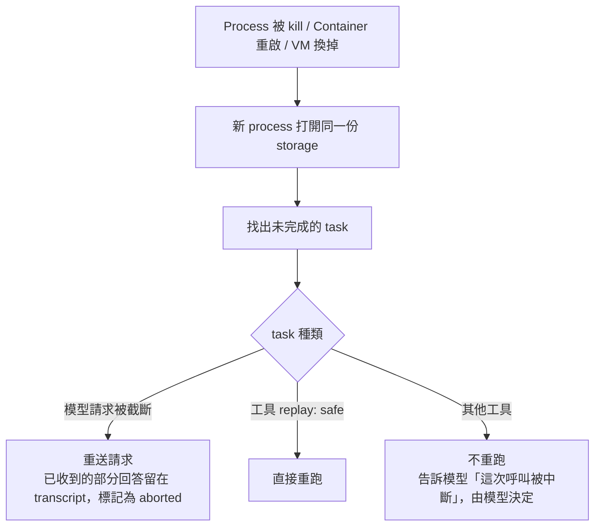

> 🌏 [English version](/en/posts/ai/2026-10-05-pi-durable-long-running-agents-en)

如果你正在做會跑很久的 agent，例如一次分析 100 個檔案、或是在 Slack 裡常駐回答問題，最需要先想清楚的問題是：process 死掉的那一刻，agent 的狀態在哪裡？這篇整理 Earendil 在 2026 年 10 月初發佈的 [Pi 1.0](https://earendil.com/posts/pi-1-0/) 與 [Pi Durable](https://earendil.com/posts/pi-durable/)，說明它存下來的東西跟一般 session 保存差在哪，以及在 Cloudflare 上跑有哪些限制。

## 這是什麼

[Pi](https://pi.dev/) 是一個極簡、可擴充的 agent harness。Harness 的意思是「儲存加上跑模型對話所需的機制」：它提供模型呼叫的工具，也提供工具執行的環境。模型負責想，harness 負責其餘的事。

這次發佈有兩個東西，不要混在一起：

| | Pi 1.0 | Pi Durable |
|---|---|---|
| 定位 | 給一個人在終端機裡用的 coding agent | 蓋長時間 agent 應用的底層，coding agent 只是其中一種 |
| 狀態 | 正式版 | 實驗性套件，API 可能再改 |
| 授權 | MIT | MIT |

Pi 1.0 收進來的功能，依官方列表有：Codemode（原生支援 MCP，也能接 Jev 這類非 LLM 模型與影像模型）、virtual models 的擴充支援、deferred tool loading、Anthropic 模型的 cache warming、對話中途改 system message，以及預設全螢幕的 TUI。官方示範裡，virtual model 讓 Claude Opus 負責規劃、GPT 負責實作，由 Jev 判斷何時切換，這就是 harness 內建的 model routing。

但這次真正值得讀的是 Pi Durable。Earendil 自己的說法是：Pi 原本設計給「一個人、一個終端機」，process 死了就由人看一眼再叫它繼續；要把它帶到其他介面、更長的任務，就需要另一個會自己從中斷處接上的底層，所以拆成獨立套件，讓 Pi 本身維持極簡。

## 它存的不只是對話

一般的 session 保存只存 transcript。Agent 在分析第 64 個檔案時被 kill，重開後只知道「使用者叫我分析 100 個檔案」，不知道前 64 個有沒有真的做完、上一次工具呼叫成功了沒。（站內另一篇 [coding agent 的 session 持久化與 crash recovery](/posts/ai/2026-08-25-coding-agent-session-persistence-crash-recovery) 比較過各家 agent 的 transcript 怎麼寫、crash window 在哪。）

Pi Durable 的做法是把 harness 跑的每一件事都變成 task。官方文章原話是 "every step of a run is a task that stores a checkpoint before it moves on"。內建的 task 有三種：每次模型請求一個、每次工具呼叫一個、compaction 一個，擴充套件也能定義自己的 task。重開之後，新 process 打開同一份 storage，找出沒做完的 task，各自從最後一個 checkpoint 繼續。



這張圖的底下兩條路徑，就是整套設計最關鍵的取捨。

## 工具重跑：讀可以重做，寄信不行

工具在 Pi Durable 裡用 `replay` 欄位宣告自己能不能重跑。官方範例：

```ts
const searchIssues = defineTool({
    name: "search_issues",
    replay: "safe", // 只讀，崩潰後重跑沒問題
    // ...
});

const deploy = defineTool({
    name: "deploy",
    // 沒宣告 replay：崩潰時被中斷的 deploy 只會回報給模型，不會重做
    // ...
});
```

沒標 `safe` 的工具，重開後模型會收到「這次呼叫被中斷」以及中斷前已存下的輸出，由模型決定下一步。原因很實際：寄信已經寄出去、成功狀態還沒寫回就掛掉，重跑一次就是寄兩封。Pi Durable 沒有替你解決這件事，它只是把判斷權留下來。

真的要保證不重複，要靠外部系統的 [Idempotency Key](https://earendil.com/posts/pi-durable/)。官方的分帳付款範例把 `payment-<task id>` 當作 key 傳給銀行，所以某個 phase 因崩潰重跑時，同一張卡只會被扣一次。另外每次 submit 可以帶 `requestId`，讓重試的 client 拿回原本那筆提交，而不是再問一次。

## 一個 harness，很多 conversation

Pi Durable 不是「一個人對一個 agent」的模型。一個 harness 可以同時跑多個 conversation，每個 conversation 可以從另一個的任一點 fork，而且看得到父層歷史但不用複製。官方用 Slack 比喻：頻道是一個 conversation，有人開討論串，就從被回覆的那則訊息 fork 出去，兩邊同時跑、互不阻塞。

每個 conversation 各自存自己的 agent 設定：模型、thinking level、啟用哪些擴充與工具、額外指示、在執行環境裡的工作目錄。所以「旁邊放一個便宜模型、只給唯讀工具、用自己的 checkout 的 reviewer」可以直接做。這裡有個容易讀錯的地方：Pi Durable **沒有內建 subagent**，官方的做法是自己寫一個工具，在工具裡建立一個自己擁有的 conversation，幾行程式就能完成。因為 subagent 本身也是 conversation，崩潰後也能接續。

## 長 context 與應用狀態

Compaction 在這裡也是 task，而且在對話繼續時於背景執行；只有下一個請求塞不下時才會等它。官方強調「older messages always stay in storage」，所以可以寫一個 `search_history` 工具，在 handoff 之後去查被壓縮掉的舊訊息。

Todo、Plan、Ticket、sandbox 狀態這類應用狀態，則放進 document：型別化的 JSON，跟 transcript 在同一個 atomic commit 裡寫入，所以狀態不會和產生它的對話對不上。每個 document 還可以指定 fork 時要從哪個值開始。

## 在 Cloudflare 上跑

Cloudflare 在 2026-10-02 的 [changelog](https://developers.cloudflare.com/changelog/post/2026-10-02-pi-harness) 宣布 Agents SDK 提供 `PiHarness`。分工是：Pi Durable 負責 agent 迴圈與 checkpoint，Cloudflare 的 Lifecycle 負責讓它在 Durable Object 裡持續跑。Pi 的 transcript、inbox 與 task 放在 Durable Object 的 SQLite，資料表名稱以 `pi_` 開頭；Pi 的排程器在記憶體裡，物件被回收後就沒了，所以 `PiHarness` 在 session 有工作時排一個帶 heartbeat 的 Lifecycle job，物件被回收就由它的 alarm 重新喚醒。

[官方文件](https://developers.cloudflare.com/agents/harnesses/pi)列出的復原行為：

| 情況 | 結果 |
|---|---|
| 物件被回收、崩潰、超過記憶體或 CPU 限制 | 下一次 alarm 重啟物件，從最後一個 checkpoint 繼續 |
| 執行中 deploy | 同崩潰；runtime 給進行中的工作 30 秒，之後由 alarm 重啟 |
| 模型正在串流 | 保留已存下的部分回答，再呼叫一次模型 |
| `replay: "safe"` 的工具執行中 | 重跑 |
| 其他工具執行中 | 不重跑，模型收到中斷結果 |

Heartbeat 每 30 秒一次，所以崩潰的物件最慢在下一次 heartbeat 被拉起來。

## 限制

- **都還很新**：Pi Durable 是實驗性套件，`PiHarness` 在 beta，Cloudflare 文件明講 API 很可能會變。
- **沒有核准機制**：目前沒有工具呼叫的 approval 或權限步驟。官方範例用 hook 加 memo 自己實作 deploy 核准，但這不是內建功能。
- **長模型呼叫會被切**：alarm 單次最多跑 15 分鐘，harness 每 10 分鐘交接一次，但單一模型請求串流超過 15 分鐘仍可能被切斷。
- **事件串流沒有游標**：重連的 client 一律從 snapshot 開始，不能從斷點續看。
- **一份 storage 同時只有一個 process 擁有**：其他 client 附著在那個 process 上。
- **還不能刪除 conversation**。
- **機器關了就是關了**：Durable 只保證狀態在，不保證有人在跑。電腦斷電，CPU 沒有在算，agent 就不會繼續工作。

另外，官方的 durable 保證是「從 checkpoint 接續」，不是「每一步恰好執行一次」。Checkpoint 之間的那一小段，才是工具要靠 `replay` 宣告與 idempotency key 自己守住的地方。

## 怎麼用

先決定你的 agent 值不值得這套設計。一次性的互動式 coding session，Pi 本身就夠了；會常駐、會跑很久、或有多人同時介入的 agent，才需要 Pi Durable。

要試的話，最短路徑是：

```bash
npm install @earendil-works/pi-durable @earendil-works/pi-ai @earendil-works/chord
```

然後讀 repo 裡 `packages/durable` 的 README 與三十多個範例，其中的 vacation planner 範例剛好示範「三個平行搜尋，進程被殺後只有沒做完的那一個重跑」。要放上 Cloudflare，就裝 `agents` 加上兩個 Pi 套件（`PiHarness` 需要兩者都 1.0 以上），照文件把 Durable Object 與 `AI` binding 設好。

設計自己的工具時，今晚就能做的一件事：把每個工具列出來，問「重跑一次會不會出事」。讀檔、搜尋、整檔寫入標 `safe`；寄信、部署、付款留空，並確認外部系統收得了 idempotency key。

## 整體來說

過去 agent 的「記憶」指的是它說過什麼；Pi Durable 把「做到哪裡」也存下來，讓 process 死掉從災難變成可接受的事件。代價是你得替每個有副作用的工具想清楚中斷時的語意，這件事不會因為換了 harness 就消失，只是現在有了地方可以放它。它還是實驗階段，適合用在可以容忍 API 變動的內部工具，不適合拿去綁住需要穩定介面的正式服務。

## 參考資料

- [Pi 1.0 — Earendil](https://earendil.com/posts/pi-1-0/)
- [Pi Durable — Earendil](https://earendil.com/posts/pi-durable/)
- [Pi 官方網站](https://pi.dev/)
- [earendil-works/pi（GitHub）](https://github.com/earendil-works/pi)
- [Pi — Cloudflare Agents 文件](https://developers.cloudflare.com/agents/harnesses/pi)
- [Run the Pi Durable harness on Cloudflare with the Agents SDK — Cloudflare Changelog（2026-10-02）](https://developers.cloudflare.com/changelog/post/2026-10-02-pi-harness)
- [跟成熟 coding agent 學設計（19）：Session 持久化與 crash recovery](/posts/ai/2026-08-25-coding-agent-session-persistence-crash-recovery)
- [模型只是元件，harness 才是系統](/posts/ai/2026-08-10-model-component-harness-system)
