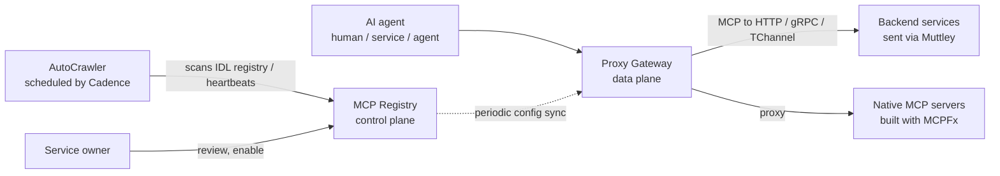

> 🌏 [中文版](/posts/ai/2026-10-06-uber-mcp-gateway)

If dozens of teams at your company each build their own [MCP](/posts/ai/2026-03-22-mcp-model-context-protocol-en) server, each handling auth, permissions and logging on its own, this post is one answer from Uber. Uber's engineering blog post "[Designing MCP Gateway](https://www.uber.com/us/en/blog/designing-mcp-gateway/)" describes how they route all MCP traffic through one gateway that now hosts 800+ MCP servers and 5,000+ tools. After reading you should be able to decide whether you need a gateway and which of its design choices are worth borrowing.

## What it is and who it is for

Uber's agents started with each team wiring up MCP by hand, which left tools scattered, infrastructure duplicated, and everything hard to find or operate. The MCP Gateway is the fix: an intermediary microservice between AI agents and backend services. It speaks only MCP to agents, and HTTP, gRPC or TChannel (Uber's own RPC protocol) to the backend.

It is a good read for:

- Engineers who own an agent platform, internal tooling or developer experience
- Tech leads deciding whether to consolidate "every team builds its own MCP server"

Prerequisites: you know what an MCP tool and server are, and you understand microservices and RPC. No Uber internals needed. For background on context management, see our post [Code Mode: Moving Tool Definitions from Context into Code](/posts/ai/2026-05-10-code-mode-mcp-runtime-pattern-en).

## Content map

The post has two halves: the gateway itself, then the problems that only show up at scale.

### Control plane: AutoCrawler and the MCP Registry

Uber has thousands of internal services, and asking every team to hand-write an MCP server would be slow. So they built AutoCrawler, a workflow scheduled by [Cadence](https://cadenceworkflow.io/) that periodically scans the IDL registry and service signals. For each API it finds, it does five things: create a virtual MCP server, parse the Protobuf or Thrift, use an LLM to rewrite methods and comments into descriptions an agent can read, convert the schema to MCP's JSON format, and register everything in the Registry.

Native MCP servers (built with an internal framework, MCPFx) take a different path. Each server emits a heartbeat; AutoCrawler notices it, calls `listTools` to fetch the tool list, and creates a proxying virtual server in the Registry.

The design rule worth remembering is here: **discovery does not imply exposure**. Every auto-generated server and tool is disabled by default and becomes available only after the owning team reviews and enables it. Each change to a tool description produces a config diff that owners must approve, and they can roll back to a previous version. The system can build a catalog without bothering service teams, yet the decision to let agents use a tool stays with the owner.

### Data plane: the Proxy Gateway

The data plane regularly pulls configuration from the control plane and refreshes its in-memory state, so enabling or changing a tool needs no restart or redeploy. Each virtual server exposes a single `/<service-name>/mcp` endpoint.

For IDL-backed services a call goes through four steps: translate the MCP JSON into the target format, serialize to Protobuf or Thrift, forward downstream, and translate the response back to JSON. The actual request goes out through Muttley, Uber's service mesh sidecar, which reuses existing service routing and requires no change to the downstream service. Native MCP servers are proxied transparently.

Security lives in this layer too. Authorization works per tool, using Uber's internal access control system to apply charter policies that distinguish whether the caller is a human, a service or an agent. Policies are set per server with optional per-tool overrides, and the gateway redacts PII and sensitive data in responses by default. For third-party MCP servers (the post names Jira and Google), the gateway relays the user's token, and a separate service exchanges the internal token for a third-party one.

### Three context optimizations at scale

With hundreds of servers connected to an agent, the tool list alone eats the context window. The post offers three answers:

| Approach | Problem it solves | Mechanism |
|---|---|---|
| Omni MCP | No need to preconfigure every server | One proxy server exposing four tools, `discover_server`, `discover_tools`, `get_tool_schema` and `invoke_tool`, so agents look things up incrementally |
| Response Projection | Bloated tool responses | Adds a field to a tool's request schema where the LLM lists the field paths it needs; the gateway trims the rest at runtime (similar to GraphQL field selection) |
| Code Mode | Tool output flooding context | Calls go through the `aifx` CLI (`mcp list` / `mcp search` / `mcp call`), output is written to files, and the agent greps only what it needs; the post says this is now Uber's default for coding agents using MCP tools |

## A concrete example: turning an internal API into a tool

Say there is a gRPC service with a method called `GetTrip`:

1. AutoCrawler finds its Protobuf, builds a matching virtual MCP server, and generates a tool description with an LLM. The tool starts **disabled**.
2. The service owner sees the tool and its description in the Registry, edits it if needed, and enables it.
3. An agent calls `/<service-name>/mcp`. The gateway authenticates, applies policy, converts the JSON to Protobuf and sends it via Muttley, converts the response back to JSON, redacts PII, and returns it.

The service team wrote no MCP code, yet every step to going live passed through them.

## Limits and things to watch while reading

- **Single source, self-reported**: this is Uber describing its own system. The 800 servers and 5,000 tools are scale figures, but none of the three context optimizations comes with token usage, latency or cost comparisons. Treat them as "what they chose to do", not measured results.
- **Tied to Uber infrastructure**: the IDL registry, Cadence, Muttley, MCPFx, `aifx` and the internal access control system are all Uber assets. The post does not say which are open source, so you would need to find your own equivalents.
- **LLM-written tool descriptions**: the post says AutoCrawler uses an LLM to rewrite descriptions, which is why owner review exists, but it does not say how quality is measured or how heavy the review burden is.
- **Organizational assumption**: owner review only works if every service has a clearly responsible team.
- The post does not cover failure handling, concrete rate-limiting strategy, or multi-tenant isolation. You would fill those in yourself.

## How to use this guide

You do not need Uber's whole stack. Three ideas are cheap and independent of scale:

1. **Disable auto-generated tools by default**, require owner approval to expose them, and handle changes through diffs and rollback.
2. **Put permissions and PII redaction in the gateway, not in each server**, and distinguish human, service and agent callers.
3. Once the tool count grows, **stop relying on preconfigured tool lists**: try incremental discovery first (the four Omni MCP tools are a ready template), then consider trimming response fields.

## Overall

The post's core claim is that the fastest way to give agents access to existing systems is to wrap existing APIs as tools rather than ask every team to rewrite their services. Uber automates building the catalog, leaves the right to expose with the owner, and centralizes security and observability in the gateway. Whether you need one depends on how many MCP servers and teams you have. This is my inference, since the post gives no threshold: with only a handful of servers all owned by one team, you probably do not need it yet.

## References

- [Uber Engineering — Designing MCP Gateway: Uber's MCP Management Platform](https://www.uber.com/us/en/blog/designing-mcp-gateway/) (the post this guide covers)
- [Cadence workflow](https://cadenceworkflow.io/) (the scheduling framework AutoCrawler uses)
- [Model Context Protocol](https://modelcontextprotocol.io/)
- [MCP (Model Context Protocol) explained](/posts/ai/2026-03-22-mcp-model-context-protocol-en) (on this site)
- [Code Mode: Moving Tool Definitions from Context into Code](/posts/ai/2026-05-10-code-mode-mcp-runtime-pattern-en) (on this site)
