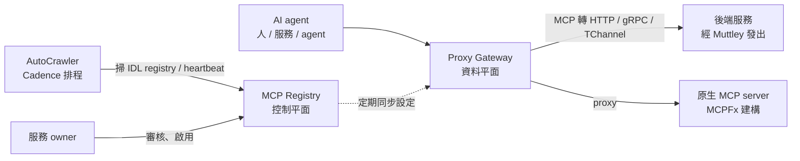

> 🌏 [English version](/en/posts/ai/2026-10-06-uber-mcp-gateway-en)

如果你的公司有幾十個團隊各自做 [MCP](/posts/ai/2026-03-22-mcp-model-context-protocol) server，每個 server 各自處理認證、權限、log，這篇是 Uber 給的一份答案。Uber 工程部落格〈[Designing MCP Gateway](https://www.uber.com/us/en/blog/designing-mcp-gateway/)〉描述他們把所有 MCP 流量收進一個 gateway，目前託管 800 多個 MCP server、5,000 多個 tool。看完你能判斷：自家要不要做 gateway，以及哪幾個設計值得直接抄。

## 它是什麼，適合誰讀

Uber 的 agent 最早是各團隊自己接 MCP，結果工具散落、基礎設施重複、不好找也不好維運。MCP Gateway 是他們的解法：一個位在 AI agent 與後端服務之間的中介微服務，對外只講 MCP，對內講 HTTP、gRPC、TChannel（Uber 自家的 RPC 協定）。

適合讀的人：

- 負責 agent 平台、內部工具或開發者體驗的工程師
- 正在評估「各團隊自己做 MCP server」要不要收斂的技術主管

先備知識：知道 MCP 的 tool、server 是什麼；了解微服務與 RPC 即可，不需要熟悉 Uber 內部系統。想先補 context 管理的背景，可以讀站內的〈[Code Mode：把 tool definition 從 context 搬進 code](/posts/ai/2026-05-10-code-mode-mcp-runtime-pattern)〉。

## 內容地圖

整篇分成兩大塊：先是 gateway 本體的設計，再是規模放大後才浮現的問題。

### 控制平面：AutoCrawler 與 MCP Registry

Uber 有上千個內部服務，要求每個團隊手寫 MCP server 太慢。所以他們做了 AutoCrawler：一個用 [Cadence](https://cadenceworkflow.io/) 排程的 workflow，定時掃 IDL registry 與服務訊號，對每個發現的 API 做五件事：建立虛擬 MCP server、解析 Protobuf 或 Thrift、用 LLM 把方法與註解改寫成 agent 讀得懂的 tool 描述、把 schema 轉成 MCP 用的 JSON 格式、註冊進 Registry。

原生 MCP server（用內部框架 MCPFx 建的）走另一條路：每個 server 發 heartbeat，AutoCrawler 偵測到後呼叫 `listTools` 取回 tool 清單，在 Registry 建一個代理用的虛擬 server。

整篇最值得記的一句設計原則在這裡：**發現不等於開放**。所有自動產生的 server 與 tool 一律預設停用，必須由服務 owner 審核後才啟用；tool 描述每次修改都會產生 config diff，要 owner 核准，出事可以回滾到前一版。系統可以在不打擾服務團隊的情況下建出目錄，但「要不要給 agent 用」這個決定權仍在 owner 手上。

### 資料平面：Proxy Gateway

資料平面定期從控制平面拉設定、更新記憶體內狀態，所以啟用或更新 tool 不用重啟、不用重新部署。每個虛擬 server 對外只有一個 `/<service-name>/mcp` 端點。

對 IDL 服務的呼叫流程是四步：把 MCP 的 JSON 轉成目標格式、序列化成 Protobuf 或 Thrift、轉發給下游、再把回應轉回 JSON。實際發送交給 Uber 的 service mesh sidecar Muttley，因此沿用既有的服務路由，下游服務完全不用改。原生 MCP server 則是透明代理。

安全也收在這一層：授權以 tool 為粒度，用 Uber 內部的存取控制系統套用 charter policy，區分呼叫者是人、服務還是 agent，政策設在 server 層、tool 層可覆寫；回應內的 PII 與敏感資料由 gateway 預設遮蔽。第三方 MCP server（文中舉 Jira、Google）則是 gateway 轉送使用者 token，由另一個服務把內部 token 換成第三方 token。

### 規模放大後的三個 context 優化

幾百個 server 全部接進 agent，光是 tool 清單就會吃掉 context。文章提出三個做法：

| 做法 | 解什麼 | 機制 |
|---|---|---|
| Omni MCP | 不用預先設定每個 server | 單一代理 server，只暴露 `discover_server`、`discover_tools`、`get_tool_schema`、`invoke_tool` 四個 tool，讓 agent 漸進式查找 |
| Response Projection | tool 回應太肥 | 在 tool 的請求 schema 加一個欄位，讓 LLM 列出需要的欄位路徑，gateway 在執行時裁掉其餘（類似 GraphQL 選欄位） |
| Code Mode | 輸出灌進 context | 透過 CLI `aifx`（`mcp list`／`mcp search`／`mcp call`）呼叫，輸出寫進檔案，agent 再 grep 需要的部分；文中說已是 coding agent 使用 MCP tool 的公司預設 |

## 一個具體例子：把一支內部 API 變成 tool

假設有個 gRPC 服務，方法叫 `GetTrip`：

1. AutoCrawler 掃到它的 Protobuf，建出對應的虛擬 MCP server，用 LLM 生成 tool 描述，狀態是**停用**。
2. 服務 owner 在 Registry 看到這支 tool 與描述，必要時修改，核准後啟用。
3. Agent 呼叫 `/<service-name>/mcp`；gateway 驗身份、套政策，把 JSON 轉成 Protobuf 經 Muttley 送出，回應轉回 JSON，過濾掉 PII 後回給 agent。

服務團隊沒寫任何一行 MCP 程式碼，但上線的每一步都經過自己。

## 限制與讀的時候要留意

- **單一來源、自述性質**：這是 Uber 對自家系統的描述。文中的 800 個 server、5,000 個 tool 是規模數字，但三個 context 優化都沒有附 token 用量、延遲或成本的前後對照，效果只能當作「他們選擇這樣做」，不是實測結論。
- **高度綁定 Uber 基礎設施**：IDL registry、Cadence、Muttley、MCPFx、`aifx`、內部存取控制系統都是 Uber 的既有資產。文章沒有說明哪些會開源，自建者要自己找對應物。
- **LLM 生成的 tool 描述**：文中說 AutoCrawler 用 LLM 改寫描述，所以才需要 owner 審核；但沒有講品質如何衡量，審核流程的負擔也沒有數字。
- **人力與流程假設**：「owner 審核」要成立，前提是每個服務都有明確的負責團隊。
- 文章也沒有談失敗處理、rate limit 的具體策略、多租戶隔離等細節，這些要自己補。

## 怎麼用這份導讀

不必照抄 Uber 的整套，下面三件事成本低、且與規模無關：

1. **自動產生的 tool 一律預設停用**，由 owner 核准才開放，改動走 diff 與回滾。
2. **權限與 PII 遮蔽放在 gateway，不要散在各 server**，並區分呼叫者是人、服務還是 agent。
3. 工具超過一個量以後，**別再靠預先設定的 tool 清單**：先試漸進式查找（Omni MCP 的四個 tool 是現成範本），再考慮回應裁欄位。

## 整體來說

這篇的核心主張是：想讓 agent 用上現有系統，最快的路是把既有 API 包成 tool，而不是要求各團隊重寫服務。Uber 把「建目錄」自動化、把「開放權」留給 owner、把「安全與觀測」集中在 gateway，用這三個切分換到規模。要不要做 gateway，取決於你的 MCP server 數量與團隊數量。這是我的推論，文章沒給門檻：server 只有個位數、都在同一個團隊手上時，大概還不需要。

## 參考資料

- [Uber Engineering — Designing MCP Gateway: Uber's MCP Management Platform](https://www.uber.com/us/en/blog/designing-mcp-gateway/)（本文導讀的原文）
- [Cadence workflow](https://cadenceworkflow.io/)（AutoCrawler 使用的排程框架）
- [Model Context Protocol 官方網站](https://modelcontextprotocol.io/)
- [MCP（Model Context Protocol）完整介紹](/posts/ai/2026-03-22-mcp-model-context-protocol)（站內）
- [Code Mode：把 tool definition 從 context 搬進 code](/posts/ai/2026-05-10-code-mode-mcp-runtime-pattern)（站內）
