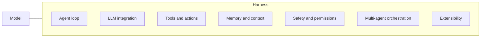

> 🌏 [中文版](/posts/ai/2026-10-07-harness-source-code-study-eleven-systems)

If you are picking a coding agent, or planning to build one, this paper offers something rare: not benchmark scores or vendor claims, but 11 production harnesses read side by side at the source level. This post summarizes its conclusions and what you can do with them.

## What the paper is

The paper is [Harness Engineering: Anatomy, Architecture, and Evolution of Coding Agents — A Source-Code Study of Eleven Systems](https://arxiv.org/abs/2609.00006) (arXiv:2609.00006, submitted 2026-07-15). The [HTML version](https://arxiv.org/html/2609.00006v1) lists Tristan Darrigol, Germain Vu, Tom Wiltberger and Paul Barbaste, all at Wavestone AI Lab; Barbaste is the corresponding author and also lists Inclusive Brains. It runs 83 pages and is an expanded second edition of an April 2026 study, with the corpus grown from 8 systems to 11.

Its starting point is one equation: Agent = Model + Harness. The model supplies the intelligence; the harness is everything except the model: the loop, tools, context management, safety controls, orchestration and extension surfaces. The paper says the term "harness engineering" only entered circulation in February 2026, so the discipline is about half a year old.

The 11 systems: Claude Code, Codex CLI, Gemini CLI, Mistral Vibe, OpenHands, Aider, Mini-SWE-Agent, Hermes, Pi, OpenCode and OpenClaw. A twelfth, Databricks' [Omnigent](/posts/ai/2026-08-26-omnigent-meta-harness-en), is a meta-harness that sits above other harnesses (the paper says it orchestrates 11 vendor harnesses, 5 of them in this corpus). It serves as a second contrast point and is not counted among the 11.

The paper does not benchmark or rank. The authors say in the abstract that it describes how the systems are built, not which one is best.

## Who it is for

Three kinds of readers:

- You are comparing Claude Code, Codex CLI and Gemini CLI and want to know how they differ underneath.
- You are writing your own agent runtime and want to know which paths others have already walked.
- You are deciding whether to adopt LangChain or a vector database.

You only need to have used one coding agent and know what a tool call is. Reading the [evolution of harness engineering](/posts/ai/2026-03-28-harness-engineering-evolution-en) first helps you see where this paper sits, but it is not required.

## Content map: seven subsystems

The paper uses seven subsystems as coordinates. Every system has to take a position on each one, even if that position is deliberate absence.

For each cell the paper names the minimal and maximal implementation. The minimal one is almost always Mini-SWE-Agent: one while loop, one bash tool, one LiteLLM call. The maximal ones have different owners: OpenHands' event-sourced loop, Claude Code's 43 typed tools, Codex's policy rules plus OS sandbox.

Section 13 distills 13 cross-cutting observations and 29 recurring design patterns. The first observation is worth remembering up front: how elaborate the loop is does not predict benchmark performance. Mini-SWE-Agent's linear loop reports results in the same range as OpenHands' event-sourced engine (these numbers come from each system's own documentation, and the paper itself says the last decimal is not the point).

## A concrete finding: two collective absences

This is the headline in both the social post that prompted this article and the paper. I checked it against the original text.

**Absence one: nobody uses a general-purpose agent framework.** The paper inspected every dependency manifest and grepped the source trees for LangChain, LangGraph, LlamaIndex, AutoGen, CrewAI and about a dozen more. Across roughly 4 million lines of Python, TypeScript and Rust, no production agent code path imports any of them. Gemini CLI uses neither of Google's own Genkit nor ADK. Every loop is hand-rolled on the language's native async primitives.

The paper sets this beside Anthropic's late-2024 [Building Effective Agents](https://www.anthropic.com/research/building-effective-agents), which recommends starting from raw SDK calls because framework abstractions can obscure the underlying prompts and responses and make them harder to debug. The paper's reading: once an agent is mutating real source code, failures like silent prompt corruption and opaque caching become too expensive, and hand-rolled, debuggable code beats reusable abstraction.

**Absence two: nobody retrieves code with vector embeddings.** The 11 systems find code with ripgrep, glob, tree-sitter and auto-discovered Markdown context files (CLAUDE.md, AGENTS.md and the like). Aider extracts symbols with tree-sitter and ranks them into a repo map under a token budget, again without embeddings.

One detail needs precision: "nobody uses embeddings" applies only to **code retrieval**. OpenClaw's default memory plugin, memory-core, does run with embeddings on (hybrid sqlite-vec plus FTS5/BM25 search), but for chat recall, not for reading source. Hermes goes the other way and keeps even its past-conversation search lexical.

## Three more results worth taking away

**SKILL.md edges out MCP, but only narrowly.** 9 of 11 systems support SKILL.md and 8 of 11 support MCP. The April edition was a tie; this time Pi's explicit "skills yes, MCP no" position broke it. The paper also notes the two live at different layers: skills for procedures and domain knowledge, MCP for external services, and they compose. Eight of the nine skill adopters load only skill metadata eagerly and fetch the body on demand.

**Convergence is turning into imitation.** The paper source-diffs the same harnesses across one quarter. Codex's hook event names are near-verbatim copies of Claude Code's, and it ships an importer for Claude Code sessions and settings. OpenHands reads Claude Code's plugin format.

**ACP gained a third role.** Six systems now ship ACP. Beyond editor integration, OpenHands can run Claude Code, Codex or Gemini CLI as interchangeable backends, which the paper calls harness hosting. For where ACP sits in the wider protocol stack, see [same word, different layer: meta-harness, ACP, HarnessAgent and Flue](/posts/ai/2026-08-26-meta-harness-layers-en).

Together these support the paper's thesis: in the first half of 2026, the coding harness turned from a tool into a platform. The evidence includes harnesses packaged as importable SDKs, plugin marketplaces and enterprise governance layers, and agents addressable as a model behind an OpenAI-compatible endpoint.

## Where OpenClaw fits

OpenClaw is the only system on the list that does not write code itself. The paper classes it as a personal AI assistant gateway spanning 20-plus messaging platforms (WhatsApp, Slack, Discord, Signal, iMessage, Matrix and others). It has no built-in code-editing tool, shown as N/A in the paper's table. When code needs changing, it hands the job over ACP to an external coding agent through plugins such as opencode and github-copilot. This site already has [a walkthrough of its agent loop](/posts/ai/2026-03-28-openclaw-agent-loop-en).

The paper includes it to answer a question: are ACP, MCP and Skills conventions only for coding agents, or the shared language of the whole agent-platform category? OpenClaw adopts the same standards without writing code, which gives the convergence claim a counter-witness. Its plugin architecture, 260 SDK files, also lets the paper separate extensibility patterns specific to coding agents from broader ones.

It also explains the embeddings exception above: because OpenClaw does not read source code, it is the one system with embeddings on by default.

## Limits: what the paper can and cannot show

The paper lists its own limits in Section 15. The main ones:

- **Source reading, not runtime measurement.** It can say how systems are structured, not which is faster. Benchmark numbers in the text come from each system's own documentation.
- **The 11 systems were not run on a shared task set**, so you cannot use this paper to rank them.
- **Claude Code is the weakest link.** The analysis draws on a publicly circulated source snapshot from March 2026, not an official release, so it is hard for others to reproduce.
- **The framework-absence finding is conservative.** The authors checked dependency manifests and import greps in three languages; they did not trace internal forks, dynamically loaded plugins or transpiled distributions.
- The mapping between Anthropic's guidance and the observed designs is, in the paper's words, suggestive but does not establish causation.

Two more reading notes. First, "nobody uses it" describes these 11 systems at one point in time; it does not mean frameworks or vector retrieval have no value elsewhere, and the paper itself says production coding agents run on a different complexity budget from generic LLM apps. Second, this guide is based on my reading of the paper's abstract, definitions, system comparison, Section 13 observations and Sections 15 and 16. I did not read all 83 pages, so go to the paper for per-system detail.

## How to use it: 18 recommendations and a 90-line scaffold

Section 16 distills the analysis into 18 recommendations, plus a 90-line minimum-viable harness that implements ten of them. Compressed into things you can do tonight:

1. **Start with one bash tool** (recommendation 3); add tools only when you see a failure mode, and adopt deferred tool loading only past roughly 15 tools (recommendation 4).
2. **Use a plain linear while loop** (recommendation 1) and graduate to a middleware pipeline only when unrelated per-turn rules appear.
3. **Find code with ripgrep, glob and tree-sitter** (recommendations 8 and 16). Do not stand up a vector store because "we need RAG".
4. **Auto-discover Markdown context files** (recommendation 6), and read your neighbors' filenames too, for example both AGENTS.md and CLAUDE.md.
5. **Compact on a threshold** (recommendation 7): keep a fixed buffer below the context window, preserve a verbatim recent tail, and merge summaries incrementally.
6. **Write safety rules as data, not imperative code** (recommendation 11). For developer tools use PLAN / DEFAULT / YOLO modes (recommendation 9); for enterprise or shared settings use OS-level sandboxing with policy-as-code (recommendation 10).
7. **Skills for capability templates, MCP for external integrations** (recommendation 14), with Skills first in priority.
8. **Stay single-agent until you can point to a breadth-first phase where parallel search clearly beats serial** (recommendation 12).
9. **Ship an ACP server if you want others to use your harness as a backend** (recommendation 13), and keep your own sub-agents in-process.
10. **Do not wrap every upstream SaaS API as a one-to-one tool** (recommendation 17), and do not over-engineer stuck detection; ship the few cheap caps (recommendation 18).

If you are choosing a tool rather than building one, the most practical check is whether it supports SKILL.md, reads the AGENTS.md or CLAUDE.md already in your project, and offers explicit permission modes. In the paper these are the converging parts, so they are what carries over when you switch tools.

## References

- [Harness Engineering: Anatomy, Architecture, and Evolution of Coding Agents — A Source-Code Study of Eleven Systems (arXiv:2609.00006)](https://arxiv.org/abs/2609.00006)
- [Paper HTML version (v1)](https://arxiv.org/html/2609.00006v1)
- [Building Effective Agents (Anthropic)](https://www.anthropic.com/research/building-effective-agents)
- [Agent Skills specification (agentskills.io)](https://agentskills.io/)
- [Model Context Protocol](https://modelcontextprotocol.io/)
- On this site: [From Prompt to Harness: Three Evolutions of AI Engineering](/posts/ai/2026-03-28-harness-engineering-evolution-en)
- On this site: [Managing Multiple Agents Together: Omnigent's Meta-Harness](/posts/ai/2026-08-26-omnigent-meta-harness-en)
- On this site: [Same Word, Different Layer: meta-harness, ACP, HarnessAgent and Flue](/posts/ai/2026-08-26-meta-harness-layers-en)
- On this site: [OpenClaw Agent Loop](/posts/ai/2026-03-28-openclaw-agent-loop-en)
