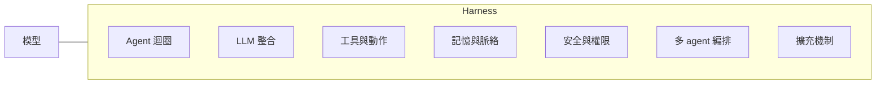

> 🌏 [English version](/posts/ai/2026-10-07-harness-source-code-study-eleven-systems-en)

如果你正在挑 coding agent，或打算自己做一個，這篇論文給了少見的材料：不是跑分，也不是廠商說法，而是把 11 個正在上線的 harness 原始碼並排讀完，看它們實際怎麼蓋。這篇導讀整理它的結論，以及你讀完可以拿去做的事。

## 這篇論文是什麼

論文是〈[Harness Engineering: Anatomy, Architecture, and Evolution of Coding Agents — A Source-Code Study of Eleven Systems](https://arxiv.org/abs/2609.00006)〉（arXiv:2609.00006，2026-07-15 提交）。[HTML 版](https://arxiv.org/html/2609.00006v1)署名 Tristan Darrigol、Germain Vu、Tom Wiltberger 與 Paul Barbaste，單位為 Wavestone AI Lab；Barbaste 是通訊作者，也掛名 Inclusive Brains。全文 83 頁，是 2026 年 4 月初版研究的擴充版，語料從 8 個系統增加到 11 個。

它的出發點是一條算式：Agent = Model + Harness。模型提供智力，harness 是「除了模型以外的一切」，也就是迴圈、工具、脈絡管理、安全控管、編排與擴充介面。論文說「harness engineering」這個詞在 2026 年 2 月才進入流通，所以這門學問到現在也只有大約半年。

被拆開的 11 個系統：Claude Code、Codex CLI、Gemini CLI、Mistral Vibe、OpenHands、Aider、Mini-SWE-Agent、Hermes、Pi、OpenCode、OpenClaw。另外還有 Databricks 的 [Omnigent](/posts/ai/2026-08-26-omnigent-meta-harness)，它是 meta-harness，位在各家 harness 之上做協調（論文說它協調 11 個廠商 harness，其中 5 個在本文名單內），論文把它當第二個對照點，不算在 11 個之內。

這篇論文不跑分也不排名。作者在摘要裡就說，它描述的是系統怎麼被蓋出來，不是誰比較強。

## 給誰看

適合三種人：

- 正在比較 Claude Code、Codex CLI、Gemini CLI 這些工具，想知道它們底層差在哪。
- 打算自己寫 agent runtime，想先知道別人踩過哪些路。
- 在評估要不要導入 LangChain、向量資料庫這類東西。

先備知識只要用過一種 coding agent，知道 tool call 是什麼。不需要讀過 [harness engineering 的演化脈絡](/posts/ai/2026-03-28-harness-engineering-evolution)，但讀過會更容易感受到這篇論文的位置。

## 內容地圖：七個子系統

論文用七個子系統當座標，每個系統都得對每一格表態，連「刻意不做」也算表態。

論文對每一格都列出最小和最大的實作。最小的幾乎都是 Mini-SWE-Agent：一個 while 迴圈、一個 bash 工具、一次 LiteLLM 呼叫。最大的各有主人，例如 OpenHands 的事件溯源迴圈，Claude Code 的 43 個有型別的工具，Codex 的政策規則加 OS sandbox。

第 13 節整理出 13 個跨系統觀察和 29 種反覆出現的設計模式。其中第一個觀察很值得先記：迴圈寫得多複雜，和跑分沒有關係。Mini-SWE-Agent 的線性迴圈，成績和 OpenHands 的事件溯源引擎落在同一個範圍（數字來自各系統自己的文件，論文自己也提醒小數點後不是重點）。

## 一個具體的發現：兩個集體缺席

這是貼文和論文都主打的結論，我回到論文原文核對過。

**缺席一：沒有人用通用 agent framework。** 論文檢查了每個專案的依賴清單，也在原始碼裡 grep 了 LangChain、LangGraph、LlamaIndex、AutoGen、CrewAI 等十幾個名字，約 400 萬行 Python、TypeScript、Rust 裡，沒有任何一條正式的 agent 執行路徑引入它們。Gemini CLI 連 Google 自家的 Genkit 和 ADK 也沒用。所有迴圈都是用語言原生的 async 機制手刻的。

論文把它和 Anthropic 在 2024 年底發表的 [Building Effective Agents](https://www.anthropic.com/research/building-effective-agents) 並排：那篇文章建議從原始 SDK 呼叫開始，因為 framework 多出來的抽象層會讓底層 prompt 和回應更難除錯。論文的解讀是，一旦 agent 真的在改你的程式碼，無聲的 prompt 損壞、看不透的快取這類失敗成本太高，手寫、可除錯的程式碼就贏過可重用的抽象。

**缺席二：沒有人用向量嵌入檢索程式碼。** 11 個系統找程式碼用的是 ripgrep、glob、tree-sitter 和自動載入的 Markdown 脈絡檔（CLAUDE.md、AGENTS.md 之類）。Aider 的做法是用 tree-sitter 抽出符號，再依 token 預算排序成 repo map，同樣不靠嵌入。

這裡有一個要精確的細節：「沒有人用嵌入」只限於**程式碼檢索**。OpenClaw 的預設記憶外掛 memory-core 就預設開著嵌入（sqlite-vec 加 FTS5/BM25 的混合搜尋），但用途是聊天記憶，不是讀原始碼。Hermes 則反過來，連過去對話搜尋都刻意只用詞法搜尋。

## 另外三個值得帶走的結果

**SKILL.md 超過 MCP，但只是小贏。** 11 個系統中有 9 個支援 SKILL.md，8 個支援 MCP。四月那版是平手，這次是 Pi 明確選了「要 skills、不要 MCP」才打破。論文也指出兩者不在同一層：skills 適合流程與領域知識，MCP 適合接外部服務，兩者可以並用。有 8 個採用者只先載入 skill 的 metadata，用到才抓內容。

**趨同開始變成模仿。** 論文拿同樣的 harness 隔一季做原始碼比對。Codex 的 hook 事件名稱幾乎照抄 Claude Code，並附上匯入 Claude Code session 和設定的工具；OpenHands 能讀 Claude Code 的 plugin 格式。

**ACP 多了第三種角色。** 已經有六個系統內建 ACP。除了編輯器整合之外，OpenHands 現在能把 Claude Code、Codex 或 Gemini CLI 當成可互換的後端來跑，論文稱這個角色為 harness hosting。想看 ACP 在整個協議堆疊裡的位置，可以接著讀[同名不同層：meta-harness、ACP、HarnessAgent 與 Flue](/posts/ai/2026-08-26-meta-harness-layers)。

這些加起來就是論文的主張：2026 上半年，coding harness 從「工具」變成了「平台」。具體的證據包括 harness 被包成可 import 的 SDK、出現外掛市集和企業治理層，以及 agent 可以被當成一個 OpenAI 相容端點背後的模型來呼叫。

## OpenClaw 在名單裡扮演什麼

OpenClaw 是這份名單裡唯一不寫程式的系統。論文把它定位為個人 AI 助理閘道，橫跨 20 幾個訊息平台（WhatsApp、Slack、Discord、Signal、iMessage、Matrix 等），自己沒有內建的程式碼編輯工具，表格裡標 N/A。需要改程式時，它透過 ACP 把工作交給外部的 coding agent，例如 opencode、github-copilot 這些外掛。站內已有[它的 agent loop 導讀](/posts/ai/2026-03-28-openclaw-agent-loop)。

論文把它抓進來，是為了回答一個問題：ACP、MCP、Skills 這些慣例，是寫程式的 agent 才需要，還是整個 agent 平台的共通語言？OpenClaw 不寫程式卻採用同一組標準，等於替「收斂」這個結論補了一個反面證人。它的外掛架構有 260 個 SDK 檔，這點也讓論文能分辨哪些擴充模式只屬於寫程式的 agent。

這也是前面那個「嵌入」例外的來源：OpenClaw 因為不讀原始碼，才會是唯一預設開嵌入的系統。

## 限制：這篇論文能證明什麼、不能證明什麼

論文自己在第 15 節列了限制，我照錄重點：

- **只讀原始碼，沒有跑執行測量。** 它能說系統怎麼構成，不能說誰比較快。文中出現的跑分是各系統自己文件的數字。
- **11 個系統沒有放在同一組任務上跑過**，所以不能拿這篇去排名。
- **Claude Code 是最弱的一環。** 分析依據是 2026 年 3 月流傳出來的原始碼快照，不是官方釋出版本，別人很難複現。
- **框架缺席的結論偏保守。** 作者查了依賴清單，也在三種語言裡 grep import；沒有追蹤內部 fork、動態載入的外掛，或轉譯後的發行版。
- 作者提出的「Anthropic 的建議對應到實作」，論文說它有啟發性，但不足以證明因果。

另外有兩個讀法上的提醒。第一，「沒人用」描述的是這 11 個、這個時間點的快照，它不代表 framework 或向量檢索在別的場景沒價值，論文自己也說 coding agent 的複雜度預算和一般 LLM 應用不同。第二，本篇導讀是我讀了論文的摘要、定義、系統比較、第 13 節觀察和第 15、16 節後寫的，沒有逐頁讀完 83 頁，各系統細節請回原文。

## 怎麼用：18 條建議與一個 90 行 scaffold

論文第 16 節把分析收成 18 條建議，另附一個 90 行的最小可行 harness，實作其中十條。把它們壓成今晚就能做的動作：

1. **只先放一個 bash 工具**（建議 3），工具有失敗模式再加，工具超過約 15 個才做延遲載入（建議 4）。
2. **迴圈就用線性 while**（建議 1），等到有多個互不相干的回合規則再升級成 middleware pipeline。
3. **找程式碼就用 ripgrep、glob、tree-sitter**（建議 8、16），別為了「我們需要 RAG」去架向量庫。
4. **自動載入 Markdown 脈絡檔**（建議 6），而且順手也讀鄰居系統的檔名，例如同時認 AGENTS.md 和 CLAUDE.md。
5. **做門檻式壓縮**（建議 7）：在脈絡視窗之下留固定緩衝，保留原文的最近幾輪，摘要用增量合併。
6. **安全規則寫成資料而不是命令式程式碼**（建議 11）。開發者工具用 PLAN / DEFAULT / YOLO 三模式（建議 9），企業或共用環境改用 OS 層 sandbox 加政策即程式碼（建議 10）。
7. **能力範本用 Skills，外部整合用 MCP**（建議 14），論文建議的優先順序是 Skills 在前。
8. **維持單 agent，直到你指得出一個平行搜尋明顯贏過循序搜尋的階段**（建議 12）。
9. **若要讓別人把你的 harness 當後端，就提供 ACP server**（建議 13），自己的子 agent 維持在行程內。
10. **別把每個上游 SaaS API 一對一包成工具**（建議 17），也別在 stuck detection 上過度設計，只放那幾行成本很低的上限（建議 18）。

如果你是在選工具而不是自己做，最實用的一招是看它有沒有踩到這些：支援 SKILL.md、認得你專案裡已有的 AGENTS.md 或 CLAUDE.md、有明確的權限模式。這幾項在論文裡都是跨系統收斂的部分，換工具時帶得走。

## 參考資料

- [Harness Engineering: Anatomy, Architecture, and Evolution of Coding Agents — A Source-Code Study of Eleven Systems（arXiv:2609.00006）](https://arxiv.org/abs/2609.00006)
- [論文 HTML 版（v1）](https://arxiv.org/html/2609.00006v1)
- [Building Effective Agents（Anthropic）](https://www.anthropic.com/research/building-effective-agents)
- [Agent Skills 規格（agentskills.io）](https://agentskills.io/)
- [Model Context Protocol](https://modelcontextprotocol.io/)
- 站內：[從 Prompt 到 Harness：AI 工程的三次演化](/posts/ai/2026-03-28-harness-engineering-evolution)
- 站內：[多個 Agent 怎麼一起管：Omnigent 的 meta-harness](/posts/ai/2026-08-26-omnigent-meta-harness)
- 站內：[同名不同層：meta-harness、ACP、HarnessAgent 與 Flue](/posts/ai/2026-08-26-meta-harness-layers)
- 站內：[OpenClaw Agent Loop](/posts/ai/2026-03-28-openclaw-agent-loop)
