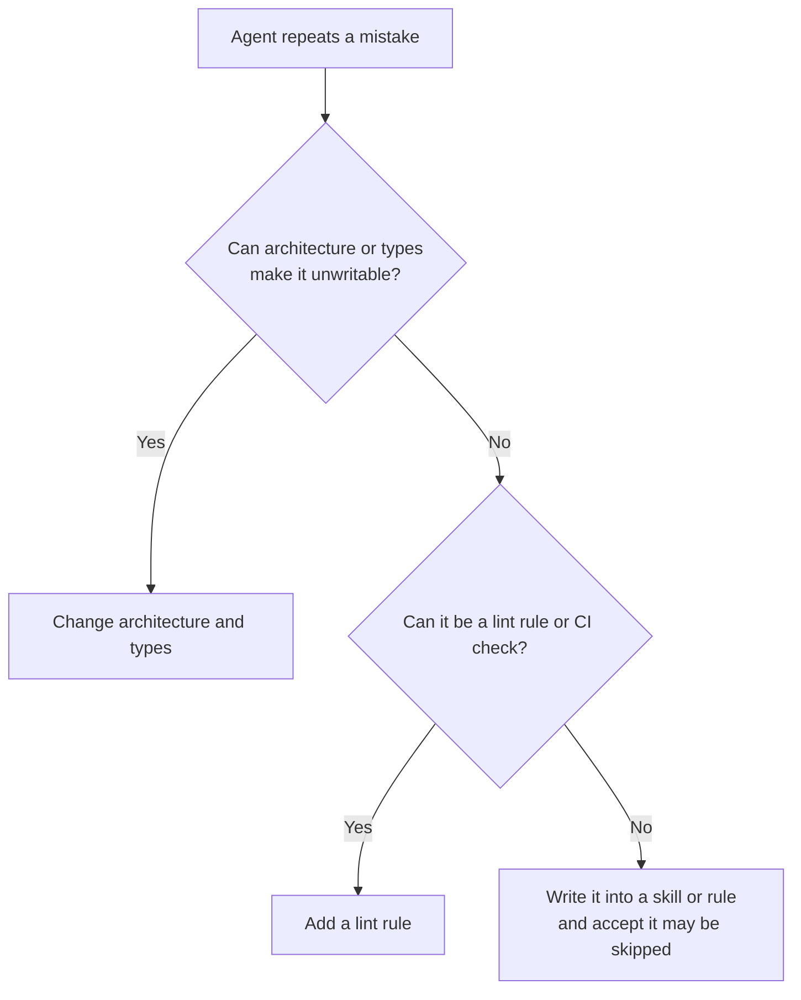

> 🌏 [中文版](/posts/ai/2026-10-07-poteto-trust-ladder-verification-first)

If you already use a coding agent but still have to watch every conversation, this post asks one thing: which parts of Lauren Tan's approach can you try tomorrow, and which depend on conditions only she has?

## What this is

Lauren Tan ([poteto](https://x.com/poteto) online) was on Meta's React team and now works on Cursor's agents window and Grok Bot, both under SpaceXAI. On October 2, 2026, Matt Pocock hosted a [65-minute livestream conversation](https://www.youtube.com/watch?v=MN9dGgmLyso) with her about producing a lot of work with agents without losing quality. Her skills are public under the MIT license as [pstack](https://github.com/cursor/plugins/tree/main/pstack), entered through `/poteto-mode`.

```youtube
url: https://www.youtube.com/watch?v=MN9dGgmLyso
title: Matt Pocock × Lauren Tan livestream (2026-10-02)
```

This is a guided read, not a transcript. I could not get a transcript of the stream. The details of the conversation come from two public write-ups: [a plain-language summary by Agile 3 Uncles (in Chinese)](https://agile3uncles.com/2026/10/04/2500-prs-a-month-her-ai-isnt-smarter-its-workspace-is/) and [PJFP's timestamped chapter summary](https://pjfp.com/poteto-pstack-meat-proxy-coding-agents-spacex/). They agree on the main line; where I could not match an original quote, I say so.

## The number first: 2,500 is self-reported

The PR count differs by source:

- The stream title says "1,000's of PRs".
- Her September 21 [X post](https://x.com/poteto/status/2102050467505430555) says 2,500.
- Cursor's [Compile London schedule](https://cursor.com/compile/london) lists the same talk as "I Shipped 2,000 PRs Last Month".
- An [analysis of the video's auto-captions](https://redreamality.com/blog/lauren-tan-poteto-trust-before-parallel/) says the spoken figure is about 2,000.

All are her own numbers for a month she chose, with no outside audit and no data on how many merged PRs were later reverted. In PJFP's summary she says a good share are small "gardening" fixes. So the figure tells you how finely she slices work, not how much value shipped.

## Who it is for, and prerequisites

It fits people who use coding agents daily and find themselves the bottleneck. You do not need Cursor or pstack; the transferable part is the thinking. The prerequisite is that something in your project can judge right from wrong by code: a runnable app, tests, types, lint.

## Content map

**1. The trust ladder.** She uses a kitchen metaphor: one person watching one agent is a home cook; adding agents without a system is a family crowding into the kitchen, which only makes things worse; then comes the head chef who designs how the kitchen runs; finally the owner who moves between branches. She dislikes "software factory" because the engineer's name is still on what goes out.

**2. A verification skill is the first rung.** At Cursor she started as the "meat proxy" between the agent and Chrome DevTools: reading flame graphs and heap snapshots herself, then relaying them. Her first skill let the agent launch the app, use it, and capture traces. Her definition of a loop follows: it is a loop only if the agent can check its own work.

**3. Deterministic work as code, judgment for the agent.** The verification skill contains a CLI wrapping Playwright and the Chrome DevTools Protocol. She says herself it is not impressive; the point is that every agent shares one toolset instead of rewriting a verification script each time, and behaves consistently. Migrations follow the same rule: prefer codemods over an agent reasoning about each file.

**4. Environment over nagging.** Each time an agent errs, she first asks how to make the mistake impossible to write; the answer is usually a lint rule, a type, or a directory convention. Her internal Dune framework puts each feature in its own directory with an auto-registering registry, leaving one path. Dune has no public page, so treat it as a design idea only.

**5. Outer and inner loops.** The inner loop is the agent writing code from your intent; the outer loop is the new information constantly arriving in Slack, Linear and X. Her personal agent subscribes to those sources and hands work to a cloud coordinator that splits tasks among sub-agents. Giving related bugs to one coordinator makes it easier to spot the shared root cause.

**6. Sample after merge.** The flow: an agent makes a PR, several verifiers exercise the running app, issues get fixed, and it merges automatically; she reads the commit history the next morning. When several agents take the same shortcut, she fixes the skill, lint, or types, not the one agent.

## One concrete example: which layer should a correction live in?

In a separate September 21 talk (as summarized by the caption analysis above), she ranks corrections into five layers, strongest first:

1. Codebase and architecture: make the bad pattern impossible to write.
2. Static analysis: lint, compilers, CI.
3. Rules, Bugbot, skills: advice an agent may not read.
4. Style guides and human review: cannot keep up at volume.
5. Verification skills: prove behavior works, not that performance or code quality is good.



Her habit is to write a lint rule first to stop the bleeding, then let agents clean up the old debt. The official guide's starter example is similarly plain, a goal plus a way to check it:

```text
/poteto-mode the export writes duplicate rows when a retry lands mid-run. repro first, then fix and verify.
```

Source: the [pstack guide](https://github.com/cursor/plugins/blob/main/pstack/docs/guide/README.md).

## Limits

- **Scope**: Asked about irreversible changes (medicine, law, finance), she says, per PJFP's summary, that she has no full answer; the test is whether you can verify to a level you trust. Where you can, one-way doors become two-way doors; where you cannot, auto-merge does not apply.
- **Cost**: Full autopilot spawns several verifiers per PR, and she admits it burns tokens.
- **Heavy prerequisites**: Her codebases were deliberately narrowed to one way of doing things; an early Grok Bot had eight files of 10,000+ lines each and was split under pressure. Most existing projects do not start there.
- **Verification is not quality**: It proves behavior, not good code or good performance.
- **Sourcing**: My description of the conversation is secondhand, and Control Glass and Dune are internal tools. For her exact words, go back to the [original stream](https://www.youtube.com/watch?v=MN9dGgmLyso).

## How to use it: three things for tonight

1. Pick the app you change most and write a command that lets the agent launch it, run one main flow, and leave evidence (a screenshot or trace); have it run after every change.
2. The second time an agent makes the same mistake, stop and ask whether it can become a lint rule, a type, or a directory constraint. Editing the prompt is the last resort.
3. Go through your past chat logs, pick the three things you keep correcting, and write each into a skill or rule. She also advises building your own set rather than copying hers wholesale; Matt's [skills repo](https://github.com/mattpocock/skills) is a reasonable template.

For why harnesses matter, pair this with the site's [Phil Schmid guide](/posts/ai/2026-03-28-phil-schmid-agent-harness-en) and the [meta-harness layering post](/posts/ai/2026-08-26-meta-harness-layers-en).

## References

- [Matt Pocock × Lauren Tan livestream (YouTube, 2026-10-02)](https://www.youtube.com/watch?v=MN9dGgmLyso)
- [Lauren Tan's X post: how i shipped 2,500 PRs last month](https://x.com/poteto/status/2102050467505430555)
- [pstack (cursor/plugins, MIT)](https://github.com/cursor/plugins/tree/main/pstack)
- [pstack guide](https://github.com/cursor/plugins/blob/main/pstack/docs/guide/README.md)
- [Cursor Compile London schedule](https://cursor.com/compile/london)
- [Agile 3 Uncles: the secret of 2,500 PRs a month (in Chinese, secondhand)](https://agile3uncles.com/2026/10/04/2500-prs-a-month-her-ai-isnt-smarter-its-workspace-is/)
- [PJFP: Poteto on pstack (chapter summary, secondhand)](https://pjfp.com/poteto-pstack-meat-proxy-coding-agents-spacex/)
- [Redreamality: Trust First, Then Parallel (caption analysis of the Sept 21 talk)](https://redreamality.com/blog/lauren-tan-poteto-trust-before-parallel/)
- [Matt Pocock's skills repo](https://github.com/mattpocock/skills)
