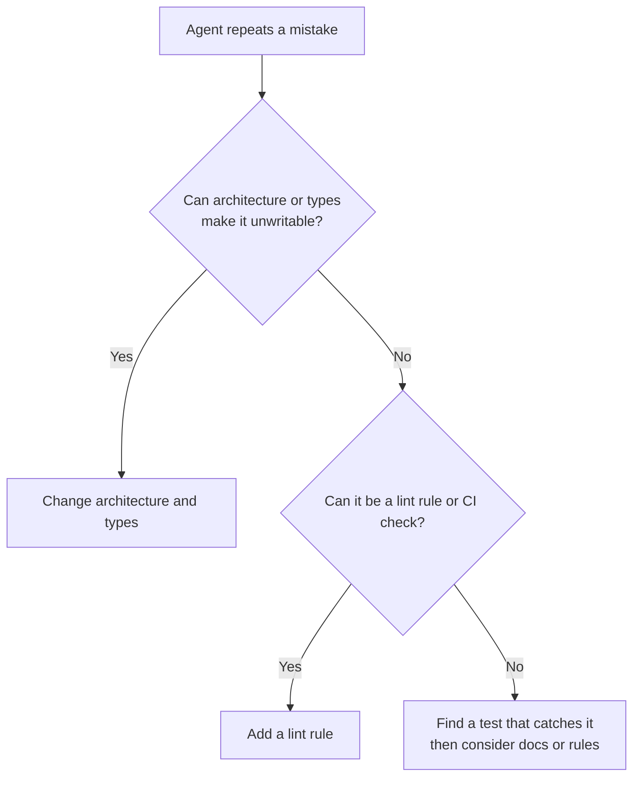

> 🌏 [中文版](/posts/ai/2026-10-07-poteto-trust-ladder-verification-first)

If you already use a coding agent but still have to watch every conversation, this post asks one thing: which parts of Lauren Tan's approach can you try tomorrow, and which depend on conditions only she has?

## What this is

Lauren Tan ([poteto](https://x.com/poteto) online) was on Meta's React team and now works on Cursor's agents window and Grok Bot, both under SpaceXAI. On October 2, 2026, Matt Pocock hosted a [65-minute livestream conversation](https://www.youtube.com/watch?v=MN9dGgmLyso) with her about producing a lot of work with agents without losing quality. Her skills are public under the MIT license as [pstack](https://github.com/cursor/plugins/tree/main/pstack), entered through `/poteto-mode`.

```youtube
url: https://www.youtube.com/watch?v=MN9dGgmLyso
captions: en
title: Matt Pocock × Lauren Tan livestream (2026-10-02)
```

## The number first: 2,500 is self-reported

The PR count differs by source:

- The stream title says "1,000's of PRs".
- Her September 21 [X post](https://x.com/poteto/status/2102050467505430555) says 2,500.
- Cursor's [Compile London schedule](https://cursor.com/compile/london) lists the September 16 event’s talk as "I Shipped 2,000 PRs Last Month".
- An [analysis of the Compile talk's auto-captions](https://redreamality.com/blog/lauren-tan-poteto-trust-before-parallel/) says the spoken figure is about 2,000.

All are her own numbers for a month she chose, with no outside audit and no data on how many merged PRs were later reverted. At about 45:54 in the conversation, she says a good share are small "gardening" fixes. So the figure tells you how finely she slices work, not how much value shipped.

## Who it is for, and prerequisites

It fits people who use coding agents daily and find themselves the bottleneck. You do not need Cursor or pstack; the transferable part is the thinking. The prerequisite is that something in your project can judge right from wrong by code: a runnable app, tests, types, lint.

## Content map

**1. The trust ladder.** Connecting her kitchen metaphors across different parts of the conversation gives this reading: one person watching one agent is a home cook; adding agents without a system is a family crowding into the kitchen, which only makes things worse; then comes the head chef who designs how the kitchen runs; finally the owner who moves between branches. She dislikes the associations of "software factory" that downplay quality and craft, and separately reminds us that the engineer’s reputation remains attached to the work.

**2. A verification skill is the first rung.** At Cursor she started as the "meat proxy" between the agent and Chrome DevTools: reading flame graphs and heap snapshots herself, then relaying them. Her first skill after joining Cursor let the agent launch the app, use it, and capture traces. Her definition of a loop follows: it is a loop only if the agent can check its own work.

**3. Deterministic work as code, judgment for the agent.** The verification skill contains a CLI wrapping Playwright and the Chrome DevTools Protocol. She says herself it is not impressive; the point is that every agent shares one toolset instead of rewriting a verification script each time, and behaves consistently. Migrations follow the same rule: prefer codemods over an agent reasoning about each file.

**4. Environment over nagging.** Each time an agent errs, she first asks how to make the mistake impossible to write; the answer is usually a lint rule, a type, or a directory convention. She describes Dune as a non-open-source internal framework: each feature has its own directory, a registry and codebase scanning discover features, and restrictive lint rules narrow the available patterns. The transferable part is the design idea.

**5. Outer and inner loops.** The inner loop is the agent writing code from your intent; the outer loop is the new information constantly arriving in Slack, Linear and X. Her personal agent subscribes to those sources and hands work to a cloud coordinator that splits tasks among sub-agents. Giving related bugs to one coordinator makes it easier to spot the shared root cause.

**6. Sample after merge.** The flow: an agent makes a PR, several verifiers exercise the running app, issues get fixed, and it merges automatically; she reads the commit history the next morning. When several agents take the same shortcut, she fixes the skill, lint, or types, not the one agent.

## One concrete example: which layer should a correction live in?

The official pstack guide’s [`/correct` section](https://github.com/cursor/plugins/blob/main/pstack/docs/guide/09-make-it-yours.md#fix-the-environment-with-correct) gives four places to fix recurring mistakes, preferring the strongest enforceable option:

1. Architecture or data structures that make the mistake impossible.
2. Types, lint or CI checks that block it and explain the fix.
3. Tests that catch it.
4. Documentation or agent rules when the earlier options do not work; skipping text alone does not fail a check.

This is the current public tool’s correction strategy, rather than a ranking recited in this interview. `/correct` also requires proving a new check fails on a real historical mistake, so adding a plausible rule is not enough.



For recurring errors, look for a fix in code or checks before falling back to written reminders. The official guide's starter example is similarly plain, a goal plus a way to check it:

```text
/poteto-mode the export writes duplicate rows when a retry lands mid-run. repro first, then fix and verify.
```

Source: the [pstack guide](https://github.com/cursor/plugins/blob/main/pstack/docs/guide/README.md).

## Limits

- **Scope**: Matt asks about irreversible changes and domains such as medicine, law and finance. She says programmatically hard-to-verify domains make it harder to reach this level of autonomy, and acknowledges she has no complete answer. Her metaphor of verification turning one-way doors into two-way doors does not mean verification can undo data loss. This article recommends retaining human merge judgment when verification is insufficient or consequences cannot be reversed.
- **Cost**: Full autopilot spawns several verifiers per PR, and she admits it burns tokens.
- **Heavy prerequisites**: Her codebases were deliberately narrowed to one way of doing things; an early Grok Bot had eight files of 10,000+ lines each and was split under pressure. Applying this to an existing project still requires building corresponding tools and constraints.
- **Verification must cover the goal**: Passing existing functional checks does not cover every quality or performance target. She also uses verification tools for performance improvement; those goals need appropriate traces, profiling or benchmarks.
- **Sourcing**: The main claims have been checked against automatic English captions; the practice excerpt has not been checked by listening to the audio. Dune is the internal framework she describes, and the PR numbers and workflow are her own account. For her exact words, go back to the [original stream](https://www.youtube.com/watch?v=MN9dGgmLyso).

## How to use it: three things for tonight

1. Pick the app you change most and write a command that lets the agent launch it, run one main flow, and leave evidence (a screenshot or trace); have it run after every change.
2. The second time an agent makes the same mistake, stop and ask whether it can become a lint rule, a type, or a directory constraint. Editing the prompt is the last resort.
3. Go through your past chat logs, pick the three things you keep correcting, and write each into a skill or rule. She also advises building your own set rather than copying hers wholesale; Matt's [skills repo](https://github.com/mattpocock/skills) is a reasonable template.

For why harnesses matter, pair this with the site's [Phil Schmid guide](/posts/ai/2026-03-28-phil-schmid-agent-harness-en) and the [meta-harness layering post](/posts/ai/2026-08-26-meta-harness-layers-en).

## Shadowing with captions on the source player

Practice three continuous passages of 31–51 seconds: verification, shared tools, and sampling. This is **shadowing with captions on the source player**, not an in-page bilingual transcript. This page provides one short locator quotation and paraphrased comprehension notes; it does not print the full English passages or sentence-by-sentence Chinese translations.

For each clip, press CC and select English. To read the passage as a list of sentences, open its timed link on YouTube, expand the video description and choose “Show transcript,” then follow only the marked start/end range. The transcript appears on YouTube, outside this page; the embed may not expose that panel.

### Original audio: 15:54–16:01, Matt

```youtube
url: https://www.youtube.com/watch?v=MN9dGgmLyso
title: Poteto shadowing audio: Matt on verification (15:54–16:01)
start: 954
end: 961
captions: en
loop: true
```

### Short locator quotation from the original captions

> So the thing I I loved about watching that talk is the amount of focus you put in verification

### Chinese meaning

所以，我看那場演講時很喜歡的一點，就是你把很多心力放在驗證上。

The repeated word preserves the speaker’s conversational phrasing. This excerpt has been checked against automatic English captions and surrounding text, but not by listening to the audio. Use the original audio as your reference.

### Three continuous topic clips

**1. Verification gives agents hands and eyes — 16:43–17:14 (31 seconds).** Lauren explains running the app, interacting with it, taking traces and snapshots, and how her first Cursor skill helped build trust. Listen for the connection between inspecting results and trusting an agent. After listening, explain what the agent can now do without a human proxy.

```youtube
url: https://www.youtube.com/watch?v=MN9dGgmLyso
title: Verification: hands and eyes (16:43–17:14)
start: 1003
end: 1034
captions: en
loop: true
```

[Open 16:43 on YouTube to use CC or Show transcript](https://www.youtube.com/watch?v=MN9dGgmLyso&t=1003s).

**2. Stop rebuilding verification tools — 22:47–23:38 (51 seconds).** Lauren describes agents recreating scripts differently on each run, then sharing one CLI through the skill. Listen for the problem, its cost, and the reusable solution. Summarize why this saves time as well as context.

```youtube
url: https://www.youtube.com/watch?v=MN9dGgmLyso
title: A shared verification CLI (22:47–23:38)
start: 1367
end: 1418
captions: en
loop: true
```

[Open 22:47 on YouTube to use CC or Show transcript](https://www.youtube.com/watch?v=MN9dGgmLyso&t=1367s).

**3. Sample the work and adjust the process — 49:34–50:20 (46 seconds).** Lauren moves from tasting food to sampling PRs and scrutinizing patterns in agent-written code. Listen for why scale changes the review approach. Explain what sampling still requires a person to inspect.

```youtube
url: https://www.youtube.com/watch?v=MN9dGgmLyso
title: Sampling agent-written work (49:34–50:20)
start: 2974
end: 3020
captions: en
loop: true
```

[Open 49:34 on YouTube to use CC or Show transcript](https://www.youtube.com/watch?v=MN9dGgmLyso&t=2974s).

The players’ synchronized captions provide the full passages. The single short quotation above helps you locate the discussion; it is not the complete practice text. These ranges were selected from automatic captions, without an audio-listening check.

### Practice

1. Start with clip 1. Listen to all 31 seconds with the player’s English captions; use CC to select English if needed. Explain the main idea before repeating it.
2. On the second pass, shadow the whole clip slightly behind the speaker. Use 0.75× speed if needed and pause at natural thought boundaries.
3. Repeat once with captions and once without them. Retell the point in your own English; matching the idea matters more than copying hesitations.
4. Move to clip 2, then clip 3, following the same progression. Compare their roles: inspecting results, reusing tools, and reviewing patterns. Each player requests looping; if it does not return to the range, reopen the video at its start timestamp.

For a longer passage, open the [original video](https://www.youtube.com/watch?v=MN9dGgmLyso&t=954s) with English captions or “Show transcript,” then continue through Matt’s question and Lauren’s answer. This article quotes a short passage; the original player provides the full captions.

### Extend it to your own work

These sentences were written for this site for substitution practice; they are not the audio’s captions:

- **The agent should check its work before I review it.** 我審查之前，agent 應該先檢查自己的工作。
- **Automated checks let me spend less time on routine reviews.** 自動檢查讓我少花一些時間審查例行工作。

Finish with: **What can the agent check without my help?** Name one task that can be checked automatically and one that still needs your judgment.

## Update history

- 2026-10-10: Labeled the exercises as shadowing with source-player captions; distinguished short quotes and paraphrased notes from complete bilingual transcripts, and added timed source/transcript instructions.

- 2026-10-10: Added three continuous 31–51-second topic clips with synchronized English captions, comprehension prompts and a listening-to-shadowing progression; kept the short quote as a locator.

- 2026-10-10: Checked the main claims against original interview captions; clarified Dune, verification coverage and irreversible changes; corrected the Compile event date and replaced the correction ranking with the official pstack `/correct` guide.

- 2026-10-10: Replaced isolated phrases with a coherent caption excerpt, corresponding audio player, English captions, playback range, and practice steps.
- 2026-10-10: Retrieved automatic English captions and added short excerpts, Chinese comparisons, and original speaking exercises. Caption text checked; audio verification pending.

## References

- [Matt Pocock × Lauren Tan livestream (YouTube, 2026-10-02)](https://www.youtube.com/watch?v=MN9dGgmLyso)
- [Lauren Tan's X post: how i shipped 2,500 PRs last month](https://x.com/poteto/status/2102050467505430555)
- [pstack (cursor/plugins, MIT)](https://github.com/cursor/plugins/tree/main/pstack)
- [pstack guide](https://github.com/cursor/plugins/blob/main/pstack/docs/guide/README.md)
- [pstack guide: Make it yours (`/correct` enforcement levels)](https://github.com/cursor/plugins/blob/main/pstack/docs/guide/09-make-it-yours.md)
- [Cursor Compile London schedule](https://cursor.com/compile/london)
- [Agile 3 Uncles: the secret of 2,500 PRs a month (in Chinese, secondhand)](https://agile3uncles.com/2026/10/04/2500-prs-a-month-her-ai-isnt-smarter-its-workspace-is/)
- [PJFP: Poteto on pstack (chapter summary, secondhand)](https://pjfp.com/poteto-pstack-meat-proxy-coding-agents-spacex/)
- [Redreamality: Trust First, Then Parallel (Compile talk caption analysis, secondhand)](https://redreamality.com/blog/lauren-tan-poteto-trust-before-parallel/)
- [Matt Pocock's skills repo](https://github.com/mattpocock/skills)
