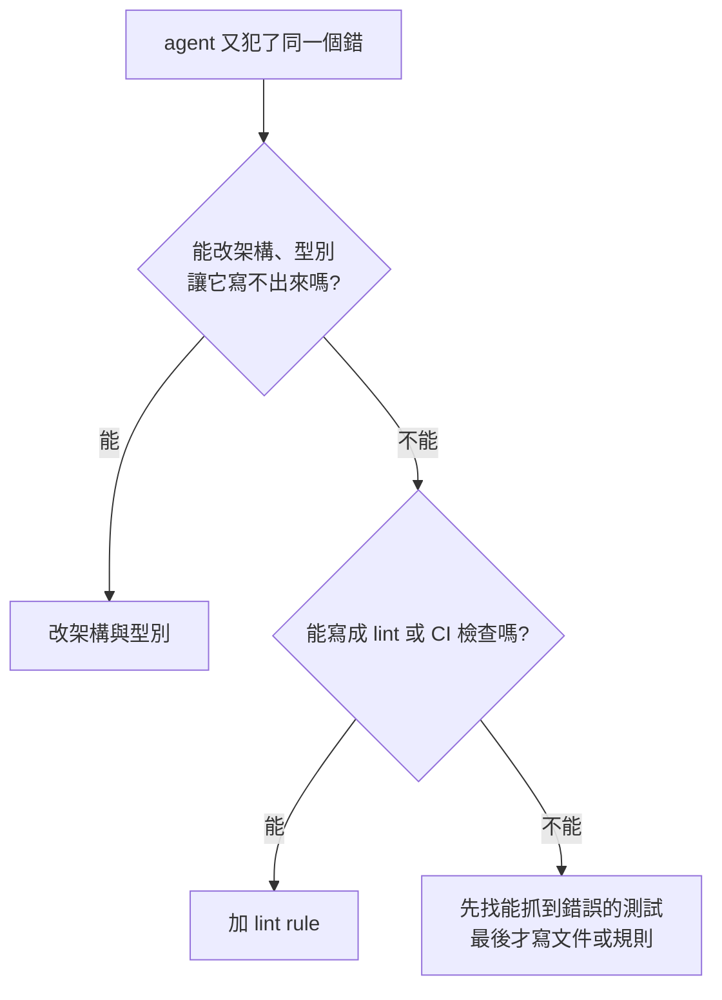

> 🌏 [English version](/posts/ai/2026-10-07-poteto-trust-ladder-verification-first-en)

如果你已經用 coding agent 寫 code，卻還是得一個對話一個對話盯著，這篇想回答的是：Lauren Tan 的做法裡，哪些你明天就能試，哪些其實靠她自己的條件才成立。

## 這是什麼

Lauren Tan（網名 [poteto](https://x.com/poteto)）曾在 Meta 的 React 團隊，現在做 Cursor 的 agents window 與 Grok Bot，兩者都隸屬 SpaceXAI。2026 年 10 月 2 日，Matt Pocock 為她開了一場 [65 分鐘的直播對談](https://www.youtube.com/watch?v=MN9dGgmLyso)，談她怎麼讓 agent 大量產出又維持品質。她的整套 skill 以 MIT 授權公開在 [pstack](https://github.com/cursor/plugins/tree/main/pstack)，入口是 `/poteto-mode`。

```youtube
url: https://www.youtube.com/watch?v=MN9dGgmLyso
captions: en
title: Matt Pocock × Lauren Tan 直播對談（2026-10-02）
```

## 先講數字：2,500 只是她的自述

標題裡的 PR 數量，各處說法不同：

- 直播標題寫「1,000's of PRs」。
- 她 9 月 21 日在 X 的[貼文](https://x.com/poteto/status/2102050467505430555)寫 2,500。
- Cursor 的 [Compile London 議程](https://cursor.com/compile/london)列出 9 月 16 日活動的講題「I Shipped 2,000 PRs Last Month」。
- 一份對 Compile 演講自動字幕的[分析](https://redreamality.com/blog/lauren-tan-poteto-trust-before-parallel/)指出，口述的數字約是 2,000。

這些都是她自己說的月份與數字，沒有外部稽核，也看不出合併後有多少沒被回退。對談約 45:54，她提到相當一部分是「園藝」型的小修維護。所以這個數字拿來判斷「她把工作切得多細」比較合理，拿來比較產出價值就不太站得住。

## 給誰、需要什麼前提

適合已經天天用 coding agent、卻發現自己是瓶頸的人。不需要用 Cursor 或 pstack；對談裡真正值得拿走的是思路。前提是你的專案要有能被程式判斷對錯的東西，例如能跑起來的 app、測試、型別、lint。

## 內容地圖

**1. 信任階梯**。把她在對談不同段落的廚房比喻串起來，可以這樣理解：一個人盯一個 agent 是家庭廚師；多開幾個 agent 卻沒有制度，像全家擠進廚房，只會更亂；接著是設計廚房運作的主廚，最後才是同時巡視多家分店。她不喜歡「軟體工廠」容易淡化品質與手藝的聯想，也提醒工程師的名字仍掛在出品上。

**2. 驗證 skill 是第一階**。她在 Cursor 一開始是 agent 和 Chrome DevTools 之間的「meat proxy」：自己看 flame graph、heap snapshot，再轉述給 agent。她加入 Cursor 後做的第一個 skill，就是讓 agent 自己把 app 跑起來、操作、抓 trace。她對 loop 的定義也由此而來：agent 能自己檢查自己的成果，才算 loop。

**3. 確定的事寫成程式，判斷留給 agent**。驗證 skill 裡有一支包住 Playwright 與 Chrome DevTools Protocol 的 CLI。她自己說它沒有多厲害，重點是每個 agent 共用同一套工具，不用每次重寫一次驗證腳本，而且行為一致。技術遷移也一樣，優先用 codemod，而不是讓 agent 一個檔案一個檔案想。

**4. 用環境取代叮嚀**。每次 agent 犯錯，她先問「怎麼讓這個錯誤寫不出來」，答案多半是 lint rule、型別或目錄慣例。她說，Dune 是非開源的內部框架，每個 feature 放在自己的目錄，透過 registry 與掃描 codebase 找到 feature，再配合嚴格的 lint rule 收斂寫法。這裡能借的是設計思路。

**5. 外循環與內循環**。內循環是 agent 照你給的意圖寫 code；外循環是 Slack、Linear、X 上不斷冒出來的新資訊。她讓個人 agent 訂閱這些來源，再轉給雲端的 coordinator，由它拆任務給 sub-agent。同一批相關的 bug 交給同一個 coordinator，比較容易看出共同根因。

**6. 合併後抽樣**。流程是 agent 做完 PR、多個 verifier 實際操作 app 找問題、修完、自動合併；她隔天早上看 commit history。發現好幾個 agent 都走同一條捷徑，就回去修 skill、lint、型別，不修那一個 agent。

## 一個具體例子：修正該放在哪一層

pstack 官方 guide 的 [`/correct` 說明](https://github.com/cursor/plugins/blob/main/pstack/docs/guide/09-make-it-yours.md#fix-the-environment-with-correct)把反覆犯錯的修正分成四層，優先選能確實擋住錯誤的那一層：

1. 架構或資料結構：讓錯誤根本寫不出來。
2. 型別、lint 或 CI 檢查：擋下錯誤，並在錯誤訊息指出怎麼修。
3. 測試：讓錯誤被抓到。
4. 文件或 agent 規則：前三層做不到時才寫成提醒，因為略過文字本身不會讓檢查失敗。

這是目前公開工具的修正策略，不是這場對談逐字列出的排名。`/correct` 還要求用真實的歷史錯誤證明新檢查會失敗，避免只新增一條看起來有用的規則。



所以，看到重複錯誤時，先找能落在程式與檢查裡的修正，再考慮文字提醒。官方 guide 的入門例子也很樸素，只給目標與驗收方式：

```text
/poteto-mode the export writes duplicate rows when a retry lands mid-run. repro first, then fix and verify.
```

出處：[pstack guide](https://github.com/cursor/plugins/blob/main/pstack/docs/guide/README.md)。

## 限制

- **適用範圍**：Matt 問到無法回頭的變更，以及醫療、法律、金融等領域時，她說，越難用程式驗證，越難走到放手這一步，也承認沒有完整答案。她把充分驗證比喻成讓單向門變成雙向門，但這不代表驗證能撤銷已發生的資料損失。本文的建議是：驗證不足或後果無法回復時，保留人工合併判斷。
- **成本**：full autopilot 每個 PR 開多個 verifier，她承認很耗 token。
- **前提很重**：她的專案被刻意收斂成「只有一種做法」，Grok Bot 早期甚至有八個各一萬行以上的檔案，是被逼著拆開才建立這套約束。搬到自己的既有專案時，仍得先建立相應工具與約束。
- **驗證要覆蓋目標**：通過既有功能檢查，不代表所有品質與效能目標都已覆蓋。她也用驗證工具做效能改善；效能目標仍需要對應的 trace、profiling 或 benchmark。
- **來源**：正文主要主張已對照英文自動字幕，文末短摘錄尚未回聽原音。Dune 是她描述的內部框架；PR 數字與工作流程是她的自述。要引用她的原話，請回頭看[原始直播](https://www.youtube.com/watch?v=MN9dGgmLyso)。

## 怎麼用：今晚能做的三件事

1. 挑你最常改的 app，寫一支指令讓 agent 能自己啟動、操作一條主要流程並留下證據（截圖或 trace），再讓它在每次改動後執行。
2. 下次 agent 第二次犯同一個錯，先停下來問：能不能寫成 lint rule、型別或目錄限制？只改提示詞是最後手段。
3. 翻你過去的對話紀錄，挑出你反覆糾正的三件事，各寫成一條 skill 或規則。她也建議每個人養自己的一套 skill，不要整包照搬；Matt 的 [skills 庫](https://github.com/mattpocock/skills)可以當範本。

想了解 harness 為什麼是這幾年的重點，可以搭配站內的 [Phil Schmid 導讀](/posts/ai/2026-03-28-phil-schmid-agent-harness)與 [meta-harness 分層整理](/posts/ai/2026-08-26-meta-harness-layers)。

## 英文跟讀：原音和字幕一起練

練三段 31–51 秒的連續內容：驗證、共用工具、抽樣檢查。下面的短句用來定位主題，真正的跟讀素材是後面的三個長段落播放器；完整英文字幕跟著原播放器同步顯示。

### 原音：15:54–16:01，Matt

```youtube
url: https://www.youtube.com/watch?v=MN9dGgmLyso
title: Poteto 跟讀原音：Matt 談驗證（15:54–16:01）
start: 954
end: 961
captions: en
loop: true
```

### 英文原字幕

> So the thing I I loved about watching that talk is the amount of focus you put in verification

### 中文意思

所以，我看那場演講時很喜歡的一點，就是你把很多心力放在驗證上。

字幕中的重複字保留講者口語，不先改成書面句子。這段已對照英文自動字幕與前後文；尚未逐句回聽核對，練習以播放器原音為準。

### 三段連續主題練習

**1. 讓 agent 有手有眼：16:43–17:14（31 秒）。** Lauren 說明 agent 如何跑 app、操作、取得 trace 與 snapshot，以及她加入 Cursor 後的第一個 skill 如何幫她建立信任。聽的重點是「看得到成果」與「敢信任 agent」的關係。聽完試著說明：哪些工作不用再由人當傳輸線？

```youtube
url: https://www.youtube.com/watch?v=MN9dGgmLyso
title: 驗證：讓 agent 有手有眼（16:43–17:14）
start: 1003
end: 1034
captions: en
loop: true
```

**2. 別每次重造驗證工具：22:47–23:38（51 秒）。** Lauren 描述 agent 每次各自重寫腳本的浪費，以及把 CLI 放進 skill、讓大家共用的解法。聽的重點是問題、代價與可重用的解法。聽完用自己的英文解釋：為什麼省的不只是 context，還有時間？

```youtube
url: https://www.youtube.com/watch?v=MN9dGgmLyso
title: 共用驗證 CLI（22:47–23:38）
start: 1367
end: 1418
captions: en
loop: true
```

**3. 抽樣成果，檢查流程：49:34–50:20（46 秒）。** Lauren 從試吃每一道菜，轉到抽樣 PR、仔細看 agent 寫出的程式與重複模式。聽的重點是工作量變大後，review 如何改變。聽完說明：抽樣仍需要人檢查哪些東西？

```youtube
url: https://www.youtube.com/watch?v=MN9dGgmLyso
title: 抽樣檢查 agent 的成果（49:34–50:20）
start: 2974
end: 3020
captions: en
loop: true
```

完整段落以播放器的同步英文字幕為準。上面的單句短摘錄只是定位，不是整份跟讀文字；這三段範圍依自動字幕選取，尚未回聽原音核對。

### 跟讀方式

1. 先從第一段開始，完整聽 31 秒，同時看播放器的英文字幕。沒有字幕就按 CC，再選英文；先說得出意思，再開始跟讀。
2. 第二輪稍微落後講者，跟讀整段。太快就調成 0.75 倍，並在意思完整的地方暫停。
3. 看字幕再練一次，接著關字幕練一次。最後用自己的英文重述，不必照抄講者的停頓與重複字。
4. 接著練第二、第三段，沿用同樣順序。比較三段各在解決什麼：看成果、共用工具、檢查重複模式。播放器設定為重播；若沒回到段落，依起始時間重新定位原影片。

要練更長的連續內容，開啟[原始影片](https://www.youtube.com/watch?v=MN9dGgmLyso&t=954s)的英文字幕或「顯示文字記錄」，接著聽 Matt 的提問與 Lauren 的回答。本文引用一個短段落，完整字幕由原播放器提供。

### 延伸：換成自己的工作

以下是本站自擬練習句，用來換詞練口說，不是原音字幕：

- **The agent should check its work before I review it.** 我審查之前，agent 應該先檢查自己的工作。
- **Automated checks let me spend less time on routine reviews.** 自動檢查讓我少花一些時間審查例行工作。

最後試著回答：**What can the agent check without my help?** 列一項能自動檢查的工作，再列一項仍需要你判斷的工作。

## 更新紀錄

- 2026-10-10：加入三段 31–51 秒連續主題播放器、同步英文字幕、理解重點與跟讀順序；短摘錄保留作定位。

- 2026-10-10：正文對照原始對談字幕，修正 Dune、驗證範圍與不可逆變更的表述；修正 Compile 活動日期，改以 pstack 官方 `/correct` guide 說明修正層級。

- 2026-10-10：跟讀區改為完整意思的原字幕短段落，加入對應原音播放器、英文同步字幕、播放範圍與練習步驟。
- 2026-10-10：取得英文自動字幕，補上字幕短摘錄、中文對照與自擬口說練習；短摘錄已核對字幕，原音回聽待核對。

## 參考資料

- [Matt Pocock × Lauren Tan 直播對談（YouTube，2026-10-02）](https://www.youtube.com/watch?v=MN9dGgmLyso)
- [Lauren Tan 的 X 貼文：how i shipped 2,500 PRs last month](https://x.com/poteto/status/2102050467505430555)
- [pstack（cursor/plugins，MIT）](https://github.com/cursor/plugins/tree/main/pstack)
- [pstack guide](https://github.com/cursor/plugins/blob/main/pstack/docs/guide/README.md)
- [pstack guide：Make it yours（`/correct` 修正層級）](https://github.com/cursor/plugins/blob/main/pstack/docs/guide/09-make-it-yours.md)
- [Cursor Compile London 議程](https://cursor.com/compile/london)
- [敏捷三叔公：一個月 2,500 個 PR 的秘密（中文，二手整理）](https://agile3uncles.com/2026/10/04/2500-prs-a-month-her-ai-isnt-smarter-its-workspace-is/)
- [PJFP：Poteto on pstack（章節摘要，二手整理）](https://pjfp.com/poteto-pstack-meat-proxy-coding-agents-spacex/)
- [Redreamality：Trust First, Then Parallel（Compile 演講字幕分析，二手來源）](https://redreamality.com/blog/lauren-tan-poteto-trust-before-parallel/)
- [Matt Pocock skills 庫](https://github.com/mattpocock/skills)
