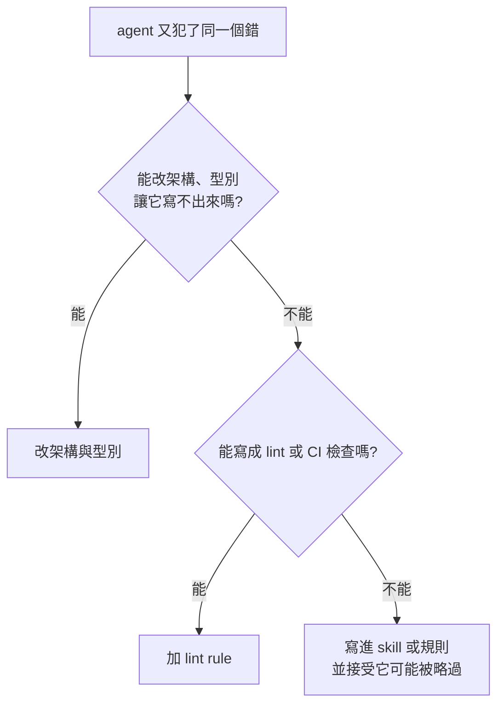

> 🌏 [English version](/en/posts/ai/2026-10-07-poteto-trust-ladder-verification-first-en)

如果你已經用 coding agent 寫 code，卻還是得一個對話一個對話盯著，這篇想回答的是：Lauren Tan 的做法裡，哪些你明天就能試，哪些其實靠她自己的條件才成立。

## 這是什麼

Lauren Tan（網名 [poteto](https://x.com/poteto)）曾在 Meta 的 React 團隊，現在做 Cursor 的 agents window 與 Grok Bot，兩者都隸屬 SpaceXAI。2026 年 10 月 2 日，Matt Pocock 為她開了一場 [65 分鐘的直播對談](https://www.youtube.com/watch?v=MN9dGgmLyso)，談她怎麼讓 agent 大量產出又維持品質。她的整套 skill 以 MIT 授權公開在 [pstack](https://github.com/cursor/plugins/tree/main/pstack)，入口是 `/poteto-mode`。

```youtube
url: https://www.youtube.com/watch?v=MN9dGgmLyso
title: Matt Pocock × Lauren Tan 直播對談（2026-10-02）
```

這篇是導讀，不是逐字稿。我沒能取得直播的逐字稿，對談的細節主要依據兩份公開整理：[敏捷三叔公的白話整理](https://agile3uncles.com/2026/10/04/2500-prs-a-month-her-ai-isnt-smarter-its-workspace-is/)，以及 [PJFP 附時間碼的章節摘要](https://pjfp.com/poteto-pstack-meat-proxy-coding-agents-spacex/)。兩份的主線一致；沒有對照到原話的地方，下文都寫明是轉述。

## 先講數字：2,500 只是她的自述

標題裡的 PR 數量，各處說法不同：

- 直播標題寫「1,000's of PRs」。
- 她 9 月 21 日在 X 的[貼文](https://x.com/poteto/status/2102050467505430555)寫 2,500。
- Cursor 的 [Compile London 議程](https://cursor.com/compile/london)把同一場講題列成「I Shipped 2,000 PRs Last Month」。
- 一份對該影片自動字幕的[分析](https://redreamality.com/blog/lauren-tan-poteto-trust-before-parallel/)指出，口述的數字約是 2,000。

這些都是她自己說的月份與數字，沒有外部稽核，也看不出合併後有多少沒被回退。PJFP 整理的對談裡，她提到相當一部分是「園藝」型的小修維護。所以這個數字拿來判斷「她把工作切得多細」比較合理，拿來比較產出價值就不太站得住。

## 給誰、需要什麼前提

適合已經天天用 coding agent、卻發現自己是瓶頸的人。不需要用 Cursor 或 pstack；對談裡真正值得拿走的是思路。前提是你的專案要有能被程式判斷對錯的東西，例如能跑起來的 app、測試、型別、lint。

## 內容地圖

**1. 信任階梯**。她用廚房比喻：一個人盯一個 agent 是家庭廚師；多開幾個 agent 卻沒有制度，像全家擠進廚房，只會更亂；接著是設計廚房運作的主廚，最後才是同時巡視多家分店。她不喜歡「軟體工廠」這個詞，因為工程師的名字還是掛在出品上。

**2. 驗證 skill 是第一階**。她在 Cursor 一開始是 agent 和 Chrome DevTools 之間的「meat proxy」：自己看 flame graph、heap snapshot，再轉述給 agent。她做的第一個 skill，就是讓 agent 自己把 app 跑起來、操作、抓 trace。她對 loop 的定義也由此而來：agent 能自己檢查自己的成果，才算 loop。

**3. 確定的事寫成程式，判斷留給 agent**。驗證 skill 裡有一支包住 Playwright 與 Chrome DevTools Protocol 的 CLI。她自己說它沒有多厲害，重點是每個 agent 共用同一套工具，不用每次重寫一次驗證腳本，而且行為一致。技術遷移也一樣，優先用 codemod，而不是讓 agent 一個檔案一個檔案想。

**4. 用環境取代叮嚀**。每次 agent 犯錯，她先問「怎麼讓這個錯誤寫不出來」，答案多半是 lint rule、型別或目錄慣例。她內部的 Dune 框架每個 feature 一個目錄、靠 registry 自動註冊，等於只留一條路；Dune 沒有公開頁面，只能當設計思路參考。

**5. 外循環與內循環**。內循環是 agent 照你給的意圖寫 code；外循環是 Slack、Linear、X 上不斷冒出來的新資訊。她讓個人 agent 訂閱這些來源，再轉給雲端的 coordinator，由它拆任務給 sub-agent。同一批相關的 bug 交給同一個 coordinator，比較容易看出共同根因。

**6. 合併後抽樣**。流程是 agent 做完 PR、多個 verifier 實際操作 app 找問題、修完、自動合併；她隔天早上看 commit history。發現好幾個 agent 都走同一條捷徑，就回去修 skill、lint、型別，不修那一個 agent。

## 一個具體例子：修正該放在哪一層

另一場 9 月 21 日的演講（前述字幕分析整理）談到，她把「糾正 agent」按效力排成五層，由強到弱：

1. 程式庫與架構：讓壞寫法根本寫不出來。
2. 靜態分析：lint、編譯器、CI。
3. 規則、Bugbot、skill：屬於建議，agent 可能沒讀到。
4. 風格指南與人工 review：量一大就做不完。
5. 驗證 skill：能證明行為正確，但不保證效能或程式品質。



她的實務習慣是看到壞模式先寫 lint rule 止血，再讓 agent 慢慢清舊債。官方 guide 的入門例子也很樸素，只給目標與驗收方式：

```text
/poteto-mode the export writes duplicate rows when a retry lands mid-run. repro first, then fix and verify.
```

出處：[pstack guide](https://github.com/cursor/plugins/blob/main/pstack/docs/guide/README.md)。

## 限制

- **適用範圍**：Matt 問到無法回頭的變更（醫療、法律、金融）時，依 PJFP 的整理，她回答沒有完整答案，判準是你能不能把驗證做到你信任的程度。能驗證的領域，單向門會變雙向門；做不到的領域，自動合併就不成立。
- **成本**：full autopilot 每個 PR 開多個 verifier，她承認很耗 token。
- **前提很重**：她的專案被刻意收斂成「只有一種做法」，Grok Bot 早期甚至有八個各一萬行以上的檔案，是被逼著拆開才建立這套約束。多數既有專案沒有這個起點。
- **驗證不等於品質**：驗證 skill 證明行為對，不證明程式好或效能夠。
- **來源**：本文對對談的描述屬二手轉述，Control Glass 與 Dune 都是內部工具；要引用她的原話，請回頭看[原始直播](https://www.youtube.com/watch?v=MN9dGgmLyso)。

## 怎麼用：今晚能做的三件事

1. 挑你最常改的 app，寫一支指令讓 agent 能自己啟動、操作一條主要流程並留下證據（截圖或 trace），再讓它在每次改動後執行。
2. 下次 agent 第二次犯同一個錯，先停下來問：能不能寫成 lint rule、型別或目錄限制？只改提示詞是最後手段。
3. 翻你過去的對話紀錄，挑出你反覆糾正的三件事，各寫成一條 skill 或規則。她也建議每個人養自己的一套 skill，不要整包照搬；Matt 的 [skills 庫](https://github.com/mattpocock/skills)可以當範本。

想了解 harness 為什麼是這幾年的重點，可以搭配站內的 [Phil Schmid 導讀](/posts/ai/2026-03-28-phil-schmid-agent-harness)與 [meta-harness 分層整理](/posts/ai/2026-08-26-meta-harness-layers)。

## 參考資料

- [Matt Pocock × Lauren Tan 直播對談（YouTube，2026-10-02）](https://www.youtube.com/watch?v=MN9dGgmLyso)
- [Lauren Tan 的 X 貼文：how i shipped 2,500 PRs last month](https://x.com/poteto/status/2102050467505430555)
- [pstack（cursor/plugins，MIT）](https://github.com/cursor/plugins/tree/main/pstack)
- [pstack guide](https://github.com/cursor/plugins/blob/main/pstack/docs/guide/README.md)
- [Cursor Compile London 議程](https://cursor.com/compile/london)
- [敏捷三叔公：一個月 2,500 個 PR 的秘密（中文，二手整理）](https://agile3uncles.com/2026/10/04/2500-prs-a-month-her-ai-isnt-smarter-its-workspace-is/)
- [PJFP：Poteto on pstack（章節摘要，二手整理）](https://pjfp.com/poteto-pstack-meat-proxy-coding-agents-spacex/)
- [Redreamality：Trust First, Then Parallel（9 月 21 日演講字幕分析）](https://redreamality.com/blog/lauren-tan-poteto-trust-before-parallel/)
- [Matt Pocock skills 庫](https://github.com/mattpocock/skills)
